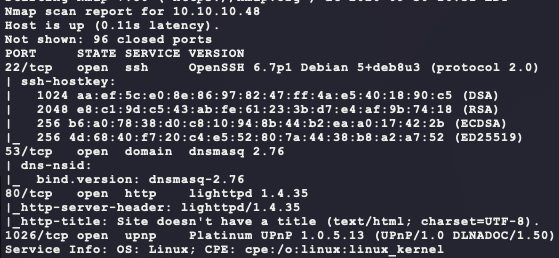
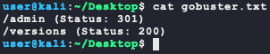
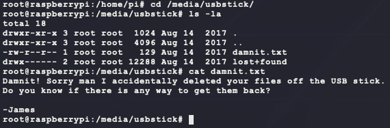

# [Mirai](https://app.hackthebox.eu/machines/64)

Start with `nmap`:

```bash
# find open TCP ports
sudo masscan -p1-65535 10.10.10.48 --rate=1000 -e tun0 > masscan.txt
tcpports=$(cat masscan.txt | cut -d ' ' -f 4 | cut -d '/' -f 1 | sort -n | tr '\n' ',' | sed 's/,$//')
# TCP deep scan
sudo nmap -sS --script "default,safe" -p $tcpports -oA tcp --open -Pn -sV 10.10.10.48 &
# TCP quick scan
sudo nmap -sS -sC -F --open -Pn -sV 10.10.10.48
# UDP quick scan
sudo nmap -sU -F --open -Pn -sV 10.10.10.48
```

The TCP quick scan returns the following:



Looking at DNS for any domains does not work:

```bash
host -t ns 10.10.10.48 10.10.10.48
```


With all the services and versions, look for exploits:

```bash
searchsploit dnsmasq 2.76
searchsploit lighttpd 1.4
searchsploit platinum upnp
```


Of the ones that are applicable, they are all under the DOS category. Moving on... Start the following web scanners:

```bash
# install scanner
sudo apt install gobuster
# prevent file access error during scanning
ulimit -n 8192
# start scanners
nikto -h http://10.10.10.48/ --maxtime=120s --output=nikto.txt
gobuster dir -t 100 -q -z -o gobuster.txt \
  -w /usr/share/wordlists/dirbuster/directory-list-2.3-medium.txt\
  -u http://10.10.10.48/ &
```

The `gobuster` scan returns some interesting directories:



Looking at `http://10.10.10.48/versions` returns a text file with the following content:

```
,v3.1.4,v3.1,v2.1
```

Nothing interesting here. Browsing to `/admin` shows the following:


Okay, getting somewhere. Looking at the bottom of the page fixes the mystery of `/versions`:


Searching for exploits returns the following:

```bash
searchsploit pi hole
```


These require valid credentials. Moving on... The full `nmap` TCP can should have finished and returns a new port & service:

- `32400/tcp open  http    Plex Media Server httpd`

This webserver has the following login page:


Trying some simple logins does not work and looking for exploits does not turn up much :


At this point, some more Goolge searches shows that the Pi-Hole service is used on RaspberryPi's for network-wide Ad blocking:

- https://pi-hole.net/
- https://www.smarthomebeginner.com/pi-hole-setup-guide/

RaspberryPis have a default login for their pre-built images `pi/raspberry`:

- https://www.raspberrypi.org/documentation/linux/usage/users.md

Trying this login for SSH provides an easy login & `user.txt`:

```bash
find / -iname user.txt -exec ls -lad {} \; 2>/dev/null
```


Further enumeration shows that this user also has full access as `root` via `sudo` without having to know the password:

```bash
sudo -l
```


However, `root.txt` is not as easy:

```bash
sudo su
find / -iname root.txt -exec ls -lad {} \; 2>/dev/null
```


From this, look at mounted devices:

```bash
mount
lsblk
```


Seems like the USB stick is mounted at `/media/usbstick`. However, this still does not give `root.txt`:

```bash
cd /media/usbstick
ls -la
cat damnit.txt
```



If the files were just "deleted" and not wiped, then it is possible that the contents of `root.txt` are still on the USB:

```bash
dd if=/dev/sdb of=/tmp/usb.img conv=sync,noerror
strings /tmp/usb.img
```


And this returns the flag!